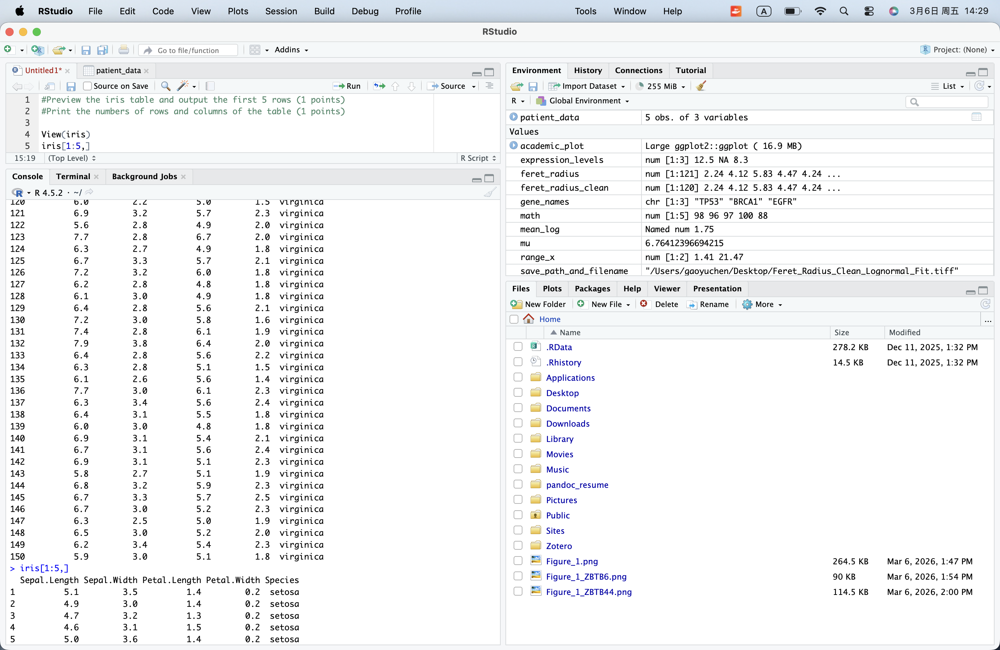
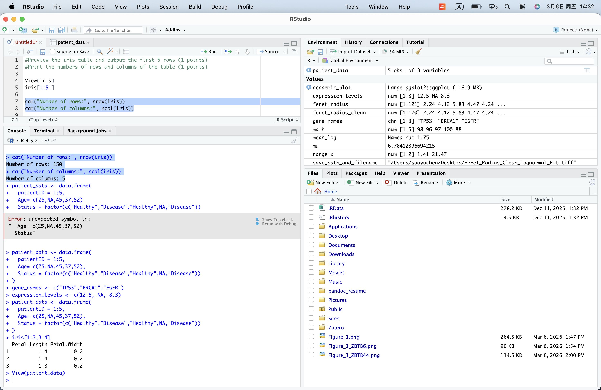
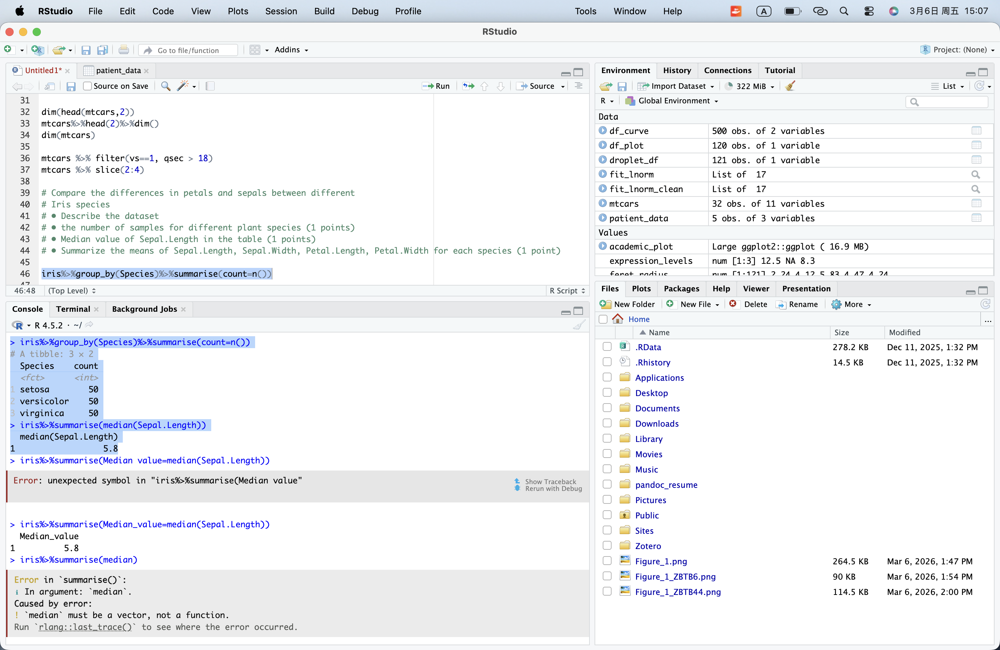
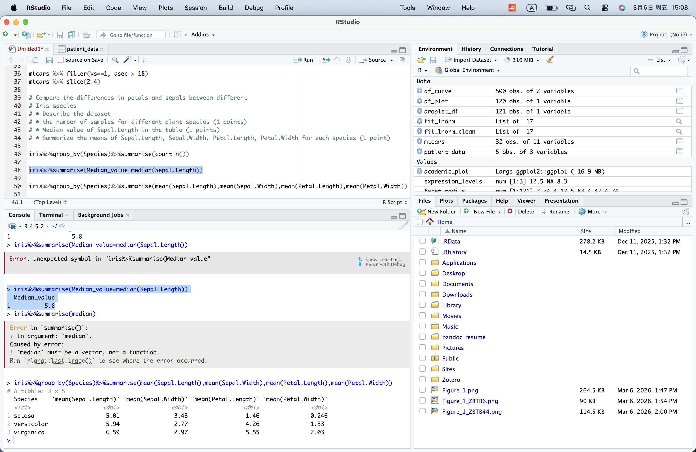
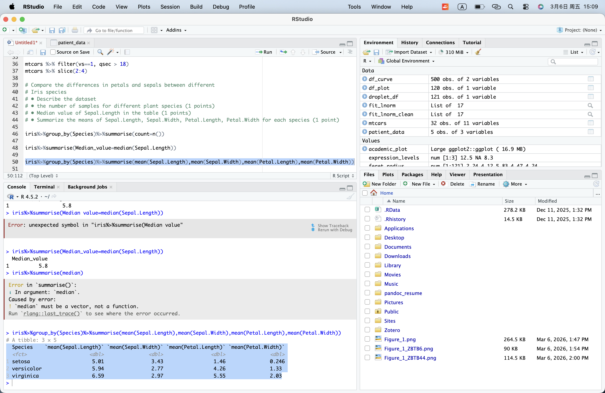
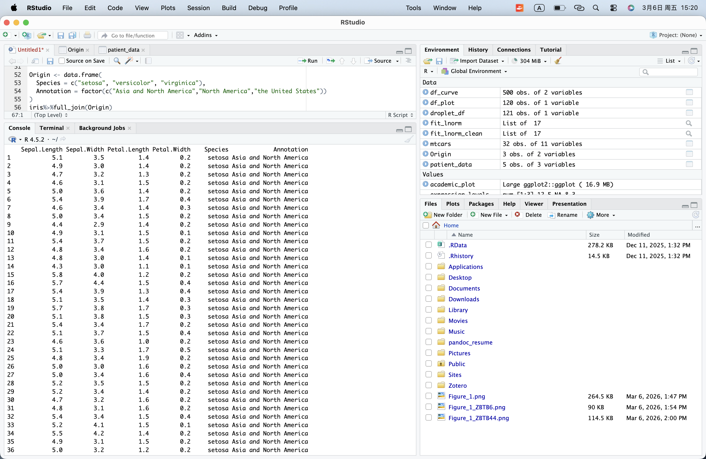
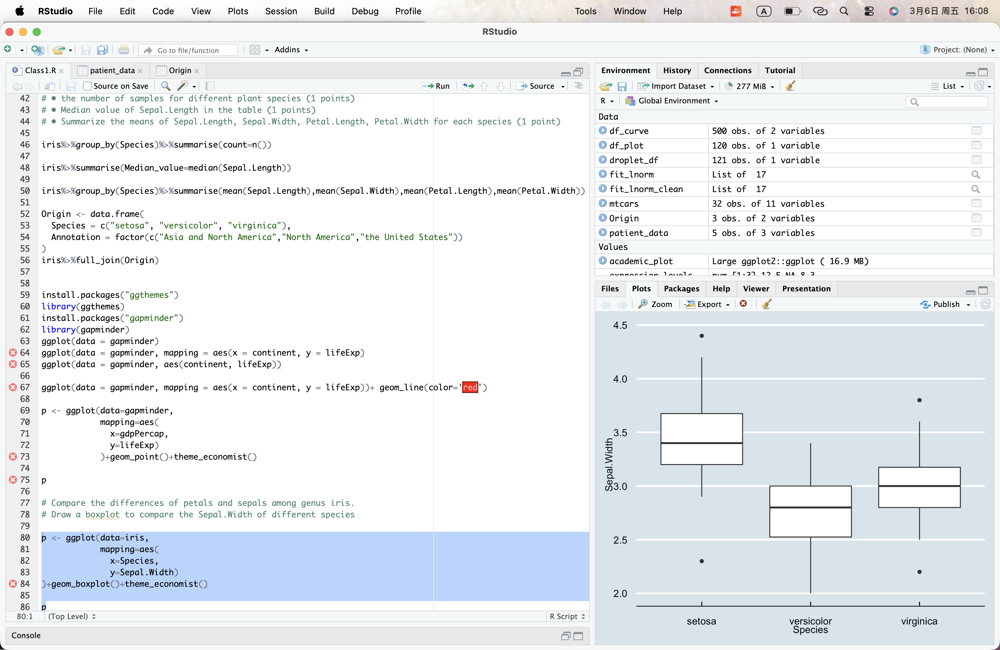
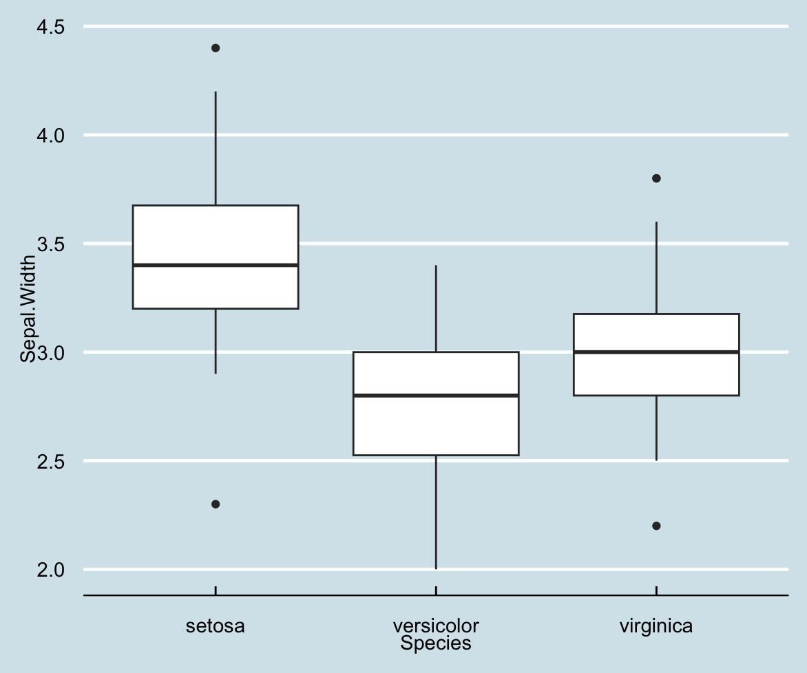
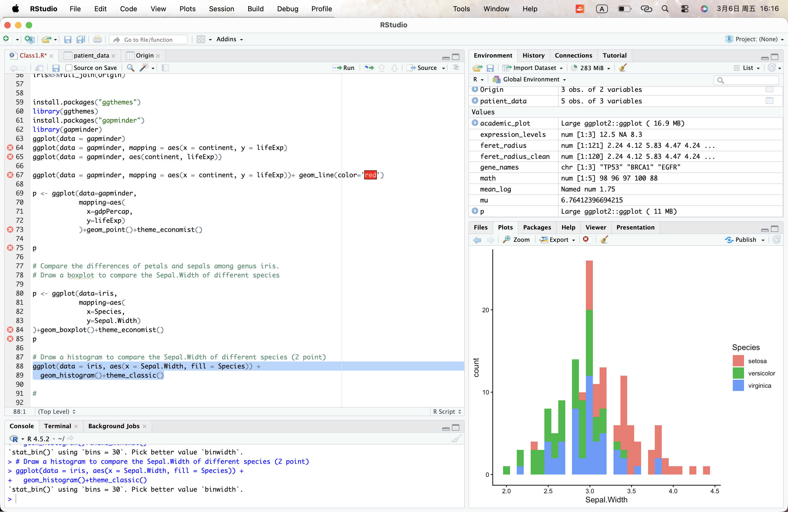
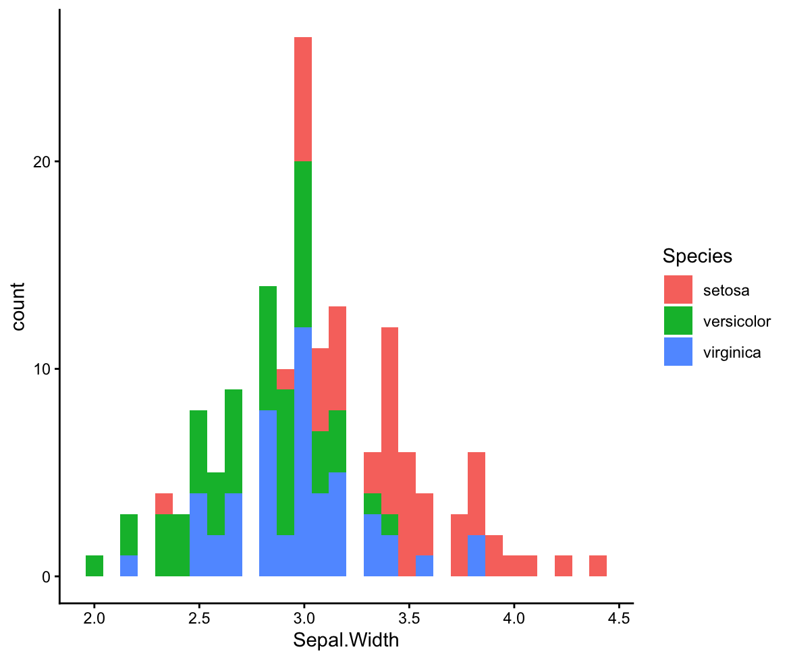

1. Preview the iris table and output the first 5 rows (1 points)
    code:
    ```R
    View(iris)
    iris[1:5,]
    ```

    Screenshot:

    

    Conclusion:

2. Print the numbers of rows and columns of the table
   code:
   ```R
   cat("Number of rows:", nrow(iris))
   cat("Number of columns:", ncol(iris))
   ```

   Screenshot:

   

   Conclusion:

3. Describe the number of samples for different plant species (1 points)
   code:
   ```R
   iris%>%group_by(Species)%>%summarise(count=n())
   ```

   Screenshot:

   

   Conclusion:

4. Median value of Sepal.Length in the table (1 points)
   code:
   ```R
   iris%>%summarise(Median_value=median(Sepal.Length))
   ```

   Screenshot:

   

   Conclusion:

5. Summarize the means of Sepal.Length, Sepal.Width, Petal.Length, Petal.Width for each species (1 point)
   code:
   ```R
   iris%>%group_by(Species)%>%summarise(mean(Sepal.Length),mean(Sepal.Width),mean(Petal.Length),mean(Petal.Width))
   ```

   Screenshot:

   

   Conclusion:

---

Add a column to the table annotating the main origin of each species (Tip: use full_join)
   code:
   ```R
   Origin <- data.frame(
    Species = c("setosa", "versicolor", "virginica"),
    Annotation = factor(c("Asia and North America","North America","the United States"))
    )
    iris%>%full_join(Origin)
   ```

   Screenshot:

   

   Conclusion:

----

1. Draw a boxplot to compare the Sepal.Width of different species (2 point)
   code:
   ```R
   p <- ggplot(data=iris,
            mapping=aes(
              x=Species,
              y=Sepal.Width)
    )+geom_boxplot()+theme_economist()
    ```

   Screenshot:
   

   

2. Draw a histogram to compare the Sepal.Width of different species (2 point)
   code:
   ```R
   ggplot(data = iris, aes(x = Sepal.Width, fill = Species)) +geom_histogram()+theme_classic()
    ```

   Screenshot:
   

   

3. Raise a scientific question about iris dataset (1 point) 