# ✅Chapter 0

>  Transcriptomics: Gene Expression Profiling of Cells
> 
> - Bulk transcriptomics
> - Single Cell transcriptomics
> - Spatial transcriptomics

### BASIC CONCEPTS OF A CELL

All biological systems are composed of cells containing the **same types** of chemical molecules and employing **similar principles** of organization at the cellular level.
And that's why  investigations of **model organisms** informative for understanding fundamental cellular processes.

#### What is cell

Cells are the fundamental unit of life(**The cell theory**)
- The simplest organisms are single cells
- Cells are the building blocks of tissues
- All living cells are derived from pre-existing cells

#### The Tree of Life Has Three Primary Branches: Bacteria, Archaea, and Eukaryotes

This tree is based on comparisons of the nucleotide sequence of a 
**ribosomal RNA (rRNA)** subunit in the different species.

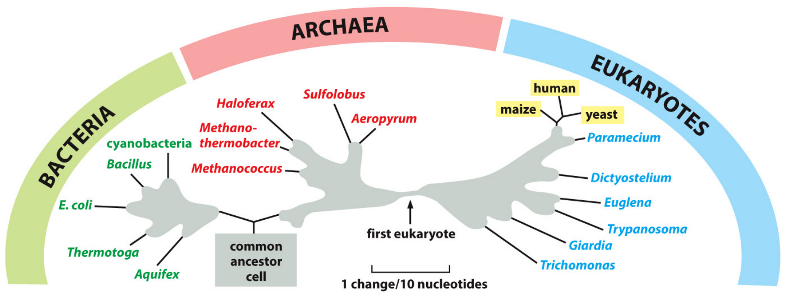

There can be other tree of life

The Pfu DNA polymerase(thermostable) from *Pyrococcus furiosus*(Archaea)

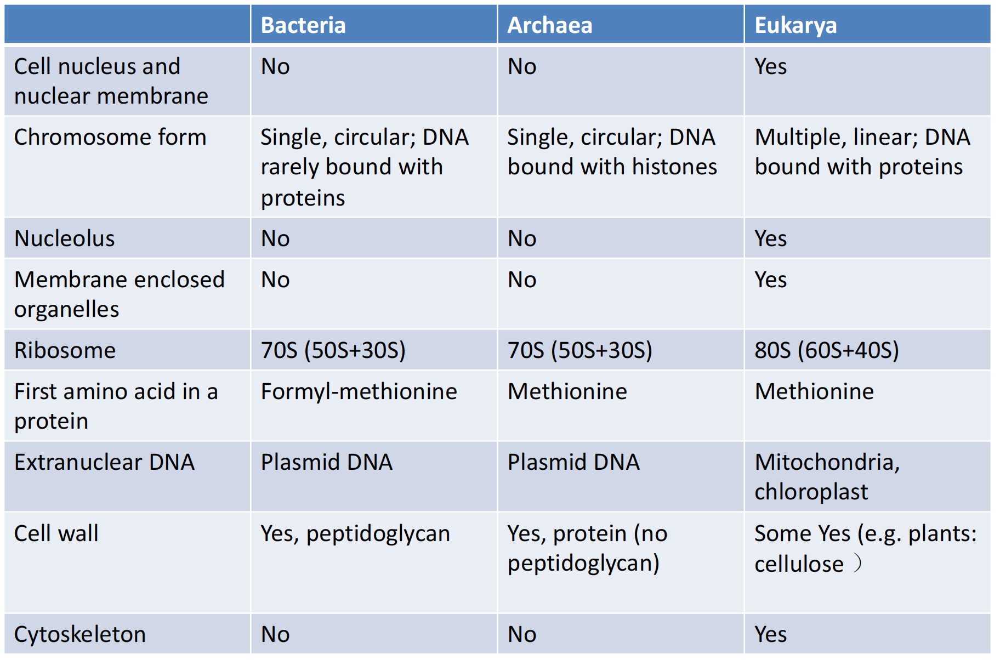

> S=Svedberg(沉降系数,用来衡量超速离心时，颗粒沉降的快慢)
> The genome of archaea is more closely related to eukaryotes than to bacteria.

#### THERE ARE MANY TYPES OF CELLS

Different types of organisms all initiate from a very similar form of life.

The hereditary information in the fertilized eggs determines the nature of the whole organism that will develop from it.

> **Model Organism**: The genome of sea urchins encodes for many **vertebrate immune system** related genes.

### THE UNIVERSAL FEATURES OF CELLS ON EARTH

Certain small molecules (monomers) can be joined to form polymers (also called macromolecules): polysaccharides, proteins, and nucleic acids

**DNA** consists of two complementary strands wound around each other to form a double helix, which is stabilized by weak hydrogen bonds.

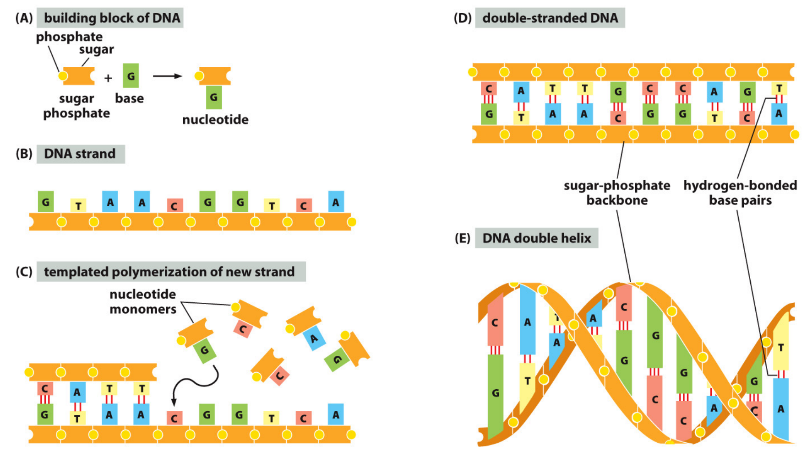

**Phospholipids**: Conserved Building Blocks for All Cellular Membranes
- the property of the membrane determined by all different component
- it alse can have their special property eg,the length of the tail
All Cells Are Enclosed in a Plasma Membrane Across Which Nutrients and Waste Materials Must Pass

**3 common features of all cells: Cellular membrane, cytoplasm, genetic materials** 
**Diversity: size, shape, behavior** 
**Specialization: same DNA, but different RNA and express pattern** 

#### Prokaryotic Cell Structure and Function

- Gram Negative & Gram positive
  - Gram positive bacteria have a thick peptidoglycan layer and no outer lipid membrane 
  - Gram negative bacteria have a thin peptidoglycan, but it has outer membrane so that lysosome can't digest the peptidoglycan.

#### Eukaryotic Cell Structure and Function

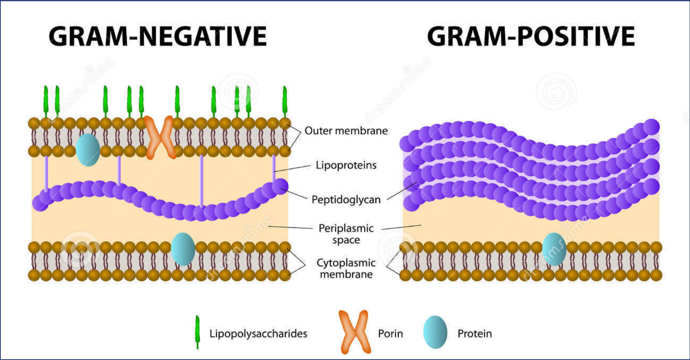

- **3 Types of Cytoskeletal Filaments**: Cell shape, movement, and division
  - Microtubules(20 nm): most rigid, form cilia & flagella
    - Mitotic Spindle
  
    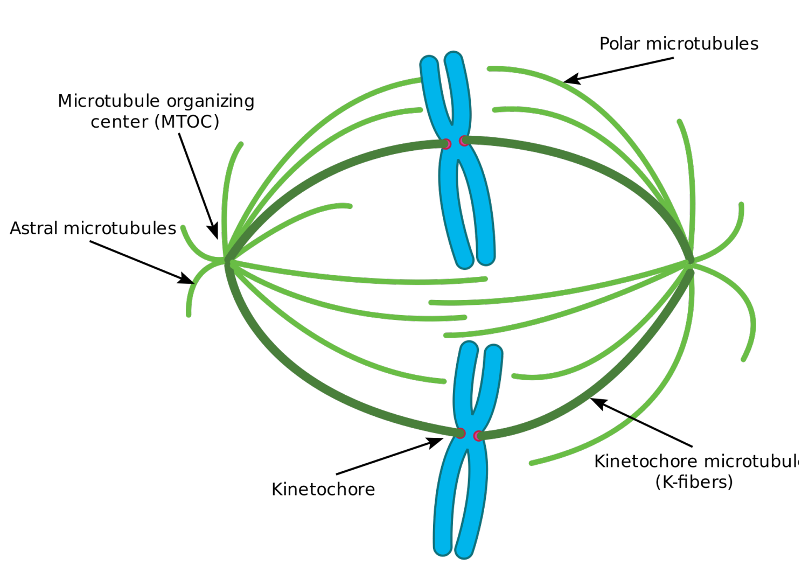

  - Microfilament(7 nm)
  - Intermediate filament(10 nm): maintain cell tension 
- **Nucleus**
  - outer membrane connact to ER membrane
  - Nucleolus: synthesis of rRNA
  - Chromatin: DNA+ proteins(mostly histones)
- **Golgi Complex and Endoplasmic Reticulum(ER)**
  
  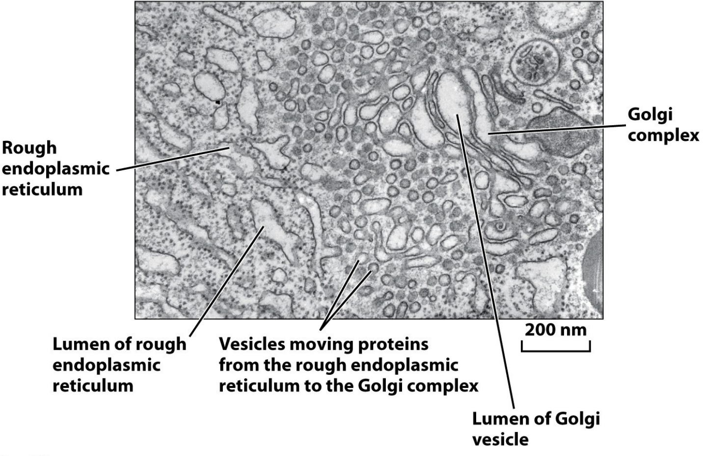

  - Rough ER: site of protein synthesis (lysosomal, membrane, secreted proteins)
    - protein folding
    - N-glycosylation
  - Smooth ER(tubule-like): 
    - lipid synthesis (fatty acids and phospholipids)
    - Smooth ER in the hepatocyte: principal site of production of lipoprotein particles; contain enzymes for detoxification (e.g. cytochrome 450)
    - Ca2+ storage: e.g. sarcoplasmic reticulum in the **muscle cells**
  - Golgi apparatus: each layer is different
    - cis face(close to ER,entry) and trans face(exit)
    - Receiving vesicles from rER and sER
    - Protein modifications:N- and O- glycosylation, phosphorylation
    - Packaging molecules in vesicles for transport
- **Endosomes, Phagosomes, Auto-phagosomes, Lysosomes**
  - Lysosomes: found exclusively in **animal cells**; contains acid hydrolases (nucleases, proteases, phosphatases, …) for breaking down macromolecules, organelles or autolysis of damaged cells
- **Mitochondria: Energy Production (ATP) in Aerobic Cells**

Cell Cycle

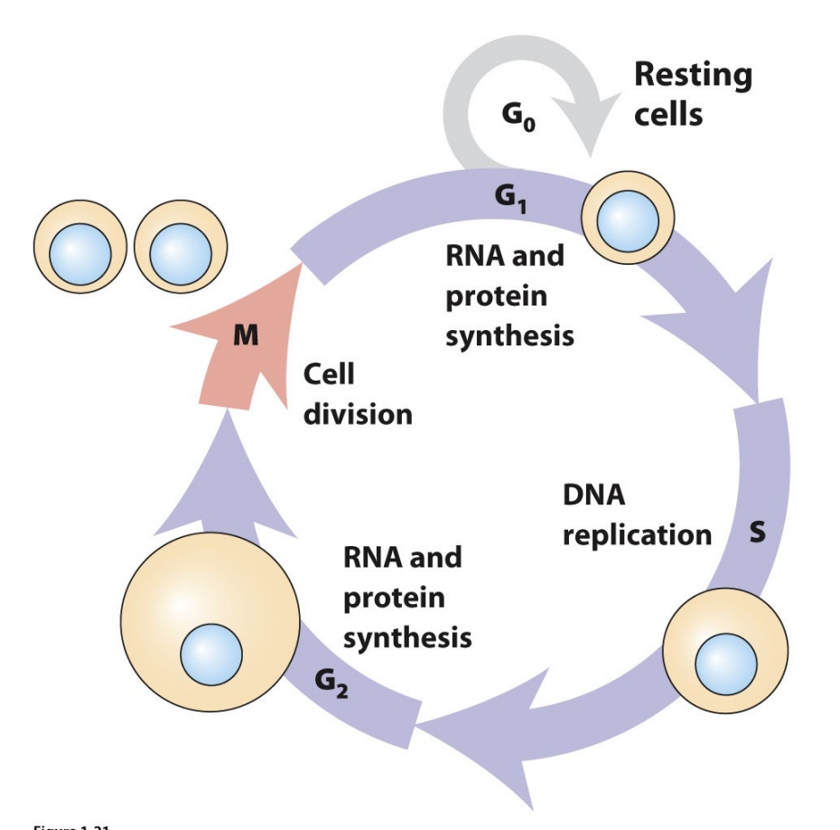

All Cells Function as Biochemical Factories Dealing with the Same Basic Molecular Building Blocks
Life Requires Free Energy
  Cells can be powered by a variety of energy sources: 
  - Organotrophic (feeding on organic compounds)
  - Phototrophic (feeding on light)
  - Lithotrophic (feeding on rock/inorganic compounds)

### THE DIVERSITY OF GENOMES AND THE TREE OF LIFE

- Some Cells Fix Nitrogen and Carbon Dioxide for Others
  - To make a living cell requires matter, as well as free energy. 
    - DNA, RNA, and protein are composed of just six elements: hydrogen, carbon, nitrogen, oxygen, sulfur, and phosphorus. 
    - These are all plentiful in the nonliving environment, in the Earth’s rocks, water, and atmosphere, but not in chemical forms that allow easy incorporation into biological molecules.

#### The Greatest Biochemical Diversity Exists Among Prokaryotic Cells(including bacteria and archaea)

Scale (Diameter): virus (10X) mycoplasma (10X) bacteria (10X) animal/plant cells (10X) protozoan cells (single-celled organisms，草履虫)

- Some Genes Evolve Rapidly; Others Are Highly Conserved

### GENETIC INFORMATION IN EUKARYOTES

- Eukaryotic Genomes Are Big
  Eukaryotes not only have more genes than prokaryotes; they also have vastly more DNA that does not code for protein(Regulatory DNA).
- Eukaryotes Have Hybrid Genomes
- The Genome Defines the Program of Multicellular Development
- The Vertebrate Genome Is a Product of Repeated Duplications

### Model Organisms

- sequenced genomes
- short life cycle
- easy to maintain
- cost effective
- ethical considerations
- mutations available
- other genetic technologies

Prokaryotic
  *Escherichia coli* -bacteria
Eukaryotic
  *Saccharomyces cerevisiae* -yeast
  *Arabidopsis thaliana* -plant
  *Caenorhabditis elegans* -worm
  *Drosophila melanogaster* -fruit fly
  *Mus musculus* -mouse
  *Homo sapiens* -human

#### E.coli

#### Yeast

Carries out the basic tasks that any eukaryotic cell must perform. 
Cell cycle, cell division researches
6000 genes, 2000 essential. A membrane bound nucleus,Genes in chromosomes,Membrane bound organelles, Cytoskeleton

Has diploid(2n) state and haploid(n) state
**Meiosis** is triggered by starvation and gives rise to spores—haploid cells in a dormant state, resistant to harsh environment.

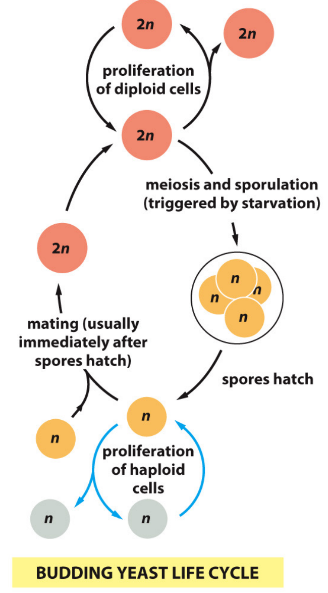

- Mutations Reveal the Functions of Genes: *Schizosaccharomyces pombe*: A normal yeast is compared with a mutant in which a change in a single gene has converted the cell from a cigar shape (left) to a T shape (right).
- Autophagy Degrades Unwanted Proteins and Organelles: baker's yeast-- using mutated yeast lacking vacuolar degradation enzymes and simultaneously stimulating autophagy by starving the cells

If there is a defective gene in yeast, a human gene can be introduced that will compensate for the mutant yeast gene.

#### Arabidopsis

#### C. elegans

First multicellular organism whose complete genome was sequenced. 
959 cells in the adult body. 
The divisions proceed like clockwork. 
A model for the study of program cell death.(线虫刚出生的时候有1000以上的细胞，随着成熟细胞数量减少了)

#### Drosophila

#### Frog and zebrafish

vertebrate development

# ✅Chapter 1 Techniques in Cell Biology

#### ISOLATING CELLS AND GROWING THEM IN CULTURE

**Cells Can Be Grown in Culture**
  - Primary cell lines
  - Transformed cell lines

**Eukaryotic Cell Lines Are a Widely Used Source of Homogeneous Cells**

**Culture of Animal Cells Require Nutrient-Rich Media and Special Solid Surfaces**
- temperature, pH, ionic strength, nutrients
- specially coated plastic dishes/flasks: importance of cell-adhesion molecules (CAM)
- cell culture hood (sterile cabinet containing circulating air that is filtered)

**Cell culture medium**
- 9 amino acids that can’t be synthesized by adult vertebrate animal cells: Phe, Val, Thr, Trp, Ile, Met, Leu, Lys, His
- 3 amino acids that most cells can’t synthesize: Cys, Tyr, Arg
- Glutamine：Nutrient source
- Vitamins, various salts, fatty acids, glucose
- Serum: protein factors for cell proliferation (insulin, transferrin, growth factors)
- Antibiotics: reduce bacterial or fungal contamination

**Comparison: Primary Cells vs. Transformed Cells**

| Feature              | Primary Cells                                | Transformed Cells (Cell Lines)          |
| :------------------- | :------------------------------------------- | :-------------------------------------- |
| **Origin** | Isolated directly from living tissues        | Derived from tumors or oncogenic shift  |
| **Isolation** | Requires Trypsin/Collagenase + EDTA          | Established from existing cultures      |
| **Life Span** | **Finite** (e.g., ~50 divisions; Senescence) | **Indefinite** (Immortalized)           |
| **Genetics** | Normal diploid; Genetically stable           | **Aberrant** chromosomes; DNA mutations |
| **Growth Potential** | High (Embryonic Stem Cells as exception)     | Continuous proliferation (e.g., HeLa)   |
| **Differentiation** | Can differentiate into specific lineages     | Often lose specialized functions        |

**Magnification progression**

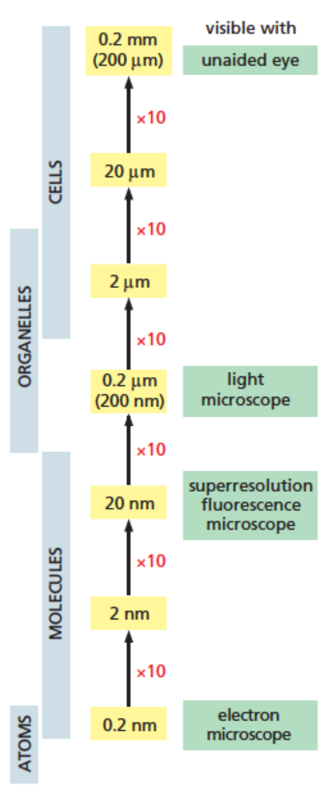

- Cells Can Be Isolated from Tissues
  - Trypsin (a pancreatic protease): cleaves at the C-terminal side of lysine and arginine
  - Collagenase: cleaves the peptide bonds in native, triple-helical collagen

>  Primary cells
> - isolated directly from tissues
> - preparation from tissue: Trypsin and/or collagenase
> - EDTA (many CAMs require Ca++, EDTA remove calcium)
> - finite divisions
> - Exception: embryonic stem cells can be cultured indefinitely
> Transformed cells
> - (Oncogenic) transformation 
> - Indefinite life span
> - “cell line”: a culture of cells with an indefinite life span (immortal)

#### LIGHT MICROSCOPY

- Upright microscope
- Inverted microscope: look at cells in culture

- The light microscope can resolve details 0.2 μm apart
  - Resolution分辨率 (the limiting separation at which two objects appear distinct): the most important property of any microscope
- Bacteria and mitochondria are about 500 nm (0.5 μm) wide

**Ways to generate contrast in light microscopy**

- The stained portion of the cell will absorb light of some wavelengths, which depends on the stain, but will allow other wavelengths to pass through it.（入射都是白光，但是染色的部分类似于滤光片）

- In the dark-field microscope, oblique rays of light focused on the specimen do not enter the objective lens, but light that is scattered by components in the living cell can be collected to produce a bright image on a dark background.

细胞不同部位的厚度不同会影响穿过光的相位，但是人眼不能分辨相位差，所以利用相位干涉效应，将肉眼不可见的相位改变转化为可见的明暗对比，从而实现对透明活细胞的无损观察。

**Intact Tissues Are Usually Fixed and Sectioned Before Microscopy**

Imaging subcellular details often requires that specimens be fixed, sectioned, and stained
- sectioned: Microtome(Typically 0.5-10 μm thick)
- Fixative: a chemical that cross-link most proteins and nucleic acids(eg:formaldehyde)
- Embedding media are usually waxes(蜡) or resins(树脂): In liquid form, these media both permeate and surround the fixed tissue before being hardened (by cooling or by polymerization) to form a solid block.

**Fluorescence Microscopy**
Detect specific proteins or other molecules in cells and tissues.

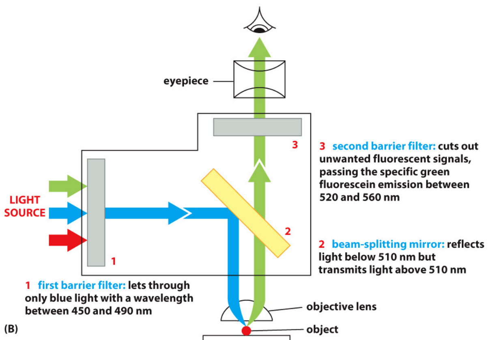

Excitation and Emission

Illuminate a fluorescent molecule at its absorbing wavelength and then view it through a filter that allows only light of the emitted wavelength to pass.

Dichroic mirror: a special type to filter that reflects the excitation light into the sample and allows the longer wavelength light emitted by the fluorescent sample to pass through to the observer 简单来说就是能够分辨出哪个是emission的光，然后把所有用来激发的光都避开

> Two fluorescent dyes that have been commonly used:
> Fluorescein-- emits an intense **green** fluorescence when excited with **blue** light
> Rhodamine-- emits a deep **red** fluorescence when excited with **green yellow** light.
> 这两个可以一起标记然后分辨不同的细胞器

**In situ(原位杂交) hybridization can reveal the location of RNAs**

It is possible to visualize the distribution of **different RNAs** in tissues using in situ (in the original place) hybridization
Tissues are gently fixed an hybridized with a labeled complementary nucleic acid probe.

**Antibodies Can Be Used to Detect Specific Molecules**

Polyclonal Antibodies
- Immunizing an animal with the appropriate antigen.
- Antibodies can then be purified from the serum.
- this will be a mix of antibodies

Monoclonal Antibodies
- Hybridoma Cell(杂交瘤细胞) Lines Are Factories That Produce Monoclonal Antibodies
> Hybrid cell:
>
> 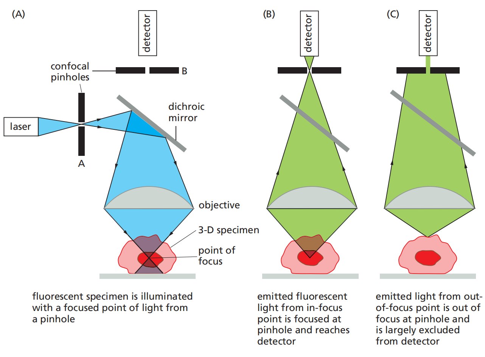
>
> - Suspension of cells is treated with certain inactivated viruses or with polyethylene glycol, each of which alters the plasma membranes of cells in a way that induces them to fuse and become a heterokaryon(异核体)
> - Eventually, a heterokaryon proceeds to mitosis and produces a hybrid cell in which the two separate nuclear envelopes have been disassembled, allowing all the chromosomes to be brought together in a single large nucleus.

Indirect vs. Direct Antibody Staining
Why do indirect Immunostaining? 
- the signal is stronger.
- Cheaper

**Two major limitations of conventional fluorescence microscopy**

- The fluorescent light emitted by a sample comes not only from the plane of focus but also from molecules above and below it.
- To visualize thick specimens, consecutive (serial) images at various depths throughout the sample must be collected and then aligned to reconstruct structures in the original thick tissue.
  
  solutions:
  - Deconvolution: uses computational methods to remove fluorescence contributed by out-of-focus parts of the sample
  - Confocal Microscopy

Confocal Microscopy:
- The confocal microscope produces optical sections by excluding out-of-focus light

**Individual proteins can be fluorescently tagged in living cells and organisms (ex: GFP)**

**Protein dynamics can be followed in living cells**

FRET (Fluorescence resonance energy transfer)
- Measuring the distance between entities, such as proteins.
- FRET (no signal)->Distance >10-100 angstroms
- FRET (fluorophores are close enough together such that YFP can absorb light from CFP emission) Distance < 10-100 angstroms

Fluorescence Recovery after Photobleaching (FRAP)
- Measuring lateral diffusion rates of integral membrane protein
- Measuring lipids movement on cell plasma membrane

**Flow cytometry(流式细胞术)**

FACS (Fluorescence-activated cell sorter)
- 液滴形成（Droplet Formation）：样本被稀释成单细胞悬液，通过一个振动的喷嘴。振动使液流断裂成一个个微小的液滴，理想情况下，每个液滴只含有一个细胞。
- 激光检测与分析：在液滴形成前，细胞经过激光照射。仪器通过传感器检测其散射光（代表大小和复杂程度）和荧光（代表标记的特定蛋白或核酸）。
- 液滴充电（Charging）：计算机根据预设的“逻辑门”（Gating）判断该细胞是否为目标细胞。如果是，仪器会在液滴脱离喷嘴的一瞬间给该液滴带上正电荷或负电荷；非目标细胞则不带电。
- 电偏转分选（Deflection）：液滴通过一对高压静电偏转板。带电液滴受电场力作用发生偏转，落入指定的收集管中，而不带电的液滴则直接落入废液桶。

#### The Electron Microscope

In EM, electromagnetic lenses focus a high-velocity electron beam instead of the visible light used by optical lenses.

> $$d \approx \frac{\lambda}{2 \cdot \text{NA}}$$

Short wavelength of electrons means that the limit of resolution for TEM is theoretically 0.005nm.

- Because electrons are scattered by collisions with air molecules, air must first be pumped out of the column to create a vacuum.
- As in light microscopy, the specimen can be stained—in this case, with electron-dense material(能够强烈散射电子).
- The image can be observed on a monitor or is typically recorded with a sensitive CMOS electron detector. Because the scattered electrons are lost from the beam, the dense regions of the specimen show up in the image as areas of reduced electron flux, which look dark.

**Biological Specimens Require Special Preparation for Electron Microscopy**
- glutaraldehye; osmium tetroxide
- dehydration(保证在真空中不爆裂); solid plastic block(先填充聚合，然后用金刚石切片机切出纳米级的薄片)
- 50 -100 nm thick since electrons have limited penetrating power

**Localizing Proteins for Electron Microscopy**

Immunogold(免疫金) EM
-  Incubate a thin section first with a specific primary antibody
-  Incubate with a secondary antibody to which a colloidal gold particle has been attached.
   -  The gold particle is electron-dense and can be seen as a black dot in the electron microscope.

**Different Views of a Single Object Can Be Combined to Give a Three Dimensional Reconstruction**

**Images of Surfaces Can Be Obtained by Scanning Electron Microscopy**

- 磁线圈产生的磁场会对带电的电子束施加洛伦兹力，使其发生偏转并聚焦。
- 扫描线圈 (Scan Coils) 控制电子束在样品表面的 $X-Y$ 轴上快速往复运动。
- 电子束每到达一个位置（像素点），都会与样品发生相互作用
- While the TEM uses the electrons that have passed through the specimen to form animage, the SEM uses electrons that are scattered or emitted from the specimen’s surface.

#### ANALYZING AND MANIPULATING DNA

**Hybridization Provides a Powerful, But Simple Way to Detect Specific Nucleotide Sequences**

> Diagnosis of sickle-cell anemia by DNA hybridization

Fluorescent in situ hybridization (FISH) can be used to localize genes on chromosomes

**PCR Is Also Used for Diagnostic Applications**

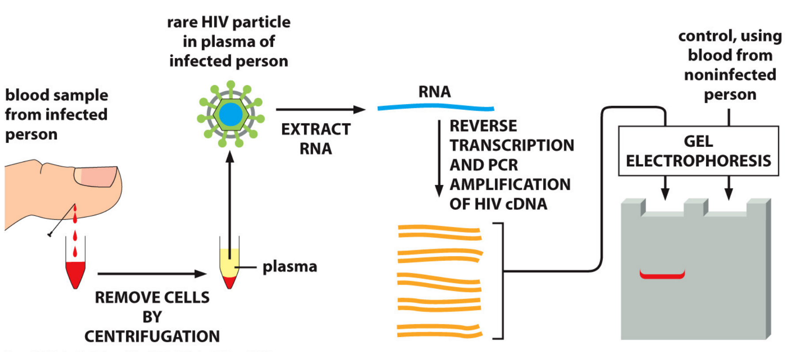

> PCR is used in forensic science
> Variable Number of Tandem Repeats (VNTR) are used to identify people (also called short tandem repeats STR)(串联重复序列)
> VNTRs do not code for proteins, mutations in a VNTR do not alter biological function
> - Tandem repeats are common in noncoding regions of DNA 
> - VNTRs are 2 to 5 nucleotides in length These may be repeated 5 to 15 times in individuals
> - Law enforcement uses a set of these to identify people

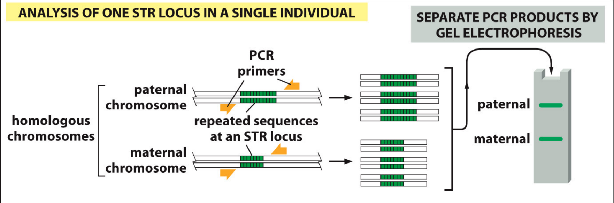

**PCR Is Also Used for Diagnostic and Forensic Applications**

# ✅Chapter 2 Methods in cell biology

#### Purifying and analyzing proteins

**Cells Can Be Separated into Their Component Fractions**

**Cell Fractionation By Centrifugation**
  
- Disrupt the cell: Mechanical & non-Mechanical
  - Non-Mechanical: Osmotic shock & Enzymes lysis(Break many of the membranes of the cell into fragments and release organelles.)
  - Mechanical: Ultrasonic vibration & Orifice Extrusion(微孔挤压) & Grinding
- Fractionation: Centrifugation(Preparative Ultracentrifuge, 分析性超速离心机)
  - Fixed angle rotors
  - Swinging bucket rotors/ Horizontal rotors: collect the materials at bottom
  
  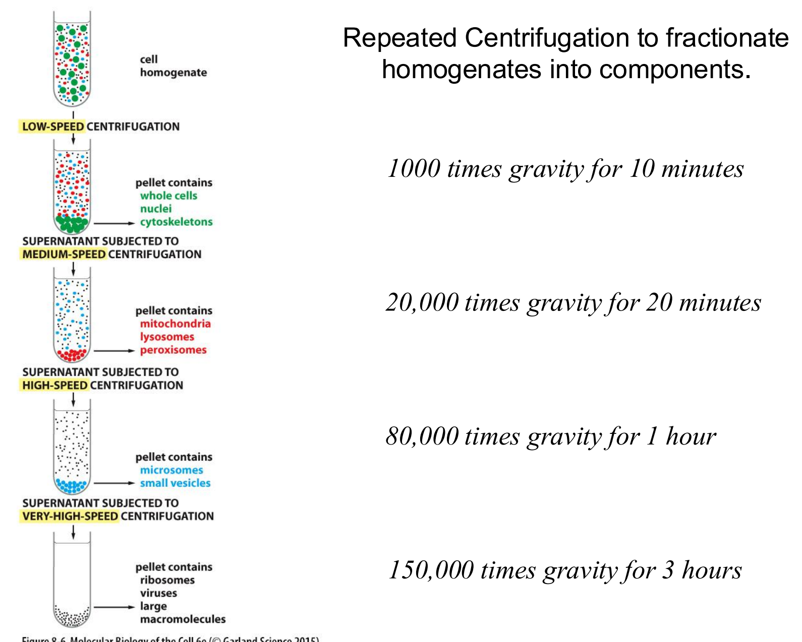

**Subcellular Components Separated By Sedimentation**

Velocity sedimentation & equilbrium sedimentation(base on density)

**Proteins Can Be Separated by Chromatography**

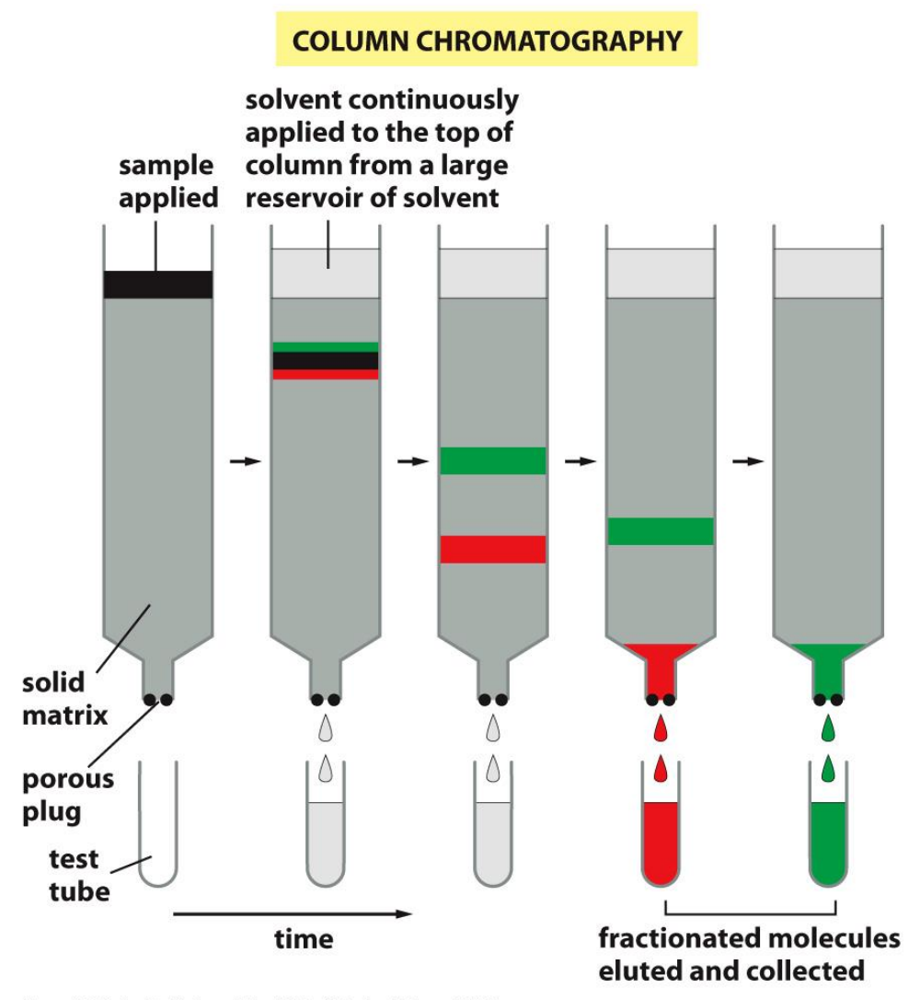

Depending on the choice of matrix, proteins can be separated according to their charge (**ion-exchange chromatography**), their hydrophobicity(**hydrophobic chromatography**), their size (**gel-filtration chromatography**), or their ability to bind to particular small molecules or other macromolecules(**affinity chromatography**).

Sequential Chromatography: combination of different methods

**Immunoprecipitation Is a Rapid Affinity Purification Method**

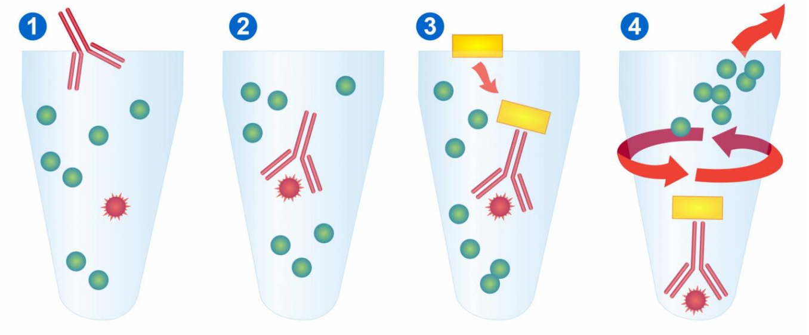

Co-Immunoprecipitation (Co-IP): A technique to identify physical interactions between proteins using antibodies.

**Genetically Engineered Tags Provide an Easy Way to Purify Proteins**

Tagging with epitope or Tagging with whole protein

Double tagging of the protein of interest： Tandem Affinity Purification (TAP)

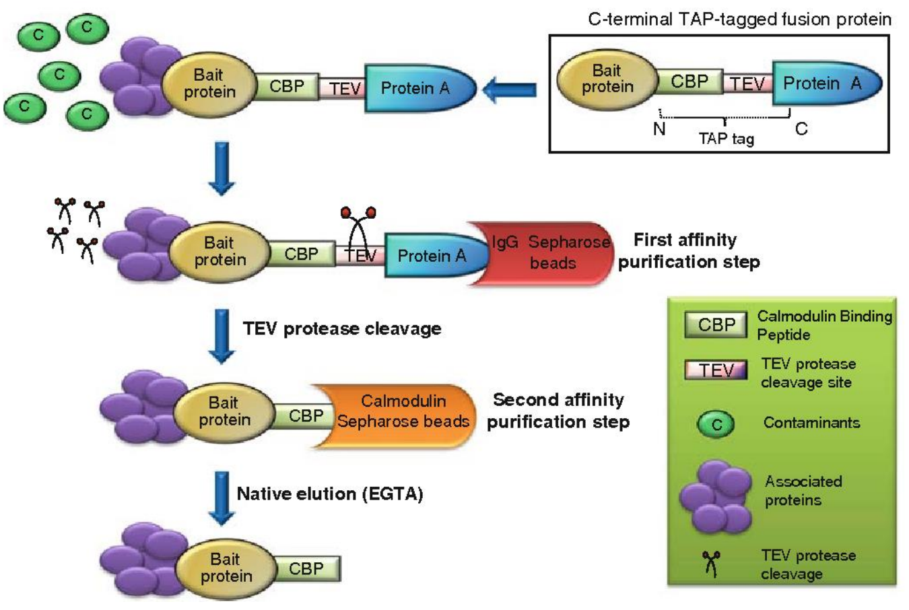

- Protein A (ProtA)： 能够与 IgG 珠子高亲和力结合。
- TEP 酶切位点 (TEV cleavage site)： 一段特定的氨基酸序列，能被 TEV 蛋白酶识别并切断。
- 钙调蛋白结合肽 (CBP)： 能够与钙调蛋白（Calmodulin）珠子结合。

#### ANALYZING PROTEINS

Proteins Can Be Separated by SDS（十二烷基硫酸钠） Polyacrylamide-Gel（聚丙烯酰胺凝胶）Electrophoresis (SDS-PAGE)
- The protein migrates at a rate that depends on its net charge and on its size and shape.
- The pore size of the gel can be adjusted.

**Two-Dimensional Gel Electrophoresis Provides Greater Protein Separation**

- The first step separates proteins by their **intrinsic charges(固有电荷)** (nonionic detergents非离子性去垢剂-破坏脂质-蛋白及蛋白-蛋白之间的疏水相互作用, beta-mercaptoethanol$\beta$-巯基乙醇-打破蛋白质内的二硫键, urea尿素-破坏蛋白质的氢键和范德华力)
- The second step separates proteins by their size (SDS-PAGE)

**Specific Proteins Can Be Detected by Blotting with Antibodies**

A specific protein can be identified after its fractionation on a polyacrylamide gel by exposing all the proteins present on the gel to a specific antibody that has been labeled with a radioactive isotope or a fluorescent dye.

**Mass Spectrometry to Identify Unknown Proteins**

Mass spectrometry separates ions according to their mass-to-charge (m/z) ratio.
可以有一级质谱和二级质谱

“two-dimensional” mass spectrometry（Liquid Chromatography Mass Spectrometry (LC-MS)） can be used to determine all of the proteins present in a mixture of proteins.

#### Protein Structure Can Be Determined

**Protein Structure Can Be Determined Using X-Ray Diffraction**

先拍出衍射图案，然后再通过傅立叶变换复原结构

**Single Particle Cryo-electron Microscopy to Determine Protein Structures**

将脆弱的生物样本瞬间封存在极低温下的玻璃态冰中，使其保持原有的生理结构，然后利用极低剂量的电子束进行高速成像，最后通过计算机将海量、不同角度的二维投影图，反向重构出蛋白质的三维原子坐标。

**Lots of Structures have not been Determined**

Predicting the structure that a protein based solely on its amino acid sequence—protein folding problem

**Sequence to Structure**

AlphaFold2 uses a deep neural network trained to generate protein structures from amino acid sequences, by utilizing information on homologous proteins and multiple sequence alignments.

#### ANALYZING AND MANIPULATING DNA

**Recombinant DNA Technology – the ability to manipulate DNA with precision in a test tube or in an organism**
- DNA cutting
- DNA ligation
- DNA cloning
- Nucleic acid hybridization
- Sequencing 
- Editing
- DNA synthesis

**Restriction Nucleases Cut Large DNA Molecules into Specific Fragments**

Purified from bacteria, cut the DNA double helix into fragments of strictly defined sizes at specific sites defined by the local nucleotide sequence.

**Gel Electrophoresis Separates DNA Molecules of Different Sizes**

**DNA Ligase Can Join Together Any Two DNA Fragments in Vitro to Produce Recombinant DNA Molecules**

**DNA Can Be Cloned Using Bacteria**

**An Entire Genome Can Be Represented in a DNA Library**

Genomic and cDNA Libraries Have Different Advantages and Drawbacks

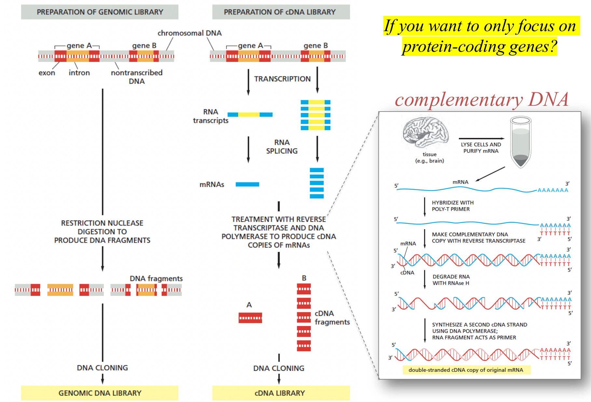

**PCR Can Be Used to Obtain Specific Genomic or cDNA Clones**

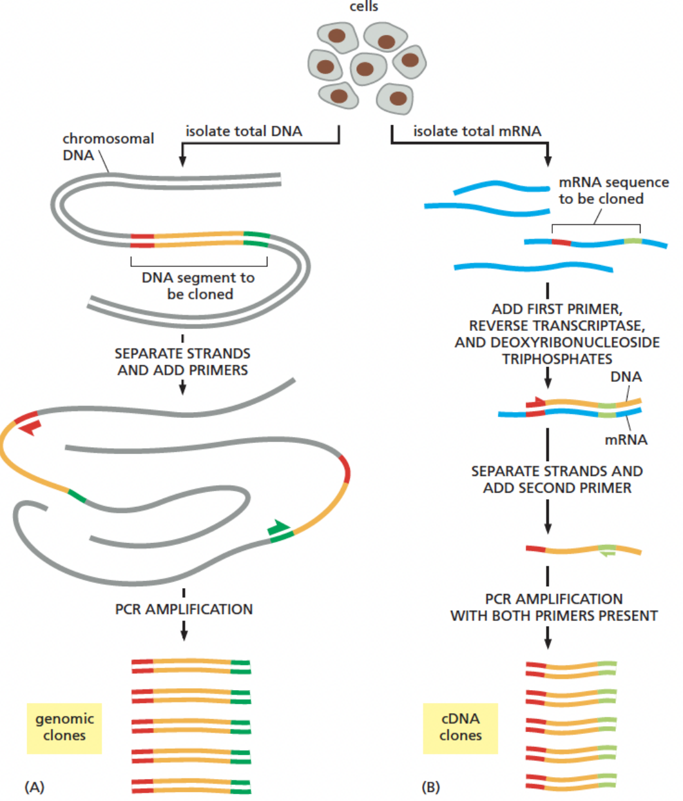

DNA Cloning Allows Any Protein to be Produced in Large Amounts

**Both DNA and RNA Can Be Rapidly Sequenced**

Sanger Sequencing: ddNTP的终止延伸的作用
Second-generation Sequencing Technologies

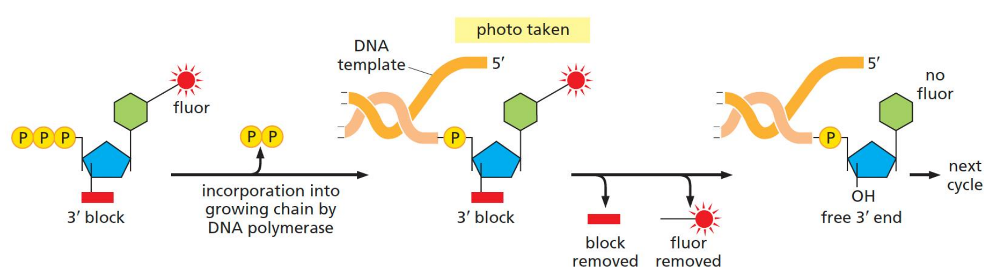

Sequencing Cost Has Been Reduced Dramatically

Genome Annotation is important

#### STUDYING GENE EXPRESSION AND FUNCTION

**Genetic Screens Identify Mutants with Specific Abnormalities**

**Polymorphisms**

Polymorphisms: common sequence variants coexist in the population

Haplotype blocks(单倍体嵌块): combinations of polymorphisms that are inherited as a unit.
- 这段地方几乎从来不发生基因重组
- Linkage Disequilibrium
- 只要检测到其中一个SNP，就能推断得知附近的基因

Polymorphisms Can Aid the Search for Mutations Associated with Disease
- Mendelian diseases: single-gene or monogenic disorders 
- Common diseases: multigenic (i.e. diabetes, autism)

**Recombinant DNA Technology Has Made Reverse Genetics Easier**

Reverse genetics: starts with altering a gene of interest
- knock-out (KO)
- knock-in (KI)
- conditional KO/KI/Expr

**CRISPR-mediated Immunity In Bacteria And Archaebacteria**
**RNA Interference Is a Simple and Rapid Way to Test Gene Function**

**Microarray or RNA-seq Provides a Snapshot of Gene Expression**
- 样本处理： 提取总 RNA $\rightarrow$ 逆转录为 cDNA $\rightarrow$ 荧光标记（单色如 Biotin，或双色如 Cy3/Cy5）。
- 竞争性杂交： 在双色芯片中，对照组和实验组样本混合后同时与芯片杂交。
- 信号强度： 荧光亮度与样本中目标分子的丰度成正比。

# ✅Chapter 3 the cytoskeleton

#### Function and origin of the cytoskeleton

**Cytoskeletal Filaments Adapt to Form Dynamic or Stable Structures**

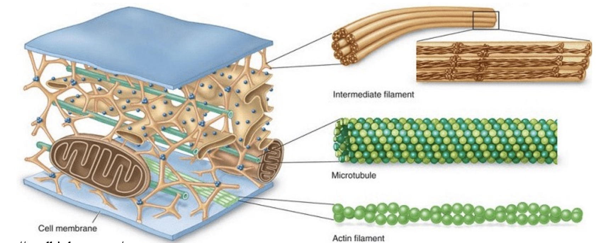

- Actin filament(trail,short distance): Determine the shape of cell's surface; Drive the pinching of one cell into two; motility of cell.
  - right underneath the cell memberane
- Intermediate filament: Provide mechanical strength, sustain/withstand to the pressure.
  - around the nucleus
- Microtubules(highway): Determine the positions of membrane-enclosed organelles; Direct intracellular transport; Form the mitotic spindle.
  - radia distribution from centre to outwards

> limit of resolution:
> The light microscope can resolve details 0.2 μm apart Super resolution ~ 12 nm
> However, Microfilaments have a diameter of 7 nm

Actin Filament(microfilament):
- microvilli(Intestinal epithelial cell):
  - absorb nuritions, increasing surface
  - aranged in a certain way--Actin proteins, arranged by a certain type of protein
- stress fibers: contractile(可收缩的) actin bundles found in non-muscle cells
- striated muscle

Microtubules:
- long and hollow
- start from one center in the cell(**MTOC**)
- maintain organelle's position; help cell transported; help cell to divide
 
- Intermediate filament:
  - ropelike structure 10nm
  - constitute a large and heterogeneous family
  - nuclear lamina: just beneath the inner cuclear membrane

**Diagram of changes in cytoskeletal organization associated with cell division**

Not in mitosis:
Microtubules: organize from MTOC
Actin: at the edge action filament will quickly assemble and disassemble
> The crawling **fibroblast**(成纤维细胞) drawn here has a polarized, dynamic actin cytoskeleton. The polarization of the actin cytoskeleton is assisted by the microtubule cytoskeleton

Beginning mitosis:
Microtubules: arrange spindle structure -> responsible for aligning and segregating the duplicated chromosomes when the cell divides

Anaphase:
Contractile ring: **Actin and its associated motor protein myosin** form a belt around the middle of the cell

**A neutrophil in pursuit of bacteria**

The shape of neutropil change fast: requires quickly reassembles the dense actin network

**The Cytoskeleton Determines Cellular Organization and Polarity**
> Organization of the cytoskeleton in polarized epithelial cells
> Apical and Basal
>
> 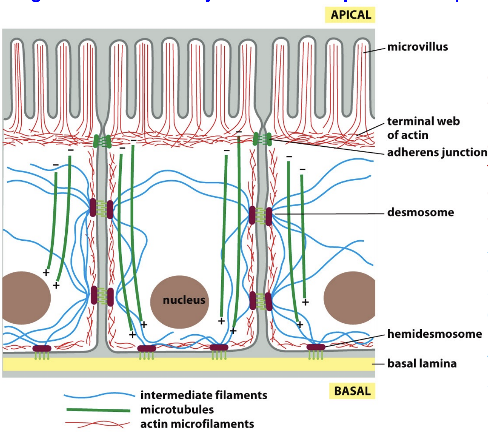
>
> - Bundled actin filaments form **microvilli** that increase the cell-surface area available for absorbing nutrients from food.
> - Below the microvilli, a circumferential band of **actin filaments** is connected to cell–cell adherens junctions that anchor the cells to each other(cell needs to attach to each other, organized in a certain structure).
> - Intermediate filaments are anchored to **adhesive structures**, including **desmosomes(桥粒)** and **hemidesmosomes(半桥粒)**, that connect the epithelial cells into a sturdy sheet and attach them to the underlying extracellular matrix.
> - Microtubules run vertically from the top of the cell to the bottom and provide a global coordinate system that enables the cell to direct newly synthesized components to their proper locations.

**Filaments assemble from protein subunit that impart specific physical and dynamic properties**

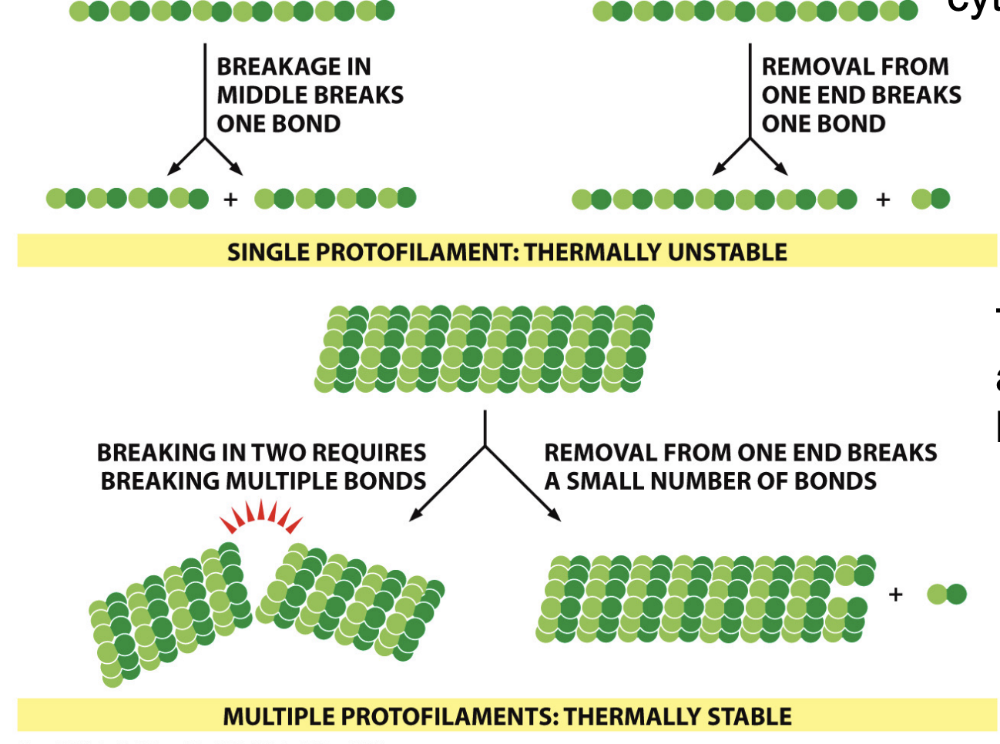

All three types of filaments form from assemblies of subunits that selfassociate using a combination of end-to-end and side-to-side protein contacts(more stable,但似乎是中间断裂变得更困难，其他的还可以).

**Flexibility and stretch in an intermediate filament**

Atomic force microscopy:
A tiny mechanical probe was used to rapidly scan across a surface to which intermediate filaments were adhered, providing a measurement of the height and contour of the filaments.

**Bacterial Cell Organization and Division Depend on Homologs of Eukaryotic Cytoskeletal Proteins**

Bacteria contain homologs of all three of the eukaryotic cytoskeletal filaments.
- FtsZ – tubulin homolog in prokaryotes involved in cytokinesis
  - polymerize into filaments and assemble into a “Z-ring”
  - formed in vitro, as visualized using electron microscopy
  - Dividing chloroplasts (red) from a red alga
- MreB – actin homolog involved in cell shape
  - grow in distorted or twisted shapes and eventually die
- ParM – actin homolog involved in chromosome separation
- Crescentin – has coiled-coil domains similar to intermediate filaments
  
  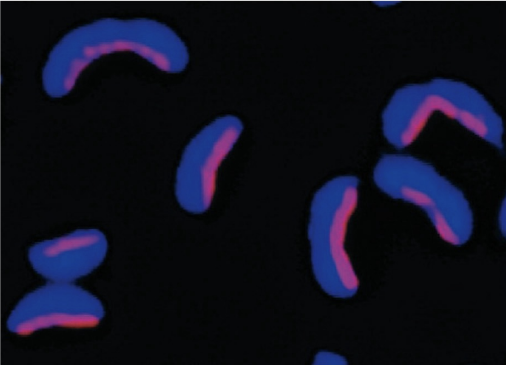

#### ACTIN AND ACTIN-BINDING PROTEINS

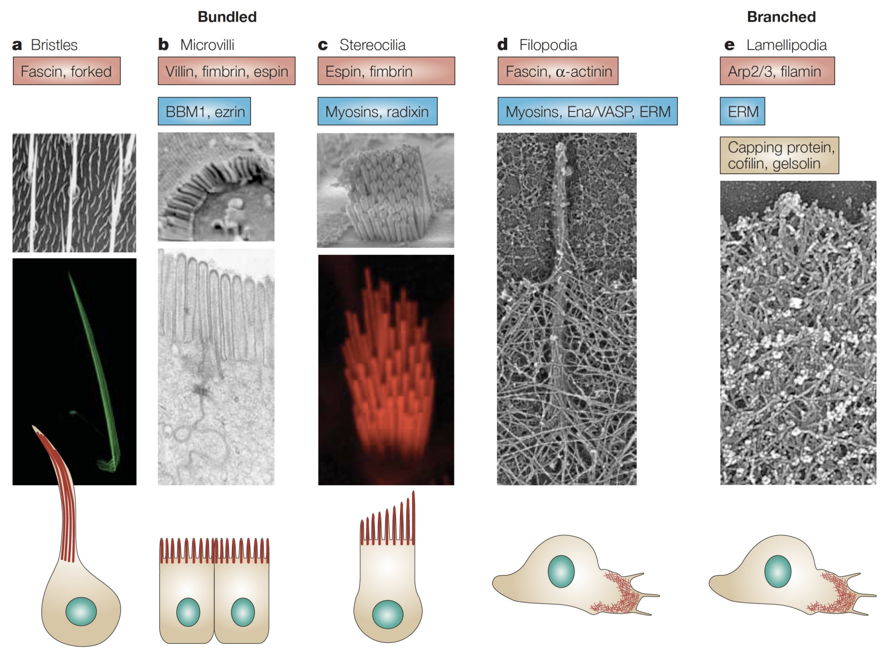

**ACTIN**

Globar(**G-actin**)：375-amino-acid polypeptide carrying a tightly, associated molecule of ATP or ADP(ATP & ADP binding form)
- The amino acid sequences of actins from different eukaryotic species are usually about 90% identical.
- 3 isoforms in vertebrates (α, β, γ): α-Actin is expressed only in muscle cells, while β- and γ-actins are found together in almost all non-muscle cells
- highly conserved

**Actin Subunits Assemble Head-to-Tail to Create Flexible, Polar Filaments**

Actin subunits assemble head-to-tail to form a tight, right-handed helix, forming a structure about 8 nm wide called filamentous or **F-actin**
- Barbed end: Fast-growing plus end
- Pointed end: Slow-growing minus end

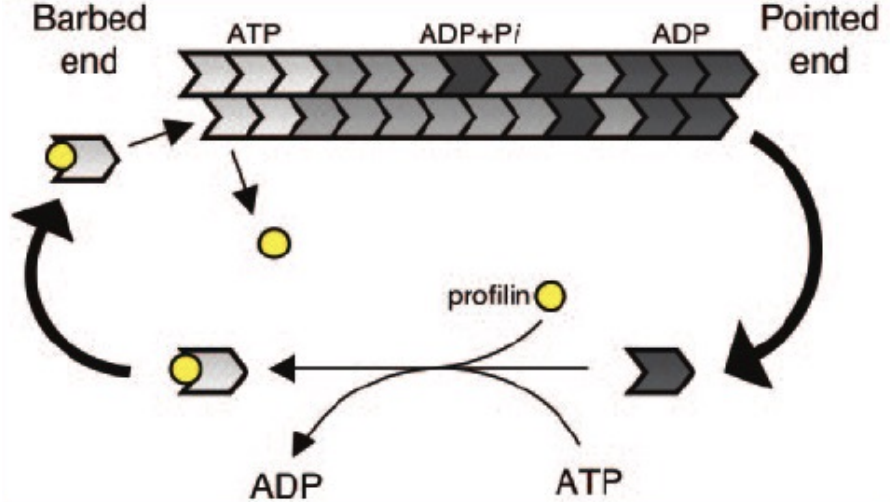

**Structural polarity of the actin filament**

**Nucleation Is the Rate-Limiting Step in the Formation of Actin Filaments**

For a new actin filament to form, subunits must assemble into an initial aggregate, or nucleus, that is stabilized by multiple subunit-subunit contacts and can then elongate rapidly by addition of more subunits. This process is called filament nucleation.

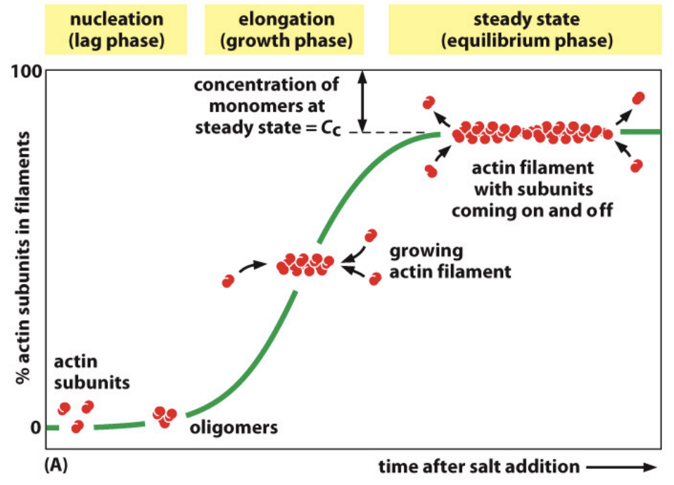

The system approaches a steady state at which the rate of addition of new subunits to the filament ends exactly balances the rate of subunit dissociation. The concentration of free subunits left in solution at this point is called the critical concentration, Cc.

to make this step faster it can perform a filament seeds here.

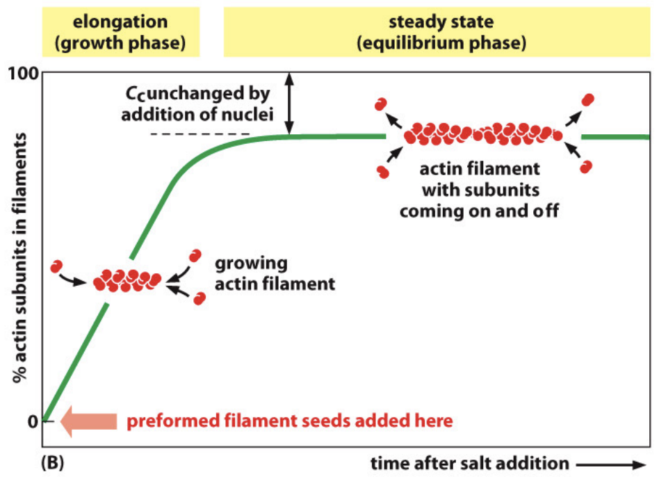

Nucleation is relatively slow

slow end 是因为要经历 conformation change

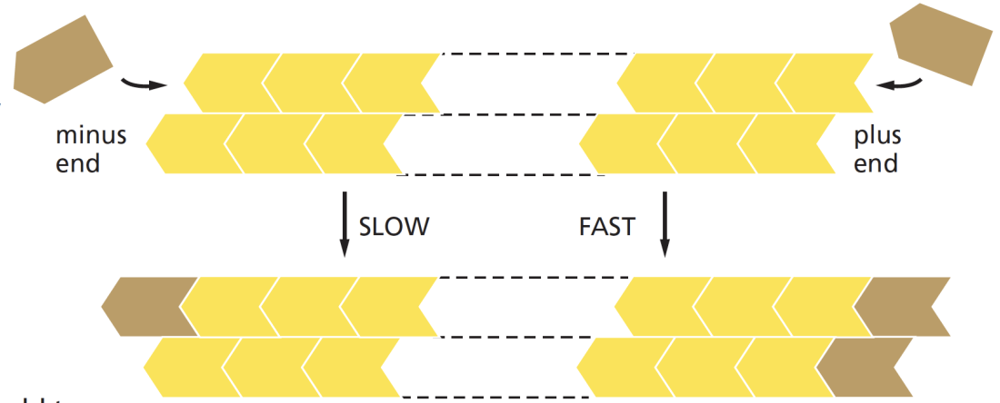

> The number of monomers that add to the polymer (actin filament or microtubule) per second will be proportional to the concentration of the free subunit (`k_on * C`), but the subunits will leave the polymer end at a constant rate (`k_off`) that does not depend on `C`.
> As the polymer grows, subunits are used up, and `C` is observed to drop until it reaches a constant value, called the **critical concentration** (`C_c`).
> **At this concentration, the rate of subunit addition equals the rate of subunit loss.**
> At this equilibrium: 
> $k_{on} \cdot C = k_{off}$
> $C_c = \frac{k_{off}}{k_{on}} = K_d$
> where `K_d` is the dissociation constant.
> 对于 slow-minus end，由于亚基难结合（k_on小），临界浓度较大。

**ATP Hydrolysis Within Actin Filaments Leads to Treadmilling at Steady State**

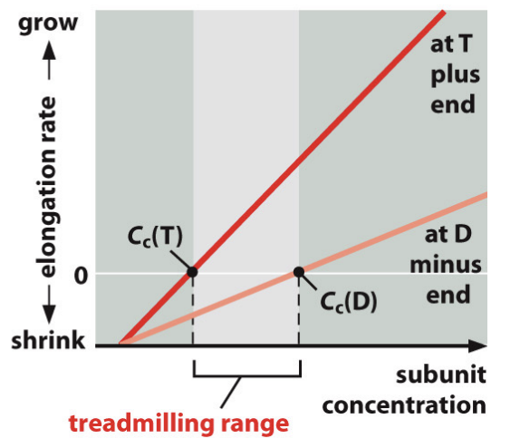

Since \(k_{\text{off}}^D\) and \(k_{\text{on}}^T\) refer to different reactions, 
their ratio 

\[
\frac{k_{\text{off}}^D}{k_{\text{on}}^T}
\]

need not be the same at both ends of the polymer, so that:

\[
C_c (\text{minus end}) > C_c (\text{plus end})
\]

The concentration of free monomer reaches a value that is above \(C_c\) for the plus end 
but below \(C_c\) for the minus end. At this steady state, subunits undergo a net 
assembly at the plus end and a net disassembly at the minus end at an identical rate. 
The polymer maintains a constant length, even though there is a net flux of subunits 
through the polymer, known as **treadmilling**.

**Treadmilling**

In a test tube, the Cc for actin polymerization lower the concentration of unpolymerized actin.
The cell has evolved mechanisms to prevent most of its monomeric actin from assembling into filaments(大概就是这些monomeric actin还有其他用处).

**The Functions of Actin Filaments Are Inhibited by Both Polymerstabilizing and Polymer-destabilizing Chemicals**

Both microtubule-depolymerizing drugs (such as nocodazole) and microtubulepolymerizing drugs (such as Taxol) preferentially kill **dividing cells**, since microtubule dynamics are crucial for correct function of the mitotic spindle

Goal: free the cell at certain stage

**Nocodazole is used to synchronize the cell division cycle**

Inhibit spindle formation so that it will all stop at G2 phase

**Monomer Availability Controls Actin Filament Assembly**

In muscle cell, there's free actin(soluble) and actin-thymosin complex(can't form monomer)/actin-profilin complex
control by accessory proteins

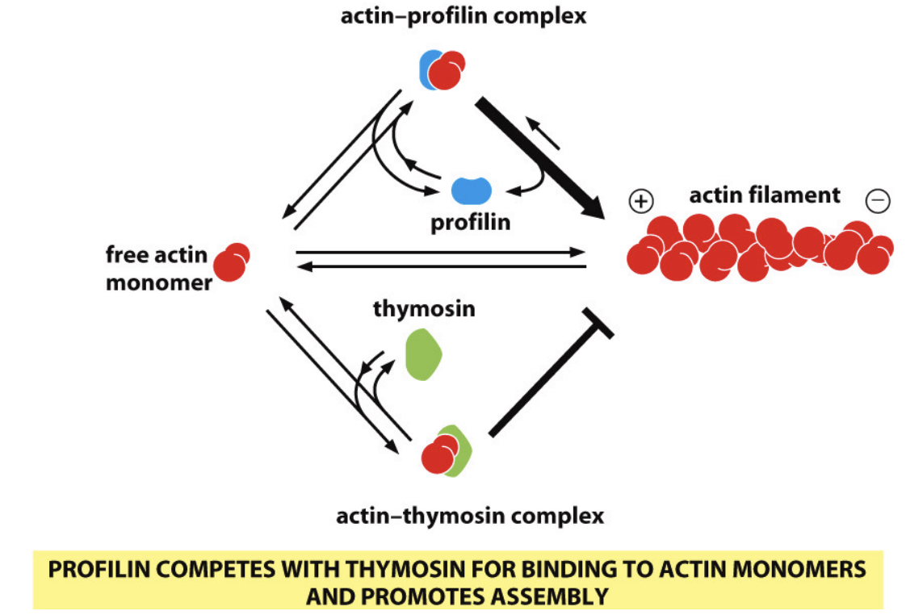

**Some proteins with Filaments**

Help forming actin nucleas

- NFP actually determines where the actin form, attach to cell membrane, Also Arp2 and Arp3 will attach to other filament also control wwhere the filament can go

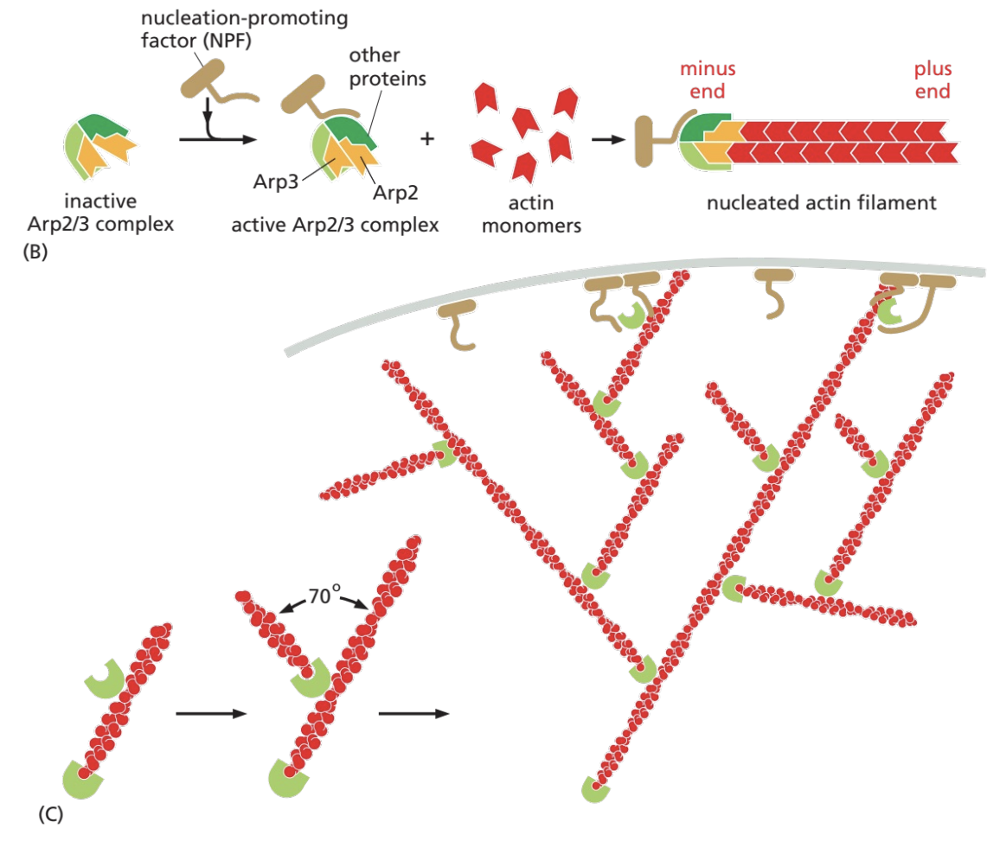

- formins, dimer binding to adding ends, help the growing of plus end; Formin-dependent actin filament growth is strongly enhanced by the association of actin monomers with profilin.

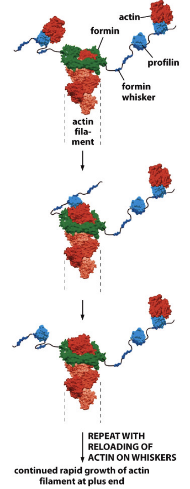

- capping protein(CapZ, binding mucle Z band): stabilizes an actin filament at its plus end by rendering it inactive, so it will only depend on minus end which significantl reducing the growth speed

- Cofilin binds along the length of the actin filament, forcing the filament to twist a little more tightly-> shorter, weakens the contacts between actin subunits in the filament.

**Bacteria Can Hijack the Host Actin Cytoskeleton**

ActA protein on the bacterial surface activates the Arp2/3 complex to nucleate new filament assembly along the sides of existing filaments.(break the cell)

**Actin at the Cell Cortex Determines Cell Shape**

Two type of the shape: 
- the actin filaments of branched networks are nucleated by the Arp2/3 complex, 
- while bundles are made of the long, straight filaments produced by formins.

- **Stress fibers** are contractile and exert tension; **the actin cortex** underlies the plasma membrane and consists of gel-like networks or **dendritic actin** networks that enable membrane protrusion at lamellopodia. (not muscle cell want to move)
- Filopodia are spike-like projections of the plasma membrane that allow a cell to explore its environment.

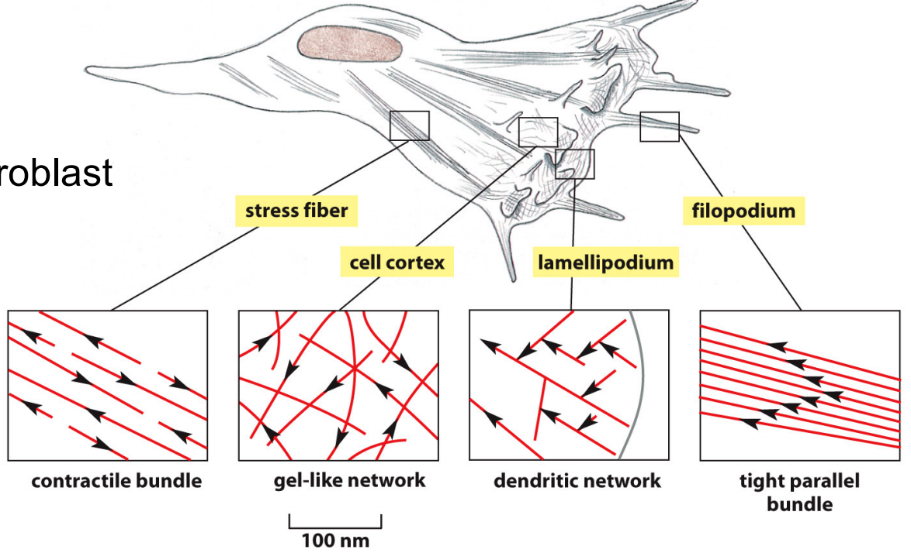

**The modular structures of four actin-cross-linking proteins**

Each has two acting-binding sites (red)

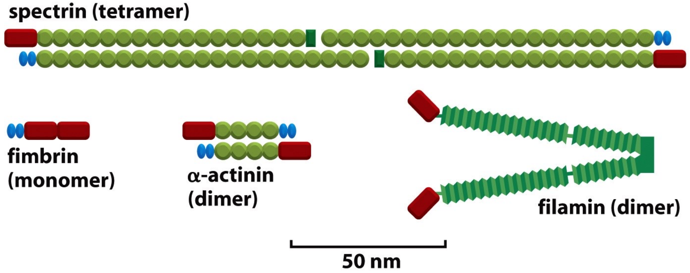

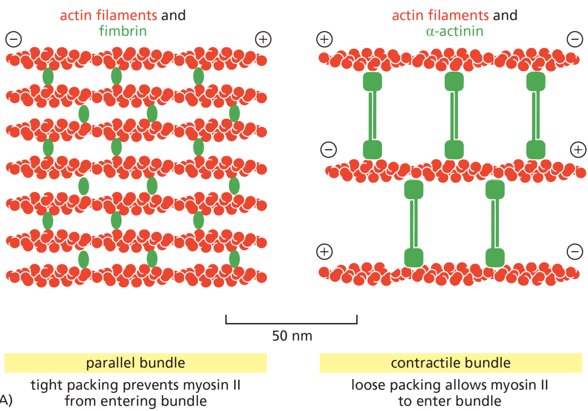

**Higher-Order Actin Filament Arrays Influence Cellular Mechanical Properties and Signaling**

> Periventricular heterotopia (right) caused by mutation in the filamin A gene. A rough zone of cortical neurons (arrowheads) is seen along the lateral walls of the ventricles, representing neurons that have failed to migrate to the cortex during brain development

#### ACTIN AND MYOSIN

**Actin-Based Motor Proteins Are Members of the Myosin Superfamily**

Skeletal muscle myosin (myosin II), which generates the force for muscle contraction, is an elongated protein formed from two heavy chains and two copies of each of two light chains

**The myosin II bipolar thick filament in muscle**

肌肉中的 Myosin II 形成的粗丝是双极的，这种结构使肌球蛋白两端的头部能够向相反方向与肌动蛋白薄丝结合并产生收缩力

**Direct evidence for the motor activity of the myosin head**

put actin filament and ATP, those filament can be moved 

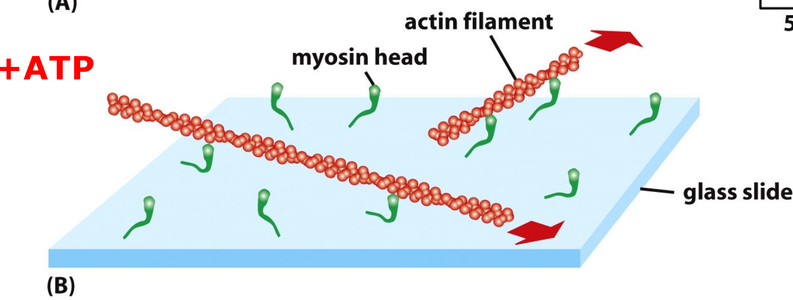

Myosin Generates Force by Coupling ATP Hydrolysis to Conformational Changes

**Sliding of Myosin II Along Actin Filaments Causes Muscles to Contract**

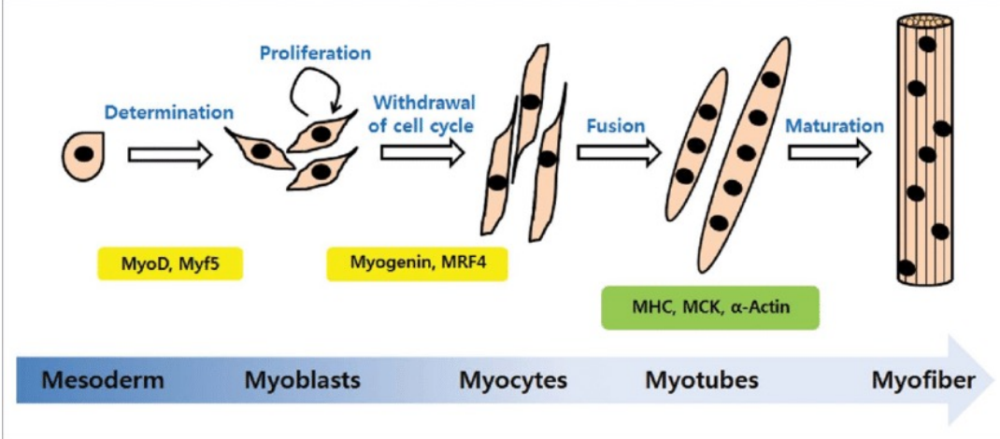

Thick filament: myosin; thin filament: actin

- The Z discs, at each end of the sarcomere, are attachment sites for the plus ends of actin filaments (thin filaments);
- the M line, or midline, is the location of proteins that link adjacent myosin II filaments (thick filaments) to one another.

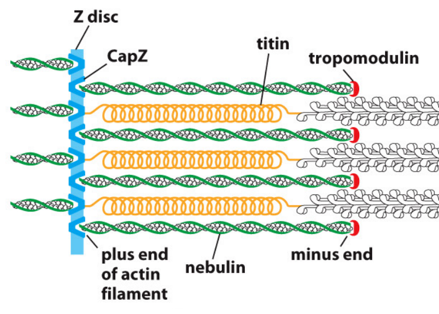

- Nebulin stretches from the Z disc toward the minus end of each thin filament, which is capped and stabilized by tropomodulin.
  - Tropomodulin (Tmod) 是一种 薄丝（actin thin filament）末端帽蛋白。它专门结合 actin 薄丝的减端（pointed end），阻止肌动蛋白单体的脱聚或过度聚合。在肌肉中，它主要位于 薄丝的 Z 盘远端（靠近 pointed end）。
- Titin acts as a molecular spring, with a long series of immunoglobulin-like domains that can unfold one by one as stress is applied to the protein. (determines the length of sacromere)

**A Sudden Rise in Cytosolic Ca2+ Concentration Initiates Muscle Contraction**

folding and reaching into the center of the cell

Ca2+ flooding into the cytosol then initiates the contraction of each myofibril.
The increase in Ca2+ concentration is transient because the Ca2+ is rapidly pumped back into the sarcoplasmic reticulum by an abundant, ATP dependent Ca2+ -pump (also called a Ca2+ -ATPase) in its membrane.

Troponins T，I and C (tropomyosin-binding, inhibitory and Ca2+binding activity).
- In a resting muscle, the troponin I-T complex pulls the tropomyosin out of its binding groove. When the level of Ca2+ is raised, troponin C causes troponin I to release its hold on actin. 
- This allows the tropomyosin molecules to slip back into their normal position so that the myosin heads can walk along the actin filaments.
- Troponin C is closely related to the ubiquitous Ca2+ -binding protein calmodulin.

平滑肌的机理有所不同：

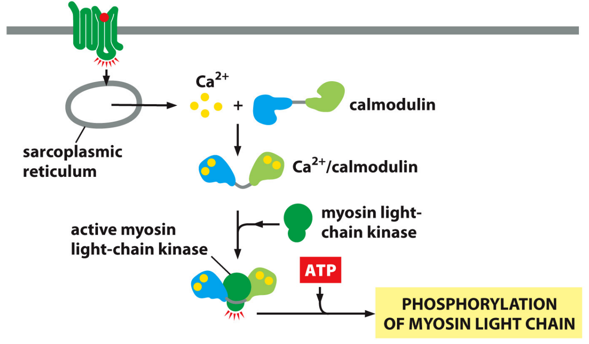

when it is dephosphorylated, the myosin head tends to dissociate from actin and becomes inactive.(这些收缩纤维束以 斜向（斜角）方式排列在细胞内，而不是沿着细胞长度或宽度完全平行/垂直)

**Smooth muscle cells**

- they lack the regular striations(规律条纹) of skeletal muscle
- is also triggered by an influx of calcium ions, but the regulatory mechanism is different
- forms the contractile portion of the stomach, intestine, and uterus, as well as the walls of arteries and many other structures requiring slow and sustained contractions.
- Smooth muscle is composed of sheets of highly elongated spindle-shaped cells, each with a single nucleus

**Heart muscle is a precisely engineered machine**

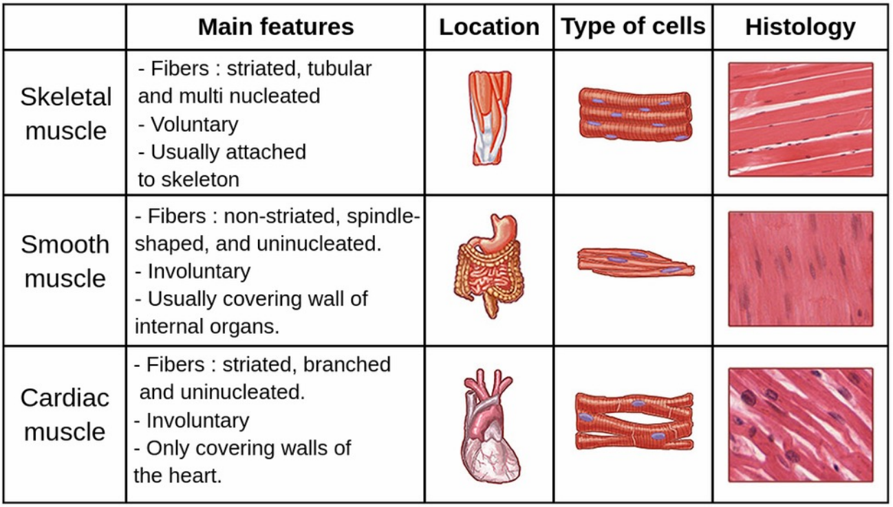

**Actin and Myosin Perform a Variety of Functions in Non-Muscle Cells**

Non-muscle cells also express a large family of other myosin proteins, which have diverse structures and functions in the cell.

> Myosin V transports cargo and organelles along actin cables, in this example moving a mitochondrion into the growing bud of a yeast cell.

#### MICROTUBULES

**Microtubule Introduction**

From monomor to polymer: tubulin

Tubulin subunit is heterodimer formed from two closely related globular proteins called α-tubulin(beginning) and β-tubulin(ends)

Protofilament = 由蛋白单体线性聚合形成的基本纤维链，是微管或肌动蛋白丝等更大细胞骨架结构的构建单元

A microtubule is a hollow cylindrical structure built from 13 parallel protofilaments(但似乎依然会比较容易从中间断裂)

- α-tubulin : GTP never hydrolyzed or exchanged;
- β-tubulin : GTP or GDP

**The preferential growth of microtubules at the plus end**

β-tubulin change GTP to GDP change the shape of the microtubules

The microtubule lattice has a distinct structural polarity:α-tubulin exposed at the minus end and β-tubulin at the plus end. Plus ends grow and shrink more rapidly

**Dynamic instability due to the structural difference between a growing and a shrinking microtubule end**

Loss of the GTP cap allows the GDP containing protofilaments to relax into their more curved conformation.

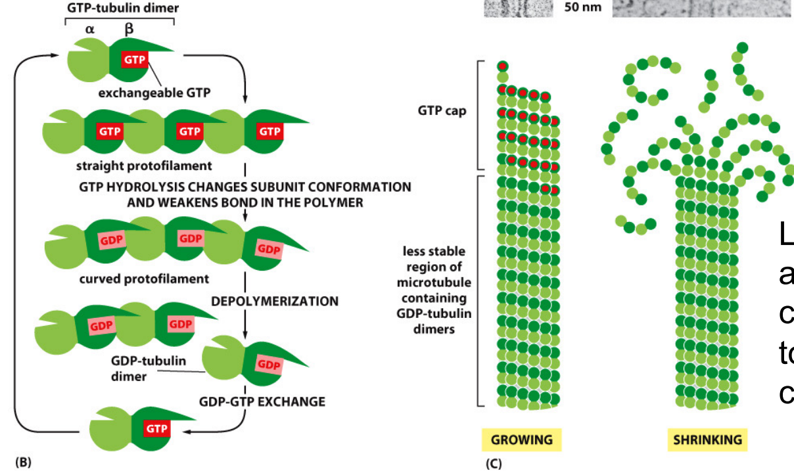

**Microtubules Undergo Dynamic Instability**

**A Protein Complex Containing g-Tubulin Nucleates Microtubules**

γ-tubulin small complex: 2 γ-tubulins + a pair of accessory proteins

Microtubules are generally nucleated from a specific intracellular location known as a microtubule-organizing center (MTOC) where γ-tubulin is most enriched.

**Microtubules Emanate from the Centrosome in Animal Cells**

The centrosome is the major MTOC (microtubule organizing center) of animal cells

Embedded in the centrosome are the centrioles, a pair of cylindrical structures arranged at right angles to each other in an L-shaped configuration.

**Microtubule organization in different cell types**

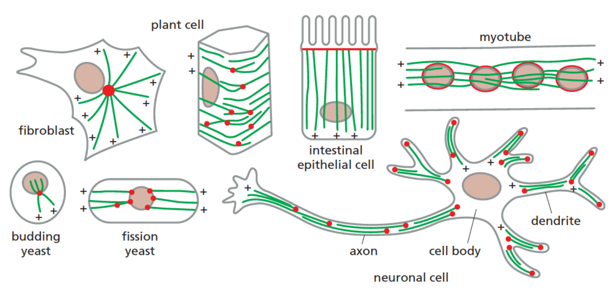

**Microtubule-Binding Proteins Modulate Filament Dynamics and Organization**

MAP2 & Tau:

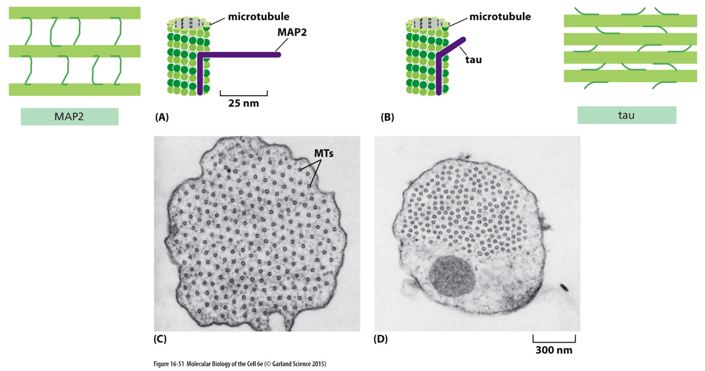

Kinesin-13: binds to microtubule ends and pry them apart

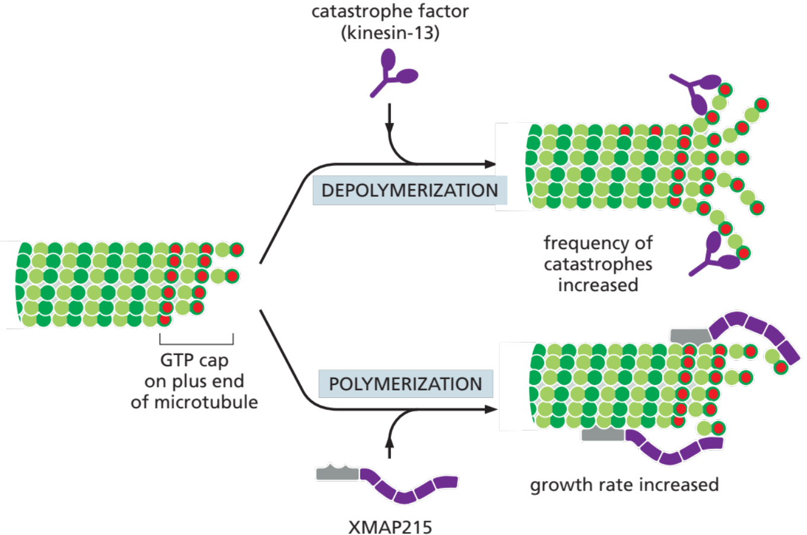

XMAP215: binds tubulin dimers and delivers them to the microtubule plus end

plus-end tracking proteins(+TIPs) : accumulate at the active ends and appear to rocket around the cell as passengers at the ends of rapidly growing microtubules, dissociating from the ends when the microtubule begin to shrink.（稳定加端或调控微管的生长速度。）

Tubulin-Sequestering and Microtubule-Severing Proteins Destabilize Microtubules(结合游离 tubulin 的蛋白和切割微管的蛋白都会破坏微管的稳定性，使微管容易解聚或断裂)

> Taxol stabilized, rhodamine labeled microtubules were adsorbed on the surface of a glass slide, and purified **katanin**(一种微管切割蛋白) was added along with ATP.

**Two Types of Motor Proteins Move Along Microtubules**

kinesins and dyneins: 
- Move cargo such as organelles and macromolecules within the cell; travel over long distances
- Slide microtubules relative to one another, thereby generating specific arrangements of microtubules, as in neurons and epithelial cells
- A subset of microtubule-based motors regulates microtubule dynamics, e.g., kinesin-13

**The mechanochemical cycle of kinesin**

towards plus end
- The rear head detachment from the microtubule with ADP bound [detachment requires ATP hydrolysis and phosphate (Pi) release].
- The binding of ATP to this motor domain causes a small peptide called the “neck linker”(purple) to shift from a rearward-pointing to a forward-pointing conformation

**dyneins**

The dyneins (1.5mDalton) are a family of minus-end directed microtubule motors

Microtubules and Motors Move Organelles and Vesicles: 
- Dynactin mediates the attachment of dynein to a membrane enclosed organelle

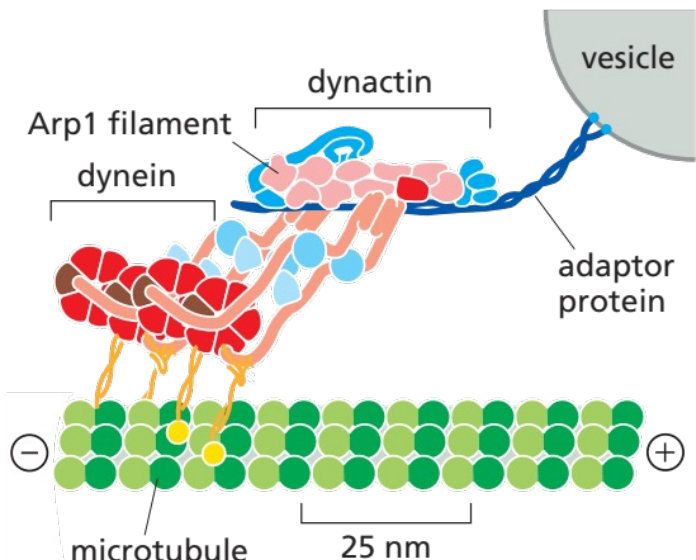

**Microtubules and microtubule motors organize the ER and the Golgi apparatus**

**Lissencephaly**

One type of lissencephaly is caused by defects in Lis1, a dynein-binding protein required for nuclear migration in several species.
- In the normal brain, migration of the nucleus directs the developing neural cell body toward its correct position in the cortex. 
- In the absence of Lis1, this process fails, and affected children suffer from developmental delays as well as a variety of neurological defects.

**Regulated melanosome(黑色素体) movements in fish pigment cells**

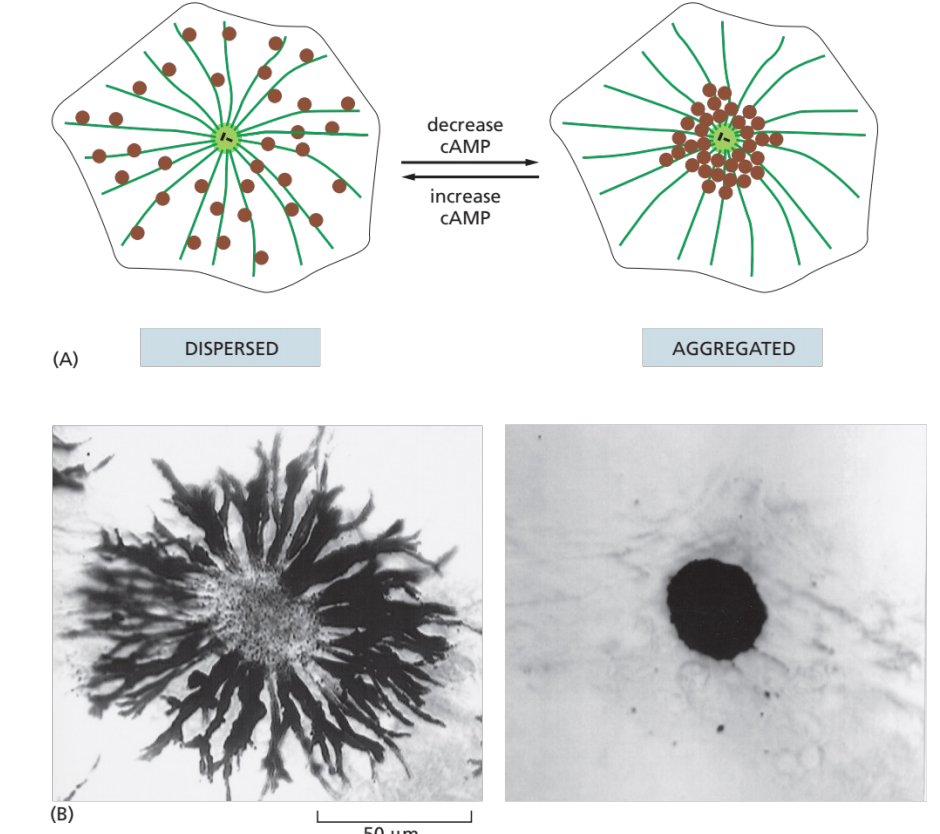

**Motile Cilia and Flagella Are Built from Microtubules and Dyneins**

The arrangement of microtubules in a flagellum or cilium (“9+2”): Nine special microtubule doublets (comprising one complete and one partial microtubule fused together so that they share a common tubule wall) are arranged in a ring around a pair of single microtubules.

-  flexible protein links prevent the sliding of the doublet. The motor action therefore causes a bending motion, creating waves or beating motions.
  
  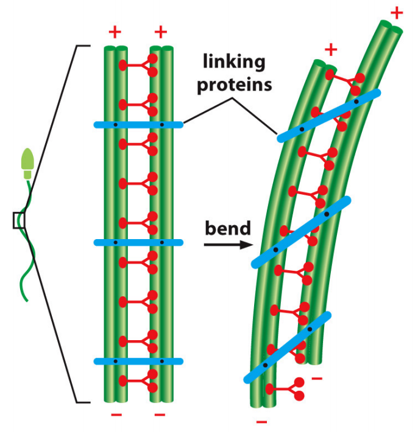

-  Proteolytic enzyme trypsin breaks the flexible protein links holding adjacent microtubule doublets together
  
  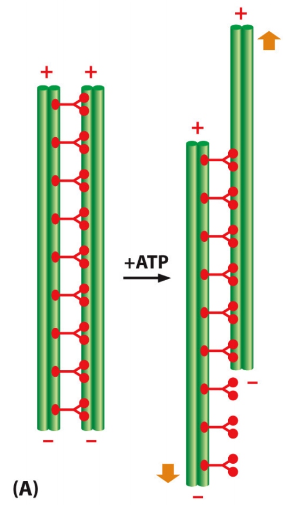

**Microtubule-Binding Proteins Modulate Filament Dynamics and Organization**

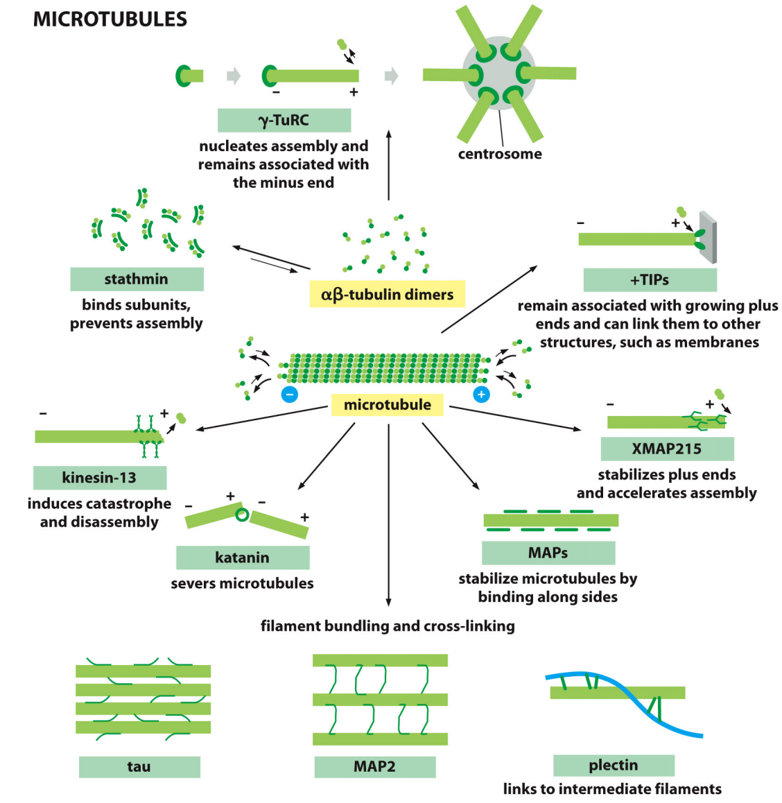

#### INTERMEDIATE FILAMENTS

这种中间丝（intermediate filament）仅在某些后生动物（metazoans）中形成细胞质丝（cytoplasmic filament），包括脊椎动物（vertebrates）、线虫（nematodes）和软体动物（mollusks）。

**Cytoskeletal Filaments Adapt to Form Dynamic or Stable Structures**


**Intermediate Filament Structure Depends on the Lateral Bundling and Twisting of Coiled-Coils**

monomer is quite like a string

**Intermediate Filaments Impart Mechanical Stability to Animal Cells**

Keratins(角蛋白) are the most diverse intermediate filament family
> Epidermolysis bullosa simplex (defective keratins expressed in the basal cell layer of the epidermis): the skin blisters in response to even very slight mechanical stress, which ruptures the basal cells of the skin
>

**Plakin protein family: link IF network to the rest of the cytoskeleton**

Plectin (green): making crosslinks from intermediate filaments (blue) to microtubules (red).

> Mutations in the gene for plectin cause a devastating human disease that combines epidermolysis bullosa (caused by disruption of skin keratin filaments), muscular dystrophy (caused by disruption of desmin filaments), and neurodegeneration (caused by disruption of neurofilaments).

**SUN-KASH protein complexes connect the nucleus and cytoplasm through the nuclear envelope**


**During Mitosis the Nuclear Envelope Disassembles**


#### CELL POLARIZATION AND MIGRATION


**Cell polarization is controlled by members of the Rho protein family**


# ✅Chapter 4 Biomembranes

There's a lot of compartment in Eucaryotic cells

### Cell membranes

Cell membranes are composed of lipids and proteins
The lipid component consists of millions of lipid molecules arranged in two closely apposed sheets (lipid bilayer)
Eucaryotic organisms have internal membranes which enclose internal compartments

> lipid: 
> - dont have polymer form
> - hydrophobic
> - tiny

Membrane Functions
- Selective barriers，semipermeable
- transport of small molecules
- receiving information, cell signaling
- Fluid properties, capacity for movement and expansion during cell growth and motility

The lipid bilayer is about **5 nm** or **50 atoms** thick

> first cell from enclosed membrane structure

#### phophoglycerides, spingolipids, and sterils are the major lipids in cell membrane

- contains of phosphoglycerides, sphingolipids, sterols
- The most abundant type of PL is **phosphatidylcholine**
- all **Amphipathic** lipid molecules
  Other amphipathic membrane lipids include the sterols (cholesterol) and glycolipids which have sugars attached to their head groups.

  

  

- sterol: stablize the membrane
  -  Cholesterol is an important component of cell membranes
  -  It fills in the gaps generated by kinks in unsaturated hydrocarbon tails
  -  Helps to stiffen membranes

#### lipid bilayer
  
**phospholipids spontaneously form bilayers**

> Gorter and Grendel (1925)
> Langmuir-Blodgett Trough (air/water interface)
> 如果细胞膜是磷脂双分子层，那么把细胞膜摊平铺成一个单层，其面积应该是细胞表面积的两倍

hydrophilic and hydrophobic molecules interact differently with water

minimizing the interaction between water and hydrophobic part

Phospholipids will spontaneously form spherical bilayers called vesicles or liposomes

**the lipid bilayer is a teo-dimensianl Fluid**

They can diffuse laterally ~2um, the length of a bacterial cell in one second
They can rotate at speeds up to 30,000 RPM
They flip-flop rarely (less than once per month) without the help of enzymes

- plasma mambrane: asymmeric liquid bilayer

**the fluidity of a lipid bilayer depends on its composition**

- unsaturated hydrocarbon chains with cis-double bonds(会更短)
- saturated hydrocarbon chains: decrease fluidity

later membrane more rigid and thicker, contains more cholesterols

**lipid bilayer can form domains of different composition**

在引入固醇之后，Lateral phase separation in artificial lipid bilayers
raft domain-> rigidity 


**glycolipids are found on the surface of all eukaryotic plasma membranes**


#### lipid monolayer

**lipid droplets are surrounded by a phospholipid monolayer**


- neutral lipid(triglycerides) form in between of ER bilayer(within hydrophobic space)

**the asymmetry of the lipid bilayer is functionally important**

The plasma membrane has an asymmetrical distribution of glycolipids and phospholipids 

The **orientation** of the membrane relative to the cytosol is **preserved** during vesicle transport

#### membrane proteins

- transporters
- anchors
- receptors
- enzymes

**Examine the general structure and properties of membrane proteins**

transmembrane domains
- alpha-helix is most common: on the surface of helix are hydrophobic, hydrophilic one are wrapped into helix, so it can coexit with membrane
- Less common is the beta-barrel: Form wide channels - (porins)

**membrane proteins can be associated with the lipid bilayer in various way**


**lipid anchor control the membrane localization of some signaling proteins**

attachment by a fatty acid chain or a prenyl group

**In Most Transmembrane Proteins, the Polypeptide Chain Crosses the Lipid Bilayer in an a-Helical Conformation**

- Using hydropathy plots to localize potential α-helical membrane-spanning segments in a polypeptide chain

> 疏水性图（最常见的是 Kyte-Doolittle 曲线）是一种通过计算蛋白质序列中氨基酸的疏水/亲水性质，从而预测蛋白质结构（特别是跨膜结构域）的强有力工具。
> 正峰（高于基线）：代表疏水性区域。如果峰值达到阈值（通常在 +1.6 左右）且宽度合理，通常暗示存在跨膜片段。
> 负谷（低于基线）：代表亲水性区域，通常位于蛋白质表面或暴露在胞质/胞外环境中。

- Two short α helices in the aquaporin water channel, each of which spans only halfway through the lipid bilayer

**Transmembrane a Helices Often Interact with One Another**

就是很多个螺旋会自发的组合到一起

**some beta barrels form large channels**

form from different numbers of beta-strands，不同strands数量

**Many membrane proteins are clycosylated**

Glycosylation occurs in the Golgi apparatus
- glycocalyx layer(糖萼)

Cell recognition

A single-pass transmembrane protein（单次跨膜蛋白）
> 信号转导 (Signal Transduction)：许多单次跨膜蛋白是受体（例如受体酪氨酸激酶，RTK）。
> - 胞外域：负责捕捉外界的信号（如生长因子）。
> - 跨膜域：负责将信号从膜外传导至膜内。
> - 胞内域：通常具有激酶活性，捕捉到信号后会发生构象改变（如二聚化），从而在胞内触发级联反应。
> 细胞黏附 (Cell Adhesion)：例如某些细胞表面标记物，只需通过单次锚定即可将细胞连接到基质或其他细胞上。

**membrane proteins can be solubilized and purified in detergents**

SDS: ionic detergents
Detergents are amphipathic and can disrupt lipid bilayers and solubilize integral membrane proteins

(The use of mild nonionic detergents for solubilizing, purifying, and reconstituting functional membrane protein systems.)


**nanodisc**: artificial membrane stablizing 

- Integral membrane proteins (transmembrane, lipid linked, monolayer associated) must be solubilized with detergent to remove them from the membrane for study
- Peripheral membrane proteins can be released by gentle methods which leave the membrane intact

**Bacteriorhodopsin**

- is a light-driven proton pump 7 aa-helix

using Retinal as light-sensor, Retinal is vitamin A in its aldehyde form and is identical to the chromophore found in rhodopsin of the photoreceptor cells of the vertebrate eye.

**Membrane-bending Proteins Deform Bilayers**


- Hydrophobic Insertion: 插入动作会增加膜一侧（通常是外层）的表面积，从而产生向外或向内的张力，迫使膜发生弯曲。
- Scaffolding Mechanism: 这些蛋白通过静电相互作用大量结合到膜表面。由于蛋白质本身的弧度非常大且刚性较强，膜会被迫贴合蛋白质的形状，从而形成管状或球状结构。
- Protein Crowding: 大量的蛋白质被招募到膜的特定区域时，它们之间会发生物理碰撞和空间排斥。为了缓解这种相互挤压带来的侧向压力，膜会向压力较小的一侧弯曲，从而增加表面积以容纳这些密集的蛋白质

#### protein membrane interation

memberane proteins often function as large complexes
> cell fusion very difficult
> - muscle cell
> - fertilization

**Many membrane proteins diffuse in the plane of the membrane**

> FRAP

**cells can confine proteins and lipids to specific domains within a membrane**

Tight junctions can result in an asymmetrical distribution of membrane proteins


> 表皮细胞：tight(water molecule cant in) junction, prevent apical protein move into basal part, important in bladder
> sperm cell: protein target to assemble in different part
> Urinary Bladder
> - 屏障功能：防止尿液中的代谢废物和电解质回流进组织。
> - 机械适应：在膀胱充盈拉伸时维持细胞间结构的完整性。
> 精子的三个部位也是泾渭分明

locolization code in protein-> self assemble into large aggregates
- they can be tethered by interactions with assemblies of macromolecules (B) outside 
- or (C) inside the cell; 
- or (D) they can interact with proteins on the surface of another cell

#### cytoskeleton

**The Cortical Cytoskeleton Gives Membranes Mechanical Strength and Restricts Membrane Protein Diffusion**

cortical cytoskeleton: 位于细胞质膜（Plasma Membrane）内侧的一层由肌动蛋白丝（Actin filaments）、频谱蛋白（Spectrin）等构成的致密网络

The spectrin(血影蛋白)-based cytoskeleton on the cytosolic side of the human red blood cell plasma membrane. anchored by Ankyrin

> Fence Model:
> Corralling plasma membrane proteins by cortical cytoskeletal filaments.
>
> 
>

### Membrane transport

most ions have significant different concentration in cytoplasmic and extracellular

#### PRINCIPLES OF MEMBRANE TRANSPORT

**protein-free lipid bilayers are impermeable to ions (only hydrophobic molecules can cross the lipid bilayer)**

**There're 2 main classes of membrane transport proteins: transporters(Permeases) and channels**

transporters are like enzyme; channel-pro interaction is more weak, "-gated"

**Active transport is mediated by transporters coupled to an Engery Source(light; ATP; concentration different)**

Electrochemical gradients:** concentration gradients & membrane potential(bigger force)

transporter: outward-open and inward-open and occluded, energy input can be used to change the conformation


Transporter-mediated diffusion is saturable because it depends on a finite number of transport proteins, whereas simple diffusion increases linearly with concentration and does not saturate.


**Active transport drived by three ways**

- Coupled transporter（耦合转运蛋白）: Uses the electrochemical gradient of one molecule (usually a concentration gradient) to drive the transport of another molecule across the membrane.
  - Symporter（同向转运蛋白）
  - Antiporter（反向转运蛋白 / 交换蛋白）
  - Uniporter（单分子转运蛋白）
- ATP-driven pump（ATP驱动泵）: Hydrolyzes ATP (producing ADP + P) to provide energy for transporting molecules or ions against their concentration or electrochemical gradients.
- Light-driven pump（光驱动泵）: Absorbs light energy and converts it via light-sensitive proteins (e.g., rhodopsins) into the ability to transport molecules or ions against their gradient.

Transporters built from inverted repeats.

> Mechanism of glucose transport fueled by a Na+ gradient.
> Two Types of Medicines are Developed in Na+-Couple Transport:
> - Anti-diabetic (and more) drugs: SGLT2抑制剂，原本是Na+-Glucose共转运蛋白，抑制之后减少糖重吸收
> - Anti-depressant: The serotonin/norepinephrine transporters targeted by antidepressants are Na⁺-dependent

**The serotonin/norepinephrine transporters targeted by antidepressants are Na⁺-dependent**


#### Transporters and active membrane transport

3 classes of ATP-Driven Pumps:
- P-type(phosphorylation)
- ABC (ATP Binding Cassette)
- F-type/V-type


**P-type ATPase pumps Ca2+ into the Sarcoplasmic reticulum in muscle cells**
> The concentration of Ca2+ is very important for cells(more, toxic)
> clearance of it is important

The pumping cycle of the sarcoplasmic reticulum Ca2+ pump.
 


**Plasma Membrane Na+-K+ Pump(3 Na+ in and 2 K+ out) -> create a net negative charge**

> the concentration gradient of Na+ across the membrane is a source of potential energy-required reaction

**Osmotic swelling**

different tactics are used to avoid osmotic swelling


**ABC Transporters Constitute the Largest Family of Membrane Transport Proteins**

Small-molecule transport by typical ABC transporters
- Bacterium：大概意思就是有很多家族的蛋白他们是相互合作的
  


- Drug resistance

**Mitochondrial ATP Synthase or F1F0 type pump**:

Moves protons down the electrochemical gradient from the intermembrane space to the matrix

Movement of protons powers the synthesis of ATP


#### Channels and the electrical properties of membrane

channel proteins form hydrophilic pores across membranes.

channel has much more efficiency and speed compare to transporters

Channels need not be coupled to an energy source

One class of channel proteins found in virtually all animals forms gap junctions between two adjacent cells

- gated (voltage. extracellular-ligand, intracellular-ligand, mechanically)
- particular selectivity filter


Mechanosensitive Channels Protect Bacterial Cells Against Extreme Osmotic Pressures

**Membrane Protential: K+ leak channels -> resting potential of the cell become negative, The Resting Potential Decays Only Slowly When the Na+-K+ Pump Is Stopped**

> The resting potential of an animal cell varies between –20 mV and –120 mV, depending on the organism and cell type.

Potassium channel: very selective


carbonyl oxygen-> smaller sodium tend to interact with 4 carbonyl oxygen in solvent instead of in channel

#### CHANNELS AND THE ELECTRICAL PROPERTIES OF MEMBRANES

The function of a Neuron Depends on its elongated structure

In nerve and skeletal muscle cells, a stimulus that causes sufficient depolarization promptly opens the voltage-gated Na+ channels, allowing a small amount of Na+ to enter the cell down its electrochemical gradient.(*positive feedback*)

Voltage-gated:


voltage sensitive domain(S4 helix)

in electrically excitable cells((closed)rest -> (open)depolarized -> (inactivated)refractory)


sodium channel faster than K+ channels
Hyperpolarization: inactivate the sodium channel


**Myelination** create by Schwann cells, has node of Ranvier, Increases the Speed and Efficiency of Action Potential Propagation in Nerve Cells

Myelin is formed by specialized supporting cells called glial cells: 
- In the peripheral nervous system, Schwann cells myelinate axons
- whereas in the central nervous system, oligodendrocytes perform this function.

> Multiple sclerosis:

Transmitted-Gated ion channels convert chemical signals into electrical ones at chemical synpases, Release small signal molecules known as neurotransmitters

- Neurotransmitters can be excitatory or inhibitory


**neuromuscular junction**

acetylcholine receptor of skeletal muscle cells: Composed of five transmembrane polypeptides, two of one kind and three others, encoded by four separate genes


Neuromuscular Transmission Involves the Sequential Activation of Five Different Sets of Ion Channels


Many psychoactive srugs act at synpases

> Channelrhodopsins
> Patch-Clamp Recording: Individual Ion Channels Open in an All-or-Nothing Fashion

> Long-Term Potentiation (LTP) in the Mammalian Hippocampus Depends on Ca2+ Entry Through NMDA-Receptor Channels
>
> 
>
> 哺乳动物海马中的长期增强（LTP）依赖 NMDA 受体介导的 Ca²⁺ 流入，引发突触后 AMPA 受体增加，从而增强突触传递

# ✅Chapter 5 Intracellular Compartments and Protein Sorting 

### The compartmentalization of cells

**All Eukaryotic Cells Have the Same Basic Set of Membrane-enclosed Organelles**
- nucleus envelope: very elaborate
- Golgi apparatus: not big compared to ER, morphology in different cells 
- ER: almost half of membrane system
- Arranged by sytoskeleton, and it'll attach to different membrane organelle


- cytosol: half of the cell
- 这个分布是在不同细胞有所不同的

**Evolutionary Origins May Help Explain the Topological Relationships of Organelles**

The precursors of the first eukaryotic cells are thought to have been simple organisms that resembled bacteria

symbiotics(内共生学说)


this explain those laminar parts are equivalent to the extracellular part, because they are kind of created by those extracellular part

Compartments are said to be topologically equivalent if they can communicate with one another.

protein into or outof the cell: membrane-enclosed carriers

topologically 2 defined compartment: 
1. cytosolic inside the cell
2. extracellular compartment
  
Proteins Can Move Between Compartments in Different Ways
The synthesis of all proteins begins on ribosomes in the cytosol
Sorting signals that direct their delivery to locations outside the cytosol
Three fundamentally different transport mechanisms
- Gated Transport (Nuclear Pore Complex): may be the most priminative one
- Protein Translocation (Mitochondria/ER)
- Vesicle Transport


- ER uses a lot of vesicle transport to deliver cargo

Signal Sequences and Sorting Receptors Direct Proteins to the Correct Cell Address
- present on the primary sequence of the amino acids
- Typically 15–60 residues long
- These signal sequences are often found at the N-terminus(所以到底是为什么在C端)

Most Organelles Cannot Be Constructed *De Novo*: They Require Information in the Organelle Itself
- no need, two daughter cells will inherit part of the organelle from mother cell 

#### THE TRANSPORT OF MOLECULES BETWEEN THE NUCLEUS AND THE CYTOSOL


The nuclear envelope encloses the DNA and defines the nuclear compartment
- inner nuclear membrane and outer nuclear membrane
Two concentric membranes, which are penetrated by nuclear pore complexes
- The inner nuclear membrane contains specific proteins that act as anchoring sites for chromatin and for the nuclear lamina
- the outer nuclear membrane is continued to ER membrane
- even in inner and outer nuclear membrane, the protein composition is quite different


Nuclear Pore Complexes Perforate the Nuclear Envelope
- Estimated molecular mass of about 125 million daltons and is composed of about 30 different NPC proteins, or nucleoporins

fiber & basket, gel-like assembly, phase separation


Nuclear Localization Signals Direct Nuclear Proteins to the Nucleus
(also nuclear export signals)
- Nuclear localization signals can be located almost anywhere in the amino acid sequence and are thought to form loops or patches on the **protein surface**
- 自发穿过核孔的大小为5000道尔顿, 比如GFP就是大的

Nuclear Import Receptors Bind to Both Nuclear Localization Signals and NPC Proteins
- the NLS solve the problem of specificity, but how to hand over?: competed with a signal molecule
  - The Ran GTPase Imposes Directionality on Transport Through NPCs: switches, have off/on states
  


  - two states can interact with their effector proteins
  - very weak GTPase, so need to rely on GTP avtivated protein(Ran-GAP), and can be turn on by Ran-GEF

- Nuclear Export Works Like Nuclear Import, But in Reverse


#### THE TRANSPORT OF PROTEINS INTO MITOCHONDRIA AND CHLOROPLASTS

Translocation into Mitochondria Depends on Signal Sequences and Protein Translocators
- Proteins imported into mitochondria are usually taken up from the cytosol within seconds or minutes of their release from ribosomes
- Translocated into mitochondria by a post-translational mechanism
- 4 different destination in mitochondia
  
  

  - TOM: translocon of outer membrane
  - SAM: Sorting and Assembly Machinery complex
  - OXA: Oxidase Assembly complex

Mitochondrial Precursor Proteins Are Imported as Unfolded Polypeptide Chains


- 似乎是想说他们的destination有可能不同
- ATP Hydrolysis and a Membrane Potential Drive Protein Import Into the Matrix Space
- mitochondia equivalent:(比刚刚那个循环更加efficient)
  - 好像就是第三步通过结合ATP和ADP的state互换，然后就能拉着走？


Transport Into the Inner Mitochondrial Membrane and Intermembrane Space Occurs Via Several Routes

1. importing protein all the way to inner membrane
   - 2 signals: recognized by TOM & TIM
   - 如果第二个信号被解离了，这个protein就会滞留在inner membrane
  
  

2. from matrix to inner membrane
   
  
  
3. reduced and oxidative
   - 进入线粒体的蛋白质会表现出reduced的state(二硫键断开)
   - shaprones in inner mambrane will oxidase the protein

4. TIM22: stay in inner membrane(transporter protein)

Two Signal Sequences Direct Proteins to the Thylakoid Membrane in Chloroplasts
- Thylakoids are membrane-bound compartments inside chloroplasts and cyanobacteria. They are the site of the light-dependent reactions of photosynthesis. 
- Thylakoids consist of a thylakoid membrane surrounding a thylakoid lumen. Chloroplast thylakoids frequently form stacks of disks referred to as grana

#### PEROXISOMES

All eukaryotic cells have peroxisomes
They contain oxidative enzymes, such as catalase （deals with H2O2） and urate oxidase 
Functions: 
- lipid catabolism: break down very long fatty acids (VLCFA), “β-oxidation”
- phospholipid synthesis: cell membrane, plasmalogen (myelin sheath that covers the nerve)
- reduction of Reactive Oxygen Species

> Peroxisomes defect:
> accumulation of metabolism intermedia
> Adrenoleukodystrophy (ALD) is a rare genetic condition that causes the buildup of VLCFAs in the brain. When VLCFAs accumulate, they destroy the protective myelin sheath around nerve cells, responsible for brain function.

enriched with electron

Peroxisomes Use Molecular Oxygen and Hydrogen Peroxide to Perform Oxidation Reactions
- Catalyze reactions in the formation of plasmalogens, which are the most abundant phospholipids in myelin
- Peroxisome disorders often lead to neurological disease

A Short Signal Sequence Directs the Import of Proteins into Peroxisomes
- Ser-Lys-Leu at the C-terminus

### Endoplasmic reticulum

nuclear envelope

different part of ER has different morphology: (这一块主要是confocal microscope)
- tubules
- sheets


> ER first discovered by **electron microscope**

ER can be very diverse in different cells
- (most of them under electron microscope)Rough ER
- smooth ER (enriched in lipid tissue)
  - Smooth ER in the hepatocyte: principal site of production of lipoprotein particles; contain enzymes for detoxification (e.g. cytochrome 450)
- transitional ER

**Smooth tubules rough sheets**


Smooth ER: more irregular
当我们isolate 之后形态就不复从前了

**isolation: obtain rough and smooth microsomes**


reconstitute the functions of ER in body

**Protein synthesis: co-translational and post-translational protein translocation**

a significant magnitude of energy is invested in protein synthesiz

Reason why ribosome has to attach to ER: facilitate targeting/sorting; transporting; protein folding
- co-translational
- post-translational


intrinstic property of proteins -> intracellular organization

**Signal Sequences**

first discovered in rough ER

> Nobal prize in 1999
> B cells(antibody)
> isolate the microsome

signal peptide: very N terminal of each amino acid chain

**Translocon: a translocator with the accessory componants**

after protein transport in ER, signal peptidase cut the signal peptide, 似乎是帮忙打开translocon

- A signal-recognition particle(SRP): 
  - Acts as a partner for the signal peptide during translation and is associated with the ribosome
  - Functions as a translational pause factor, temporarily halting translation after the SRP binds to the ER lumen
  - Localizes to the endoplasmic reticulum membrane, further translation can proceed
  
  

  

⬆️ 然后这个东西就叫做 co-translational translocation

> 怎么做translocon的实验
>
> 
> 

the polypeptide chain passes through an aqueous channel in the translocator

However: can be opened all the time(have to be control)


signal peptide(short hydrophobic helix) insert into the complex, displace th plug

The assembly of a translocator with the accessory components is called the “translocon.”

也不是所有都需要elongation：

**Post-translational translocation**

invest energy:


Post-translational translocation in eukaryotic cells requires an additional complex composed of Sec62, Sec63, Sec71, and Sec72 proteins, which is attached to the Sec61 translocator and deposits BiP molecules onto the translocating chain as it emerges from the translocator in the lumen of the ER. 

**transmembrane protein insertion**

In Single-Pass Transmembrane Proteins, a Single Internal ER Signal Sequence Remains in the Lipid Bilayer as a Membrane-spanning a Helix

an ER signal sequence is recognized twice:
- SRP
- pore of the protein translocator


heavily charged protein

If there are more positively charged amino acids immediately preceding the hydrophobic core of the start-transfer sequence than there are following it, the membrane protein is inserted into the translocator in the orientation shown in pathway A.


Combinations of start-transfer ans Stop-stransfer signals determine the topology of multipass transmembrane proteins


进一步可以有多个跨膜区域了

**Tail-anchored Protein**

ER Tail-anchored Proteins Are Integrated into the ER Membrane by a Special Mechanism

ATPase: provide energy; helping targeting


**Translocated Polypeptide Chain Fold and Assemble in the Luman of the Rough ER**

sugar modified protein(glycosylated: N-linked oligosaccharide)
start in ER luman, continue in golgi
90% happens on asparagine region(N-linked)


oligosaccharyl transferase: donor of sugar transport by enzyme to the protein

Oligosaccharides Are Used as Tags to Mark the State of Protein Folding


- unfolded: 3 glucose
- glucose trimming: left only 1 glucose
  - **chaperone**: Lectin（凝集素）一类能够特异性识别糖链结构的蛋白质, helping folding
- calnexin & glucosidase: check and mark the complete folding
- or glucosyl transferase will add back glucose

Improperly Folded proteins are exported from the ER and Degraded in the cytosol

**ER associated degradation**

another ATPase(figure): unfold polypeptide, pull them through a ring structure, each dephopholate pull the chain


**Unfolded Protein Response**

- increase protein folding capacity
- shutdown gene responsible for protein synthesis


**GPI anchor**

Some Membrane Proteins Acquire a Covalently Attached Glycosylphosphatidylinositol (GPI) Anchor

glycosylphosphatidylinositol


**Lipid bilayers**

asymmetric process: alies on the one leaflet of bilayer of ER

All the substrate are found in cytosolic site

phospholipid translocator: **Scramblase**: ATP-independant enzyme

Lipid scrambling: a regulated lynchpin in a dynamic equilibrium
  
speed is more important

肝脏细胞：脂蛋白非常hydrophobic所以需要package

> TMEM41B
> covid -> RNA virus very fragile, hijack lipid production of cell
> KO TMEM41B, virus can't leave

> Torsin

> OST
> unknown怎么在细胞质那一侧合成的，也不知道是怎么flip进去的

# Chapter 6 Intracellular Memberane Traffic

### Molecular mechanism of membrane transport


- In the secretory pathway (red arrows), protein molecules are transported from the ER to the plasma membrane or (via endosomes) to lysosomes.
- In the endocytic pathway (green arrows), molecules are ingested in endocytic vesicles derived from the plasma membrane and delivered to early endosomes and then (via late endosomes) to lysosomes.

vesicle function -- the delivery process
- cell growth and division
- endocrine and exocrine physiology
- neurophysiology

coating proteins
- The assembly and disassembly of a clathrin coat:
  - daptor Proteins Select Cargo into Clathrin-Coated Vesicles; Each type of adaptor protein is specific for a different set of cargo receptors
  
  

- dissembly: expose the target protein, serve as a mechanism to recycle coat mechinary

1. LIPID SIGNALS: They are very specialize: in a inositol ring, all the position can be phosphorated, can locolize on specific position; "poster coat"; unique proteins that can recognize and bind to the phosphorate inositol
  
  

2. PROTEIN LAYERS: signal molecular switches, localize at very specific position in cells(by targeting signals)
   > Sar1 protein is the coat-recruitment GTPase responsible for the assembly of COPII coats at the ER membrane.
   > Sec23 and Sec24 are COPII adaptor coat proteins, which form the inner coat.
   >
   > 
   >
   > 就是说其实Sar1只是用来招募，但是对于cargo的识别是依赖于后面招募的这些蛋白实现的。

**recognizing the correct target membrane with which to fuse.**

Specificity in targeting is ensured because all transport vesicles display surface markers that identify them according to their origin and type of cargo, and target membranes display complementary receptors that recognize the appropriate markers. This crucial process occurs in two steps.

- First, Rab proteins and Rab effectors direct the vesicle to specific spots on the correct target membrane.
  - Docking(Rab effector--tethering proteins): remain weak but long range interaction between
  - returnable, reversible
  - Like the coat-recruitment GTPases, they also are monomeric GTPases, and are regulated by specific GEFs (activators) and GAPs (inactivators); very weak enzymes; enable regulate
  - In their GDP-bound state, they are inactive and bound to another cytosol protein (Rab-GDP dissociation inhibitor, or GDI) that keeps them soluble in the cytosol; in their GTP-bound state, they are active and tightly associated with the membrane of an organelle or transport vesicle.

- Second, SNARE proteins and SNARE regulators mediate the fusion of the lipid bilayers.
  - very stable, ireversible
  - *specialized fusion proteins that overcome the energy barrier to catalyze all membrane fusions in cells*
  - These transmembrane proteins exist as complementary sets, with v-SNAREs usually found on vesicle membranes and t-SNAREs usually found on target membranes.
  - once they meet each other, they form the hollow complex; the interaction is so strong to provide enough energy to push and overcome the energy barrier
  - dissemble need ATPases(NSF) -> ATP hydrolysis to break down the interaction
  - complexin stabilizes SNARE complex and prevents premature disassembly
  
  


> many virus enter the cells by fusing their membrane with cells' membrane

### The transport from ER to Golgi

also enable by coating transport vesicle: COPI & COPII

General principles:
- Only Proteins That Are Properly Folded and Assembled Can Leave the ER
  - Those that are misfolded or incompletely assembled transiently remain in the ER, where they are bound to chaperone proteins such as BiP or calnexin.
  - The chaperones may cover up the exit signals or somehow anchor the proteins in the ER.

RETRIEVAL PATHWAY:
- proteins be used in ER
- specific recepter will correspond to another protein COPI
- Soluble ER resident proteins, such as BiP, contain a short ER retrieval signal at their C-terminal end: it consists of a Lys-Asp-Glu-Leu or a similar sequence.


The golgi appartus consists of an ordered series of compartments
- Golgi: 
  - cis Golgi network (CGN)
  - cis cisterna, medial cisterna, trans cisterna
  - trans Golgi network (TGN)
- one single galgi localize near the nucleus; plant cell 有很多
- Oligosaccharide Chains Are Processed in the Golgi Apparatus

  

  - All of the Golgi glycosidases and glycosyl transferases, for example, are single-pass transmembrane proteins, many of which are organized in multienzyme complexes.

Proteogylcan are assembled in the Golgi Appartus
- N-LINKED GLYCOSYLATION and O-LINKED GLYCOSYLATION
- The Golgi apparatus confers the heaviest O-linked glycosylation of all on mucins, the glycoproteins in mucus secretions, and on proteoglycan core proteins, which it modifies to produce proteoglycans.

Purpose of glycosylation:
- Promote protein folding;
- Make a glycoprotein more resistant to digestion;
- Protection;
- Regulatory roles in signaling.

### The transport from Trans Golgi network to the lysosome

lysosome(0.2-0.5um):
- enrich in electrons
- Lysosomes contain about 40 types of hydrolytic enzymes. hydrolases that work best at acidic pH. For optimal activity, they need to be activated by proteolytic cleavage, which also requires an acid environment. 
- hetergenous: 
  - Late endosomes containing material received from both the plasma membrane by endocytosis and newly synthesized lysosomal hydrolases fuse with preexisting lysosomes to form structures that are sometimes referred to as **endo-lysosomes**, which then fuse with one another.
  
  

Plant and fungal vacuoles are remarkably versatile lysosomes

A Mannose 6-Phosphate Receptor Sorts Lysosomal Hydrolases in the Trans Golgi Network
- are added exclusively to the N-linked oligosaccharides of these soluble lysosomal enzymes as they pass through the lumen of the cis Golgi network.
  
  

  

- A GlcNAc phosphotransferase recognizes lysosomal hydrolases in the Golgi apparatus; A second enzyme cleaves off the GlcNAc, exposing mannose 6-phosphate.

> Defects in the GlcNAc Phosphotransferase Cause a Lysosomal Storage Disease (LSD) in Humans
> treatment: infusion the proteins to the patients

Multiple Pathways Deliver Materials to Lysosomes
- Endocytosis: macromolecules taken up from extracellular fluid by endocytosis
- Phagocytosis: in phagocytic cells, such as macrophages and neutrophils in vertebrates, is dedicated to the engulfment of large particles and microorganisms to form phagosomes.
- Macropinocytosis specializes in the nonspecific uptake of fluids, membrane, and particles attached to the plasma membrane.
- Autophagy originates in the cytoplasm of the cell itself and is used to digest cytosol and worn-out organelles.
  - not only for damage curing but also for recycling
  - Autophagy can be either nonselective or selective.
    - In nonselective autophagy, a bulk portion of cytoplasm is sequestered in autophagosomes. It might occur, for example, in starvation conditions: when external nutrients are limiting, metabolites derived from the digestion of the captured cytosol might help the cell survive.
    - In selective autophagy, specific cargo is packaged into autophagosomes that tend to contain little cytosol, and their shape reflects the shape of the cargo. Selective autophagy mediates the degradation of worn out, or otherwise unwanted, mitochondria, peroxisomes, ribosomes, and ER; it can also be used to destroy invading microbes.(special organelle or large molecules)
  > 在酵母中同时阻断液泡中的降解酶活性（使自噬内容物无法被分解）并通过饥饿诱导自噬，结果导致自噬体进入液泡后不能被降解而大量积累，从而可以在显微镜下直接观察到这些囊泡结构


1. Induction (signaling)
2. Isolation membrane (membrane cup) formation
3. Closure of the membrane cup around the target to form a sealed double-membrane-enclosed autophagosome.
4. Fusion of the autophagosome with lysosomes, catalyzed by SNAREs.
5. Digestion of the inner membrane and the lumenal contents of the autophagosome.
  
# Chapter 9 cell signaling

Definition of communication process: 
1. governs basic activities of cells
2. coordinates all cell actions

affects many aspect: 
1. Activation of enzyme activity--metabolism, survival, apoptosis, immunity, cell cycle...
2. Change in cytoskeletal organization--movement, immunity, transportation…
3. Change in ion permeability--neural transmission, immunity, transportation…
4. Initiation of DNA synthesis--cell cycle, cell growth, reproduction, differentiation…
5. Change in gene expression--cell differentiation, development, stress, immunity…

4 forms of cell signaling:
1. contact-dependent
2. paracrine(旁分泌)
3. synaptic
4. endocrine

Basic elements in a signaling pathway:


1. reception
2. transfuction
3. response

### overview of cell signaling

为什么multicellular organisms 会比 unicellular organisms 更晚发生就是因为cell stimulation还没有进化出来

> Multicellular organisms appeared on Earth 2.5 billion years after unicellular organisms did (fossil record). The long delay may reflect the difficulty of evolving the language systems (Cell Signaling) that enables cells to collaborate and coordinate their behavior.

##### Unicelluar organisms:

1. it's nessesary: responding to physical and chemical changes in their environment including the presence of other cells.
2. To sense and adapt to the fluctuating environment by detecting and responding to temporal and spatial signals, initiating signal transduction cascades that lead to changes in gene expression.(in response to environment gives unicellular organismsthe plasticity to survive in rich, neutral and hostile situations.)
  
- quorum sensing: 
  - QS is a system of stimuli and responses correlated to population density.
    - coordinate gene expression according to the density of their local population.
    - some social insects (ants, honeybees) use quorum sensing to determine where to nest.
  - mechanism: the exchange of small chemicals between unicellular organisms.
- Yeast mating:
  - when a haploid individual is ready to mate, it secretes a peptide mating factor that tells cells of the opposite mating type to stop proliferating and prepare to mate
  - produces a diploid cell, which can undergo meiosis and generate haploid cells with new assortments of genes.
  - To help a species survive in an unpredicted (harsh) environment.

##### Multicellular animals:

- hundreds of kinds of signal molecules:
   1. Secreted signal-dependent signaling
   2. Contact-dependent signaling
   3. Gap Junctions

- secreted signal-dependednt signaling:
  - endocrine: signal factor and target have high specifity, long disance
    - growth hormone
  - paracrine: usually not same cell type, close distance
    - rapidly taken up by neighboring target cells
    - destroyed by extracellular enzymes
    - immobilized by the extracellular matrix
  - autocrine: eg cancer cell (一些生长因子)
  - synaptic: different cell of neuron cell can release same kind of signaling molecule, 就是他们的特异性是靠突触本来距离就很近形成的
  > Growth hormone is an example of endocrine signaling
  > - the growth hormone is synthesized in the pituitary, located at the base of the brain, and travels to the liver via the blood.

- contact-dependent signaling:
  - the signal molecules are transmembrane proteins.
  - membrane-attached signal & receptor
  > Class I MHC & Class II MHC

- gap juction:
  - communicate with each other directly, provide for the most intimate/convenient cell communication
  - Gap junctions are narrow water-filled channels that directly connect the cytoplasm of adjacent cells, allowing the exchange of ions and small water soluble molecules 大分子是不能通过的
  - coodinate manner(important): In the heart, GJs mediate the electrical coupling of cardiomyocytes and dictate the speed and direction of cardiac conduction.

##### General principles of cell signaling

- Each cell responds to specific combination of signals:
  - Cells integrate different information and mounts an appropriate and comprehensive response.
  
  

  - Two ways of signal integration
    1. Signals A and B activate different pathways, each leads to the phosphorylation of protein Y at different sites. protein Y is activated only when both sites are phosphorylated.
    2. Different Y subunits need to be phosphorylated by two pathways.

- Different cells respond to the same molecule differently
- Four features of cell signaling
  - specificity: 
  - amplicication
  - desenitization/adaptation
  - integration
- fate of cells depends on the position:
  - The same signal on the same cell type has qualitatively different effects depending on the signal’s concentration.
  - The extracellular signal in these cases is called a morphogen(形态发生素), it diffuses out from a localized cellular source, generating a concentration gradient.
  - The responding cells adopt different cell fates according to the position in the gradient

##### signal molecules & receptors

Binding of extracellular signaling molecules to cell-surface receptors triggers a conformational change in the receptor, which in turn leads to intracellular signal transduction pathways

extracellular signaling usually involves 8 steps:


1. synthesis
2. release of the signaling molecule by the signaling cell
3. transport of the signal to the target cell
4. binding of the signal by a specific receptor leading to a conformational change
5. initiation of one or more intracellular signal-transduction pathways by the activated receptor
6. specific changes in cellular function, metabolism, or development
7. feedback regulation usually involving deactivation of the receptor
8. removal of the signaling molecule terminates the cellular response.

slow response: such as cell growth and division, involve changes in gene expression and new protein synthesis; slowly, needs hours or more.
Fast response: such as changes in cell movement and secretion—need no changes in transcription, occurs very fast, seconds or minutes.

- signal molecules
  
  

- receptors include two classes: cell-surface receptors/intracellular receptors
  
  

  for intracellular receptors: A. The nuclear receptors; B. The cytoplasmic receptors

- function of the receptorsL
  - receptor-mediated endocytosis
  - signal transduction: 
    1. The activation of receptor promotes the signaling cascades
    2. The desensitization of receptor turns off cascades
    3. The down-regulation of receptor dampens signaling
  - different protein
    1. Relay proteins: simply pass the message to the next signaling component in the chain
    2. Adaptor proteins: link one signaling proteins to another.
    3. Bifurcation proteins: spread the signal from one signaling pathway to another.
    4. Amplifier proteins (enzymes or ion channels): signaling cascade
    5. Transducer proteins: convert the signal into a different form
    6. Integrator proteins: receive signals from two or more signaling pathways and integrate them before relaying a signal onward (Coincidence detector).
    7. Messenger proteins: carry the signal from one part to another (from cytosol to nucleus).
    8. Latent gene regulatory proteins: are activated at the cell surface by activated receptors and then migrate to the nucleus to stimulate gene transcription.
  
Three types of intracellular signaling complexes
- preformed signaling complex on a scaffold protein: near the recptor, charge some signaling proteins on the scaffold -> signaling complexes
  - The receptor and the intracellular proteins are preassembled into a signaling complex on the inactive receptor by the scaffold protein.
  - not cross talk 完全线性的信号传播
  
  

- assembly of signaling complex on an activated receptor: phosphorylate itself on multi-sites
  - The signaling complex assembles on a receptor only after the binding of signal molecule. The activated receptor phosphorylates itself at multiple sites, which then act as docking sites for the downstream signaling proteins.

  

- assembly of signaling complex on phosphoinositide docking site:
  - Receptor activation leads to the increased phosphorylation of phosphoinositides in adjacent plasma membrane, which serve as docking sites for downstream signaling proteins, which can now interact with each other.

  

interaction domains/corresponding structural motif

> 

different domain target to different motif

| Domain（结构域） | 主要识别对象 / motif | 主要功能 | 典型蛋白 |
|---|---|---|---|
| PTB domain | NPXY motif | 识别 receptor tail、signal adaptor docking | Shc、IRS-1 |
| PDZ domain | 膜蛋白 C-terminal motif | scaffold assembly、膜蛋白聚集 | Dishevelled、FAP |
| SH2 domain | phosphotyrosine | 识别 RTK 磷酸化位点、signal recruitment | Src、Grb2、Shc、STAT |
| SH3 domain | Proline-rich motif | protein-protein interaction、recruitment | Src、Nck |
| WW domain | Pro-rich motif | ubiquitination-related interaction | Nedd4、Smurf、Dystrophin |
| Death domain | Death-domain-containing proteins | apoptosis signaling | Fas、FADD |
| LIM domain | turn-based motifs | cytoskeleton / transcription regulation | LIM proteins、Zyxin |
| PH domain | phosphoinositides | membrane targeting | Akt、SOS |
| FYVE domain | PI3P | endosome targeting | EEA1、SARA |

How cells turn on/off a signaling(一页ppt我看不清楚字)
- When they receive a signal, they switch from an inactive to an active conformation, until another process switches them off.
- If a signaling pathway is to recover after transmitting a signal so that it can be ready to transmit another, every activated molecule in the pathway must return to its original, inactivated state.
- signaling by phosphorylation
  - 一个诺奖发现

  

- signaling by GTP binding 
  - 一个诺奖发现
  - GEFs (Guanine nucleotide-exchange factors): GEFs are proteins that bind to an inactive G protein and stimulate the dissociation of the GDP in exchange for binding of GTP. **GEFs activates G-protein**
  - GDIs (Guanine nucleotide-dissociation inhibitors):  GDIs are proteins that inhibit the release of GDP from a G-protein, thus maintaining G-protein in the inactive, GDP-bound state. **GDIs inactivate G-protein**
  - GAPs (GTPase-activating proteins): Most G proteins possess some capability to hydrolyze a GTP, but this capability is greatly accelerated by interaction with specific GAPs. **GAPs inactivate G-protein by promoting GTP hydrolysis.**

  

### Signal transduction mediated by receptors within cells

##### the nuclear receptors:

hydrophobic signal molecules diffuse directly across the plasma membrane of target cells and bind to intracellular receptors that are gene regulatory proteins.

They bind to intracellular receptors and alter the ability of these proteins to control the transcription of specific genes.

Nuclear receptors:
1. Steroid hormones—Cholesterol
2. Vitamin D—Secosteroids (Cholesterol-like)
3. Retinoids —Vitamin A
4. Thyroid hormone- tyrosine-based

- Nuclear receptors are structurally related and belong to the same protein superfamily.
- Many nuclear receptors were identified only through DNA sequencing, and their ligands are still unknown; these are called orphan nuclear receptors. 

  
  
##### the signaling triggerd by gases

- signal triggered by NO: acetylcholine relaxes the smooth muscle cell
  - nerve terminus in the vessel wall(acetylcholine) -> endothelial cell(NO) -> smooth muscle cells(guanylyl cyclase)
  
  

  > angina: pain resulting from inadequate blood flow to the heart muscle
  > nitroglycerine (converted to NO)

##### the cytosolic receptors

  - pattern recognition receptors in cells(PAMPs & DAMPs)
  - TLR, RNA sensor, DNA sensors, NLRs, ALR
  
  

### Signaling mediated by receptors on cell surface

##### The ion-channel-coupled receptors:
  
- voltage-gated ion channel receptors ligand-gated ion channel receptors
- involved in synaptic signaling between nerve cells, or nerve cells and other electrically excitable target cells such as muscle cells.
> Synaptic signaling:
> 1. Electrical signal activates the Voltage-gated ion channel receptors, causing the release of neurotransmitters (chemical signal);
> 2. Neurotransmitters (chemical signal) bind to the Ligand-gated ion channel receptors on the postsynaptic cell, causing the change of membrane potential (electrical signal), thus relay the signal.
>
> 
>

##### G protein-coupled receptors

- the largest family of receptor(一些数量)
- mediate most responses to signals from the external world as well as signals from other cells, including hormones, neurotransmitters, and local mediators.
  


- C-terminal:S/T rich sites of phosphorylation, sites of phosphorylation allow for the desensitization of GPCRs; Ligands bind to the extracellular portion of the receptor.
- sitimulating/inhibitings: work on the same enzyme, sitimulatory G protein complex, inhibitory G protein complex
  - Stimulatory Ligands/Receptor---Stimulatory G protein (Gs) to activate adenylyl cyclase
  - Inhibitory Ligands/Receptor --- Inhibitory G protein (Gi) to inhibit adenylyl cyclase
- Heterotrimeric G proteins: alpha: bind to GTP/GDP; α and γ have covalently attached lipid molecules that help bind them to PM, activated by G protein-coupled receptors.
- Monomeric G proteins: homologous to α subunit in heterotrimers, belongs to the Ras superfamily of small GTPases
  
> 1. Ras superfamily consists of various monomeric GTPases
> 2. only Ras and Rho relay signals from cell-surface receptors
>
> 
> 

- types of G protein α subunit
  
| G protein α subunit | 全称 / 类型 | 主要作用靶点 | 下游信号通路 / 效应 | 典型功能 |
|---|---|---|---|---|
| Gsα | G stimulatory | 激活 adenylate cyclase (AC) | ↑ cAMP → 激活 PKA/cAMP-dependent pathway | 促进代谢与激素信号 |
| Giα | G inhibitory | 抑制 adenylate cyclase (AC) | ↓ cAMP | 抑制 cAMP signaling |
| Goα | G other | 主要通过 βγ subunit 发挥作用 | βγ-mediated signaling | 神经系统信号常见 |
| Gt | transducin | 激活 cGMP phosphodiesterase (PDE) | ↓ cGMP | 视觉光信号转导 （phototransduction） |
| Gq/11α | Gq family | 激活 phospholipase C-β (PLCβ) | PIP2 → IP3 + DAG；Ca2+ release；PKC activation | 免疫与 Ca2+ signaling |
| G12/13α | G12/13 family | 激活 RhoA | 调控 actin cytoskeleton | 细胞骨架重塑与迁移 |


- 不同种类的activation其实是不一样的：一种是本来就会binding，一种是inactive的时候也binding
  


1. In the unstimulated state, the G protein α subunit binds GDP, and the G protein remains inactive.
2. Extracellular ligand binding to a GPCR induces a conformational change in the receptor and then in the G protein.
3. The activated GPCR functions as a guanine nucleotide exchange factor (GEF), promoting GDP-to-GTP exchange on the α subunit.
4. GTP binding activates both the α subunit and the βγ complex, which then regulate target proteins at the plasma membrane.
  
- The synthesis and degradation of cyclic AMP (cAMP)
  - cAMP is synthesised from ATP by adenylyl cyclase(AC)
  - cAMP is unstable in cells because it is hydrolyzed by phosphodiesterases (PDE) to form 5’-AMP
  - cAMP concentration can increase more than 20x folds in cells following AC activation within seconds, and such a rapid change requires balancing a rapid synthesis of the molecule with its rapid breakdown.
  
- cyclic-AMP-dependent protein kinase
  - PKA phosphorylates serine/threonine in selected target proteins, which differ from one cell type to another
  - The catalytic subunit of PKA phosphorylates/activates PDE itself, making cAMP degrade rapidly. This makes sure the PKA response brief and strong, instead of a prolonged weak response.
  
  

  - alter gene transcription
  
  

- another pathway: GPCRs activate PLCβ
  - PLCβ cleaves PIP2, which generates two second messengers:
  1. Inositol 1,4,5-trisphosphate (IP3)-- releases Ca2+ from the ER and thereby increases the concentration of Ca2+ in the cytosol.
  2. Diacylglycerol (DAG)-- remains in the plasma membrane and helps activate protein kinase C (PKC).

> 

> **Gi:** 乙酰胆碱作用于 M2 muscarinic receptor → 激活 Gi 蛋白
> Gαβγ-GDP -> Gα-GTP+Gβγ
> - 激活后(Gα-GTP)会抑制 adenylyl cyclase, cAMP 下降后，PKA 活性下降
> - Gβγ 打开 GIRK K⁺ 通道后，K⁺ 更容易外流，使膜电位更加负，也就是发生超极化

> **Gq:** Gq → PLCβ → IP3 + DAG → Ca²⁺ + PKC
> PLCβ 把 PIP₂ 切成两个第二信使, 然后具体作用见上

- Olfactory GPCRs in olfactory neurons
  - Odorant activates GPCR, olfactory-specific G protein (Golf), and adenylyl cyclase
  - Elevated cAMP opens cAMP-gated channels, causing the influx of Ca2+ & Na+
  - Olfactory neurons get depolarized and excited
  
  

- Vision -- GPCR-mediated response to photon via ion channels
  - Rod photoreceptor cells: There are about 1000 discs in the outer segment. Each disc has many photosensitive GPCR ----rhodopsins, The plasma membrane contains cGMP-gated ion channels.
  - Photon activates rhodopsins -> Gt (transducin) -> cGMP PDE(分解 cGMP，从而终止或降低 cGMP 介导的信号) -> Reduced cGMP -> Shut off cGMP-channel
  - 以上流程具有一个amplification的机制
  
  

- Desensitization of a signal(Negative feedback)
  1. Activated ligand bound GPCR activates rhodopsin kinase - GRK
  2. RGS protein (GTPase activating protein GAP) – binds and inactivate Gt
  3. activates guanylyl cyclase - generates cGMP - open cGMP-gated cation channels again
  - help rods return to their dark-adapted state, also known as the night vision state.
  - allow rods to reduce their response during continuous light exposure.

- Five ways of desensitization of a signaling
  
  

- Turn off signal is as crucial as turn-on!!
  > choleraz
  > Cholera toxin constitutively activates Gs, The resulting prolonged elevation in cAMP concentration within intestinal epithelial cells activates CFTR Cl- channel--causes a large efflux of Cl– and water into the gut, thereby causing the severe diarrhea that characterizes cholera.

##### Enzyme-coupled receptors

Whereas a GPCR has seven transmembrane segments, each subunit of an enzyme-coupled receptor typically has only one. 

**Receptor tyrosine kinase(RTK)**

Ligands of RTKs:
1. Nerve growth factor (NGF)
2. Platelet-derived GF (PDGF)
3. Fibroblast GF (FGF)
4. Epidermal GF (EGF)
5. Ephrins (Eph)
6. Insulin and insulin-like GF (IGF)
7. Vascular endothelial GF (VEGF)

structure:


Activation of RTKs by dimerization
- For most RTKs, ligand binding causes the receptors to dimerize, bringing the two cytoplasmic kinase domains together and thereby promoting their activation.
  
  

Insulin and Insulin-like growth factor (IGF)1 signaling
  
  

Activation of the epidermal growth factor recepter kinase:
- The asymmetric dimer causes an activating conformational change in the receiver. 
- The active receiver phosphorylates tyrosines in both receptors to form docking sites.
- (EGFR 主要通过不对称二聚体中的变构激活，而不是通过 activation loop 的 trans-autophosphorylation 激活。)


Dominant-negatie inhibition by mutant RTK
- express mutant inside the cell has normal ligand binding domain but not tyrosine kinase domain

The binding of SH2-containing intracellular signaling proteins to an activated RTK
- RTK 被激活后会在胞内区产生多个磷酸化酪氨酸位点，这些位点作为 docking sites 招募含 SH2 domain 的信号蛋白。不同 SH2 domain 不仅识别 p-Tyr 本身，还识别其周围氨基酸环境，因此不同磷酸化位点可以招募不同下游蛋白，启动不同信号通路。


RTK & Monomeric small G proteins:
- steps in activation of Ras by RTKs
  
  

- negative regulation: c-CBL, 主要是去磷酸化和泛素化这个RTK
- it always works with adaptor protein to either activate a Ras-GEF or inhibit a Ras-GAP.

Ras activates mitogen-activated protein kinase


- signaling cascade
- convert short-lived signaling events into long-lasting signal
- function:
  - Yeast: mating
  - Flies: differentiation
  - Plants: pathogen defense
  - Mammals: proliferation & differentiation

>
> 
> 
> - must use scaffold proteins-> help prevent cross-talk between parallel MAP kinase modules

RhoA GTPase-mediated growth inhibition: guiding cell migration and nerce axon outgrowth
- Ephrin A1-EphA4 RTKs interaction on the growth cone;
- P-Y of EphA4 recruit and activate a tyrosine kinase to activate Rho-GEF ephexin
- Rho-GEF ephexin activates RhoA
- RhoA stimulates actin contraction and cytoskeleton collapse, stops axon growth
  
  

generation of phosphoinositide docking sites by PI3K:


- PIP2->PIP3
- PIP3 serves as doking site for proteins with PIP3-binding PH domain

One way in which signaling through PI 3-kinase promotes cell survival:


five parallel intracellular signaling pathways...


**Tyrosine kinase associated receptors**

TYrosine kinase-associated receptors: the JAK-STAT signaling pathway activated by cytokines


- cytokines as ligand
- Janus kinases(JAK)-> doking site of STAT2
- signal transducers and activators of transcription: dimerize
- JAK-STAT pathway 的其他ligand

TGF superfamily acts through receptor serine/threonine kinases and smads
- This superfamily includes the TGFβ/activin family and the bone morphogenetic protein (BMP) family.
  
  

  1. TGFβ dimer promotes the assembly of a tetrameric receptor complex containing two copies each of the type-I and type-II receptors.
  2. Type-II receptors phosphorylate type-I receptors and activate their kinase domains and leading to phosphorylation of R-Smads(Receptor-activated Smads).
  3. Smads form a trimeric Smad complex containing two R-Smads and the co-Smad, Smad4.
  4. The phosphorylated Smad complex enters the nucleus and control gene transcription.
  5.  During the signaling response, the Smads continuously shuttle between the cytoplasm and the nucleus: they are dephosphorylated in the nucleus and exported to the cytoplasm, where they can be rephosphorylated by activated receptors.
- negative feedback: 
  1. Inhibitory Smads: Smad6/7 transcriptionally induced by activated Smads and binds to the cytosolic tail of the activated receptor and inhibits its signaling.
  2. competes with R-Smads for binding sites on the receptor;
  3. recruits the ubiquitin ligase Smurf to degrade the receptor
  4. recruits a phosphatase to dephosphorylate and inactivate the receptor
  5. binds to the co-Smad, Smad4, preventing its binding to R-Smads or promoting its ubiquitylation and degradation

signaling dependent on regulated proteolysis
- the notch signaling pathway
  - It controls cell fate and pattern formation during the development of most tissues
  - Mammals possess four different notch receptors: Notch1/2/3/4
  - neuronal development: lateral inhibition
    - Delta 会结合邻近细胞表面的 Notch
    - 所有细胞都同时表达 Delta 和 Notch。之后细胞之间发生竞争，其中一个细胞成为“赢家”，强烈表达 Delta，并通过激活邻近细胞的 Notch 来抑制它们。
  - procedure
    1. It is cleaved in the Golgi to form a heterodimer, then transported to the cell surface as the mature receptor. 
    2. The binding of Delta induces a second cleavage, mediated by an extracellular protease. 
    3. A final cleavage makes the cytoplasmic tail of the activated receptor.
  
    

- the Wnt/beta-catenin signaling pathway(secreted signals)
  - regulate development
  -  without Wnt, beta-catenin phophorylated and become unstable; with Wnt recruit the complex to the membrane
  
   

- Hedgehog: drosophila larva(secreted signals)
  
  

- NF-kB
  
  

  - are central to many stress, inflammatory, and innate immune responses.
  - Many cell-surface receptors activate NF-κB pathway.
  - IkB and NF-kB: Receptor activation -> IKK -> IκB degradation -> NF-κB nuclear entry -> inflammatory genes
  
  

  - negative feedback in the NF-kB signaling induces oscillations in NF-kB activation
  
  

Convergence: Signals from different unrelated receptors converge to activate a common effector.

Divergence: Signals from the same ligand diverge into different effectors

Crosstalk: Signals passed back and forth in different pathways