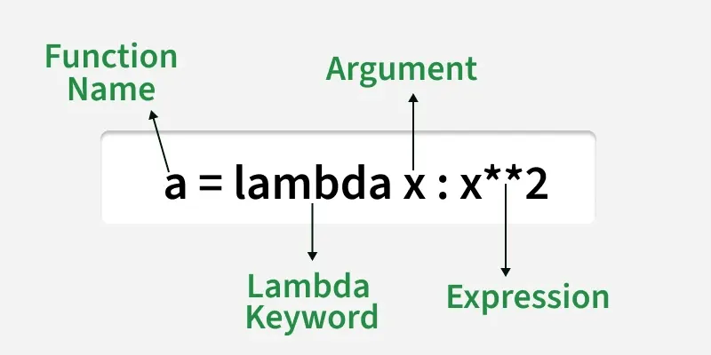

# Basics

## Put in and put out

- Python's `input()` function is used to take user input. By default, it returns the user input in form of a **string**. 
  - We are taking multiple input from the user in a single line, splitting the values entered by the user into separate variables for each value using the `split()` method<br>
  ```py
  x, y = input("Enter two values: ").split()
  print("Number of boys: ", x)
  print("Number of girls: ", y)
  x, y, z = input("Enter three values: ").split()
  print("Total number of students: ", x)
  print("Number of boys is : ", y)
  print("Number of girls is : ", z)
  ```
  - Change the Type of Input in Python: 
  ```py
  int(input("Your age: "))
  float(input("Your weight: "))
  ```
- Printing Output using `print()` in Python
  - Python `split()` method is used to break a string into a list of smaller strings based on a specified delimiter.
  ```py
  text = 'geeks for geeks'
  print(text.split())  
  word = 'geeks, for, geeks'
  print(word.split(',')) 
  word = 'geeks:for:geeks'
  print(word.split(':')) 
  word = 'CatBatSatFatOr'
  print(word.split('t'))
  ```
- Find DataType of Input in Python:
  ```py
  a = "Hello World"
  b = 10
  c = 11.22
  d = ("Geeks", "for", "Geeks")
  e = ["Geeks", "for", "Geeks"]
  f = {"Geeks": 1, "for":2, "Geeks":3}
  print(type(a))
  print(type(b))
  print(type(c))
  print(type(d))
  print(type(e))
  print(type(f))
  ```

## Python Variables

- Python variables do not require explicit declaration of type. The type of the variable is inferred based on the value assigned.

#### Rules for Naming Variables

To use variables effectively, we must follow Python’s naming rules:
- Variable names can only contain letters, digits and underscores (_).
- A variable name cannot start with a digit.
- Variable names are case-sensitive like myVar and myvar are different.
- Avoid using Python keywords like if, else, for as variable names.

- Dynamic Typing: Python variables are **dynamically typed**, meaning the same variable can hold different types of values during execution.
  ```py
  x = 10
  x = "Now a string"
  ```

#### Multiple Assignments

- **Assigning Same Value**: Python allows assigning the same value to multiple variables in a single line, which can be useful for initializing variables with the same value.
- **Assigning Different Values**: We can assign different values to multiple variables simultaneously, making the code concise and easier to read.
  ```py
  x, y, z = 1, 2.5, "Python"
  print(x, y, z)
  ```

#### Type Casting a Variable

Type casting refers to the process of converting the value of one data type into another. Python provides several built-in functions to facilitate casting, including int(), float() and str() among others. Basic casting functions are:

int(): Converts compatible values to an integer.<br>
float(): Transforms values into floating-point numbers.<br>
str(): Converts any data type into a string.<br>

#### Deleting a Variable

We can remove a variable from the namespace using the del keyword. This deletes the variable and frees up the memory it was using.

#### Other example

- Swapping Two Variables:
  ```py
  a,b=5,10
  a,b=b,a
  print(a,b)
  ```
- Counting Characters in a String:
  ```py
  word="python"
  length=len(word)
  print("length of the word:", length)
  ```

## Python Operators

#### Arithmetic Operators

| Operator | Description | x=2, y=3 |
| ---------|------------ |----------|
| `+` | Addition: adds two operands | 5 |
| `-` | Subtraction: subtracts two operands |-1 |
| `*` | Multiplication: multiplies two operands | 6 |
| `/` | Division (float): divides the first operand by the second | 0.6666666666666666 |
| `//` | Division (floor): divides the first operand by the second | 0 |
| `%` | Modulus: returns the remainder when the first operand is divided by the second | 2 |
| `**` | Power: Returns first raised to power second | 8 |

#### Comparison Operators

In Python, Comparison (or Relational) operators compares values. It either returns True or False according to the condition.

#### Logical Operators

Python Logical operators perform Logical AND, Logical OR and Logical NOT operations. It is used to combine conditional statements.

- **Order of Precedence of Logical Operators**: When multiple logical operators are used in a single expression, Python evaluates them from left to right and applies short-circuit evaluation. This means Python stops evaluating further conditions as soon as the result is determined.
```py
def check(x):
    print("Method called for value:", x)
    return x > 0

a = check
b = check
c = check

if a(-1) or b(5) or c(10):
    print("At least one of the numbers is positive")
```
b(5) returns True, so Python stops evaluating further conditions. c(10) is never executed due to short-circuit behavior of or.

#### Bitwise Operators

Python bitwise operators are used to perform bitwise calculations on **integers**. The integers are first converted into binary and then operations are performed on each bit or corresponding pair of bits, hence the name bitwise operators. The result is then returned in decimal format.

| Operator | Description | Syntax |
|----------|-------------|--------|
| `&`      | Bitwise AND | x & y  |
| `\|`     | Bitwise OR  | x | y  |
| `~`      | Bitwise NOT | ~x     |
| `^`      | Bitwise XOR | x ^ y  |
| `>>`     | Bitwise right shift | x>> |
| `<<`     | Bitwise left shift | x<<|

- **Bitwise Operator Overloading**: 
Operator Overloading means giving extended meaning beyond their predefined operational meaning. For example operator + is used to add two integers as well as join two strings and merge two lists. It is achievable because the ‘+’ operator is overloaded by int class and str class. You might have noticed that the same built-in operator or function shows different behavior for objects of different classes, this is called Operator Overloading.<br>
```py
# Python program to demonstrate
# operator overloading
class Geek():
    def __init__(self, value):
        self.value = value

    def __and__(self, obj):
        print("And operator overloaded")
        if isinstance(obj, Geek):
            return self.value & obj.value
        else:
            raise ValueError("Must be a object of class Geek")

    def __or__(self, obj):
        print("Or operator overloaded")
        if isinstance(obj, Geek):
            return self.value | obj.value
        else:
            raise ValueError("Must be a object of class Geek")

    def __xor__(self, obj):
        print("Xor operator overloaded")
        if isinstance(obj, Geek):
            return self.value ^ obj.value
        else:
            raise ValueError("Must be a object of class Geek")

    def __lshift__(self, obj):
        print("lshift operator overloaded")
        if isinstance(obj, Geek):
            return self.value << obj.value
        else:
            raise ValueError("Must be a object of class Geek")

    def __rshift__(self, obj):
        print("rshift operator overloaded")
        if isinstance(obj, Geek):
            return self.value >> obj.value
        else:
            raise ValueError("Must be a object of class Geek")

    def __invert__(self):
        print("Invert operator overloaded")
        return ~self.value


# Driver's code
if __name__ == "__main__":
    a = Geek(10)
    b = Geek(12)
    print(a & b)
    print(a | b)
    print(a ^ b)
    print(a << b)
    print(a >> b)
    print(~a)
```
**Output**
```text
And operator overloaded
8
Or operator overloaded
14
Xor operator overloaded
6
lshift operator overloaded
40960
rshift operator overloaded
0
Invert operator overloaded
-11
```
## Keyword and its funcion

#### Value keyword

- `True`
- `False`
- `None`: None is used to define a null value or Null object in Python. It is not the same as an empty string, a False, or a zero. It is a data type of the class NoneType object. 

#### Operator keyword

- `and`
- `or`
- `not`
- `is`: The “is keyword” is used to test whether two variables belong to the same object. The test will return True if the two objects are the same else it will return False even if the two objects are 100% equal.
  - `is`比较的是两个内存地址，而`==`比较的单纯是内容是否一致
- `in`: The in keyword in Python is a powerful operator used for membership testing and iteration. It helps determine whether an element exists within a given sequence, such as a list, tuple, string, set or dictionary.
> **Example 1**: in Keyword with if Statement
> ```py
> a = ["php", "python", "java"]
> 
> if "php" in a:
    print(True)
> ```
> ```text
> TRUE
> ```

> **Example 2**: in keyword in a for loop
> ```py
> s = "GeeksforGeeks"
> 
>  for char in s:
>    if char == 'f':
>        break  
>    print(char)
> ```
> ```text
> G
> e
> e
> k
> s

#### Control Flow Keywords

- `if`
- `else`
- `elif`(if-elif Statement)(else if)
- `for`
- `while`
- `break`
- `continue`
- `pass`: Examples situations where pass is used are empty functions, classes, loops or conditional blocks.
- `try`&`except`&`finally`: 
> **Example 1**:
> ```py 
> # code
> def divide(x, y):
>   try:
>       # Floor Division : Gives only Fractional Part as Answer
>       result = x // y
>       print("Yeah ! Your answer is :", result)
>   except Exception as e:
>      # By this way we can know about the type of error occurring
>       print("The error is: ",e)
> divide(3, "GFG") 
> divide(3,0)

```text
The error is:  unsupported operand type(s) for //: 'int' and 'str'
The error is:  integer division or modulo by zero
```

  - Else Clause:
  ```text
  try:
    # Some Code
  except:
    # Executed if error in the
    # try block
  else:
    # execute if no exception
  ```
  - Finally Keyword:
  ```text
  try:
    # Some Code
  except:
    # Executed if error in the
    # try block
  else:
    # execute if no exception
  finally:
    # Some code .....(always executed)
  ```
- `raise`: 我不懂
- `assert`: In simpler terms, we can say that assertion is the boolean expression that checks if the statement is True or False. If the statement is true then it does nothing and continues the execution, but if the statement is False then it stops the execution of the program and throws an error.

#### Function and Class

- `def`: The def keyword in Python is used to define a function
    The below diagram shows the basic structure of a Python function, including its name, parameters, body, and **optional return value**.
  
  

  - **Passing Function as an Argument**: you can pass functions as arguments to other functions, allowing you to call it inside that function.
  ```py
  def fun(func, arg):
    return func(arg)
  
  def square(x):
    return x ** 2
  
  res = fun(square, 5)
  print(res)
  ```
  - **Using `*args`**： `*args` allows a function to accept a **variable number** of positional arguments, which are collected into a tuple(元组), making the function flexible to handle multiple inputs.
  ```py
  def fun(*args):
    for arg in args:
        print(arg)

  fun(1, 2, 3, 4, 5)
  ```

  ```text
  1
  2
  3
  4
  5
  ```
  - **Using `**kwargs`**: `**kwargs` lets a function accept any number of keyword arguments. These arguments are collected into a dictionary, with keys as argument names and values as their corresponding values.
  ```py
  def fun(**kwargs):
    for k, val in kwargs.items():
        print(f"{k}: {val}")

  fun(name="Olivia", age=30, city="New York") 
  ```

  ```text
  name: Olivia
  age: 30
  city: New York
  ```

  - Using `def` Inside a `Class`: Inside a class, functions are called methods. You define them using def just like regular functions, but they usually take self as the first parameter to access the object’s attributes and other methods.
  ```py
  class Person:
    def __init__(self, name, age):
        self.name = name  
        self.age = age    
    
    def greet(self):
        print(f"Name - {self.name} and Age - {self.age}.")

  p1 = Person("Harry", 30)
  p1.greet()
  ```

  ```text
  Name - Harry and Age - 30.
  ```

- `return`: 
  - Returning Multiple Values
  - Returning a List from a Function
  - Function Returning Another Function
- `Lambda`(即时短函数): Lambda functions are small anonymous functions, meaning they do not have a defined name. In Python, lambda functions are created using the lambda keyword for short, simple operations. 
  
  

  - **Using with Condition Checking**: 
  ```py
  check = lambda x: "Positive" if x > 0 else "Negative" if x < 0 else "Zero"
  print(check(5))   
  print(check(-3))  
  print(check(0))
  ```

  - **Using with List Comprehension**: Lambda functions can be combined with list comprehensions to apply the **same operation** to multiple values in a compact way.
  ```py
  func = [lambda arg=x: arg * 10 for x in range(1, 5)]
  for i in func:
    print(i())
  ```

  ```
  10
  20
  30
  40
  ```
  - **Using for Returning Multiple Results**: Although a lambda can contain only one expression, it can still return multiple results by combining them into a tuple.
  ```py
  calc = lambda x, y: (x + y, x * y)
  res = calc(3, 4)
  print(res)
  ```

  - **Using with `filter()`**: 
  ```py
  c = [1, 2, 3, 4, 5, 6]
  even = filter(lambda x: x % 2 == 0, c)
  print(list(even))
  ```
  - **Using with `map()`**: map() function applies a lambda expression to each element of a list and returns a new list with the transformed values.
  ```py
  a = [1, 2, 3, 4]
  double = map(lambda x: x * 2, a)
  print(list(double))
  ```
  - **Using with `reduce()`**
  ```py
  from functools import reduce
  a = [1, 2, 3, 4]
  mul = reduce(lambda x, y: x * y, a)
  print(mul)
  ```
- `yield`: In Python, yield keyword is used to create generators, which are special types of iterators that allow values to be produced lazily, one at a time, instead of returning them all at once. 
  - **Generator functions and yield**：
  ```py
  def my_generator():
    yield "Hello world!!"
    yield "GeeksForGeeks"

  g = my_generator()
  print(type(g))  
  print(next(g)) 
  print(next(g))
  ```

  ```
  <class 'generator'>
  Hello world!!
  GeeksForGeeks
  ```

  - **Generating an Infinite Sequence**: 
  ```py
  def infinite_sequence():
    n = 0
    while True:
        yield n
        n += 1

  g = infinite_sequence()
  for _ in range(10):
    print(next(g), end=" ")
  ```

  ```
  0 1 2 3 4 5 6 7 8 9 
  ```

  - **Extracting even numbers from list**: 
  ```py
  def fun(a):
    for n in a:
        if n % 2 == 0:
            yield n

  a = [1, 4, 5, 6, 7]
  print(list(fun(a)))
  ```
  - **Using yield as a boolean expression**: 
  ```py
  def fun(text, keyword):
    w = text.split()
    for n in w:
        if n == keyword:
            yield True

  txt = "geeks for geeks"
  s = fun(txt, "geeks")
  print(sum(s))
  ```

  ```text
  2
  ```

- `class`: object is a specific instance of a class. It holds its own set of data (instance variables) and can invoke methods defined by its class. Multiple objects can be created from same class, each with its own unique attributes.
  ```py
  class Dog:
    sound = "bark"

  dog1 = Dog() # Creating object from class
  print(dog1.sound) # Accessing the class
  ```

  - **Initiate Object with `__init__()`**: 
  ```py
  class Dog:
    species = "Canine"  # Class attribute

    def __init__(self, name, age):
        self.name = name  # Instance attribute
        self.age = age  # Instance attribute

  # Creating an object of the Dog class
  dog1 = Dog("Buddy", 3)

  print(dog1.name)  
  print(dog1.species)
  ```

  ```
  Buddy
  Canine
  ```
  - `__str__()` Method: `__str__` method in Python allows us to define a custom string representation of an object. 
  ```py
  class Dog:
    def __init__(self, name, age):
        self.name = name
        self.age = age

    def __str__(self):
        return f"{self.name} is {self.age} years old."
  dog1 = Dog("Buddy", 3)
  dog2 = Dog("Charlie", 5)

  print(dog1)  
  print(dog2)
  ```

#### Context Management

- `with`: The `with` statement in Python simplifies resource management by automatically handling setup and cleanup, ensuring files or connections close safely even if errors occur.
  - **Safe File Handling**: 
  ```py
  with open("example.txt", "r") as file:
    content = file.read()
    print(content)  # File closes automatically
  ```
  ```py
  with open("example.txt", "w") as file:
    file.write("Hello, Python with statement!")
  ```
  - **Context Managers and "with" statement**: 
  ```py
  class FileManager:
    def __init__(self, filename, mode):
        self.filename = filename
        self.mode = mode

    def __enter__(self):
        self.file = open(self.filename, self.mode)
        return self.file

    def __exit__(self, exc_type, exc_value, traceback):
        self.file.close()

  # using the custom context manager
  with FileManager('example.txt', 'w') as file:
    file.write('Hello, World!')
  ```
  （但其实我学到这里并不是很懂`open`和一个新的FileManager的区别）

- `as`: as keyword in Python plays a important role in simplifying code, making it more readable and avoiding potential naming conflicts. It is mainly used to create **aliases**(别名) for modules, exceptions and file operations. This powerful feature reduces verbosity, helps in naming clarity and can be essential when multiple modules have similar names or when managing file operations.
  - **Create Alias for the module**: 
  ```py
  # Import random module with alias
  import random as geek

  # Using random module with alias to generate random numbers
  a = geek.randint(5, 10)
  b = geek.randint(1, 5)

  # Printing the generated random numbers
  print(a,b)
  ```
  - **as with a file**
  ```py
  # Using 'as' keyword with 'open' function
  with open('sample.txt') as geek:
  
    # Reading text with alias
    geek_read = geek.read()

  # Printing the text read from the file
  print("Text read with alias:")
  print(geek_read)
  ```
  - **as in Except clause**: 
  ```py
  # Demonstrating 'as' keyword with exception handling

  try:
    import maths as mt
  except ImportError as err:
    print(err)

  try:
    # With statement with 'geek' alias
    with open('geek.txt') as geek:
        # Reading text with alias
        geek_read = geek.read()

    # Printing the read text
    print("Reading alias:")
    print(geek_read)
  except FileNotFoundError as err2:
    print('No file found')
  ```

#### Import and Module

- `import`: In Python, modules help organize code into reusable files. They allow you to import and use functions, classes and variables from other scripts. The import statement is the most common way to bring external functionality into your Python program.
  - **Importing built-in Module**：
  ```py
  import math
  pie = math.pi
  print("Value of pi:", pie)
  ```
  - **Importing External Modules**: To use external modules, we need to install them first, we can easily install any external module using pip command in the terminal, for example:
  ```text
  pip install module_name
  ```
  ```py
  import pandas

  # Create a simple DataFrame
  data = {
    "Name": ["Elon", "Trevor", "Swastik"],
    "Age": [25, 30, 35]
  }

  df = pandas.DataFrame(data)
  print(df)
  ```
  ```text
        Name  Age
  0     Elon   25
  1   Trevor   30
  2  Swastik   35
  ```
  - **Importing Specific Functions**: 
  ```py
  from math import pi
  print(pi)
  ```
  - **Handling Import Errors in Python**:When importing a module that doesn’t exist or isn't installed, Python raises an ImportError. To prevent this, we can handle such cases using try-except blocks.
  ```py
  try:
    import mathematics  # Incorrect module name
    print(mathematics.pi)
  except ImportError:
    print("Module not found! Please check the module name or install it if necessary.")
  ```

- `from`: The from keyword in Python is mainly used for importing specific parts of a module rather than the entire module. It helps in making the code cleaner and more efficient by allowing us to access only the required functions, classes, or variables.

#### Scope and Namespace

- `Global`: The global keyword in Python allows a function to modify variables that are defined outside its scope, making them accessible globally. Without it, variables inside a function are treated as local by default. It's commonly used when we need to update the value of a global variable within a function, ensuring the changes persist outside the function.
  - **Accessing global Variable From Inside a Function**: 
  ```py
  a = 15 # global variable

  # function to change a global value
  def change():
    # increment value of a by 5
    b = a + 5
    a = b #这一步的存在让算法认为这整个函数里面的a都是local的，所以导致上一步无法正常进行了
    print(a)


  change()
  ```
  - **Global variables across Python modules**: 
  
  **Code 1: config.py for Storing Global Variables**
  ```py
  # config.py
  x = 0
  y = 0
  z = "none"
  ```
  **Code 2: modify.py to Modify Global Variables**
  ```py
  # modify.py
  import config
  config.x = 1
  config.y = 2
  config.z = "geeksforgeeks"
  ```
  **Code 3: main.py to Access Modified Global Variables**
  ```py
  # main.py
  import config
  import modify

  print(config.x)
  print(config.y)
  print(config.z)
  ```
  其实就是跨文件的调用

  - **Global in Nested functions**: 
  