# 图的基本概念及相关术语

- 顶点Vertex（也称“节点Node”）：是图的基本组成部分，顶点具有名称标识Key，也可以携带数据项payload
- 边Edge（也称“弧Arc”）：作为2个顶点之间关系的表示，边连接两个顶点；边可以是无向或者有向的，相应的图称作“无向图”和“有向图”
- 权重Weight：为了表达从一个顶点到另一个顶点的“代价”，可以给边赋权；例如公交网络中两个站点之间的“距离”、“通行时间”和“票价”都可以作为权重。

一个图G可以定义为G=(V, E)，其中V是顶点的集合，E是边的集合，E中的每条边e=(v, w)，v和w都是V中的顶点
（如果是赋权图，则可以在e中添加权重分量）

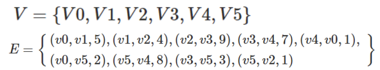

- 有向图：边有方向(有起点和终点)，无向图：边没有方向, 边只是逻辑上表示两个顶点有直接关系，边是直的还是弯的，边有没有交叉，都没有意义。
- 顶点的度数：和顶点相连的边的数目。(无所谓于方向)
- 顶点的出度：有向图中，以该顶点作为起点的边的数目 
- 顶点的入度：有向图中，以该顶点作为终点的边的数目
- 顶点的出边：有向图中，以该顶点为起点的边
- 顶点的入边：有向图中，以该顶点为终点的边
- 路径Path：图中的路径，是由边依次连接起来的顶点序列，无权路径的长度为边的数量；带权路径的长度为所有边权重的和
- 回路（环）：起点和终点相同的路径
- 简单路径：除了起点和终点可能相同外，其它顶点都不相同的路径
- 完全图：
  - 完全无向图：任意两个顶点都有边相连
  - 完全有向图：任意两个顶点都有两条方向相反的边
- 连通：如果存在从顶点u到顶点v的路径，则称u到v连通，或u可达v。无向图中，u可达v,必然v可达u。有向图中，u可达v，并不能说明v可达u。
  - 连通无向图：无向图中任意两个顶点u和v互相可达。
  - 强连通有向图：有向图中任意两个顶点u和v互相可达。
- 子图：从图中抽取部分或全部边和点构成的图
- 连通分量（极大连通子图）：无向图的一个子图，是连通的，且再添加任何一些原图中的顶点和边，新子图都不再连通。（以下那张图一共有3个连通分量）
  
  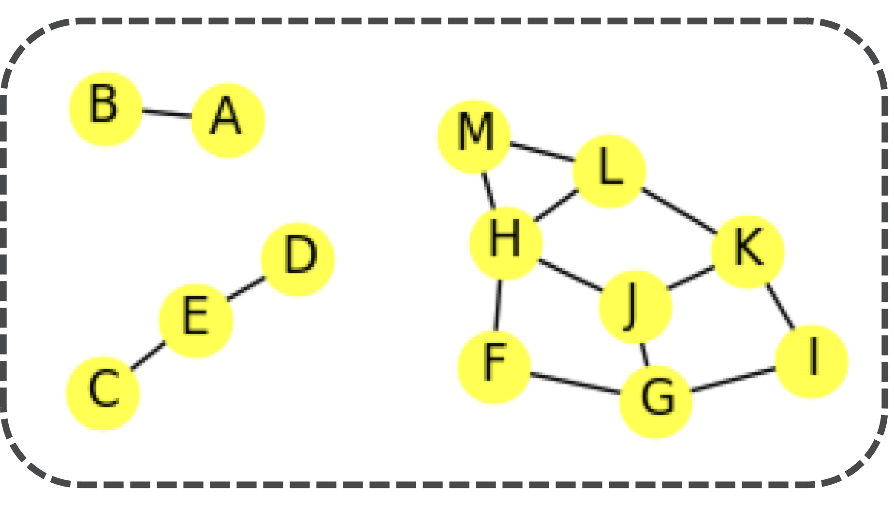

- 强连通分量：有向图的一个子图，是强连通的，且再添加任何一些原图中的顶点和边，新子图都不再强连通。
- 网络：带权无向连通图
- 圈Cycle
  - 如果有向图中不存在任何圈，则称作“有向无圈图directed acyclic graph: DAG”

# 图抽象数据类型

抽象数据类型ADT Graph定义如下：
- Graph()：创建一个空的图；
- addVertex(vert)：将顶点vert加入图中
- addEdge(fromVert, toVert)：添加有向边
- addEdge(fromVert, toVert, weight)：添加带权的有向边
- getVertex(vKey)：查找名称为vKey的顶点
- getVertices()：返回图中所有顶点列表
- in：按照vert in graph的语句形式，返回顶点是否存在图中True/False

ADT Graph的实现方法有两种主要形式：
- 邻接矩阵adjacency matrix
- 邻接表adjacency list

### 邻接矩阵adjacency matrix

矩阵的每行和每列都代表图中的顶点
如果两个顶点之间有边相连，设定行列值

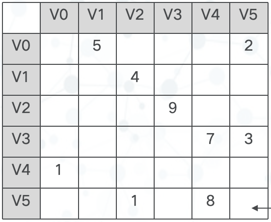

  - 无向图的邻接矩阵为对称矩阵
  - 有向图的邻接矩阵为非对称矩阵

pros: 可以很容易得到顶点是如何相连
cons: 边数很少，成为“稀疏sparse”矩阵，而大多数问题所对应的图都是稀疏的，边远远少于|V|^2这个量级

### 邻接列表Adjacency List

主列表中的每个顶点，再关联一个与自身有边连接的所有顶点的列表

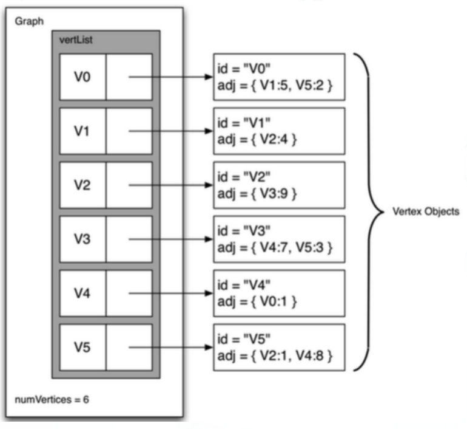

嵌套列表

邻接列表法的存储空间紧凑高效，很容易获得顶点所连接的所有顶点，以及连接边的信息

# 图抽象数据类型的Python实现

呈现案例：

```python
g = Graph()

for i in range(6):
    g.addVertex(i)

g.addEdge(0, 1, 5)
g.addEdge(0, 5, 2)
g.addEdge(1, 2, 4)
g.addEdge(2, 3, 9)
g.addEdge(3, 4, 7)
g.addEdge(3, 5, 3)
g.addEdge(4, 0, 1)
g.addEdge(5, 4, 8)
g.addEdge(5, 2, 1)

for v in g:
    for w in v.getConnections():
        print("(%s, %s)" % (v.getId(), w.getId()))
```

### 顶点Vertex类

```python
class Vertex:
    def __init__(self, key):
        self.id = key
        self.connectedTo = {}
        self.color = 'white' # 顶点访问状态（white=未访问，gray=正在访问，black=已完成）
        self.distance = float('inf') # 当前顶点到起始点的距离，初始设为无穷大
        self.pred = None # 处理这个顶点的前驱，用于记录路径
 
    def addNeighbor(self, nbr, weight=0):
        self.connectedTo[nbr] = weight # 是字典，nbr是顶点对象的key

    def __str__(self):
        return str(self.id) + ' connectedTo: ' + str([x.id for x in self.connectedTo])

    def getConnections(self):
        return self.connectedTo.keys()

    def getId(self):
        return self.id

    def getWeight(self, nbr):
        return self.connectedTo[nbr]
```

### 图graph类

```python
class Graph:

    def __init__(self):
        self.vertList = {}
        self.numVertices = 0

    def addVertex(self, key):
        self.numVertices = self.numVertices + 1
        newVertex = Vertex(key)
        self.vertList[key] = newVertex
        return newVertex

    def getVertex(self, n): # 通过key查找顶点
        if n in self.vertList:
            return self.vertList[n]
        else:
            return None

    def __contains__(self, n):
        return n in self.vertList
    
    def addEdge(self, f, t, cost=0): # f起点，t终点
        if f not in self.vertList:
            nv = self.addVertex(f)

        if t not in self.vertList:
            nv = self.addVertex(t)
        self.vertList[f].addNeighbor(self.vertList[t], cost)

    def getVertices(self):
        return self.vertList.keys()

    def __iter__(self):
        eturn iter(self.vertList.values())
```

### 邻接矩阵版本: 顶点Vertex类

```python
class Vertex_adj_mat:

    def __init__(self, key):
        self.id = key
        self.color = 'white'          # BFS/DFS 初始颜色
        self.distance = float('inf')  # 初始距离设为无穷大
        self.pred = None              # 前驱节点

    def addNeighbor(self, nbr, weight=0):
        self.connectedTo[nbr] = weight

    def getId(self):
        return self.id

    def getWeight(self, nbr):
        return self.connectedTo[nbr]

    def getPred(self):
        return self.pred

    def setPred(self, pred):
        self.pred = pred

    def getColor(self):
        return self.color

    def setColor(self, color):
        self.color = color

    def getDistance(self):
        return self.distance

    def setDistance(self, distance):
        self.distance = distance
```

### 邻接矩阵版本: 图Graph类

```python
class Graph_adj_mat:

    def __init__(self, num_vertices=8): # 需事先设置节点数量
        self.vertList = {}
        self.adj_matrix = [[0] * num_vertices for _ in range(num_vertices)] # 二维数据存储邻接矩阵
        self.numVertices = num_vertices

    def addVertex(self, key):
        self.numVertices = self.numVertices + 1
        newVertex = Vertex_adj_mat(key)
        self.vertList[key] = newVertex
        return newVertex

    def getVertex(self, n):
        if n in self.vertList:
            return self.vertList[n]
        else:
            return None

    def __contains__(self, n):
        return n in self.vertList

    def addEdge(self, v1, v2, weight=1):
        if 0 <= v1 < self.num_vertices and 0 <= v2 < self.num_vertices:
            self.adj_matrix[v1][v2] = weight
            self.adj_matrix[v2][v1] = weight  # 无向图（有向图删掉这一行）

    def get_neighbors(self, idx):
        neighbors = []

        for j in range(self.num_vertices):
            if self.adj_matrix[idx][j] != 0:
                neighbors.append(j)

        return neighbors

    def getVertices(self):
        return self.vertList.keys()

    def __iter__(self):
        return iter(self.vertList.values())
```

# 图的应用：词梯问题

### 词梯Word Ladder问题

【目标】: 是找到最短的单词变换序列
【解决步骤】: 
- 将可能的单词之间的演变关系表达为图
- 采用“广度优先搜索 BFS”，来搜寻从开始单词
- 到结束单词之间的所有有效路径
- 选择其中最快到达目标单词的路径
【备注】: 此时的边是没有权重的，所以用了广度优先算法

1. 构建单词关系图：将所有单词作为顶点加入图中，再设法建立顶点之间的边，将单词作为顶点的标识Key，如果两个单词之间仅相差1个字母，就在它们之间设一条边
  > 改进算法：
  > 1. 创建大量的桶，每个桶可以存放若干单词: 桶标记是去掉1个字母，通配符“_”占空的单词
  > 2. 所有匹配标记的单词都放到这个桶里
  > 3. 所有单词就位后，再在同一个桶的单词之间建立边即可
  > 
  > 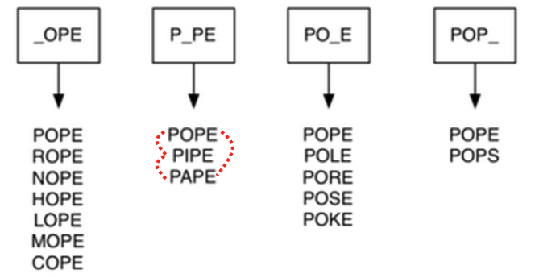
  >

采用字典建立桶

```python
def buildGraph(wordFile):
    d = {}
    g = Graph()

    # 打开单词文件，每一行通常是一个单词
    wfile = open(wordFile, 'r')

    # 第一步：建立 bucket
    # bucket 的作用：把“只差一个字母”的单词放到同一组里
    for line in wfile:
        # 去掉每一行末尾的换行符
        word = line[:-1]

        # 依次把单词的每一个位置替换成 "_"
        # 例如 fool:
        # _ool, f_ol, fo_l, foo_
        for i in range(len(word)):
            bucket = word[:i] + '_' + word[i + 1:]

            # 如果这个 bucket 已经存在，就把当前单词加入这个 bucket
            if bucket in d:
                d[bucket].append(word)

            # 如果这个 bucket 不存在，就创建一个新的列表
            else:
                d[bucket] = [word]

    # 第二步：根据 bucket 建图
    # 同一个 bucket 中的单词，说明它们只差一个字母
    # 因此这些单词之间应该有边
    for bucket in d.keys():
        for word1 in d[bucket]:
            for word2 in d[bucket]:

                # 避免自己和自己连边
                if word1 != word2:
                    g.addEdge(word1, word2)

    # 返回构建好的图
    return g
```

# 实现广度优先搜索/遍历

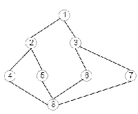

- 深度优先（能往前走就往前走）1-2-4-8-5-6-3-7 这里会涉及一个会退过程
- 广度优先（按距离起点的距离，即最小边数从小到大遍历）1-2-3-4-5-6-7-8

在单词关系图建立完成以后，需要继续在图中寻找词梯问题的最短序列，因为广度优先算是按照距离进行遍历，所以比较符合广度优先搜索
> BFS搜索所有从s可到达顶点的边，而且在达到更远的距离k+1的顶点之前，BFS会找到全部距离为k的顶点
> 可以想象为以s为根，构建一棵树的过程，从顶部向下逐步增加层次, 广度优先搜索能保证在增加层次之前，添加了所有兄弟节点到树中

从新回顾一下定义的时候引入的三个特性：
- 距离distance：从起始顶点到此顶点路径长度；
- 前驱顶点predecessor：可反向追溯到起点；
- 颜色color：标识了此顶点是尚未发现（白色）、已经发现（灰色）、还是已经完成探索（黑色）

还需要用一个队列Queue来对已发现的顶点进行排列：决定下一个要探索的顶点（队首顶点）

1. 从队首取出一个顶点作为当前顶点；
2. 遍历当前顶点的邻接顶点，如果是尚未发现的白色顶点，则将其颜色改为灰色（已发现），**距离增加1**，前驱顶点为当前顶点，加入到队列中
3. 遍历完成后，将当前顶点设置为黑色（所有的邻接节点都已经是灰色了，已探索过），循环回到步骤1的队首取当前顶点

补充需要放入`Vertex` 类中：

```python
def getPred(self):
    # 返回当前顶点的前驱节点
    return self.pred


def setPred(self, pred):
    # 设置当前顶点的前驱节点
    self.pred = pred


def getColor(self):
    # 返回当前顶点的颜色状态
    return self.color


def setColor(self, color):
    # 设置当前顶点的颜色状态
    self.color = color


def getDistance(self):
    # 返回当前顶点到起始顶点的距离
    return self.distance


def setDistance(self, distance):
    # 设置当前顶点到起始顶点的距离
    self.distance = distance
```

BFS算法：

```python
def bfs(g, start):
    # 将起始顶点到自己的距离设置为 0
    start.setDistance(0)

    # 起始顶点没有前驱节点
    start.setPred(None)

    # 创建一个队列，用于 BFS 的“先进先出”遍历
    vertQueue = Queue()

    # 先把起始顶点放入队列
    vertQueue.enqueue(start)

    # 只要队列不为空，就继续搜索
    while vertQueue.size() > 0:

        # 取出队首顶点，作为当前正在访问的顶点
        currentVert = vertQueue.dequeue()

        # 遍历当前顶点的所有邻接点
        for nbr in currentVert.getConnections():

            # 如果邻接点还是 white，说明它还没有被访问过
            if nbr.getColor() == 'white':

                # 将邻接点标记为 gray，表示已经发现，但还没有完全处理完
                nbr.setColor('gray')

                # 邻接点距离 = 当前顶点距离 + 1
                # 因为 BFS 每走一条边，距离增加 1
                nbr.setDistance(currentVert.getDistance() + 1)

                # 记录邻接点的前驱节点
                # 说明 nbr 是从 currentVert 访问到的
                nbr.setPred(currentVert)

                # 把这个邻接点加入队列，等待之后继续访问它的邻居
                vertQueue.enqueue(nbr)

        # 当前顶点的所有邻居都检查完后，将其标记为 black
        # black 表示这个顶点已经彻底处理完成
        currentVert.setColor('black')
    
```

可以通过一个回途追溯函数来确定FOOL到任何单词顶点的最短词梯

```python
def traverse(y):
    # 从目标节点 y 开始
    x = y

    # 只要当前节点 x 有前驱节点，就继续向前回溯
    while x.getPred():
        # 打印当前节点的 id
        print(x.getId())

        # 让 x 变成它的前驱节点
        # 也就是沿着 BFS 记录的路径往回走一步
        x = x.getPred()

    # 打印最后一个节点
    # 一般是起始节点，因为起始节点的 pred 是 None
    print(x.getId())
```

BFS算法主体是两个循环的嵌套: 
- while循环对每个顶点访问一次，所以是O(|V|)
- 而嵌套在while中的for，由于每条边只有在其起始顶点u出队的时候才会被检查一次,而每个顶点最多出队1次，所以边最多被检查1次，一共是O(|E|)
- 综合起来BFS的时间复杂度为O(|V|+|E|)

词梯问题还包括两个部分算法:
- 建立BFS树之后，回溯顶点到起始顶点的过程，最多为O(|V|)
- 创建单词关系图也需要时间，最多为O(|V|2)

补充：邻接矩阵版本的广度优先搜索

```python
def bfs_adj_mat(graph, start):
    # 把起点到自己的距离设为 0
    start.setDistance(0)

    # 起点没有前驱节点
    start.setPred(None)

    # 创建队列，用于 BFS
    vertQueue = Queue()

    # 把起点加入队列
    vertQueue.enqueue(start)

    # 只要队列不为空，就继续搜索
    while vertQueue.size() > 0:

        # 取出队首顶点，作为当前正在处理的点
        currentVert = vertQueue.dequeue()

        # 根据邻接矩阵，找到 currentVert 的所有邻居编号
        for neighbor_idx in graph.get_neighbors(currentVert.get_id()):

            # 根据邻居编号，取出真正的 Vertex 对象
            nbr = graph.getVertex(neighbor_idx)

            # 如果这个邻居还没有被访问过
            if nbr.getColor() == 'white':

                # 标记为 gray，表示已经发现但还没完全处理完
                nbr.setColor('gray')

                # 邻居的距离 = 当前点的距离 + 1
                nbr.setDistance(currentVert.getDistance() + 1)

                # 记录邻居的前驱节点
                nbr.setPred(currentVert)

                # 把邻居加入队列，等待之后继续扩展
                vertQueue.enqueue(nbr)

        # 当前节点的所有邻居都处理完了，标记为 black
        currentVert.setColor('black')
```

时间复杂度为O(|V|2)

# 广度优先搜索的应用 

### 抓住那头牛

农夫知道一头牛的位置，想要抓住它。农夫和牛都位于数轴上，农夫起始位于点N(0<=N<=100000)，牛位于点K(0<=K<=100000)。农夫有两种移动方式：
- 从X移动到X-1或X+1，每次移动花费一分钟
- 从X移动到2*X，每次移动花费一分钟
假设牛没有意识到农夫的行动，站在原地不动。农夫最少要花多少时间才能抓住牛？

【解决策略】：
1. 把问题抽象成图搜索问题：如果两个数字之间可以一步到达，就在它们之间连一条边。
2. 确定起点和终点
3. 使用广度优先搜索 BFS
4. 第一次找到终点时停止

用队列进行BFS:
(1) 把初始顶点S0放入Open表中；
(2) 如果Open表为空，则问题无解，失败退出；
(3) 把Open表的第一个顶点取出放入Closed表，并记该顶点为n；
(4) 考察顶点n是否为目标顶点。若是，则得到问题的解，成功退出；
(5) 若顶点n不可扩展，则转第(2)步；
(6) 扩展顶点n，将其不在Closed表和Open表中的子顶点(判重）放入Open表的尾部，并为每一个子顶点设置指向父顶点的指针(或记录顶点的层次），然后转第(2)步。

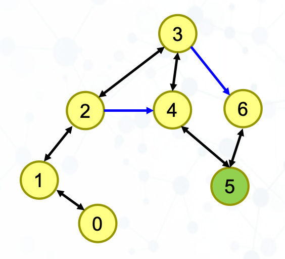

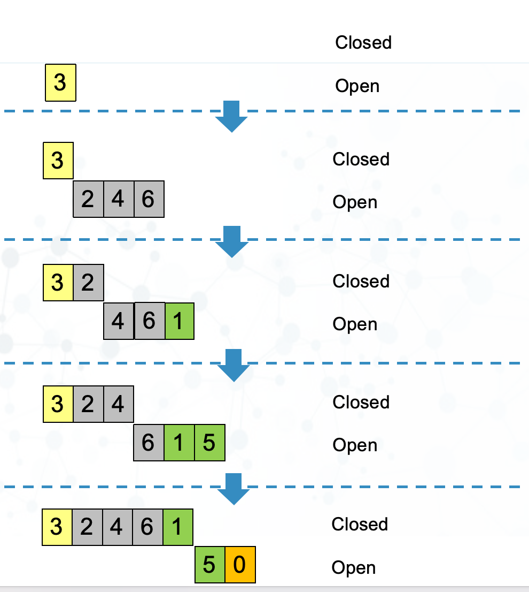

```python
import collections


class Step:
    def __init__(self, x, steps):
        self.x = x          # 当前所在位置
        self.steps = steps  # 从起点 N 到当前位置 x 所需要的步数


MAXN = 100000

# 输入农夫起点 N 和牛的位置 K
N, K = map(int, input().split())

# 创建队列，相当于 BFS 中的 Open 表
q = collections.deque()

# visited[i] 表示位置 i 是否已经访问过
# 用于判重，避免反复访问同一个位置
visited = [False] * (MAXN + 10)

# 将起点 N 加入队列，起点步数为 0
q.append(Step(N, 0))

# 标记起点已经访问过
visited[N] = True


# 只要队列不为空，就继续 BFS
while len(q) > 0:
    # 取出队首元素
    s = q.popleft()

    # 如果当前位置已经是目标位置 K，输出步数并结束
    if s.x == K:
        print(s.steps)
        break

    # 情况 1：从当前位置 x 走到 x - 1
    if s.x - 1 >= 0 and not visited[s.x - 1]:
        q.append(Step(s.x - 1, s.steps + 1))
        visited[s.x - 1] = True

    # 情况 2：从当前位置 x 走到 x + 1
    if s.x + 1 <= MAXN and not visited[s.x + 1]:
        q.append(Step(s.x + 1, s.steps + 1))
        visited[s.x + 1] = True

    # 情况 3：从当前位置 x 走到 2 * x
    if s.x * 2 <= MAXN and not visited[s.x * 2]:
        q.append(Step(s.x * 2, s.steps + 1))
        visited[s.x * 2] = True
```

### 迷宫问题

【问题】
定义一个矩阵： 
0 1 0 0 0 
0 1 0 1 0 
0 0 0 0 0 
0 1 1 1 0 
0 0 0 1 0 

它表示一个迷宫，其中的1表示墙壁，0表示可以走的路，只能横着走或竖着走，不能斜着走，要求编程序找出从左上角到右下角的最短路线。

【解题思路】
1. 基础广搜。先将起始位置入队列
2. 每次从队列拿出一个元素，扩展其相邻的4个元素入队列（要用二维标志列表判重），直到队头元素为终点为止。队列里的元素记录了指向父顶点（上一步）的指针
> 队列元素：(r,c,father)
> r,c:  顶点的坐标
> father : 父顶点在队列中的下标(从a走到b,则a是b的父顶点)
> 判重的二维列表：flags[i][j]表示 (i,j)那个位置是否走过，即是否入过队列

page78

### 迷宫变形问题

【问题】给定一个二维网格地图，地图中的每个位置均可移动，但部分位置为特殊障碍区域。一个人在地图上从起点出发，每次只能向上、下、左、右四个方向移动一格，每移动一格花费 1 单位时间。该人拥有有限次数的特殊能力，可以消除障碍并进入障碍区域，每次进入障碍区域会消耗一次能力次数；当能力次数耗尽后，将无法再进入障碍区域。已知地图、起点、终点以及可使用的能力次数，求从起点到终点所需的最短时间。

【解题思路】解题时，将每个状态定义为当前位置和剩余能力次数的组合，即 ((r, c, k))，其中 (r) 和 (c) 表示当前所在的行和列，(k) 表示当前还剩多少次消除障碍的机会。搜索从起点状态开始，使用广度优先搜索逐层扩展，每次可以向上下左右四个方向移动。如果下一个位置是普通位置，则可以直接进入，状态中的 (k) 不变；如果下一个位置是障碍位置，则只有在 (k>0) 时才能进入，并将 (k) 减 1。由于同一个位置在剩余能力次数不同时代表不同状态，因此判重时不能只记录位置，而应记录 ((r,c,k)) 是否已经访问过。BFS 第一次到达终点时，对应的移动次数就是最短时间。

【问题】给定一个二维迷宫地图，地图中的每个位置可能是可通行区域、不可通过的障碍区域，或带有额外代价的特殊区域。一个人从起点出发，需要移动到终点位置，每次只能向上、下、左、右四个方向移动一格。进入普通可通行区域需要花费 1 单位时间，而进入特殊区域时，除了移动所需时间外，还需要额外支付一定代价。障碍区域无法进入。求从起点到终点所需的最少时间。

【解题思路】
1. 定义搜索状态：
   1. (r, c, kill, t)
   2. r, c：当前位置的行和列；kill：是否已经杀死过守卫；t：到达当前位置所花费的时间
2. 使用 BFS 逐层搜索
3. 分类讨论下一格的情况
   1. 下一格是墙壁 #，墙壁不能进入，因此直接跳过，不加入队列。
   2. 下一格是普通道路 @ 或终点 a，可以直接进入，时间增加 1，kill 状态不变：
   3. 下一格是守卫 x，且 kill = 0，说明还没有杀死过守卫，因此可以进入该格并杀死守卫。移动一步花 1 分钟，杀死守卫额外花 1 分钟，所以总时间增加 2：
   4. 下一格是守卫 x，且 kill = 1，之后再次遇到守卫时，守卫已经可以视为可通过状态。此时只需要移动一步，时间增加 1：
4. 判重数组
   1. int flag[M][N][2];
   2. flag[r][c][0]表示在坐标(r,c)，尚未杀死守卫的情况
   3. flag[r][c][1]表示在坐标(r,c)，已经杀死守卫的情况

【解题思路二】
由于该问题中不同位置的移动代价并不相同：进入普通位置只需要花费 1 单位时间，而进入守卫所在位置除了移动时间外还需要额外花费 1 单位时间，因此不同路径之间的总代价不再仅由“步数”决定，普通 BFS 按层扩展的方法已经无法保证第一次到达终点时得到的就是最优解。为了解决这一问题，可以将队列中的状态定义为 ((r,c,steps))，其中 (r,c) 表示当前位置坐标，`steps` 表示到达该位置所花费的总时间。当扩展到普通位置时，总代价增加 1；当扩展到守卫位置时，总代价增加 2。由于搜索过程中必须始终优先扩展总代价较小的状态，因此普通先进先出的队列需要改为优先队列，使得当前总代价最小的状态始终位于队首并优先出队。这样才能保证搜索过程始终按照最小总代价进行扩展，从而正确求得从起点到终点的最短时间。本质上，该问题已经从普通 BFS 转化为了带权最短路径问题，其思想与 Dijkstra 算法一致。

【问题】给定一个二维迷宫地图，地图中的每个位置可能是普通道路、墙壁、守卫、起点、终点或带有钥匙的道路。一个人从起点出发，需要移动到终点；每次只能向上、下、左、右四个方向移动一格，每移动一格花费 1 单位时间。墙壁不能进入；遇到守卫时，必须额外花费 1 单位时间将其处理后才能继续前进。地图上存在若干种钥匙，必须按照编号顺序依次获取：只有已经拥有第 (k-1) 种钥匙时，才能获取第 (k) 种钥匙；未满足条件时，经过有钥匙的位置也不能获得该钥匙。到达终点时，必须至少获得每一种钥匙各一把，才算完成任务。求从起点完成任务并到达终点所需的最少时间。

【解题思路】
1. 状态设计
   (r, c, keys, fighted, steps, layout)
   r, c：当前位置
    keys：当前已经拿到第几种钥匙
    fighted：当前位置的守卫是否已经处理过
    steps：当前已经花费的总时间
    layout：当前迷宫中守卫的状态
2. 判重数组设计
   flags[r][c][k][x][f]
   在位置 (r,c)
    已经拿到 k 种钥匙
    守卫局面为 x
    当前格子的守卫处理状态为 f
3. 扩展规则
   1. 如果下一格是墙壁，不能进入；
   2. 如果下一格是普通道路，可以进入，steps + 1；
   3. 如果下一格是钥匙，判断是否满足拿钥匙顺序，若满足则更新 keys；
   4. 如果下一格是守卫，判断该守卫是否已经被打过：
      1. 如果已经被打过，可以直接进入，steps + 1；
      2. 如果还没被打过，进入后需要额外处理，时间增加更多，并更新守卫局面。
4. 当到达终点，并且已经收集完所有需要的钥匙时，任务完成。

# 图遍历的应用

### 骑士周游问题

【问题】在一个国际象棋棋盘上，一个棋子“马”（骑士），按照“马走日”的规则，从一个格子出发，要走遍所有棋盘格恰好一次。把一个这样的走棋序列称为一次“周游”

【解决思路】
1. 首先将合法走棋次序表示为一个图
   将棋盘格作为顶点
    按照“马走日”规则的走棋步骤作为连接边，建立每一个棋盘格的所有合法走棋步骤能够到达的棋盘格关系图

```python
def genLegalMoves(x, y, bdsize):
    # 用来保存所有合法的下一步位置
    newMoves = []

    # 马可以走的 8 个方向
    # 每一个元组表示 (x方向变化量, y方向变化量)
    moveOffsets = [
        (-1, -2), (-1, 2),
        (-2, 1), (-2, -1),
        (1, -2), (1, 2),
        (2, -1), (2, 1)
    ]

    # 遍历马的 8 种可能移动方式
    for i in moveOffsets:
        # 计算移动后的新坐标
        newX = x + i[0]
        newY = y + i[1]

        # 判断新坐标是否仍然在棋盘范围内
        if legalCoord(newX, bdsize) and legalCoord(newY, bdsize):
            # 如果合法，就加入结果列表
            newMoves.append((newX, newY))

    # 返回所有合法移动位置
    return newMoves


def legalCoord(x, bdsize):
    # 判断坐标 x 是否在棋盘范围内
    # 合法范围是：0 <= x < bdsize
    if x >= 0 and x < bdsize:
        return True
    else:
        return False
```

```python
def knightGraph(bdsize):
    # 创建一个空图，用来表示整个棋盘上“马”的移动关系
    ktGraph = Graph()

    # 遍历棋盘中的每一行
    for row in range(bdsize):

        # 遍历棋盘中的每一列
        for col in range(bdsize):

            # 将二维坐标 (row, col) 转换成一维顶点编号
            nodeId = posToNodeId(row, col, bdsize)

            # 计算当前位置 (row, col) 上马可以走到的所有合法位置
            newPositions = genLegalMoves(row, col, bdsize)

            # 遍历所有合法的新位置
            for e in newPositions:

                # 将新位置的二维坐标转换成一维顶点编号
                nid = posToNodeId(e[0], e[1], bdsize)

                # 在图中添加一条边：
                # 表示马可以从 nodeId 这个位置一步走到 nid 这个位置
                ktGraph.addEdge(nodeId, nid)

    # 返回构建好的马走日图
    return ktGraph


def posToNodeId(row, col, bdsize):
    # 将二维坐标 (row, col) 转换成一维编号
    # 例如 bdsize = 8 时：
    # (0,0) -> 0
    # (0,1) -> 1
    # ...
    # (1,0) -> 8
    # 公式：行号 * 棋盘宽度 + 列号
    return row * bdsize + col
```

2. 采用图搜索算法搜寻一个长度为（行×列-1）的路径，路径上包含每个顶点恰一次

需要通过深度优先搜索进行遍历：
   - 深度优先搜索是沿着树的单支尽量深入向下搜索，如果到无法继续的程度还未找到问题解，就回溯上一层再搜索下一支
   - 如果沿着单支深入搜索到无法继续（所有合法移动都已经被走过了）时路径长度还没有达到预定值（8×8棋盘为63），那么就清除颜色标记，返回到上一层换一个分支继续深入搜索
   - 引入一个栈来记录路径，并实施返回上一层的回溯操作

```python
def knightTour(n, path, u, limit):
    # 将当前顶点 u 标记为 gray
    # gray 表示：这个点已经在当前路径中，不能重复访问
    u.setColor('gray')

    # 把当前顶点 u 加入路径
    path.append(u)

    # 如果当前路径长度还没有达到目标长度，就继续搜索
    if n < limit:

        # 取出当前顶点 u 的所有邻接点
        # 对于骑士周游问题来说，就是马从当前位置下一步能跳到的位置
        nbrList = list(u.getConnections())

        # i 用来遍历邻接点列表
        i = 0

        # done 表示是否已经找到一条完整路径
        done = False

        # 只要还有邻接点没有尝试，并且还没有找到完整路径，就继续尝试
        while i < len(nbrList) and not done:

            # 如果这个邻接点还没有被访问过
            if nbrList[i].getColor() == 'white':

                # 递归搜索这个邻接点
                # n + 1 表示路径长度增加 1
                done = knightTour(n + 1, path, nbrList[i], limit)

            # 无论当前邻接点是否成功，都尝试下一个邻接点
            i = i + 1

        # 如果所有邻接点都尝试完了，仍然没有找到完整路径
        # 说明从当前点继续走不通，需要回溯
        if not done:
            # 从路径中移除当前顶点
            path.pop()

            # 把当前顶点重新标记为 white
            # 表示它可以在其他路径尝试中再次被访问
            u.setColor('white')

    else:
        # 如果 n 已经达到 limit
        # 说明已经找到一条覆盖目标数量顶点的路径
        done = True

    # 返回是否成功找到完整路径
    return done
```

【关键思路】
1. 如果沿着单支深入搜索到无法继续（所有合法移动都已经被走过了）时路径长度还没有达到预定值（8×8棋盘为63）那么就清除颜色标记，返回到上一层换一个分支继续深入搜索
2. 引入一个栈来记录路径，并实施返回上一层的回溯操作

以上算法存在的问题：
1. 上述算法的性能高度依赖于棋盘大小：
2. 目前实现的算法，其复杂度为O(kn)，其中n是棋盘格数目，其搜索过程表现为一个层次为n的树

##### Warnsdorff算法

【思路】
1. 将u的合法移动目标棋盘格排序为：具有最少合法移动目标的格子优先搜索

```python
def orderByAvail(n):
    # resList 用来保存形如 (可继续走的数量, 顶点) 的元组
    resList = []

    # 遍历当前顶点 n 的所有邻接点
    # 对骑士周游来说，就是马从当前位置下一步可以跳到的位置
    for v in n.getConnections():

        # 只考虑还没有访问过的点
        if v.getColor() == 'white':

            # c 记录从 v 出发还能走到多少个未访问点
            c = 0

            # 遍历 v 的所有邻接点
            for w in v.getConnections():

                # 如果 w 还没有访问过，说明从 v 之后还可以继续走到 w
                if w.getColor() == 'white':
                    c = c + 1

            # 把 v 以及它后续可走的数量 c 一起保存
            # c 越小，说明 v 越“紧张”，应该越早尝试
            resList.append((c, v))

    # 按照 c 从小到大排序
    # 也就是优先尝试后续选择最少的点
    resList.sort(key=lambda x: x[0])

    # 只返回排序后的顶点，不返回 c
    return [y[1] for y in resList]
```
```python
def knightTour(n, path, u, limit):
    # 将当前顶点 u 标记为 gray
    # gray 表示：这个点已经在当前路径中，不能重复访问
    u.setColor('gray')

    # 把当前顶点 u 加入路径
    path.append(u)

    # 如果当前路径长度还没有达到目标长度，就继续搜索
    if n < limit:

        # 原来的写法是：
        # nbrList = list(u.getConnections())
        #
        # 现在替换为 orderByAvail(u)
        # 这样邻接点会按照“后续可走位置数量”从少到多排序
        # 即优先尝试最容易被堵死的位置
        nbrList = orderByAvail(u)

        # i 用来遍历排序后的邻接点列表
        i = 0

        # done 表示是否已经找到一条完整路径
        done = False

        # 只要还有邻接点没有尝试，并且还没有找到完整路径，就继续尝试
        while i < len(nbrList) and not done:

            # 由于 orderByAvail(u) 已经只返回 white 顶点，
            # 这里其实可以不再判断颜色。
            # 但为了代码安全和逻辑清晰，保留这个判断。
            if nbrList[i].getColor() == 'white':

                # 递归搜索这个邻接点
                # n + 1 表示路径长度增加 1
                done = knightTour(n + 1, path, nbrList[i], limit)

            # 如果当前邻接点不成功，就尝试下一个邻接点
            i = i + 1

        # 如果所有邻接点都尝试完了，仍然没有找到完整路径
        # 说明从当前点继续走不通，需要回溯
        if not done:

            # 从路径中移除当前顶点
            path.pop()

            # 把当前顶点重新标记为 white
            # 表示它可以在其他路径尝试中再次被访问
            u.setColor('white')

    else:
        # 如果 n 已经达到 limit
        # 说明已经找到一条覆盖目标数量顶点的路径
        done = True

    # 返回是否成功找到完整路径
    return done
```

### 通用的深度优先搜索

骑士周游问题是一种特殊的对图进行深度优先搜索: 其目的是建立一个没有分支的最深的深度优先树, 表现为一条线性的包含所有节点的退化树

1. 一般的深度优先搜索目标是在图上进行尽量深的搜索，连接尽量多的顶点，必要时可以进行分支（创建了树）
    有时候深度优先搜索会创建多棵树，称为“深度优先森林”
2. 深度优先搜索同样要用到顶点的“前驱”属性，来构建树或森林
   另外要设置“发现时间”和“结束时间”属性
   - 前者是在第几步访问到这个顶点（设置灰色）
   - 后者是在第几步完成了此顶点探索（设置黑色）
3. 带有DFS算法的图实现为Graph的子类
   - 顶点Vertex增加了成员Discovery及Finish
   - 图Graph增加了成员time用于记录算法执行的步骤数目

```python
# 从 pythonds.graphs 模块中导入 Graph 类
# Graph 是图结构的基础类，DFSGraph 会继承它
from pythonds.graphs import Graph


# 定义 DFSGraph 类，继承自 Graph
# 这个类在普通图的基础上，增加了深度优先搜索 DFS 的功能
class DFSGraph(Graph):

    def __init__(self):
        # 调用父类 Graph 的初始化方法
        # 这样 DFSGraph 就具有 Graph 原本的属性和方法
        super().__init__()

        # time 用来记录 DFS 过程中的时间戳
        # 每发现一个顶点或完成一个顶点，time 都会增加
        self.time = 0


    def dfs(self):
        
        # 第一步：初始化所有顶点的状态
        for aVertex in self:

            # white 表示这个顶点还没有被访问过
            aVertex.setColor('white')

            # pred 表示前驱顶点
            # 一开始还没有搜索，所以所有顶点的前驱都设为 -1
            aVertex.setPred(-1)

        # 第二步：开始遍历所有顶点，这个部分是因为我们不能保证所有的顶点开始都能深度搜索完，所以要有第二遍的调用
        for aVertex in self:

            # 如果某个顶点仍然是 white
            # 说明它还没有被 DFS 访问过
            if aVertex.getColor() == 'white':

                # 从这个顶点开始进行一次 DFS 访问
                self.dfsvisit(aVertex)


    def dfsvisit(self, startVertex):

        # 将当前顶点标记为 gray
        # gray 表示这个顶点已经被发现，但还没有搜索完成
        startVertex.setColor('gray')

        # DFS 时间戳加 1
        self.time += 1

        # 记录当前顶点被发现的时间
        startVertex.setDiscovery(self.time)

        # 遍历当前顶点的所有邻接点
        for nextVertex in startVertex.getConnections():

            # 如果邻接点还是 white
            # 说明这个邻接点还没有被访问过
            if nextVertex.getColor() == 'white':

                # 设置邻接点的前驱为当前顶点
                # 表示 nextVertex 是从 startVertex 访问到的
                nextVertex.setPred(startVertex)

                # 递归访问这个邻接点
                self.dfsvisit(nextVertex)

        # 当当前顶点的所有邻接点都处理完之后
        # 将当前顶点标记为 black
        # black 表示这个顶点已经完全搜索完成
        startVertex.setColor('black')

        # DFS 时间戳再次加 1
        self.time += 1

        # 记录当前顶点搜索完成的时间
        startVertex.setFinish(self.time)
```

### 深度优先遍历/搜索的非递归形式

```python
def dfs_norecursion(self):
    # 遍历图中的所有顶点
    # 这样即使图不是连通图，也可以保证所有顶点都被访问到
    for x in self:

        # 如果当前顶点 x 还没有被访问过
        if x.getColor() == 'white':

            # 建立一个栈 stack
            # 栈中的每个元素是 [顶点, 已经检查到第几个邻点]
            #
            # [x, 0] 表示：
            # 当前顶点是 x，
            # 并且还没有检查 x 的任何邻接点
            stack = [[x, 0]]

            # 将起点 x 标记为 gray
            # gray 表示：该顶点已经被发现，但还没有完全处理完
            x.setColor('gray')

            # 只要栈不为空，就继续 DFS
            while len(stack) > 0:

                # 取出栈顶元素
                # 注意：这里不是 pop，而是先查看栈顶
                nd = stack[-1]

                # nd[0] 是当前正在处理的顶点
                v = nd[0]

                # nd[1] 表示当前顶点 v 已经检查到第几个邻接点
                #
                # 如果 nd[1] == len(v.getConnections())，
                # 说明 v 的所有邻接点都已经检查完了
                if nd[1] == len(v.getConnections()):

                    # 将 v 标记为 black
                    # black 表示：这个顶点已经完全处理完成
                    v.setColor('black')

                    # 从栈中弹出 v
                    # 相当于递归 DFS 中函数返回上一层
                    stack.pop()

                else:
                    # 如果 v 还有邻接点没有检查，
                    # 就继续从当前记录的位置 nd[1] 开始检查

                    # 遍历 v 的邻接点
                    # 从 nd[1] 开始，而不是从 0 开始
                    # 这样可以避免重复检查已经看过的邻接点
                    for i in range(nd[1], len(v.getConnections())):

                        # 取出 v 的第 i 个邻接点
                        u = list(v.getConnections())[i]

                        # 更新 nd[1]
                        # 表示下一次再回到 v 时，
                        # 应该从第 i + 1 个邻接点继续检查
                        nd[1] += 1

                        # 如果邻接点 u 还是 white
                        # 说明它还没有被访问过
                        if u.getColor() == 'white':

                            # 将 u 入栈
                            # [u, 0] 表示接下来要开始处理 u，
                            # 并且 u 的邻接点还一个都没检查
                            stack.append([u, 0])

                            # 设置 u 的前驱为 v
                            # 表示 u 是从 v 访问到的
                            u.setPred(v)

                            # 将 u 标记为 gray
                            # 表示 u 已经被发现，但还没完全处理完
                            u.setColor('gray')

                            # 找到一个新的 white 邻接点后，
                            # 立刻深入这个点，不再继续检查 v 的其他邻接点
                            #
                            # 这正是 DFS 的特点：
                            # 一条路先走到底，再回溯
                            break
```

##### 城堡问题

【问题定义】下图是一个城堡的地形图。请你编写一个程序，计算城堡一共有多少房间，最大的房间有多大。城堡被分割成m×n(m≤50，n≤50)个方块，每个方块可以有0~4面墙。

【解题思路】对每一个房间，深度优先搜索，从而给这个房间能够到达的所有位置染色。最后统计一共用了几种颜色，以及每种颜色的数量。

```python
# maxRoomArea：记录所有房间中最大的面积
# roomNum：记录房间数量
# roomArea：记录当前正在搜索的这个房间的面积
maxRoomArea = roomNum = roomArea = 0

def Dfs(i, k):
    # 声明要修改全局变量 roomNum 和 roomArea
    # roomNum：总房间数量
    # roomArea：当前房间面积
    global roomNum, roomArea

    # 如果当前位置已经被访问过
    # color[i][k] == 1 表示这个格子已经属于某个房间
    if color[i][k]:
        return

    # 当前房间面积加 1
    # 因为现在访问到了一个新的格子
    roomArea = roomArea + 1

    # 给当前格子染色
    # roomNum 当前是第几个房间
    # 所以 color[i][k] = roomNum 表示：
    # 这个格子属于第 roomNum 个房间
    color[i][k] = roomNum

    # 判断当前格子的西边是否没有墙
    # rooms[i][k] & 1 表示检查二进制中的第 1 位
    # 如果结果是 0，说明西边没有墙，可以向左走
    if (rooms[i][k] & 1) == 0:
        Dfs(i, k - 1)

    # 判断当前格子的北边是否没有墙
    # rooms[i][k] & 2 表示检查二进制中的第 2 位
    # 如果结果是 0，说明北边没有墙，可以向上走
    if (rooms[i][k] & 2) == 0:
        Dfs(i - 1, k)

    # 判断当前格子的东边是否没有墙
    # rooms[i][k] & 4 表示检查二进制中的第 3 位
    # 如果结果是 0，说明东边没有墙，可以向右走
    if (rooms[i][k] & 4) == 0:
        Dfs(i, k + 1)

    # 判断当前格子的南边是否没有墙
    # rooms[i][k] & 8 表示检查二进制中的第 4 位
    # 如果结果是 0，说明南边没有墙，可以向下走
    if (rooms[i][k] & 8) == 0:
        Dfs(i + 1, k)


# 读取第一行输入
# 有些题目的输入可能是：
# R C
# 也有些可能是：
# R
# C
# 所以这里做了兼容处理
RC = list(map(int, input().split()))

# 如果第一行只输入了一个数
if len(RC) == 1:

    # 第一个数是 R，即行数
    R = RC[0]

    # 再单独读取一行作为 C，即列数
    C = int(input())

# 如果第一行输入了两个数
else:

    # 分别赋值给 R 和 C
    R, C = RC


# rooms 用来保存城堡地图
# 第 0 行不用，所以先放一个空列表
# 这样后面可以从下标 1 开始访问，和题目中的行列编号保持一致
rooms = [[]]


# color 用来记录每个格子是否被访问过
# 0 表示未访问
# 非 0 表示已经访问，并且值表示它属于第几个房间
#
# 这里创建一个 (R+2) 行、(C+2) 列的二维数组
# 多出来的边界可以减少越界问题
color = [[0 for i in range(C + 2)] for i in range(R + 2)]


# 读取 R 行城堡数据
for i in range(R):

    # 每一行前面加一个 0
    # 这样每一行也从下标 1 开始使用
    rooms.append([0] + list(map(int, input().split())))


# 遍历每一个格子
for i in range(1, R + 1):

    for k in range(1, C + 1):

        # 如果当前格子还没有被访问过
        # 说明它属于一个新的房间
        if not color[i][k]:

            # 房间数量加 1
            roomNum += 1

            # 开始搜索一个新房间之前
            # 先把当前房间面积清零
            roomArea = 0

            # 从当前格子开始 DFS
            # 找出整个连通房间
            Dfs(i, k)

            # DFS 结束后，roomArea 就是当前房间的面积
            # 用它更新最大房间面积
            maxRoomArea = max(roomArea, maxRoomArea)


# 输出房间总数
print(roomNum)

# 输出最大房间面积
print(maxRoomArea)
```

##### 踩方格问题

【问题定义】有一个方格矩阵，矩阵边界在无穷远处。我们做如下假设：
  1. 每走一步时，只能从当前方格移动一格，走到某个相邻的方格上；
  2. 走过的格子立即塌陷无法再走第二次；
  3. 只能向北、东、西三个方向走；
请问：如果允许在方格矩阵上走n步(n<=20)，共有多少种不同的方案。2种走法只要有一步不一样，即被认为是不同的方案。

【思路】递归
从 (i,j) 出发，走n步的方案数，等于以下三项之和：
- 从(i+1,j)出发，走n-1步的方案数。前提：(i+1,j)还没走过
- 从(i,j+1)出发，走n-1步的方案数。前提：(i,j+1)还没走过
- 从(i,j-1)出发，走n-1步的方案数。前提：(i,j-1)还没走过

```python
# visited 用来记录某个位置是否已经走过
# 这里建立一个 30 行、50 列的二维数组
# visited[i][j] == 0 表示没有访问过
# visited[i][j] == 1 表示已经访问过
visited = [[0 for i in range(50)] for i in range(30)]

def ways(i, j, n):
    # 如果 n == 0，说明不需要继续走了
    # 当前路径已经满足要求，所以返回 1，表示找到了一种走法
    if n == 0:
        return 1

    # 将当前位置标记为已经访问
    # 防止后续路径再次走回同一个位置
    visited[i][j] = 1

    # num 用来统计从当前位置出发的总走法数
    num = 0

    # 如果左边的位置没有访问过，就向左递归搜索
    if not visited[i][j - 1]:
        num += ways(i, j - 1, n - 1)

    # 如果右边的位置没有访问过，就向右递归搜索
    if not visited[i][j + 1]:
        num += ways(i, j + 1, n - 1)

    # 如果下面的位置没有访问过，就向下递归搜索
    if not visited[i + 1][j]:
        num += ways(i + 1, j, n - 1)

    # 回溯：
    # 当前路径搜索结束后，把当前位置重新标记为未访问
    # 这样其他路径仍然可以经过这个位置
    visited[i][j] = 0

    # 返回从当前位置出发的所有走法数
    return num


# 输入需要走的总步数
n = int(input())

# 从起点 (0, 25) 开始，计算走 n 步的方案数
print(ways(0, 25, n))
```

##### 算24问题

【问题定义】给出4个小于10个正整数，你可以使用加减乘除4种运算以及括号把这4个数连接起来得到一个表达式。现在的问题是，是否存在一种方式使得得到的表达式的结果等于24。

【解题思路】先做一步，即拿两个数来算一下，剩下的问题就变成了3个数算24

```python
import math
# EPS 是一个很小的误差范围
# 因为除法和浮点数计算可能产生精度误差
# 例如 23.999999999 和 24 在数学意义上可以认为相等
EPS = 1e-6


def isZero(x):
    # math.fabs(x) 表示取 x 的绝对值
    # 如果 abs(x) 小于 EPS，就认为它等于 0
    return math.fabs(x) <= EPS


def count24(a, n):
    # 如果当前只剩下 1 个数
    # 那么直接判断这个数是否等于 24
    if n == 1:

        # 如果 a[0] 与 24 的差接近 0
        # 说明当前结果可以认为等于 24
        if isZero(a[0] - 24):
            return True

        # 否则说明这条计算路径不能得到 24
        else:
            return False

    # b 用来保存下一轮递归要用的数字
    # 每次会把 a[i] 和 a[j] 合并成一个新数
    # 原来的 n 个数会变成 n - 1 个数
    #
    # 这里开 5 个位置，是因为 24 点通常输入 4 个数
    # 运算过程中最多不会超过 4 个数
    b = [float() for i in range(5)]

    # 枚举第一个数的位置 i
    # i 的范围是 0 到 n-2
    for i in range(n - 1):

        # 枚举第二个数的位置 j
        # j 从 i+1 开始，避免重复选择同一对数字
        for j in range(i + 1, n):

            # m 表示 b 中当前已经放入了多少个数
            m = 0

            # 先把 a[i] 和 a[j] 以外的其他数字复制到 b 里面
            for k in range(n):

                # 如果 k 不是 i，也不是 j
                # 说明 a[k] 是没有被合并的数字，需要保留下来
                if k != i and k != j:
                    b[m] = a[k]
                    m = m + 1

            # 情况 1：把 a[i] 和 a[j] 相加
            # 新数字放到 b[m] 位置
            b[m] = a[i] + a[j]

            # 递归判断合并后剩下 m+1 个数时，能否得到 24
            if count24(b, m + 1):
                return True

            # 情况 2：a[i] - a[j]
            b[m] = a[i] - a[j]

            if count24(b, m + 1):
                return True

            # 情况 3：a[j] - a[i]
            # 减法不满足交换律，所以两个方向都要尝试
            b[m] = a[j] - a[i]

            if count24(b, m + 1):
                return True

            # 情况 4：a[i] * a[j]
            b[m] = a[i] * a[j]

            if count24(b, m + 1):
                return True

            # 情况 5：a[i] / a[j]
            # 除法不满足交换律，而且除数不能为 0
            if not isZero(a[j]):

                b[m] = a[i] / a[j]

                if count24(b, m + 1):
                    return True

            # 情况 6：a[j] / a[i]
            # 反方向除法也要尝试
            # 同样需要保证除数 a[i] 不为 0
            if not isZero(a[i]):

                b[m] = a[j] / a[i]

                if count24(b, m + 1):
                    return True

    # 如果所有数字组合、所有运算方式都尝试完
    # 仍然不能得到 24，就返回 False
    return False
```

# 图的应用

### 拓扑排序

- 从工作流程图得到工作次序排列的算法，称为“拓扑排序”
- 拓扑排序处理一个DAG（有向无环图），输出顶点的线性序列，使得两个顶点v,w，如果G中有(v,w)边，在线性序列中v就出现在w之前。
- 拓扑排序广泛应用在依赖事件的排期上，还可以用在项目管理、数据库查询优化和矩阵乘法的次序优化上
- 拓扑排序可以采用DFS很好地实现：
  1. 将工作流程建立为图，工作项是节点，依赖关系是有向边
  2. 工作流程图一定是个DAG图，否则有循环依赖
  3. 对DAG图调用DFS算法，以得到每个顶点的“结束时间”
  4. 按照每个顶点的“结束时间”从大到小排序，输出这个次序下的顶点列表

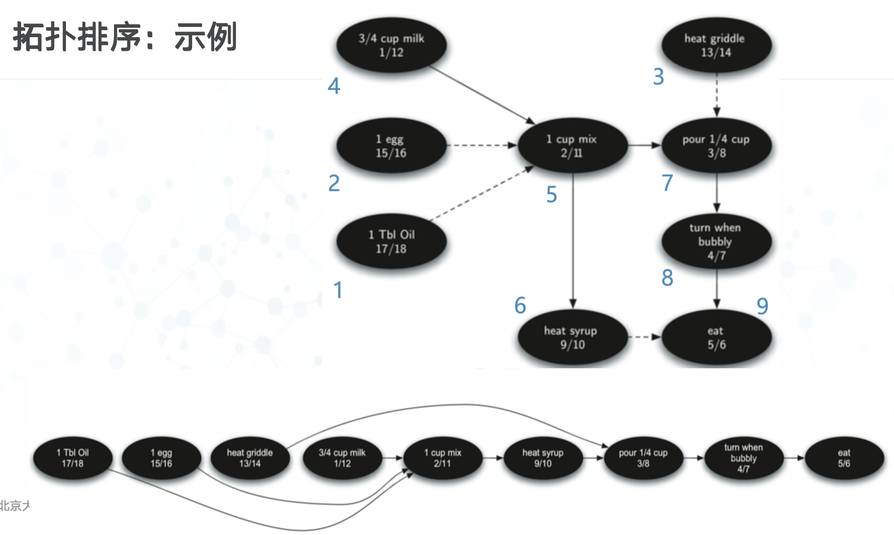

AOV网络(Activity on Vetext Nextwork):
- 将有向图中的顶点看作活动，边看作活动的先后关系，A->B就意味着B活动进行前必须先进行A活动，则有向图可以看作是AOV网络

拓扑排序算法
1. 从图中任选一个没有前驱（入度为0）的顶点 x 输出
2. 从图中删除 x 和所有以它为起点的边
- 重复 1 和 2 直到图为空或当前图中不存在无前驱的顶点为止(后一种情况说明图中有环，无法拓扑排序)
- 具体实现：用队列存放入度变为0的点。每个顶点出入队列一次，每个顶点连的边都要看一次，复杂度O(E+V)

Genealogical tree
【问题定义】给一个有向无环图，输出任一拓扑排序
【输入be like】
样例输入<br>
5	#5个点<br>
0          #1号点没出边<br>
4 5 1 0 #2号点有边连到 4,5, 1<br>
1 0<br>
5 3 0<br>
3 0<br>

样例输出<br>
2 4 5 3 1<br>

```python
# 定义一条有向边
class Edge:

    def __init__(self, v, w):
        self.v, self.w = v, w


def topoSort(G):
    # n 表示图中顶点的数量
    n = len(G)

    # 导入队列模块
    # queue.Queue() 是先进先出队列
    import queue

    # inDegree[i] 表示顶点 i 的入度
    # 入度：有多少条边指向这个顶点
    inDegree = [0] * n

    # 创建一个队列 q
    # 用来存放当前入度为 0 的顶点
    q = queue.Queue()

    # 统计每个顶点的入度
    for i in range(n):

        # 遍历从顶点 i 出发的所有边
        for e in G[i]:
            # e.v 是边的起点
            # e.w 是边的终点
            # 所以有一条边 i -> e.w
            # 终点 e.w 的入度加 1
            inDegree[e.w] += 1

    # 把所有入度为 0 的顶点放入队列
    # 入度为 0 表示：
    # 没有任何其他顶点必须排在它前面
    for i in range(n):

        if inDegree[i] == 0:
            q.put(i)

    # seq 用来保存最终得到的拓扑排序结果
    seq = []

    # 只要队列不为空，就继续处理
    while not q.empty():

        # 取出一个当前入度为 0 的顶点
        k = q.get()

        # 把这个顶点加入拓扑序列
        seq.append(k)

        # 删除所有从 k 出发的边
        # 实际上代码并不是真的删除边，
        # 而是把这些边指向的终点的入度减 1
        for e in G[k]:

            # e.w 是边 k -> e.w 的终点
            # 因为 k 已经被加入拓扑序列，
            # 所以相当于删除了 k -> e.w 这条边
            inDegree[e.w] -= 1

            # 如果删除这条边后，e.w 的入度变成 0
            # 说明它前面的依赖都已经处理完了
            # 可以加入队列，等待后续输出
            if inDegree[e.w] == 0:
                q.put(e.w)

    # 如果拓扑序列长度小于顶点总数
    # 说明还有一些顶点没有被加入序列
    # 这些顶点无法变成入度为 0
    # 因此图中存在环
    if len(seq) != n:
        return None

    # 否则说明所有顶点都成功排序
    # 返回拓扑排序结果
    else:
        return seq
```

AOE网络：
1. 带权有向无环图
2. 顶点表示事件，事件不需要花时间
3. 有向边表示活动，边权值表示活动需要花的时间
4. 先后顺序无关的活动可以同时进行
5. 当且仅当一个顶点的入边代表的活动都已经完成，该顶点表示的事件会发生。顶点代表的事件一旦发生，其出边代表的活动就都可以(不是必须)开始

**关键是求每个事件i的最早发生时间earliestTime[i]和最晚发生时间 latestTime[i]**

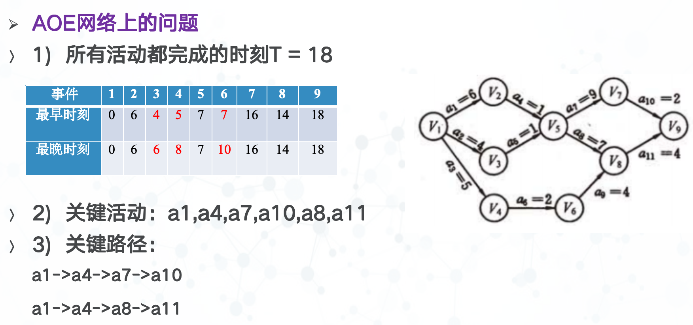

- 递推求earliestTime[i]
  1. 对每个入度为0的顶点k(事件k)，earlistTime[k] = 0
  2. 拓扑排序
  3. 按拓扑序列的顺序递推每个事件的最早开始时间:
   对拓扑序列中的顶点 i,若边<i, j>存在且权值为Wij ，则: earliestTime[j] = max(earliestTime[j], earliestTime[i] + Wij )
- 递推求latestTime[i]
  1. 求出全部活动都完成的最早时刻 T 
  2. 初始条件：对每个出度为0的顶点k(事件k)，latestTime [k] = T
  3. 拓扑排序
  4. 按拓扑序列的逆序递推每个事件的最晚开始时间：
    对拓扑逆序列中的顶点 j,若边<i , j>存在且权值为Wij ，则: latestTime[i] = min(latestTime[i], latestTime[j] - Wij )

### 强连通分支

强连通分支，定义为图G的一个子集C，C中的任意两个顶点v,w之间都有路径来回，即(v,w)(w,v)都是C的路径，而且C是具有这样性质的最大子集

转置概念:
- 一个有向图G的转置GT，定义为将图G的所有边的顶点交换次序，如将(v,w)转换为(w,v)
- 可以观察到图和转置图在强连通分支的数量和划分上，是相同的

Kosaraju算法：
- 首先，对图G调用DFS算法，为每个顶点计算“结束时间”
- 然后，将图G进行转置，得到GT；
- 再对GT调用DFS算法，但在dfs函数中，对每个顶点的搜索循环里，要以顶点的“结束时间”倒序的顺序来搜索
- 最后，深度优先森林中的每一棵树就是一个强连通分支

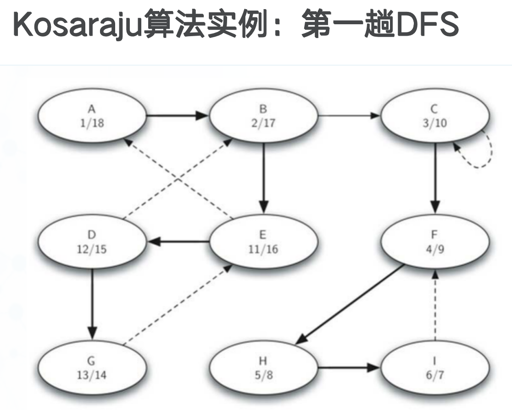

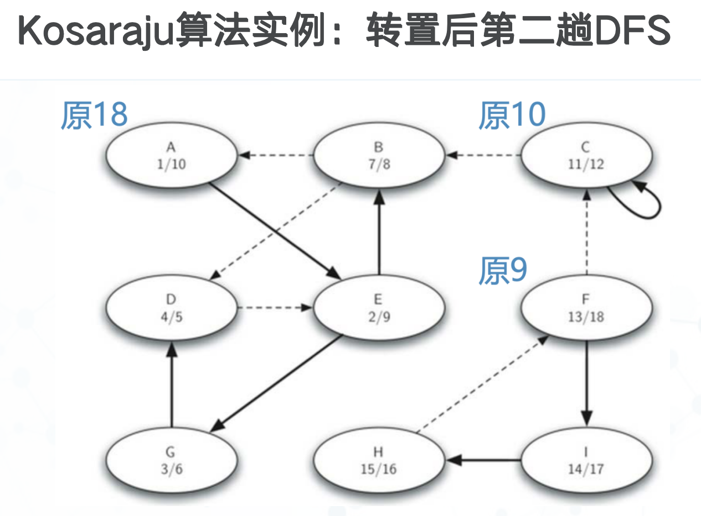

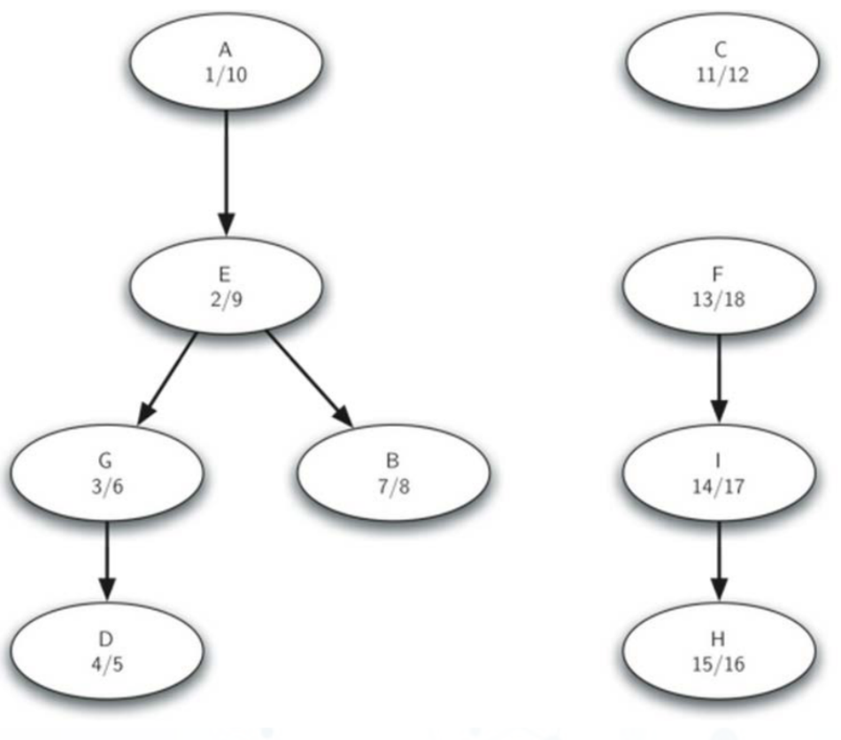

### 最短路径问题

Dijkstra算法：
- 这是一个迭代算法，得出从一个顶点到其余所有顶点的最短路径，很接近于广度优先搜索算法BFS的结果
- 具体实现上，在顶点Vertex类中的成员dist用于记录从开始顶点到本顶点的最短带权路径长度（权重之和），算法对图中的每个顶点迭代一次
- 贪心思想，若离源点s前k-1近的点已经被确定，构成点集P，那么从s到离s第k近的点t的最短路径，{s,p1,p2…pi,t}满足s,p1,p2…pi∈P。
- d[i]=min(d[pi]+cost(pi,i)),i∉P,pi∈P；d[t]=min(d[i]) ,i∉P

- 顶点的访问次序由一个优先队列来控制，队列中作为优先级的是顶点的dist属性。
- 最初，只有开始顶点dist设为0，而其他所有顶点dist设为sys.maxsize（最大整数），全部加入优先队列。
- 随着队列中每个最低dist顶点率先出队
- 并计算它与邻接顶点的权重，会引起其它顶点dist的减小和修改，引起堆重排
- 并据更新后的dist优先级再依次出队

```python
def dijkstra(aGraph, start):
    """
    使用 Dijkstra 算法计算从起点 start 到图中所有顶点的最短路径。

    参数：
    aGraph：图对象，里面包含所有顶点以及顶点之间的边
    start ：起点顶点

    前提：
    图中所有边的权重必须是非负数。
    """

    # 创建一个优先队列
    # 优先队列中会按照“当前距离”从小到大取出顶点
    pq = PriorityQueue()

    # 设置起点到自己的距离为 0
    # 因为从 start 到 start 不需要走任何边
    start.setDistance(0)

    # 将图中所有顶点加入优先队列
    # 每个元素是一个二元组：
    # (顶点当前距离, 顶点对象)
    #
    # 起点的距离是 0
    # 其他点的距离通常在初始化时应该是无穷大
    pq.buildHeap([(v.getDistance(), v) for v in aGraph])

    # 只要优先队列不为空，就继续处理
    while not pq.isEmpty():

        # 从优先队列中取出当前距离最小的顶点
        # 这个点的最短路径已经可以被确定
        currentVert = pq.delMin()

        # 遍历 currentVert 的所有邻接点
        # 也就是从 currentVert 可以直接走到的点
        for nextVert in currentVert.getConnections():

            # 计算一条新的候选路径长度：
            # 起点 start 到 currentVert 的距离
            # 加上 currentVert 到 nextVert 的边权重
            newDist = currentVert.getDistance() \
                      + currentVert.getWeight(nextVert)

            # 如果通过 currentVert 到达 nextVert 更短
            # 就更新 nextVert 的当前最短距离
            if newDist < nextVert.getDistance():

                # 更新 nextVert 到起点 start 的最短距离
                nextVert.setDistance(newDist)

                # 记录 nextVert 的前驱节点
                # 表示当前最短路径中，nextVert 是从 currentVert 走过来的
                nextVert.setPred(currentVert)

                # 因为 nextVert 的距离变小了
                # 所以需要更新它在优先队列中的优先级
                pq.decreaseKey(nextVert, newDist)
```

floyd算法：
- 边上有负权重的边，但是不能有负权回路
- 假设求从顶点vi到vj的最短路径。如果从vi到vj有边，则从vi到vj存在一条长度为cost[i,j]的路径，该路径不一定是最短路径，尚需进行n次试探。
- 考虑路径（vi, v1, vj）是否存在（即判别弧（vi, v1）和（v1,vj）是否存在）。如果存在，则比较cost[i,j]和（vi,v1,vj）的路径长度，取长度较短者为从vi到vj的中间顶点的序号不大于1的最短路径，记为新的cost[i,j] 。
- 假如在路径上再增加一个顶点v2 ，如果（ vi，…， v2 ）和（ v2 ，…，vj ）分别是当前找到的中间顶点的序号不大于2的最短路径，那么（ vi，…， v2 ，… ， vj ）就有可能是从vi到 vj的中间顶点的序号不大于2的最短路径。将它和已经得到的从vi到 vj的中间顶点的序号不大于1的最短路径相比较，从中选出中间顶点的序号不大于2的最短路径之后，再增加一个顶点v3 ，继续进行试探。依次类推。
- 在一般情况下，若（vi，…，vk ）和（ vk，…，vj ）分别是从vi到vk和从vk到vj的中间顶点的序号不大于k-1的最短路径，则将（ vi，…， vk ，… ， vj ）和已经得到的从vi到vj且中间顶点的序号不大于k-1的最短路径相比较，其长度较短者便是从vi到vj的中间顶点的序号不大于k的最短路径。这样，在经过n次比较后，最后求得的必是从vi到vj的最短路径。按此方法，可以同时求得各对顶点间的最短路径。

```python
def floyd(G):
   # n 表示图中顶点的个数
    n = len(G)

    # INF 表示无穷大
    # 用来表示两个顶点之间没有直接路径
    INF = 10**9

    # prev[i][j] 记录从 i 到 j 的最短路径中，j 的前驱顶点
    # 一开始全部设为 None
    prev = [[None for i in range(n)] for j in range(n)]

    # dist[i][j] 记录从 i 到 j 的当前最短距离
    # 一开始全部设为 INF
    dist = [[INF for i in range(n)] for j in range(n)]

    # 初始化 dist 和 prev
    for i in range(n):
        for j in range(n):

            # 如果起点和终点相同
            # 那么从 i 到 i 的距离为 0
            if i == j:
                dist[i][j] = 0

            else:
                # 如果 G[i][j] != INF
                # 说明 i 到 j 存在一条直接边
                if G[i][j] != INF:

                    # 直接边的距离就是 G[i][j]
                    dist[i][j] = G[i][j]

                    # 如果从 i 直接走到 j
                    # 那么 j 的前驱就是 i
                    prev[i][j] = i

    # Floyd 算法核心部分
    # 枚举中转点 k
    for k in range(n):

        # 枚举起点 i
        for i in range(n):

            # 枚举终点 j
            for j in range(n):

                # 判断是否可以通过 k 作为中转点
                # 让 i 到 j 的路径变得更短
                #
                # 原来的路径是：
                # i -> j，距离为 dist[i][j]
                #
                # 新的路径是：
                # i -> k -> j，距离为 dist[i][k] + dist[k][j]
                if dist[i][k] + dist[k][j] < dist[i][j]:

                    # 如果经过 k 更短，就更新 i 到 j 的最短距离
                    dist[i][j] = dist[i][k] + dist[k][j]

                    # 更新前驱信息
                    # prev[k][j] 表示从 k 到 j 的最短路径中，
                    # j 前面的那个点
                    #
                    # 因为现在 i 到 j 的最短路变成：
                    # i -> ... -> k -> ... -> j
                    # 所以 j 的前驱应该沿用 k 到 j 路径中的前驱
                    prev[i][j] = prev[k][j]

    # 返回最短距离矩阵和前驱矩阵
    return dist, prev
```

### 最小生成树

- 信息广播问题的最优解法，依赖于路由器关系图上选取具有最小权重的生成树（minimum weight spanning tree）生成树：拥有图中所有的顶点和最少数量的边，以保持连通的子图

Prim算法：
- 解决最小生成树问题的Prim算法，属于“贪心算法”，即每步都沿着最小权重的边向前搜索。
- 构造最小生成树的思路很简单，如果T还不是生成树，则反复做：找到一条最小权重的可以安全添加的边，将边添加到树T
- “可以安全添加”的边，定义为一端顶点在树中，另一端不在树中的边，以便保持树的无圈特性

```python
# 从 pythonds.graphs 中导入优先队列、图、顶点类
from pythonds.graphs import PriorityQueue, Graph, Vertex

# 导入 sys，用来使用 sys.maxsize 表示一个很大的数
import sys


def prim(G, start):
    # 创建一个优先队列
    # 队列中每个顶点的优先级是它当前连接到生成树的最小边权
    pq = PriorityQueue()

    # 初始化图中的所有顶点
    for v in G:

        # 一开始认为每个顶点到生成树的距离都是无穷大
        # sys.maxsize 可以理解为一个非常大的数
        v.setDistance(sys.maxsize)

        # 一开始每个顶点都没有前驱
        # 前驱用来记录这个顶点是通过哪一个顶点连入最小生成树的
        v.setPred(None)

    # 起始点 start 的距离设为 0
    # 表示从 start 开始构建最小生成树
    start.setDistance(0)

    # 把图中所有顶点加入优先队列
    # 每个元素是一个二元组：
    # (顶点当前距离, 顶点对象)
    #
    # 起点 start 的距离是 0，所以它会最先被取出
    pq.buildHeap([(v.getDistance(), v) for v in G])

    # 只要优先队列不为空，就继续选择顶点加入最小生成树
    while not pq.isEmpty():

        # 取出当前 distance 最小的顶点
        # 这个顶点就是当前最适合加入生成树的顶点
        currentVert = pq.delMin()

        # 遍历 currentVert 的所有邻接点
        # 也就是所有和 currentVert 直接相连的顶点
        for nextVert in currentVert.getConnections():

            # currentVert 到 nextVert 这条边的权重
            newCost = currentVert.getWeight(nextVert)

            # 判断 nextVert 是否还在优先队列中
            # 如果 nextVert 还在 pq 中，说明它还没有被正式加入最小生成树
            #
            # 同时判断 newCost 是否比 nextVert 当前记录的 distance 更小
            # 如果更小，说明可以用 currentVert 以更低代价连接 nextVert
            if nextVert in pq and newCost < nextVert.getDistance():

                # 更新 nextVert 的前驱
                # 表示在最小生成树中，nextVert 是从 currentVert 连过来的
                nextVert.setPred(currentVert)

                # 更新 nextVert 当前连接到生成树的最小边权
                nextVert.setDistance(newCost)

                # 因为 nextVert 的 distance 变小了
                # 所以要更新它在优先队列中的优先级
                pq.decreaseKey(nextVert, newCost)
```

Kruskal算法：
- 假设G=(V,E)是一个具有n个顶点的连通网，T=(U,TE)是G的最小生成树，U=V,TE初值为空。
- 将图G中的边按权值从小到大依次选取，**若选取的边使生成树不形成回路，则把它并入TE中，若形成回路则将其舍弃**，直到TE中包含N-1条边为止，此时T为最小生成树。

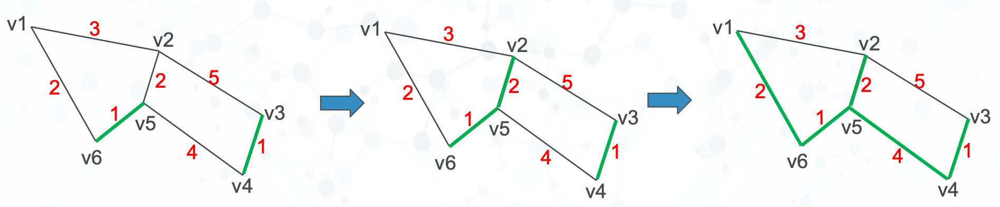

