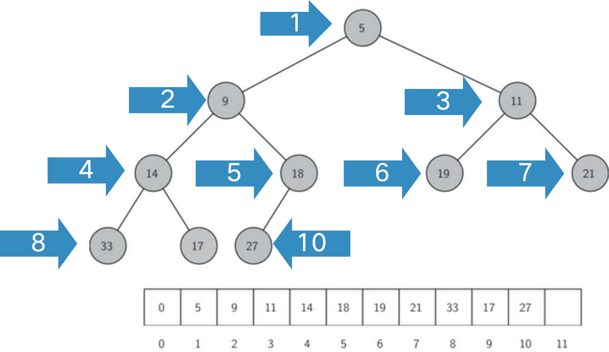
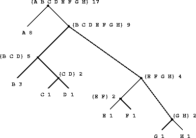

# 二叉树的遍历

### 深度优先遍历

使用类（class）来定义树的节点。每个节点包含三个属性：节点的值 (`val`)、指向左子节点的引用 (`left`) 和指向右子节点的引用 (`right`)。

```python
class Treenode:
    def __init__(self, val = 0, left = None, right = None):
    self.val = val
    self.left = left
    self.right = right
```

- 前序遍历
  
```python
def preorder(root):
    if root:
        print(root.val)
        preorder(root.left)
        preorder(root.right)
```

- 中序遍历

```python
def inorder(root):
    if root:
        inorder(root.left)
        print(root.val)
        inorder(root.right)
```

- 后序遍历

```python
def postorder(root):
    if root:
        postorder(root.left)
        postorder(root.right)
        print(root.val)
```

> example:
> https://leetcode.cn/problems/binary-tree-inorder-traversal/
>

> example: 
> 用stack模拟的“颜色填充法”
>

### 广度优先遍历

```python
def bfs(root):
    if not root:
        return
    else:
        queue = [root]
        while queue:
            node = queue.pop(0)
            print(node.val)
            if node.left():
                queue.append(node.left())
            if node.right():
                queue.append(node.right())
```

### 重建二叉树

基本原则：
1) P[0]是树的树根
2) 找到树根P[0]在中序序列中的位置X，并将中序序列以树根为界分为左子树的中序序列Q[:X]和右子树的中序序列Q[X+1:]
3) P[1:X+1]是左子树的前序序列,P[X+1:]是右子树的前序序列，递归建两棵子树  

```python
def Buildtree(preorder, inorder):
    if not preorder: # 这个判断是非常有意义的
        return 
    root_val = preorder[0] # 赋值
    root = Treenode(root_val) # 赋一个结点

    x = inorder.index(root_val)

    ino_left = inorder[1:x]
    ino_right = inorder[x:]

    l = len(root_left)

    pre_left = preorder[1:1+l]
    pre_right = preoder[1+l:]

    root.left = Buildtree(pre_left, ino_left)
    root.right = Buildtree(pre_right, ino_right)

    return root
```

> example: 后序遍历_表达式求值
> ```python
> def post(tree):
>     opers = {
>         "+": operator.add,
>         "-": operator.sub,
>         "*": operator.mul,
>         "/": operator.truediv
>     }
> 
>     if tree:
>         res1 = post(tree.left) # 这里传入的应该是一个结点
>         res2 = post(tree.right)
>         if res1 is not None and res2 is not None:
>             return opers[tree.val](res1, res2)
>         else:
>             return tree.val
> ```
>
> 进一步地：
> 前序遍历得到前缀表达式：
> \- + 3 * 2 9 / 6 4
> 后序遍历得到后缀表达式：
> 3 2 9 * + 6 4 / -
> 中序遍历得到运算符中置表达式：
> 3 + 2 * 9 – 6 / 4

### 非递归遍历二叉树

- 前序遍历

```python
class Binarytree:
    def __init__(self, val, left=None, right=None):
        self.val = val
        self.left = left
        self.right = right
    def preorder(self):
        stack = [self]
        while len(stack) > 0:
            node = stack.pop()
            print(node.val)
            if node.right:
                stack.append(node.right)
            if node.left:
                stack.append(node.left)
```

- 中序遍历

```python
# 前面忽略

def inorder(self):
    stack = [[self,0]]
    while stack:
        node = stack[-1]
        if node[0] == None:
            stack.pop()
            continue
        if node[1] == 0:
            stack.append([node[0].left, 0])
            node[1] = 1
        elif node[1] == 1:
            print(node[0].val)
            stack.pop()
            stack.append([node[0].right, 0])
```

# 优先队列和二叉堆

优先队列（Priority Queue）是一种每次出队都取“优先级最高”的元素，而不是最早进入元素的数据结构。

实现优先队列的经典方案是采用二叉堆数据结构，二叉堆可以通过非嵌套列表来实现

ADT BinaryHeap的操作定义如下：
- `BinaryHeap()`：创建一个空二叉堆对象；
- `insert(k)`：将新key加入到堆中；
- `findMin()`：返回堆中的最小项，最小项仍保留在堆中；
- `delMin()`：返回堆中的最小项，同时从堆中删除；
- `isEmpty()`：返回堆是否为空；
- `size()`：返回堆中key的个数；
- `buildHeap(list)`：从一个key列表创建新堆

要使操作始终保持在对数数量级上，就必须始终保持二叉树的“平衡”，即左右子树拥有相同数量的节点

“完全二叉树”的结构来近似实现“平衡”
- 完全二叉树，叶节点最多只出现在最底层和次底层，而且最底层的叶节点都连续集中在最左边，每个内部节点都有两个子节点，最多可有1个节点例外
- 如果节点的下标为p，那么其左子节点下标为2p，右子节点为2p+1，其父节点下标为p//2

{width = 60%}

堆次序Heap Order：任何一个节点x，其父节点p中的key均小于x中的key


# 二叉堆的Python实现

- 二叉堆初始化

```python
class BinHeap:
    def __init__(self):
        self.heaplist = [0]
        self.size = 0
```
- insert(key)方法
  - 需要将新key沿着路径来“上浮”到其正确位置

```python
def percUp(self, i):
    while i//2 > 0:
        if self.heaplist[i] > self.heaplist[i//2]:
            self.heaplist[i], self.heaplist[i//2] = self.heaplist[i//2], self.heaplist[i]
        i = i//2
def insert(self, k):
    self.heaplist.append(k)
    self.size += 1
    self.percUp(self.size)
```

- delMin()方法
  - 移走整个堆中最小的key: 根节点heapList[1]，为了保持“完全二叉树”的性质，只用最后一个节点来代替根节点
  - 将新的根节点沿着一条路径“下沉”，直到比两个子节点都小

```python
def FindMin(self,i):
    if i*2+1>self.size:
        return i*2
    else:
        if self.heaplist[i*2] < self.heaplist[i*2+1]:
            return i*2
        else:
            return i*2+1
def percDown(self,i):
    while i*2 <= self.size:
        mc = FidMin(i)
        if self.heaplist[i] > self.heaplist[mc]:
            self.heaplist[i], self.heaplist[mc] = self.heaplist[mc], self.heaplist[i]
        i = mc
def delMin(self):
    val = self.heaplist[1]
    self.heaplist[1] = self.heaplist[size] # 注意这里size和实际队列长度的区别
    self.size -= 1
    self.heaplist.pop()
    self.percDown(1) # 这里是要往下沉的所以是1
    return val
```

- buildHeap(lst)方法：从无序表生成“堆”
```python
def buildheap(self,alist):
    i = len(alist)//2
    self.size = len(alist)
    self.heaplist = [0] + alist[:]
    while(i>0):
        self.percDown(i)
        i -= 1
```
# 堆排序

- 将待排序列表a变成一个堆(O(n))
- 将a[1]和a[n-1]交换，然后对新a[1]做下移，维持前n-1个元素依然是堆。此时优先级最高的元素就是a[n-1]
- 将a[1]和a[n-2]交换，然后对新a[1]做下移, 维持前n-2个元素依然是堆。此时优先级次高的元素就是a[n-2]

> 把新的最大值重新顶到堆顶。

```python
def heapSort(self, a):
    self.buildheap(a)
    n = len(self.heaplist)
    for i in range(n-1, 0, -1):
        self.heaplist[1],self.heaplist[i] = self.heaplist[i], self.heaplist[1]
        self.size -= 1
        self.percDown(1)
    for i in range(n//2):
        self.heaplist[1],self.heaplist[n-1-i] = self.heaplist[n-1-i], self.heaplist[1]
    return self.heaplist[1:]
```

用Python 自带的堆模块`heapq`，它默认实现的是小顶堆

```python
import heapq
def heapsorted(s):
    h = []
    for value in s:
        h.append(value)
    heapq.heapify(h)
    return [headq.heapop(h) for i in range(n)]
```

# 二叉查找树及操作

```python
class TreeNode:
    def __init__(self, key, val, left=None, right=None, parent=None):
        self.key = key
        self.payload = val
        self.leftChild = left
        self.rightChild = right
        self.parent = parent

    def hasLeftChild(self):
        return self.leftChild

    def hasRightChild(self):
        return self.rightChild

    def isLeftChild(self):
        return self.parent and self.parent.leftChild == self

    def isRightChild(self):
        return self.parent and self.parent.rightChild == self

    def isRoot(self):
        return not self.parent

    def isLeaf(self):
        return not (self.leftChild or self.rightChild)

    def hasAnyChildren(self):
        return self.leftChild or self.rightChild

    def hasBothChildren(self):
        return self.leftChild and self.rightChild

    def replaceNodeData(self, key, value, lc, rc):
        self.key = key
        self.payload = value
        self.leftChild = lc
        self.rightChild = rc

        if self.hasLeftChild():
            self.leftChild.parent = self

        if self.hasRightChild():
            self.rightChild.parent = self

    def __iter__(self):
        if self.leftChild:
            for elem in self.leftChild:
                yield elem

        yield self.key

        if self.rightChild:
            for elem in self.rightChild:
                yield elem
```

# 二叉查找树实现及算法分析

### put(key, val)方法：插入key构造BST

```python
def put(self,key,val):
    if self.root:
        self._put(key, val, self.root)
    else:
        self.root = TreeNode(key, val)
    self.size += 1
```

_put函数作为辅助方法:

```python
def _put(self, key, value, currentNode):
    if key < currentNode.key:
        if currentNode.hasLeftChild:
            self._put(key, value,currentNode.leftChild)
        else:
            currentNode.leftChild = TreeNode(key, val, parent = currentNode)
    else:
        if currentNode.hasRightChild:
            self._put(key, value, currentNode.rightChild)
        else:
            currentNode.rightChild = TreeNode(key,val,parent = currentNode)
```

__setitem__函数方法: 

```python
def __setitem__(self, key, value):
    self.put(key, value)
```

### BST.get方法: 在树中找到key所在的节点取到payload

```python
def get(self,key):
    if self.root:
        res = _get(key, self.root)
        if res is None:
            return None
        else:
            return res.value
    else:
        return None
def _get(key,currentNode):
    if not currentNode:
        return None
    elif currentNode.key == key:
        return currentNode
    elif key < currentNode.key:
        return self._get(key, currentNode.leftChild)
    else:
        return self._get(key, currentNode.rightChild)
```

### BST.delete方法: 用_get找到要删除的节点，然后调用remove来

```python
def delete(self,key):
    if self.size > 1:
        nodeToRemove = self._get(key, self.root)
        if nodeToRemove:
            self.remove(nodeToRemove)
            self.size -= 1
        else:
            raise KeyError("Error, key not in tree")
    elif self.size == 1 and self.root.key == key:
        self.root = None
        self.size -= 1
    else:
        raise KeyError("Error, key not in tree")
```

### BST.remove方法: 需要分类讨论

###### 没有子节点的情况

```python
if currentNode.isLeaf():
    if currentNode == currentNode.parent.leftChild:
        currentNode.parent.leftChild = None
    else:
        currentNode.parent.rightChild = None
```

###### 第2种情形稍复杂

- 被删除节点X只有左子结点，则其左子结点取代X的地位
- X只有右子结点：则其右子结点取代X的地位

```python
else:
    if currentNode.hasLeftChild():
        if currentNode.isleftChild():
            currentNode.leftChild.parent = currentNode.parent
            currentNode.parent.leftChild = currentNode.leftChild
        elif currentNode.isrightChild():
            currentNode.rightChild.parent = current.parent
            currentNode.parent.rightChild = currentNode.leftChild
        else:
        currentNode.replaceNodeData(
            currentNode.leftChild.key,
            currentNode.leftChild.payload,
            currentNode.leftChild.leftChild,
            currentNode.leftChild.rightChild
        )
    else:
        if currentNode.isleftChild():
            currentNode.leftChild.parent = currentNode.parent
            currentNode.parent.leftChild = currentNode.rightChild
        elif currentNode.isrightChild():
            currentNode.rightChild.parent = current.parent
            currentNode.parent.rightChild = currentNode.rightChild
        else:
        currentNode.replaceNodeData(
            currentNode.rightChild.key,
            currentNode.rightChild.payload,
            currentNode.rightChild.leftChild,
            currentNode.rightChild.rightChild
        )
```

###### 第三种情况，含有两个孩子

```python
def findsuccessor(self):
    succ = None
    if self.hasRightChild():
        # 如果有右子树，则后继是右子树的最小值
        succ = self.rightChild.findMin()
    else:
        # 否则往上找父节点，找到一个是其左孩子的节点
        if self.parent:
            if self.isLeftChild():
                succ = self.parent
            else:
                # 如果自己是右孩子，继续向上找
                self.parent.rightChild = None  # 临时断开右孩子
                succ = self.parent.findsuccessor()
                self.parent.rightChild = self
    return succ

    # 查找以当前节点为根的最小节点
def findMin(self):
    current = self
    while current.hasLeftChild():
        current = current.leftChild
    return current
def spliceOut(self):
    # 节点是叶子
    if self.isLeaf():
        if self.isLeftChild():
            self.parent.leftChild = None
        else:
            self.parent.rightChild = None
    # 节点有一个孩子
    elif self.hasAnyChildren():
        if self.hasLeftChild():
            if self.isLeftChild():
                self.parent.leftChild = self.leftChild
            else:
                self.parent.rightChild = self.leftChild
            self.leftChild.parent = self.parent
        else:
            if self.isLeftChild():
                self.parent.leftChild = self.rightChild
            else:
                self.parent.rightChild = self.rightChild
            self.rightChild.parent = self.parent
    elif currentNode.hasBothChildren():
        # 节点有两个孩子
        succ = currentNode.findsuccessor()  # 找后继节点
        succ.spliceOut()                    # 移除后继
        currentNode.key = succ.key          # 替换 key
        currentNode.payload = succ.payload  # 替换 value
```

# 哈夫曼树(最优二叉树)

最优二叉树的定义: 给定n个结点，结点i有权值Wi。要求构造一棵二叉树，叶子结点为给定的结点，且`WPL =	∑_i=1^nWi×Li`最小。

最优二叉树的构造:
1. 开始n个结点位于集合S
2. 从S中取走两个权值最小的结点n1和n2，构造一棵二叉树，树根为结点r，r的两个子结点是n1和n2，且Wr=Wn1+Wn2，并将r加入S
3. 重复2）,直到S中只有一个结点，最优二叉树就构造完毕，根就是S中的唯一结点

【计算最小的WPL】

```python
import heapq

def optimal_binary_tree(weights):
    # 1. 开始 n 个结点位于集合 S
    heapq.heapify(weights)

    total_wpl = 0

    # 2. 每次取出两个权值最小的结点
    while len(weights) > 1:
        n1 = heapq.heappop(weights)
        n2 = heapq.heappop(weights)

        # 构造新结点 r
        r = n1 + n2

        # 这一次合并产生的代价
        total_wpl += r

        # 将 r 加回集合 S
        heapq.heappush(weights, r)

    # 3. total_wpl 就是最小 WPL
    return total_wpl


weights = [8, 3, 1, 1, 1, 1, 1, 1]
print(optimal_binary_tree(weights))
```

【真正构造最优二叉树】
```python
import heapq

# 定义树结点
class Node:
    def __init__(self, weight, name=None):
        # weight 表示当前结点的权值
        # 如果是叶子结点，weight 就是原始权值
        # 如果是内部结点，weight 就是左右子树权值之和
        self.weight = weight

        # name 表示结点名字
        # 只有叶子结点有名字，比如 A、B、C
        # 内部结点没有名字，所以默认为 None
        self.name = name

        # left 和 right 分别表示左孩子和右孩子
        self.left = None
        self.right = None


def build_huffman_tree(weights):
    """
    根据权值列表构造最优二叉树，也就是哈夫曼树。
    """

    # heap 是最小堆
    # 它用来表示集合 S
    # 堆的特点是：每次可以快速取出权值最小的结点
    heap = []

    # count 是辅助变量
    # 因为如果两个结点权值相同，Python 不知道怎么比较 Node 对象
    # 所以加一个 count 来保证每个元素都可以被比较
    count = 0

    # 1. 开始 n 个结点位于集合 S
    # 把每个权值都包装成一个叶子结点，然后放入堆中
    for i, w in enumerate(weights):
        # 创建一个叶子结点
        # name 用 A、B、C... 表示
        node = Node(w, name=chr(ord('A') + i))

        # 放入堆中
        # 堆里的元素是三元组：
        # (结点权值, 编号, 结点对象)
        heapq.heappush(heap, (node.weight, count, node))

        count += 1

    # 2. 不断从 S 中取出两个权值最小的结点
    # 直到 S 中只剩一个结点为止
    while len(heap) > 1:

        # 取出权值最小的结点 n1
        w1, _, n1 = heapq.heappop(heap)

        # 取出权值第二小的结点 n2
        w2, _, n2 = heapq.heappop(heap)

        # 构造一个新的父结点 r
        # r 的权值 = n1 的权值 + n2 的权值
        r = Node(w1 + w2)

        # 让 n1 和 n2 成为 r 的两个子结点
        # 这一步就是真正在“建树”
        r.left = n1
        r.right = n2

        # 把新结点 r 放回集合 S
        # 后面 r 还可能继续和别的结点合并
        heapq.heappush(heap, (r.weight, count, r))

        count += 1

    # 3. 最后堆中只剩一个结点
    # 这个结点就是整棵最优二叉树的根结点
    root = heap[0][2]

    return root


def print_tree(root, depth=0):
    """
    按层次打印树结构。
    depth 表示当前结点在第几层。
    """

    if root is None:
        return

    # 根据 depth 控制缩进
    indent = "  " * depth

    # 如果 name 不是 None，说明它是叶子结点
    if root.name is not None:
        print(indent + f"叶子结点 {root.name}, weight = {root.weight}")
    else:
        print(indent + f"内部结点, weight = {root.weight}")

    # 继续打印左子树和右子树
    print_tree(root.left, depth + 1)
    print_tree(root.right, depth + 1)


def get_wpl(root, depth=0):
    """
    计算这棵树的 WPL。
    WPL = 所有叶子结点的 权值 × 深度 之和。
    """

    if root is None:
        return 0

    # 如果是叶子结点
    if root.left is None and root.right is None:
        return root.weight * depth

    # 如果不是叶子结点，就递归计算左右子树的 WPL
    return get_wpl(root.left, depth + 1) + get_wpl(root.right, depth + 1)


# 测试
weights = [8, 3, 1, 1, 1, 1, 1, 1]

root = build_huffman_tree(weights)

print("最优二叉树结构：")
print_tree(root)

print("最小 WPL =", get_wpl(root))
```

哈夫曼编码树:
1. 二叉树
2. 叶子代表字符，且每个叶子结点有个权值，权值即该字符的出现频率
3. 非叶子结点里存放着以它为根的子树中的所有字符，以及这些字符的权值之和
4. 权值仅用来建树，对于字符串的解码和编码没有用处



【解码过程】从树根开始，在字符串编码中碰到一个0，就往左子树走，碰到1，就往右子树走。走到叶子，即解码出一个字符。然后回到树根重复前面的过程。
> eg: 10001010 -> BAC

【构造思路】
1. 开始时，若有n个字符，则就有n个结点。每个结点的权值就是字符的频率，每个结点的字符集就是一个字符。
2. 取出权值最小的两个结点，合并为一棵子树。子树的树根的权值为两个结点的权值之和，字符集为两个结点字符集之并。在结点集合中删除取出的两个结点，加入新生成的树根。
3. 如果结点集合中只有一个结点，则建树结束。否则，goto 2
（其实就是构建最优二叉树）

```python
import heapq

class Node:
    def __init__(self, weight, chars):
        # weight 表示权值，也就是字符出现频率之和
        self.weight = weight

        # chars 表示这个结点包含哪些字符
        # 叶子结点只包含一个字符
        # 非叶子结点包含左右子树所有字符
        self.chars = chars

        # 左右孩子
        self.left = None
        self.right = None


def build_huffman_tree(freq):
    """
    构造哈夫曼编码树

    参数：
        freq: 字典，表示每个字符的出现频率
              例如 {'A': 8, 'B': 3, 'C': 1}

    返回：
        root: 哈夫曼树的根结点
    """

    heap = []
    count = 0

    # 1. 开始时，每个字符都是一个单独的叶子结点
    for ch, w in freq.items():
        node = Node(w, ch)

        # 放入最小堆
        # 按 weight 从小到大排序
        heapq.heappush(heap, (node.weight, count, node))
        count += 1

    # 2. 不断取出权值最小的两个结点合并
    while len(heap) > 1:
        w1, _, n1 = heapq.heappop(heap)
        w2, _, n2 = heapq.heappop(heap)

        # 新结点 r
        # 权值 = 两个子结点权值之和
        # 字符集 = 两个子结点字符集之并
        r = Node(w1 + w2, n1.chars + n2.chars)

        # 设定左右孩子
        # 这里规定：左边为 0，右边为 1
        r.left = n1
        r.right = n2

        # 把新结点放回集合
        heapq.heappush(heap, (r.weight, count, r))
        count += 1

    # 3. 最后剩下的唯一结点就是根结点
    return heap[0][2]
```

```python
import heapq

def optimal_binary_tree(weights):
    """
    构造最优二叉树，也就是哈夫曼树。
    
    参数：
        weights: 一个列表，表示每个叶子结点的权值
                 例如 [8, 3, 1, 1, 1, 1, 1, 1]
    
    返回：
        最小 WPL，也就是最小带权路径长度
    """
    # heapq 是 Python 里的最小堆工具
    # 最小堆的特点是：每次都能快速取出当前最小的元素

    # 把普通列表变成最小堆
    # 这一步相当于：
    # 开始 n 个结点都放在集合 S 中
    heapq.heapify(weights)

    # total_wpl 用来记录最终的最小 WPL
    # 也可以理解为“总合并费用”
    total_wpl = 0

    # 只要集合 S 中还有两个及以上的结点，就继续合并
    while len(weights) > 1:

        # 从集合 S 中取出权值最小的结点 n1
        n1 = heapq.heappop(weights)

        # 再从集合 S 中取出权值第二小的结点 n2
        n2 = heapq.heappop(weights)

        # 构造一个新的父结点 r
        # r 的权值等于 n1 和 n2 的权值之和
        r = n1 + n2

        # 为什么要把 r 加入 total_wpl？
        # 因为每合并一次，都会让 n1 和 n2 这两棵子树中的所有叶子深度 +1
        # 这次增加的 WPL 正好等于 n1 + n2，也就是 r
        total_wpl += r

        # 将新结点 r 放回集合 S
        # 后面它还可能继续和别的结点合并
        heapq.heappush(weights, r)

        # 可以打印过程，帮助理解
        print(f"合并 {n1} 和 {n2}，得到新结点 {r}，当前总费用 = {total_wpl}")

    # 当集合 S 中只剩下一个结点时，说明整棵最优二叉树构造完成
    # weights[0] 就是整棵树的根结点权值
    return total_wpl

# 测试数据
weights = [8, 3, 1, 1, 1, 1, 1, 1]

answer = optimal_binary_tree(weights)

print("最小 WPL =", answer)
```

```python
def decode(root, code):
    """
    使用哈夫曼树解码字符串。

    参数：
        root: 哈夫曼树的根结点
        code: 由 0 和 1 组成的编码字符串，例如 "10001010"

    返回：
        解码后的原字符串
    """

    result = ""

    # cur 表示当前走到树中的哪个结点
    # 解码一开始从根结点出发
    cur = root

    for bit in code:
        # 遇到 0，往左子树走
        if bit == "0":
            cur = cur.left

        # 遇到 1，往右子树走
        elif bit == "1":
            cur = cur.right

        # 如果不是 0 或 1，说明编码非法
        else:
            raise ValueError("编码中只能包含 0 和 1")

        # 如果走到了叶子结点，说明解码出了一个字符
        if cur.left is None and cur.right is None:
            result += cur.chars

            # 解出一个字符后，重新回到根结点
            cur = root

    return result
```

example: 一块长木板，要切割成长度为L1,L2...Ln的n块板子。每切一刀的费用，等于被切的那块板子的长度。求最少费用。

```python
import heapq

def min_cut_cost(lengths):
    heapq.heapify(lengths)

    total = 0

    while len(lengths) > 1:
        a = heapq.heappop(lengths)
        b = heapq.heappop(lengths)

        cost = a + b
        total += cost

        heapq.heappush(lengths, cost)

    return total


lengths = [2, 3, 5]
print(min_cut_cost(lengths))  # 15
```

