# Chapter 0 introduction

### A brief history of modern genetics

- Early history:
  - Inheritance of acquired characteristics(Lamarck)
  - Blending inheritance
  - Natural Selection

    Darwin failed to answer 2 questions
  - Mendel
  - Morgan 
  - McClintock

### What is Genetics

heredity, inheritance
variation

relationship between heredity and variation:

### Why do we study Genetics

preductive and preventative medicine
gene therapy: 
    butterfly child--insertion
    OTC deficiency--adeno-associated virus(without insert into genome)
        ARCUS 
《the code breaker》

### the themes of modern genetics

regulatory networks
modular
- DNA is the fundamental information molecule of life

human genome has about 3*10^3 base pairs

why DNA is the heredity molecule: have the ability to store, replicate, mutate, express information
    RNA is less stabla than DNA(脱氧和U?)

# Chapter 1 Mendal's Law of Inheritance

## Mendel's breakthrough

> Key words
> - law of segregation（分离定律）
> - law of independent assortment（独立分配定律）
> - reciprocal cross（反交）
> - backcross（回交）
> - testcross（测交）
> - inbreeding, incross（内交，近交）
> - outbreeding, outcross（外交，远交）
> - P: parental generation（亲本，亲代）
> - F1: first filial generation（子一代）
> - F2: second filial generation（子二代）
> - selfing line（自交系）
> - inbred line, inbred strain（近交系）
> - product rule（乘法法则，相乘定律）
> - sum rule（加法法则，相加定律）
> - hybrid（杂种）
> - monohybrid（单杂种，单因子杂种）
> - dihybrid （双因子杂种，双因子杂合子）
> - multihybrid（多基因杂种）
> - Punnett square（Punnett 棋盘式方格）
> - branched-line diagram（分支图）
> - pedigree（系谱，家谱）
> - consanguineous mating（近亲交配）

**Garden pea(*Pisum sativum*)**:
- Stigma & Anthers -> **self-fertilization**
- **Pure breeding**: produce offspring carring specidic parental traits that remain constant from generation and generation

**TOPIC:**What is an ideal experimental organism
> Aging and longetivity research: Shortest-lived vertebrate species bred in the lab: *Turquoise killifish*
> (due to the short rain season in Africa)
> - Cancer and aging research: Naked mole rat
> (Rarely get cancer; resistant to some types of pain; survive up to 18 minutes without oxygenl; Do not age; Fertility does not drop as they age)

**Keys to Success:**
  1. ideal experimental organism
    - Vigorously(茁壮的) grow
    - Self-fertilize
    - Easy to cross-fertilize
    - Produce large number of offspring each generation
  2. pure-breeding lines (2-year trial experiment)
  3. analyzed traits with descrete alternative form(Black and white experiment)
  4. numerical analysis

#### Law of Segregation

Monohybrid crosses reveal units of inheritance and **Law of Segregation** (**Reciprocal cross**互交)

Two alleles for each trait separate (**segregate**) during gamete formation, and then unite at random, one from each parent, at fertilization.

> Using The Punnett Square to present the law of segregation

对于实验的若干解释: **Dominant** & **recessive**
- Disappearance of traits in F1 generation and reappearanc in the F2 generation **disproves the hypothesis that traits blend**
- 实验要求: Trait must have two forms that can each breed true
-  One form must be hidden when plants with each trait are interbred
-  

**Testcross** reveals unkown genotype: to cross with a homozygous recessive

#### Law of Independent Assortment

Dihybrid crosses reveal the **law of independent assortment**

对于实验的若干解释：
- A dihybrid is an individual that is heterozygous at two genes
- F2 generation contained both parental types and recombinant types
- Alleles of genes assort independently, and can thus appear in any combination in the offspring

During gamete formation different pairs of alleles segregate independently of each other

#### Summary

- Inheritance is **particulate**, not blending
- There are two copies of each trait in a germ cell
- Gametes contain one copy of the trait
- Alleles (different forms of the trait) segregate randomly
- Alleles are dominant or recessive - thus the difference between genotype and phenotype
- Different traits assort independently

#### Mendelian inheritance in HUMAN

Most traits in humans are due to the interaction of multiple genes and do not show a simple Mendelian pattern of inheritance

**Pedigrees** help us infer if a trait is from a single gene and if the trait is dominant or recessive

**Pedigree analysis**

- A vertical pattern of inheritance indicates a rare dominant trait
> Huntington's disease: A late-onset neurodegenerative genetic disorder that causes uncontrolled movements, emotional problems, and loss of cognition.
> **Poly Q** - a gain of toxic function of mHtt

- A horizontal pattern of inheritance indicates a rare recessive trait
> Cystic fibrosis: A fatal and incurable disorder in which the lungs, pancreases, intestines and other organs become clogged with a viscous mucus that interfere with breathing and digestion

- Puzzling pedigree
> Progeria: a *de novo* dominant trait, an extremely rare genetic disorder with premature aging symptoms there is no known cure, few people with progeria exceed 13 years of age.
>
> 
>
> Mutation occurs during cell division in a newly conceived zygote or in the gametes of one of the parents
> 
> Treacher Collins syndrome(TCS): a *de novo* dominant trait, a disorder of craniofacial development.

## Extension to Mendal's Law

key word
- Incomplete dominance 
- Codominance
- Multiple alleles
- Pleiotropy
- lethality
- complementary gene action
- complementation test
- heterogeneity
- redundancy, redundant gene
- epistasis, epistatic effect, epistatic gene
- hypostatic gene
- recessive epistasis
- dominant epistasis
- penetrance（外显率）__incomplete penetrance
- expressivity（表现度）__variable expressivity
- discrete trait（不连续性状）
- quantitative trait（数量性状）
- continuous trait（连续性状）
- phenocopy（拟表型，表型模拟）

#### Single-gene inheritance

###### Incomplete dominance: 

F1 hybrids that differ from both parents express an intermediate phenotype. Neither allele is dominant or recessive to the other. Phenotypic ratios are same as genotypic ratios.

> Snapdragons *Antirrhinum majus*
>
> 
>
> horse

###### Codominant: 

both traits appear equally, Phenotypic ratios are same as genotypic ratios.

> lentil coat patterns
> 
> blood type

###### Multiple alleles: 

1. Genes may have multiple alleles that segregate in populations.
2. Although there may be many alleles in a population, each individual carries only 2 of the alternatives.
3. Dominance or recessiveness is always relative to a second allele.

> ABO blood type:
> Enzymes add sugar A or sugar B to a base consisting of a sugar polymer known as substance H, resulting in antigen A or antigen B respectively
>
> 
>
> The eye color of Drosophila

- Establishing dominance relations between multiple alleles: Perform **reciprocal crosses** between pure breeding lines of all phenotypes.

**TOPIC**:Mutations are the source of new alleles
Allele frequency is the percentage of the total number of gene copies represented by one allele.
  Wild-type allele —— the most common allele in a population
  Mutant allele —— a rare allele in the same population
  Monomorphic —— gene with only one common, wild-type allele
  Polymorphic —— gene with more than one common allele

###### Pleiotropy: 

a single gene determines more than one distinct and seemingly unrelate characteristic, Each protein can have a cascade of effects on an organism, Some alleles may cause lethality

> Respiratory problems & Sterile

> A. Yellow must be AYA, and AY is dominant to A
> B. AY is recessive lethal! AYAY die in utero and do not show up as progeny.
> 
> 

> Sickle-Cell Anemia: both Mutliple alleles & Pleiotropy
> Pleiotropy part: Sickling & Resistance to malaria & Recessive lethality
> - clog the small blood vessels -- Shortness of breath, muscle cramps, fatigue
> - Very fragile -- Anemia
>
> 
>  
> Malaria parasites cause sickle-shaped blood cells to break down before the malaria parasites can reproduce.

Some alleles may cause **lethality**

#### Multifactorial inheritance

###### The action of two or more genes

**Penetrance and expressivity:**

Each genotypic class (defined in terms of the presence or absence of the dominant allele of two genes) determines a particular phenotype:
  -  both present 
  -  one present 
  -  the other present 
  -  neither present 

> The shape of cockscombs
>
> 
>

**Complementary gene action**: 

> color in sweet peas:
> A_B_(purplr) & others(white) = 9:7
>
> 
>

> A possible explaination
>
> 
> 

> in human deafness
> Complementation: if offspring receiving two mutations one from each parent - express the wild-type phenotype, complementation has occurred.
> Complementation test can determine if mutations arise from the same or different genes.

**9:7 ratio is a phenotypic signature of complementary gene interaction where dominant alleles of two genes act together (A_B_) to produce a trait while other three genotypic classes do not.**

**Epistasis**: 

a gene interaction in which the effects of an allele at one gene is masked, inhibited, or modified by one or more other genes, known as modifier genes

> coat color in Labrador retriever dog
> 
> 
> 
> **recessive epistasis**

**9:3:4 is a telltale ratio of recessive epistasis at F2**

> Bombay blood type
> the woman lack of substance H(hh),so the recessive allele(h) masks the effects of any ABO alleles
> 
> 
> 
> Bombay blood type can only accept blood from another Bombay blood type indivitual

> summer squash
> 
> 
> 
> Green(Chlorophylls)->Yellow(Carotenoid)
> 
> 
> 
> **Dominant epistasis**

> chicken feather: A profuces color only in absence of B
>
> 
> 
> 
>

**12:3:1 and 13:3 are telltale ratios for dominant epistasis.**

**Duplicate effect**:

provide alternative genetic determination of a specific phenotype.

> Duplicate effect in shepherd's purse
>
> 
> 
> **Redundancy**: more than one gene acting in a totally same pathway
> At this time we can do gain-function experiment(overexpress), and do the lost-function experiment to know the genotype
> however sometimes is not redundancy but complementary....?
> *test*

**Testing two gene and one gene hypothesis**

  - 9:4:3(recessive epistasis) & 1:2:1(incomplete dominance)-> backcross
  - pedigree analysis can be used to tes trait inheritance hypothesis in humans:
  > OCA(Oculocutaneous albinism)

###### Interactions between genes and the environment

- Penetrance: percentage of a population with a particular genotype that show the expected phenotype
> Penetrance can be complete (100%) or incomplete (e.g.,retinoblastoma penetrance is 75%).
**Gene interactions**: two genes can interact to determine one trait

- Expressivity: degree or intensity with which a particular genotype is expressed in a phenotype
> Expressivity can be variable or unvarying.

Factors that alter the phenotypic expression of genotype include: 
- Modifier genes
  - Modifier genes have a more subtle, secondary effect, while major genes have a large influence.
- The environment
  > Hydrangea （绣球花）:
  > The more alkaline the soil, the pinker the flowers
  > Siamese cat: 
  > Melanin is produced only in the cooler extremities

  > Phocomelia: chemical exposure
**Phenocopy**: a change in phenotype arising from environmental agents that mimics the effect of a mutation at a gene
- Chance

# Chapter 2 The Chromosome Theory of Inheritance and Linkage Analysis

## The chromosome theory of inheritance

key words:
- somatic cell（体细胞）
- germ cell（种质细胞）
- homologous chromosome（同源染色体）
- autosome（常染色体）
- crossing-over, crossover（交换）
- chiasma (chiasmata)（交叉）
- recombination nodule（重组结）
- karyotype（核型分析）
- hemizygous（半合子）
- sex-limited trait（限性性状）
- sex-influenced trait（从性性状）
- criss-cross inheritance（交叉遗传）

#### Chromosomes: the carriers of genes

Genes reside in the nucleus

> microscopists studying fertilization in frogs and sea urchins

> Flemming investigated the process of cell division
> He identified **chromatin** was correlated to threadlike structures in the cell nucleus – the chromosomes

> Cajal

> Walter Sutton
> Studied **Great lubber grasshopper**--
> Smotic cells contained 22 chromosomes +XY; Gametes contained 11 chromosomes and X/Y
> easy to distinguish different pairs of chromosome

**The boveri-sutton chromosome theory:**
- chromosomes as the carriers of genetic material.
- linear structure--loci
- paired factors
- carriers of genetic material

Haploid gametes produce diploid zygotes at fertilization
> **Haploid**: a single chromosome set
> **Diploid**: two matching chroomosome sets
>
Anatomy of a chromosome

Homologous chromosomes match in size, shape, and banding patterns

- centromere
- Metacentric Chromosomes
- Acrocentric Chromosomes
- Metaphase chromosomes are identified by the position of chromosomes

**Karyotype**(核型分析): shows the stained chromosomes of a single organism in homologous pairs of **decreasing size**(大小递减的排列)

**TOPIC**: WHY DOES THE NUMBER OF CHROMOSOMES MATTER
- Only one: Restrain the diversity
- One hundred: mistakes in cell division

Nonhomologous chromosomes are qualitatively different

> Jimsonweed （蔓陀罗）:
> trisomy （三体） in any of these 12 chromosomes produced a unique phenotype of seed pod shape, deviating from a wild-type spherical shape.
> 
> Trisomy 21
> why only trisomy 21 patients: for other chromosomes maybe lethal, they are bigger and have more genes.

#### Sex chromosome and sex determination

Sex chromosome:
- Provide basis for sex determination
- One sex has matching pair（同配性别）XX
- Other sex has one of each type of chromosome（异配性别）XY

SRY(sex determining region of Y) is the primary determinant of maleness
> in sex-reversed XX male, one of the X chromosomes carries SRY
> sex-reversed XY females lacks functional SRY on Y

- a little piece of DNA that makes girls boys: Sox9(downstream of SRY, in chronosomes 11) determines maleness
  SRY->Sox9->Maleness

- Dosage compensation(how to proof?)
> mammals: inactivation of one X
> flies: 2X transcription rate of a single X
> worms: repression of both X to half

- Sex determination in fruit flies and humans
  - human: the presence or absence of Y, and human can tolar the XXX
  - Drosophila: the number of X chromosomes

  
> Natural sex changes in clownfish
> When the dominant female dies, the dominant male changes sex to take her place, while the largest juvenile male becomes the new dominant male, triggered by social cues and hormonal shifts
> 推测有可能和感受群体中的信息素有关

#### Mitosis, meiosis and gametogenesis

Somatic cells vs germ cells

Mitosis: Genetically conservative
- Prophase-Prometaphase-Metaphase-Anaphase-Telophase-Cytokinesis
- Interphase: the period between cell divisions, consisting of the G1, S, and G2 phases
  - S phase: chromosomes replicate to form sister chromatids during synthesis;

Meiosis:One source of the genetic variation that fuels evolution
- crossing-over: An exchange of parts between nonsister chromatids during pachytene. As a result, chromatids may no longer be of purely maternal or parternal origin.
- contributes to genetic diversity:
  - Independent assortment of nonhomologous chromosomes creates different combinations of alleles among chromosomes
  - crossing-over between homologous chromosomes creates different combinations of maternal and paternal information.
  - Random union of genetically distinct sperm and egg.

- **Oogenesis**
  - Diploid germ cells called oogonia(卵原细胞) multiply by mitosis to produce primary oocytes
  - Oogenesis begin in the fetus(婴儿期)

  > Maternal age correlates with meiotic segregational errors

  > Prenatal genetic diagnosis:
  > - amniocentesis
  > - non-invasive sequencing of cell-free genome
  > NIPT: obtain the fetal DNA in a sample of mother's blood

- **Spermatogenesis**
  - Symmetrical meiotic divisions produce four functional sperm
  - Mitosis produces diploid primary spermatocytes
  - Spematids mature into functional sperm

#### Validation of the chromosome theory of inheritance

Morgen's theory:

TOPIC: Nondisjunction of chromosomes during meiosis
Calvin Bridges's Primary exceptional progeny

Validation:

#### Sex-linked traits in human

> X-linked recessive trait in human--hemophilia
> difficulty in which bloof can't clot normally
> treatment: injection of cloting factot

X-linked recessive trsits exhibit 5 characteristics:
- Trait appears in more males than females
- Mutation and trait never pass from father to son
- Affected male pass X-linked mutation to all daughters, who are heterozygous carriers（交叉遗传）
- The trait often skips a generation（隔代遗传）
- Trait only appears in successive generations if sister of an **affected male** is a carrier. If so, one half of her sons will show the trait

Sex-limited traits
Sex-influenced traits: traits can show up in both sexes, but are expressed differently in each due to hormonal differences.

> Premature pattern baldness（早老性斑秃）：
> dominant in men; recessive in women

## Linkage and recombination

key words:
- linkage（连锁）
- recombination（重组）
- parental type（亲组型）
- intrachromosomal recombination（染色体内重组）
- interchromosomal recombination（染色体间重组）
- genetic marker（遗传标记）
- linkage group（连锁群）
- goodness of fit（适合度）
- chi square test（卡方检验）
- null hypothesis（零假说，无效假说）
- p value（p值）
- recombination frequency（RF，重组率）
- centimorgan（cM，厘摩）; map unit（m.u.，图距单位）
- Locus（基因座）

#### Gene linkage and recombination

Autosomal genes can also exhibit linkage

> Colorblindness and hemophilia are X-linked traits

Detect linkage by generating a double heterozygote and crossing to homozygous recessive (testcross)

Recombination frequency, RF:

RF = Recombinant number/(Parental number + Recombinant number)
> A recombination frequency of less than 50% is a diagnostic for linkage.

#### The Chi-square test and linkage analysis

Chi-square test measures “goodness of fit” between observed and expected (predicted) results

Chi-square test can reject the null hypothesis, but it cannot prove a hypothesis
- Null hypothesis: observed values are not different from the expected values ( Expect a 1:1:1:1 ratio of gametes)
- Alternative hypothesis: observed values are different from expected values (Expect significant deviation from 1:1:1:1 ratio)

Data needed:
- Total number of progeny
- How many classes of progeny
- Number of offspring observed in each class

Degrees of freedom (df)-- df = N – 1 (where N is the number of classes)

Determine a p value using chi-square value and df

Use p value of 0.05 as cutoff
Chi-square values that lie in the yellow region of this table allow rejection of the null hypothesis with >95% confidence

#### Recombinstion: A result of crossing-over

**Chiasmata** mark the sites of recombination

Morgen's theory: Different gene pairs exhibit different linkage rates because genes are arranged in a line along a chromosome. The closer together the two genes are on the chromosome, the less their chance of being separated by an event that cuts and recombines the line of genes

#### Summary

- Genes close together on the same chromosome are linked and do not segregate independently
- Linked genes lead to a larger number of parental class than expected in double heterozygotes cross
- Mechanism of recombination is crossing-over
- Chiasmata are the visible signs of crossing over
- Recombination frequencies reflect physical distance between genes
- Recombination frequencies between two genes vary from **0% to 50%**

## Mapping: locating genes along a chronosome

key word:
- two-point cross（两点杂交）
- two-point testcross（两点测交）
- three-point cross（三点杂交）
- three-point testcross（三点测交）
- coefficient of coincidence（C，并发系数）
- interference（I，干涉）
- chromosomal interference（染色体干涉）
- I = 1 - C
- gene mapping（基因定位，基因作图）
- tetrad analysis（四分子分析）
- octad（八分子）
- parental ditype（PD，亲二型）
- nonparental ditype（NPD，非亲二型）
- tetratype（T，四型）
- twin spot（孪生斑）
- genetic mosaic（遗传镶嵌）

#### Two point crossess

Recombination frequencies reflect the distances between two genes

1 RF = 1 m.u. (map unit) = 1 cM (centiMorgan)

limitation: 
- Difficult to determine gene order if two genes are close together
- Actual distances between genes do not always add up
- Pairwise crosses are time and labor consuming

#### Three point crosses

**Correction for Double Crossovers (DCO)**

The RF of linked genes cannot exceed 50%: 
- Meioses without crossovers produce only parental chromosomes.
- Single and double crossovers produce a 1:1 parental to recombinant chromosome ratio on average.

Double recombinants indicate order of three genes: double cross is in the middle

**Chromosomal interference**: Occurrence of one crossover reduces likelihood that another crossover will occur in adjacent parts of the chromosome

Measuring interference: 
- coefficient of coincidence = $$\frac{\text{Observed Double Crossovers (DCO)}}{\text{Expected Double Crossovers (DCO)}}$$
- interference = 1 - coefficient of coincidence

Summary:
- Cross true breeding mutant with wild-type
- Analyze F2 individuals (**males** if sex linked)
- Determine order of genes based on parentals and recombinants
- Determine genetic distance between each pair of recombinants
- Calculate coefficient of coincidence and interference

> Cystic fibrosis (CF): A recessive condition
> 1. Pedigrees -> CF is encoded by a single gene;
> 2. Gene PON encoding Serum enzyme is linked to CF;
> 3. Linkage analyses with hundreds of DNA markers -> CF is on the long arm of chromosome 7;
> 4. Fine mapping with several other markers;
> 5. In 1992, CF gene was cloned.

**DNA marker**: a piece of DNA of known size, representing a specific locus, that comes in identifiable variations. These allelic variations segregate according to Mendel’s laws.

> a typical marker: RFLP--Restriction fragment length polymorphism
> southern blotting

> Nomenclature for Drosophila genes
> - Wild-type allele - denoted with a “+” 
> - Mutant allele - denoted with no extra symbol 
> - Recessive mutation - gene symbol is in lower case
> - Dominant mutation - gene symbol is in upper case

linkage provides the potential for transmitting favorable combinations genes
Recombination produces great flexibility in generating new combination of alleles.

**DNA polymorphisms**: 
- Most polymorphisms do not influence phenotype
- Four categories of genetic variation:
  - SNP
  - DIP/InDel: Insertion and Deletion
  - SSR: Simple Sequence Repeat
  - CNV: Copy Number Variation

**Copy number variant**: 顾名思义

**Single Nucleotide Polymorphism**

Genotyping can identify carriers and homozygous individuals.
many SNPs only in introns, so it has small influence in phenotype
> sickle cell anemia is caused by a SNP in the Hb gene

> Neurofibromatosis: 
> - autosomal, dominantly inherited
> - positional cloning example determines whether or nota SNP is linked to the neurofibromatosis gene，但有的时候会出现重组，利用重组率计算基因距离
>
> 

Determing genotype by sequencing PCR products.

**Simple Sequence Repeat**
are highly polymorphic
Genotype is dertermined by PCR at many SSR loci diferent from person to person

Multiplex PCR is used for DNA fingerprinting: 
> match DNA from crime scene to a person

> Multiolex PCR for DNA fingerprinting

####  Tetred analysis in fungi

ideal experimental organism-- Tetrad
- all four haploid products of meiosis are contained in ascus
- Ascospores（子囊孢子） within ascus germinate into haploid individuals
- Phenotype of haploid fungi is direct representation of their genotype

- Meiosis can generate three kinds of tetrads: PD & NPD (parental ditype & nonparental ditype)这是自由组合的事情
- Meiosis can generate three kinds of tetrads: T(tetratype)

Linkage is demonstrated by PDs outnumbering NPDs: PD/NPD > 1, linked; PD/NPD = 1, unlinked

**A disproven model:** Recombination before chromosome duplication, which predicts most tetrads containing recombinant spores would be NPDs instead of Ts.

## Mitotic recombination and genetic mosaics

#### Mitotic recombination produces genetic mosaics

twin spots, single spot, singed spot
- yellow (y) mutant – yellow body
- Wild type (y+) – brown body
- singed (sn) mutant – short and curled bristles
- Wild type (sn+) – long and straight bristles

#### Application of mitotic recombination

Application:
> Mosaic clonal analysis using the FLP-FRT system相当于强制进行有丝分裂重组
>
> 

Origin of cancer
> retinoblastoma
> 可能有很多不同的生病原因
>
> 
> 
> heterozygous form homozygous cells

> **The two-hit model**: It takes two mutational events to cause the cancer. The first mutational event can be inherited, whereas the second “hit” results in the loss of the remaining normal allele (gene).

mitotic recombination: start from heterozygous so the alleles must be dominant

## Mechanism of homologous recombination and gene conversion

key words:
- abnormal segregation（异常分离）
- gene conversion（基因转变，基因转换）
- chromatid conversion（染色单体转变）
- half-chromatid conversion（半染色单体转变）
- post-meiotic segregation（减数后分离）
- homologous recombination（同源重组，HR）
- general recombination（一般重组）
- hybrid DNA model（杂合DNA模型）
- double-strand break model（双链断裂模型）
- breakage and rejoining（断裂与重接）
- heteroduplex DNA（异源双链DNA）
- hybrid DNA（杂合DNA，杂种DNA）
- branch migration（分支迁移）
- Holliday intermediate（Holliday中间体）
- displacement loop（D-loop）

#### Homologous recombination

Types of DNA recombination: 
- Homologous recombination
- Site-specific recombination
- Transposition转座

> Meselson and Weigle: Experimental evidence
>
> 
>

- homologous recombination: 同源重组
  - The double stranded break model:
  - Step 1: Double-strand break formation 
  - Step 2: Resection 
  - Step 3: Strand invasion
  - Step 4: Formation of double Holliday junction
  - Step 5: Branch migration
  - 会形成一个Heteroduplex region区域
  
  

  > Holliday model
  > 
- site-specific recombination
  - The FLP-FRT system
  - Cre-Lox recombination
  - Brainbow strategies

  
#### Gene conversion

one ellele is converted to the allele on the homologous chromosome, resulting in nonreciprocal recombination

Gene conversion vs. mutation: 
- It occurs at a higher frequency (0.1 to 1%) than the corresponding mutation events;
- It always produces the allele present on the homologous chromosome, not a new allele;
- It correlated about 50% of the time with reciprocal recombination of flanking markers.

> 侧翼标记
> 想要观察中间的G基因是否发生了突变或重组，通过 A（上游）和 B（下游）这两个特征来“圈定”这段区域。

# Chapter 3 The Concepts of Gene and Mutation

## The Conception of Gene

#### DNA as the genetic material

> Griffith’s demonstration of bacterial transformation
>
> 
>

> Avery's experiment
>
> 
>

> Alfred Hershey and Martha Chase
>
> 
>

#### A gene is a discrete linear set of nucleotide pairs

Complementation test can determine if mutations arise from the same or different genes.

How recombination within a gene could generate a wild-type allele?

> Benzer’s experiment:
> T4 phage
> - Can examine a large number of progeny to detect rare mutation events (100-1000 progeny/hour)
> - Phase chromatin is “naked”, allowing much higher recombination frequency
> - Could allow only recombinant phage to proliferate while parental phages died 
>
> 
>
> Step 1: complementation test (trans) -> find out all mutations in rll-A 
>
> 
>
> Complementation test is *trans* combination, testing whether this 2 mutations are in same gene or not
> Control group is *cis* combination, testing whether the mutation is dominant or recessive
>
> Step 2: recombination test -> between rll-A mutations
>
> 
>
> Recombination test: testing whether recombination appears in the same gene
> Control group: exlude the possible of revertants

Gene structure:
- A gene consists of different parts that can each mutate; 
- Recombination between different mutable sites in the same gene can generate a normal, wild-type allele;
- A gene performs its normal function only if all of its components are wild type.

- The minimal recombination frequency: 0.02 cM;
- T4 Chromosome: 1.8×105 bp, 1500 cM (120 bp/cM); 
- 0.02 cM (0.02/1500) 1.8×10^5 = 2.4 bp
- Gene is not an indivisible entity
- Different nucleotide pairs within a gene are independently mutable, and recombination can occur between nucleotide pairs within a gene as well as between genes

#### The central dogma

> The human dystrophin gene: RNA splicing

RNA splicing:
- there's specific splice site
- Alternative RNA splicing
  - dendritic self-avoidance

Translation部分省略了

#### Transposable elements – the jumping genes

Activator transposase catalyzes excision and integration

Transposition: The movement of small segments of DNA – entities known as transposable elements (TEs) – from one position in the genome to another
- Retroposons: transpose via reverse transcription of an RNA intermediate 先变成RNA再逆转录为DNA然后才插入
  - LINEs
  - SINEs
    - The Alu element and human diseases
    - Alu insertions are sometimes disruptive and can result in inherited disorders.
  - HERVs

  

- LTR: long terminal repeats
- Transposons move their DNA directly

Transposon structure: Transposase enzyme recognizes inverted repeats and excises the transpon
1. P element in original genomic position and Transposase
2. P element excised
3. Excision of P element leaves a gap at its original location
4. Repair of gap using a sister chromatid or homologous chromosome containing a P element Transposon remains in original position
5. Repair of gap using a homologous chromosome lacking a P element Transposon no longer at original position
6. Repair by Nonhomologous end joining(NHEJ)
  
An inserted element is flanked by a short repeat: transposition footprint

> hybrid dysgenesis of *drosophila*
>
> 
>

## Functional dissection of a gene through mutation

#### Mutation

Mutation: Changes in base sequences that modify the information content of DNA.

**Classification of Mutations:**

By effect on structure
- Small-scale mutations
  - Point mutation
  - Insertion
  - Deletion
- Large-scale mutations
  - Amplification
  - Deletion
  - Translocation
  - Inversion

By effect on function
- Loss of function
- Gain of function
- Dominant negative
- Reverse mutation

By inheritance
- Inheritable germline mutation
- Non inheritable somatic mutation

Different genes, different mutation rates
- Average mutation rate in gamete-producing eukaryotes is higher than that of prokaryotes
- Diploid organisms can tolerate more mutations than haploid organisms
- Human sperms have higher mutation rate than human eggs
  - average: Mutation rate = 1 X 10-8
  - Each child contains about 60 mutations (base pairs different from either parent), do not effect phenotype
  - Mutation rate in sperm = 2-4 X 10-8
- Revertants are more rare than forward mutations

###### The molecular basis of spontaneous mutations

> fluctuation test
> Hypothesis 1：Resistance is a physiological response to a bactericide
> Hypothesis 2：Resistance arises from random mutation
>
> Each colony represents the descendants of a single resistant bacterium
>
> 
>

> Replica plating
> verifies that bacterial resistance is the result of preexisting mutations

- Bacterial resistance arises from mutations that occurred before exposure to bactericide
- Mutations occur as the result of random processes

point mutation: : A type of mutation that causes the replacement of a single base nucleotide with another nucleotide of the genetic material, DNA or RNA.
- Transition: purine replaced by another purine, or pyrimidine replaced by another pyrimidine
- Transversion: purine replaced by a pyrimidine, or pyrimidine replaced by a purine

insertion and deletion:
- block of 1 or more bp lost from DNA
- block of 1 or more bp added to DNA

**Natural processes: x-ray; UV light; Oxidative damage**
- Depurination: DNA 中的 嘌呤（adenine A 或 guanine G）碱基 从糖-磷酸骨架上脱落，形成 apurinic site (AP site)(1000/hr in every cell)
- Deamination of C : C changed to U; Normal C-G -> A-T after replication

**Errors in replication: tautomerization**

**unequal crossing-over: **
> Unequal crossing-over between red and green photoreceptor genes can change gene number and create hybrid photoreceptor proteins
>
> 
>

**Transposable elements:**

**Unstable trinucleotide repeats**
- CGG repeat: 会导致non-coding region的甲基化水平上升，影响转录
  - Anticipation: become apparent at an earlier age as it is passed on to the next generation. In most cases, an increase of severity of symptoms is also noted
  
  

  - slipped mispairing
  
  

  
  - 有可能的治疗措施: dCas-Tet1(demethylation), 但问题是target to other CGG repeats
  > Fragile X syndrome: The trinucleotide repeat is present within the non-coding region, the repeat expansion could affect the expression of the gene.
  > Huntington’s disease: The trinucleotide repeat is present within the protein-coding region, the repeat expansion leads to production of a mutant toxic protein with gain of function.

###### The molecular basis of induced mutations

base analogs: chemical structure almost identical to normal base (5BU)

hydroxylating agents: Hydroxylating agents add an –OH group

alkylating agents: Alkylating agents add ethyl or methyl groups
> Ethyl Methanesulfonate
> dosage很重要，matching & lethal

deaminating agents: Deaminating agents remove amine (-NH2) groups

intercalating agents: 
> Profalvin
> 平面芳香族化合物
> Proflavin 插入两条 DNA 链之间, 使 DNA 复制时发生 frameshift mutation（移码突变）

> Ames test
> to screen for chemicals that cause mutations and, therefore, might cause cancer.
>
> 
>
> Rice liver enzyme: 模拟哺乳动物体内的代谢环境, 将化学物质转化为活性代谢物

###### The phenotypic consequences of mutations

- Wild type
- Base substitutions
- Frameshift mutation
- Point mutation in non-coding sequence
  
Silent mutations do not alter the amino acid sequence

Missense mutations replace one amino acid with another
- Conservative – *chemical properties* of mutant amino acid are similar to the original amino acid
- Nonconservative – *chemical properties* of mutant amino acid are different from original amino acid

Nonsense mutations change codon that encodes an amino acid to a stop codon (UGA, UAG, or UAA) 

Frameshift mutations result from insertion or deletion of nucleotides with the coding region that change the reading frame for the reminder of the translation process. No frameshift if multiples of three are inserted or deleted

Mutations outside the coding sequence can disrupt gene expression:
- Mutations in the sequence of a promoter -> diminish or prevent transcription
- Changes in a splice-acceptor or donor site -> no mature mRNA or splicing errors
- Mutations affecting ribosome binding site -> diminish the efficiency of translation
- Changes in sites that regulate stability or localization of the mRNA -> instability or mislocalization of mRNA and protein

Null (amorphic) mutations: completely block function of a gene product (e.g. deletion of an entire gene)

Hypomorphic mutations – gene product has weak, but detectable, activity

Some loss-of-function alleles can show incomplete dominance

Rare dominant loss-of-function allele
> 通常 loss-of-function 突变是隐性的，因为一个正常拷贝可以弥补功能（haplosufficient）
> 显性 LoF 突变发生在某些情况下：
>  - Haploinsufficiency（半量不足）: phenotype is sensitive to gene dosage (i.e. 50% of gene product)
> 见下

Hypermophic mutation: generate more gene product or the same amount of a more efficient gene product
> FGFR3 gene 
> Achondroplasia (a form of short-limbed dwarfism; 先天性软骨发育不全) is caused by a dominant hypermorphic allele of FGFR3. The altered protein is always active.

Neomorphic mutations – generate gene product with new function or that is expressed at inappropriate time or place

Antimorphic(dominant negative): Mutant subunits block the activity of normal subunits
kinase的问题：就是block ATP的结合位点; 或者block专门的激酶活性位点

###### Biological repair system

Proofreading decreases mistakes made during replication

DNA repair systems:

accurate repair system: Particularly important for removing uracil
- Base excision repair removes damaged bases(BER)
  - DNA glycosylases remove altered nitrogenous base.
  - Nearby nucleotides removed
  - New DNA systhesized to fill gap

- Nucleotide excision repair corrects damaged nucleotides(NER)
  - UvrA-UvrB complex scans for distortions to double helix (e.g. thymine dimers)
  - UvrB-UvrC complex nicks the damaged DNA 
  - DNA polymerase fills in the gap

- homologous and nonhomologous repair(HR)
- Nonhomologous end-joining(NHEJ)

Error-prone repair systems:
- SOS system:
  - Adds random nucleotides opposite damaged bases
- Microhomology-mediated end-joining (MMEJ)
  -  Similar to NHEJ, except nucleotides are removed at doublestranded breaks leading to small deletions

Defects in DNA repair lead to human diseases:

> Xeroderma pigmentosum (XP)
> An autosomal recessive genetic disorder of DNA repair in which the ability to repair damage caused by ultraviolet (UV) light is deficient

> BRCA1 and breast cancer
> BRCA1 (breast cancer 1, early onset) is human tumor suppressor gene. It is involved in double-strand break repair by homologous recombination and contribute to susceptibility to breast cancer.

#### Organelle genetics

Mitochondrial DNA is circular in shape while nuclear DNA is linear in shape.

Nuclear and organellar genomes cooperate with one another, semiautonomous

- Heteroplasmic cells contain a mixture of organelle genomes
- Homoplasmic cells contain only one type of organelle genome

Maternal inheritance of Xenopus mtDNA
> 用mtDNA做亲子鉴定的原因：short lots of copies
> The mutation rate of animal mtDNA is higher than that of nuclear DNA
> Usually no change in mtDNA from parent to offspring

#### mtDNA mutations and human health

- Tissues with higher energy requirements are less tolerant of mutant mitochondria
- Tissues with low energy requirements are affected only when the proportion of wild-type mitochondria is greatly reduced

Three-person in vitro fertilization, two ways:

## Somatic mutation and the genetics of cancer

key words:

#### Characteristics of cancer cells

> 《The emperor of all maladies》
> 《The selfish gene》

Cancer: a disease in which an individualmutant clone of cells begins by prospering at the expense of its neighbors, and in the end destroy the whole cellular society.

- Multiple cancer phenotypes arise from mutations in genes thatregulate cell growth and division
- Environmental chemicals increase mutation rates and increasechances of cancer

Cancer genetics
1. Inherited mutations can predispose to cancer, but the mutationscausing cancer occur in somatic cells
2. Mutations accumulate in clonal descendants of a single cell

Tumor vs. cancer
1. benign and malignant: A tumor is considered a cancer only if it is malignant, that is, only if itscells have acquired the ability to invade surrounding tissue.
2. metastases: cancer cells break loose, enter blood or lymphatic vessels,and form secondary tumors, or metastases, at other sites in the body.

> PET(positron emission tomography)
> Q: PET 为什么能显示肿瘤/高代谢组织？
> accumulate of glucose(uptake of glucose): PET 常用放射性葡萄糖类似物 FDG。肿瘤细胞或代谢活跃细胞会摄取更多葡萄糖，因此也会摄取并积累更多 FDG，在 PET 图像中显示为高信号区域。

Cancer types:
- Carcinoma: a type of cancer that develops from epithelial cells.
- Leukemia: a group of cancers that usually begins in the bonemarrow and results in high numbers of abnormal white blood cells.
- Lymphoma: a group of blood cell tumorsthat develop from lymphatic tissues.
- Sarcoma: arises from transformed cells of mesenchymalorigin. Thus, malignant tumors made of cancellous bone, cartilage, fat,muscle, vascular, or hematopoietic tissues are, by definition, consideredsarcomas.

The hallmarks of Cancer

- Cancer cells evade normal controls on cell growth
  1. Produce cell division signals(autocrine stimulation)
  2. Lose contact inhibition
  3. Avoid programmed celldeath
- Cancer cells often acquire a potential for immortality
  - Expression of telomerase in cancer cells maintains the lengthof chromosome ends.
- Cancer cells have a higher rate of mutationthan normal cells
  - Enzymatic systems thatrepair DNA damage ormistakes during replicationare often defective.
- Mistakes in DNA replication and repair lead togenomic instability
- Cancer cells acquire the capacity to invade distant tissues
  - Cancer cells produce substances that encourage blood vessel growth. They use bloodvessels to provide nutrients to themselves and move to other locations (metastasis)through the bloodstream.

#### The genetic basis of cancers

**Accumulation of mutations results in cancer**

- X inactivation
  
  

**Evidence that a cancer is a clone of cells**

- Sample from normal tissueshas mixture of both alleles
- Sample from tumor has only one allele: Tumor cells are all derived from a single cancerous founder cell

cancer stem cell:

  

> assay
>
> inject a little bit of some type of cell, only cancer stem cell can induce a new tomour

**Cancer is generally a disease of old age**

- Tumor progression involvessuccessive rounds of randominherited change followed bynatural selection

**Childhood Cancer**

- The most common cancers in children: leukemia (34%), braintumors (23%), and lymphomas (12%).
**Inherited mutations can increase the predisposition to cancer**

- Inheritance of some mutations predisposes a personto cancer because they have to accumulate fewermutations.

> FAP(familial adenomatous poplysposis)
> BRCA1

- Sequencing reveals multiple mutations in cancer cells
  - Driver mutations: Cause cancer phenotypes
  - Passenger mutations: Occur due to increased mutation rate of cancer cells; Do not contribute to disease

**Feedback results in tumor progression**

- Mutations result in more cancer-like properties (growth, division, and genomic instability)
- Cells with more cancer-like properties accumulate more mutations.

#### How cell division is normally controlled

signals to cell to divide:
- extracellular signals: actover long or short distances
  - Collectively known ashormones
  - Steroids, peptides, orproteins
  > TSH
- cell-bound signals: require direct contact between cells

- growth factors: Extracellular hormones orcell-bound signals thatstimulate or inhibit cell proliferation
- receptors: Comprised of a signal-bindingsite outside the cell, atransmembrane segment, and an intracellular domain
- signal transducers: Located in cytoplasm
- transcription factors: Activate expression ofspecific genes to eitherpromote or inhibit cell proliferation

> Notch need cell-cell intact
> also act as transcription factors
> 如果notch不能properly degraded, 就会出问题

> Ras-mediayed signal transduction
>
> 
> 

The cell cycle
> 用了一个temperature-sensitive cell-cycle(yeast)
> Q: how to identify human homologs
> A: Functional rescue expreriment
>
> 

Q: which one is upstream(28)

Different CDK-cyclin complexes govern diffrent cell-cycle transition
- Cyclin-dependent kinases (CDKs) – family of kinases that regulatethe transition from G1 to S and from G2 to M
- Cyclin specifies the protein targets for CDK
- Presence of each type depends on Synthesis of specific cyclins at certain times and Destruction of cyclins that are not needed (protein degradation)
1. control th dissolution of the nuclear membrane at mitosis(lamins phosporylated->soluble)
2. G1->S, E2F no longer been inhibited(Rb)
  
  

  checkpoint: P53, activated by DNA damage

  

  > P53 and apoptosis
  > If DNA damage is greatenough, cells producing p53not only arrest in G1, but alsocommit to apoptosis
3. Checkpoints at the G2-to-M transition or during M phase
  
  checkpoint:
  

> The necessity of checkpoints:
> Checkpoints help prevent transmission of three kinds of genomicinstability
> - Aneuploid
> - Chromosome aberrations
> - Changes in ploidy

#### How mutations cause cancer phenotypes

###### Oncogene: dominant fasion & gain of functions
conversion of a **proto-oncogene** into an oncogene
- Nonmutant allele is a proto-oncogene
- Proto-oncogenes often encode proteinsneeded for cell cycle progression
- Gain-of-function mutation results inincreased proliferation

Oncogenes are produced when mutations cause improperactivation a gene

Identifying oncogenes:
- Tumor-causing viruses
- Tumor DNA

1. Identifying oncogenes throughassociation with tumor viruses
   
  After infection, retroviral genome integrates into hostgenome and may activate a proto-oncogeneGenes near viral integration sites in cancer cells may beoncogenes.

  

2. Identifying oncogenes through cell transformation assays
  
  Human gene that is oncogeniccan be identified and clonedfrom transformed mouse cells

  

  > 
   元件在小鼠基因组中没有，所以检测到的 Alu 信号一定来自人类 DNA。

Oncogenes: All have a gain-of-function effect
- Ras: transducer
  - Ras can be activated even without signal binding
  - usually active when bound to growth factor
  - oncogenic point mutation makes constitutively active protein（持续结合GTP）
  > Oncogenic forms of RAS are constitutively activated
  > 
  > 
  > 
- c-Abl: gene amplification
  - Chromosomal translocation fuses the c-abl and bcr genes
  - Hybrid protein encodes a constitutively active tyrosine kinase
- Her2
  - Found in 20% of all breast cancers
  - overexpressed growth factor receptor(Her2 overexpression is due to gene amplification)

> cancer caused by viruses: HPV
> Rb prevent cell cycle, P53 promote P21 transcription
>
> 
>

> Cervical cancers
> 

###### **Tumor suppressors**: act recessively

Normal alleles of tumor suppressorgenes often encode proteins thatslow down the cell cycle

Cancer can be caused by mutations that improperlyinactivate tumor suppressor genes

- Rb: normal protein delays entry into S-phase
- P53: normal protein functions in G1-S checkpoint
  > Genomic instability caused by loss of p53
  >
  > 
  >
- BRCA1: part of the machinery for repairingdouble-strand breaks in DNA

Inheriting a dominant mutated allele can make individuals cancer-prone, and tumors develop when the remaining normal allele is lost or mutated in susceptible cells.

> How elephants beat cancer
> elephants: 20 copies of p53

#### Personalized cancer treatment

1. Chemotherapy
  - Drugs may kill cancer cells that are unreachable or missed by surgery.
  - Directed against pathways needed for cell proliferation
  - Side effects are a problem

2. Radiation therapy
  - Radiation therapy uses high-energy radiation to shrinktumors and kill cancer cells
  - Radiation therapy can also damage normal cells, leading toside effects, including fibrosis, memory loss and infertility.

3. Drugs target products of oncogenes
  > Gleevec
  > specific binding site
  > 

  > Herceptin:
  > antibody that binds to the Her2 receptor -> prevent activation, results in destruction of cancer cells

4. Immunotherapy: Immunotherapy involves mobilizing the body's own immune system to fight malignancy.

# Chapter 4 Chromosome Aberration

| English | 中文 |
|---|---|
| chromatin | 染色质 |
| centromere | 着丝粒 |
| telomere | 端粒 |
| cohesin | 环形黏连蛋白 |
| chromosome aberration | 染色体畸变 |
| deletion, deficiency | 缺失 |
| duplication, repeat | 重复 |
| inversion | 倒位 |
| translocation | 易位 |
| transposition | 转座 |
| terminal deletion | 末端缺失 |
| intercalary deletion | 中间缺失 |
| interstitial deletion | 中间缺失 |
| deletion loop, deficiency loop | 缺失环 |
| pseudo-dominance | 假显性，拟显性 |
| deletion mapping | 缺失作图 |
| duplication loop | 重复环 |
| unequal crossing-over | 不等交换 |
| tandem duplication, tandem repeat | 串联重复 |
| nontandem duplication, dispersed duplication | 非串联重复，散在重复 |
| inversion loop | 倒位环 |
| pericentric inversion | 臂间倒位 |
| paracentric inversion | 臂内倒位 |
| crossover suppressor | 交换抑制因子 |
| balancer chromosome | 平衡染色体 |
| reciprocal translocation | 相互易位 |
| Robertsonian translocation | 罗伯逊易位 |
| centric fusion | 着丝粒融合 |
| pseudolinkage | 假连锁 |
| semisterility | 半不育 |
| isochromosome | 等臂染色体 |
| ploidy | 倍性 |
| chromosome basic number | 染色体基数，x |
| gametic chromosome number | 配子染色体数，n |
| aneuploidy | 非整倍性 |
| monosomy | 单体性 |
| disomy | 二体性 |
| trisomy | 三体性 |
| tetrasomy | 四体性 |
| aneuploid | 非整倍体 |
| monosome, monosomic | 单体 |
| disome, disomic | 二体，双体 |
| trisome, trisomic | 三体 |
| tetrasome, tetrasomic | 四体 |
| nullisome, nullisomic | 缺体 |
| euploidy | 整倍性 |
| haploidy | 单倍性 |
| monoploidy | 一倍性 |
| monohaploidy | 单元单倍性 |
| diploidy | 二倍性 |
| polyploidy | 多倍性 |
| triploidy | 三倍性 |
| tetraploidy | 四倍性 |
| pentaploidy | 五倍性 |
| hexaploidy | 六倍性 |
| octoploidy | 八倍性 |
| autopolyploid | 同源多倍体 |
| allopolyploid | 异源多倍体 |
| amphidiploid | 双二倍体 |

## The Eukaryotic Chromosomes

#### Chromosome structure and compaction

Chromatin is the generic term for any complexof DNA and protein found in a nucleus of a cell

Chromatin is ~ 1/3 DNA, 1/3 histones, 1/3nonhistone proteins; also contains significantamounts of RNA

**Chromosomes are the separate pieces ofchromatin that behave as a unit during celldivision**

Spacing and structure of nucleosomes affect genetic function in nucleosome:
- Accessibility for proteins that initiate transcription, replicationand further compaction
- Arrangement along chromatin is highly defined and varies indifferent cell types and under different conditions.

> ATAC-seq for mapping chromatin accessibility
>
> 
>
> ATAC-seq 利用 Tn5 转座酶优先切割开放染色质区域，并在切割位点加入测序接头，随后通过测序定位这些开放区域，从而绘制细胞中的染色质可及性图谱。

The nuclear core
- 组蛋白变体可以更换进入组蛋白复合物中，实现相应的功能
- 160 bp of DNA wraps twicearound a nucleosome core; 40 bp of linker DNA connectsadjacent nucleosomes
- Histone H1 associates withlinker DNA as it enters andleaves the nucleosome core
- The nucleosome core is an octamer of two each of histones H2A,H2B, H3, and H4

一个model of chromosomal packaging

Karyotype

Heterochromatin regions tend to associate with each other and form compact nuclear domains-> form chromocenter

Unstructured interactions influence TF localization–using polytene chromosomes

> polytene chromosomes in Drosophila
> 因为一直在复制但是不分裂，所以有1024copies，很大
>

Applications of banding patterns:
1. To help locate genes
2. To analyze chromosomal differences between species
3. To reveal chromosome aberrations and cause of genetic disease

Heterochromatin – highly condensed, usually inactivetranscriptionally:
- Constitutive – condensed in all cells (e.g. most of the Ychromosome)
- Facultative – condensed in only some cells and relaxed inother cells (e.g. position effect variegation, X chromosome infemale mammals)

Euchromatin – relaxed, usually active transcriptionally

> 花斑化
> 一个原本应该表达的基因，如果因为染色体重排被移动到异染色质附近，它可能会被异染色质“影响”而沉默。

Transcription requires changes in chromatin structure:

> Fluorescent in situ hybridization (FISH) is used to characterize genomes
> 1. Chromosomes are spreadon a glass slide and denatured to make them single stranded
> 2. A DNA sequence is labeled with a fluorescent tag to make a probe.
> 3. The probe hybridizes to chromosomes at complementary regions.

#### Key components of a chromosome

Question: essential components of a chromosome
- replication initiation sites
- Telomere
- Centromere 

Yeast artificial chromosomes
1. segregation of condensed chromosomes depends on centromeres
  - two conserved 10-15 bp DNA sequencesseparated by 90 bp, Consist of tandem repeats of noncoding satellite DNAs
  
  

  - Hold sister chromatids together(through action of **cohesin**)
    - At anaphase I, cohesin along chromosome arms is enzymatically cleaved but cohesin at centromeres is not cleaved, **Shugoshin** protects centromeric cohesin from degradation
  
    

    

  - Attachment sites for chromosome segregation machinery (through formation of **kinetochore**)
    - Chromosomes attach to microtubules of the mitotic spindle at the kinetochore.
    - H3 is replaced by the histone variant CENP-A
  
    

  > cohesin and human diseases
  > Cornelia de Lange syndrome: a multiple malformation disorder characterized by dysmorphic facial features, mental retardation, growth delay and limb reduction defects-> mutations in NIPBL
2. Telomeres are "caps" that protect the ends of eukaryotic chromosomes
   - Telomeres consist of specific repetitive sequences and don't contain genes
   - Prevent chromosome fusions and maintain integrity of chromosomal ends
   - Without a special mechanism,newly synthesized DNA strands are shorter by the length of the RNA primer at each cell cycle.
  
  

   - telomerase is a ribonucleoprotein that extends telomeres
     - Most somatic cells have low expression of telomerase
     - Germ cells, stem cells, and tumor cells have high expression of telomerase
  
  

  > tetrahymena: telomere does not shorten, MAC has 200 chromosomes
3. Origins of replication in eukaryotes
  - Replication unit (replicon) – DNA being replicated in both directions from one origin
  - New nucleosomes are composed of recycled and new histones, Chromatin is open to histone modification just after replication.
  Q: how is epigenetic memory preserved

## Chromosomal Rearrangements

Causes:
1. DNA beaks
  - Double strand breaks followed by nonhomologous end-joining
2. Aberrant crossing-over

  

> 1. Fluorescent in situ hybridization
> 2. sequencing
> 3. PCR
>
> 
> 
  
#### Deletion

Q: how about deletion homozygote:
  Probe A 0; Probe B: 1 band ; Probe C: 1 band as usual

Homozygosity for deletions is often lethal or harmful

Deletion heterozygotes:
1. Can have a mutant phenotype due to gene dosage effects(haploin sufficiency)
2. Increases risk of phenotype due to mutation in the other copy of the gene
3. May uncover existing recessive mutant alleles
  - gene mapping
  
  
  
> Cri du Chat Syndrome
> A rare genetic disorder due to a small deletion of chromosome 5p.

Deletion loops: 

**genetic map distances in deletion heterozygotes willnot be accurate**

Question: individual male, 保证母亲只有一个mutation

#### Duplication

Duplication loops: 

1. Novel phenotypes may occur because of increased gene copy number or because of altered expression in new chromosomal environment
2. Homozygosity or heterozygosity for a duplication can be lethal or harmful
3. Unequal crossing-over between duplicated regions on homologous chromosomes can result in increased and decreased copy number

  

  Gene duplications provide new genetic material for mutation, drift and selection to act upon, the result of which is specialized or new gene functions.

#### Inversion

1. after double-stranded break
2. opposite orientation or transposition

1. Most inversions do not result in an abnormal phenotype
2. Abnormal phenotypes can occur if:
   1. Inversion disrupts a gene
   2. Inversion places a gene near regulatory sequences for other genes or near heterochromatin
3. Inversions can act as crossover suppressors
  **paracentric inversions**
  - Zygotes formed from union of normal gametes with gametes carrying the broken dicentric recombinant chromatids will be nonviable
  - Only gametes that did not recombine within inversion loop areviable.
  
  

1. In inversion heterozygotes, no viable offspring are produced that carry chromosomes resulting from recombination in inverted region
  **pericentric inversions**
  - Zygotes formed from union of normal gametes with gametes carrying these recombinant chromatids will be nonviable
  
  

Inversion loops:

> Balancer chromosomes are useful toolsfor genetic analysis
> 1. No viable recombinant progeny will be produced because of crossover suppression
> 2. Balancer chromosomes carry both a dominant marker D and inversions (brackets) that prevent recombination with experimental chromosome.
>
> 
>

#### Translocation

basis for chronic myelogenous leukemia

Translocation: part of one chromosome becomes attached to a nonhomologous chromosome

t(12;17)(p13.1;p13) translocation, chromosome12 & 17, specific position

Types of translocations:
- reciprocal translocation: A **two-way** exchange of segments between the chromosomes
- non-reciprocal translocation: A **one-way** translocations in which a chromosomal segment is transferred to a nonhomologous chromosome.
> DNA-FISH can show translocation

Types of chromosomes:
- Metacentric
- Submetacentric
- Acrocentric
  - all mouse chromosomes are acrocentric（从图上可以看到有明显差异）
  - rDNA repeated sequence 人类会在染色质短臂上，但是小鼠没办法只能在长臂上, RNA polI produce rRNA
  
  

- Telocentric

Robertsonian translocation(罗伯逊易位): The short arm of one **acrocentric chromosome** is exchanged with the long arm of another, creating a large metacentric chromosome and a fragment that often fails to segregate and is lost.

  

  - form tiny fragment -> usually lost
  - reshape genomes

- Why recurrent translocation events
  
  

  a DNA repair focus ar each break site(these site are very close to each others), 然后就连上了
  > SST1(a macrosatellite DNA array)(可能会出现在两个染色体的断裂地方附近)，又是一个重复序列
  >
  > 
  >
  > located near the centromeres of the short arm of acrocentric chromosomes
  > repeaed sequence & close to each other at spatial spac
- this translocations are commonly observed in patients with the familial form of Down syndrome
  
  robertsonian translocation in chromosome 21/14
   
   

Phenotypic effects:
- Translocations can physically link genes that were formerly located on different chromosomes. These new linkage relations may affect gene expression:
  - produce oncogenes: 启动子和表达区域重组 & fusion protein
  - philadelphia chromosome[t(9;22)]:BCR（chr22）+ ABL1（chr9）-> BCR-ABL fusion gene, this fusion protein utilize ATP -> signal of cell proliferation -> Chronic Myeloid Leukemia; can use **Gleevec** to block the ATP binding pocket, and it's very specific!
  
  

  > Question: what makes a good drug:
  > 1. very specific
  > 2. very good on delivery
  > 3. effect time
  > 4. cost
  - Burkitt's lymphoma[t(8;14)]: 这个就是启动子换了位置, myc are downstream to the promoter of IgH,->c-myc protein elevate->B cell division elevate
  > why B cells?
  > enhancer only in B cells
- The chromosome breaks that bring about translocations may disrupt a gene’s function.
  - neurofibromatosis
- Translocation carriers face reproductive issues
  - semisterility: < 50% of gametes arise from alternatesegregation and are viable.

tranlocation : form the cruciform structure

  

  - Heterozygosity for translocations diminishes fertility and results in pseudolinkage
  - adjacent segregation(None-surviving)
  - Alternate segregation
  
  

## Changes in Chromosome Number

Aneuploidy & euploidy

#### Aneuploidy 非整倍体

individuals whose chromosome number is not an exact multiple of the diploid number (2n) for that species

results in multiple abnormalities or lethality

> turner syndrome: XO
> shorter height, infertile
> 只有一份 due to pseudoautosomal(PAR) genes, haploinsufficiency
> X-chromosome reactivation

> Klinefelter syndrome; XXY
>

> trisomy 21
> a genetic disorder caused by the presence of all or part of a third copy of chromosome 21. It is typically associated with physical growth delays, characteristic facial features, and mild to moderate intellectual disability.

> Patau syndrome – trisomy 13
> Edwards syndrome – trisomy 18
> Trisomy in Jimsonweed

Causes of aneuploidy:
1. meiotic nondisjunction
   
  

2. mitotic nondisjunction
   
  Mosaics
  - failure of sisterchromatids toseparate during anaphase of mitosis
3. Chromosome loss –lagging chromatid that is not pulled to either spindle pole at mitotic anaphase

   - 所以是去哪里了呢: form a micronuclei, ER tubule will invade, causing collaspe
   - During mitotic exit, missegregated chromosomes can recruit their own nuclear envelope (NE) to form micronuclei (MN)
   - Massive DNA-damage accumulation in micronuclei can occur upon collapse
  > drosophila 可以成为一个雌雄嵌合体

Chromothripsis: 极端的染色体重排现象，染色体在一次事件中被 严重破碎，然后随机拼接回去。
- tens to hundreds of rearrangements confined to one or a few chromosomes (thripsis: breaking into small pieces).

#### euploidy 整倍体

###### monoploid

- plant:
  - Can visualize recessive traits directly, without crosses to homozygosity
  - Introduce mutations into individual monoploid cells
  - Select for desirable phenotypes (herbicide resistance)
  - Hormone treatment to grow cells into monoploid plants
> colchicine: It prevents cells from forming spindles during mitosis, preventing chromosomal segregation during anaphase.

> haploid embryonic stem cells, hESCs
>
> 
> 

###### Triploid

会有unbalanced gametes in meiosis cell
- All polyploids with odd numbers of chromosome sets are sterile because they cannot produce balanced gametes

###### Tetraploid

Tetraploid cells occur during mitosis in a diploid when chromosomes fail to separate into two daughter cells

- colchicine present of Diploid

Tetraploids generate unusual Mendelian ratios

###### polyploidy

- Autopolyploid - polyploid with multiple chromosome sets derived from a single species. 同源多倍体
- Allopolyploid – hybrids in which chromosome sets come from distinct, but related, species 异源多倍体

One-third of all known flowering plant species are polyploid

Polyploidy often results in increased size and vigor

Many liver cells are polyploid, containing 4, 8, 16 or more times the haploid chromosome complement, although the significance of the phenomenon remains unclear.
- mitosis has been skip, cell become bigger and bigger

> Why polypoid?
> - Polyploid often correlates with cell size. It may represent an energetically efficient alternative to cell proliferation among differentiated cell types.
> - Increased gene copy number might allow for the mass production of proteins required to meet the metabolic demands
> - Stress response – liver cells

Livers with more polyploid cells had suppressed tumorigenesis

# Chapter 5 

forward gene screening and reverse gene screening

## forward genetic screening

EMS as mutagen in genetic screen
EMS: EMS（ethyl methanesulfonate，甲基磺酸乙酯）是经典遗传筛选（genetic screen）中最常用的化学诱变剂（chemical mutagen）之一，核心作用是随机引入点突变（point mutations）
ENU: ENU（N-ethyl-N-nitrosourea）是遗传筛选中另一类非常重要的化学诱变剂（chemical mutagen），通常被认为比 EMS 更“强力”和“精细”，尤其在**小鼠遗传学（mouse genetics）**中应用极其广泛。

transposons: parents has p element and transposon separately and the offspring can be modified
- advantage: easy to map
- in different animals have different transposon

> Question: how to identify the insertion site of a transposon
> 这里有一张图
> 自连形成一个环状的DNA，然后就可以进行PCR了

After isolating mutants from a genetic screen:
1. to map the mutant to a gene locus A
2. to verify that the expression or acticity of gene A is indeed abolished in the isolated mutants
3. to test whether inactication of gene A by other approach has same phenotype
4. [rescue experiment(sometimes is function rescue experiment),knock out the gene]

a large-scale genetic screen
1. to design an efficient and effective screen strategy
2. do a small pilot screen
3. ....
  
The heidelberg screen: 在果蝇中进行的大规模 EMS 突变筛选，用来系统性鉴定控制胚胎发育（尤其是体轴分节）的基因

Mis/overexpression screen

RNA interference:RNA interference（RNAi）是一种由小RNA介导的基因沉默机制，双链RNA（dsRNA）在Dicer（RNase III家族酶）的作用下被切割为约21–23 nt的小RNA（siRNA或miRNA），这些小RNA加载到RISC复合体中，由guide strand引导识别靶mRNA：完全配对时引发mRNA切割，不完全配对则抑制翻译。其中，hairpin RNA（发夹RNA）是miRNA通路的重要前体，由单链RNA折叠形成茎环结构（stem-loop），模拟双链RNA。内源miRNA先经Drosha处理生成pre-miRNA，再由Dicer切割成熟；实验中人工设计的shRNA也通过类似机制进入RNAi通路，实现稳定的基因沉默。
- Transgenic RNAi in Drosophila:有一张图片
  - 连上UAS和GAl4就可以进行organ specific的knock down
  - 问题是容易出现off-target

> how to perform a rescue experiment: silent mutation
>
> off-target的问题：设计multiple RNAi lines for each gene

Perturb-Seq: CRISPR perturbation + single cell seq

## Gene manipulation

Making transgenic flies using P element transformation: transformation plasmid + helper plasmid(transposase gene),一般gene会匹配一个visible marker

φC31-mediated site-directed transgenesis: attB（质粒） + attP（基因组） → 外源DNA插入这个attP位置

lineage-tracing:
- FLP-FRT system
- positive labeling
- Gal4-UAS
- MARCM
  - twin-spot MARCM
  有一张图，label 2 site, one mutant one WT
  > application: adaptive resizing of adult organs
  - MADM(in mice): 在有丝分裂时通过 Cre-loxP 重组，把“分裂出来的两个姐妹细胞”分别变成红/绿，并同时区分基因型。

Gene editing:
- CRISPR/cas
- Base editing and gene therapy

# Chapter 6 Genetic Analysisin Prokaryotes

# 20250511 Genomics: impact on science

Quesion: Y chromosome is shorter?
answer: Hill-Robertson 干扰

> 非重组区域基因丢失
> 假设一个染色体上有多个基因，其中有利突变和有害突变交错分布, 如果这些基因不重组，它们就形成了一个“连锁块”。
> 在有限群体中：
> - 有害突变可能固定（drift + selection interference）
> - 有利突变固定困难
> - 结果：整个连锁块可能退化或丢失功能基因。
> Y 染色体上的非重组区域退化

10 aspect (page 9)

1. In metazoans, gene number and complexity...
2. xxx
(page 10)

page 11一个功能饼图
Human genome encodes 2067 transcription factors
> Gene ontology (GO)

- transcription factors regulate gene expression at transcriptional level: often used in combinations to account for the unique regulation of each gene
  (page 13一张图)
- Expansion of domains and architexture of transcription factors in specific lineages
  - different across species
  - (page 14)
> Homeodomain(HD): to recognized the sequence; highly conserved
> eg: Hox genes, regulate the development of segment in Drosophila
> 但是HD domain会具有不同的识别motif
> 一个domain target to hundreds of genes
- some domain is unique in certain species
  (page 16)
  - Exon shuffling is common during evolution
    1. qq
    2. qq
  > mechanism:
  > 
  > 1. recombination
  > 2. cut and paste
  > 3. retrotransposition

1. transposable element
eg: DNA transposon-P element (Cut-and-Paste)
Retrotransposon(from retrovirus, copy and paste)
不知道为什么又开始讲已经讲过的内容，还持续性地讲了一大坨
(补充一下LTR的内容在原来的位置上,补充一下Alu在原来的位置上, Alu的活性受其他gene影响，还有一点进化上的内容，Exon shuffling via recombination between Alu elements of 2 gene, 非同源重组)

龙漫远

(page 28/29 飞一样过去了)

Duplication and diversification of genomic regions

1. 1
2. 2
3. 3
4. 4
  (page 31)

Gene family evolution: duplication and divergence(page 32)
- orthologous: 
- paralogous: 
- homologous: 

Type of duplication(page 33)
- tandem
- Nontandem

Gene family
- ...
- family members may be clustered together on one chromosome or dispersed on several chromosomes
> eg: the olfactory receptor gene family(page 36)
> pseudogenes
> mouse has more olfactory gene 
>
> eg: photoreceptors
> 又开始生理学了。。。(until pagen 41)
> evolution of opsin gene family(一张图)
> - opsin gene family arose gene duplication and subsequent sequence divergence
> - red and green genes are the most similar
> - OWM(RGB) but NWM(BG)
>
> 两种opsin的区别
> Quesion: find the which amino acid is the one before the duplication
> Answer: 用 outgroup 判断 duplication 之前的状态
>
> Convergent
>
> 红绿色盲有可能是opsin的点突变影响功能（page49），但是更多是来自于unequal crossing-over（page50）

page 53
page 55

> anemia
> 又开始讲生化，lj到底要干嘛。。。。。。。
> Locus control region control the expresiion of the hemoglobin genes
> (page 59 1 picutre)
> 继续婴儿更擅长得到氧气wbxl（page60）
> 继续贫血症（page61）
>
> α-thalassemia is associated with deletions of genes in the α-globin cluster
> (1 picture 62s)
>
> beta-thallasemia
>
> 又他妈的疟疾来了

duplication resulting from uneuql cross-over (ectopic recombination)

Duplicated genes can evovle into pseudogenes or evolve new functions
- pseudogenes
- new functions can arise in a duplicated gene

four sequences of duplicated genes
- neo-functionalization
- Non-functionalization
- Dosage effect
- Sub-functionalization
lj真的知道sy前面讲了什么吗。。。。。

Four levels og gene duplication have feuled evolution of complex genomes(page71)

origin of de novo genes
- 第一个途径我没听懂
- 第二个途径我也没听懂

Genome sequence studies affirm evolution from a common ancester

> Phylogenetic trees
> Molecular clock
> - basic assumption: rate of molecular evolution is constant over time across all lineages

Protein-coding genes are under dtronger constraints by natural selection

Using syntenic blocks to show that there's frequent chromosomes rearrangement across species
(page80 & page81)

(page82)

Similarities between chimps and humans
- 染色质数量的区别: 2 short chromosomes fuse together(Robertson translocation)
- **chromosomal speciation**

# Chapter 6 Genetic Analysisin Prokaryotes

1. A 70kg male has 3x1013 human cells and 3.8 x1013microbial cells.
2. Almost every epithelial surface of our body containsa complex microbial community.
3. Microbes can liveeven in the highlyacidic environment of the stomach(pH=2).
4. Microbiota weigh up to 2 kg.
5. One third of our gutmicrobiota is common to most people, while two thirds are specific to each one of us.

Meta-genomics: 不需要先把微生物分离培养出来，而是直接从环境样本中提取所有 DNA，然后测序分析其中有哪些生物、有哪些基因、可能有什么功能。
- Large-scale PCR amplification and next generationsequencing can be used to survey composition of micro-bial communities and metabolic status

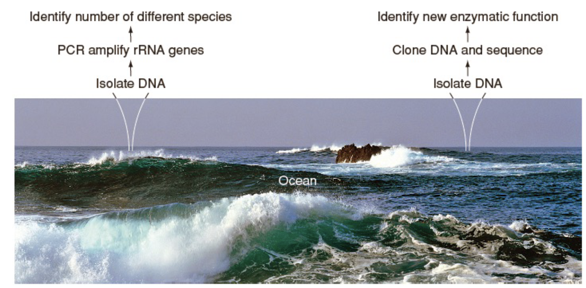

Bacteria sizes and characteristics:
- All bacteria are prokaryotes, which lack a defined nuclear membrane
- All bacteria lack membrane-bounded organelles
- Typical bacterial chromosomes are circular
- Bacterial chromosomes fold to form a nucleoid body that excludes ribosomes
- Most bacteria have a cell wall made of carbohydrate and peptide polymers that surrounds the cell membrane

Basic knowledge of Becteria
- Cells divide by binary fission
- Colony: asexual descendants(无性后代) of a single cell
- Prototroph (原养型, 即野生型): wild-type bacterium that produces colonies on minimal medium (基本培养基)
- Auxotroph (营养缺陷型): mutant that requires one or more nutrients in addition to minimal medium

*E. coli*
- Inhabits intestines of warm-blooded animals
- Can grow in complete absence of oxygen or in air
- Lab strains are not pathogenic, but other strains can cause variety of intestinal diseases
- Prototrophic, can grow in minimal media

Phenotypes of bacterial mutations
- Altered colony morphology
- Resistance to bactericides
- Auxotrophs – unable to reproduce in minimal media(Defective in enzymes required to synthesize complex compounds)
- Defective in using complex chemicals from the environment(breaking down lactose into glucose and galactose)
- Defective in proteins essential for growth(Conditional lethal mutations)

*E.coil* genome wae sequenced in 1997
- 4.6 Mb, ~ 90% of genome encodes protein
- 4288 genes, but function known for only 60%
- 1 gene per kb
- No introns
- very little repetitive DNA
- Small intergenic regions

Gene nomenclature
- "+" WT, "-" mutant
- prototophy/auxotrophy
  - met+: can synthesize methionine, a wild-type prototroph
  - met–: requires methionine, a mutant auxotroph
- Energy extraction
  - gal +: can utilize galactose, wild-type
  - gal –: can not utilize galactose, a mutant
- Drug resistance
  - str r: resistant to streptomycin in medium
  - str s: sensitive to streptomycin in medium

Finding mutations in bacterial genes
- Rapid bacterial multiplication allows detection of very rare genetic events
- Effectively haploid – straight forward relationship between mutation and phenotypic variation
- Selection – establish conditions in which only the desired mutant will grow

Techniques used to identify rare mutants
1. Mutagens(诱变剂) – used to increase the frequency ofmutations
2. Enrichment – increases the proportion of mutant cells. e.g. Penicillin kills only cells that are dividing but not cells that are unable to divide
3. Replica plating – simultaneous transfer of thousands of colonies from one plate to another
4. Testing for visible phenotypes: lacZ
  
> penicillin enrichment for auxotrophic mutants
> 1. The key component of bacterial cell wall is peptidoglycan. It is made of long chains of alternating NAG and NAM sugar molecules
> 2. The transpeptidase enzyme synthesizes short peptides that are attached to NAMs to cross link the NAG/NAM chains
>
> 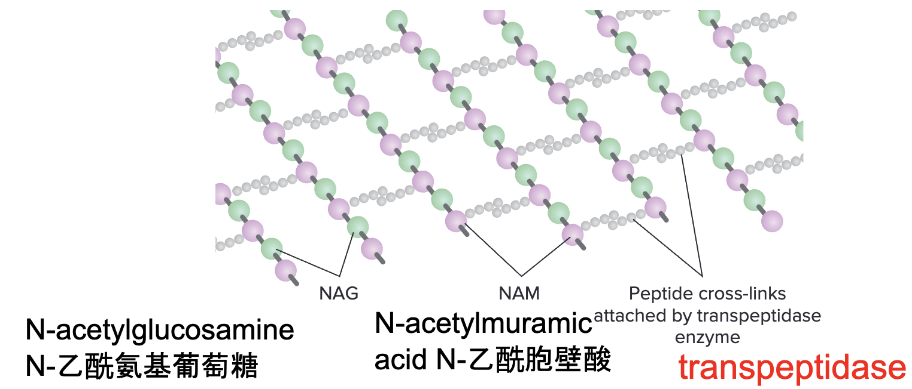
> 3. Penicillin prevents cross-linking by binding transpeptidase and inhibiting its enzymatic activity
> 4. When penicillin is present, the bacteria cannot rebuild their cell walls after cell division, so the cells die.

The typical bacterial genome iscomposed of one circular chromosome
- 4 to 5 Mb of DNA in most commonly studied bacterial species
- DNA molecule condenses by supercoiling and looping
- Each bacterium replicates and then divides by binary fission into two daughter cells

Insertion sequence (IS) elements are transposons in bacterial genomes
- different strains have different numbers and distributions of IS elements
- small transposable elements(700-5000 bp length)
  - Inverted repeats (IRs) at ends
  - Carry transposase gene
  - Can move to other locations in genome
  - Can disrupt genes by insertion into coding regions

Using inverse PCR to identify insertion sites of a transposon in the genome
>
> 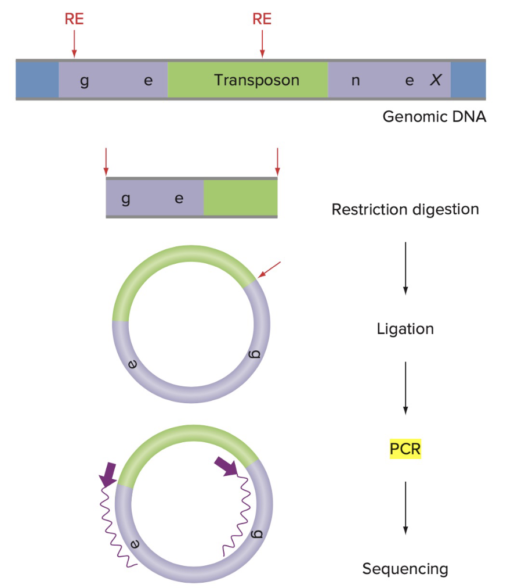
>

Plasmids are smaller circles of DNA that carry genes beneficial to the host cell
- Plasmids vary in size from 1 kb to several Mb in length
- Plasmids don't carry genes that are essential to the host
- plasmid genes that are beneficial to the host
  - Genes that protect host against toxic chemicals (e.g.mercury) and metabolize environmental pollutants (e.g.toluene, napthalene, petroleum products)
  - Pathogenic genes (e.g. toxins produced by S.dysenteriae)
  - Genes encoding resistance to antibiotics
- Some plasmids contain multiple antibiotic resistance genes and transposons
  - Movement of antibiotic resistance genes to the plasmid was facilitated by transposons
  - Multiple antibiotic resistance genes can be transposed from the plasmid as a unit

Genomic analyses in bacteria have created an information explosion
- Metagenomics – analysis of genomic DNA from acommunity or habitat
- Comparative genome analysis – identify similarities and differences between genomes of different species
- Genome studies and public health – aid indevelopment of vaccines, identify new drug targets,identify specific bacterial strains in epidemiological studies

Gene transfer in bacteria:
- vertical gene transfer
- Lateral(or horizontal)gene transfer

Donor bacteriu provides the DNA that is transferred,
recipient bacterium receives the DNA, which can result in altered phenotype

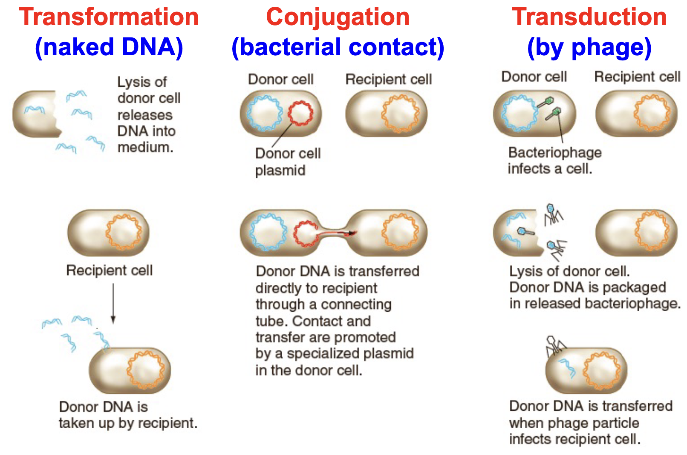

#### transformation

the recipient takes up naked DNA fragments from surrounding environment
- natural transformation
- artificial transformation
  - chemically: Treat cells by suspending in calcium atcold temperatures to make the cells competent
  - electroporation: Mix donor DNA with recipientbacteria and subject to very brief high-voltage shock

Natural transformation in *B.subtilis*

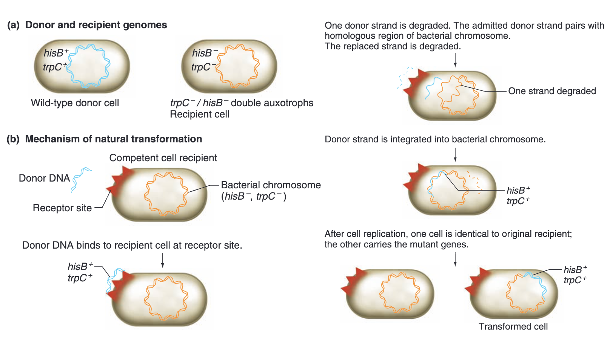

Competence: the growth stage that the bacteria isable to take up DNA from the media.
- Competent cell: Thebacterial cells that are inthe competence stage.
- Competence factor: Enzyme or proteins that promote transformation efficiency.

Co-transformation(在这里指的是一种特定的现象): Genes that are located close toeach other in a bacterial species can be simultaneously transformed into other bacterial cells.
(Genes that are distant from each other have a lower possibility to be transformed into other species at the same time.)

#### Conjugation

Conjugation requires direct cell-to-cell contact

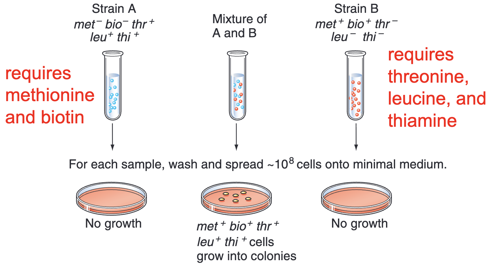

To prove cell contact, we have to exclude the following possibilities:
1. DNA transformation, but not cell contact
2. Syntrophism(类似共生), mutual dependence of different typesof organisms for the satisfaction of their respectivenutritional needs.

U-tube experiment to prove that bacterial conjugation required direct contact between the 2 bacterial strains

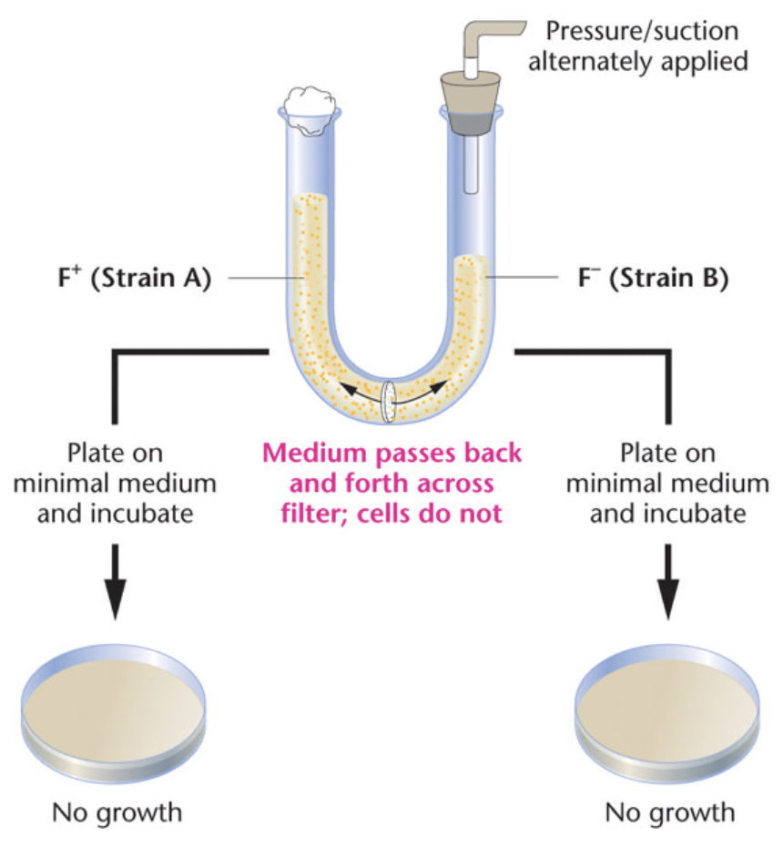

The F plasmid contains genes for synthesizing connections between donor and recipient cells
1. The F factor (F因子, sex factor) is a circular plasmid that may exist free in the cytoplasm or integrated into the chromosome of *E. coli*.
2. F factor contains genes encoding synthesis of pili(菌毛) for cell contact
3. F factor replicates inside host cell

Gene transfer between F+ donors and F−recipients:
1. Mating only between cell with F (F+) and cell without F (F–)
2. Transfer of F factor is one-way from donor to recipient
3. Donors for conjugation are F+ bacteria
4. Recipients for conjugation are F− bacteria

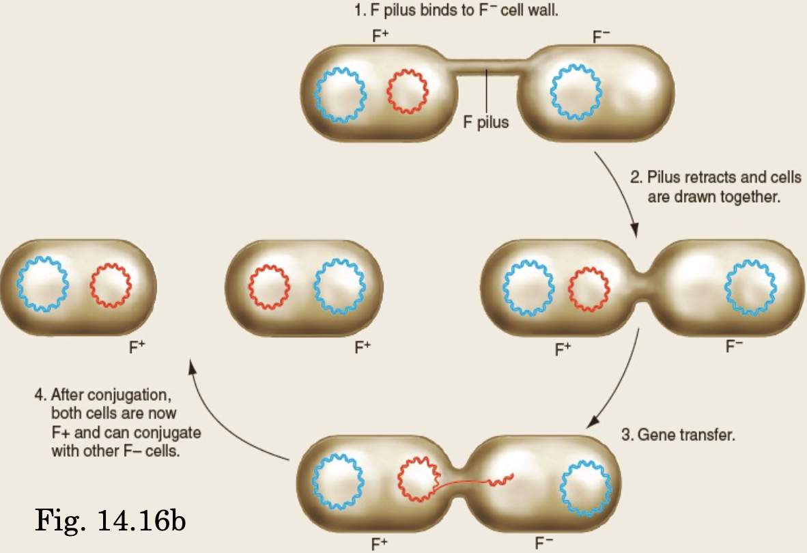

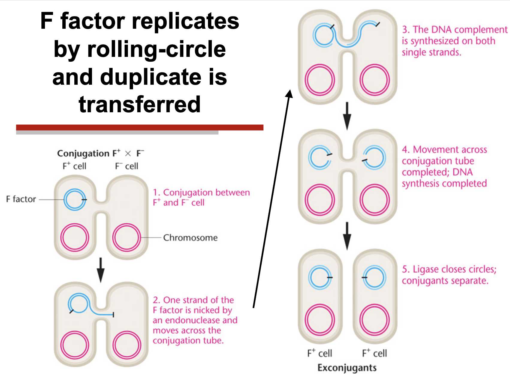

Formation of an Hfr chromosome:
1. F carries one or more IS element , which permit homologous recombination with same IS in genome
2. High frequency recombinant (Hfr) cells are formedwhen an F plasmid integrates into the bacterial chromosome through recombination between IS elements.
> 20–30 different Hfr strainscan be generated that differin the location andorientation of the integratedF plasmids.
> Hfr strains retain all Fplasmid functions and canbe a donor for conjugation with an F− strain.
> - 染色体 DNA（含整合的 F 因子）开始通过滚环复制转移到 F⁻ 细胞, Hfr 可以将部分染色体基因一并转移，而不仅仅是 F 因子本身。
> - 受体 F⁻ 细胞通常 不成为完整 F⁺，因为整条 F 因子不一定完全转移。

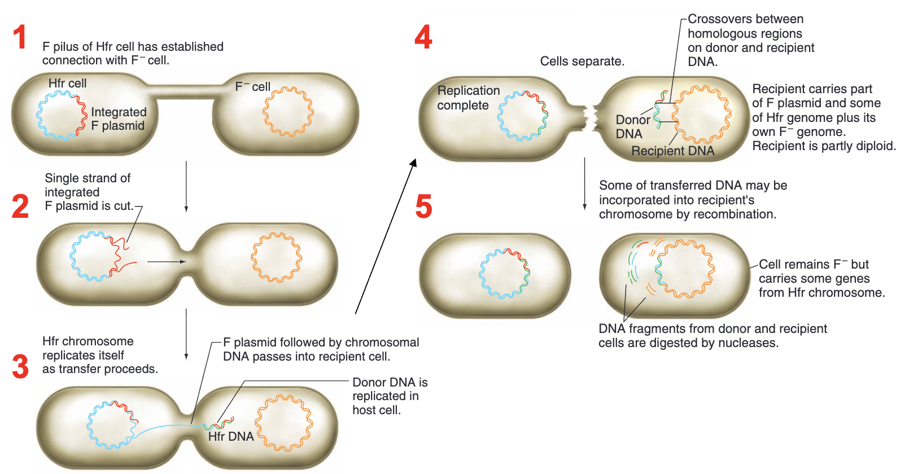

After conjugation, crossovers are needed to integrate genes from the donor fragment into the recipient’s chromosome

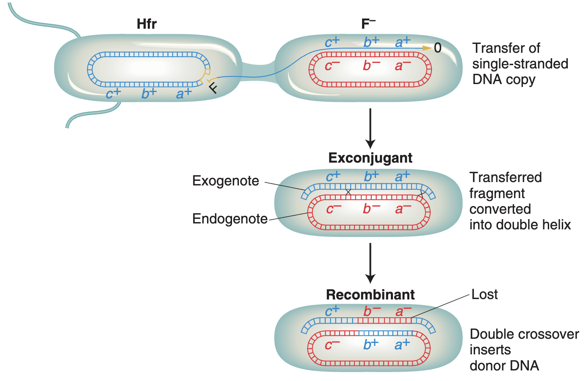
  
Summary: Two types of DNA transferduring conjugation

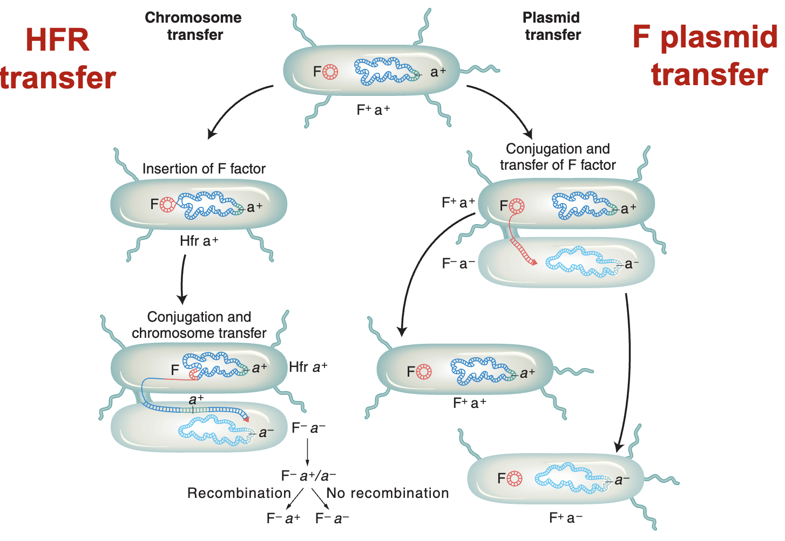

Faulty out-looping produces F’, a F plasmid that contains genomic DNA
- F’ plasmids replicateas discrete circles ofDNA inside host cells.
- Transferred in same manner as F plasmids.
- A few chromosomal genes will always be transferred as part of the F’ plasmid.

complementation studies using F plasmid

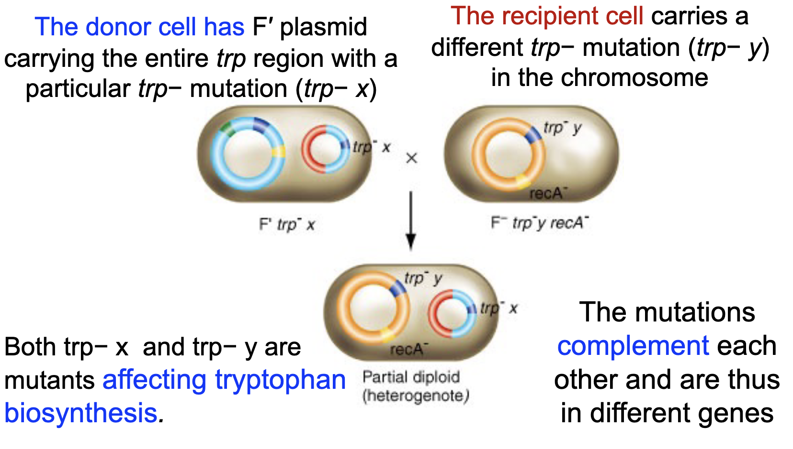

#### transduction

a phage transfers DNA from a donor bacterium to a recipient bacterium

Structure and life cycle of bacteriophageT2 (virulent)

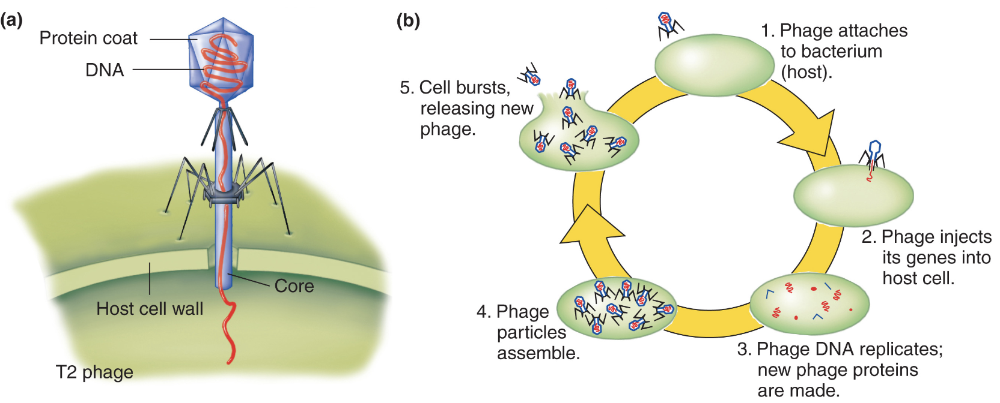

T2噬菌体
- Lytic and lysogenic modes of reproduction
  - Lytic cycle: produce viral proteins,cell burst
  - Lysogenic cycle: phage DNAinserted into bacterial chromosome, do not produce theviral proteins needed for morevirus particles
- virulent and temperate phages (page 75)
  - Virulent phages – always enter lytic cycle after infecting bacterial cells, multiply rapidly, and killcells
  - Temperate phages – can enter either lytic cycle orenter an alternative lysogenic cycle

The lytic cycle of phage multiplication: cell lysis and release of progeny phage
1. Phage injects its DNA into bacteria.
2. Phage proteins are expressed and take over protein synthesis and DNA replication machinery of infected cell.
3. Phage DNA replication.
4. Phage particles are assembled with phage DNA and phage protein.
5. Infected cell bursts (lyses) and releases 100-200 new viral particles able to infect other cells.
  
Lysate – the population of phage particles released from host bacteria at the end of the lytic cycle

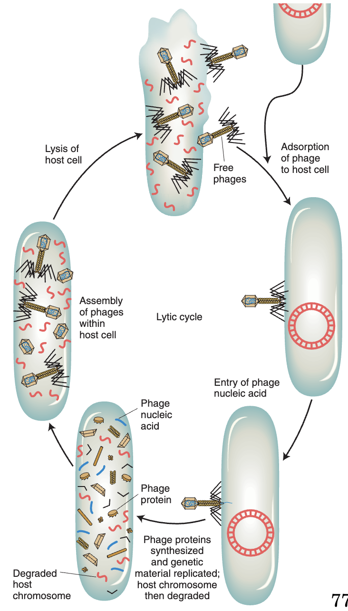

Generalized transduction:(page79)
1. Incorporation of random fragments of bacterial DNAfrom donor into phage particles.
2. DNA from donor cell injected into infected recipient cells via phage infection.
3. Transduced chromosomal DNA recombines into homologous DNA in recipient.

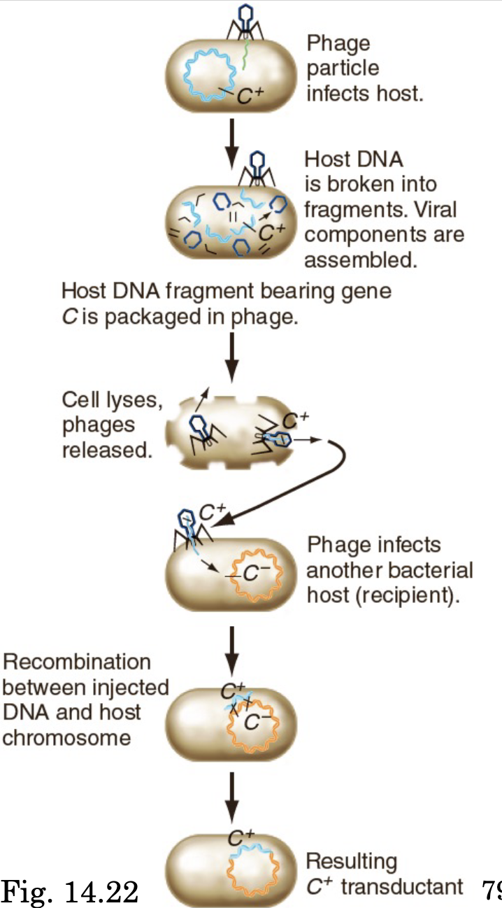

> mapping genes by co-transduction frequencies
> - Frequency of co-transduction is higher for genes thatare close together compared to genes that are further apart.
>
> 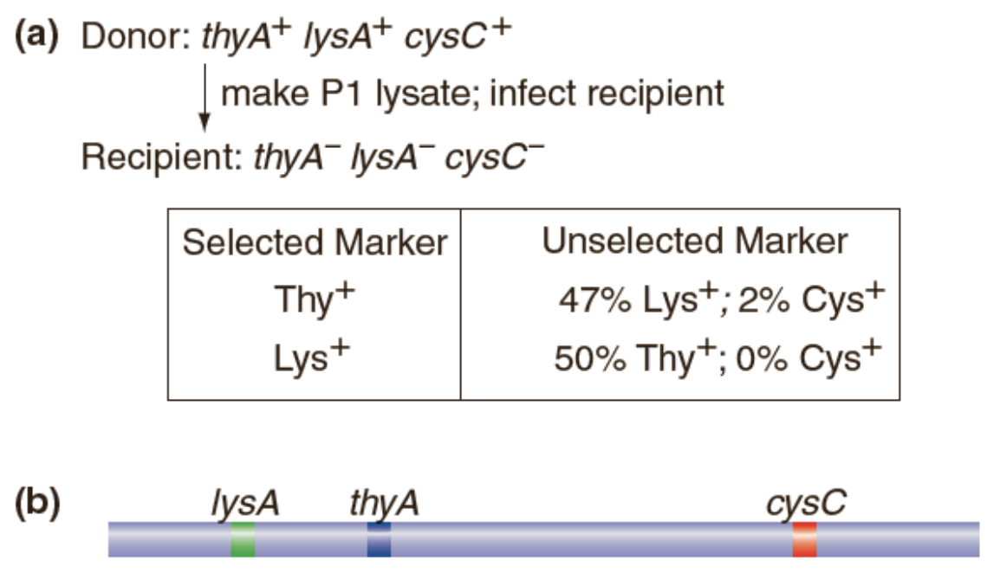
> 

Temperate phages: Choice of lytic or lysogenic cycle depends on many factors, including environmental conditions
- Lysogen（溶源菌）: 寄宿有整合型噬菌体（temperate phage）的细菌, 噬菌体 DNA 已整合到宿主染色体, 细菌不会被裂解，正常生长, 可以在未来某些条件下诱导噬菌体进入裂解循环
- Prophage（前噬菌体）: 已经整合进宿主染色体的 噬菌体 DNA 本身。

Phage lambda (λ) is the most commonly usedtemperate phage

integration of the phage DNA initiates the lysogenic cycle
- Recombination between att sites on phage λ and the bacterial chromosome allows integration of the prophage
- Phage lambda canintegrate into bacterial chromosome by integratase.
  
  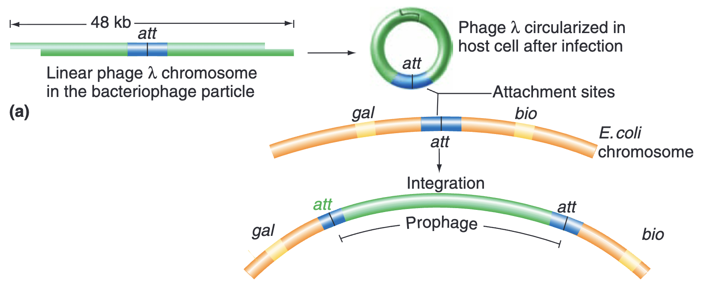

  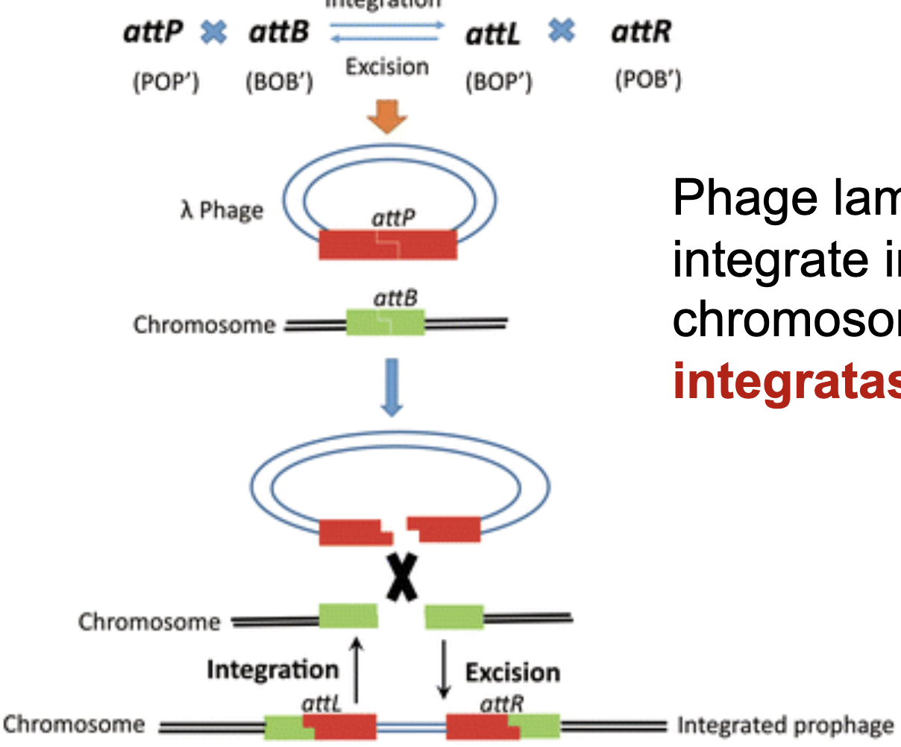

Specializaed transduction: abnormal excision of prophage from a lysogen
1. abnormal excision produces a specialized transducing phage
2. Bacterial DNA adjacent to integration site can bepackaged with viral DNA and then transferred to a recipient cell

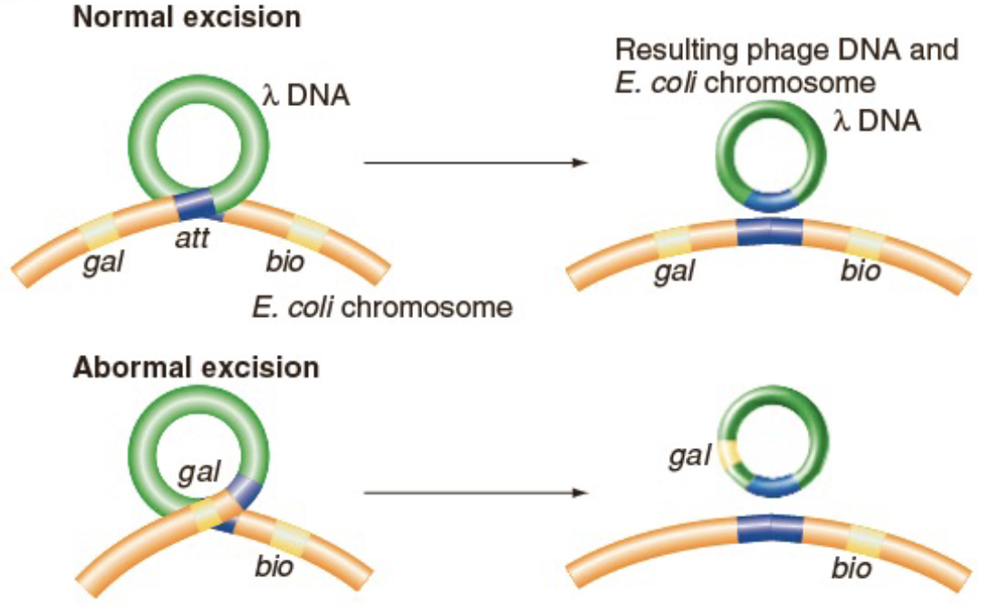

Comparison of generalized and specialized transduction
- when donor DNA is packaged by phage
- what donor DNA is packaged by phage

Genomic islands originated from transfer of foreign DNA(page91)
- Genomic islands carry many different types of genesthat are involved in newly derived functions.
- G+C content is different from the rest of the genome
- Presence of direct repeats at each end
- Found at sites where tRNAs genes are located because tRNAs are highly conserved and promote homologous recombination
- Contain integrase genes and sites for integration
> genomic islands每一种都可以造成

pathogenicity islands contain many genes involved in causing disease
- Pathogenic genes are often clustered in a subtypeof genomic islands, called pathogenicity islands.
- With such an arrangement, the lateral transfer of a“package” of genes from one species to anothercan turn a nonpathogenic strain into a pathogenicstrain.
- Pathogenicity islands including genes for adhesion to eukaryotic (host) cells, toxins, and secretion systems that allow the bacteria to transport substances into eukaryotic cells that disrupt the cells.

> E. coli strain O157:H7 – causes diarrhea (腹泻) ormeningitis (脑膜炎)
> - The DNA sequence shows that this toxin gene wastransferred into E. coli by bacteriophage transductionand became part of the large pathogenicity island

#### gene expression and function

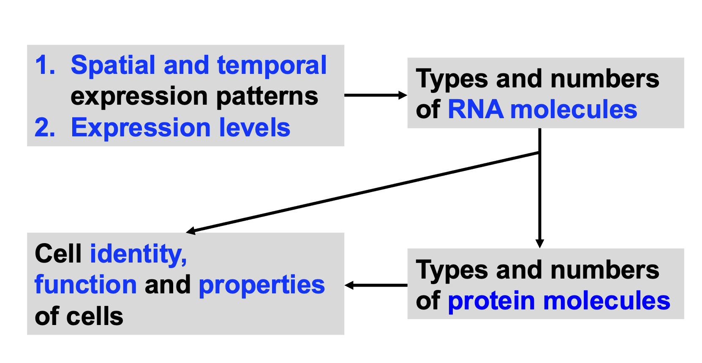

Gene regulation occurs in any stage of gene transcription and translation
1. transcription
2. RNA processing and mature
3. regulation of RNA stability
4. translation
5. modification on the protein sequence

Expression of genes is affected by many factors
1. Regulation of gene expression includes changes in activating, increasing, diminishing,and preventing the transcription and translation of genes.
2. In prokaryotes, nutritional conditions and environmental factors are important factors to regulate gene expression.
3. In eukaryotes, hormones, developmental stagesand tissue specificity are important factors to regulate gene expression.

An overview of bacterial gene expression(page6 figure)
- The transcription is dissected into three steps,initiation, elongation and termination.

**initiation: core RNA polymerase plus sigma (σ) factor**

Core RNA polymerase and σ factor form aholoenzyme to initiate transcription:

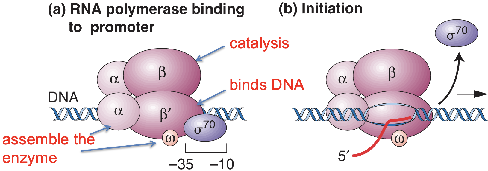

1. Core RNA polymerase has five subunits: two alpha(α), one beta (β), one beta prime (β'), and ω.
2. Sigma factor recognize the DNA sequence at the promoter region.
3. DNA is unwound and polymerization begins.
4. The initiation of transcription is completed when sigma factor is released.

sigma factor recognized conserved DNA motifs (-35->-10) in promoter regions
- Usually the 7bp at the -35 region and the 6 bp at the -10 regions are recognition sites for σ factors.

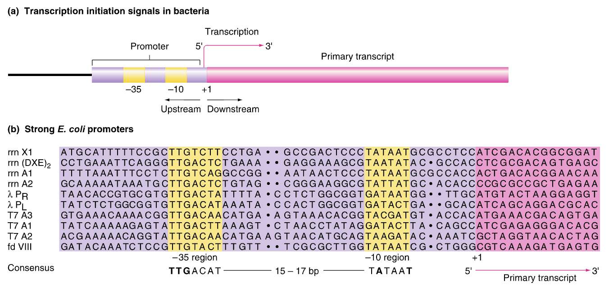

**elongation: core RNA polymerase without sigma factor**

Continues until RNA polymerase recognizestermination signal

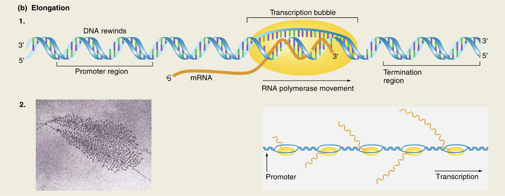

**termination:**
- when Rho protein recognized a sequence of mRNA and pull mRNA away from RNA polymerase
- Rho independent: a stem-loop forms in mRNA and cause the release of mRNA and RNA polymerase

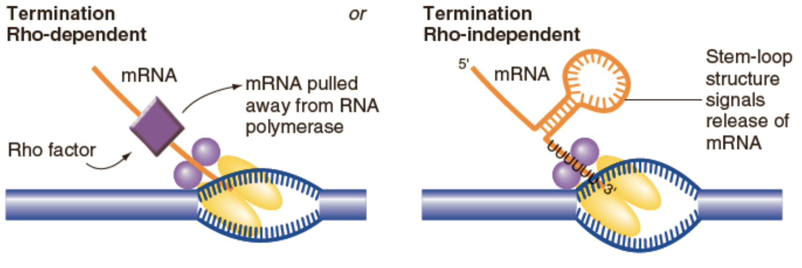

Regulation of expression can occur at many steps
- Transcriptional control:
  - Binding of RNA polymerase to promoter. This is the most critical step in regulation of most prokaryoticgenes
  - Shift from initiation to elongation
  - Release of mRNA at termination
- Posttranscriptional control
  - Stability of mRNA
  - Efficiency of translation initiation
  - Stability of polypeptide

#### Operon theory: pne signal can simultaneously regulate expression of several clustered genes

Utilization of lactose by E. coli provides a model system of gene regulation
  - **permease** transports lactose into cell
  - **β-Galactosidase** (β-Gal) converts lactose into glucose and galactose
  
  | 基因 | 功能 |
  |---|---|
  | lacZ | 编码 β-galactosidase，分解乳糖 |
  | lacY | 编码 lactose permease，帮助乳糖进入细胞 |
  | lacA | 编码 transacetylase |

Without lactose, both permease and β-gal are presentat very low levels in the cell
- Induction – stimulationof synthesis of a specific protein
- Inducer – moleculeresponsible for induction

> Hypothesized that lac genes are transcribed together as a single mRNA (polycistron) froma single promoter

The lactose operon in E. coli
- promotor: DNA sequences to which RNA polymerase binds
- operator: DNA sequences controls transcription initiation(cis,有点像enhancer)
- Repressor – binds to the operator (encoded by lacI gene)
  - lacI binds to the operator andprevents transcription.
  
  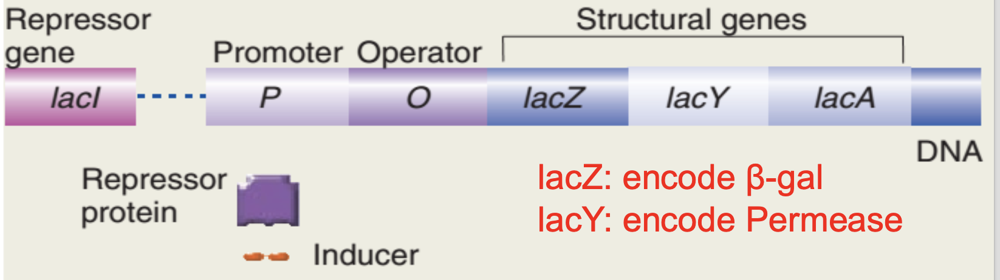

  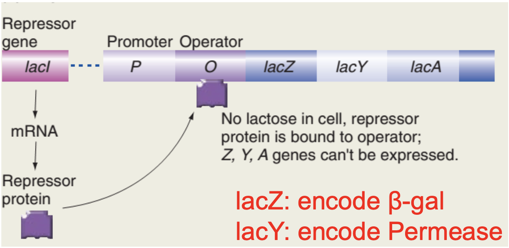

- Inducer – prevents repressor from binding to operator, in this model lactose is the inducer

Induction ofthe lac operonin E. coli
- when lactose is present:
  - lactose binds to the lacI protein
  - lacI protein changes shape and cannot bind to operator.
  - RNA polymerase binds to the promoter because promoter regions is accessible.
  - Transcription of the lac genes is initiated.

complementation analysis identified three genes in a tightly linked cluster & Continuous expression of β-gal and permease was caused by mutations in the lacI gene

> a experiment provided evidence that lacI encodes a repressor
> 1. lacI+ lacZ+ DNA transferred into lacI− lacZ− cells
> 2. β-gal levels increased initially
> 3. β-gal levels decreased as repressor accumulated
> 4. β-gal accumulation resumed after addition of lactose

lacl− mutant that cannot bind to operator
lacls mutants have a super-repressor that binds to operator but cannot bind to the inducer: 可以正常结合 operator, 不能与乳糖/inducer 结合 -> 不会从 operator 脱落

lacI has two separate domains
1. N-terminal DNA-binding domain, which binds opera-tor sequence
  - The DNA binding domain of lacI has a helix-turn-helix (HTH) motif to recognize DNA sequences
  - A protein with an HTH motif has two α-helical regions separated by a turn in the protein
  - One of the α-helices recognizes a specific DNA sequence
2. Inducer-binding domain, which binds allolactose, an derivative of lactose
3. A linker that connects the DNA-binding domain with the core domain, which is important for allosteric communication
4. Mutated sequences in many different lacI−mutants clustered in the DNA-binding domain, cause continuous expression
5. Mutated sequences in many different lacIS mutants clustered in the inducer-binding domain, cause super-repression
   
lac repressor tetramer binds to two operators
1. lacI is a tetramer, with each subunit containing a DNA-binding HTH motif.
2. lac operon has three operators (O1, O2, and O3)each of which contains two recognition sequences for lac repressor. O1 has the strongest binding affinity for lacI.
3. Two repressor subunits bind toO1 and two repressor subunitsbind to either O2 or O3.
4. This binding pattern allows tetrameric lacI to induce DNA looping.
  
  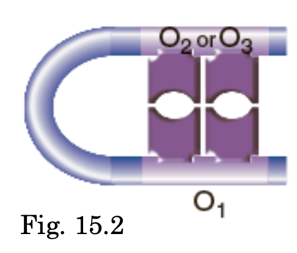

  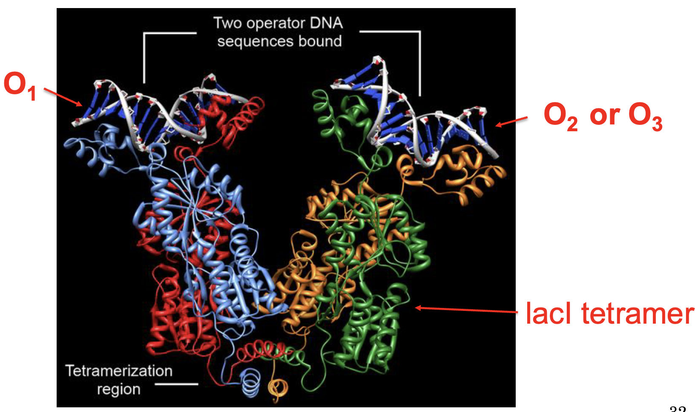

Allosteric protein: undergoes reversible changes in conformation when bound to another molecule
- Binding of inducer (effector) to activator or repressor changes the shape of the activator or repressor.
  
  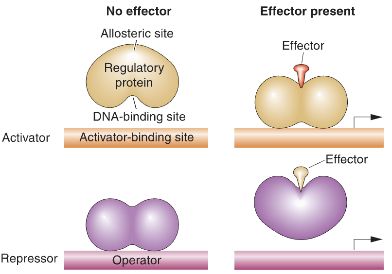

Each operator of lac operon have two DNA sequence motifs

  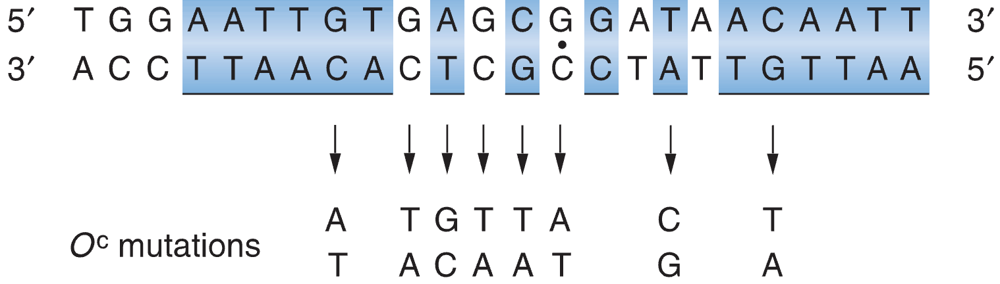

lacOc mutants have a mutant operator that cannot bind the repressor
- In lacOc mutants, lac genes are expressed in the absence and the presence of inducer (continous expression)

> DNase footprint detects the binding of lacI and operator DNA
> - Incubate radio labeled DNA from lac+ operonwith partially purified protein from lacI+ cells
> - Partial digest of DNA with DNase I
> - If protein is bound to DNA, then specific fragments will be protected from DNase digestion
>
> 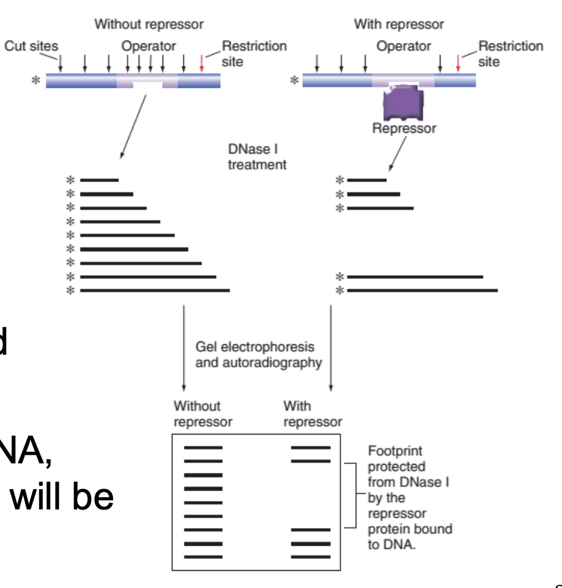
>

Proteins act in trans, DNA sites act in cis
（F’ lac plasmids were used to generate partial diploids）
- Trans-acting factor: lacI
  - Can diffuse through the cytoplasm and act at target DNA sites on any DNA molecule in the cell
  - lacI expressed from the plasmid can diffuse through the cytoplasm and bind to the operator on the chromosome.
- Cis-acting elements: lacO
  - Can only influence expression of adjacent genes on the same DNA molecule
  - The lacOC mutation affects expression of genes only on the DNA that it is located on.
  
  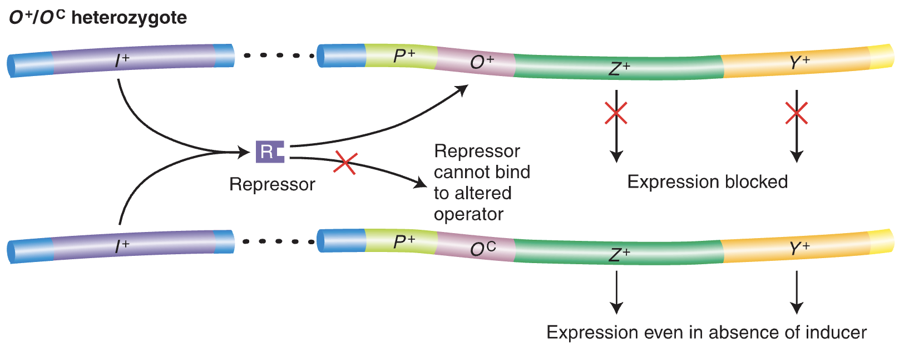

The lac operon of E.coli is regulated by both lactose and glucose
- When both glucose and lactose are present,only glucose is utilized
- Lactose induces lac mRNA expression, but only in the absence of glucose
- lac mRNA expression cannot be induced if glucose is present
  - Glucose decreases the levels of cAMP
  - cAMP binds to cAMP receptor protein (CRP)
  - CRP-cAMP is a positive regulator of lactranscription

  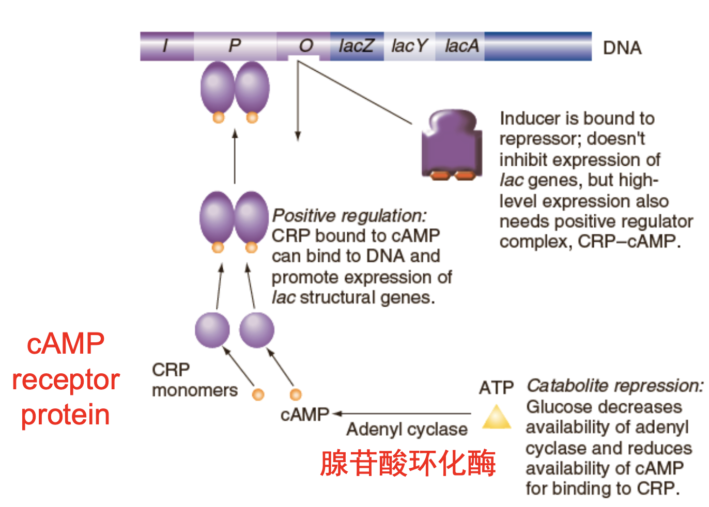

Positive regulation of lac operon by CRP-cAMP, glucose negatively regulate cAMP
- CRP-cAMP binds as a dimer toa regulatory region
- CRP-binding site consists of two recognition sequences, one for each subunit of the CRP dimer
  
  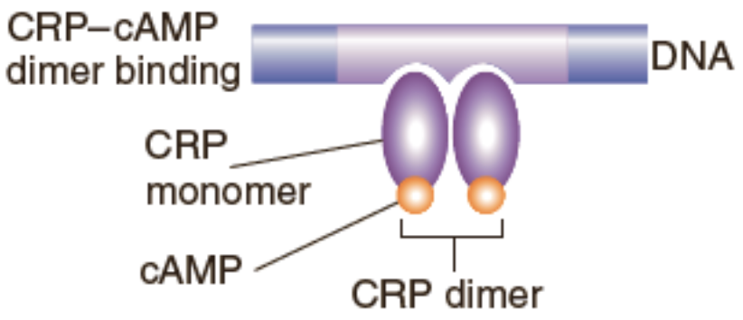

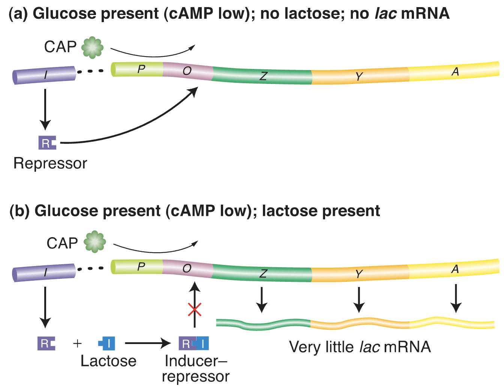

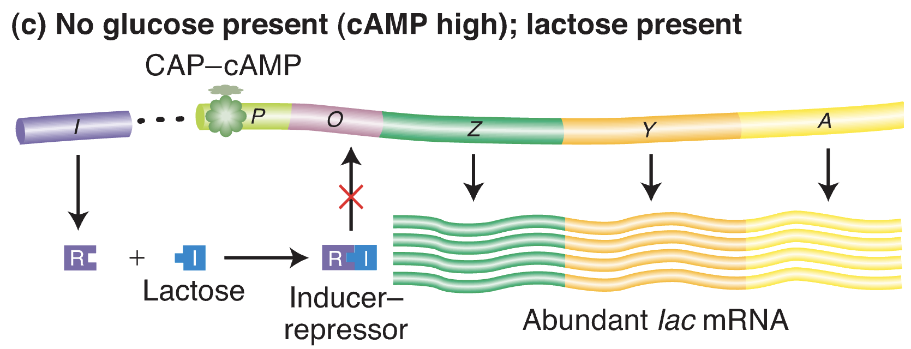

- Without interaction with CRP-cAMP, RNA polymerase can bind to the promoter but is less likely to unwind DNA and initiate transcription

overlapping binding sites for RNA polymerase and lacI
- When lac repressor is bound to lac operator, functional binding of RNA polymerase to the promoter is blocked

model:
- Lac− mutants can be maintained on media with glucose and so lac genes are not essential for survival(研究 lac operon 的调控不会影响细菌存活)
- Simple assays for lac expression - use of ONPG or X-gal as substrates for β-gal (color change)
- 可以作为Reporter gene： protein-encoding gene whose expression in the cell is quantifiable by sensitive and reliable techniques
- Fuse the lac regulatory sequences to the coding regionof a foreign gene, Inducible expression of the foreign gene controlled by IPTG
- 可以Using lacZ to identify sets of genes regulated by the same stimulus
  
  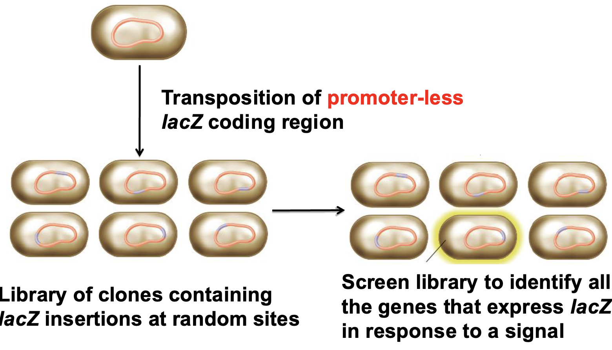

> Expression of human growth hormone in E. colicontrolled by lac control region
>
> 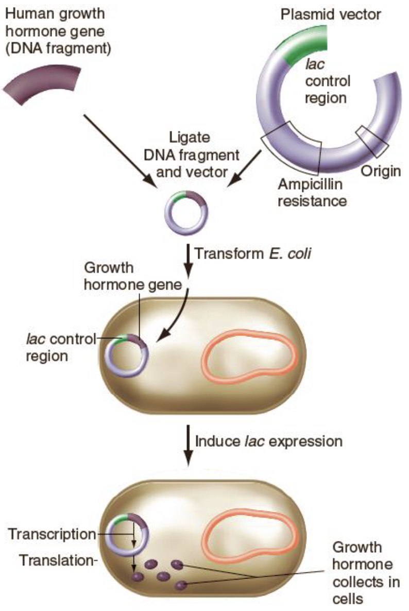
> 

Dual positive and negative regulation of the araBAD operon by AraC: Arabinose genes are in an operon and are induced when arabinose is present.
- Three structural genes required in the breakdown of the sugar arabinose – araB, araA, and araD.
- AraC is a either a positive or negative regulator of the araBAD operon.
  - AraC can bind to three DNA sequences sites(araO, araI1, and araI2) with different affinities
    - No arabinose present: When AraC is bound to araO and to araI1, looping of DNA occurs and prevents transcription

    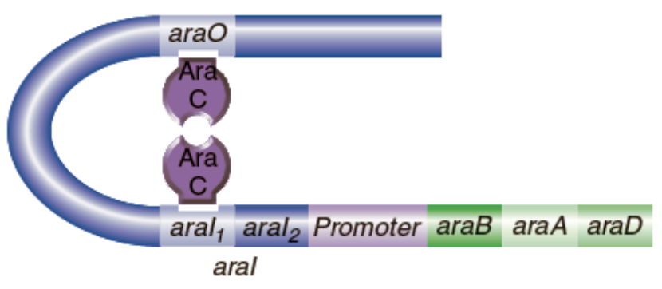

    - Arabinose present: Arabinose causes allosteric change in AraC so that it cannot bind to araO; AraC interacts with RNA polymerase only when botha raI1 and araI2 are occupied
  
    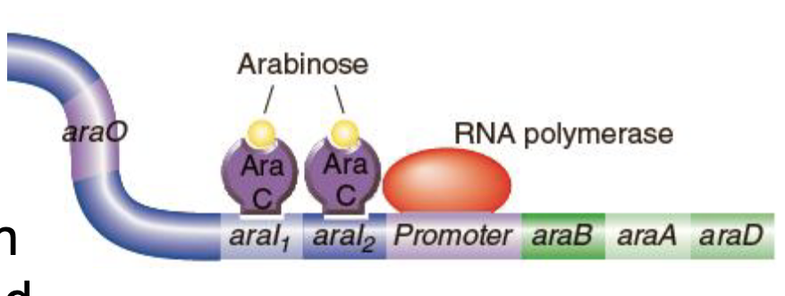

Regulation of the typtophan operon in E.coli: act as a co-repressor
1. Tryptophan operon has five structural genes:trpA, B, C, D and E
2. Structural genes for tryptophan (Trp) biosynthesis are expressed only in the absence of Trp
3. TrpR is the repressor
   
  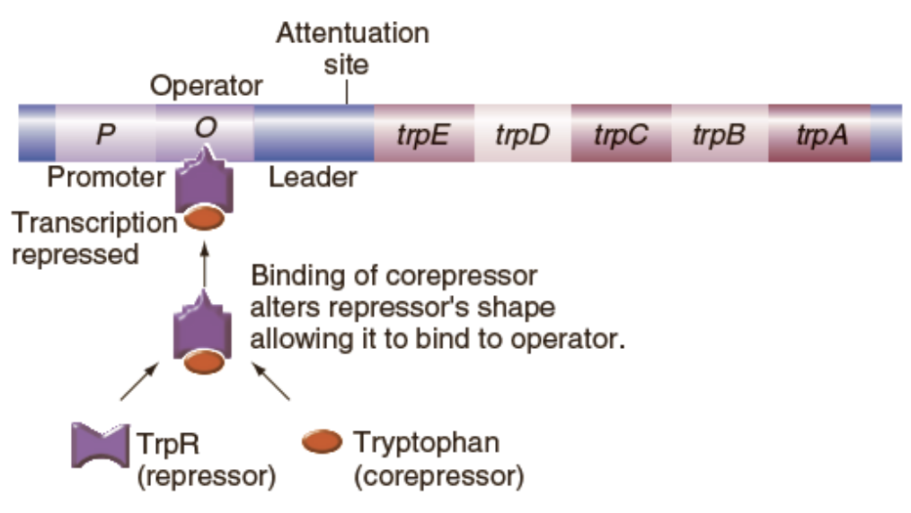

Tryptophan acts as a co-repressor
- TrpR gene encodes the trp repressor that can bind to the Trp operator (TrpO)
- When Trp is present, binding of tryptophan to TrpR repressor allows TrpR to bind to TrpO and inhibit transcription of the five structural genes
- When Trp is absent, TrpR repressor cannot bind to TrpO

> TrpR repressor is not the only regulator of the trp operon
> 1. Continuous expression of tryptophan biosynthesis doesn't occur in TrpR− mutant
> 2. Second regulatory mechanism is attenuation: control of gene expression by premature termination of transcription
> Attenuation controls termination of transcription in thetrp leader (TrpL)
> - Truncated mRNA - terminates in TrpL, only 140 bases
> - Full-length mRNA - continues through TrpL and encodes all five structural genes
>
> 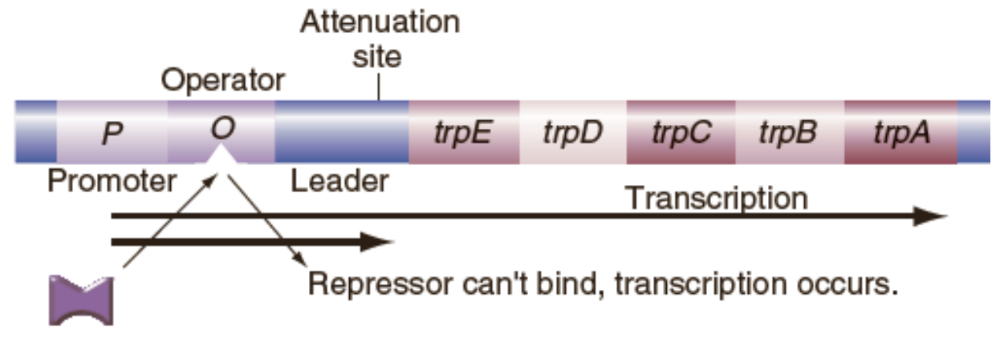
>
> - Different regions of trpL have complementary base-pairing
> - Formation of the 1-2 stem-loop allows formation of the 3-4 stem-loop
> - Formation of the 2-3 stem-loop prevents formation of the 3-4 stem-loop
> - The 3-4 stem loop is a transcription terminator
> When Trp is present, tRNATrp is available and rapid ribosome movement allows the formation of 3-4 stem-loop
> When tryptophan isn’t present,transcription doesn't terminate in trpL

# Chapter 7 Genetic Analysisin Prokaryotes

compared to prokaryotes, eukaryotes are much more complex in regulating gene expression
1. Eukaryotic genomes are larger than prokaryoticgenomes
2. Chromatin structure in eukaryotes makes DNA unavailable to transcription machinery
3. Additional RNA processing events occur in eukaryotes
4. In eukaryotes, transcription takes place in the nucleus，and translation takes place in the cytoplasm

Differences betweem prokaryotes and eukaryotes in gene expression
- In prokaryotes: No nucleus; No introns; No histone, DNA is naked.
- Prokaryotes: Primary transcripts are the actual mRNAs; they have a triphosphate start at the 5’ end and no tail at the 3’ end.
- Prokaryotes: Unique initiator tRNAcarries formylmethionine. mRNAs have multiple ribosome binding sites and can thus direct the synthesis of several different polypeptides. Small ribosomal subunit immediately binds to the mRNA’s ribosome binding site.
- In eukaryotes: Nucleus separated from cytoplasm by a nuclearmembrane. Transcription takes place in the nucleus,while translation occurs in the cytoplasm. Genes have introns. Histones bound DNA to form nucleosome.
- Eukaryotes: Primary transcripts undergo processing to produce mature mRNAs that have a methylated cap at the 5’ end and apoly-A tail at the 3’ end.
- Eukaryotes: Initiator tRNA carries methionine. mRNAs have only one start site and can thus direct the synthesis of only one kind of polypeptide. Small ribosomal subunit binds first to the methylated cap at the 5’ end of the mature mRNA and then scans the mRNA from the 5’to 3’ end to find the translational start site.

Three types of RNA polymerases for eukaryotic nuclear gene transcription
- RNA pol I – transcribes rRNA genes
- RNA pol II – transcribes all protein-coding genes(mRNAs) and micro-RNAs
- RNA pol III – transcribes tRNA genes and some small regulatory RNAs

- prokaryotes: not protected will
- Eukaryotes: methylated
> 5‘ capping of eukaryotic mRNAs prevent degradation and promote translation
> backward guanine: capping 过程叫 backward guanine，是因为加到 mRNA 5′ 端的那个鸟嘌呤核苷酸并不是像普通 RNA 延伸那样按正常方向连接，而是“反着”接上去的。普通 RNA 中相邻核苷酸通常通过 3′–5′ phosphodiester bond 连接，也就是前一个核苷酸的 3′-OH 连到下一个核苷酸的 5′ 磷酸；但在 mRNA capping 中，一个 GMP 会通过自己的 5′ 磷酸连接到 mRNA 第一个核苷酸的 5′ 磷酸上，形成特殊的 5′–5′ triphosphate linkage。因此这个 G 的连接方向和普通 RNA 链中的核苷酸方向相反，就像一个“倒着接上去的 guanine”，所以被称为 backward guanine。
>
> 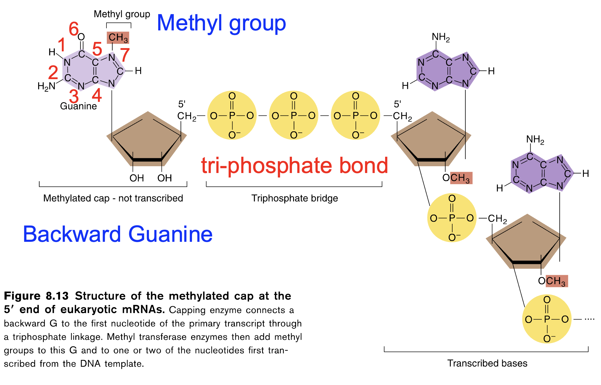
> 
> Poly-adenylation at the 3’ end of eukaryotic mRNAs prevent degradation and promote translation
> 1. a ribonuclease recognizes AAUAAA and cleaves the transcript 11-30 nucleotides downstream to creat a new 3' end.
> 2. poly-A polymerasethen adds 100–200A’s onto this new 3’end.
>
> 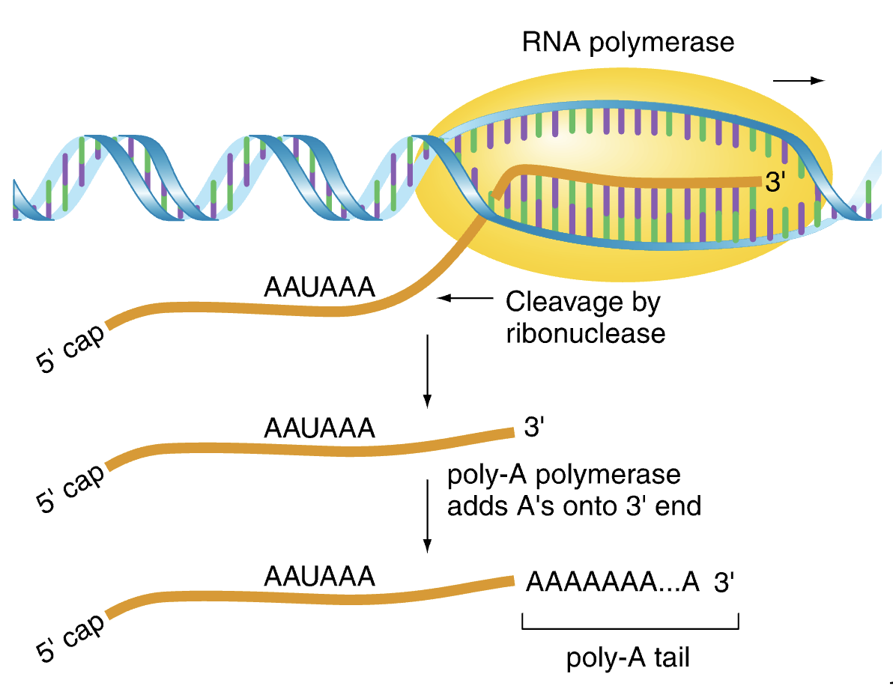
>

Eukaryotic mRNAs form a pseufocircular molecule during translation
- elF4E: recognize the cap
- PABP / poly(A)-binding protein: mRNA 3′ 端的 poly(A) tail
- elF4G: bridge -> pseudocircular

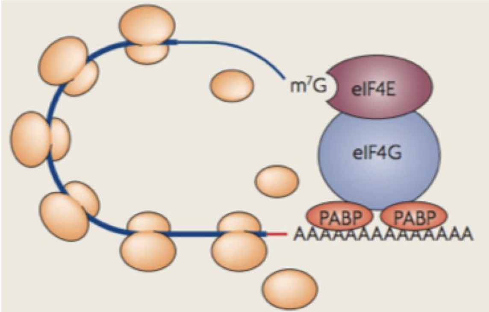

Overview of eukaryotic gene regulation: 

**Eukaryotes use complex interactions**
1. Regulated interactions of large networks of genes
2. Each gene has multiple points of regulation
**Themes of gene regulation in eukaryotes**
1. Environmental adaptation in unicellular eukaryotes
2. Homeostasis is the process by which biological systems maintain a stable internal environment despite changes in external conditions.
3. Maintenance of homeostasis in multicellular eukaryotes
4. Genes are turned on or off in the right place and time
5. Differentiation and precise positioning of tissues and organs during embryonic development

RNA poll II
- Most RNA pol II transcripts undergo further processing to generate mature mRNA
  - RNA splicing – removes introns
  - Addition of 5' GTP cap – protects RNA from degradation
  - Cleavage of 3' end and addition of 3’ polyA tail

cis-acting elements(调控的作用对象是 同一条 DNA 上的基因): promoters and enhancers(page16)
- promoters: usually directly adjacent to the gene, bind basal transcription factors; often have TATA box; allow basal level of transcription
  - TATA box consists of roughly seven nucleotides ofthe sequence T–A–T–A–(A or T)–A–(A or T)
  - TATA box attracts RNA polymerase, and allows alow, basal level of transcription.
  - TATA box is located 31 to 26 nucleotides upstream the transcription start site
  - ~24% of human genes contain a TATA box within the core promoter
- Enhancers: can be far away from gene, bind activatorsor repressors, and activate or repress the basal level of transcription(operator is kind of enhancers)

trans-acting factors interact with cis-acting elements to control transcription initiation
- Direct effects of transcription factors: through binding toDNA
- Indirect effect of transcription factors: through protein-protein interactions

Basal factors bind to promoters of all protein-encoding genes:
1. TBP binds to TATA box
2. TAFs (TBP associatedfactors) bind to TBP
3. RNA pol II binds to TAFs
4. RNA pol II associates with basal complex and initiates basal level of transcription
  
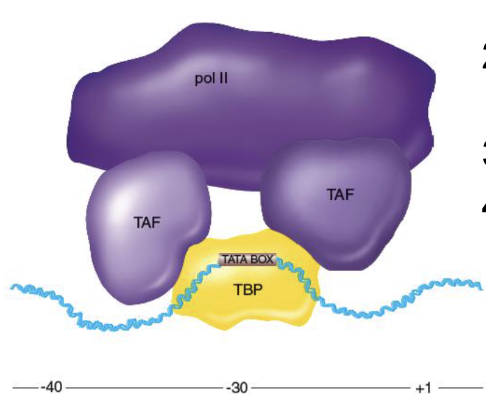

binding of activators to enhancers increases transcriptional levels: Low level transcription occurs when only basal factors are bound to promoter
> transcription genome: 2000~
- When basal factors and activators are bound to DNA, rate of transcription increases
- Activators increase levels of transcription by interacting directly or indirectly with basal factors at the promoter

Mechanisms of activator effects on transcription
1. stimulate recruitment of basal factors and RNA poll II to promoters
2. stimulate activity of basal factors already assembled on promoter
3. facilitate caanges in chromatin structure

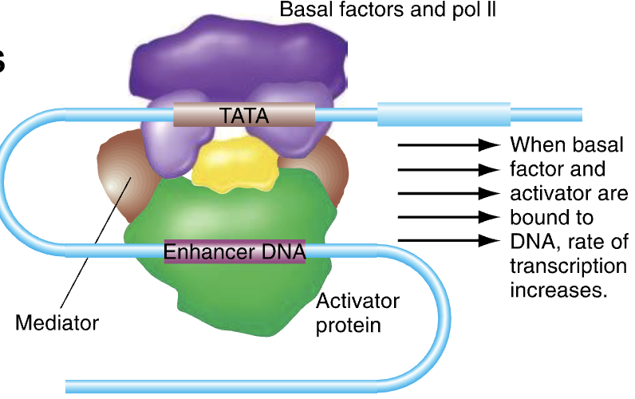

Functional Domains within activators: 
1. A DNA-binding domain (DBD): Binds to enhancer
   1. Interacts with major groove of DNA
   2. Specific amino acids have high-affinity binding to specific nucleotide sequence
   3. The three best-characterized motifs:
      1. Helix-loop-helix (HLH)
      2. Helix-turn-helix (HTH)
      3. Zinc finger
   
  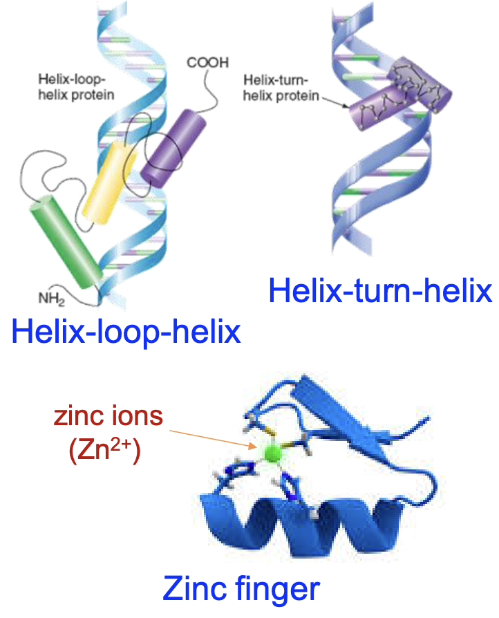

2. A transactivation domain (TAD): Interacts with other transcriptional regulatory proteins
3. Signal-sensing domain (SSD): senses external signals and transmits these signals to the rest of the transcription complex. Not present for all activators
  
  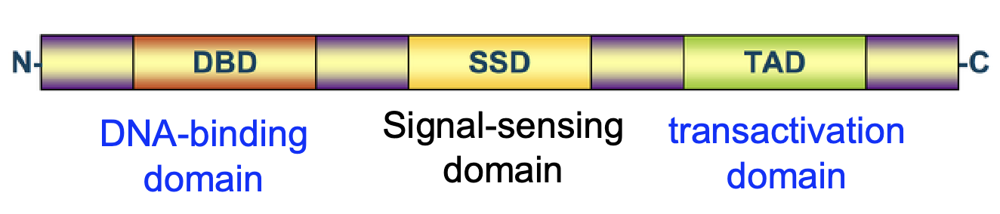
  
steroid hormone receptors are activators only in the presence of specific hormones:
- Steroid hormones don’t bind to DNA but are **coactivators** of steroid hormone receptors
- In the absence of hormone, these receptors cannot bind to DNA and so cannot activate transcription
- In the presence of hormone, these receptors bind to enhancers for specific genes and activate their expression
- Allosteric protein

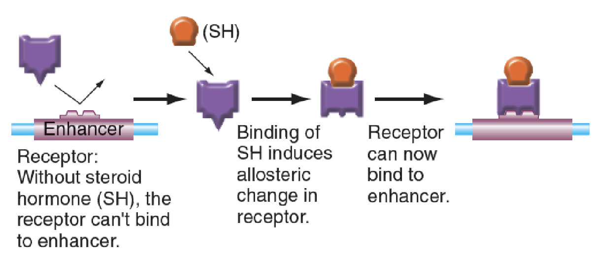

repressor proteins suppress transcription initiation through different machanisms

**Suppress the action of activators**
1. Compete with activator for the same enhancer
2. Block access of activator to an enhancer
**Eliminate virtually all basal transcription from a promoter**
1. Block RNA pol II access to promoter
2. Bind to sequences close to promoter or distant from promoter

Repressor proteins suppress the actionof activators
1. competition: repressor binds to the same enhancer sequence as the activator(page28)
2. quenching(淬灭): bind to the activator but do not bind to DNAs
   1. blocks the DBD
   2. blocks the activation domain
3. cytoplasmic sequestration(隔离): an actiator can be sequesteres in the cytoplasm when bound to an indirect repressor.
4. heterodimerization(异源二聚): formation of nonfunctional indirect repressor/activator heterodimers can prevent the formation of functional activator homodimers.

Repressor proteins bind enhancers andrecruit corepressors to block transcription

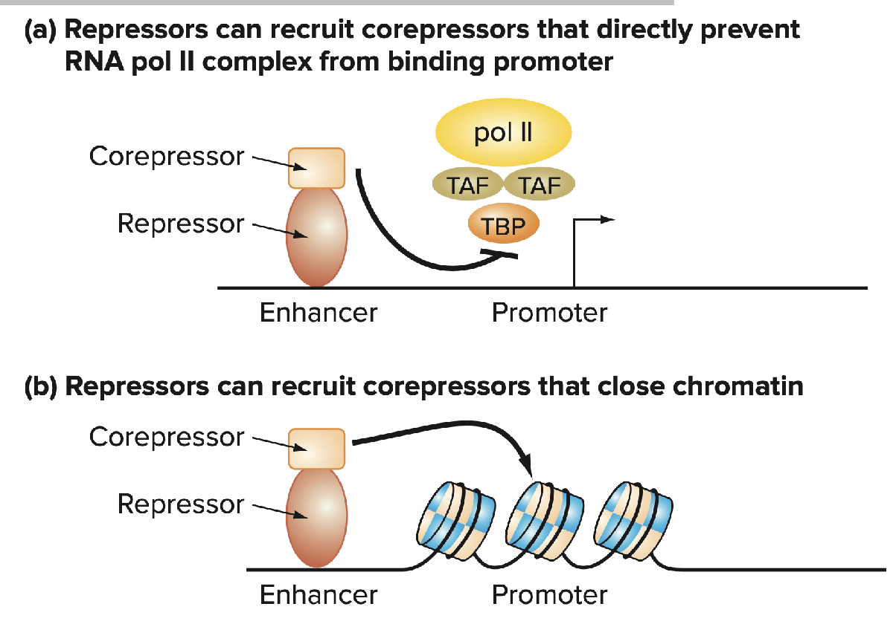

The Myc-Max mechanism can activate or repress transcription
- The Myc, Max, and Mad proteins are part of a network of transcription factors that play crucial roles inregulating cell growth, differentiation, and apoptosis.
- c-Myc primarily regulates proliferation in many tissues, N-Myc is critical for neural and embryonic development, and L-Myc has more restricted roles in lung and hematopoietic tissues.
- Overexpression or dysregulation of Myc is implicated in many cancers
- Max is a transcription factor that forms heterodimer swith either Myc or Mad protein.
  
Comparative structures of Myc and Max
- Myc/Myc homodimers cannot form
- Max/Max and Mad/Mad have low DNA binding affinity
- Myc/Max and Mad/Max bind the same enhancer sequence with similar binding affinities
- Myc/Max activates transcription while Mad/Max represses transcription
- Max is expressed in all cells atall times
- Mad is expressed in resting cells
- Myc is not expressed in resting cells but starts to be expressed when cells are about to divide

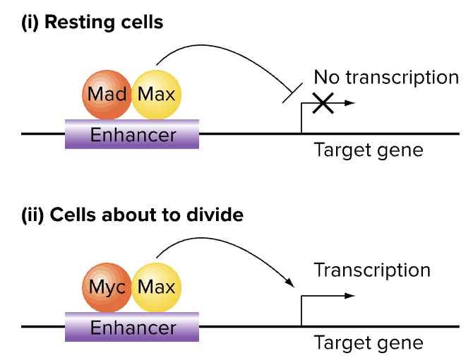

a single transcription factor can be both an activator and a repressor
- The Drosophila Dorsal protein acts as an activator of gene 1.
- At gene 2, another transcription factor (gray) bound to enhancer 2 causes Dorsal to act as a repressor by helping it recruit a corepressor called Groucho.
- 当 Dorsal 进入细胞核后，它可以结合到某些 target gene 的 enhancer 上，招募 coactivator 和 transcription machinery，从而促进基因表达，例如激活腹侧命运相关基因的转录。但在另一些 enhancer 上，Dorsal 也可以和其他 repressor 协同作用，并招募 Groucho 这样的 corepressor，使染色质更紧密或阻碍转录起始，从而抑制某些基因的表达。

Complex regulatory regions enable fine-tuning of gene expression
Each gene can have many regulatory proteins
- In humans, ~2000 genes encode transcriptional factors (TFs)
- Each TF can regulate many genes
- Each gene can have dozens of enhancers
- Enhanceosome – multimeric complex of proteins andother small molecules that associate with an enhancer
- Enhancers can be bound by activators and repressors with varying affinities
- Different sets of cofactors and corepressors competefor binding to activators and repressors

Early Drosophila development: From fertilization to cellular blastoderm
- The zygotic nucleus undergoes 13 rapid mitotic divisions in a single syncytium
- At the end of the thirteenth division cycle, cell membranes enclose the nuclei atthe cortex into separate cells toproduce a cellular blastoderm

different enhancers for the string gene in drosophila are used in different cell type
- different cell, string activation are different: Different activators for string are expressed at different times in different tissues
- and the string gene product activates the 14th mitosis
- Cells in different parts of Drosophila embryos go through the 14th mitosis at different times
- String gene hasmany different enhancers

### Regulation after transcription

mRNA splicing
- Splice donor site: Almost all introns begin GU at the 5’ end.
- Splice acceptor site: Almost all introns end with AG at the 3' end.
- Branch Point: An essential adenosine (A) nucleotide located 15–45 nucleotides upstream of the 3‘ splice acceptor site
- The U1 small nuclear RNA (snRNA) pairs to the 5‘ splice site and the flanking sequences.
- Splicing is two step of cleavage: 
  1) Cleavage at the 5′ splice site
  2) cleavage at the 3′ splice site, resulting in the removal of theintron and joining of exons.
  
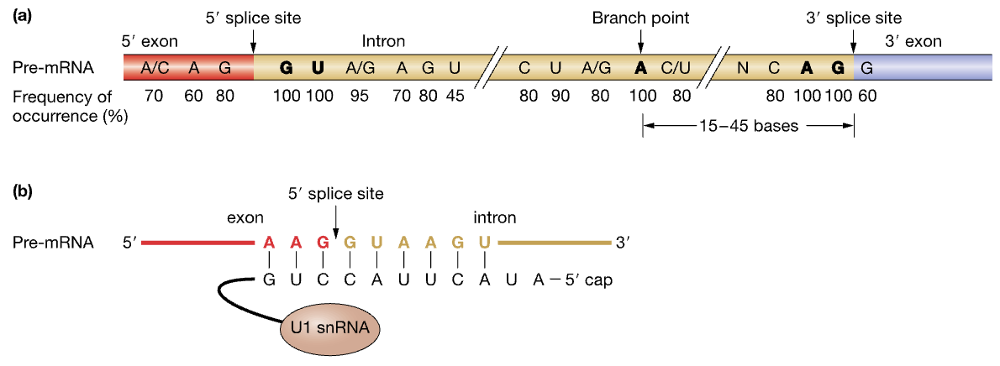

- Spliceosome: Contains U1, U2, U4,U5, and U6 small nuclear RNA-protein complexes (snRNPs)
  1) U1 binds the 5′ splice site.
  2) U2 binds the nucleotidesacross the branch point except for the key adenosine.
  3) U4, U5, and U6 join as a tri-snRNP complex.
  4) Spliceosome becomes catalytically active after conformational changes.
  5) U1 and U4 are released
  6) U6 pairs with the 5′ splice site,and U5 pairs with both exon sequences, placing the splice sites in close proximity.
  7) The first cut is at the splice-donor site, at the 5′ end of the intron.
  8) After this first cut, the new 5′end of the intron attaches to the branching point, forming a lariat.
  9) The second cut is at the splice acceptor site； this cut removes the intron and ligates the exons

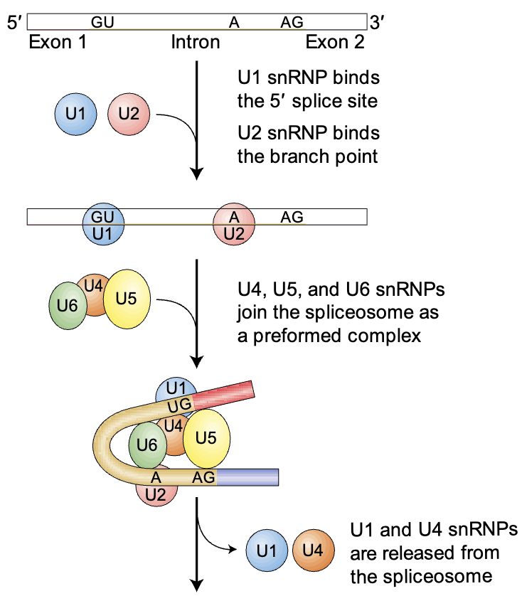

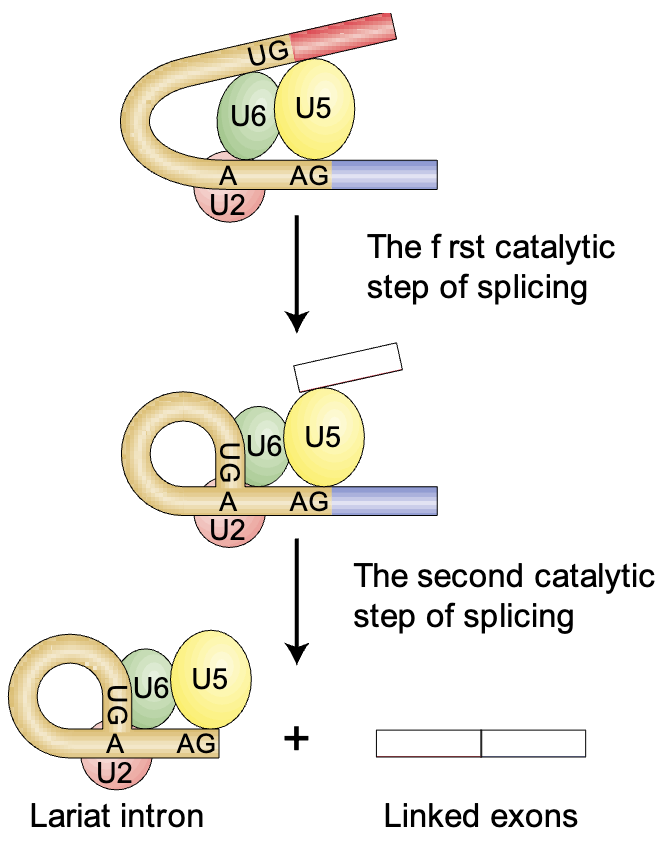

Alternative splicing produces different mRNAs from the same gene

Alternative splicing of the Dscam gene mRNA in drosophila
- Dscam 是神经系统发育中非常重要的细胞表面蛋白，参与神经元之间的识别、轴突导向和自我排斥。它的基因中有几组可变外显子，例如 exon 4、exon 6、exon 9 和 exon 17，每一组中只能选择其中一个外显子进入成熟 mRNA。不同选择组合起来后，可以产生非常多种 mRNA 变体（page45-46）
- The Dscam gene encodes a protein that guides axon growth during development.
- Over-expression of Dscam in fetal nerves causes Down syndrome.
- The Dscam gene could encode 38,016 different versions of the DSCAM protein.
- The diversity of isoforms from alternative splicing of the Dscam1 gene in D. melanogaster allows every neuron in the fly to display aunique set of Dscam proteins on its cell surface.

The pre-mRNA transcript of the rat tropomyosin gene is alternatively spliced in different cell types
- 这个基因的特点是可以通过 alternative splicing 产生多种不同的 tropomyosin isoforms，使同一个基因在不同细胞类型中发挥不同功能。大鼠 tropomyosin 基因常被用作可变剪接的经典例子，因为它能在平滑肌、成纤维细胞、脑等不同组织中产生不同的成熟 mRNA 和蛋白产物。

alternative splicing of FGFR2 produces isoforms that bind different fibroblast grouth factors(FGF)
- FGFR2 这个基因的 pre-mRNA 可以通过 alternative splicing 产生不同版本的 FGFR2 受体蛋白，而这些不同 isoforms 会结合不同类型的 FGF 配体。

Drosophila life cycle: embryo-larvae-pupae-adults

Sex-specific traits in Drosophila

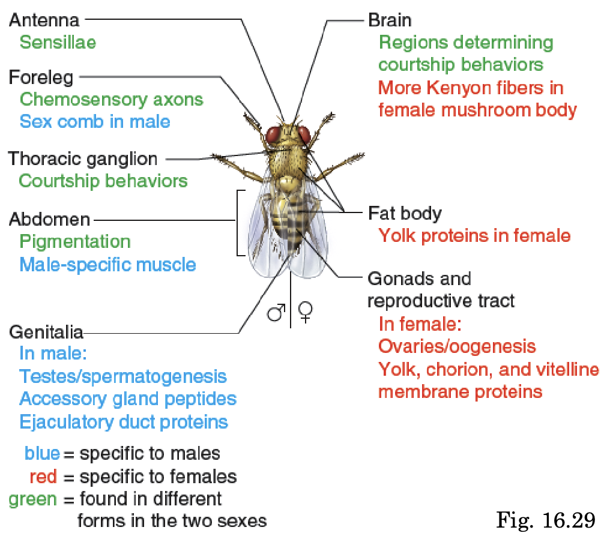

- The Y chromosome in Drosophila melanogaster is NOT involved insex determination
- It is crucial for male fertility and the proper development of sperms

Key factors of sex determination that regulate expression of the sex lethal(sxl) gene:
1. key factors in the X chromosome:
  - Numerator elements – monitor the X:A ratio through formation of homodimers or heterodimers
  - sisA、sisB/Scute、sisC/Upd 和 Runt 是果蝇 X 染色体上的性别决定信号，用来“数”X 染色体数量，并通过激活 Sxl 推动雌性发育。
2. Key factors in the autosomes:
  - Denominator elements: 常染色体上的 denominator elements 提供 autosome 的剂量信息，用来抵消或平衡 X-linked numerator 的作用
  - Deadpan 和 Extramacrochaetae（emc） 是代表性的 denominator genes。它们通常作为 Sxl 激活的抑制因子
3. Only the homodimerof X-linked numeratorproteins activatetranscription of Sxl
   
   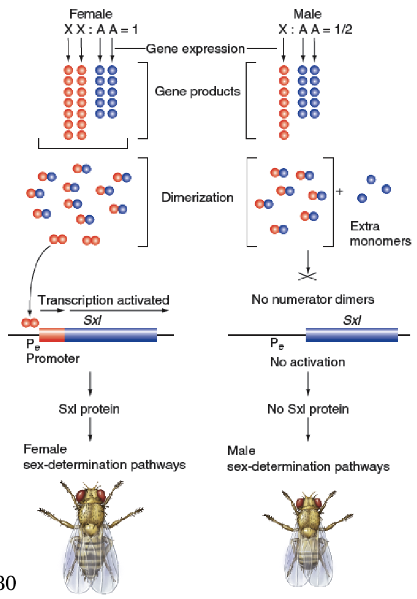

Sex lethal (Sxl) gene encodes a protein required for female-specific development

sxl protein regulates alternative splicing of its own mRNA
- Later in development, Sxl gene is transcribed in both sexes
  
  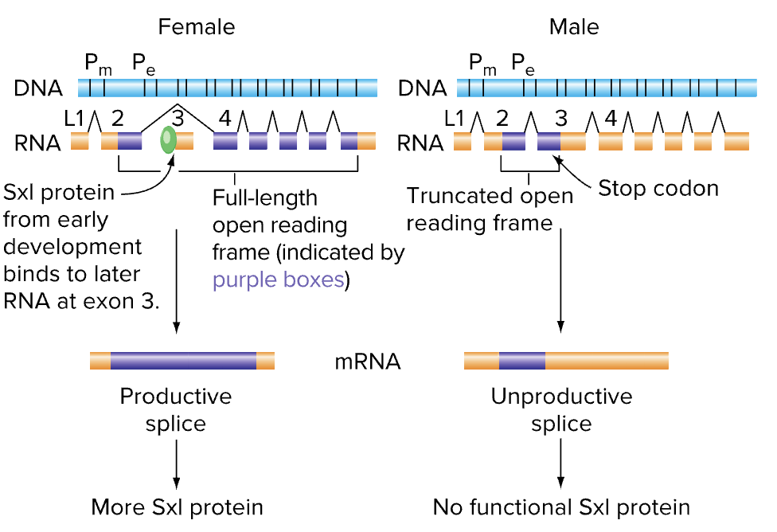

sxl protein triggers a cascade of alternative splicing
- Sxl protein regulates splicing of transformer mRNA
  
  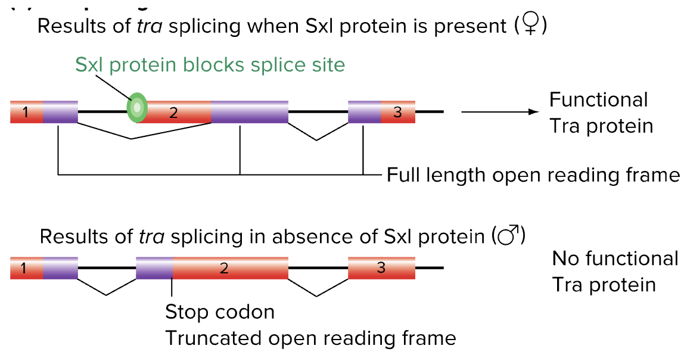

- Transformer protein regulates splicing of dsx mRNA
  
  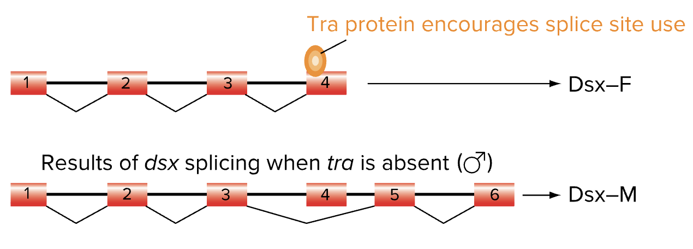

Dsx-F is a transcriptional activator and Dsx-M is a transcriptional repressor

  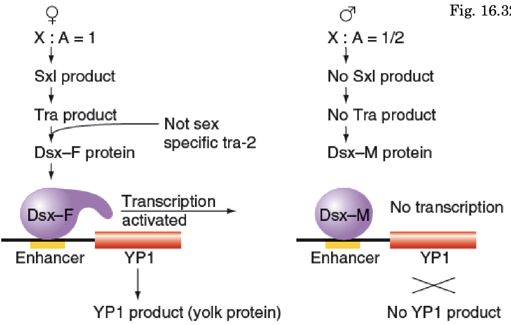

Fruitless is a TF required for development of anatomical structures necessary for courtship
1. Fruitless is 150 kb in length.
2. Only expressed in a few hundred neuron cells.
3. Mutations of fruitless prevent male from mating properly:
   1. Cannot distinguish females from males
   2. Male flies will chase each other for mating

The Tra protein regulates splicing of fruitless (fru) mRNA
- In females, the Tra protein blocks the use of one exon
- Fru-M has an extra 101 amino acids at its N terminus compared with Fru-F prote
- Fru-M and Fru-F regulate different target genes.

  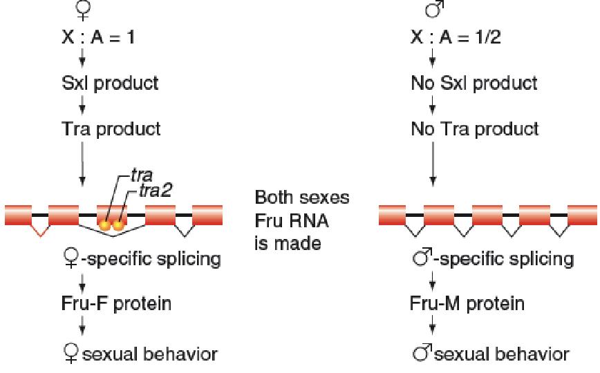

# Chapter 8 Small RNAs and epigenetics

Small RNAs regulate mRNA Stability and Translation
- micro-RNAs(miRNAs)
- small interfering RNAs
- piwi-interfering RNAs

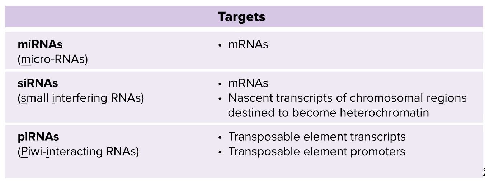

### micro-RNAs

Most miRNAs are transcribed by RNA polymerase II from noncoding DNA regions that generate short dsRNA hairpins

miRNA processing
- Drosha excises stem-loop from primary miRNA to generate pre-miRNA of ~70nt(从长的 pri-miRNA 中切出发夹结构，生成大约 70 nt 的pre-miRNA)
- Dicer processes pre-miRNA to a mature duplex miRNA(Dicer 会进一步切割 pre-miRNA 的 loop 部分，生成一段短的双链 RNA)
- One strand is incorporated into miRNA-induced silencing complex that contains Argonaute protein(Argonaute / RISC：装配成沉默复合体)(AGO1)
- They are not always 100% paired to each others
> exportin-5: transport pre-miRNA from nucleus to cytoplasm

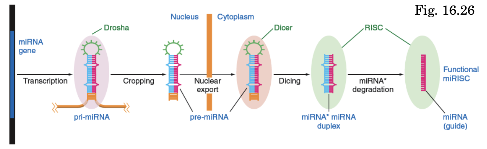

miRNAs are produced from precursors with stable hairpin structures

Mechanisms of miRNA repression in metazoans
1. inhibit translation ot degrade mRNAs of target genes
2. **Seed**(2-8 of miRNA) paring in 3'UTR is crucial
3. 1800 miRNA loci identified in human genomes, and 60% of human protein coding genes are regulated by miRNAs

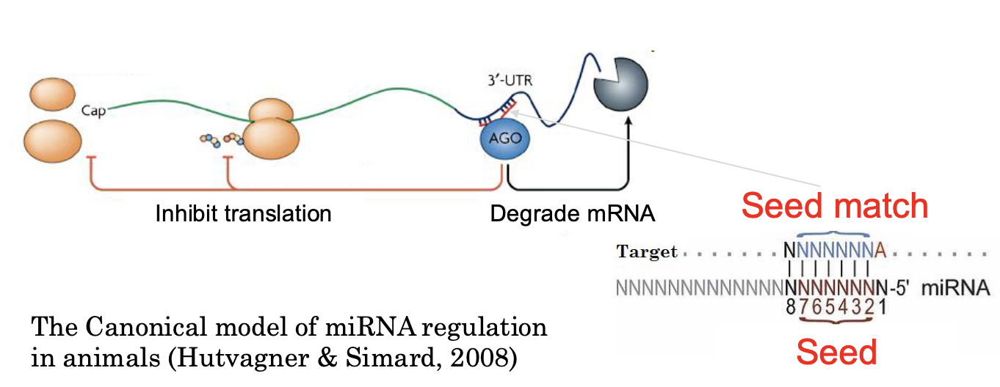

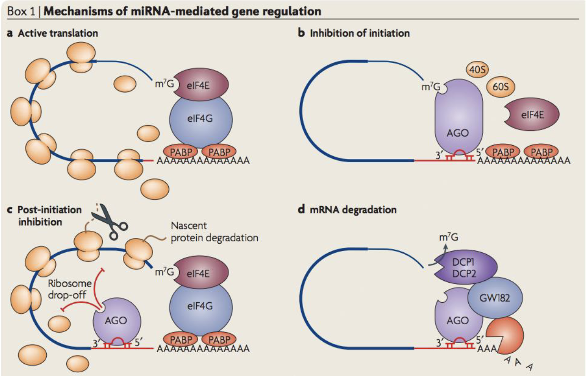

1. 活跃翻译（Active translation）：在正常条件下，mRNA通过eIF4E和eIF4G与多聚腺苷酸结合蛋白(PABP)形成闭环结构，核糖体在mRNA上顺利翻译蛋白质。
2. 起始抑制（Inhibition of initiation）：miRNA通过与AGO蛋白结合阻止翻译起始复合物的组装，使核糖体无法结合或装配到mRNA上，从而抑制新蛋白生成。
3. 起始后抑制（Post-initiation inhibition）：miRNA-AGO复合物使已经结合的核糖体提前从mRNA上脱落，导致新生蛋白质被降解，阻断翻译继续进行。
4. mRNA降解（mRNA degradation）：miRNA复合物招募去帽酶(DCP1/DCP2)及GW182蛋白，引发mRNA去帽和去尾，最终导致mRNA被降解，从而降低其稳定性和蛋白产量。

The first discoverd miRNA: *lin-4*
- in-4 is the first discovered miRNA in C. elegans. It is a small non-coding RNA that regulates developmental timing by base-pairing with complementary sequences in the 3' UTR of lin-14 mRNA, thereby reducing LIN-14 protein expression. Its discovery revealed that small RNAs can regulate gene expression post-transcriptionally without encoding proteins.
- in-14 loss-of-function mutants develop certain adult features precociously at larval stages, resulting in smaller,poorly formed adults.
- During worm early larvae development, the expression level of of lin-4 is increased and lin-14 is decreased, so that wormscan develop into adults.
- Mutation of lin-4 causes upregulation of lin-14, so the mutants lack many adult structures, and they are unable to lay eggs.

### small interfering RNA

1. processing the dsRNA into 20-22nt fragments in **cytoplasm**
  siRNAs have a defined structure after processing by Dicer(两端不是完全平齐，而是有小突出的 3' overhang) 

  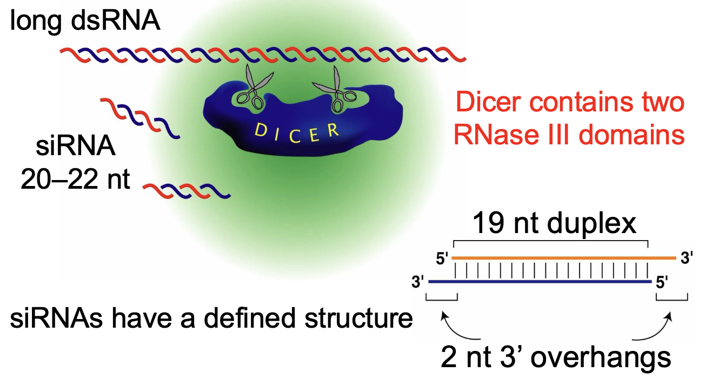

  compared to miRNA, siRNA are perfectly paried to each other
2. the siRNAs duplex is loaded into RISC and unwind(AGO2): The siRNA RISC also containsArgonaute (AGO) protein
3. The antisense strand recognize target mRNA
4. RISC cleave the mRNA in the middle, and the mRNA is degraded further(当 guide strand 与 target mRNA 完全或高度互补配对后，AGO2 会切割 target mRNA, 之后被切开的 mRNA 会进一步被细胞内的核酸酶降解。)
   1. The siRNA RISC also contains Argonaute (AGO) protein
   2. The mRNA is degraded further

  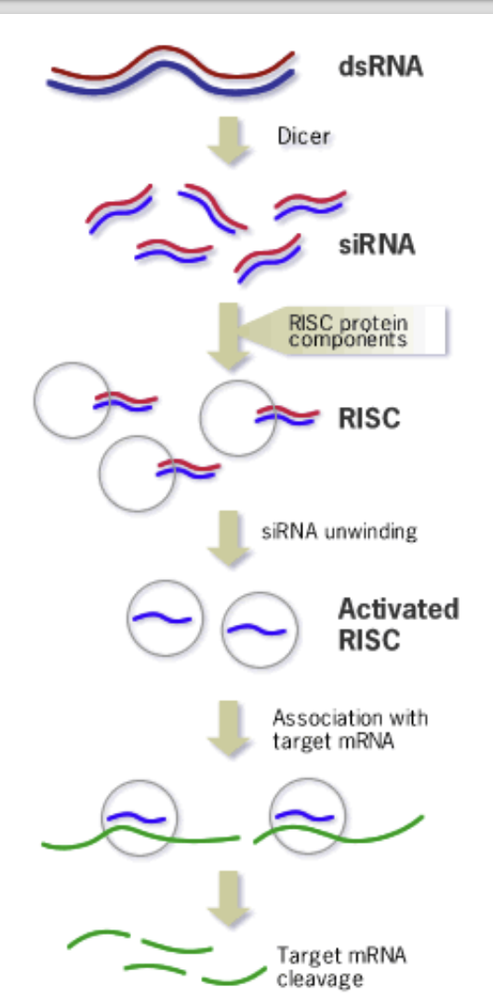

RNAi is used to inhibit transposable elements and viruses
- TE or viral RNA transcripts areconverted into double-strandedRNA (dsRNA) either by their own transcriptional properties or RNA-dependent RNA polymerases(RdRPs)
- Dicer cleaves the dsRNA into small interfering RNAs (siRNAs)
- siRNAs are loaded into RISC and bind to complementary TE RNA sequences, leading to their cleavage and degradation

Practical aspects of RNAi:
- biological research:
  - defining gene fuction
  - defining biochemical pathways
- therapeutic treatment
  - cancer
  - viral infection
  - parasitic infection

> RNAi-based therapies for HIV treatment
> - using RNAi to target HIV RNAs at different stages of infection

Transposable elements(TEs) are deleterious to host organisms
- TEs decrease fitness of D.melanigaster by 0.4%-5% because
  - insertions disrupt genes
  - transcription and translation of TEs are costly(很多 TE 不是静止的 DNA，它们可能被转录，甚至有些 TE 会编码转座相关蛋白,这会消耗宿主细胞资源)
  - TEs mediate ectopic recombination(同源重组发生在“不应该配对的位置”之间) to cause deleterious chromosomal rearangement
> human: DNA methylation
> Drosophila: pi-RNA

The classic P-M hybrid dysgenesis:
- P element is a DNA transposon, its length is 2.9 kb.
- P element is polymorphic in the glocal population of Drosophila melanogaster
- P strain(carries P element); M strain(doesn't carry M element)
- when a sperm from a P strain fertilizes an egg from a M-strain, the P element transpos throughout the genome, which causes F1 to be sterile, leading to hybrid dysgenesis(P-M hybrid dysgenesis 是因为 父本提供 P element，而母本 M strain 的卵细胞没有提供抑制 P element 的母源因子，导致 F1 生殖系中 P element 大量转座，造成基因组损伤、性腺发育异常和不育。)

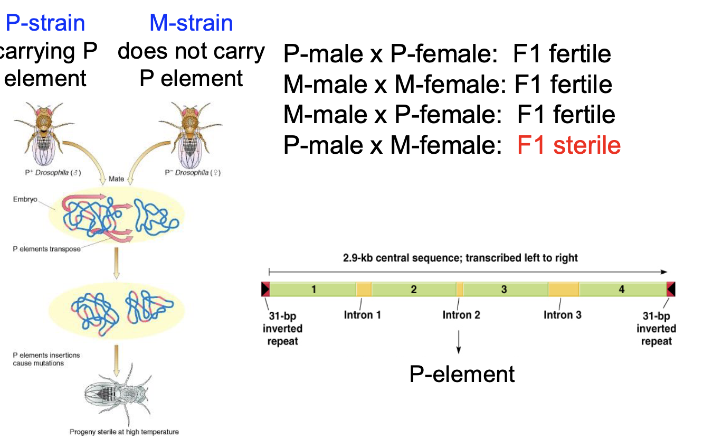

### piRNAs
 
an adaptive immune system against TE invasion in drosophila

piRNAs are:
- 24-30 nts in length
- Mainly expressed in germlines
- generated from long transcripts of clusters of TEs
- perfect antisense matching with target mRNAs
- targets: Usually transcripts of active TEs; degraded through a **"Ping-Pong" model**

1. P-element is repressed by piRNAs in germline cells.
2. piRNAs are located in the cytoplasm and maternally transmitted to off-springs
3. In the embryos of P-female offsprings, there is piRNAs to repress P element.
4. in the embryos of M-female offsprings, there's no piRNAs to repress P element.
  
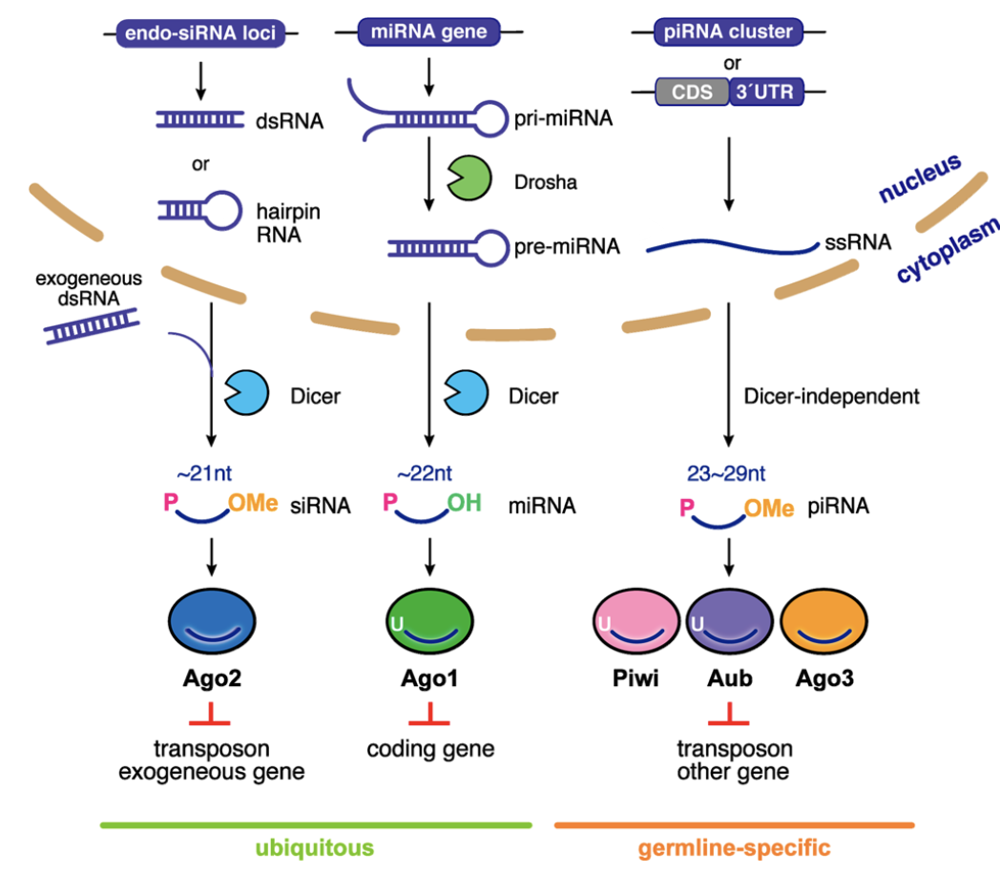

Origin and evolution of RNAi and miRNA pathways:
- The RNAi pathway is most ancient. The last common ancestors of eukaryotes already possessed the miRNA pathway. Differences in miRNA pathways and miRNA repertoires among animal and plant lineages primarily arise from lineage-specific miRNA pathway innovations, losses of miRNA pathways, miRNA acquisition, and loss of miRNAs after they diverged from the last common ancestor of eukaryotes.

### Epigenetics

- genetic: Sequence-information of a gene is fixed, not dependent on environment
- Epigenetic: Stably inherited phenotype resulting from changes in a chromosome without changes in DNA sequences. An instruction for reading of the genetic information.
> waddington

1. Chromatin modifications
2. DNA methylation
3. X-chromosome inanctivation
4. Genomic imprinting
  
Chromosomes have a versatile modular structure for packaging DNA
- chromatin is ~1/3 DNA, 1/3 histones, 1/3 nonhistone, proteins
- The total length of DNA is about 2m in a human cell
- Diameter of a human nucleus: 10-15μM
- DNA is compressed ~100,000 folds in human cells
- DNA interacts with histones and non histone proteins to fit into a cell nucleus

DNA is packaged into nucleosomes:
1. nucleosome core is an octamer of two each of histones H2A,H2B,H3 and H4
2. ~146bp of DNA wraps twice around a nucleosome core
3. 40bp of linker DNA connects neighboring nucleosomes
4. Histone H1 associates with linker DNA and interlock the neck of the nucleosome
  
The nucleosome is the fundamental unit of chromosomal packaging
- The organization of nucleosome looks like a necklace, nucleosomes as beads and linker DNA as string
  
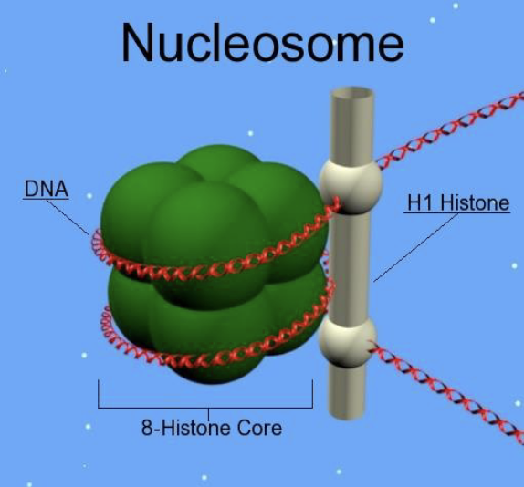

- Spacing and structure of nucleosomes affect genetic function
  - Determines whether DNA between nucleosomesis accessible for proteins that initiate transcription,replication and further compaction
  - Arrangement along chromatin is highly defined and transmitted from parent to daughter cellsduring DNA replication

Histone proteins--small, positively-charged, and highly conserved
- bind to and neutralize negatively charged DNA
- Make up half of all chromatin protein by weight
- Five types - H1, H2A, H2B, H3, and H4
- Core histones (H2A, H2B, H3, and H4) make up the nucleosome
- post translational modification of core histones:
  - methylation and scetylation of histone tails
  - affect chromatin structure and gene expression in specific chromosomal regions

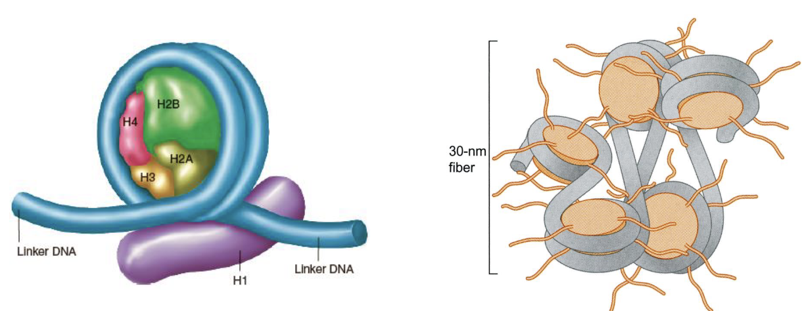

Nonhistone protein
- Large variety of functions
  - Structural role – chromosome scaffolds and pack DNA
  - Chromosome replication – e.g. DNA polymerases
  - Chromosome segregation – e.g. kinetochore proteins
  - Active in transcription – e.g. RNA polymerase and transcription factors.

Assembly of a nucleosome
- The nucleosome assembly occurs in astepwise manner:
  - Two H3–H4 dimers form a tetramer, and it is deposited on DNA first
  - It is followed by deposition of two H2A–H2B dimers

> DAvid Allis and histone code -> histone code

Histone Code: histone modifiations have predictable effects on transcription
1. covalent modifications(acetylation, phosphorylation, methylation, ubiquitylation) occur on the histone tail domains
2. histone tail modications are induced by enzymes that are highly specific for particular amino acid positions.
3. Distinct modifications of the histone tails would induce interaction affinities for chromatin-associated protein
4. Modifications on the same or different histone tails may be interdependent and generate various combinations.

Histone tail modifications:
- The N-terminal tails of the core histone proteins extend outward from nucleosome
- various amino acids in these tails are targets for modifications such as methylation and acetylation that can alter chromatin structure.
- for each histone, different amino acid position has unique modification pattern
- These modification events will greatly affect chromatin packing patterns and thus affect gene expression.

**Histone acetylation:**
- usually occures on lysine
- The HAT enzyme adds an acetyl group on the lysine, and the HDAC enzyme removes the acetyl group off
- In general, histone acetylation is linked to transcriptional activation and associated with euchromatin

**Histone methylation:**
- Histone methyltransferase will add methyl group on a lysine,and histone demethylase will remove the methyl group.

Readers of histone modifications
- acetylated: Bromodomain recognizes acetylated lysine residues
- methylated: Chromodomain binds methylated histones

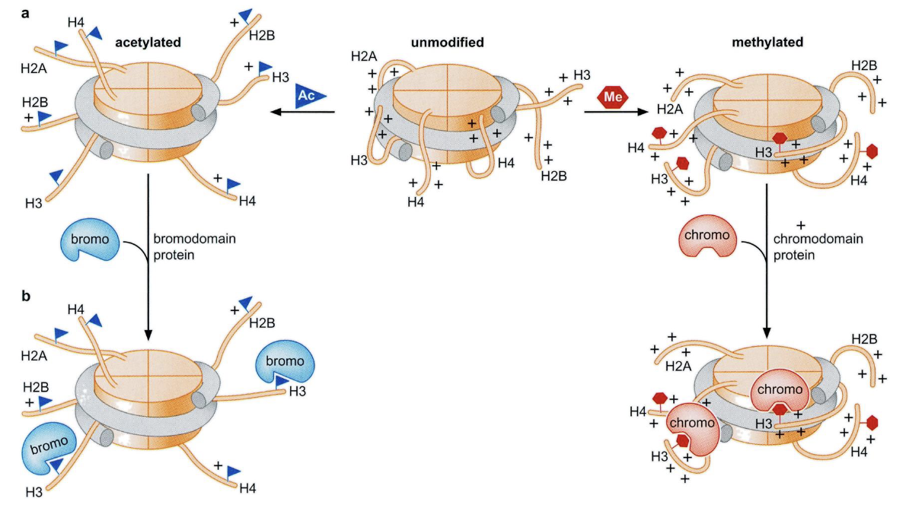

HIstone modifications change chromatin structure
1. Remodeling proteins cause specific nucleosomes to unravel(解旋).
2. Chromatin remodeling can expose the promoter region.
3. Exposed promoter regions more readily bind basal transcription factors.

Active vs Inactive Chromatin
- Modification can cause the chromatin to be active or inactive.
- Usually acetylation will cause active transcription while methylation will repress transcription.

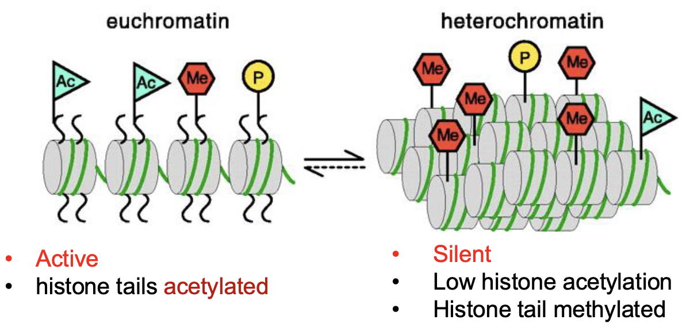

Histone code for gene expression status

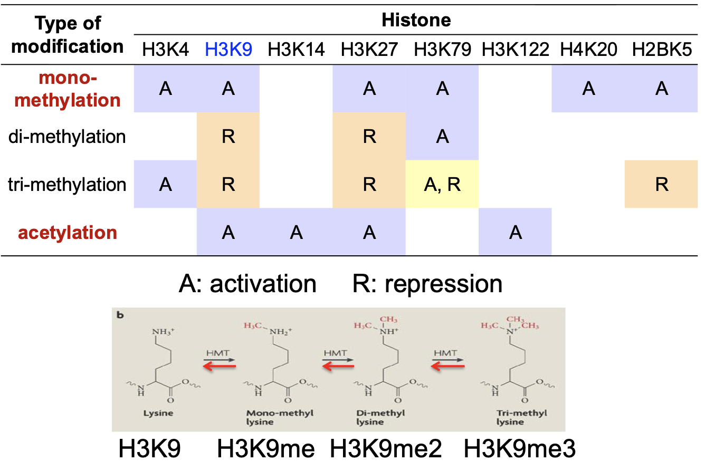

DNA methylation
1. addition of methly group to cytosine base
2. Done by DNA methyltransferase enzymes: Dnmt1(maintenance methylase,DNMT1 会识别 hemimethylated CpG sites，然后在新合成的 DNA 链上对应的 cytosine 加上甲基), Dnmt3(de novo methylase,Dnmt3 负责建立新的甲基化模式)
3. Blocks transcripyion factors binding
4. Crucial role for cell differentiation and embryonic development
5. repression of transposable elements
  
DNA methylation occurs at C5 of cytosine in a CpG dinucleotide
- DNA methylation adds methyl (CH3) group to the fifth carbonof the cytosine base in a CpG dinucleotide pair on one strandof the double helix

Cytosine methylation is maintained during DNA replication
- The pattern of cytosine methylation (blue circles) on the template strand is replicated on the newly synthesized strand of DNA (red).

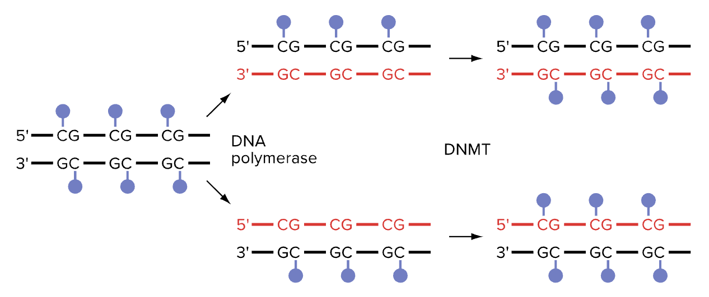

Generally, methylation blocks transcription:
- DNA methylation inhibits transcription, either by preventing the binding of an activator protein, or by recruiting proteins that change the structure of chromatin that inhibits transcription.

DNA methylation and CpG islands
- CpG islands are DNA sequences of a few hundred or a few thousand bp long, which has higher frequency of CpG dinucleotides than that of the rest of the genome.
- CpG islands are often located near promoters.
- Unlike the CpG dinucleotides in the rest of the mammaliangenome, the C residues in CpG islands are usually unmethylated.
- The reason that CpG islands are usually unmethylated is that the proteins that activate transcription by binding to CpG islands prevent DNMTs from methylating these is lands.
- These transcriptional activators will be found in many cell types if the target gene is a house- keeping gene expressedin most cells.
- If the activators are absent, the CpG island becomes methylated.
- methyl-CpG-binding proteins (MeCPs) bind to methylated CpG islands and close the chromatin structure.

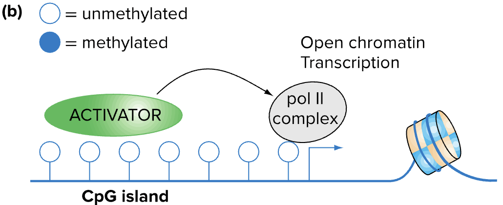

5-Methyl cytosine often mutates to thymine due to DNA replication errors
- methylation of cytosine will from 5-methylcytosine, and spontaneous deamination of 5-methylcytosine converts it to thymine

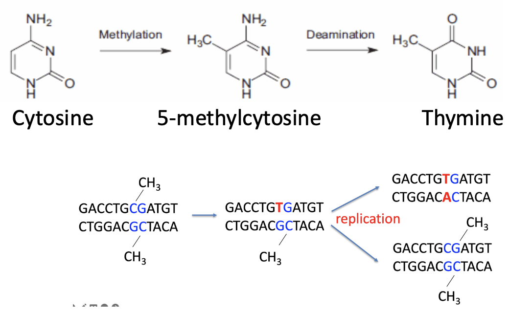

Derermining methylation state of DNA using two restriction enzymes:
- HpaII and MspI have the same recognition sequence(CCGG), but different sensiticity to DNA methylation
- HpaII doesn't out if 2nd C is methylated
- but doesn't affect MspI

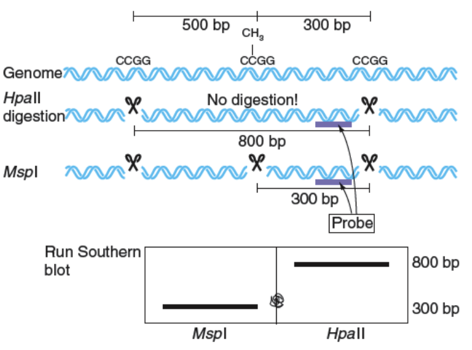

Detecting CpG methylation with bisulfite sequencing:
- treatment of DNA with bisulfite converts cytosine to uracil, but leaves 5-methylcytosine residues unaffected

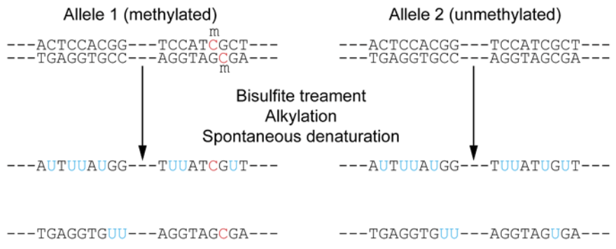

Heterochromatin are highly condensed chromosome regions
1. Constitutive – condensed in all cells (e.g. most of the Y chromosome and all pericentromeric regions)
2. Facultative – condensed in only some cells and relaxed in other cells (e.g. position effect variegation, X chromosome in female mammals)
3. Euchromatin – relaxed, usually active transcriptionally,lightly stained regions of chromosomes

Position-effect variegation(PEV) in drosophila
- white+ gene is normally located in euchromatin
- chromosomal inversion can result in w+ gene being lovated adjacent to hetrochromatin

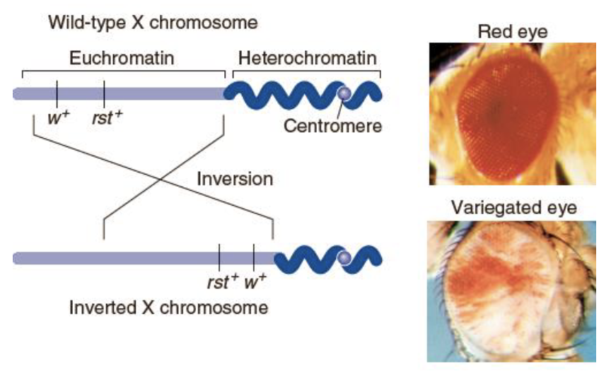

> w+ gene is expressed in all cells
> w+ gene is silenced in some cells but is expressed in other cells

PEV in Drosophila
- Gene silencing can be caused by spreading of heterochromatin into nearby genes
- Spreading can occur over > 1000 kb of chromatin
- Heterochromatin spreads further in some cells than inothers

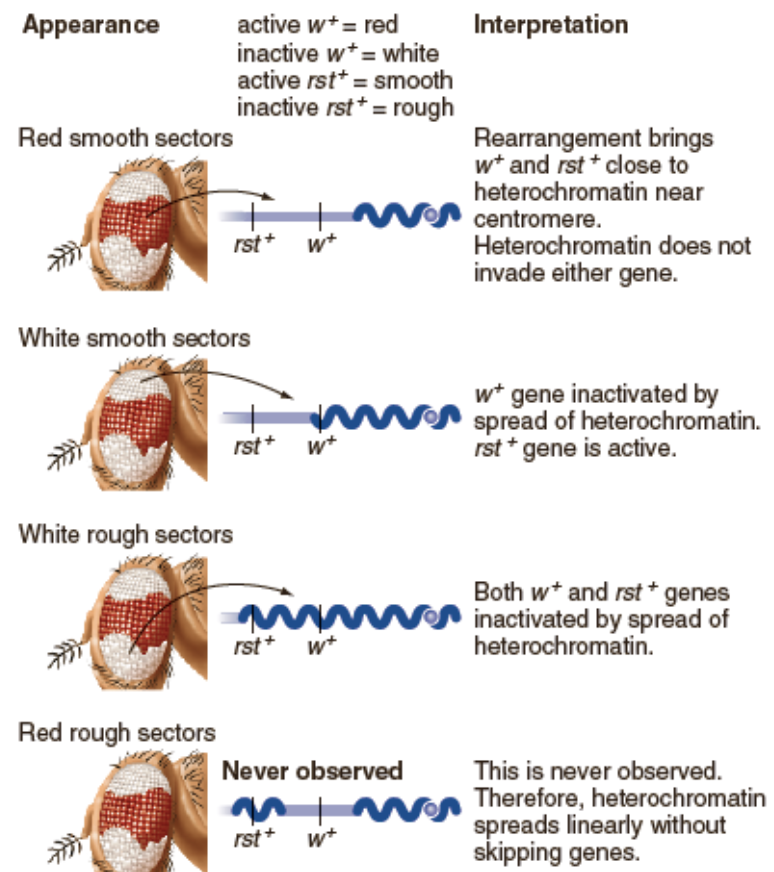

Heterochromatin formation inactivates an X chromosome in cells of female mammals

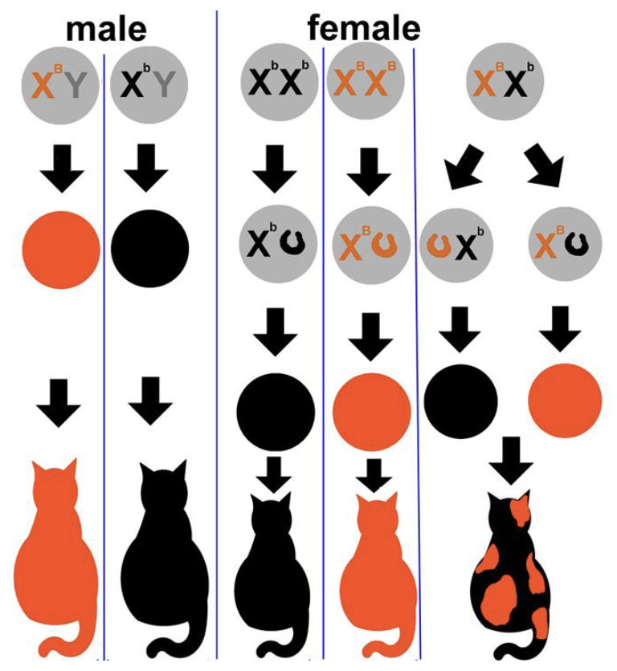

X chromosome mosaicism:(page65)
1. In very early embryo, both X chromosomes are active
2. In humans, random X-inactivation occurs ~ 2 weeks after fertilization
3. All cell descendants have the same inactive X
4. Some cells have maternal X inactivated, other cells have paternal X inactivated
5. Some cells of adult females have wild-type allele inactivated, and Some cells have mutant allele inactivated
  
X-chromosome inactivation in female mammals occurs through heterochromatin formation
1. Dosage compensation in mammals so that X-linked genes in XX and XY individuals are expressed at same level
2. Random inactivation of all except one X chromosome in XX
3. Barr bodies – darkly stained heterochromatin masses observed in somatic cells at interphase
   1. XX person has one Barr body
   2. XXX person has two Barr bodies
   3. XXY person has one Barr body

X inactivation and Barr body: An example of heterochromatin decreasing gene activity
- One X chromosome appears in interphase cells as a darkly stained heterochromatin mass
- Inactivation of one X chromosome to control for dosage compensation in female mammals

Lyon hypothesis
- Barr body is an inactive X chromosome. The process of inactivation is called lyonization.
- During early development, about the 100 cell stagein humans, one of the X chromosomes in a female gets inactivated and this is maintained in all descendant cells of the clone.
- Inactivation of the two X-chromosome is random.
- For some reason both X chromosomes remain active in female germ line cells.

Mechanisms and procedures for X-inactivation
1. Counting: two or more XIC (X inactivation center)must exist in the cell for X inactivation to occur
2. Selection: How one X chromosome is chosen to be silenced is not well known
3. Inactivation: XIST (X-inactivation specific transcript)is a non-coding RNA in XIC region.
   1. It encodes a 17 kb, spliced, poly-A detailed RNA, but cannot be translated into proteins
   2. XIST is transcribed from the inactive X chromosome and remains in the nucleus
   3. XIST coats the inactive Xchromosome

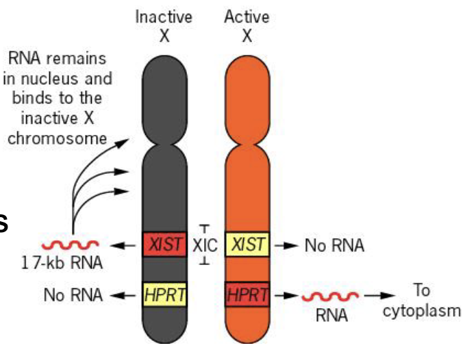

Xist coats the inactivated X chromosome
- Xist is transcribed stably only from the XIC of the inactive X chromosome.
- The Xist ncRNA binds to many sites on this chromosome
- The Xist ncRNA then attracts histone-modifying proteins that silence the DNA.
- Once X inactivation is established, the descendent cells inherit the status of X inactivation.

Tsis expression prevents Xist ecpression from that X chromosome
- Tsix is transcribed only from the X chromosome that will remain active.
- Tsix overlaps Xist and is transcribed in the opposite direction
- Tsix produces a long noncoding RNA and its sequence is antisense to that of Xist.
- Tsix expression from the future active X prevents Xist expression from that X chromosome.

page75宋老师讲过的不同的dosage competation的原则

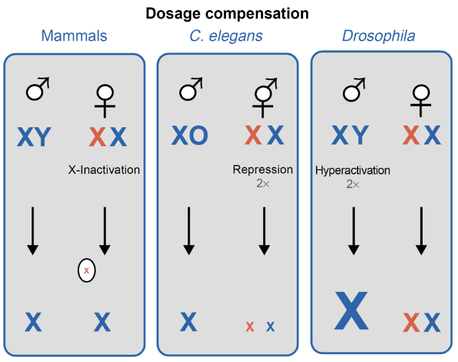
  
Genomic imprinting results from transcriptional silencing
- Genomic imprinting: expression of a gene depends on whether it's was inherited from the mother or father
  - occurs with some genes of mammals
  - Epigenetic effect (no change in DNA sequence)
- paternally imprinted gene is transcriptionally silenced if it was transmitted from the father
  - Maternal allele is expressed
- Maternally imprinted gene is transcriptionally silenced if it was transmitted from the mother
  - Paternal allele is expressed

In mice, maternally-inherited Igf2 allele is silenced
1. insulin-like growth factor 2 is a protein hrommone similar to insulin.
2. mice inheriting deletion from the male were small
3. Mice inheriting deletion from the demale were normal

In mice, maternally-inherited Igf2 allele is silenced
- Insulin-like growth factor 2 (IGF-2) is a protein hormone similar to insulin.
- Mice inheriting deletion from the male were small.
- Mice inheriting deletion from the female were normal.
  
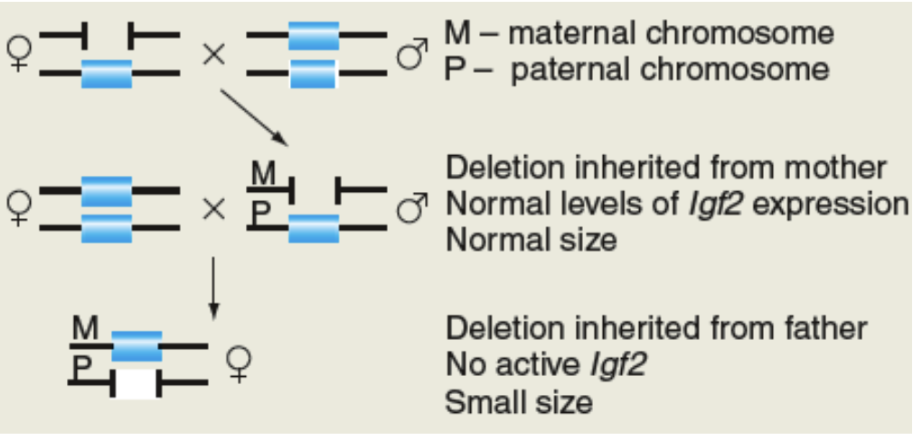
  
Insulators limit the chromatin region over which an enhancer can operate
- Insulators are DNA elements that block the enhancer from activating transcription of a gene.

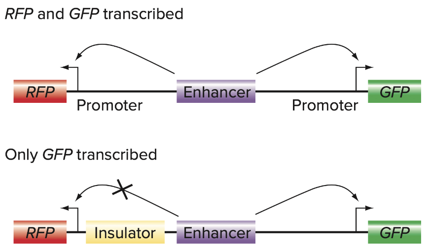 

How insulators work
- Interactions between CTCF proteins (yellow) bound to different insulators facilitates the formation of a DNA loop in the region between the insulators.
- Insulators organize genomic DNA into loops.
- Enhancers activate transcription (A = activator) only from promoters within the same loop.

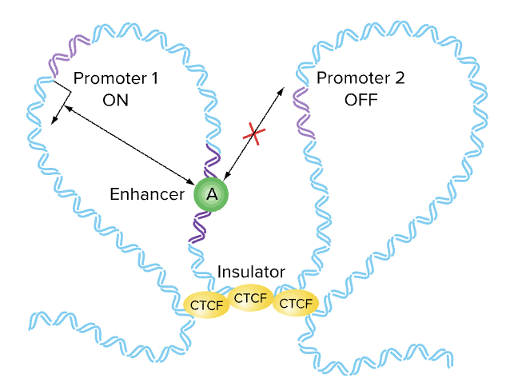 

Maternal imprinting of Igf2 is controlled by methylation of an insulator
- On the maternal homolog, the insulator is unmethylatedand is therefore functional (it binds CTCF).
- On the paternal homolog, the insulator is methylated anddoes not function.

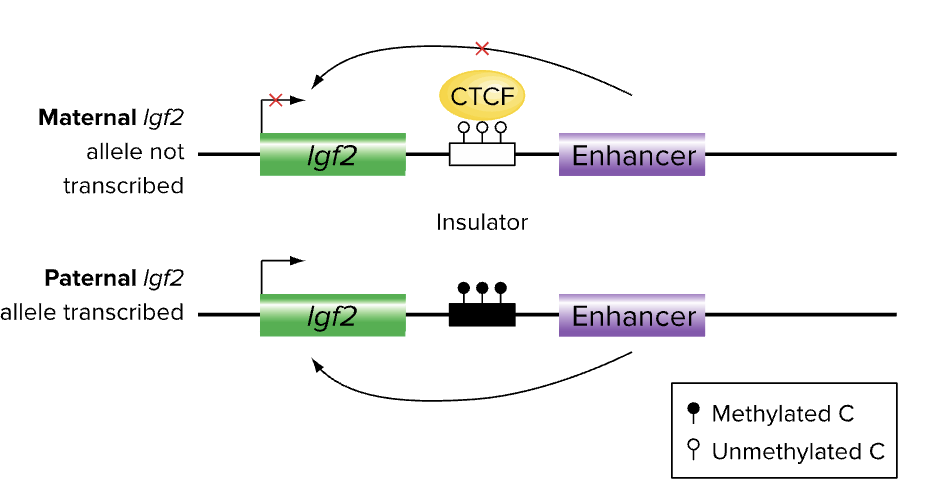 

H19 and Igf2 locus are imprinting in opposite "directions"
- Igf2 positively regulate body size
- H19 negatively regulates body size
- H19 is only transcribed from the maternally inherited allele
- The paternal H19 allele is not expressed due to DNA methylation
- Parental conflict

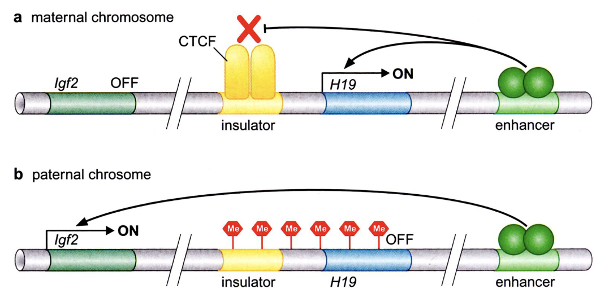 

Methylation of complementary strands of DNA in genomic imprinting
- Imprinting state can be maintained across cell generation sthrough the action of DNA methylases
- Sex-specific methylation of imprinted loci thus generally remains in the somatic cells throughout the life of the individual.

The resetting of genomic imprints during meiosis:
- Epigenetic imprints remain throughout the lifespan of the mammal in the somatic cells
- In germ cells epigenetic imprints are reset ar each generation
- During meiosis, imprints are earaed and new ones are set
(de novo methylation?)
(保证了下一代胚胎的印记模式与父母性别相匹配, 印记每代在生殖细胞中重设，是为了让下一代判断“这条染色体来自爸爸还是妈妈”，而不是保留更早祖辈留下的印记。)

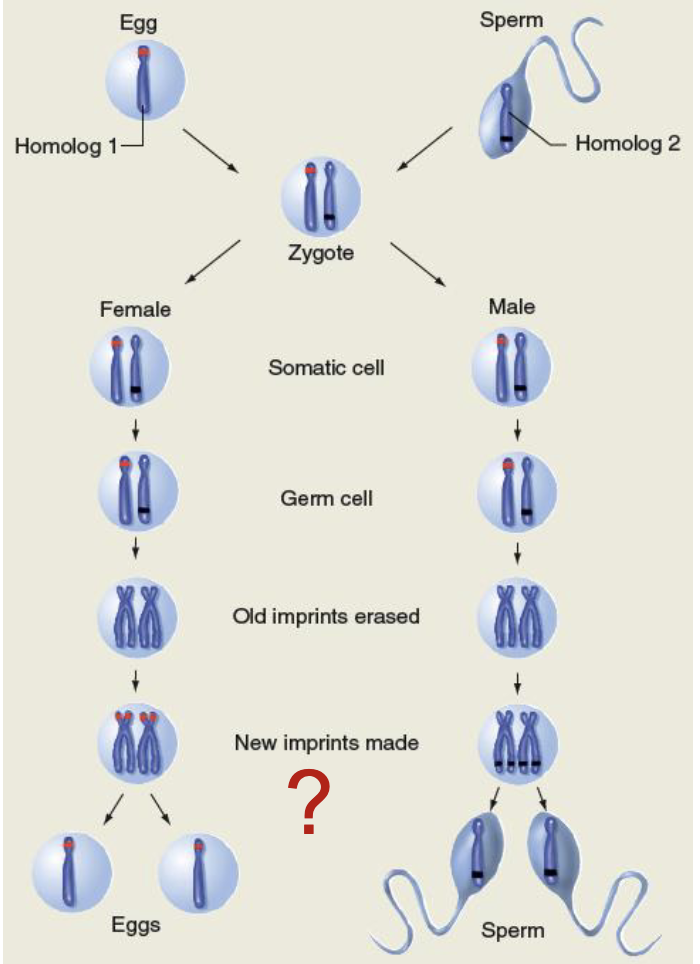 

> Prader-willi syndrome PWS:
> - Caused by a **maternally imprinted** gene with deletions in the q11-13 region of chromosome 15
> - SNRPN

> Angelman syndrome(AS)
> - caused by a **paternally imprinted** gene with deletions in the q11-13 region of chromosome 15
>

- The PWS genes are maternally imprinted. When the deletionis inherited from the father, the child develops Prader-Willi syndrome
- The AS genes are paternally imprinted. When the deletion isinherited from the mother, the child has Angelman syndrome.

Both PWS and AS are caused by small deletions in the q11–13 of chr 15

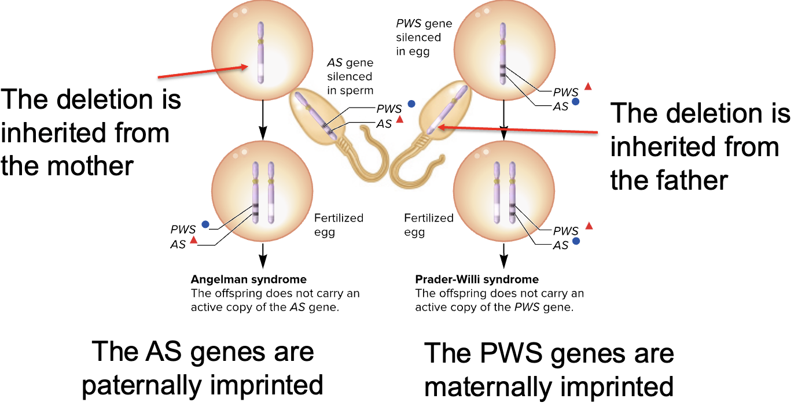 

Deletions in 15q11-13 cause PWS and AS

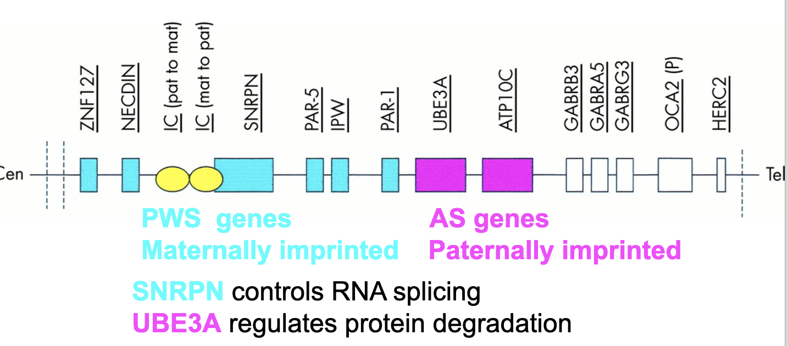 

Paternal imprinting and human disease:
- A pedigree for a disease associated with mutation of a paternally imprinted autosomal gene
- Fathers can pass the deletion to their sons or daughters who are unaffected (dots in pedigree symbols indicate unaffected carriers of the deletion);
- Mothers can pass the deletion and the disease (yellow shading) to their children.

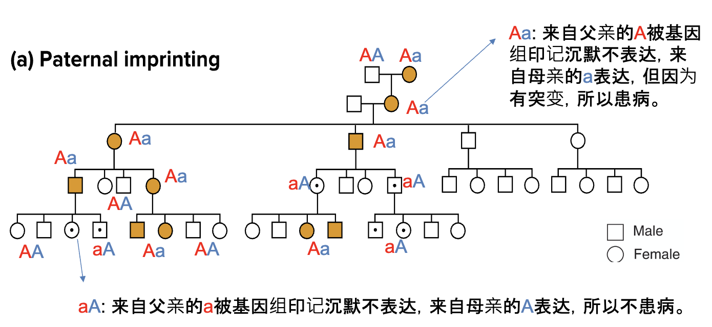 

Maternal imprinting and human disease
- A pedigree for a disease associated with mutation of a maternally imprinted autosomal gene
- Mothers who can pass the deletion to their sons and daughters without effect (dots);
- Fathers can pass the deletion and the disease to their sons and daughters who will be affected (purple).

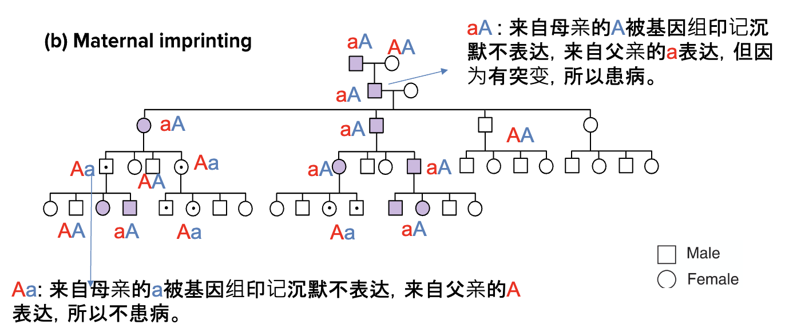 

What genes are imprinted?
1. Most are in clusters
2. Most have CpG islands
3. Clusters of direct repeats are common near orwithin the CpG islands
4. Have differentially methylated regions (DMRs)
   1. Some in all cells, others tissue-specific
   2. Some have methylated DMR in active alleles.others in the inactive allele
5. Often have differences in histone modifications，chromatin structure

# Chapter 9 Human disease and genetics

Gene, diseases and environmental factors:
- R.A.Fisher
  
  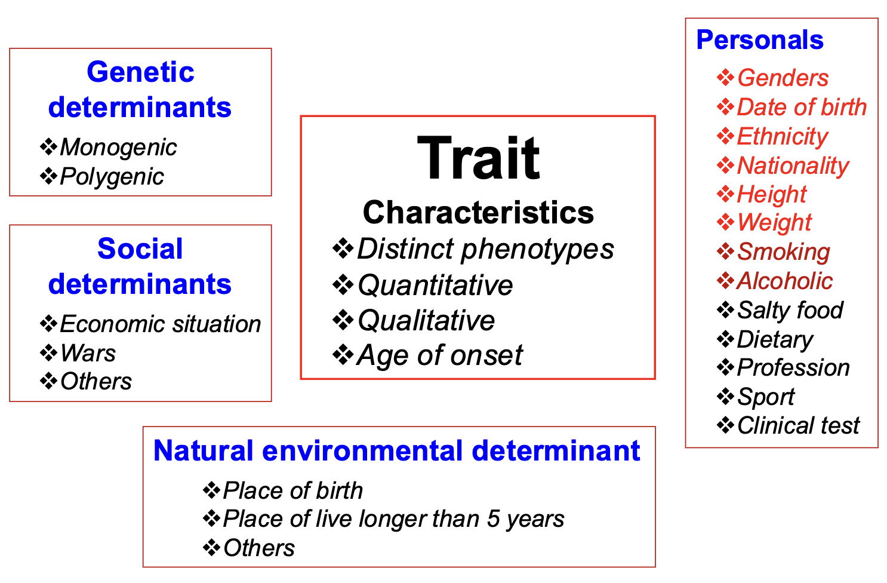 

Genetic classification of diseases:(page6)
- Monogenic disease:
  1. Caused by single gene mutation, family-based
  2. In 2009, there were ~4300 single-gene traits known in humans
- Polygenic disease:
  1. Caused by interaction of many genes, environmental factors, and their interactions
  2. Don’t show simple Mendelian inheritance patterns

Some of the most common single-gene traits caused by recessive alleles in humans:

| Disease | Chromosome | Effect | Incidence |
|----------|----------|----------|----------|
| Thalassemia | 16 or 11 | Reduced hemoglobin; anemia; bone and spleen enlargement | 1/10 in parts of Italy |
| Sickle-cell anemia | 11 | Abnormal hemoglobin; sickle-shaped red blood cells; anemia; blocked circulation; increased resistance to malaria | 1/625 African-Americans |
| Cystic fibrosis | 7 | Defective cell membrane protein; excessive mucus production; digestive and respiratory failure | 1/2000 Caucasians |
| Huntington disease | 4 | Progressive mental and neurological damage; symptoms usually appear between ages 40–70 | 1/25,000 Caucasians |
| Phenylketonuria (PKU) | 12 | Missing enzyme; mental deficiency | 1/10,000 Caucasians |

但是亨廷顿不是隐性基因

Forward genetics vs. reverse genetics
- Pedigrees are orderly diagrams of a family’s relevant genetic features, a pedigree should include as many generations as possible (ideally, at least both sets of grandparents of an affected person)
- Pedigrees can be analyzed using Mendel’s laws
1. Forward genetics: determine the genetic basis responsible for a phenotype.
2. Reverse genetics: study the function of a gene by mutating the gene and studying the phenotypic effects（类器官）
3. Only forward genetics can be directly used to study human subjects to search disease-causing genes

In human genetics, pedigrees can be used to study inheritance:
1. Autosomal Dominant
2. Autosomal recessive
3. X-linked Dominant
4. X-linked recessive
  
Strategies to look for a disease-causing gene:
- Candidate geneapproach:
  - An approach identify trait-associated genes bydirectly screening candidate genes that are those functionally associated with trait (disease)
- Positional cloning
  - An approach to identify DNA polymorphisms that are linked to disease genes

Symbols used in pedigree analysis

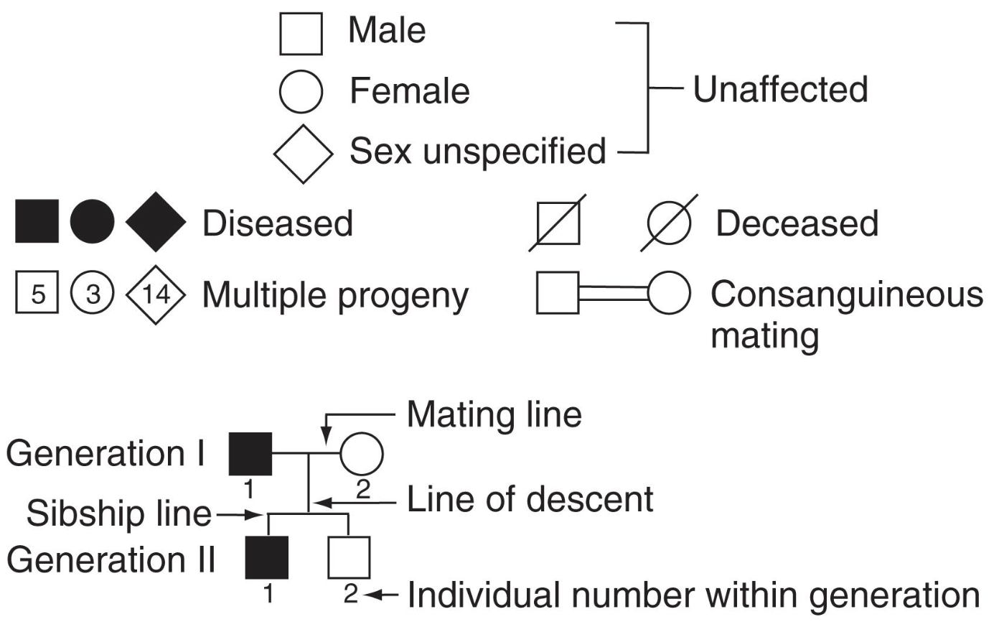 

### Autosomal Dominant

- Expressed in individuals who have even one copy of the mutant allele.
- Affected males and females have an equal probability of passing on the trait to offspring
- Affected individual’s have one normal copy of the gene and one mutant copy of the gene, thus each offspring has a 50% chance on inheriting the mutant allele.

> Huntington disease
> - Progressive degeneration of the nervous system
> - Normal until middle age
> - No treatment
> - Gene has been isolated(chromosome 4),genetic testing candiagnose

HD gene mapped by positional cloning:
- Huntington disease (HD) was the first human disease gene to be mapped by positional cloning.
- Detection of linkage between the DNA marker G8 and the HD was the first step in the cloning of the HD gene.
- The pedigree showing segregation of the G8 DNA marker (fouralleles: A, B, C, and D) in a pedigree affected with HD
- The C allele of G8 is tightly associated with the disease.

Positional cloning: From phrnotype to chromosomal location to guilty gene
- using knowledge of a pecific chromosomal region to indntify genes responsible for disease phenotypes
  - Linkage analysis with DNA markers
  - Huntington disease locus was the first human disease gene to be succussfully mapped by positional cloning
  
  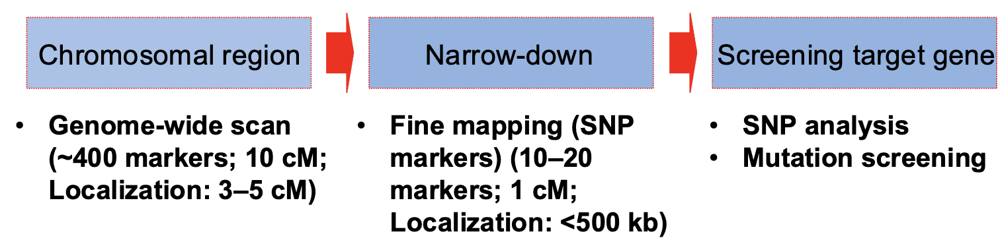 

Genetic markers in positional cloning
- To identify the mutations in the markers that is tightly linked with the disease-associated allele by linkage analysis

  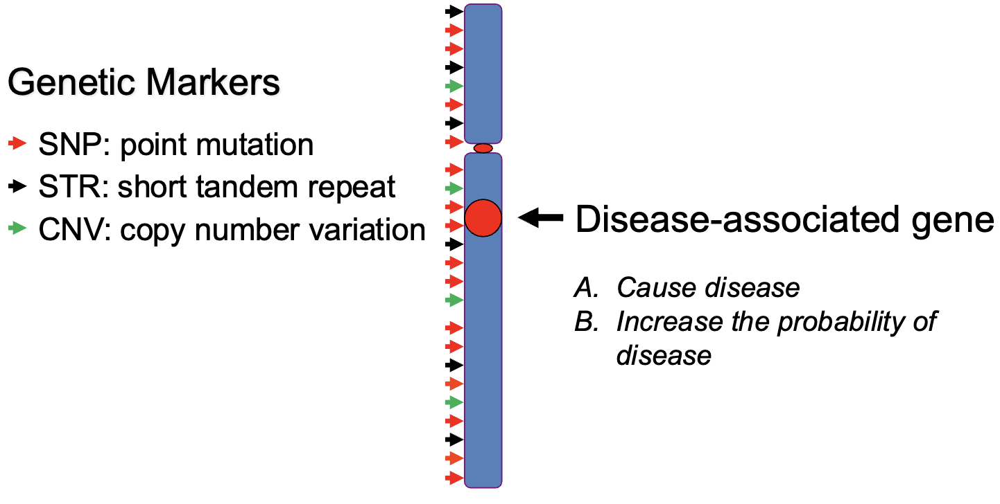 

- Genotype all members of disease-carrying families with aseries of DNA markers
- Locations of thousands of DNA markers in human genome are already known
- Basically this is aseries of two-point crosses betweenthe trait and each marker
- Identify candidate genes in the smallest genetically-defined area that must contain the disease locus
- Compare structure and expression of candidate genes in many diseased vs.nondiseased individuals,and identify the causative mutation and disease gene
- Functional validation

Mutations at HD locus are caused by expansion of a triplet repeat microsatellite
- The HD locus encodes Htt(Huntingtin) protein , which isneeded for the proper physiology of nerve cells.
- Near the 5’ end of the coding region is a repeating triplet sequence that codes for a string of glutamines (Q).
- Different alleles at the HD locus have different numbers of repeating units.
- Fewer than 34 repeats gives a normal phenotype.
- As the number of repeats increases beyond 42, the onset of the disease is earlier.

Why the allele for Huntington disease is dominant
- People who are HD HD or HD HD+ exhibit Huntington disease because the HD allele produces an abnormal Htt protein that damages nerve cells

Odds ratio(发生比)
- Odds = p/(1-p) = 0.2/0.8 = 0.25
- Lod = log10(0.25) = -0.6

Lod score: log of odds
- Lod: logarithm of the odds, a statistical estimate of whether two loci are linked to each other on a chromosome.
- Null Hypothesis (H0): The marker and the disease locusare not linked (independent assortment).
- Alternative Hypothesis (𝐻1): The marker and the disease locus are linked with a recombination fraction r.

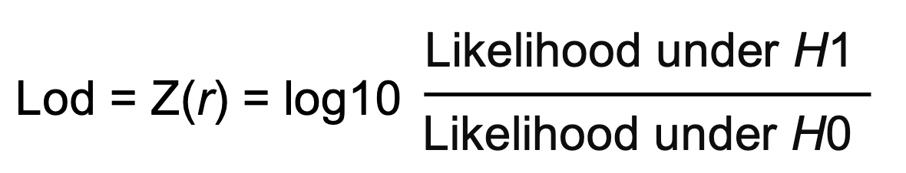 

> Suppose
> - n: total number of individuals in a certain generation of a pedigree
> - k: number of recombinant individuals
> - r: recombination frequency
>
> 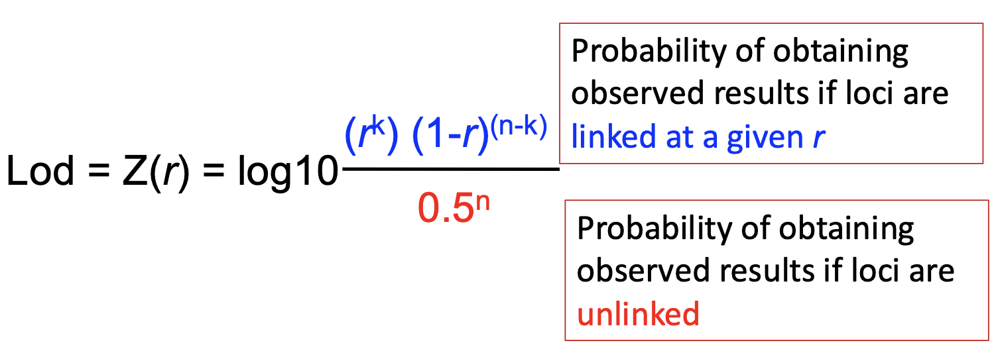 
>

assume r in different value, using the recombination frequency that gives the highest lord score as it indicates the strongest evidence for linkage.

Pedigree showing the inheritance ofneurofibromatosis in a family.
- Neurofibromatosis (NF) is adominantly inherited autosomal disease thataffects more than 100,000Americans.
- The disease causes nervous tissue to proliferate uncontrollably, formingbumps under the skin.

- For a single pedigree, Lod scores can becalculated for any r value less than 50%. A Lodscore ≥3 indicates that the data obtained are compatible statistically with the particular distance (less than 50 m.u.) being tested.
- Likelihood ratios are converted into Lod scores because Lod scores calculated for the same rvalue in different pedigrees may simply beadded to see whether a Lod of 3 can be obtained.

### Autosomal recessive:

> Examples:
> - Cystic fibrosis
> - Phenylketonuria (PKU)

1. When just one copy of the mutant allele is present,an individual is a carrier of the mutation, but does not develop disease.
2. Females and males are affected equally.
3. When two carriers mate, each child has a 25% chance of being homozygous wild-type (unaffected); a 25% chance of being homozygous mutant (affected); or a 50% chance of being heterozygous (unaffected carrier).

Cystic fibrosis
- Most common lethal genetic disorder among Caucasians
- Defective chloride ion transport protein
- Thick mucus in lungs and pancreatic ducts

Mutations in CFTR cause cystic fibrosis
- A 3-bp deletion (delta F508) cause CFTR tofold incorrectly and the protein is degraded.
- People who are homozygous for delta F508 mutation tend to have the most severe symptoms of cystic fibrosisdue to critical loss of chloride ion transport.
- The CFTR (CF) protein forms a channel in the cell membranes that controls the flow of chloride ions through lung cells.
- Disease alleles (CF) are recessive because CF/CF+ heterozygotes produce sufficient CFTR from the normal (CF+) allele for normal lung function
- This causes cystic fibrosis, characterized by the buildup of thick mucus in the lungs.

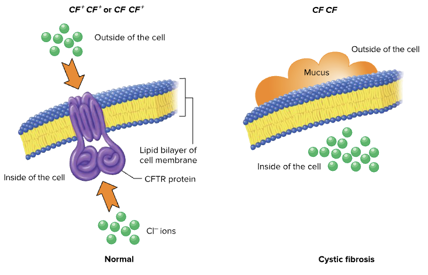 

Phenylketonuria (PKU)
1. PAH (Phenylalanine hydroxylase) enzyme converts phenylalanine in food into the amino acid tyrosine.
2. When PAH is mutated, phenylalanine builds up in the body and is converted into phenylpyruvic acid (苯丙酮酸). 
3. Phenylpyruvic acid interferes with the development of the nervous system, leading to mental retardation

### X-linked Dominant

1. There is no transmission from father to son.
2. All daughters of an affected male will be affected since the father has only one X chromosome to transmit.
3. Children of an affected woman have a 50% chance of inheriting the X chromosome with the mutant allele.

Hypophosphatemic rickets (佝偻病)
- The PHEX (Phosphate Regulating Endopeptidase X-Linked) encodes an enzyme that is active primarily in bones and teeth.
- Mutations in PHEX cause hypophosphatemic rickets

hypophosphatemia

### X-linked recessive

- Fully evident in males because they only have one copy of the X chromosome.
- Women are affected when they have two copies of the mutant allele.
- There is no father to son transmission.
- There is father to daughter and mother to daughter and son transmission.

How geneticists identified and cloned the hemophilia A gene: a candidate gene approach
1. Blood vessels damaged.
2. Plate lets form an initial plug，clotting cascades are activated.
3. Fibrin is formed, the protein that crosslinks with itself to form a mesh that makes upthe final blood clot (凝块).
4. The protein involved with hemophilia A is factor VIII(factor 8) and with hemophilia B is factor IX.

1. The process of blood clotting involves 13 different proteins.
2. Factor VIII protein is present in normal individuals but absent in hemophiliacs.

> Based on knowledge of blood clotting process,factor VIII was tested as a candidate for causing hemophilia A
> Reverse translation of purified factor VIII led to cloning of the factor VIII gene
> Sequencing of the factor VIII gene from affected and unaffected people revealed the causative mutation

How to recognize dominant traitsin pedigrees
1. Affected children always have at least one affected parent
2. As a result, dominant traits show a vertical pattern of inheritance
3. Two affected parents can produce unaffected children, if both parents are heterozygotes

How to recognize recessive traits in pedigrees
1. Affected individuals can be the children of two unaffected carriers
2. All the children of two affected parents should be affected
3. Rare recessive traits show a horizontal pattern of inheritance
4. Recessive traits may show a vertical pattern of inheritance if the trait is extremely common in the population

Molecular Explanation-Dominance
- Complete dominance: when the hybrid resembles one of the two pure-breeding parents.
- Incomplete dominance: when the hybrid resembles neither parent; its novel phenotype is usually intermediate.
  - heterozygote shows intermediate phenotype, representing a blending of traits.
- Codominance occurs when the hybrid shows traits from both pure-breeding parents.
 
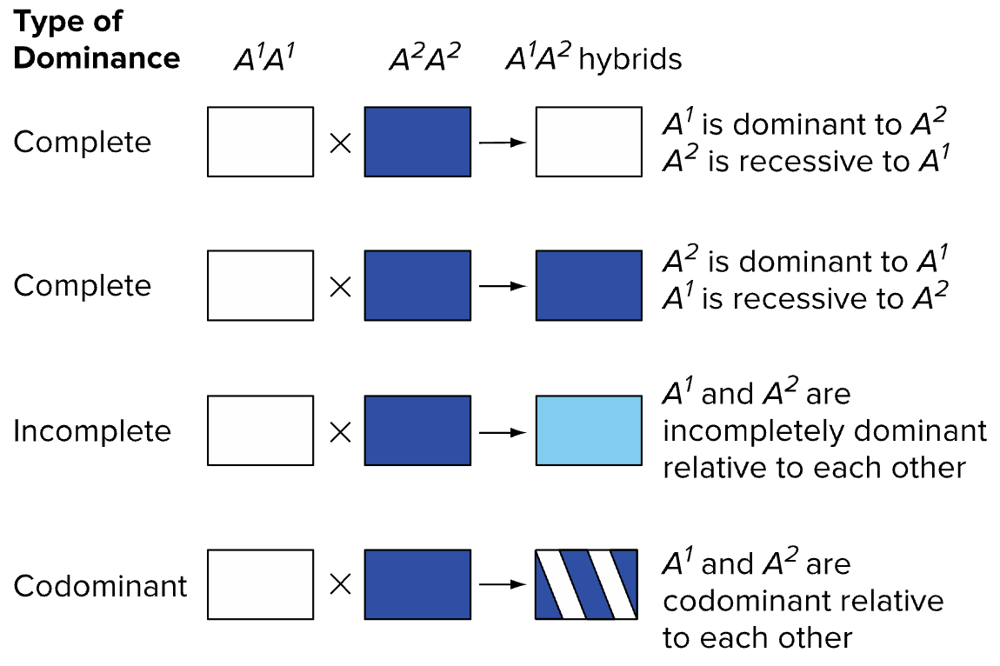

> ABO blood type: co-dominant Traits
> - The ABO blood groups are determined by three alleles of the ABO gene.
> - Two alleles, IA and IB, result in different sugars sugar polymer on surface of red blood cells. The i allele lacks activities due to a mutation.
> - IAIB individuals have both A and B sugars

Penetrance and expressivity
- Penetrance is the percentage of a population with a particular genotype that shows the expected phenotype. Can be complete (100%) or incomplete(e.g. penetrance of retinoblastoma is 75%).
- Expressivity is the degree or intensity with which a particular genotype is expressed in a phenotype. Can be variable or unvarying.

Penetrance of retinoblastoma is 75%
- Retinoblastoma is the most aggressive form of eye cancer，and it arises from a dominant mutation in the RB1 gene.
- The RB1 gene is a key tumor suppressor, and its normal function is to regulate the cell cycle and prevent uncontrolled cell proliferation.
- About 75% of people who carry one RB1 mutant allele develop retinoblastoma.
- With one defective RB1 allele, in most cases, the second wild-type RB1 allele also becomes inactivated, either through a second mutation or through epigenetic silencing.
- This complete loss of RB1 function is a critical step in the development of retinoblastoma.

Incomplete penetrance in the inheritance of breast cancer
- The breast cancer genes BRCA1 and BRCA2 encode proteins that function in double-strand break repair via homologous recombination.
- Mutation of either BRCA1 or BRCA2 is associated with a high risk of breast cancer or ovarian cancer in women.
- The effects of both BRCA1 and BRCA2 mutations are autosomal dominant, and women heterozygous for eitherone of these mutations have a much higher than average risk of developing breast or ovarian cancer.

Two-hit theory of cancer causation
- The first hit involves the inactivation or loss of one allele of a tumor suppressor gene, it can be inherited (germline mutation) or acquired (somatic mutation).
- The second hit involves the inactivation or loss of the remaining functional allele of the tumor suppressor gene, it is typically an acquired somatic mutation that occurs randomly or due to epigenetic effect.

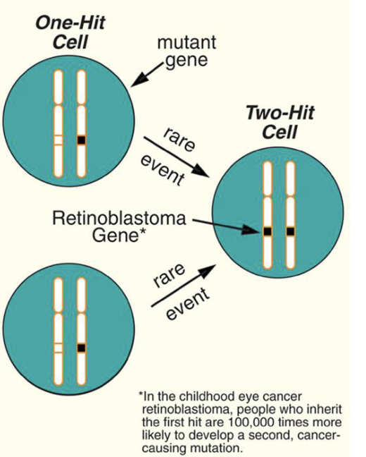

- Once both alleles of the tumor suppressor gene are inactivated, the cell loses the normal function of the gene,leading to uncontrolled cell division and the development of cancer.

Reasons for incomplete penetrance
1) modifier genes
   - Mutant T allele causes abnormally short tail
   - In some inbred strains, mice with T allele have tails that are 75% the length of normal tails
   - In other inbred strains, mice with the same T mutation have tails that are 10% the length of normal tails
   - Different inbred strains must carry alternative alleles of a modifier genefor the T mutant phenotype
2) environmental factors
  - Conditional lethal mutations are lethal only under some conditions
  - Permissive conditions - mutant allele has wild-type functions
  - Restrictive conditions - mutant allele has defective functions
> Siamese cats are homozygous for a temperature sensitive allele of an enzyme that is involve in melanin production.
> This allele becomes active only at the lower temperatures found in the cat’s extremities

> - Phenocopy - phenotype arising from an environment alagent that mimics the effect of a mutant gene.
> - Phocomelia is a congenital disorder characterized by theunder development of limbs, resulting in limbs that are extremely short or even absent.
> - Thalidomide is a sedative drug. It disrupts the normal limbdevelopment in fetus, which produced a phenocopy o phocomelia
3) random events

Polygenic Inheritance
- Polygenic (Quantitative) Traits
- Governed by more than one gene pair
- Several genes determine the phenotype
- Produce bell-shaped curve

- Haplotypes – unique combinations of common SNP alleles over extended regions of the genome
  - Inheritance of blocks of DNA that remain intact over many generations
  - Extended versions of alleles that cover regions containing multiple genes
- A small number of “tag SNPs” can be used to obtain a nearly complete whole-genome profile of individuals

Genome-wide association studies (GWAS)
- Thousands of individuals make up a study group
  - Each individual is observed or tested for expression of one or more traits of interest
  - DNA microarrays are used to obtain whole-genome profiles for each member of the study population
- Genotypes at each tag SNP are tested for association with each trait
  - Only a small number of tag SNPs will show a significant association with a trait
  - Reveals genomic regions that harbor alleles associated with the trait

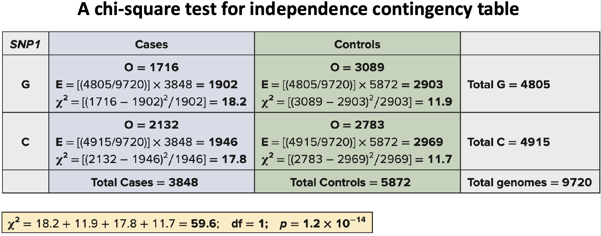

- Using lineage regression analysis to detect the association between genotype and quantitative trait
> Manhattan plot for a GWAS study
> - P values for all SNPs tested across all chromosomes
> - Each dot represents a single SNP test
> - Lowest P values are shown as the highest dots
>
> 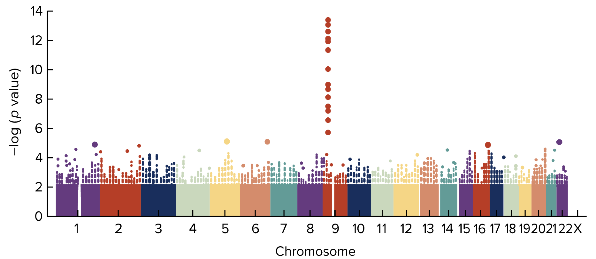
>

# Chapter 10 Gene function and development

Development: exposing genes to natural selection
1. Development is the process through which an embryo becomes an adult organism and eventually dies.
2. Through development, an organism’s genotype is expressed as a phenotype, exposing genes to the action of natural selection.

The thrifty gene hypothesis
- The thrifty gene hypothesis, proposed by James Neelin 1962, suggests that some genetic variants evolved to promote efficient energy storage during periods of food shortage.
- Past advantage: In ancestral environments with frequent foodshortage, these “thrifty genes” helped individuals store fat during food abundance, improving survival and reproduction.
- Modern mismatch: In today’s calorie-rich environment, the same energy-saving traits may increase susceptibility to obesity, insulin resistance and type 2 diabetes.

Developmental genetics
- Definition: using genetics to study how a fertilized egg becomes an adult.
- Approach: By analyzing mutations that produce developmental abnormalities, to understand how normal genes control cell growth, cell communication, and the emergence of specialized cells, tissues, and organs.
- Ethical and practical limitations on human developmental genetics:
  - Cannot experimental manipulation of affected individuals.
  - Mutations that disrupt the earliest stages of development almost always cause the spontaneous abortion of the affected embryo or fetus, often before the mother knows she is pregnant.

Model organisms: prototypes for developmental genetics
- Five model organisms:
  - *Saccharomyces cerevisiae* (yeast)
  - *Arabidopsis thaliana* (plant)
  - *Drosophila melanogaster* (fruit fly)
  - *Caenorhabditis elegans* (worm)
  - *Mus musculus* (mouse)
- Advantages for research:
  - Easy to grow
  - Rapid reproduction
  - Genome sequencing
  - Genetic resources

All living forms are related
- Cells of many eukaryotes have microscopic features in common – e.g. nuclei and mitochondria
- Metabolic pathways are virtually identical in all organisms
- Almost all cells use the same genetic code
- Many homologous proteins have highly conserved amino acid sequences
- Many developmental strategies are conserved in multicellular eukaryotes

A transcription factor that is critical for eye development in Drosophila and mouse
> Vertebrate Pax6, Drosophila eyeless and Drosophila twin of eyeless all belong to the conserved Pax6 gene family. In Drosophila, toy and ey are paralogs generated by duplication of a Pax6-like ancestral gene, with toy acting upstream of ey in eye development.
- Pax6 （Paired Box Gene 6） is required for eye development, Both Paired Box domain and Homeodomain bind DNA sequences

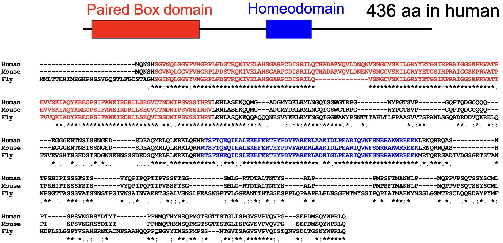

- Mutation in pax-6 cause abnormal eye development
  - heterozygous: Aniridia (无虹膜)

Ectopic expression of the eyeless gene produces ectopic eye tissue in Drosophila
- Transgenic flies with eyeless gene under control of a heat-shock promoter
- Ectopic expression of the eyeless gene produces ectopic eye tissue
- Ectopic eyes also arise when the mouse or human Pax-6 gene is expressed in Drosophila

**Loss-of-function mutations– usually recessive**
- Can alter the amino acid sequence – results in diminished (or no) biochemical activity
- Can interfere with gene expression (transcription, RNAprocessing, translation) – results in decreased (or no) expression of a normal protein
- Null mutations – complete loss-of-function
  - Gene is not expressed
  - Protein is truncated
- Hypomorphic mutations – partial loss-of-function
  - Useful for understanding how one gene functions at multiple times in development
- Conditional mutations – loss-of-function only under certain conditions
- Loss-of-function mutations and dominance
  - Haplosufficiency: in the heterozygote of mutant, one wild-type allele is sufficient to produce gene product so that development is normal. Wild-type is dominant and mutantis recessive.
  - Haploinsufficiency: in the heterozygote of mutant, one wild-type allele is NOT sufficient to produce gene product so that development is abnormal. This is an example of incomplete dominance.

Hypomorphic mutations
- Many genes function at multiple times in development.
- An animal homozygous for a null allele of gene will die during embryogenesis so that we cannot study its function in adult.
- The wingless (wg) gene in Drosophila is needed in embryogenesis and formation of an adult wing.
- Homozygotes of null alleles of wg is lethal in embryos.
- Homozygous for a hypomorphic allele of the wg gene survive to adulthood, but they have no wings.

Conditional mutations: temperature-sensitive mutation
> ZYG-9 is required only in 15 minutes during worm development
>
> 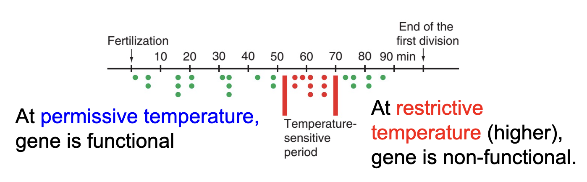
>
> - Green dots indicate that the embryo ultimately survives and becomes a normal worm.
> - Red dots represent animals with abnormal polarity that ultimately die.

Using homologous recombination to generateLoss-of-Function Mutations in Mice
1. Establishing Embryonic stem(ES) cell lines
  - Use the blastocyst (胚泡, veryyoung embryos) of agoutimice to establish embryonicstem (ES) cell lines.
  - Culture the ES cells to increase their number.
  - The agouti mice has a mutant agouti allele and the coat color of the mouse is white.
2. Create DNA constructs in which a specific gene is mutagenized by the insertion of the neomycin (neo) resistance gene, and then they add this DNA into culture medium in which the ES cells are growing.
   
  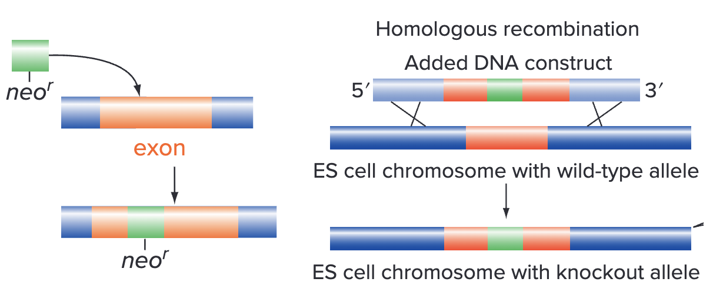

3. Select cells that have incorporated the exogenous DNA into their genomes survive and divide in the media that contain neo mycin.
4. Identify and verify ES colony with knockout allele through homologous recombination; these cells are heterozygous for a loss-of-function mutation in the targeted gene.
5. Produce blastocysts from black mice
6. Inject targeted ES cells into blastocysts of black mice and put blastocysts into uterus of a foster mother
7. Offspring will be chimeric and can transmit knockout allele to their offspring
8. Screening offspring

- The mice that are born by the foster mother are called chimeras, because they are made up of cells from two different organisms.
- The cells have the disrupted target gene are from the agouti mice, while the cells that do not have the disrupted target gene are from the black mice.
- Some knock-out stem cells by chance develop into germ cells. Geneticists mate the chimeric mice to wild-type mice to screening offspring that has the mutant allele of the targetgene.

**Gain-of-function alleles are usually dominant**
- Gain-of-function alleles either enhance a protein’s function, confer a new activity on a protein, or expressa protein at the wrong time or place .
- A single gain-of-function allele can alter phenotype even in the presence of the normal protein
- The gain-of-function alleles are almost always dominant to wildtype alleles.
- The gain of function may give rise to hypermorphic, neomorphic, and antimorphic mutations

Hypermorphic mutations
- A hypermorphic mutation is one gain-of-function mutation that generates either more normal protein product than the wildtype allele,or a more efficient mutant protein
- For hypermorphic mutation, the mutation results in an increase in gene activity, such as the expression of mRNA or protein, or increased biochemical activity, with respect tothe wild-type allele.

> hypermorphic mutation in FGFR3 causes achondroplasia (软骨发育不全)
> - The G480R hypermorphic mutation in FGFR3
> - After binding of FGFR3 and FGF (fibroblast growth factors),the two FGFR3 subunits form a dimer and phosphorylate each other, which initiates a signal that ultimately stops bone growth.
> - The G480R change causes the mutant protein to become activated even in the absence of FGF.
>
> 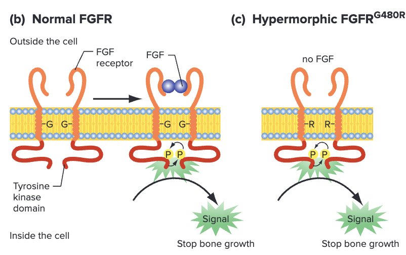
>

Neomorphic mutations
- Neomorphic alleles produce mutant proteins with anew function, or cause ectopic expression of genes.
  - The dominant Huntington disease allele (HD) is aneomorphic allele that makes a mutant Htt protein
  
  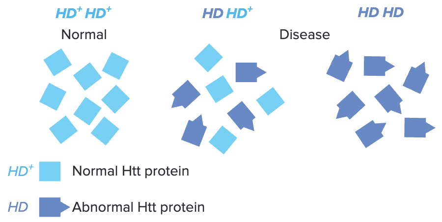

> The dominant neomorphic allele Antp^Ns causes antenna-to-leg transformation
> - In Drosophila, the Antennapedia (Antp) gene encodes a protein that promotes leg development
> - Flies that are Antp^Ns/Antp⁺ (or Antp^Ns/Antp^Ns) have legs on their heads in place of antennae
> - The Antp^Ns mutant allele is dominant because the wildtype Antp⁺ allele does not prevent the ectopic expression of Antp protein in the cells that will develop into antennae.
> - A mutation in the enhancer of Antp^Ns allele to be expressed in the antenna precursor cells.Therefore, the heterozygotes carrying the Antp^Ns allele have legs on their heads in place of antennae.

Antimorphic mutations
- Some dominant mutant alleles of genesencode proteins that not only fail to provide the activity of the wild type protein, but also prevent the normal protein from functioning. Such alleles are called dominant-negative, or antimorphic, alleles.
- Antimorphs are dominant-negative mutations acting antagonistically to normal gene activity.The phenotypic severity of an antimorph is worse in heterozygous conditions.

> The Kinky allele of Axin in mice is a dominant negative mutation
> - The mouse Axin gene encodes an inhibitor of the Wnt signaling pathway that regulates embryonic development
> - In the heterozygotes that carry the kinky allele, the tail is kinky because protein encoded by the mutant kinky allele forms complexes with the wild-type Axin1 protein or other proteins involved in the Wnt signaling pathway.

Interactions of genes in a developmental pathway must be determined
- Analysis of effects of one gene on expression of another gene: Does a mutation in one gene affect the level or distribution of mRNA or protein from another gene?
- Analysis of double mutants – epistatic interactions: Do mutations in two different genes define successive steps in a pathway?

Synthetic lethals
- when two viable single mutants are intercrossed, the resulting double mutants are lethal.

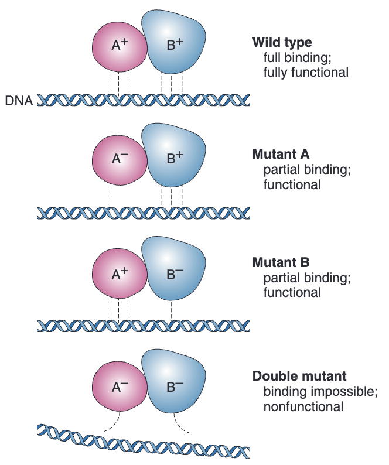

Bacteria Use CRISPR/Cas9 to defend Against Viruses

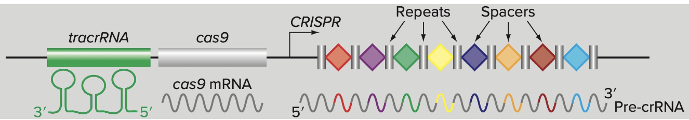

- CRISPR stands for Clustered Regularly Interspaced Short Palindromic Repeats. It is a region in many bacterial genomes that functions like an immune system to protect bacteria from viruses.
- Within the CRISPR region, there are short repeated DNA sequences. These repeats are separated by unique DNA sequences called **spacers**.
- These spacers are actually pieces of DNA from viruses that previously attacked the bacteria. The bacteria capture these viral DNA pieces and incorporate them into genome.
- The CRISPR system relies on special enzymes called Cas proteins (CRISPR-associated proteins) that can cut DNA.
- Small RNAs generated from the tracrRNA（Trans-acting CRISPR RNA）locus pairs with the repeat sequences in the precrRNA

Steps of CRISPR Immunity
1. Spacer Integration: When a virus infects a bacterium, the bacterium captures fragments of the viral DNA. These fragments are added as new spacers in the CRISPR region by two proteins, Cas1 and Cas2.
2. Transcription and Processing: The CRISPR region is transcribed into a long RNA molecule called precrRNA; The tracrRNA (trans acting CRISPR RNA) pairs with the repeats equences in the precrRNA; An enzyme called RNAse III cuts the double stranded RNA to produce the crRNAs.
3. Targeting Invading Viruses: When a virus infects the bacterium again, it injects its DNA into the host cell. The crRNA binds to the viral DNA at one end and to the tracrRNA at the other end, forming a complex. This complex brings Cas9 to the viral DNA, where Cas9 makes a cut, stopping the virus from infecting the cell. (The crRNA, tracrRNA, Cas9 work together to target and cut the viral DNA.)

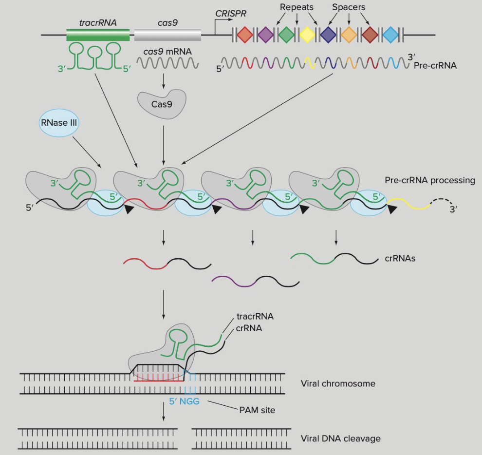

Important Features:
- The crRNAs are always next to specific DNA sequences in the viral DNA called PAM sites (NGG).
- In genetic engineering, scientists combine crRNA and tracrRNA into a single RNA molecule called sgRNA(single guide RNA).
- This sgRNA can guide Cas9 to any DNA sequence of interest in the genome of a eukaryotic organism

Gene editing by CRISPR/Cas9
- The sgRNA sequence is designed to bring the Cas9 endo nucleaseto a specific target in the genome adjacent to a PAM site
- Repair after Cas9 cleavage can result in a knockout; or a knockin if a DNA fragment suitable for homologous recombination is available

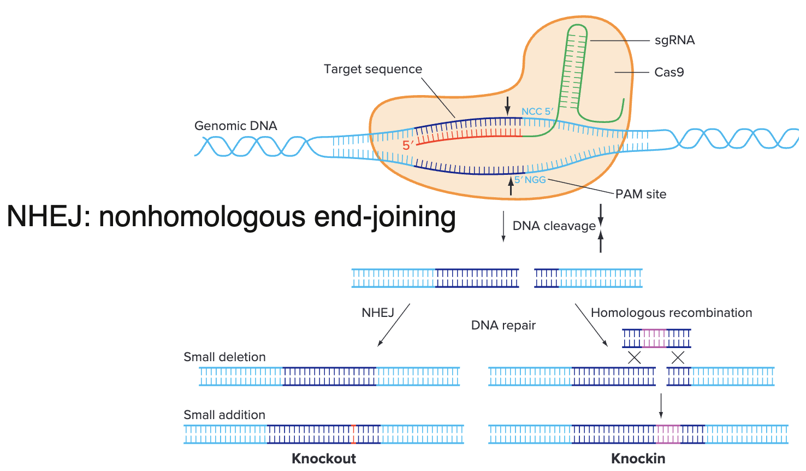

RNA interference (RNAi) knock down expression of target genes without knocking out DNA of target genes
- par-1 is involved in the formation of worm vulva
- Deletion of par-1 is embryonic lethal
- Using RNAi to knock down par-1 in adults causes abnormal development of vulva

Ectopic expression of genes with UAS-Gal4 systems in Drosophila
1. GAL4 are transcriptional activator proteins that bind to UAS elements in yeast
2. UAS is an enhancer that is adjacent to TATA box
3. After GAL4 binding with UAS, transcription is initiated

- 会有two strains:
  - Fly strains expresses GAL4 in various tissues driven by specific enhancers
  - Fly strains that have transgenic target genes with UAS in the upstream region
  
  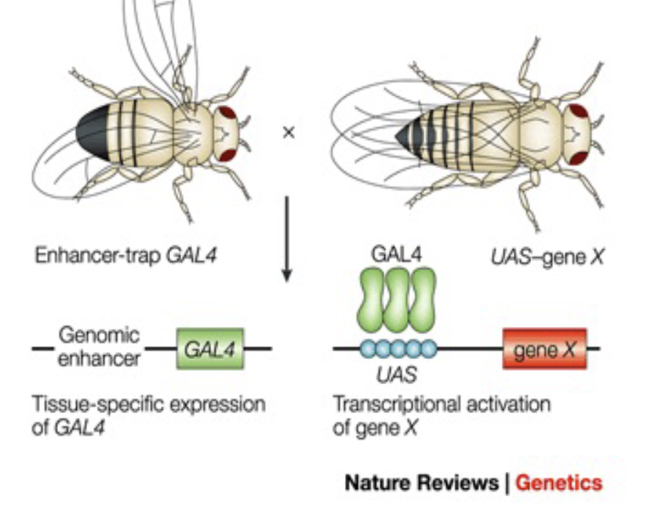

- generate tissue specific double strand RNA:
  
  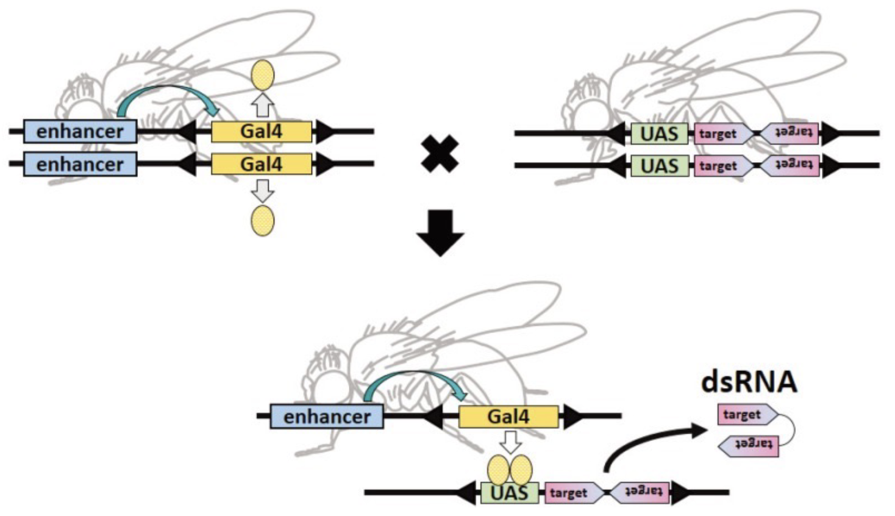

Using RNAi and UAS-Gal4 systems to knock down genes in Drosophila
1. injection of dsRNA into individual embryos
2. expression of an inverted repeat RNA in vivo

  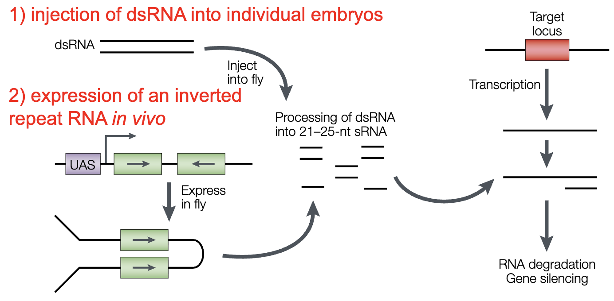

Development requires sequential changes in gene expression
- Cell fate is progressively refined
  - Once a developmental fate is determined, the cell and its descendants follow a differentiation path that excludes an alternative fate
- Transcriptional regulation plays a key role, Posttranscriptional gene regulation also is important
- Earliest stages of development require both maternal and zygotic gene products

Development exploits asymmetries
- In some species, the egg is inherently asymmetrical:
  - Drosophila egg has an anterior-to-posterior polarity because of connections to nurse cells at anteriorend
- In other species, asymmetries occur after fertilization
  - *C. elegans* – site at which sperm enters the egg
  - Mammals – asymmetry doesn’t occur until after four rounds of mitosis (16 cell embryo)

A Drosophila egg chamber
- Female Drosophila have two ovaries(卵巢), each ovary contains around 16 ovarioles(卵巢小管).
- The ovariole is a string of 6 or 7 sequentially developing egg chambers.
- An egg chamber comprises 16 germ-line cells, including one oocyte(卵母细胞) and 15 nurse cells.
- The nurse cells are polyploid and they synthesize nutrients and cytoplasmic components that are transported into the oocyte.
- Bicoid mRNA(调控前-后轴形成的 母体效应基因) is transcribed in nurse cells, they are transported into oocyte, and associates with microtubules in oocyte.

> Clearly defined segments are formed in the embryo and each segment forms a specific structure in the adult
> - Early in development, the products of segmentation genes subdivide the body into an array of identical body segments
> - Later in development, the products of **homeotic genes** assign a unique identity to each segment

Early Drosophila development: From fertilization to cellular blastoderm
- First 3 hours after fertilization:
  - Syncytial blastoderm(合胞体胚盘) formed by 13 very rapid mitotic divisions without any cell division, about 6000 nuclei
  - Cellular blastoderm(细胞胚盘) formed by cellularization that begins during interphase of 14th division
- Gastrulation (原肠胚) begins immediately after cellularization
  - Furrows (头沟) lead to establishment of three embryonic germ layers: mesoderm,ectoderm, endoderm
- First visible signs of segmentation appear **40 min** after gastrulation begins
- By 10 hours after fertilization, 14body segments are formed

  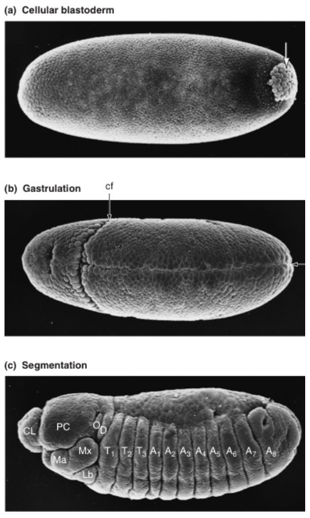

Four classes of genes responsible for segment formation in Drosophila embryos
- **Maternal genes** expressed bymother and the mRNAs depositedin egg, not translated until after fertilization.
> The bicoid and nanos are two master regulators that establish the anterior and posterior axis of the embryo.
- **Gap genes** –the first zygotic segmentation genes to be transcribed，including hunchback, kruppel, knirps, and giant
  - Gap genes are expressed in broad, overlapping bands along the length of the embryo.
  - Mutation of a particular gap gene results in the loss of segments corresponding to the zone of expression of that gap gene.
- Pair-rule genes – seven zones of expression that are controlled by gap gene products. Including ftz, Eve
  - Formation of Eve stripe 2 requires activation of eve transcription by the Bcd and Hb proteins, and the absence of repression by the Gt and Kr proteins.
  - Mutation of a particular gap gene results in the loss of segments corresponding to the zone of expression of that gap gene.
  
  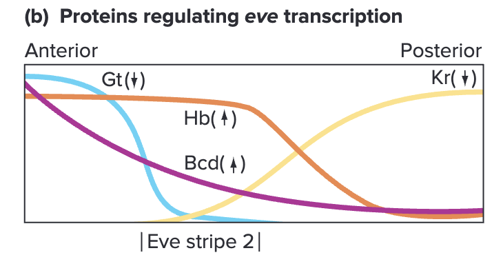

- Segment polarity genes – expressionin 14 segments is controlled by pair-rule gene products. Including hedgehog, wingless, engrailed

Summary of segment number specification
- The pattern of expression for members of each segmentation gene class is controlled either by genes higher in the hierarchy or by members of the same class, never by genes of a lower class.
- The maternal genes control the gap and pair-rule genes
- The gap genes control themselves and the pair-rule genes, and the pair-rule genes control themselves and the segment polarity genes.
- The expression of genes in successively lower parts of the hierarchy is increasingly restricted spatially within the embryo.
  
  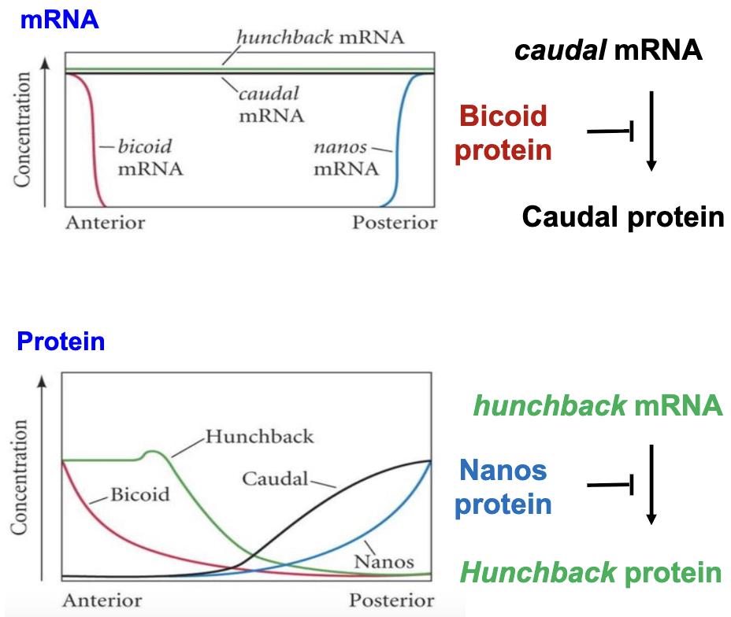

Segment identity is preserved throughout Drosophila development, Each embryonic segment defines a specific structure in the adult
- 3 head segments
- 3 thoracic segments
- 8 abdominal segments

Homeotic selector genes (hox) in Drosophila determining segment identity after gastrulation

Homeodomain is a 60 amino acid DNA-binding domain found in homeotic genes (at ANT-C and BX-C), and some non-homeotic genes (bicoid and eyeless).

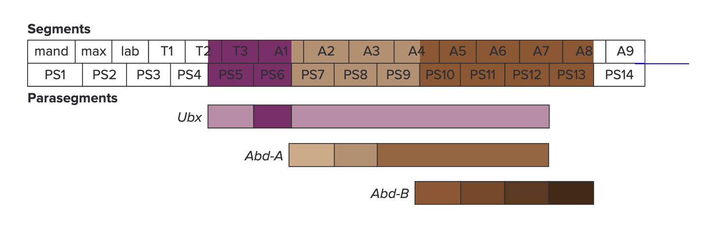

Ubx specifies hindwing as haltere
- Ubx represses genes involved in wing formation in T3

Segment identity is established by homeotic genes
- Transcription of homeotic genes is controlled by gap,pair-rule, and segment polarity genes
- At the cellular blastoderm stage, each homeotic geneis expressed within a subset of body segments
- Homeotic genes are master regulators that control transcription of many genes responsible for development of segment-specific structures
- Homeotic mutations cause particular segments to develop as if they were located elsewhere in the body

Homeodomain Proteins define the anterior-posterior body axes
- Humans and other mammals have 38 Hox genes that are in four clusters in all organisms
- Linear order of genes in each cluster reflect their anterior-to-posterior expression。
- Deletion of limb bone elements by the deletion of paralogous Hox genes