# Chapter 0 introduction

### A brief history of modern genetics

- Early history:
  - Inheritance of acquired characteristics(Lamarck)
  - Blending inheritance
  - Natural Selection

    Darwin failed to answer 2 questions
  - Mendel
  - Morgan 
  - McClintock

### What is Genetics

heredity, inheritance
variation

relationship between heredity and variation:

### Why do we study Genetics

preductive and preventative medicine
gene therapy: 
    butterfly child--insertion
    OTC deficiency--adeno-associated virus(without insert into genome)
        ARCUS 
《the code breaker》

### the themes of modern genetics

regulatory networks
modular
- DNA is the fundamental information molecule of life

human genome has about 3*10^3 base pairs

why DNA is the heredity molecule: have the ability to store, replicate, mutate, express information
    RNA is less stabla than DNA(脱氧和U?)

# Chapter 1 Mendal's Law of Inheritance

## Mendel's breakthrough

> Key words
> - law of segregation（分离定律）
> - law of independent assortment（独立分配定律）
> - reciprocal cross（反交）
> - backcross（回交）
> - testcross（测交）
> - inbreeding, incross（内交，近交）
> - outbreeding, outcross（外交，远交）
> - P: parental generation（亲本，亲代）
> - F1: first filial generation（子一代）
> - F2: second filial generation（子二代）
> - selfing line（自交系）
> - inbred line, inbred strain（近交系）
> - product rule（乘法法则，相乘定律）
> - sum rule（加法法则，相加定律）
> - hybrid（杂种）
> - monohybrid（单杂种，单因子杂种）
> - dihybrid （双因子杂种，双因子杂合子）
> - multihybrid（多基因杂种）
> - Punnett square（Punnett 棋盘式方格）
> - branched-line diagram（分支图）
> - pedigree（系谱，家谱）
> - consanguineous mating（近亲交配）

**Garden pea(*Pisum sativum*)**:
- Stigma & Anthers -> **self-fertilization**
- **Pure breeding**: produce offspring carring specidic parental traits that remain constant from generation and generation

**TOPIC:**What is an ideal experimental organism
> Aging and longetivity research: Shortest-lived vertebrate species bred in the lab: *Turquoise killifish*
> (due to the short rain season in Africa)
> - Cancer and aging research: Naked mole rat
> (Rarely get cancer; resistant to some types of pain; survive up to 18 minutes without oxygenl; Do not age; Fertility does not drop as they age)

**Keys to Success:**
  1. ideal experimental organism
    - Vigorously(茁壮的) grow
    - Self-fertilize
    - Easy to cross-fertilize
    - Produce large number of offspring each generation
  2. pure-breeding lines (2-year trial experiment)
  3. analyzed traits with descrete alternative form(Black and white experiment)
  4. numerical analysis

#### Law of Segregation

Monohybrid crosses reveal units of inheritance and **Law of Segregation** (**Reciprocal cross**互交)

Two alleles for each trait separate (**segregate**) during gamete formation, and then unite at random, one from each parent, at fertilization.

> Using The Punnett Square to present the law of segregation

对于实验的若干解释: **Dominant** & **recessive**
- Disappearance of traits in F1 generation and reappearanc in the F2 generation **disproves the hypothesis that traits blend**
- 实验要求: Trait must have two forms that can each breed true
-  One form must be hidden when plants with each trait are interbred
-  

**Testcross** reveals unkown genotype: to cross with a homozygous recessive

#### Law of Independent Assortment

Dihybrid crosses reveal the **law of independent assortment**

对于实验的若干解释：
- A dihybrid is an individual that is heterozygous at two genes
- F2 generation contained both parental types and recombinant types
- Alleles of genes assort independently, and can thus appear in any combination in the offspring

During gamete formation different pairs of alleles segregate independently of each other

#### Summary

- Inheritance is **particulate**, not blending
- There are two copies of each trait in a germ cell
- Gametes contain one copy of the trait
- Alleles (different forms of the trait) segregate randomly
- Alleles are dominant or recessive - thus the difference between genotype and phenotype
- Different traits assort independently

#### Mendelian inheritance in HUMAN

Most traits in humans are due to the interaction of multiple genes and do not show a simple Mendelian pattern of inheritance

**Pedigrees** help us infer if a trait is from a single gene and if the trait is dominant or recessive

**Pedigree analysis**

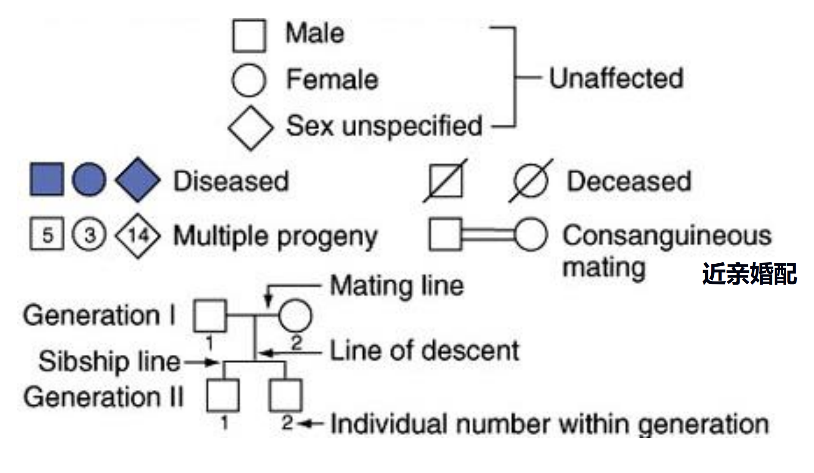

- A vertical pattern of inheritance indicates a rare dominant trait
> Huntington's disease: A late-onset neurodegenerative genetic disorder that causes uncontrolled movements, emotional problems, and loss of cognition.
> **Poly Q** - a gain of toxic function of mHtt

- A horizontal pattern of inheritance indicates a rare recessive trait
> Cystic fibrosis: A fatal and incurable disorder in which the lungs, pancreases, intestines and other organs become clogged with a viscous mucus that interfere with breathing and digestion

- Puzzling pedigree
> Progeria: a *de novo* dominant trait, an extremely rare genetic disorder with premature aging symptoms there is no known cure, few people with progeria exceed 13 years of age.
>
> 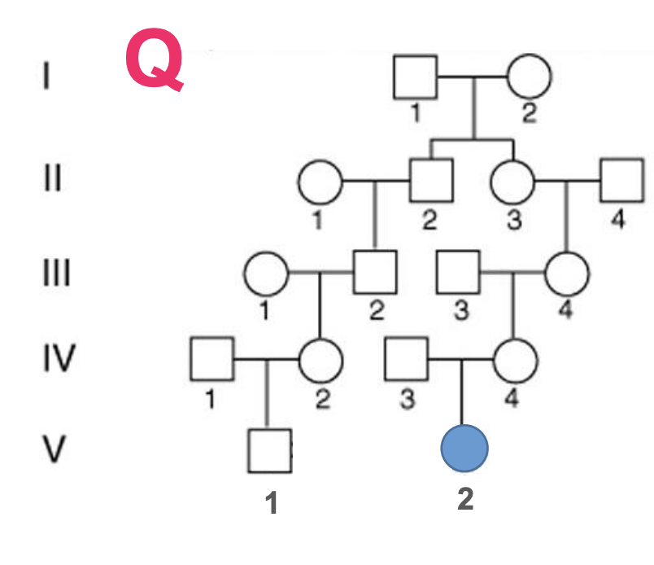
>
> Mutation occurs during cell division in a newly conceived zygote or in the gametes of one of the parents
> 
> Treacher Collins syndrome(TCS): a *de novo* dominant trait, a disorder of craniofacial development.

## Extension to Mendal's Law

key word
- Incomplete dominance 
- Codominance
- Multiple alleles
- Pleiotropy
- lethality
- complementary gene action
- complementation test
- heterogeneity
- redundancy, redundant gene
- epistasis, epistatic effect, epistatic gene
- hypostatic gene
- recessive epistasis
- dominant epistasis
- penetrance（外显率）__incomplete penetrance
- expressivity（表现度）__variable expressivity
- discrete trait（不连续性状）
- quantitative trait（数量性状）
- continuous trait（连续性状）
- phenocopy（拟表型，表型模拟）

#### Single-gene inheritance

###### Incomplete dominance: 

F1 hybrids that differ from both parents express an intermediate phenotype. Neither allele is dominant or recessive to the other. Phenotypic ratios are same as genotypic ratios.

> Snapdragons *Antirrhinum majus*
>
> 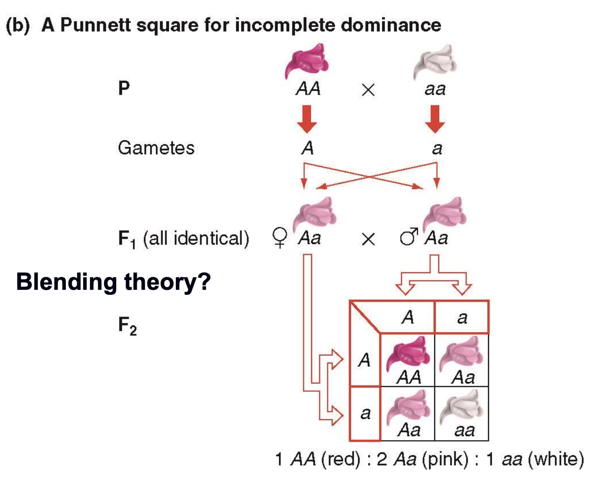
>
> horse

###### Codominant: 

both traits appear equally, Phenotypic ratios are same as genotypic ratios.

> lentil coat patterns
> 
> blood type

###### Multiple alleles: 

1. Genes may have multiple alleles that segregate in populations.
2. Although there may be many alleles in a population, each individual carries only 2 of the alternatives.
3. Dominance or recessiveness is always relative to a second allele.

> ABO blood type:
> Enzymes add sugar A or sugar B to a base consisting of a sugar polymer known as substance H, resulting in antigen A or antigen B respectively
>
> 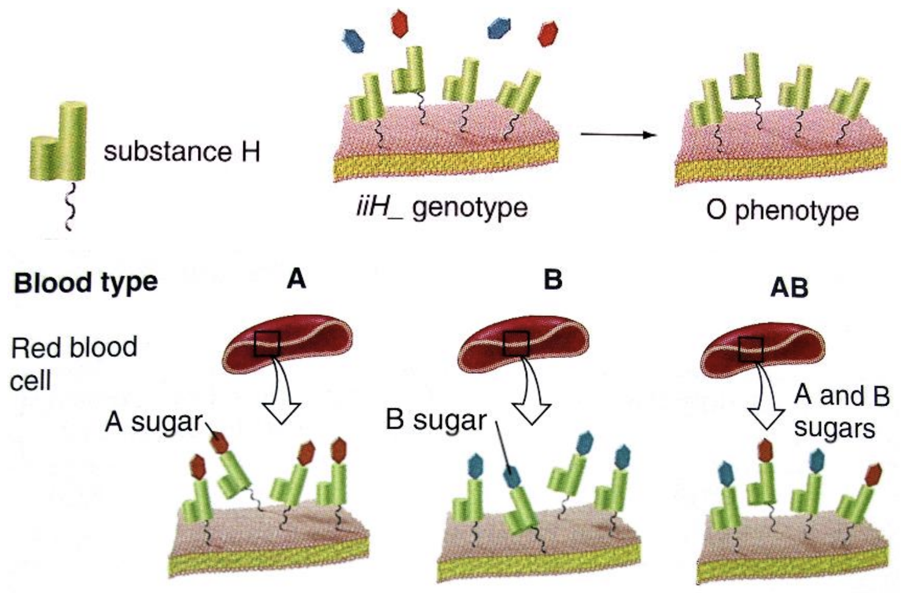
>
> The eye color of Drosophila

- Establishing dominance relations between multiple alleles: Perform **reciprocal crosses** between pure breeding lines of all phenotypes.

**TOPIC**:Mutations are the source of new alleles
Allele frequency is the percentage of the total number of gene copies represented by one allele.
  Wild-type allele —— the most common allele in a population
  Mutant allele —— a rare allele in the same population
  Monomorphic —— gene with only one common, wild-type allele
  Polymorphic —— gene with more than one common allele

###### Pleiotropy: 

a single gene determines more than one distinct and seemingly unrelate characteristic, Each protein can have a cascade of effects on an organism, Some alleles may cause lethality

> Respiratory problems & Sterile

> A. Yellow must be AYA, and AY is dominant to A
> B. AY is recessive lethal! AYAY die in utero and do not show up as progeny.
> 
> 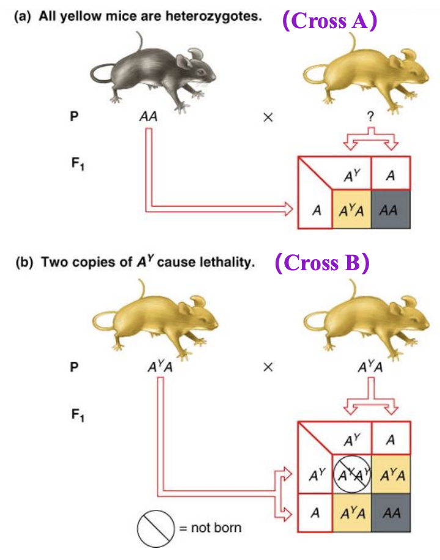

> Sickle-Cell Anemia: both Mutliple alleles & Pleiotropy
> Pleiotropy part: Sickling & Resistance to malaria & Recessive lethality
> - clog the small blood vessels -- Shortness of breath, muscle cramps, fatigue
> - Very fragile -- Anemia
>
> 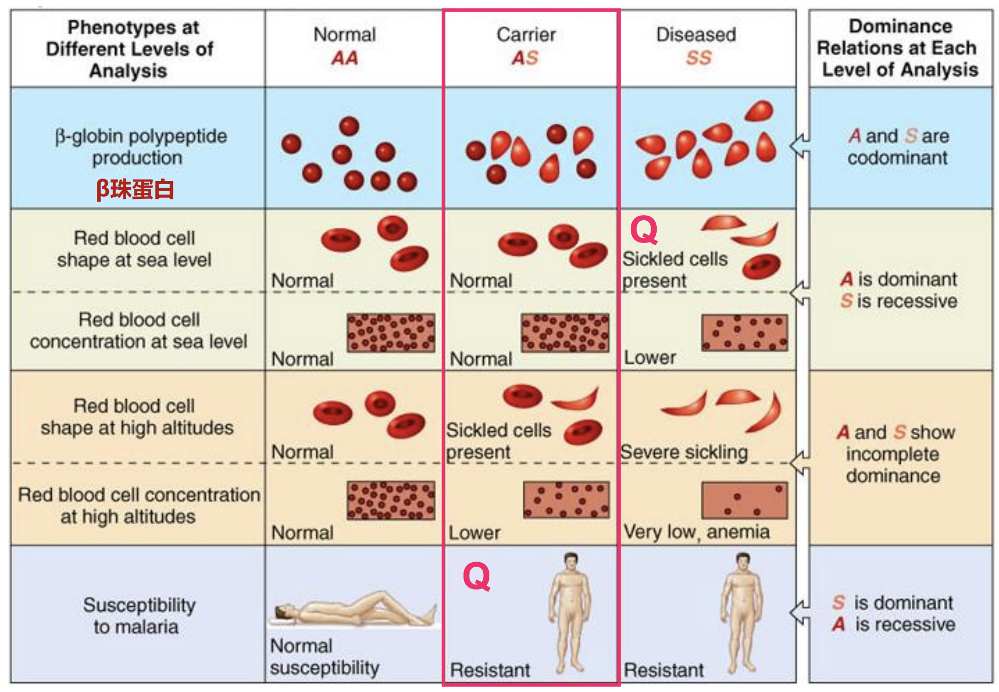
>  
> Malaria parasites cause sickle-shaped blood cells to break down before the malaria parasites can reproduce.

Some alleles may cause **lethality**

#### Multifactorial inheritance

###### The action of two or more genes

**Penetrance and expressivity:**

Each genotypic class (defined in terms of the presence or absence of the dominant allele of two genes) determines a particular phenotype:
  -  both present 
  -  one present 
  -  the other present 
  -  neither present 

> The shape of cockscombs
>
> 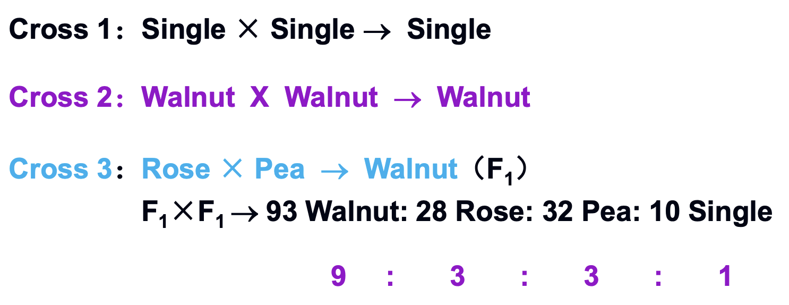
>

**Complementary gene action**: 

> color in sweet peas:
> A_B_(purplr) & others(white) = 9:7
>
> 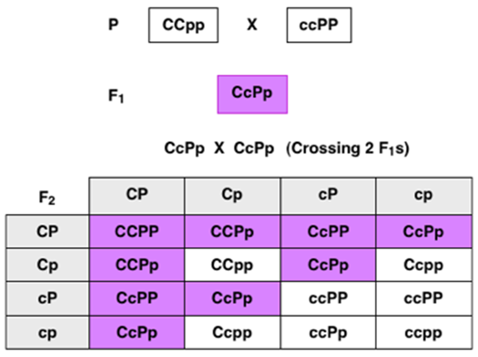
>

> A possible explaination
>
> 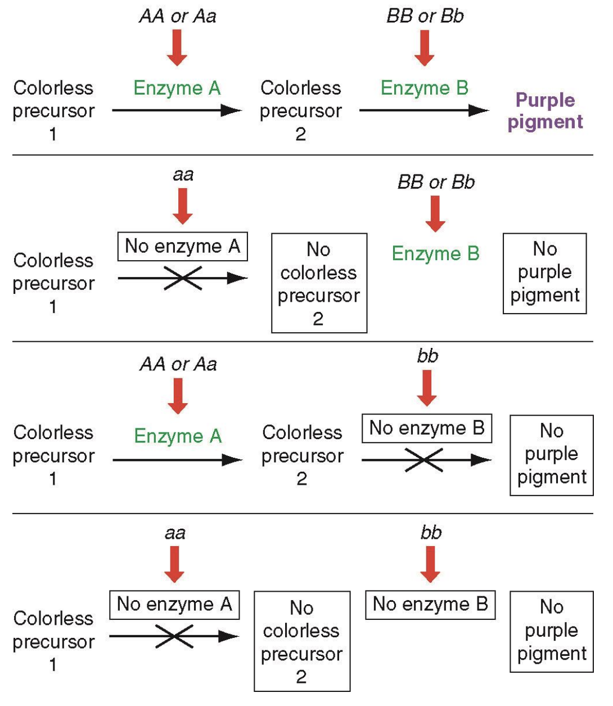
> 

> in human deafness
> Complementation: if offspring receiving two mutations one from each parent - express the wild-type phenotype, complementation has occurred.
> Complementation test can determine if mutations arise from the same or different genes.

**9:7 ratio is a phenotypic signature of complementary gene interaction where dominant alleles of two genes act together (A_B_) to produce a trait while other three genotypic classes do not.**

**Epistasis**: 

a gene interaction in which the effects of an allele at one gene is masked, inhibited, or modified by one or more other genes, known as modifier genes

> coat color in Labrador retriever dog
> 
> 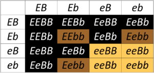
> 
> **recessive epistasis**

**9:3:4 is a telltale ratio of recessive epistasis at F2**

> Bombay blood type
> the woman lack of substance H(hh),so the recessive allele(h) masks the effects of any ABO alleles
> 
> 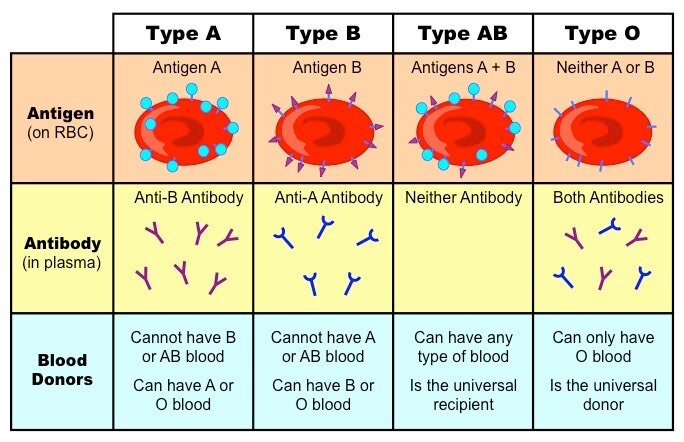
> 
> Bombay blood type can only accept blood from another Bombay blood type indivitual

> summer squash
> 
> 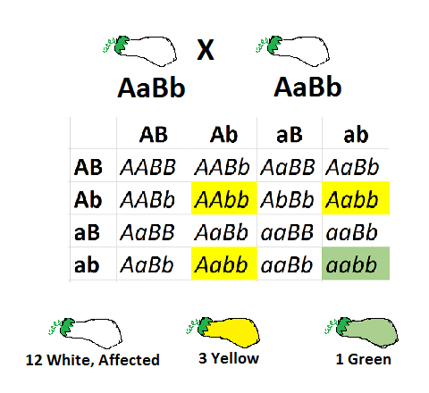
> 
> Green(Chlorophylls)->Yellow(Carotenoid)
> 
> 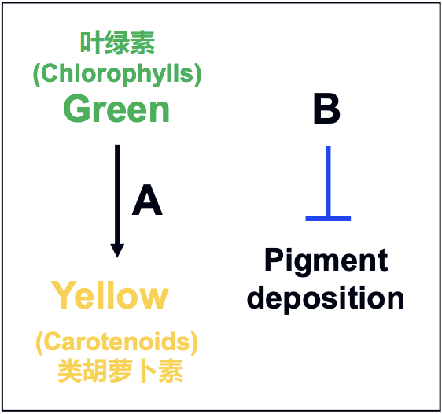
> 
> **Dominant epistasis**

> chicken feather: A profuces color only in absence of B
>
> 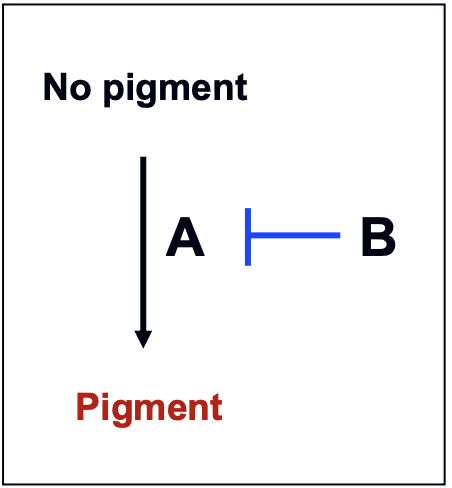
> 
> 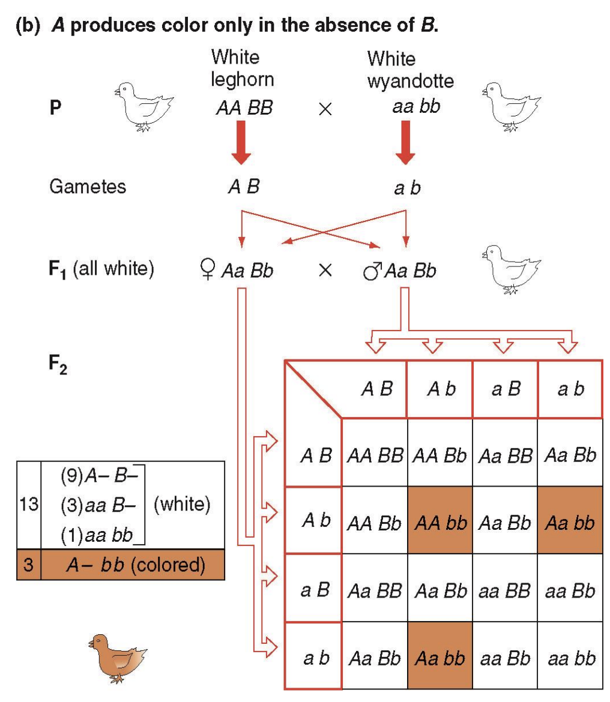
>

**12:3:1 and 13:3 are telltale ratios for dominant epistasis.**

**Duplicate effect**:

provide alternative genetic determination of a specific phenotype.

> Duplicate effect in shepherd's purse
>
> 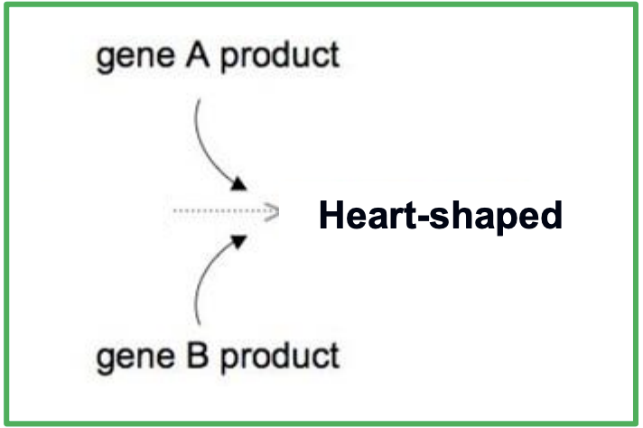
> 
> **Redundancy**: more than one gene acting in a totally same pathway
> At this time we can do gain-function experiment(overexpress), and do the lost-function experiment to know the genotype
> however sometimes is not redundancy but complementary....?
> *test*

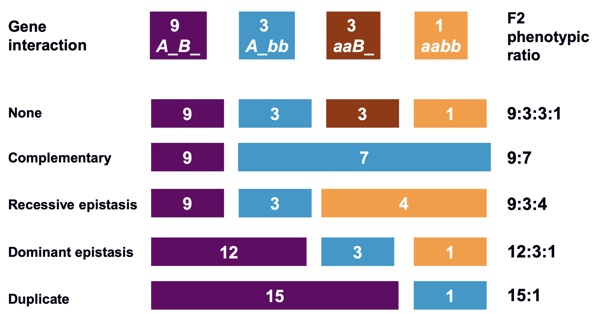

**Testing two gene and one gene hypothesis**

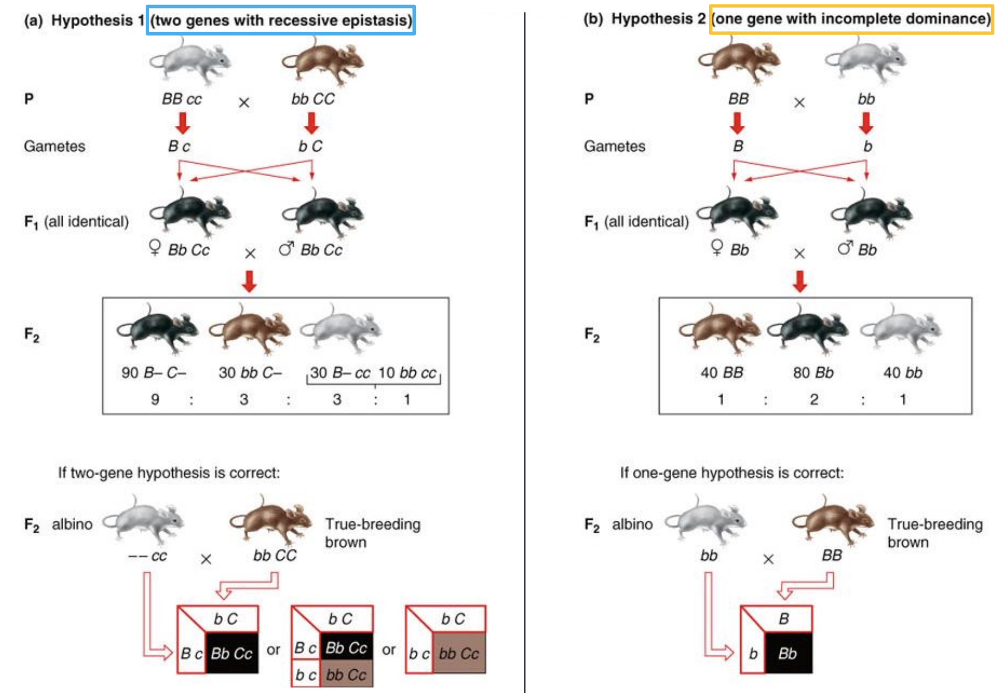

  - 9:4:3(recessive epistasis) & 1:2:1(incomplete dominance)-> backcross
  - pedigree analysis can be used to tes trait inheritance hypothesis in humans:
  > OCA(Oculocutaneous albinism)

###### Interactions between genes and the environment

- Penetrance: percentage of a population with a particular genotype that show the expected phenotype
> Penetrance can be complete (100%) or incomplete (e.g.,retinoblastoma penetrance is 75%).
**Gene interactions**: two genes can interact to determine one trait

- Expressivity: degree or intensity with which a particular genotype is expressed in a phenotype
> Expressivity can be variable or unvarying.

Factors that alter the phenotypic expression of genotype include: 
- Modifier genes
  - Modifier genes have a more subtle, secondary effect, while major genes have a large influence.
- The environment
  > Hydrangea （绣球花）:
  > The more alkaline the soil, the pinker the flowers
  > Siamese cat: 
  > Melanin is produced only in the cooler extremities

  > Phocomelia: chemical exposure
**Phenocopy**: a change in phenotype arising from environmental agents that mimics the effect of a mutation at a gene
- Chance

# Chapter 2 The Chromosome Theory of Inheritance and Linkage Analysis

## The chromosome theory of inheritance

key words:
- somatic cell（体细胞）
- germ cell（种质细胞）
- homologous chromosome（同源染色体）
- autosome（常染色体）
- crossing-over, crossover（交换）
- chiasma (chiasmata)（交叉）
- recombination nodule（重组结）
- karyotype（核型分析）
- hemizygous（半合子）
- sex-limited trait（限性性状）
- sex-influenced trait（从性性状）
- criss-cross inheritance（交叉遗传）

#### Chromosomes: the carriers of genes

Genes reside in the nucleus

> microscopists studying fertilization in frogs and sea urchins

> Flemming investigated the process of cell division
> He identified **chromatin** was correlated to threadlike structures in the cell nucleus – the chromosomes

> Cajal

> Walter Sutton
> Studied **Great lubber grasshopper**--
> Smotic cells contained 22 chromosomes +XY; Gametes contained 11 chromosomes and X/Y
> easy to distinguish different pairs of chromosome

**The boveri-sutton chromosome theory:**
- chromosomes as the carriers of genetic material.
- linear structure--loci
- paired factors
- carriers of genetic material

Haploid gametes produce diploid zygotes at fertilization
> **Haploid**: a single chromosome set
> **Diploid**: two matching chroomosome sets
>
Anatomy of a chromosome

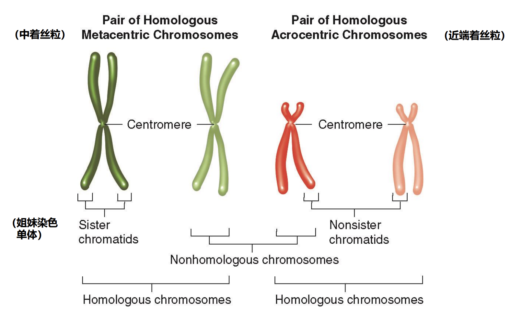

Homologous chromosomes match in size, shape, and banding patterns

- centromere
- Metacentric Chromosomes
- Acrocentric Chromosomes
- Metaphase chromosomes are identified by the position of chromosomes

**Karyotype**(核型分析): shows the stained chromosomes of a single organism in homologous pairs of **decreasing size**(大小递减的排列)

**TOPIC**: WHY DOES THE NUMBER OF CHROMOSOMES MATTER
- Only one: Restrain the diversity
- One hundred: mistakes in cell division

Nonhomologous chromosomes are qualitatively different

> Jimsonweed （蔓陀罗）:
> trisomy （三体） in any of these 12 chromosomes produced a unique phenotype of seed pod shape, deviating from a wild-type spherical shape.
> 
> Trisomy 21
> why only trisomy 21 patients: for other chromosomes maybe lethal, they are bigger and have more genes.

#### Sex chromosome and sex determination

Sex chromosome:
- Provide basis for sex determination
- One sex has matching pair（同配性别）XX
- Other sex has one of each type of chromosome（异配性别）XY

SRY(sex determining region of Y) is the primary determinant of maleness
> in sex-reversed XX male, one of the X chromosomes carries SRY
> sex-reversed XY females lacks functional SRY on Y

- a little piece of DNA that makes girls boys: Sox9(downstream of SRY, in chronosomes 11) determines maleness
  SRY->Sox9->Maleness

- Dosage compensation(how to proof?)
> mammals: inactivation of one X
> flies: 2X transcription rate of a single X
> worms: repression of both X to half

- Sex determination in fruit flies and humans
  - human: the presence or absence of Y, and human can tolar the XXX
  - Drosophila: the number of X chromosomes

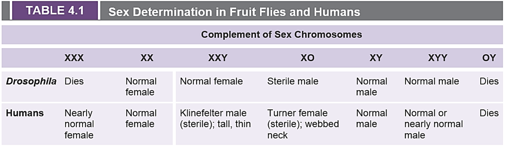

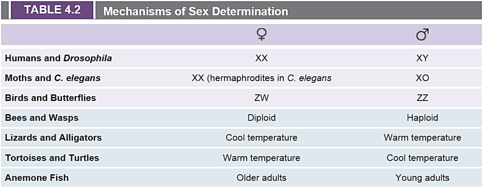
  
> Natural sex changes in clownfish
> When the dominant female dies, the dominant male changes sex to take her place, while the largest juvenile male becomes the new dominant male, triggered by social cues and hormonal shifts
> 推测有可能和感受群体中的信息素有关

#### Mitosis, meiosis and gametogenesis

Somatic cells vs germ cells

Mitosis: Genetically conservative
- Prophase-Prometaphase-Metaphase-Anaphase-Telophase-Cytokinesis
- Interphase: the period between cell divisions, consisting of the G1, S, and G2 phases
  - S phase: chromosomes replicate to form sister chromatids during synthesis;

Meiosis:One source of the genetic variation that fuels evolution
- crossing-over: An exchange of parts between nonsister chromatids during pachytene. As a result, chromatids may no longer be of purely maternal or parternal origin.
- contributes to genetic diversity:
  - Independent assortment of nonhomologous chromosomes creates different combinations of alleles among chromosomes
  - crossing-over between homologous chromosomes creates different combinations of maternal and paternal information.
  - Random union of genetically distinct sperm and egg.

- **Oogenesis**
  - Diploid germ cells called oogonia(卵原细胞) multiply by mitosis to produce primary oocytes
  - Oogenesis begin in the fetus(婴儿期)

  > Maternal age correlates with meiotic segregational errors

  > Prenatal genetic diagnosis:
  > - amniocentesis
  > - non-invasive sequencing of cell-free genome
  > NIPT: obtain the fetal DNA in a sample of mother's blood

- **Spermatogenesis**
  - Symmetrical meiotic divisions produce four functional sperm
  - Mitosis produces diploid primary spermatocytes
  - Spematids mature into functional sperm

#### Validation of the chromosome theory of inheritance

Morgen's theory:

TOPIC: Nondisjunction of chromosomes during meiosis
Calvin Bridges's Primary exceptional progeny

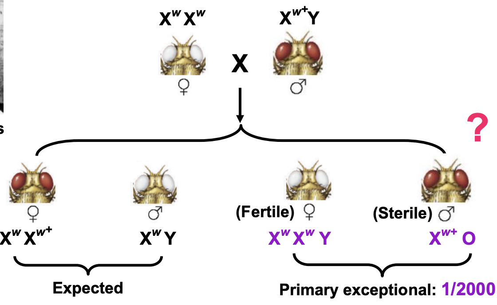

Validation:

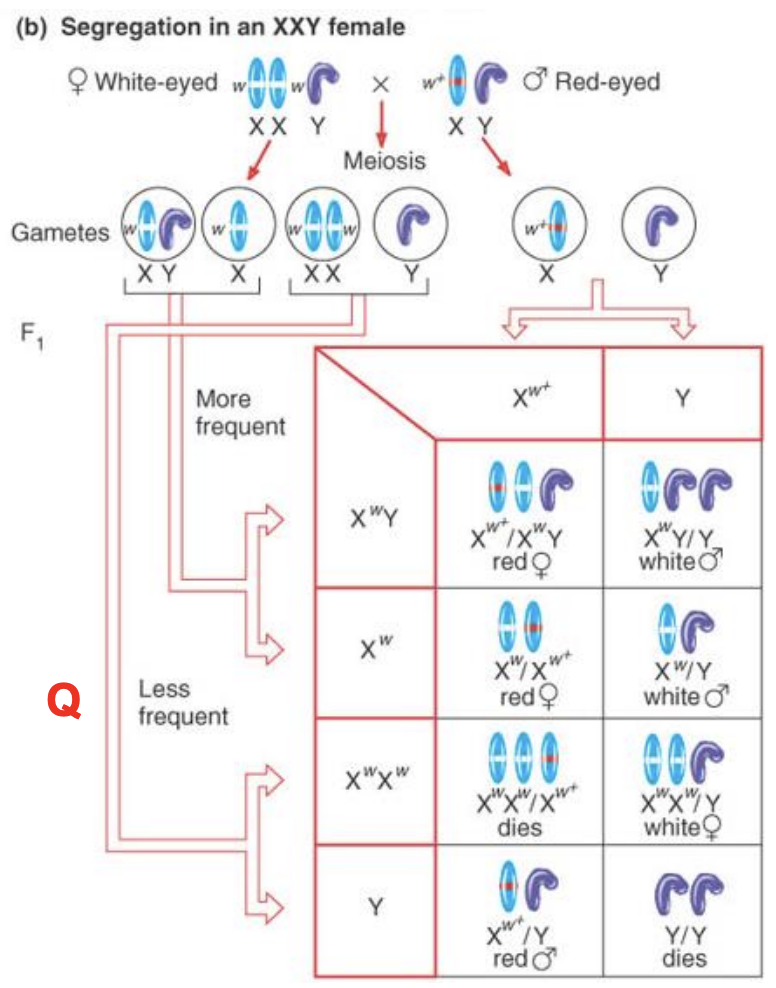

#### Sex-linked traits in human

> X-linked recessive trait in human--hemophilia
> difficulty in which bloof can't clot normally
> treatment: injection of cloting factot

X-linked recessive trsits exhibit 5 characteristics:
- Trait appears in more males than females
- Mutation and trait never pass from father to son
- Affected male pass X-linked mutation to all daughters, who are heterozygous carriers（交叉遗传）
- The trait often skips a generation（隔代遗传）
- Trait only appears in successive generations if sister of an **affected male** is a carrier. If so, one half of her sons will show the trait

Sex-limited traits
Sex-influenced traits: traits can show up in both sexes, but are expressed differently in each due to hormonal differences.

> Premature pattern baldness（早老性斑秃）：
> dominant in men; recessive in women

## Linkage and recombination

key words:
- linkage（连锁）
- recombination（重组）
- parental type（亲组型）
- intrachromosomal recombination（染色体内重组）
- interchromosomal recombination（染色体间重组）
- genetic marker（遗传标记）
- linkage group（连锁群）
- goodness of fit（适合度）
- chi square test（卡方检验）
- null hypothesis（零假说，无效假说）
- p value（p值）
- recombination frequency（RF，重组率）
- centimorgan（cM，厘摩）; map unit（m.u.，图距单位）
- Locus（基因座）

#### Gene linkage and recombination

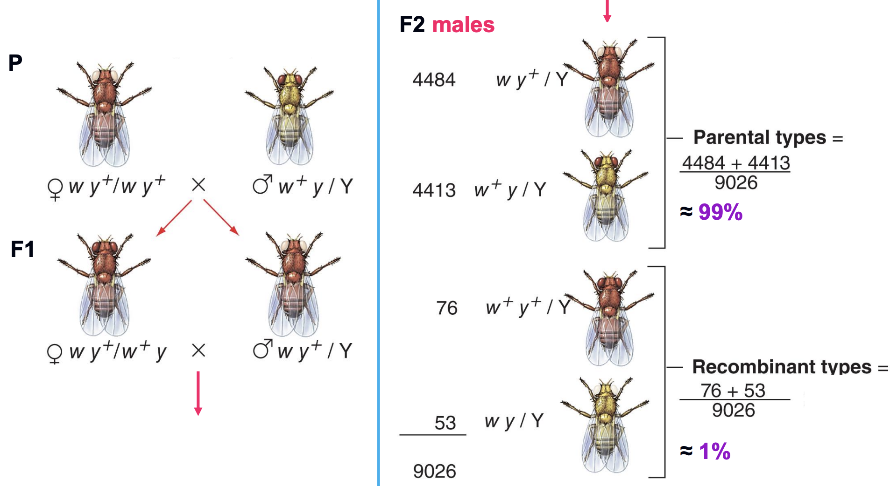

Autosomal genes can also exhibit linkage

> Colorblindness and hemophilia are X-linked traits

Detect linkage by generating a double heterozygote and crossing to homozygous recessive (testcross)

Recombination frequency, RF:

RF = Recombinant number/(Parental number + Recombinant number)
> A recombination frequency of less than 50% is a diagnostic for linkage.

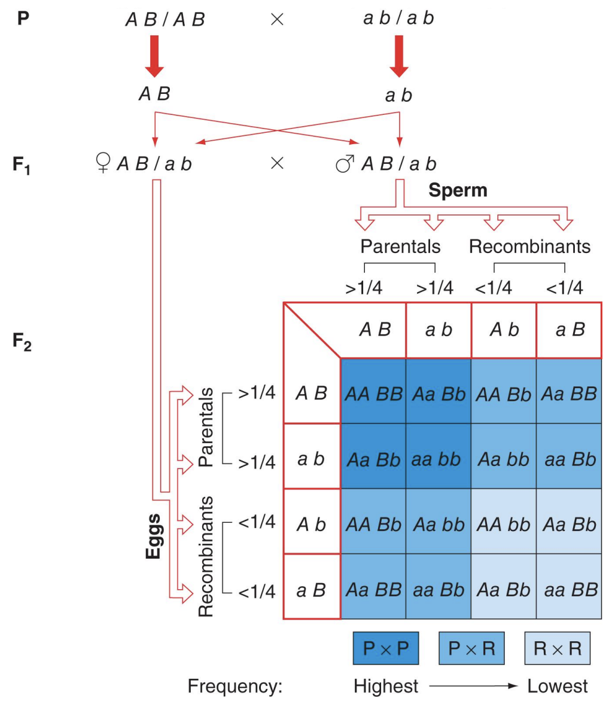

#### The Chi-square test and linkage analysis

Chi-square test measures “goodness of fit” between observed and expected (predicted) results

Chi-square test can reject the null hypothesis, but it cannot prove a hypothesis
- Null hypothesis: observed values are not different from the expected values ( Expect a 1:1:1:1 ratio of gametes)
- Alternative hypothesis: observed values are different from expected values (Expect significant deviation from 1:1:1:1 ratio)

Data needed:
- Total number of progeny
- How many classes of progeny
- Number of offspring observed in each class

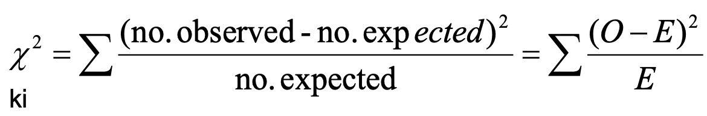

Degrees of freedom (df)-- df = N – 1 (where N is the number of classes)

Determine a p value using chi-square value and df

Use p value of 0.05 as cutoff
Chi-square values that lie in the yellow region of this table allow rejection of the null hypothesis with >95% confidence

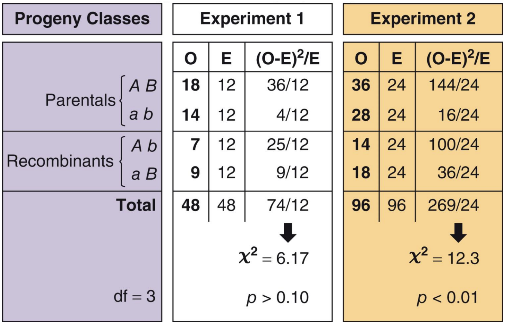

#### Recombinstion: A result of crossing-over

**Chiasmata** mark the sites of recombination

Morgen's theory: Different gene pairs exhibit different linkage rates because genes are arranged in a line along a chromosome. The closer together the two genes are on the chromosome, the less their chance of being separated by an event that cuts and recombines the line of genes

#### Summary

- Genes close together on the same chromosome are linked and do not segregate independently
- Linked genes lead to a larger number of parental class than expected in double heterozygotes cross
- Mechanism of recombination is crossing-over
- Chiasmata are the visible signs of crossing over
- Recombination frequencies reflect physical distance between genes
- Recombination frequencies between two genes vary from **0% to 50%**

## Mapping: locating genes along a chronosome

key word:
- two-point cross（两点杂交）
- two-point testcross（两点测交）
- three-point cross（三点杂交）
- three-point testcross（三点测交）
- coefficient of coincidence（C，并发系数）
- interference（I，干涉）
- chromosomal interference（染色体干涉）
- I = 1 - C
- gene mapping（基因定位，基因作图）
- tetrad analysis（四分子分析）
- octad（八分子）
- parental ditype（PD，亲二型）
- nonparental ditype（NPD，非亲二型）
- tetratype（T，四型）
- twin spot（孪生斑）
- genetic mosaic（遗传镶嵌）

#### Two point crossess

Recombination frequencies reflect the distances between two genes

1 RF = 1 m.u. (map unit) = 1 cM (centiMorgan)

limitation: 
- Difficult to determine gene order if two genes are close together
- Actual distances between genes do not always add up
- Pairwise crosses are time and labor consuming

#### Three point crosses

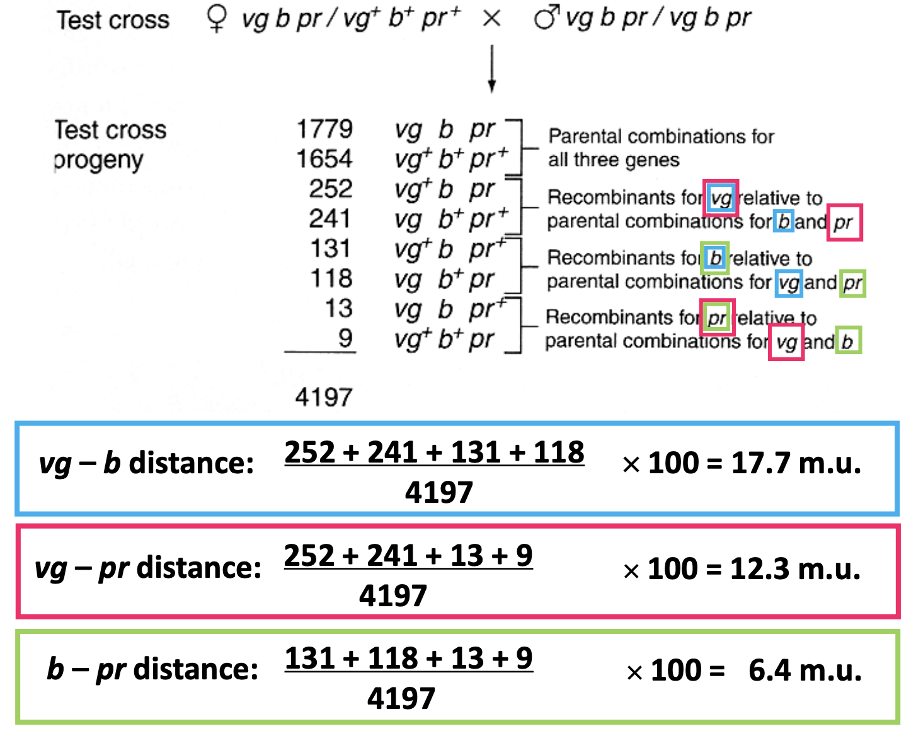

**Correction for Double Crossovers (DCO)**

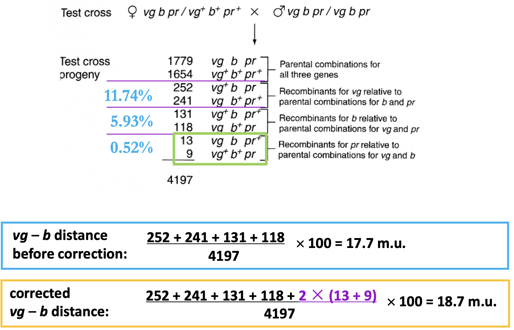

The RF of linked genes cannot exceed 50%: 
- Meioses without crossovers produce only parental chromosomes.
- Single and double crossovers produce a 1:1 parental to recombinant chromosome ratio on average.

Double recombinants indicate order of three genes: double cross is in the middle

**Chromosomal interference**: Occurrence of one crossover reduces likelihood that another crossover will occur in adjacent parts of the chromosome

Measuring interference: 
- coefficient of coincidence = $$\frac{\text{Observed Double Crossovers (DCO)}}{\text{Expected Double Crossovers (DCO)}}$$
- interference = 1 - coefficient of coincidence

Summary:
- Cross true breeding mutant with wild-type
- Analyze F2 individuals (**males** if sex linked)
- Determine order of genes based on parentals and recombinants
- Determine genetic distance between each pair of recombinants
- Calculate coefficient of coincidence and interference

> Cystic fibrosis (CF): A recessive condition
> 1. Pedigrees -> CF is encoded by a single gene;
> 2. Gene PON encoding Serum enzyme is linked to CF;
> 3. Linkage analyses with hundreds of DNA markers -> CF is on the long arm of chromosome 7;
> 4. Fine mapping with several other markers;
> 5. In 1992, CF gene was cloned.

**DNA marker**: a piece of DNA of known size, representing a specific locus, that comes in identifiable variations. These allelic variations segregate according to Mendel’s laws.

> a typical marker: RFLP--Restriction fragment length polymorphism
> southern blotting

> Nomenclature for Drosophila genes
> - Wild-type allele - denoted with a “+” 
> - Mutant allele - denoted with no extra symbol 
> - Recessive mutation - gene symbol is in lower case
> - Dominant mutation - gene symbol is in upper case

linkage provides the potential for transmitting favorable combinations genes
Recombination produces great flexibility in generating new combination of alleles.

**DNA polymorphisms**: 
- Most polymorphisms do not influence phenotype
- Four categories of genetic variation:
  - SNP
  - DIP/InDel: Insertion and Deletion
  - SSR: Simple Sequence Repeat
  - CNV: Copy Number Variation

**Copy number variant**: 顾名思义

**Single Nucleotide Polymorphism**

Genotyping can identify carriers and homozygous individuals.
many SNPs only in introns, so it has small influence in phenotype
> sickle cell anemia is caused by a SNP in the Hb gene

> Neurofibromatosis: 
> - autosomal, dominantly inherited
> - positional cloning example determines whether or nota SNP is linked to the neurofibromatosis gene，但有的时候会出现重组，利用重组率计算基因距离
>
> 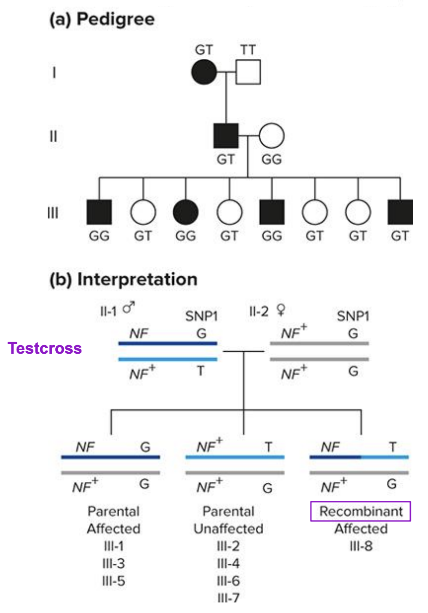

Determing genotype by sequencing PCR products.

**Simple Sequence Repeat**
are highly polymorphic
Genotype is dertermined by PCR at many SSR loci diferent from person to person

Multiplex PCR is used for DNA fingerprinting: 
> match DNA from crime scene to a person

> Multiolex PCR for DNA fingerprinting

####  Tetred analysis in fungi

ideal experimental organism-- Tetrad
- all four haploid products of meiosis are contained in ascus
- Ascospores（子囊孢子） within ascus germinate into haploid individuals
- Phenotype of haploid fungi is direct representation of their genotype

- Meiosis can generate three kinds of tetrads: PD & NPD (parental ditype & nonparental ditype)这是自由组合的事情
- Meiosis can generate three kinds of tetrads: T(tetratype)

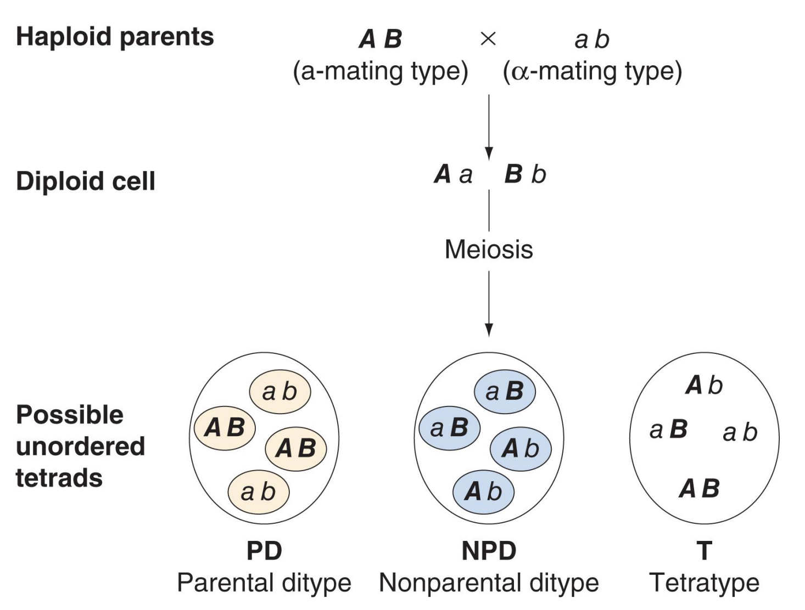

Linkage is demonstrated by PDs outnumbering NPDs: PD/NPD > 1, linked; PD/NPD = 1, unlinked

**A disproven model:** Recombination before chromosome duplication, which predicts most tetrads containing recombinant spores would be NPDs instead of Ts.

## Mitotic recombination and genetic mosaics

#### Mitotic recombination produces genetic mosaics

twin spots, single spot, singed spot
- yellow (y) mutant – yellow body
- Wild type (y+) – brown body
- singed (sn) mutant – short and curled bristles
- Wild type (sn+) – long and straight bristles

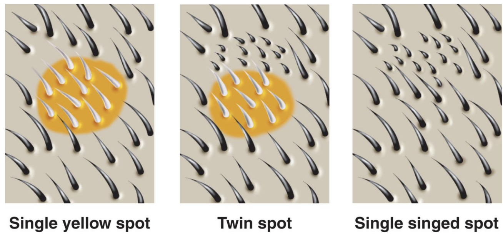

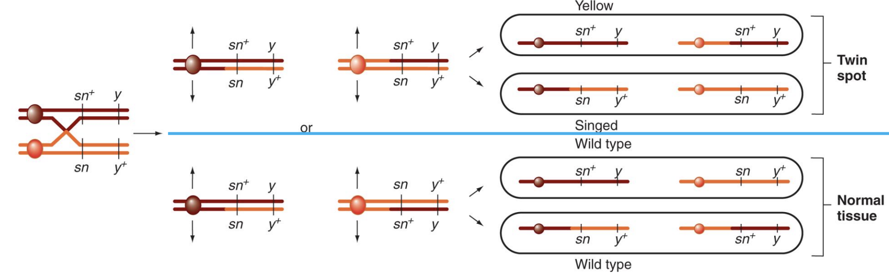

#### Application of mitotic recombination

Application:
> Mosaic clonal analysis using the FLP-FRT system相当于强制进行有丝分裂重组
>
> 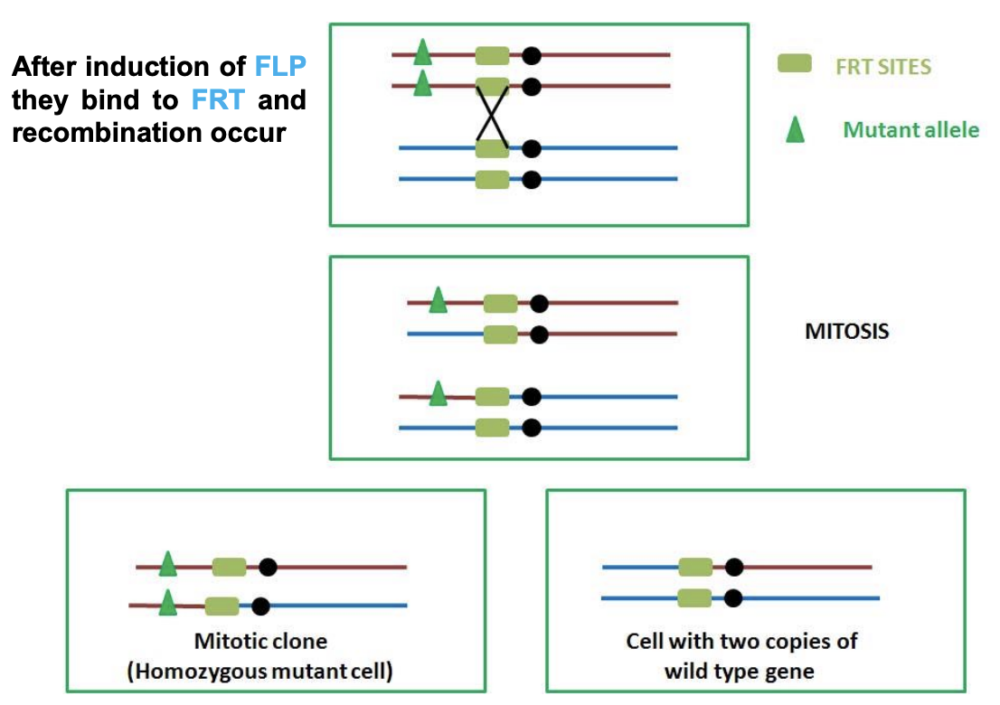

Origin of cancer
> retinoblastoma
> 可能有很多不同的生病原因
>
> 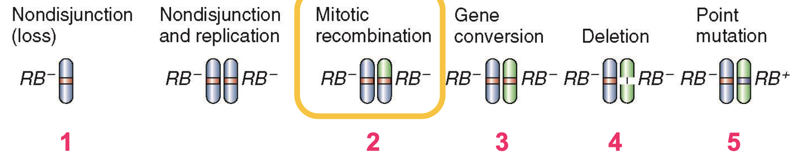
> 
> heterozygous form homozygous cells

> **The two-hit model**: It takes two mutational events to cause the cancer. The first mutational event can be inherited, whereas the second “hit” results in the loss of the remaining normal allele (gene).

mitotic recombination: start from heterozygous so the alleles must be dominant

## Mechanism of homologous recombination and gene conversion

key words:
- abnormal segregation（异常分离）
- gene conversion（基因转变，基因转换）
- chromatid conversion（染色单体转变）
- half-chromatid conversion（半染色单体转变）
- post-meiotic segregation（减数后分离）
- homologous recombination（同源重组，HR）
- general recombination（一般重组）
- hybrid DNA model（杂合DNA模型）
- double-strand break model（双链断裂模型）
- breakage and rejoining（断裂与重接）
- heteroduplex DNA（异源双链DNA）
- hybrid DNA（杂合DNA，杂种DNA）
- branch migration（分支迁移）
- Holliday intermediate（Holliday中间体）
- displacement loop（D-loop）

#### Homologous recombination

Types of DNA recombination: 
- Homologous recombination
- Site-specific recombination
- Transposition转座

> Meselson and Weigle: Experimental evidence
>
> 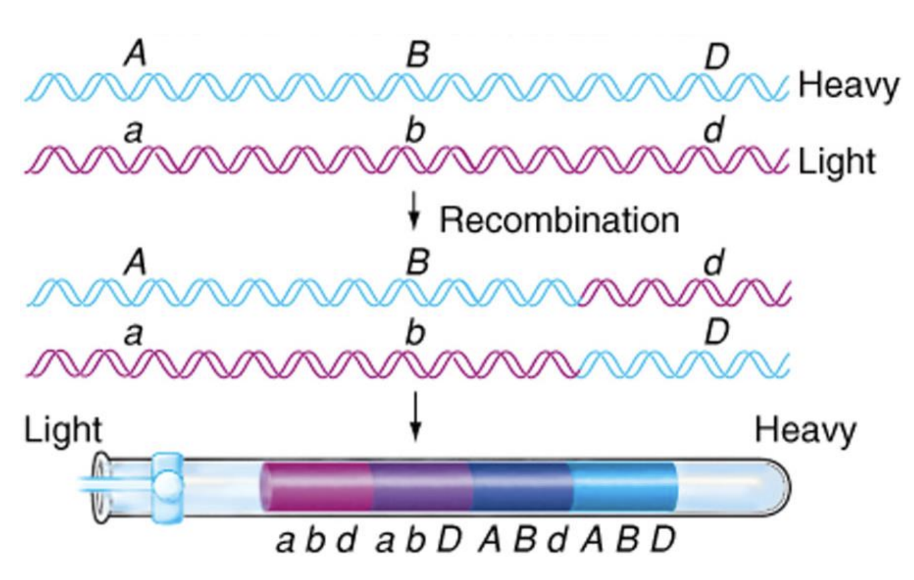
>

- homologous recombination: 同源重组
  - The double stranded break model:
  - Step 1: Double-strand break formation 
  - Step 2: Resection 
  - Step 3: Strand invasion
  - Step 4: Formation of double Holliday junction
  - Step 5: Branch migration
  - 会形成一个Heteroduplex region区域
  
  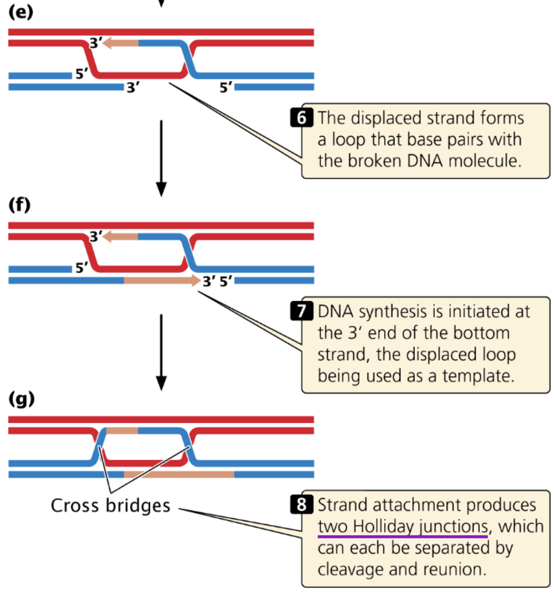

  > Holliday model
  > 
- site-specific recombination
  - The FLP-FRT system
  - Cre-Lox recombination
  - Brainbow strategies

  
#### Gene conversion

one ellele is converted to the allele on the homologous chromosome, resulting in nonreciprocal recombination

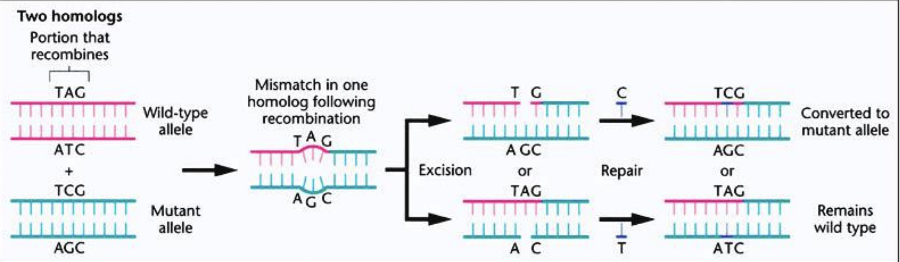

Gene conversion vs. mutation: 
- It occurs at a higher frequency (0.1 to 1%) than the corresponding mutation events;
- It always produces the allele present on the homologous chromosome, not a new allele;
- It correlated about 50% of the time with reciprocal recombination of flanking markers.

> 侧翼标记
> 想要观察中间的G基因是否发生了突变或重组，通过 A（上游）和 B（下游）这两个特征来“圈定”这段区域。

# Chapter 3 The Concepts of Gene and Mutation

## The Conception of Gene

#### DNA as the genetic material

> Griffith’s demonstration of bacterial transformation
>
> 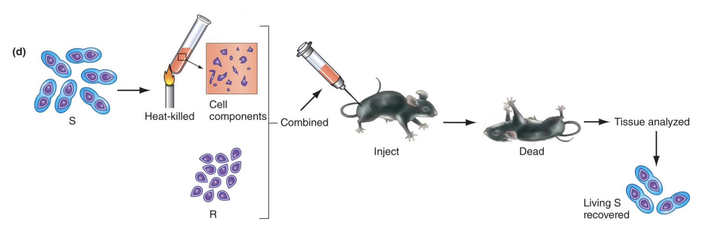
>

> Avery's experiment
>
> 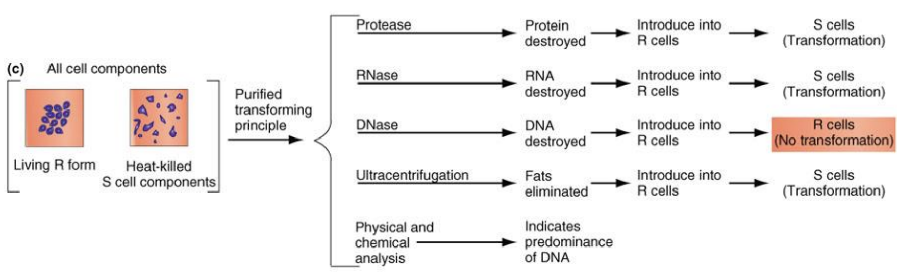
>

> Alfred Hershey and Martha Chase
>
> 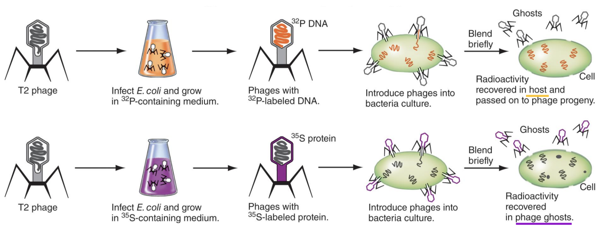
>

#### A gene is a discrete linear set of nucleotide pairs

Complementation test can determine if mutations arise from the same or different genes.

How recombination within a gene could generate a wild-type allele?

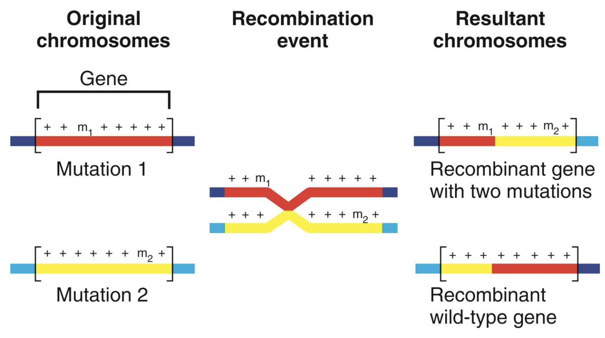

> Benzer’s experiment:
> T4 phage
> - Can examine a large number of progeny to detect rare mutation events (100-1000 progeny/hour)
> - Phase chromatin is “naked”, allowing much higher recombination frequency
> - Could allow only recombinant phage to proliferate while parental phages died 
>
> 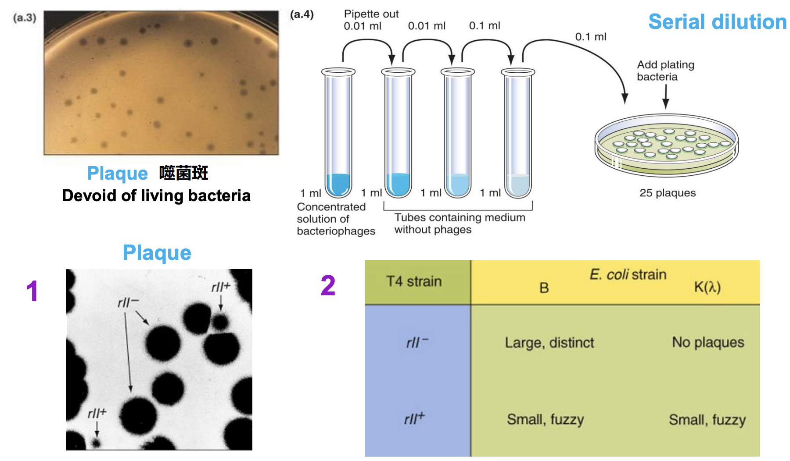
>
> Step 1: complementation test (trans) -> find out all mutations in rll-A 
>
> 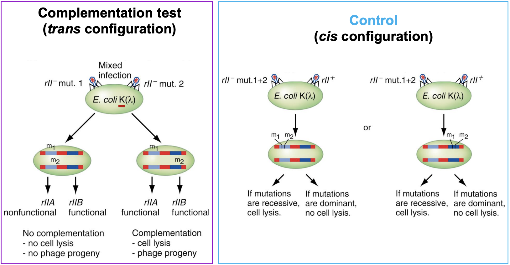
>
> Complementation test is *trans* combination, testing whether this 2 mutations are in same gene or not
> Control group is *cis* combination, testing whether the mutation is dominant or recessive
>
> Step 2: recombination test -> between rll-A mutations
>
> 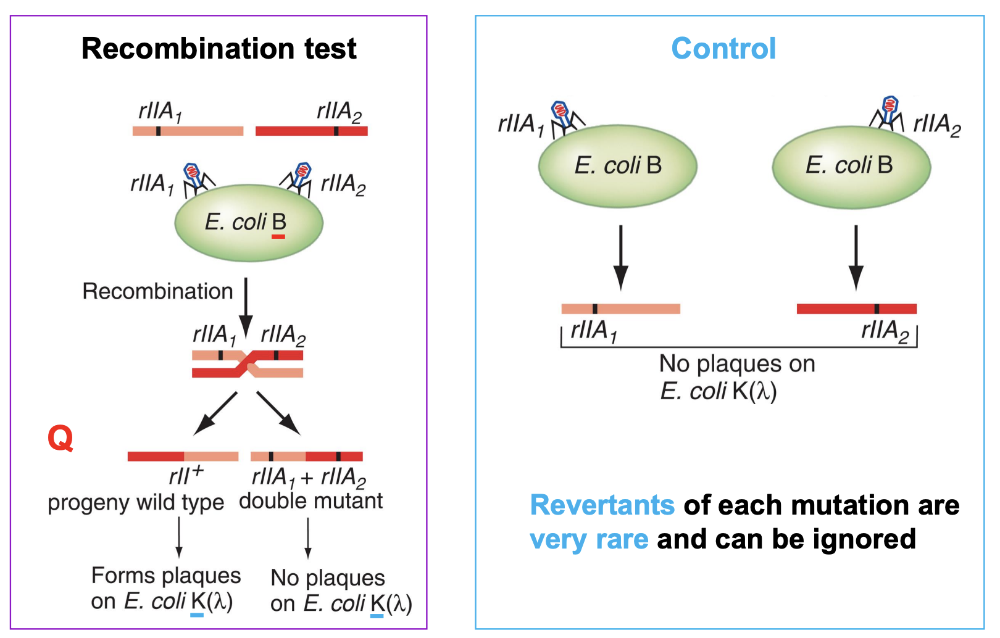
>
> Recombination test: testing whether recombination appears in the same gene
> Control group: exlude the possible of revertants

Gene structure:
- A gene consists of different parts that can each mutate; 
- Recombination between different mutable sites in the same gene can generate a normal, wild-type allele;
- A gene performs its normal function only if all of its components are wild type.

- The minimal recombination frequency: 0.02 cM;
- T4 Chromosome: 1.8×105 bp, 1500 cM (120 bp/cM); 
- 0.02 cM (0.02/1500) 1.8×10^5 = 2.4 bp
- Gene is not an indivisible entity
- Different nucleotide pairs within a gene are independently mutable, and recombination can occur between nucleotide pairs within a gene as well as between genes

#### The central dogma

> The human dystrophin gene: RNA splicing

RNA splicing:
- there's specific splice site
- Alternative RNA splicing
  - dendritic self-avoidance

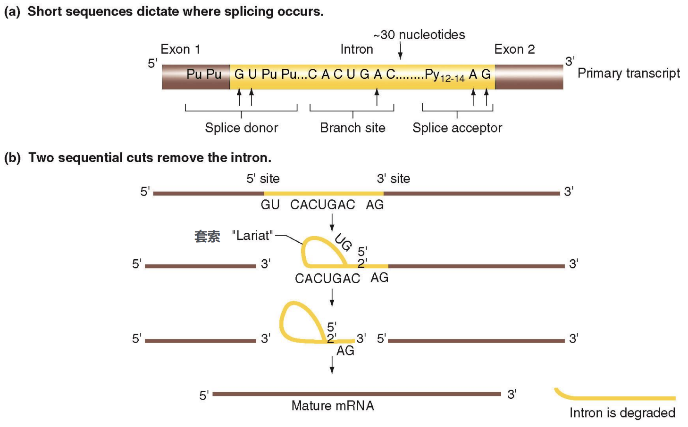

Translation部分省略了

#### Transposable elements – the jumping genes

Activator transposase catalyzes excision and integration

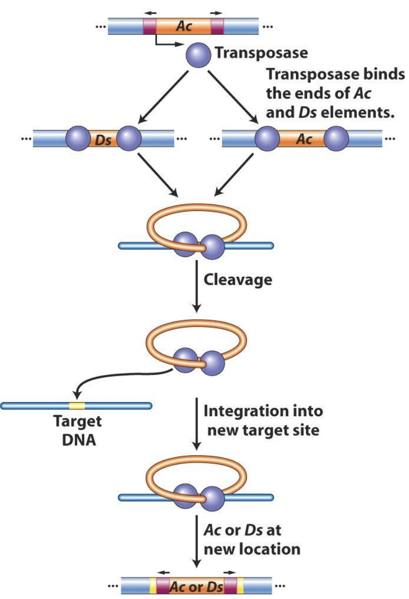

Transposition: The movement of small segments of DNA – entities known as transposable elements (TEs) – from one position in the genome to another
- Retroposons: transpose via reverse transcription of an RNA intermediate 先变成RNA再逆转录为DNA然后才插入
  - LINEs
  - SINEs
    - The Alu element and human diseases
    - Alu insertions are sometimes disruptive and can result in inherited disorders.
  - HERVs

  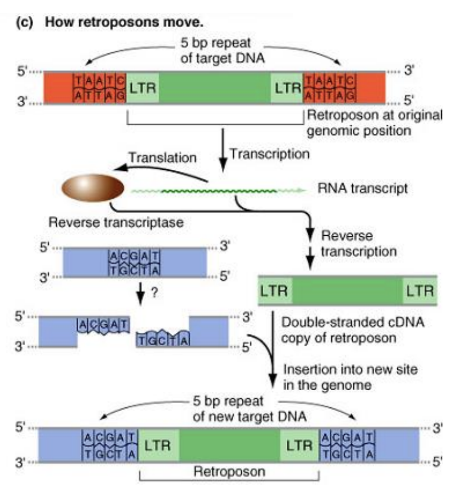

- LTR: long terminal repeats
- Transposons move their DNA directly

Transposon structure: Transposase enzyme recognizes inverted repeats and excises the transpon
1. P element in original genomic position and Transposase
2. P element excised
3. Excision of P element leaves a gap at its original location
4. Repair of gap using a sister chromatid or homologous chromosome containing a P element Transposon remains in original position
5. Repair of gap using a homologous chromosome lacking a P element Transposon no longer at original position
6. Repair by Nonhomologous end joining(NHEJ)
  
An inserted element is flanked by a short repeat: transposition footprint

> hybrid dysgenesis of *drosophila*
>
> 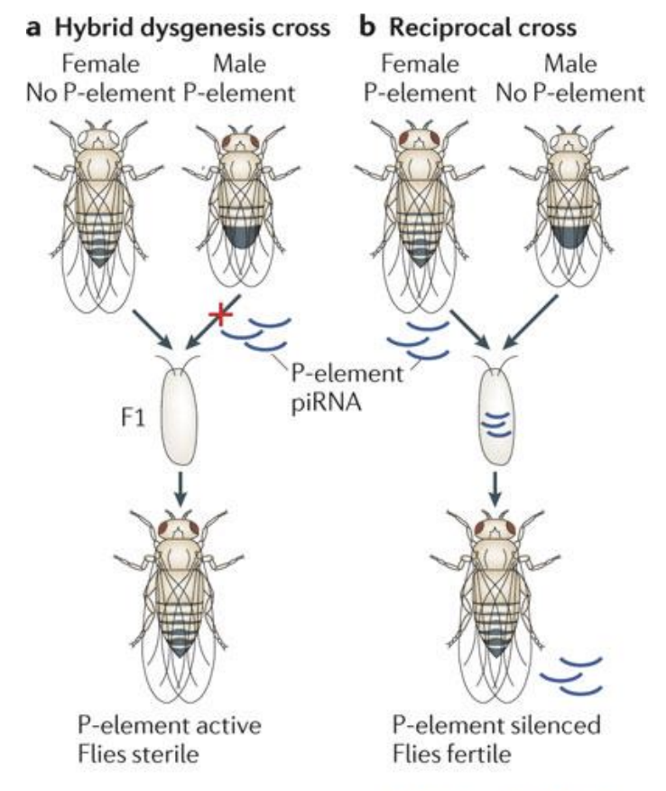
>

## Functional dissection of a gene through mutation

#### Mutation

Mutation: Changes in base sequences that modify the information content of DNA.

**Classification of Mutations:**

By effect on structure
- Small-scale mutations
  - Point mutation
  - Insertion
  - Deletion
- Large-scale mutations
  - Amplification
  - Deletion
  - Translocation
  - Inversion

By effect on function
- Loss of function
- Gain of function
- Dominant negative
- Reverse mutation

By inheritance
- Inheritable germline mutation
- Non inheritable somatic mutation

Different genes, different mutation rates
- Average mutation rate in gamete-producing eukaryotes is higher than that of prokaryotes
- Diploid organisms can tolerate more mutations than haploid organisms
- Human sperms have higher mutation rate than human eggs
  - average: Mutation rate = 1 X 10-8
  - Each child contains about 60 mutations (base pairs different from either parent), do not effect phenotype
  - Mutation rate in sperm = 2-4 X 10-8
- Revertants are more rare than forward mutations

###### The molecular basis of spontaneous mutations

> fluctuation test
> Hypothesis 1：Resistance is a physiological response to a bactericide
> Hypothesis 2：Resistance arises from random mutation
>
> Each colony represents the descendants of a single resistant bacterium
>
> 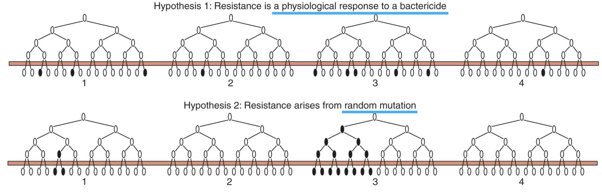
>

> Replica plating
> verifies that bacterial resistance is the result of preexisting mutations

- Bacterial resistance arises from mutations that occurred before exposure to bactericide
- Mutations occur as the result of random processes

point mutation: : A type of mutation that causes the replacement of a single base nucleotide with another nucleotide of the genetic material, DNA or RNA.
- Transition: purine replaced by another purine, or pyrimidine replaced by another pyrimidine
- Transversion: purine replaced by a pyrimidine, or pyrimidine replaced by a purine

insertion and deletion:
- block of 1 or more bp lost from DNA
- block of 1 or more bp added to DNA

**Natural processes: x-ray; UV light; Oxidative damage**
- Depurination: DNA 中的 嘌呤（adenine A 或 guanine G）碱基 从糖-磷酸骨架上脱落，形成 apurinic site (AP site)(1000/hr in every cell)
- Deamination of C : C changed to U; Normal C-G -> A-T after replication


**Errors in replication: tautomerization**

**unequal crossing-over: **
> Unequal crossing-over between red and green photoreceptor genes can change gene number and create hybrid photoreceptor proteins
>
> 
>

**Transposable elements:**

**Unstable trinucleotide repeats**
- CGG repeat: 会导致non-coding region的甲基化水平上升，影响转录
  - Anticipation: become apparent at an earlier age as it is passed on to the next generation. In most cases, an increase of severity of symptoms is also noted
  
  

  - slipped mispairing
  
  

  
  - 有可能的治疗措施: dCas-Tet1(demethylation), 但问题是target to other CGG repeats
  > Fragile X syndrome: The trinucleotide repeat is present within the non-coding region, the repeat expansion could affect the expression of the gene.
  > Huntington’s disease: The trinucleotide repeat is present within the protein-coding region, the repeat expansion leads to production of a mutant toxic protein with gain of function.

###### The molecular basis of induced mutations

base analogs: chemical structure almost identical to normal base (5BU)

hydroxylating agents: Hydroxylating agents add an –OH group

alkylating agents: Alkylating agents add ethyl or methyl groups
> Ethyl Methanesulfonate
> dosage很重要，matching & lethal

deaminating agents: Deaminating agents remove amine (-NH2) groups

intercalating agents: 
> Profalvin
> 平面芳香族化合物
> Proflavin 插入两条 DNA 链之间, 使 DNA 复制时发生 frameshift mutation（移码突变）

> Ames test
> to screen for chemicals that cause mutations and, therefore, might cause cancer.
>
> 
>
> Rice liver enzyme: 模拟哺乳动物体内的代谢环境, 将化学物质转化为活性代谢物

###### The phenotypic consequences of mutations

- Wild type
- Base substitutions
- Frameshift mutation
- Point mutation in non-coding sequence
  
Silent mutations do not alter the amino acid sequence

Missense mutations replace one amino acid with another
- Conservative – *chemical properties* of mutant amino acid are similar to the original amino acid
- Nonconservative – *chemical properties* of mutant amino acid are different from original amino acid

Nonsense mutations change codon that encodes an amino acid to a stop codon (UGA, UAG, or UAA) 

Frameshift mutations result from insertion or deletion of nucleotides with the coding region that change the reading frame for the reminder of the translation process. No frameshift if multiples of three are inserted or deleted

Mutations outside the coding sequence can disrupt gene expression:
- Mutations in the sequence of a promoter -> diminish or prevent transcription
- Changes in a splice-acceptor or donor site -> no mature mRNA or splicing errors
- Mutations affecting ribosome binding site -> diminish the efficiency of translation
- Changes in sites that regulate stability or localization of the mRNA -> instability or mislocalization of mRNA and protein

Null (amorphic) mutations: completely block function of a gene product (e.g. deletion of an entire gene)

Hypomorphic mutations – gene product has weak, but detectable, activity

Some loss-of-function alleles can show incomplete dominance

Rare dominant loss-of-function allele
> 通常 loss-of-function 突变是隐性的，因为一个正常拷贝可以弥补功能（haplosufficient）
> 显性 LoF 突变发生在某些情况下：
>  - Haploinsufficiency（半量不足）: phenotype is sensitive to gene dosage (i.e. 50% of gene product)
> 见下

Hypermophic mutation: generate more gene product or the same amount of a more efficient gene product
> FGFR3 gene 
> Achondroplasia (a form of short-limbed dwarfism; 先天性软骨发育不全) is caused by a dominant hypermorphic allele of FGFR3. The altered protein is always active.

Neomorphic mutations – generate gene product with new function or that is expressed at inappropriate time or place

Antimorphic(dominant negative): Mutant subunits block the activity of normal subunits
kinase的问题：就是block ATP的结合位点; 或者block专门的激酶活性位点

###### Biological repair system

Proofreading decreases mistakes made during replication

DNA repair systems:

accurate repair system: Particularly important for removing uracil
- Base excision repair removes damaged bases(BER)
  - DNA glycosylases remove altered nitrogenous base.
  - Nearby nucleotides removed
  - New DNA systhesized to fill gap


- Nucleotide excision repair corrects damaged nucleotides(NER)
  - UvrA-UvrB complex scans for distortions to double helix (e.g. thymine dimers)
  - UvrB-UvrC complex nicks the damaged DNA 
  - DNA polymerase fills in the gap


- homologous and nonhomologous repair(HR)
- Nonhomologous end-joining(NHEJ)

Error-prone repair systems:
- SOS system:
  - Adds random nucleotides opposite damaged bases
- Microhomology-mediated end-joining (MMEJ)
  -  Similar to NHEJ, except nucleotides are removed at doublestranded breaks leading to small deletions

Defects in DNA repair lead to human diseases:

> Xeroderma pigmentosum (XP)
> An autosomal recessive genetic disorder of DNA repair in which the ability to repair damage caused by ultraviolet (UV) light is deficient

> BRCA1 and breast cancer
> BRCA1 (breast cancer 1, early onset) is human tumor suppressor gene. It is involved in double-strand break repair by homologous recombination and contribute to susceptibility to breast cancer.

#### Organelle genetics

Mitochondrial DNA is circular in shape while nuclear DNA is linear in shape.

Nuclear and organellar genomes cooperate with one another, semiautonomous

- Heteroplasmic cells contain a mixture of organelle genomes
- Homoplasmic cells contain only one type of organelle genome

Maternal inheritance of Xenopus mtDNA
> 用mtDNA做亲子鉴定的原因：short lots of copies
> The mutation rate of animal mtDNA is higher than that of nuclear DNA
> Usually no change in mtDNA from parent to offspring

#### mtDNA mutations and human health

- Tissues with higher energy requirements are less tolerant of mutant mitochondria
- Tissues with low energy requirements are affected only when the proportion of wild-type mitochondria is greatly reduced


Three-person in vitro fertilization, two ways:


## Somatic mutation and the genetics of cancer

key words:

#### Characteristics of cancer cells

> 《The emperor of all maladies》
> 《The selfish gene》

Cancer: a disease in which an individualmutant clone of cells begins by prospering at the expense of its neighbors, and in the end destroy the whole cellular society.

- Multiple cancer phenotypes arise from mutations in genes thatregulate cell growth and division
- Environmental chemicals increase mutation rates and increasechances of cancer

Cancer genetics
1. Inherited mutations can predispose to cancer, but the mutationscausing cancer occur in somatic cells
2. Mutations accumulate in clonal descendants of a single cell

Tumor vs. cancer
1. benign and malignant: A tumor is considered a cancer only if it is malignant, that is, only if itscells have acquired the ability to invade surrounding tissue.
2. metastases: cancer cells break loose, enter blood or lymphatic vessels,and form secondary tumors, or metastases, at other sites in the body.


> PET(positron emission tomography)
> Q: PET 为什么能显示肿瘤/高代谢组织？
> accumulate of glucose(uptake of glucose): PET 常用放射性葡萄糖类似物 FDG。肿瘤细胞或代谢活跃细胞会摄取更多葡萄糖，因此也会摄取并积累更多 FDG，在 PET 图像中显示为高信号区域。

Cancer types:
- Carcinoma: a type of cancer that develops from epithelial cells.
- Leukemia: a group of cancers that usually begins in the bonemarrow and results in high numbers of abnormal white blood cells.
- Lymphoma: a group of blood cell tumorsthat develop from lymphatic tissues.
- Sarcoma: arises from transformed cells of mesenchymalorigin. Thus, malignant tumors made of cancellous bone, cartilage, fat,muscle, vascular, or hematopoietic tissues are, by definition, consideredsarcomas.

The hallmarks of Cancer


- Cancer cells evade normal controls on cell growth
  1. Produce cell division signals(autocrine stimulation)
  2. Lose contact inhibition
  3. Avoid programmed celldeath
- Cancer cells often acquire a potential for immortality
  - Expression of telomerase in cancer cells maintains the lengthof chromosome ends.
- Cancer cells have a higher rate of mutationthan normal cells
  - Enzymatic systems thatrepair DNA damage ormistakes during replicationare often defective.
- Mistakes in DNA replication and repair lead togenomic instability
- Cancer cells acquire the capacity to invade distant tissues
  - Cancer cells produce substances that encourage blood vessel growth. They use bloodvessels to provide nutrients to themselves and move to other locations (metastasis)through the bloodstream.


#### The genetic basis of cancers

**Accumulation of mutations results in cancer**

- X inactivation
  
  

**Evidence that a cancer is a clone of cells**

- Sample from normal tissueshas mixture of both alleles
- Sample from tumor has only one allele: Tumor cells are all derived from a single cancerous founder cell

cancer stem cell:

  

> assay
>
> inject a little bit of some type of cell, only cancer stem cell can induce a new tomour

**Cancer is generally a disease of old age**

- Tumor progression involvessuccessive rounds of randominherited change followed bynatural selection

**Childhood Cancer**

- The most common cancers in children: leukemia (34%), braintumors (23%), and lymphomas (12%).
**Inherited mutations can increase the predisposition to cancer**

- Inheritance of some mutations predisposes a personto cancer because they have to accumulate fewermutations.

> FAP(familial adenomatous poplysposis)
> BRCA1

- Sequencing reveals multiple mutations in cancer cells
  - Driver mutations: Cause cancer phenotypes
  - Passenger mutations: Occur due to increased mutation rate of cancer cells; Do not contribute to disease

**Feedback results in tumor progression**

- Mutations result in more cancer-like properties (growth, division, and genomic instability)
- Cells with more cancer-like properties accumulate more mutations.

#### How cell division is normally controlled

signals to cell to divide:
- extracellular signals: actover long or short distances
  - Collectively known ashormones
  - Steroids, peptides, orproteins
  > TSH
- cell-bound signals: require direct contact between cells

- growth factors: Extracellular hormones orcell-bound signals thatstimulate or inhibit cell proliferation
- receptors: Comprised of a signal-bindingsite outside the cell, atransmembrane segment, and an intracellular domain
- signal transducers: Located in cytoplasm
- transcription factors: Activate expression ofspecific genes to eitherpromote or inhibit cell proliferation


> Notch need cell-cell intact
> also act as transcription factors
> 如果notch不能properly degraded, 就会出问题

> Ras-mediayed signal transduction
>
> 
> 

The cell cycle
> 用了一个temperature-sensitive cell-cycle(yeast)
> Q: how to identify human homologs
> A: Functional rescue expreriment
>
> 

Q: which one is upstream(28)


Different CDK-cyclin complexes govern diffrent cell-cycle transition
- Cyclin-dependent kinases (CDKs) – family of kinases that regulatethe transition from G1 to S and from G2 to M
- Cyclin specifies the protein targets for CDK
- Presence of each type depends on Synthesis of specific cyclins at certain times and Destruction of cyclins that are not needed (protein degradation)
1. control th dissolution of the nuclear membrane at mitosis(lamins phosporylated->soluble)
2. G1->S, E2F no longer been inhibited(Rb)
  
  

  checkpoint: P53, activated by DNA damage

  

  > P53 and apoptosis
  > If DNA damage is greatenough, cells producing p53not only arrest in G1, but alsocommit to apoptosis
3. Checkpoints at the G2-to-M transition or during M phase
  
  checkpoint:
  

> The necessity of checkpoints:
> Checkpoints help prevent transmission of three kinds of genomicinstability
> - Aneuploid
> - Chromosome aberrations
> - Changes in ploidy


#### How mutations cause cancer phenotypes

###### Oncogene: dominant fasion & gain of functions
conversion of a **proto-oncogene** into an oncogene
- Nonmutant allele is a proto-oncogene
- Proto-oncogenes often encode proteinsneeded for cell cycle progression
- Gain-of-function mutation results inincreased proliferation


Oncogenes are produced when mutations cause improperactivation a gene

Identifying oncogenes:
- Tumor-causing viruses
- Tumor DNA

1. Identifying oncogenes throughassociation with tumor viruses
   
  After infection, retroviral genome integrates into hostgenome and may activate a proto-oncogeneGenes near viral integration sites in cancer cells may beoncogenes.

  

2. Identifying oncogenes through cell transformation assays
  
  Human gene that is oncogeniccan be identified and clonedfrom transformed mouse cells

  

  > 
   元件在小鼠基因组中没有，所以检测到的 Alu 信号一定来自人类 DNA。

Oncogenes: All have a gain-of-function effect
- Ras: transducer
  - Ras can be activated even without signal binding
  - usually active when bound to growth factor
  - oncogenic point mutation makes constitutively active protein（持续结合GTP）
  > Oncogenic forms of RAS are constitutively activated
  > 
  > 
  > 
- c-Abl: gene amplification
  - Chromosomal translocation fuses the c-abl and bcr genes
  - Hybrid protein encodes a constitutively active tyrosine kinase
- Her2
  - Found in 20% of all breast cancers
  - overexpressed growth factor receptor(Her2 overexpression is due to gene amplification)

> cancer caused by viruses: HPV
> Rb prevent cell cycle, P53 promote P21 transcription
>
> 
>

> Cervical cancers
> 

###### **Tumor suppressors**: act recessively

Normal alleles of tumor suppressorgenes often encode proteins thatslow down the cell cycle


Cancer can be caused by mutations that improperlyinactivate tumor suppressor genes

- Rb: normal protein delays entry into S-phase
- P53: normal protein functions in G1-S checkpoint
  > Genomic instability caused by loss of p53
  >
  > 
  >
- BRCA1: part of the machinery for repairingdouble-strand breaks in DNA

Inheriting a dominant mutated allele can make individuals cancer-prone, and tumors develop when the remaining normal allele is lost or mutated in susceptible cells.


> How elephants beat cancer
> elephants: 20 copies of p53

#### Personalized cancer treatment

1. Chemotherapy
  - Drugs may kill cancer cells that are unreachable or missed by surgery.
  - Directed against pathways needed for cell proliferation
  - Side effects are a problem

2. Radiation therapy
  - Radiation therapy uses high-energy radiation to shrinktumors and kill cancer cells
  - Radiation therapy can also damage normal cells, leading toside effects, including fibrosis, memory loss and infertility.

3. Drugs target products of oncogenes
  > Gleevec
  > specific binding site
  > 

  > Herceptin:
  > antibody that binds to the Her2 receptor -> prevent activation, results in destruction of cancer cells

4. Immunotherapy: Immunotherapy involves mobilizing the body's own immune system to fight malignancy.

# Chapter 4 Chromosome Aberration

| English | 中文 |
|---|---|
| chromatin | 染色质 |
| centromere | 着丝粒 |
| telomere | 端粒 |
| cohesin | 环形黏连蛋白 |
| chromosome aberration | 染色体畸变 |
| deletion, deficiency | 缺失 |
| duplication, repeat | 重复 |
| inversion | 倒位 |
| translocation | 易位 |
| transposition | 转座 |
| terminal deletion | 末端缺失 |
| intercalary deletion | 中间缺失 |
| interstitial deletion | 中间缺失 |
| deletion loop, deficiency loop | 缺失环 |
| pseudo-dominance | 假显性，拟显性 |
| deletion mapping | 缺失作图 |
| duplication loop | 重复环 |
| unequal crossing-over | 不等交换 |
| tandem duplication, tandem repeat | 串联重复 |
| nontandem duplication, dispersed duplication | 非串联重复，散在重复 |
| inversion loop | 倒位环 |
| pericentric inversion | 臂间倒位 |
| paracentric inversion | 臂内倒位 |
| crossover suppressor | 交换抑制因子 |
| balancer chromosome | 平衡染色体 |
| reciprocal translocation | 相互易位 |
| Robertsonian translocation | 罗伯逊易位 |
| centric fusion | 着丝粒融合 |
| pseudolinkage | 假连锁 |
| semisterility | 半不育 |
| isochromosome | 等臂染色体 |
| ploidy | 倍性 |
| chromosome basic number | 染色体基数，x |
| gametic chromosome number | 配子染色体数，n |
| aneuploidy | 非整倍性 |
| monosomy | 单体性 |
| disomy | 二体性 |
| trisomy | 三体性 |
| tetrasomy | 四体性 |
| aneuploid | 非整倍体 |
| monosome, monosomic | 单体 |
| disome, disomic | 二体，双体 |
| trisome, trisomic | 三体 |
| tetrasome, tetrasomic | 四体 |
| nullisome, nullisomic | 缺体 |
| euploidy | 整倍性 |
| haploidy | 单倍性 |
| monoploidy | 一倍性 |
| monohaploidy | 单元单倍性 |
| diploidy | 二倍性 |
| polyploidy | 多倍性 |
| triploidy | 三倍性 |
| tetraploidy | 四倍性 |
| pentaploidy | 五倍性 |
| hexaploidy | 六倍性 |
| octoploidy | 八倍性 |
| autopolyploid | 同源多倍体 |
| allopolyploid | 异源多倍体 |
| amphidiploid | 双二倍体 |

## The Eukaryotic Chromosomes

#### Chromosome structure and compaction

Chromatin is the generic term for any complexof DNA and protein found in a nucleus of a cell

Chromatin is ~ 1/3 DNA, 1/3 histones, 1/3nonhistone proteins; also contains significantamounts of RNA

**Chromosomes are the separate pieces ofchromatin that behave as a unit during celldivision**

Spacing and structure of nucleosomes affect genetic function in nucleosome:
- Accessibility for proteins that initiate transcription, replicationand further compaction
- Arrangement along chromatin is highly defined and varies indifferent cell types and under different conditions.

> ATAC-seq for mapping chromatin accessibility
>
> 
>
> ATAC-seq 利用 Tn5 转座酶优先切割开放染色质区域，并在切割位点加入测序接头，随后通过测序定位这些开放区域，从而绘制细胞中的染色质可及性图谱。

The nuclear core
- 组蛋白变体可以更换进入组蛋白复合物中，实现相应的功能
- 160 bp of DNA wraps twicearound a nucleosome core; 40 bp of linker DNA connectsadjacent nucleosomes
- Histone H1 associates withlinker DNA as it enters andleaves the nucleosome core
- The nucleosome core is an octamer of two each of histones H2A,H2B, H3, and H4

一个model of chromosomal packaging


Karyotype

Heterochromatin regions tend to associate with each other and form compact nuclear domains-> form chromocenter

Unstructured interactions influence TF localization–using polytene chromosomes

> polytene chromosomes in Drosophila
> 因为一直在复制但是不分裂，所以有1024copies，很大
>

Applications of banding patterns:
1. To help locate genes
2. To analyze chromosomal differences between species
3. To reveal chromosome aberrations and cause of genetic disease

Heterochromatin – highly condensed, usually inactivetranscriptionally:
- Constitutive – condensed in all cells (e.g. most of the Ychromosome)
- Facultative – condensed in only some cells and relaxed inother cells (e.g. position effect variegation, X chromosome infemale mammals)

Euchromatin – relaxed, usually active transcriptionally

> 花斑化
> 一个原本应该表达的基因，如果因为染色体重排被移动到异染色质附近，它可能会被异染色质“影响”而沉默。

Transcription requires changes in chromatin structure:


> Fluorescent in situ hybridization (FISH) is used to characterize genomes
> 1. Chromosomes are spreadon a glass slide and denatured to make them single stranded
> 2. A DNA sequence is labeled with a fluorescent tag to make a probe.
> 3. The probe hybridizes to chromosomes at complementary regions.

#### Key components of a chromosome

Question: essential components of a chromosome
- replication initiation sites
- Telomere
- Centromere 

Yeast artificial chromosomes
1. segregation of condensed chromosomes depends on centromeres
  - two conserved 10-15 bp DNA sequencesseparated by 90 bp, Consist of tandem repeats of noncoding satellite DNAs
  
  

  - Hold sister chromatids together(through action of **cohesin**)
    - At anaphase I, cohesin along chromosome arms is enzymatically cleaved but cohesin at centromeres is not cleaved, **Shugoshin** protects centromeric cohesin from degradation
  
    

    

  - Attachment sites for chromosome segregation machinery (through formation of **kinetochore**)
    - Chromosomes attach to microtubules of the mitotic spindle at the kinetochore.
    - H3 is replaced by the histone variant CENP-A
  
    

  > cohesin and human diseases
  > Cornelia de Lange syndrome: a multiple malformation disorder characterized by dysmorphic facial features, mental retardation, growth delay and limb reduction defects-> mutations in NIPBL
2. Telomeres are "caps" that protect the ends of eukaryotic chromosomes
   - Telomeres consist of specific repetitive sequences and don't contain genes
   - Prevent chromosome fusions and maintain integrity of chromosomal ends
   - Without a special mechanism,newly synthesized DNA strands are shorter by the length of the RNA primer at each cell cycle.
  
  

   - telomerase is a ribonucleoprotein that extends telomeres
     - Most somatic cells have low expression of telomerase
     - Germ cells, stem cells, and tumor cells have high expression of telomerase
  
  

  > tetrahymena: telomere does not shorten, MAC has 200 chromosomes
3. Origins of replication in eukaryotes
  - Replication unit (replicon) – DNA being replicated in both directions from one origin
  - New nucleosomes are composed of recycled and new histones, Chromatin is open to histone modification just after replication.
  Q: how is epigenetic memory preserved

## Chromosomal Rearrangements


Causes:
1. DNA beaks
  - Double strand breaks followed by nonhomologous end-joining
2. Aberrant crossing-over

  

> 1. Fluorescent in situ hybridization
> 2. sequencing
> 3. PCR
>
> 
> 
  
#### Deletion


Q: how about deletion homozygote:
  Probe A 0; Probe B: 1 band ; Probe C: 1 band as usual

Homozygosity for deletions is often lethal or harmful

Deletion heterozygotes:
1. Can have a mutant phenotype due to gene dosage effects(haploin sufficiency)
2. Increases risk of phenotype due to mutation in the other copy of the gene
3. May uncover existing recessive mutant alleles
  - gene mapping
  
  
  
> Cri du Chat Syndrome
> A rare genetic disorder due to a small deletion of chromosome 5p.

Deletion loops: 


**genetic map distances in deletion heterozygotes willnot be accurate**

Question: individual male, 保证母亲只有一个mutation

#### Duplication

Duplication loops: 


1. Novel phenotypes may occur because of increased gene copy number or because of altered expression in new chromosomal environment
2. Homozygosity or heterozygosity for a duplication can be lethal or harmful
3. Unequal crossing-over between duplicated regions on homologous chromosomes can result in increased and decreased copy number

  

  Gene duplications provide new genetic material for mutation, drift and selection to act upon, the result of which is specialized or new gene functions.

#### Inversion

1. after double-stranded break
2. opposite orientation or transposition


1. Most inversions do not result in an abnormal phenotype
2. Abnormal phenotypes can occur if:
   1. Inversion disrupts a gene
   2. Inversion places a gene near regulatory sequences for other genes or near heterochromatin
3. Inversions can act as crossover suppressors
  **paracentric inversions**
  - Zygotes formed from union of normal gametes with gametes carrying the broken dicentric recombinant chromatids will be nonviable
  - Only gametes that did not recombine within inversion loop areviable.
  
  

1. In inversion heterozygotes, no viable offspring are produced that carry chromosomes resulting from recombination in inverted region
  **pericentric inversions**
  - Zygotes formed from union of normal gametes with gametes carrying these recombinant chromatids will be nonviable
  
  

Inversion loops:


> Balancer chromosomes are useful toolsfor genetic analysis
> 1. No viable recombinant progeny will be produced because of crossover suppression
> 2. Balancer chromosomes carry both a dominant marker D and inversions (brackets) that prevent recombination with experimental chromosome.
>
> 
>


#### Translocation

basis for chronic myelogenous leukemia

Translocation: part of one chromosome becomes attached to a nonhomologous chromosome

t(12;17)(p13.1;p13) translocation, chromosome12 & 17, specific position

Types of translocations:
- reciprocal translocation: A **two-way** exchange of segments between the chromosomes
- non-reciprocal translocation: A **one-way** translocations in which a chromosomal segment is transferred to a nonhomologous chromosome.
> DNA-FISH can show translocation

Types of chromosomes:
- Metacentric
- Submetacentric
- Acrocentric
  - all mouse chromosomes are acrocentric（从图上可以看到有明显差异）
  - rDNA repeated sequence 人类会在染色质短臂上，但是小鼠没办法只能在长臂上, RNA polI produce rRNA
  
  

- Telocentric

Robertsonian translocation(罗伯逊易位): The short arm of one **acrocentric chromosome** is exchanged with the long arm of another, creating a large metacentric chromosome and a fragment that often fails to segregate and is lost.

  

  - form tiny fragment -> usually lost
  - reshape genomes

- Why recurrent translocation events
  
  

  a DNA repair focus ar each break site(these site are very close to each others), 然后就连上了
  > SST1(a macrosatellite DNA array)(可能会出现在两个染色体的断裂地方附近)，又是一个重复序列
  >
  > 
  >
  > located near the centromeres of the short arm of acrocentric chromosomes
  > repeaed sequence & close to each other at spatial spac
- this translocations are commonly observed in patients with the familial form of Down syndrome
  
  robertsonian translocation in chromosome 21/14
   
   

Phenotypic effects:
- Translocations can physically link genes that were formerly located on different chromosomes. These new linkage relations may affect gene expression:
  - produce oncogenes: 启动子和表达区域重组 & fusion protein
  - philadelphia chromosome[t(9;22)]:BCR（chr22）+ ABL1（chr9）-> BCR-ABL fusion gene, this fusion protein utilize ATP -> signal of cell proliferation -> Chronic Myeloid Leukemia; can use **Gleevec** to block the ATP binding pocket, and it's very specific!
  
  

  > Question: what makes a good drug:
  > 1. very specific
  > 2. very good on delivery
  > 3. effect time
  > 4. cost
  - Burkitt's lymphoma[t(8;14)]: 这个就是启动子换了位置, myc are downstream to the promoter of IgH,->c-myc protein elevate->B cell division elevate
  > why B cells?
  > enhancer only in B cells
- The chromosome breaks that bring about translocations may disrupt a gene’s function.
  - neurofibromatosis
- Translocation carriers face reproductive issues
  - semisterility: < 50% of gametes arise from alternatesegregation and are viable.

tranlocation : form the cruciform structure

  

  - Heterozygosity for translocations diminishes fertility and results in pseudolinkage
  - adjacent segregation(None-surviving)
  - Alternate segregation
  
  

## Changes in Chromosome Number

Aneuploidy & euploidy

#### Aneuploidy 非整倍体

individuals whose chromosome number is not an exact multiple of the diploid number (2n) for that species

results in multiple abnormalities or lethality

> turner syndrome: XO
> shorter height, infertile
> 只有一份 due to pseudoautosomal(PAR) genes, haploinsufficiency
> X-chromosome reactivation

> Klinefelter syndrome; XXY
>

> trisomy 21
> a genetic disorder caused by the presence of all or part of a third copy of chromosome 21. It is typically associated with physical growth delays, characteristic facial features, and mild to moderate intellectual disability.

> Patau syndrome – trisomy 13
> Edwards syndrome – trisomy 18
> Trisomy in Jimsonweed

Causes of aneuploidy:
1. meiotic nondisjunction
   
  

2. mitotic nondisjunction
   
  Mosaics
  - failure of sisterchromatids toseparate during anaphase of mitosis
3. Chromosome loss –lagging chromatid that is not pulled to either spindle pole at mitotic anaphase

   - 所以是去哪里了呢: form a micronuclei, ER tubule will invade, causing collaspe
   - During mitotic exit, missegregated chromosomes can recruit their own nuclear envelope (NE) to form micronuclei (MN)
   - Massive DNA-damage accumulation in micronuclei can occur upon collapse
  > drosophila 可以成为一个雌雄嵌合体

Chromothripsis: 极端的染色体重排现象，染色体在一次事件中被 严重破碎，然后随机拼接回去。
- tens to hundreds of rearrangements confined to one or a few chromosomes (thripsis: breaking into small pieces).

#### euploidy 整倍体

###### monoploid

- plant:
  - Can visualize recessive traits directly, without crosses to homozygosity
  - Introduce mutations into individual monoploid cells
  - Select for desirable phenotypes (herbicide resistance)
  - Hormone treatment to grow cells into monoploid plants
> colchicine: It prevents cells from forming spindles during mitosis, preventing chromosomal segregation during anaphase.

> haploid embryonic stem cells, hESCs
>
> 
> 

###### Triploid


会有unbalanced gametes in meiosis cell
- All polyploids with odd numbers of chromosome sets are sterile because they cannot produce balanced gametes

###### Tetraploid

Tetraploid cells occur during mitosis in a diploid when chromosomes fail to separate into two daughter cells

- colchicine present of Diploid

Tetraploids generate unusual Mendelian ratios


###### polyploidy

- Autopolyploid - polyploid with multiple chromosome sets derived from a single species. 同源多倍体
- Allopolyploid – hybrids in which chromosome sets come from distinct, but related, species 异源多倍体

One-third of all known flowering plant species are polyploid

Polyploidy often results in increased size and vigor

Many liver cells are polyploid, containing 4, 8, 16 or more times the haploid chromosome complement, although the significance of the phenomenon remains unclear.
- mitosis has been skip, cell become bigger and bigger

> Why polypoid?
> - Polyploid often correlates with cell size. It may represent an energetically efficient alternative to cell proliferation among differentiated cell types.
> - Increased gene copy number might allow for the mass production of proteins required to meet the metabolic demands
> - Stress response – liver cells

Livers with more polyploid cells had suppressed tumorigenesis

# Chapter 5 

forward gene screening and reverse gene screening

## forward genetic screening

EMS as mutagen in genetic screen
EMS: EMS（ethyl methanesulfonate，甲基磺酸乙酯）是经典遗传筛选（genetic screen）中最常用的化学诱变剂（chemical mutagen）之一，核心作用是随机引入点突变（point mutations）
ENU: ENU（N-ethyl-N-nitrosourea）是遗传筛选中另一类非常重要的化学诱变剂（chemical mutagen），通常被认为比 EMS 更“强力”和“精细”，尤其在**小鼠遗传学（mouse genetics）**中应用极其广泛。

transposons: parents has p element and transposon separately and the offspring can be modified
- advantage: easy to map
- in different animals have different transposon

> Question: how to identify the insertion site of a transposon
> 这里有一张图
> 自连形成一个环状的DNA，然后就可以进行PCR了

After isolating mutants from a genetic screen:
1. to map the mutant to a gene locus A
2. to verify that the expression or acticity of gene A is indeed abolished in the isolated mutants
3. to test whether inactication of gene A by other approach has same phenotype
4. [rescue experiment(sometimes is function rescue experiment),knock out the gene]

a large-scale genetic screen
1. to design an efficient and effective screen strategy
2. do a small pilot screen
3. ....
  
The heidelberg screen: 在果蝇中进行的大规模 EMS 突变筛选，用来系统性鉴定控制胚胎发育（尤其是体轴分节）的基因

Mis/overexpression screen

RNA interference:RNA interference（RNAi）是一种由小RNA介导的基因沉默机制，双链RNA（dsRNA）在Dicer（RNase III家族酶）的作用下被切割为约21–23 nt的小RNA（siRNA或miRNA），这些小RNA加载到RISC复合体中，由guide strand引导识别靶mRNA：完全配对时引发mRNA切割，不完全配对则抑制翻译。其中，hairpin RNA（发夹RNA）是miRNA通路的重要前体，由单链RNA折叠形成茎环结构（stem-loop），模拟双链RNA。内源miRNA先经Drosha处理生成pre-miRNA，再由Dicer切割成熟；实验中人工设计的shRNA也通过类似机制进入RNAi通路，实现稳定的基因沉默。
- Transgenic RNAi in Drosophila:有一张图片
  - 连上UAS和GAl4就可以进行organ specific的knock down
  - 问题是容易出现off-target

> how to perform a rescue experiment: silent mutation
>
> off-target的问题：设计multiple RNAi lines for each gene

Perturb-Seq: CRISPR perturbation + single cell seq

## Gene manipulation

Making transgenic flies using P element transformation: transformation plasmid + helper plasmid(transposase gene),一般gene会匹配一个visible marker

φC31-mediated site-directed transgenesis: attB（质粒） + attP（基因组） → 外源DNA插入这个attP位置

lineage-tracing:
- FLP-FRT system
- positive labeling
- Gal4-UAS
- MARCM
  - twin-spot MARCM
  有一张图，label 2 site, one mutant one WT
  > application: adaptive resizing of adult organs
  - MADM(in mice): 在有丝分裂时通过 Cre-loxP 重组，把“分裂出来的两个姐妹细胞”分别变成红/绿，并同时区分基因型。

Gene editing:
- CRISPR/cas
- Base editing and gene therapy

# Chapter 6 

# 20250511 Genomics: impact on science

Quesion: Y chromosome is shorter?
answer: Hill-Robertson 干扰

> 非重组区域基因丢失
> 假设一个染色体上有多个基因，其中有利突变和有害突变交错分布, 如果这些基因不重组，它们就形成了一个“连锁块”。
> 在有限群体中：
> - 有害突变可能固定（drift + selection interference）
> - 有利突变固定困难
> - 结果：整个连锁块可能退化或丢失功能基因。
> Y 染色体上的非重组区域退化

10 aspect (page 9)

1. In metazoans, gene number and complexity...
2. xxx
(page 10)

page 11一个功能饼图
Human genome encodes 2067 transcription factors
> Gene ontology (GO)

- transcription factors regulate gene expression at transcriptional level: often used in combinations to account for the unique regulation of each gene
  (page 13一张图)
- Expansion of domains and architexture of transcription factors in specific lineages
  - different across species
  - (page 14)
> Homeodomain(HD): to recognized the sequence; highly conserved
> eg: Hox genes, regulate the development of segment in Drosophila
> 但是HD domain会具有不同的识别motif
> 一个domain target to hundreds of genes
- some domain is unique in certain species
  (page 16)
  - Exon shuffling is common during evolution
    1. qq
    2. qq
  > mechanism:
  > 
  > 1. recombination
  > 2. cut and paste
  > 3. retrotransposition

1. transposable element
eg: DNA transposon-P element (Cut-and-Paste)
Retrotransposon(from retrovirus, copy and paste)
不知道为什么又开始讲已经讲过的内容，还持续性地讲了一大坨
(补充一下LTR的内容在原来的位置上,补充一下Alu在原来的位置上, Alu的活性受其他gene影响，还有一点进化上的内容，Exon shuffling via recombination between Alu elements of 2 gene, 非同源重组)

龙漫远

(page 28/29 飞一样过去了)

Duplication and diversification of genomic regions

1. 1
2. 2
3. 3
4. 4
  (page 31)

Gene family evolution: duplication and divergence(page 32)
- orthologous: 
- paralogous: 
- homologous: 

Type of duplication(page 33)
- tandem
- Nontandem

Gene family
- ...
- family members may be clustered together on one chromosome or dispersed on several chromosomes
> eg: the olfactory receptor gene family(page 36)
> pseudogenes
> mouse has more olfactory gene 
>
> eg: photoreceptors
> 又开始生理学了。。。(until pagen 41)
> evolution of opsin gene family(一张图)
> - opsin gene family arose gene duplication and subsequent sequence divergence
> - red and green genes are the most similar
> - OWM(RGB) but NWM(BG)
>
> 两种opsin的区别
> Quesion: find the which amino acid is the one before the duplication
> Answer: 用 outgroup 判断 duplication 之前的状态
>
> Convergent
>
> 红绿色盲有可能是opsin的点突变影响功能（page49），但是更多是来自于unequal crossing-over（page50）

page 53
page 55

> anemia
> 又开始讲生化，lj到底要干嘛。。。。。。。
> Locus control region control the expresiion of the hemoglobin genes
> (page 59 1 picutre)
> 继续婴儿更擅长得到氧气wbxl（page60）
> 继续贫血症（page61）
>
> α-thalassemia is associated with deletions of genes in the α-globin cluster
> (1 picture 62s)
>
> beta-thallasemia
>
> 又他妈的疟疾来了

duplication resulting from uneuql cross-over (ectopic recombination)

Duplicated genes can evovle into pseudogenes or evolve new functions
- pseudogenes
- new functions can arise in a duplicated gene

four sequences of duplicated genes
- neo-functionalization
- Non-functionalization
- Dosage effect
- Sub-functionalization
lj真的知道sy前面讲了什么吗。。。。。

Four levels og gene duplication have feuled evolution of complex genomes(page71)

origin of de novo genes
- 第一个途径我没听懂
- 第二个途径我也没听懂

Genome sequence studies affirm evolution from a common ancester

> Phylogenetic trees
> Molecular clock
> - basic assumption: rate of molecular evolution is constant over time across all lineages

Protein-coding genes are under dtronger constraints by natural selection

Using syntenic blocks to show that there's frequent chromosomes rearrangement across species
(page80 & page81)

(page82)

Similarities between chimps and humans
- 染色质数量的区别: 2 short chromosomes fuse together(Robertson translocation)
- **chromosomal speciation**

We are 57% microbes and 43% humans （page3????）

Meta-genomics: 不需要先把微生物分离培养出来，而是直接从环境样本中提取所有 DNA，然后测序分析其中有哪些生物、有哪些基因、可能有什么功能。(large scale PCR amplification) (page6)

(page9-10)微生物学

Basic knowledge of Becteria(page 11)

还在微生物学

Phenotypes of bacterial mutations(page 15-16)

E.coil genome wae sequenced in 1997
- 4288 genes, but function known for only 60%
- 1 gene per kb
- No intron
- very little repetitive DNA

Gene nomenclature
- "+" WT, "-" mutant
- prototophy/auxotrophy

penicillin enrichment for aucotrophic mutants（page21-page22）

Insersion sequence elements are transposons in bacterial genomes

- different strains have different numbers and distributions of IS elements
- small transposable elements(700-5000 bp length)

Using inverse PCR to identify insertion sites of a transposon in the genome

Gene transfer in bacteria:
- vertical gene transfer
- Lateral(or horizontal)gene transfer

Donor bacteriu provides the DNA that is transferred, recipient bacterium receives the DNA, which can result in altered phenotype

1. transformation
  - natural transformation
  - artificial transformation
    - chemically(calcium at cold temperature)
    - electroporation (high-voltage shock)
2. conjugation
3. transduction

(page 33 figure)

(page35)

(page38) 通过营养缺陷来selecting and screening for transformation

Competence: the growth stage that the bacteria is...

Co-transformation:(page42)

Conjugation requires direct cell2cell contact

U-tube experiment to prove that bacterial conjugation required direct contact between the 2 bacterial strains

the F plasmid ontains genes for synthesizing connections between donor and recipient cell(page48-49)

Formation of an Hfr chromosome:
1. F carries one ot more IS element, which permit homol...
2. High frequency recombinant...
3. 又transformation，然后再cross-over（page59）
  
所以实际上是两种transfer

Faulty out-looping produces F...

complementation studies using F plasmid