成绩组成：
期中（开卷，中文）：40%，卷子发回去自己答完再交回来
期末（闭卷，中文）：60%，三张a4纸
教材：
Janeway's Immunobiology
Case Studies in Immunology

Logic: self vs. non-self
Concepts: inflammation, antigen, cytokine, etc.
Principles: innate immunity, adaptive immunity......

# Overview

*《The history of the Peloponnesian War》*
Prelude: Smallpox(Variola virus), cowpox and vaccination

Modern immunology: study of the body's defense agaist infection, 巴斯德鹅颈瓶
柯氏四原则
Different scale of pathogen->different mathods

### Multiple levels of the body's defense

{width=60%}

Primitive mechanism
Advanced mechanism

Innate immunity: 
- genes directly inherited
- no antigen-specificity

Adaptive immunity: 
- involving gene rearrangements
- antigen-specificity


#### Primitive mechanism: Anatomic barriers

- Epidermis of skin：皮肤对于空气和水是完全隔绝的
- Bronchial ciliated epithelium呼吸道：黏液层，隔绝病原体进入同时使空气和水进入，纤毛会单方向的摆动，将粘液从肺部到支气管到口腔排出去。
- Gut epithelium消化道：与呼吸道的机制类似

#### Primitive mechanism: Complement补体系统/antimicrobial抗菌肽 proteins

{width=60%}

- 补体系统：一系列蛋白通过级联反应出发
  - 经典途径；凝集素途径（凝集素：能够结合多糖）；旁支途径
  - 在细菌或者病原体直接打洞
- 抗菌肽/抗菌蛋白：
  - 直接通过各种方式攻击病原体
  - Lysozyme(溶菌酶)：消化掉革兰氏阴性菌和革兰氏阳性菌表面的多糖结构，使得细菌无法自己维持渗透压，从而自然破裂
  - 溶菌蛋白起作用方式：接触到磷脂双分子层后改变构象直接打洞
  > 如何识别自我和非我？区分磷脂双分子层中脂类的具体组成（like人类中有胆固醇的存在，让这些蛋白无法在人体细胞的细胞膜上打洞。有一些其他真菌的磷脂连接方式和人类差异较大，也可以辅助区分）

#### Advanced mechanism: Innate immune cells

温血动物鸟类开始真正意义上出现Advanced mechanism

获得性免疫反应的细胞和天然免疫反应的细胞类型差异很大，天然免疫反应的细胞类型很难定义

{width=60%}

造血干细胞通过分化——>造血系细胞，髓系细胞，淋系细胞->获得性免疫反应细胞为B细胞和T细胞，都是淋系细胞
> 树突状细胞：连接获得性免疫和天然免疫，可以同时起源于髓系和淋系，同时可以发挥获得性免疫和天然免疫的功能

- 天然免疫反应细胞：巨噬细胞（髓系），粒细胞（髓系），树突状细胞（多样），NK细胞（淋系）
  - 可以区分自我和非我
  - 不光吞噬，还可以通过自爆反应杀死（嗜酸性粒细胞）

- **天然免疫反应的自我和非我**:
    *Janeway: immune system has evolved specificalty to recognize and respond to infectious microorganisms, and that this involves recognition not only of specific proteins, but also of certain **characteristics or patterns common** on infectious agents but absent from the host*
  - Pathogen-associated molecular patterns: 比如脊椎动物中糖链最末含有唾液酸残基

# Innate immunity

Innate immunity: 
- genes directly inherited
- no antigen-specificity

Adaptive immunity:
- involving gene rearrangements
- antigen-specificity

### complement system

{width=60%}

1. lectin pathway 凝集素途径
2. classical pathway 经典途径
3. alternative pathway 替代途径

补体系统组分完全由基因编码、可生殖系遗传、通常无抗原特异性。但经典途径是一个特殊例外——它由抗原-抗体复合物激活，因此具有抗原特异性，这是整个天然免疫概念中唯一的例外。

The central component: C3 protein
- 成熟 C3 由 𝛼 链和 𝛽 链组成，但二者由单一基因编码，翻译后通过二硫键共价连接。
- C3 含有一个特殊的 TED 结构域，其中存在硫酯键（thioester bond）。
- C3 被 C3 转化酶切割后产生 C3a 和 C3b；切割使得 TED 结构域中的硫酯键被活化。
- 活化的硫酯键要么被水水解而失活，要么与周围物质（如病原体表面的氨基或巯基）发生共价连接，使 C3b 锚定在病原体表面。

{width=60%}

### Pattern recognition receptors

##### Toll-like receptors (TLRs)

{width=60%}

- 通过适配蛋白向下游传递信号。两大核心适配蛋白为 MyD88 和 TRIF
  - MyD88：几乎所有 TLR（除 TLR3 外）都依赖 MyD88 传递信号，是主导性适配蛋白。
  - TRIF：仅 TLR3 单独依赖 TRIF；TLR4 特殊，可同时激活 MyD88 和 TRIF。
  - MyD88 下游激活 NF-𝜅B 和 AP-1，主要驱动促炎细胞因子（TNF-𝛼、IL-1、IL-6）。
  - TRIF 下游通过 K63 连接泛素化链激活 IRF3/IRF7，主要驱动 I 型干扰素（抗病毒反应）。

Different subcellular localization of TLRs
- **TLR定位**: 细胞膜(TLR2/1、TLR2/6、TLR4、TLR5、TLR11), 内体：TLR3、TLR7/8、TLR9、TLR13

- **适配蛋白募集**
  - TLR通过胞内的 **TIR结构域** 招募适配蛋白。
  - 主要包括：
    - **MyD88依赖通路**：多数TLR使用
    - **TRIF依赖通路**：主要由TLR3和内吞后的TLR4使用

- **早期信号事件**
  - MyD88或TRIF招募IRAKs、TRAFs、TAK1等信号蛋白。
  - **K63-linked ubiquitination** 主要作为信号平台，帮助招募和激活下游激酶。
  - 与此不同，**K48-linked ubiquitination** 通常介导蛋白降解，在负反馈调控中具有重要意义。

Pro-inflammatory cytokines induced by TLRs

- TLR信号激活后，NF-κB、AP-1、IRF等转录因子促进炎症因子产生。
- 其中 **IL-1β、IL-6、TNF-α** 是典型的促炎细胞因子，可以作用于多个组织。
- **肝脏**
  - 诱导急性期蛋白产生，例如C-reactive protein和mannose-binding lectin。
  - 促进补体激活和调理作用，帮助病原体被吞噬细胞清除。
- **骨髓和血管内皮**
  - 促进中性粒细胞动员。
  - 增强吞噬反应。
- **下丘脑**
  - 引起体温升高，即发热反应。
  - 发热可以抑制部分病毒和细菌复制，并增强抗原处理和特异性免疫反应。
- **脂肪和肌肉**
  - 动员蛋白质和能量，为升高体温和炎症反应提供代谢支持。
- **树突状细胞**
  - TNF-α促进树突状细胞迁移至淋巴结并成熟。
  - 成熟树突状细胞可以启动适应性免疫反应。

IL-1 signaling
- **IL-1R通路与TLR通路相似**
  - IL-1R家族受体也含有TIR结构域。
  - 因此IL-1R可以复用类似TLR的MyD88依赖信号机制。
- **受体和配体**
  - IL-1α或IL-1β结合IL-1R1。
  - IL-1R1与IL-1RAcP形成受体复合物。
  - IL-1RA可以竞争性抑制IL-1信号。
- **下游信号**
  - IL-1R复合物 → MyD88 → IRAKs → TRAF6 → TAK1/TAB1
  - TAK1进一步激活NF-κB和MAPK通路。
- **转录因子激活**
  - IκBα被磷酸化后，NF-κB释放并进入细胞核。
  - p38等MAPK通路激活AP-1。
- **结果**
  - 诱导IL-6、TNF-α、IFNα、IFNβ、TGFβ等基因表达。
  - 因此IL-1R信号可以进一步放大炎症反应。

{width=60%}

Pathogens' inhibition of TLRs signaling pathways

- 病原体可以通过自身蛋白干扰TLR信号，从而逃避免疫识别和炎症反应。
- **抑制受体或适配蛋白层面**
  - 某些病毒蛋白可以阻断TLR与MyD88、MAL、TRIF、TRAM等适配蛋白的连接。
  - 例如HCV NS5A、HCV NS3-4A、VACV A46R等可干扰TLR信号复合物形成。
- **抑制IRAK/TRAF/TAK1层面**
  - VACV A52R等蛋白可以干扰IRAK、TRAF6或TAK1相关信号。
  - 这样会阻断K63泛素化信号平台和激酶级联。
- **抑制转录因子激活**
  - 如果NF-κB、IRF3、IRF7不能被有效激活，促炎细胞因子和I型干扰素表达就会下降。


Viral infection
- 病毒进入宿主细胞后，会释放病毒基因组。
- RNA病毒复制时，会在细胞质中产生病毒RNA，例如未加帽RNA、5'-triphosphate RNA或dsRNA。
- DNA病毒或逆转录病毒感染时，可能导致病毒DNA或逆转录DNA出现在细胞质中。
- 这些异常核酸就是RLRs和cGAS-STING通路要识别的“危险信号”。


CD8+ T cells and NK cells can kill virus-infected cells
- 病毒感染细胞后，病毒蛋白可以被加工成肽段，并通过MHC class I展示在细胞表面。
- CD8+ cytotoxic T cells识别“病毒肽-MHC I”复合物后，可以直接杀死感染细胞。
- 病毒感染细胞可被细胞毒性T细胞识别并杀伤；杀伤过程中会激活caspase，最终导致感染细胞DNA断裂和死亡
- NK细胞也可以杀伤病毒感染细胞，尤其是在感染导致MHC I表达下降或应激配体上调时。

##### RIG-I-like receptors (RLRs)

Viral RNAs in cytosol trigger RIG-I pathway
- TLR3、TLR7、TLR9主要检测内体中的病毒核酸；而细胞内产生的病毒RNA则由RLRs识别。
- RLRs主要包括：
  - RIG-I
  - MDA5
  - LGP2

- RIG-I和MDA5都有RNA helicase-like domain和CARD domains。
- RIG-I主要识别带有未修饰5'-triphosphate的病毒RNA。
- MDA5更偏向识别病毒dsRNA。
- 病毒RNA结合RIG-I/MDA5后，RIG-I/MDA5构象改变，CARD结构域暴露。
- CARD结构域进一步与线粒体外膜上的MAVS结合。
- MAVS聚集后招募TRAFs，并促进K63-linked polyubiquitin scaffold形成。
- 下游激活：
  - TBK1 / IKKε → IRF3 / IRF7 → I型干扰素
  - IKKα / IKKβ / NEMO → NF-κB → 促炎细胞因子

{width=60%}

Viral RNAs in cytosol trigger RIG-I pathway: Self vs. non-self。
- Janeway强调：RIG-I主要通过RNA 5'端结构区分宿主RNA和病毒RNA。
- 宿主细胞中的不同RNA虽然也可能具有复杂二级结构，甚至在刚转录出来时带有 5'-triphosphate，但它们大多在细胞核内经过成熟加工后才进入细胞质。例如 mRNA 会获得 5' cap 和 poly(A) tail，并结合 PABP；snRNA会被加帽；rRNA会与核糖体蛋白结合；tRNA和miRNA也会经过剪切、修饰和蛋白复合物包装。因此，这些宿主RNA不会以“裸露、未修饰、病毒样”的形式暴露在细胞质中，所以通常不会被RIG-I识别。
- 相反，病毒RNA常常在细胞质中复制，容易暴露出宿主RNA中少见的特征，比如未加帽的 **5'-triphosphate RNA**、病毒复制产生的 **dsRNA**，或者缺乏正常宿主RNA修饰的异常结构。RIG-I正是通过识别这些“非自身RNA特征”来判断病毒感染，并进一步激活MAVS通路，诱导I型干扰素和抗病毒反应。

Viral inhibition of RIG-I pathway
- Janeway举例：Influenza A virus的NS1蛋白可以抑制TRIM25。
- TRIM25本来参与RIG-I激活所需的K63-linked ubiquitination。
- 如果TRIM25被抑制，RIG-I无法有效通过MAVS激活下游信号。
- 结果：
  - IRF3/IRF7激活下降
  - NF-κB激活下降
  - I型干扰素和炎症因子产生减少
- 这说明病毒不仅会被RLRs识别，也会进化出机制阻断RLRs信号。
> 一些病毒蛋白可以遮蔽dsRNA或抑制RIG-I/MDA5识别，脊髓灰质炎病毒可促进MDA5降解，HAV 3ABC和HCV NS3-4A可切割IPS-1/MAVS，VACV N1L、Rabies virus P、VACV K7R等可抑制TBK1/IKKε-IRF3/7分支，VACV N1L和B14R还可抑制IKK-NF-κB分支。


##### cGAS-STING

- cGAS是细胞质DNA sensor。
- 当病毒dsDNA进入细胞质后，cGAS直接结合dsDNA。
- cGAS被激活后，以ATP和GTP为底物合成第二信使cGAMP。
- cGAMP结合ER膜上的STING二聚体。
- STING激活TBK1。
- TBK1磷酸化IRF3。
- IRF3进入细胞核，诱导type I interferon genes表达


Viral DNAs in cytosol trigger cGAS pathway: Self vs. non-self
- 宿主DNA正常情况下主要被限制在细胞核和线粒体中。
- 如果DNA异常出现在细胞质中，就可能代表：
  - DNA病毒感染
  - 细菌DNA进入细胞质
  - 逆转录病毒产生DNA中间体
  - 线粒体损伤释放自身DNA
  - 死细胞或基因组不稳定导致DNA暴露
- 因此cGAS识别“非自身”的方式，不是靠DNA序列，而是靠DNA出现的位置异常。
- 换句话说：**细胞质DNA本身就是危险信号**。
> - cGAS 是细胞质DNA感受器。它结合DNA后，用 ATP和GTP 合成 cGAMP；cGAMP再激活内质网上的 STING，使其转运到ERGIC/Golgi并招募 TBK1 和 IKK。TBK1磷酸化 IRF3，使其进入细胞核诱导 IFN-β；IKK则激活 NF-κB p65/p50，促进炎症基因表达。最终结果是产生I型干扰素和炎症因子。
> - CDN，如c-di-GMP、c-di-AMP，也可以直接激活STING，不一定需要cGAS。图中的 ENPP1 可以降解cGAMP，限制STING信号过强。总体来说，这页PPT说明：细胞质中的病毒DNA、细菌DNA、逆转录DNA或异常自身DNA，都可通过 cGAS-cGAMP-STING-TBK1/IKK 通路激活IRF3和NF-κB。


Anti-viral innate immune pathways
- RIG-I和MDA5识别病毒RNA，激活MAVS通路。
- cGAS等DNA sensors识别细胞质DNA，激活STING通路。
- 这些通路最终都诱导I型干扰素。
- 三类抗病毒核酸识别通路可以这样对比：

| 通路 | 识别位置 | 识别对象 | 接头蛋白 | 主要转录因子 |
|---|---|---|---|---|
| TLR3/7/9 | 内体 | dsRNA / ssRNA / CpG DNA | TRIF或MyD88 | IRF3/7, NF-κB |
| RLRs | 细胞质 | 病毒RNA | MAVS | IRF3/7, NF-κB |
| cGAS-STING | 细胞质 | 病毒DNA / 异常DNA | STING | IRF3, NF-κB |


Interferons
- RLRs和cGAS-STING通路激活后，重要结果之一是产生I型干扰素，干扰素可以阻断病毒向未感染细胞扩散。
- IFN-α/β结合IFNAR后，通过JAK-STAT通路激活STAT1和STAT2。
- STAT1/STAT2与IRF9形成ISGF3复合物。
- ISGF3进入细胞核，诱导ISGs表达。
- ISGs包括OAS、PKR、Mx、IFIT、IFITM等抗病毒分子。

Interferon-Stimulated Genes (ISGs): OASs
- OAS是interferon-stimulated gene产物之一。OAS可以把ATP聚合成2'-5'连接的寡腺苷酸，这些2'-5'寡腺苷酸可以激活一种内切核糖核酸酶。被激活的核酸酶降解病毒RNA。
- 结果：
  - 病毒RNA减少
  - 病毒复制受阻
  - 细胞进入抗病毒状态


Interferon-Stimulated Genes (ISGs): PKR
- PKR也是I型干扰素诱导的抗病毒蛋白。PKR是一种dsRNA-dependent protein kinase。PKR可以磷酸化eIF2α。eIF2α被磷酸化后，蛋白翻译起始受阻。
- 结果：
  - 病毒蛋白合成下降
  - 病毒复制被抑制
  - 但宿主细胞自身蛋白翻译也会受到影响


Interferon-Stimulated Genes (ISGs): IFITs
- 正常翻译起始需要：
  - methionine tRNA
  - 40S ribosomal subunit
  - eIF2
  - eIF3
  - eIF4
- 这些分子形成43S pre-initiation complex。
- IFIT1和IFIT2可以结合eIF3的亚基，阻止43S pre-initiation complex形成。
- IFITs还可以结合未加帽或异常加帽的病毒mRNA，阻止其翻译。
- 结果：病毒RNA不能有效翻译成病毒蛋白。


Interferon-Stimulated Genes (ISGs): ISG15
- ISG15类似泛素，可以共价连接到靶蛋白上。
- 过程包括：
  - UBE1L：激活ISG15
  - UBCH8：转运ISG15
  - HERC5：连接ISG15到底物蛋白
  - USP18：去除ISG15修饰
- 生物学意义：
  - 改变宿主或病毒蛋白功能
  - 抑制病毒复制
  - 调节干扰素信号强度

Interferon-Stimulated Genes (ISGs): MxA
- Mx proteins是I型干扰素诱导的抗病毒蛋白。人和野生小鼠有Mx1和Mx2，这些蛋白属于dynamin family GTPases。MxA可以寡聚化，并捕获病毒组分。
- 结果：
  - 病毒复制复合体或病毒衣壳相关结构被限制
  - 病毒复制和装配受阻

Anti-viral innate immunity
- IFN-α和IFN-β的三类主要功能：
  - 诱导未感染细胞进入抗病毒状态
  - 增加MHC class I表达，提高病毒感染细胞被CD8 T细胞识别的概率
  - 激活NK细胞，使其杀伤病毒感染细胞。

- 感染细胞释放干扰素
- 邻近未感染细胞降低RNA和蛋白合成，减少病毒扩增机会
- 感染细胞更容易进入凋亡
- 免疫细胞被激活，帮助清除感染细胞


##### 真菌感染的常见病原类型

- **Aspergillus genus**
  - 常见种类包括 *Aspergillus flavus*、*Aspergillus fumigatus*、*Aspergillus niger*、*Aspergillus terreus* 等。
  - *Aspergillus fumigatus* 是重要的机会性真菌病原体，尤其容易在免疫功能低下者中引起侵袭性感染。
  - 曲霉通常以 **conidia** 或 **hyphae** 的形式参与感染。

- **Mucorales order**
  - Mucorales 是另一类重要丝状真菌。
  - 其特点是形成大量菌丝和孢子囊结构。
  - 在免疫缺陷、糖尿病酮症酸中毒等背景下，可引起严重的毛霉菌病。

> Fungal infection
> 常见真菌病原
> - Aspergillus
> - Mucorales
> - Candida
> - Cryptococcus
> 真菌形态
> - yeast
> - hyphae
> - pseudohyphae
> - conidia
> - capsule

##### 真菌形态与免疫识别

- 真菌不是单一形态的病原体，可以表现为多种 **morphotypes**：
  - **yeast**
  - **hyphae**
  - **pseudohyphae**
  - **conidia**
  - **capsule**

- 不同真菌形态会影响宿主免疫识别和吞噬。
  - *Candida albicans* 可在 yeast、pseudohypha、hypha 等形态之间转换。
  - *Aspergillus fumigatus* 可形成 conidia 和 hyphae。
  - 树突状细胞、巨噬细胞和中性粒细胞可以吞噬不同 fungal morphotypes。

- 病理图中可以看到真菌在组织中形成侵袭性病灶。
  - 在免疫功能正常时，吞噬细胞可限制真菌扩散。
  - 在吞噬细胞功能缺陷或免疫抑制状态下，真菌更容易侵入组织并造成严重损伤。

##### C-type lectin receptors


- **C-type lectin receptors, CLRs** 是一类主要识别糖类结构的模式识别受体。
- 它们常表达于巨噬细胞、树突状细胞和中性粒细胞表面。
- 常见 CLR 包括：
  - **Dectin-1**
  - **Dectin-2**
  - **Mincle**
  - **DC-SIGN**
  - **mannose receptor**
  - **Langerin**
- CLRs 的共同特点是具有糖类识别结构域，例如：
  - **CRD, carbohydrate recognition domain**
  - **CTLD, C-type lectin-like domain**

- 这些受体可以识别真菌细胞壁上的糖类结构，并诱导吞噬和炎症信号。

C-type lectin receptors recognize polysaccharides
- β-glucans:
  
  

- Mannan:

  

Innate immune cells against fungal infection
  


- 巨噬细胞和中性粒细胞可以通过 PRRs 识别真菌。
- 识别后发生以下过程：

```text
migration
↓
recognition
↓
engulfment
↓
phagosome formation
↓
phagosome maturation
↓
killing
```

- 吞噬后的真菌进入 **phagosome**。
- phagosome 与 lysosome 融合形成 **phagolysosome**。
- 在 phagolysosome 中，真菌可被以下机制杀伤：
  - 酸性环境
  - 溶酶体酶
  - 抗菌肽
  - ROS
- 有些真菌可能逃逸或被非裂解性排出，说明真菌与吞噬细胞之间存在动态相互作用。

NETosis: A unique process of innate immune response
- **NETosis** 是中性粒细胞释放 **neutrophil extracellular traps, NETs** 的过程。
- NETs 主要由以下成分组成：
  - DNA / chromatin
  - histones
  - antimicrobial proteins
  - neutrophil granule proteins

- NETs 的作用：
  - 捕获真菌或其他胞外病原体
  - 限制病原体扩散
  - 促进后续吞噬和清除

- NETosis 可分为两类：

  - **lytic NETosis / suicidal NETosis**
    - 细胞膜破裂
    - 中性粒细胞死亡
    - NETs 较慢释放

  - **vital NETosis**
    - 细胞不立即裂解
    - NETs 快速释放
    - 中性粒细胞可能保留部分功能

- NETs 形成与 ROS 有关。
- 因此，吞噬细胞 ROS 生成缺陷会影响抗真菌防御。


##### Others

(I) NOD-like receptors (NLRs)
1. **NOD 样受体（NOD-like receptors, NLRs）是一类位于细胞质中的模式识别受体。**  
   它们主要负责识别进入细胞内部的病原相关分子或细胞损伤相关信号，因此属于细胞内先天免疫识别系统的一部分。   
2. **NLRs 的一般结构可以概括为：N 端功能结构域 + 中央 NACHT/NBD 结构域 + C 端配体感受结构域。**  ，NLRs 的 N 端结构域高度多样，这是 NLR 家族分类的重要依据，不同 NLR 亚家族的 N 端功能结构域不同，例如 CARD、PYD、BIR 等，这些结构域决定了它们后续招募下游蛋白、形成信号复合物或炎症小体的能力。NACHT 是核酸结合结构域，位于 NLR 蛋白中部，是 NLR 家族中唯一相对保守的结构域。 
3. **NLR 家族可分为 NLRA、NLRB、NLRC 和 NLRP 等亚类。**  其中 NOD1 和 NOD2 属于 NLRC 家族，是 NLRC 家族的 founding members，因此 NLRC 家族也以它们命名。其中 NOD1 和 NLRC4 通常含有 CARD 结构域，NOD2 含有两个 CARD 结构域。  
4. **NLRP 亚类通常以 PYD 结构域为特征。** 这与它们参与炎症小体形成密切相关。  
  
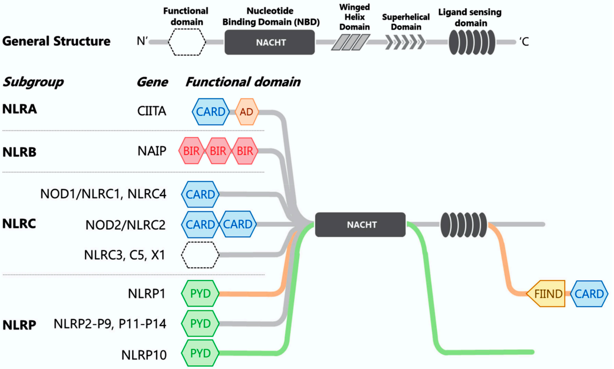

1. **NOD1 和 NOD2 识别的是细菌肽聚糖（PGN）来源的片段。** 这些肽聚糖片段来自革兰阴性菌或革兰阳性菌。  
2. **NOD1 主要识别 iE-DAP。** iE-DAP 是细菌肽聚糖中的一种特征性片段。**NOD2 主要识别 MDP。**  MDP 可来源于革兰阳性菌和革兰阴性菌的肽聚糖，因此 NOD2 的识别范围相对更广。  
3. 因此它们实际检测到的不是细胞外完整细菌，而是已经进入细胞内部的细菌或跨过细胞膜进入胞质的细菌片段。  
4. **NOD1 和 NOD2 被细菌肽聚糖片段激活后，会通过 CARD-CARD 相互作用招募 RICK/RIPK2。**  
5. **RICK/RIPK2 被招募后，可进一步引发 K63-linked ubiquitination。**  这种泛素化不是为了让蛋白被降解，而是作为信号平台，帮助激活下游通路。进而激活 IKK 复合体。然后让IκB降解掉，IκB 原本抑制 NF-κB，当 IκB 被降解后，NF-κB 中的 p50/p65 可以释放出来并进入细胞核。NF-κB 进入细胞核后，结合 NF-κB-binding motif，促进炎症相关基因转录。
6. **NOD1/NOD2 还可以激活 MAPK 通路。**  MAPK activation 最终可影响 JUN，并通过 AP-1-binding site 促进炎症相关基因转录。  
7.  NOD1/NOD2 的核心功能不是形成炎症小体，而是通过 RIPK2 激活 NF-κB 和 MAPK 通路，这些通路最终促进炎症细胞因子和趋化因子的表达。  

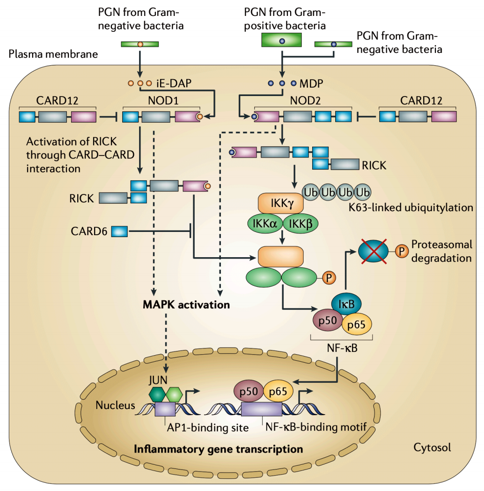

- 炎症小体与 NLRP3

1. **不是所有 NLR 都能形成炎症小体。**  只有部分 NLR 可以形成 inflammasome，主要包括 NLRP 家族成员和部分 NLRC 家族成员。  
2. **NOD1 和 NOD2 本身不能形成炎症小体。**  NOD1/NOD2 的主要功能是通过 RIPK2 激活 NF-κB 信号通路，诱导炎症相关基因表达，而不是直接组装 inflammasome。  
3. **NLRP3 是目前研究最多的炎症小体。**  它可以被多种刺激激活，是炎症小体部分最重要、最常考的代表。**NLRP3 可以被多种类型刺激激活。**  这些刺激包括热、机械损伤、颗粒物、病毒、细菌、真菌等。**NLRP3 识别的可能不是某一种特定分子，而是细胞内稳态的破坏。**  NLRP3 可能识别的是细胞内钾离子和钙离子浓度的异常波动，而不是直接识别 RNA、DNA 或蛋白质。  
4. **炎症小体形成后会激活 caspase-1。** caspase-1 是炎症小体下游最核心的效应分子。**炎症小体也可以激活 caspase-4、caspase-11、caspase-12 等非凋亡相关 caspase。** 这些 caspase 参与炎症反应，而不是经典细胞凋亡。**炎症小体相关 caspase 不同于 apoptosis 中的 caspase。** 它们不同于细胞凋亡中的 caspase-9、caspase-3、caspase-8；它们不会主要导致细胞凋亡，而是触发炎症反应。 
5. **caspase-1 激活后有两个核心功能。**  第一，切割 pro-IL-1β 和 pro-IL-18，使它们成熟并具有生物活性；第二，切割 GSDMD，使其在细胞膜上打孔。 **IL-1β 和 IL-18 需要被切割成熟后才能释放并发挥作用。** pro-IL-1β 和 pro-IL-18 是前体形式，经过 caspase-1 切割后变为成熟的 IL-1β 和 IL-18。**GSDMD 被切割后会在细胞膜上形成孔道。**这些孔道使成熟的 IL-1β 和 IL-18 能够从细胞质释放到细胞外。  
6.  **如果 GSDMD 被大量激活，孔道过多，会导致细胞焦亡。**这种死亡方式叫 pyroptosis，即细胞焦亡；它不同于 apoptosis，是一种伴随炎症因子释放的炎症性细胞死亡。  

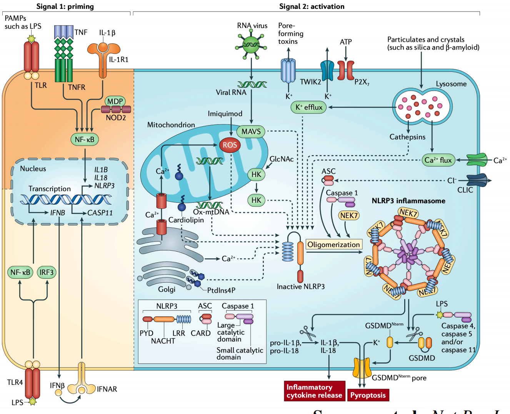

(II) Soluble pattern recognition receptors
- 可溶性模式识别分子是一类被分泌到体液中的 PRR。它们不同于膜结合型或胞质型 PRR，不能直接触发细胞内信号转导，而是通过结合病原体或损伤细胞，在细胞外发挥作用。**它们的主要作用是直接清除病原体或放大免疫反应。**常见方式包括直接杀菌、激活补体、促进调理吞噬，以及增强其他 PRR 的识别反应。

Peptidoglycan recognition proteins
- **PGRPs 是识别细菌肽聚糖的可溶性 PRR。** 肽聚糖是细菌细胞壁的重要成分，因此 PGRPs 主要参与抗细菌感染。
- **部分 PGRPs 可以直接水解肽聚糖。** 这种作用会破坏细菌细胞壁，使细菌因渗透压失衡而死亡。PGLYRP-2 旁边的剪刀符号就表示这一过程。
- **PGRPs 也可以与其他抗菌分子协同杀菌。** α/β defensin、PLA2、PGLYRP-1、PGLYRP-3、PGLYRP-4 等都与 bacterial killing 相连，说明它们可以共同增强抗菌效果。  
- **PGRPs 处理肽聚糖后释放的片段，可以被 NOD1/NOD2 或 TLR 继续识别。**  因此 PGRPs 不仅直接杀菌，还可以间接增强炎症反应。  
- **PGRPs 还可以与补体系统联系。**serum MBL 可激活 complement activation，进一步导致 opsonization，使病原体更容易被吞噬。

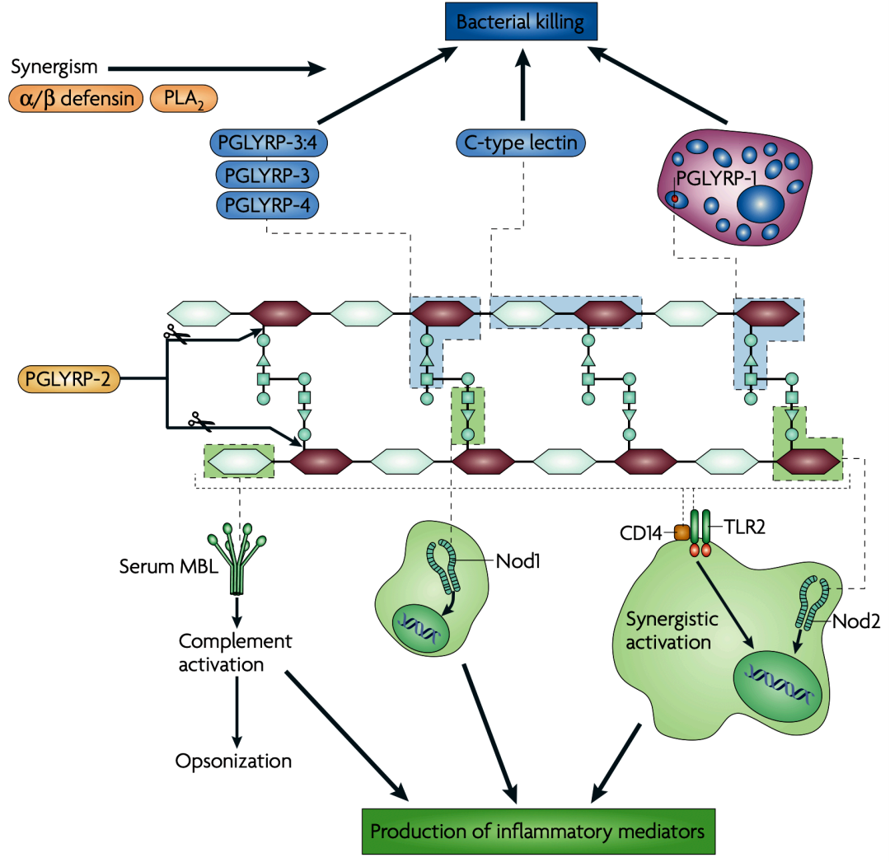

C-reactive protein
- **CRP 是由肝细胞分泌的可溶性模式识别分子。** 它在血浆中主要以五聚体形式存在，是临床常用的炎症检测指标。  
- **细菌感染或组织损伤时，血清 CRP 水平会显著升高。**因为上游免疫细胞先通过其他 PRR 感知危险信号，然后分泌 IL-6 等细胞因子，刺激肝细胞合成 CRP。
- **CRP 的合成受 IL-6 和 IL-1β 诱导。**infection or inflammation 后产生 IL-6、IL-1β，它们作用于肝细胞，并通过 NF-κB、C/EBPβ 等转录因子促进 CRP synthesis。  
- **CRP 可以结合细菌表面结构并激活补体。**CRP 结合 bacterium 后招募 C1q，进一步产生 C3b/iC3b，促进补体介导的病原清除。
- **CRP 可以促进吞噬作用。**C3b/iC3b 标记病原体后，可以被吞噬细胞表面的 complement receptor 识别，从而增强吞噬。
- **CRP 也能识别损伤细胞或凋亡细胞表面的 LPC。**结合 LPC 后，CRP 可以促进这些异常细胞被吞噬或清除。  

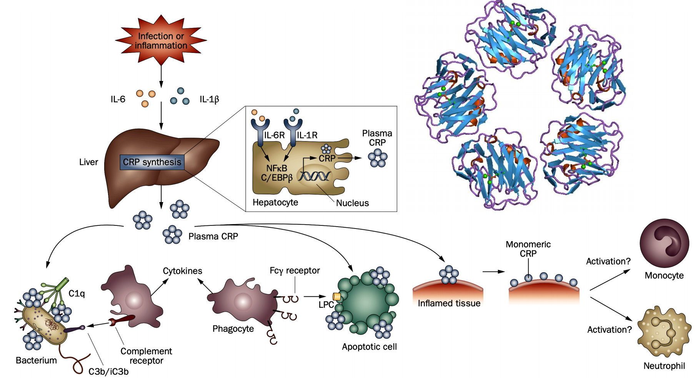

Damage-associated molecular patterns (DAMPs)
- **DAMPs 指 damage-associated molecular patterns，即损伤相关分子模式。**它们不是来自病原体，而是机体自身细胞在损伤、坏死或应激时释放出来的分子。**DAMPs 与 PAMPs 的核心区别在于来源不同。**PAMPs 来自病原体，而 DAMPs 来自机体自身；所以 DAMPs 可以在没有感染的情况下触发免疫反应。
- **DAMPs 触发的炎症常被称为无菌性炎症。**无菌性炎症指没有病原体存在时，由组织损伤诱发的炎症，例如心肌梗死、骨折后局部红肿、自身免疫病等。**DAMPs 的本质是“位置错误的自我分子”。** 正常情况下，细胞内或细胞核内的成分属于“自我”；但当细胞结构被破坏，这些分子被释放到细胞外或异常位置时，就会被 PRR 识别为危险信号。  

- DAMPs 的来源与代表分子，组织受到外力损伤时，会释放 DAMPs。骨折、挤压伤、缺血等情况会导致细胞破裂，使正常位于细胞内的分子暴露到细胞外。
  - ATP 是典型 DAMP，可以通过嘌呤受体触发炎症，ATP 主要通过 P2X7R 参与炎症激活。
  - HMGB1 是典型 DAMP，可被多种受体识别: HMGB1 可激活 TLR9；图3中 HMGB1 还可以通过 RAGE、TIM-3 等受体作用于不同细胞，HMGB1 可以连接多种免疫反应，HMGB1 可作用于 DC、肿瘤细胞、巨噬细胞和中性粒细胞，说明同一个 DAMP 可以在不同细胞中产生不同效应。
  - 尿酸也是一种 DAMP。尿酸可激活 TLR4；uric acid 与巨噬细胞、嗜中性粒细胞相关，提示它可参与炎症反应。  
  - S100 蛋白、IL-1α、腺苷等也可以作为损伤相关信号。S100 可通过 RAGE 作用于免疫细胞，IL-1α 可通过 IL-1R1 作用于内皮细胞或巨噬细胞，腺苷则通过 A1、A2A、A3 等受体发挥作用。S100 蛋白主要通过 RAGE 参与免疫调节。S100 与 RAGE 相连，并作用于 MDSC、肿瘤细胞或巨噬细胞，提示它可参与炎症或免疫抑制过程。
  - IL-1α 可以通过 IL-1R1 促进炎症相关反应。
- DAMPs 可以诱导炎症反应，参与无菌性炎症。DAMPs 也可能导致免疫抑制。DAMPs 还可能促进血管生成和细胞增殖。

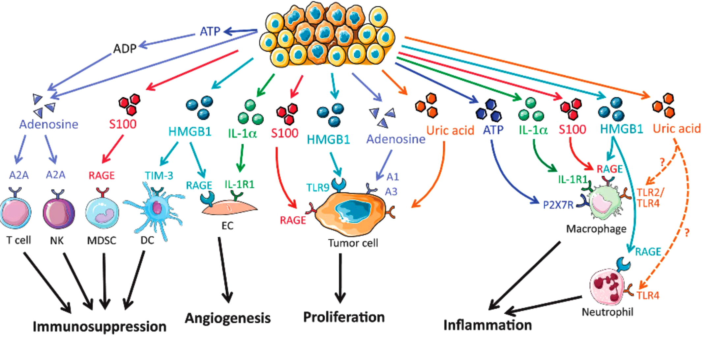

Sterile inflammation
- Sterile inflammation 指的是**没有病原体感染参与的炎症反应**。它通常由组织损伤、细胞坏死或代谢异常引起：当细胞受损后，原本应该待在细胞内或细胞核内的自身分子被释放到细胞外，这些“出现在错误位置的自我分子”就会成为 DAMPs，被 PRR 识别并触发先天免疫反应。因此，它和由细菌、病毒等 PAMPs 引起的感染性炎症不同，核心原因不是“外来病原体”，而是“自身组织损伤”。多种疾病都可以与无菌性炎症有关，例如阿尔茨海默病、帕金森病、中风、动脉粥样硬化、心肌梗死、2 型糖尿病、肥胖、关节炎、痛风、慢阻肺、矽肺等。这说明无菌性炎症并不局限于某一个器官，而是可以发生在脑、心血管、肺、代谢组织和关节等多个系统中。

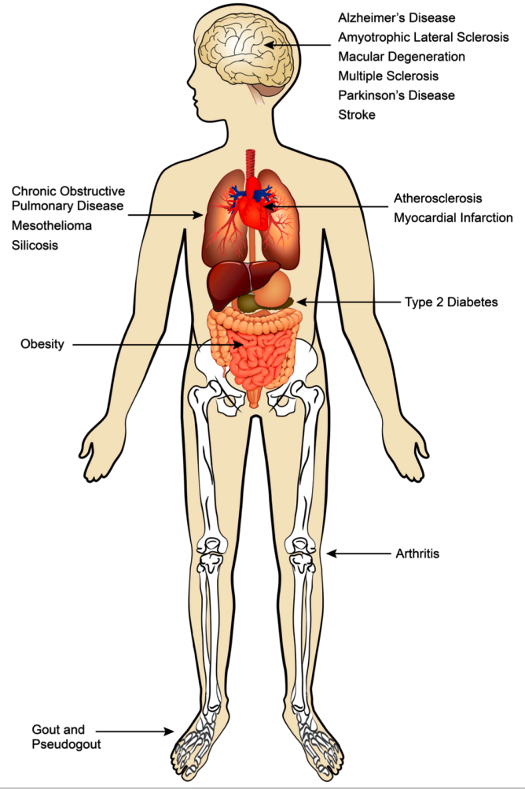

### NK cells

- **NK 细胞是连接天然免疫和适应性免疫的关键细胞。** 在病毒感染早期，天然免疫反应虽然启动快，但干扰素本身不能直接杀死病毒；而 T 细胞彻底清除病毒需要更长时间。因此，在感染后 5–7 天的“空窗期”，NK 细胞可以先被激活，帮助压低病毒载量。
- **NK 细胞属于 innate lymphoid cells, ILCs。** NK 细胞和 ILC 都属于天然淋巴细胞，和 T/B 细胞一样属于淋巴谱系，但它们没有经过重排的抗原特异性受体，因此反应更快、识别方式也更偏向模式化。  
- **NK 细胞主要针对病毒感染细胞和胞内病原体感染细胞。**

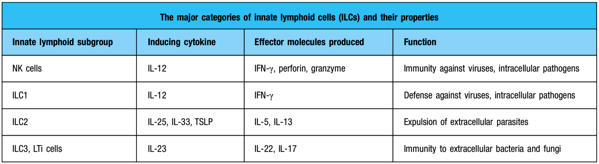

NK cells are activated by innate immune cytokines
- 病毒感染早期，细胞会先产生 IFN-α、IFN-β、TNF-α 和 IL-12。这些天然免疫细胞因子可以激活 NK 细胞，使 NK 细胞在 T 细胞完全启动前发挥杀伤作用。  
- NK 细胞介导的杀伤出现在 T 细胞杀伤之前.

> 绿色曲线代表早期细胞因子产生，蓝色曲线代表 NK 细胞杀伤，红色曲线代表 T 细胞杀伤；说明 NK 细胞是早期控制病毒的重要中间环节。  

- NK 细胞的作用不是完全清除病毒，而是防止病毒在适应性免疫启动前持续指数增长。NK 细胞更像是“早期压制者”，为后续 T 细胞彻底清除感染争取时间。

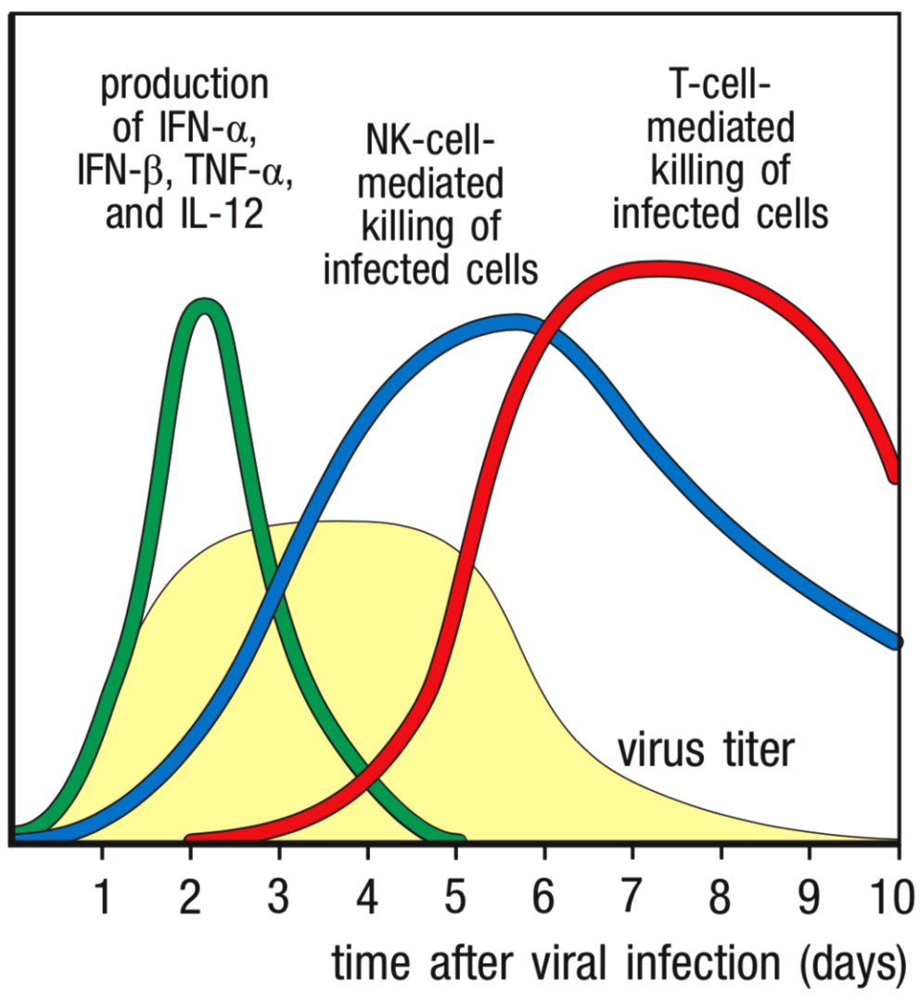

NK cells: Self vs. non-self
- NK 细胞的默认状态偏向“杀伤”。正常细胞表面的 MHC-I 会向 NK 细胞传递抑制性信号，使 NK 细胞不杀伤正常细胞。  
- 正常细胞表达 MHC-I，可以被 NK 细胞的抑制性受体识别. 当抑制性信号足够强时，它会压过激活性信号，因此NK细胞不会杀伤正常细胞。  
- 病毒感染细胞或肿瘤细胞常常下调 MHC-I。它们逃避免疫系统中的 T 细胞识别，但同时会让它们失去对 NK 细胞的抑制信号.
- 当 MHC-I 缺失或降低时，NK 细胞会感受到“missing self”。如果靶细胞同时表达激活配体，NK 细胞就会被激活并杀伤靶细胞。  
- NK 细胞是否杀伤靶细胞，取决于抑制性信号和激活性信号的整合。**  

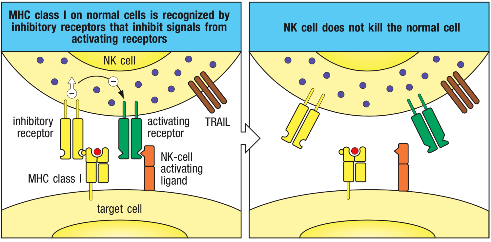

NK cells: Inhibitory receptors
- 抑制性受体主要识别 MHC-I 等“自我”信号。抑制性受体胞内含有 ITIM。ITIM: immunoreceptor tyrosine-based inhibitory motif，识别 MHC-I 等信号后会抑制 NK 细胞活化。
- 典型抑制性受体包括 KIR-2DL、KIR-3DL 和 CD94/NKG2A。这些受体通过胞内 ITIM 传递抑制信号，帮助 NK 细胞避免误伤正常自身细胞。

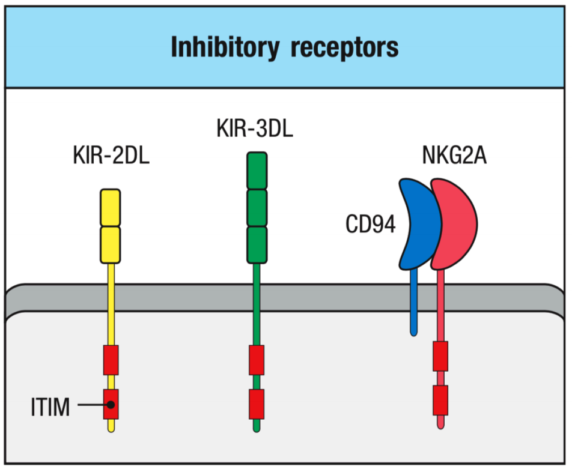

NK cells: Activating receptors
- 激活性受体主要识别感染、应激或肿瘤细胞表面的激活配体。当这些配体出现并且抑制信号不足时，NK 细胞会被激活.激活性受体胞内或连接的接头蛋白含有 ITAM: immunoreceptor tyrosine-based activation motif，识别应激配体后可以激活 NK 细胞。  
- 典型激活性受体包括 KIR-2DS、KIR-3DS、NKG2C、NKp30、NKp44、NKp46 和 NKG2D。
- 肿瘤细胞可能表达激活诱导配体，从而增强 NK 细胞激活。靶细胞表面的 MICA/B、ULBP1-6 等配体可被 NKG2D 等激活性受体识别。  

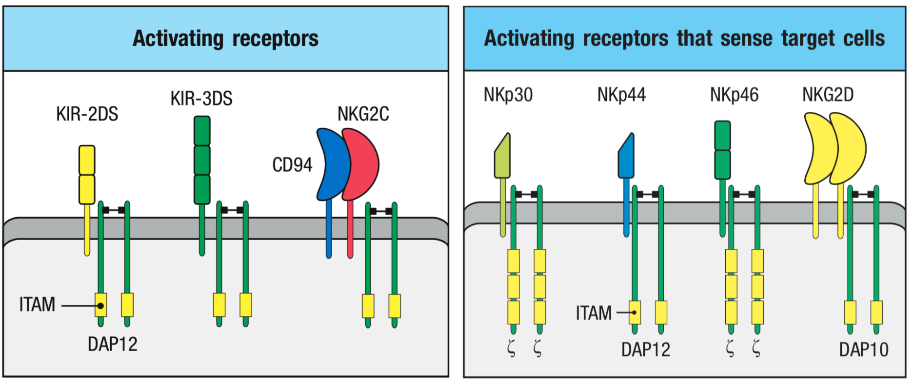

Cytotoxicity of NK cells: Degranulation
- 脱颗粒是 NK 细胞最重要的杀伤方式之一。 当 MHC-I 缺失导致抑制信号不足，同时激活受体信号占优时，NK 细胞会释放颗粒内容物，诱导靶细胞凋亡。
- NK 细胞释放的主要颗粒成分是 perforin 和 granzyme B。Perforin 可以在靶细胞膜上打孔，使 granzyme B 更容易进入靶细胞。  
  - Granzyme B 进入靶细胞后，可以激活 caspase 级联反应.granzyme B 可激活 caspase-8、caspase-3，也可以通过线粒体通路促进 cytochrome c 释放和 caspase-9 激活。  
  - caspase 激活后会导致 DNA fragmentation 和细胞凋亡。activated caspase-3 可通过 CAD/ICAD 途径导致 DNA fragmentation，这是靶细胞凋亡的重要结果。  
- 脱颗粒通路的逻辑是：perforin 打孔 → granzyme B 进入 → caspase 激活 → 靶细胞凋亡。

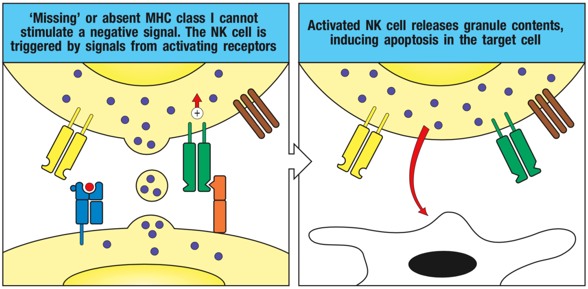

Cytotoxicity of NK cells: TRAIL signal
- NK 细胞表面可以表达 TRAIL。TRAIL 是 TNF family ligand，可以与靶细胞表面的死亡受体结合。  
  - TRAIL 主要结合靶细胞表面的 DR4 或 DR5。当 TRAIL 与 DR4/DR5 结合后，会通过 FADD 招募并激活 pro-caspase-8。  
  - caspase-8 激活后会启动外源性凋亡通路。
  - TRAIL 通路还可以与线粒体凋亡通路相连接。caspase-8 可通过 tBID 影响 BAX/BAK，进一步引起线粒体释放 cytochrome c，激活 caspase-9 和 caspase-3/6/7。  
  - TRAIL 信号在某些情况下也可能连接到 necroptosis。
- TRAIL 通路的核心逻辑是：TRAIL 结合 DR4/DR5 → FADD 招募 → caspase-8 激活 → apoptosis；部分情况下也可能连接 necroptosis。

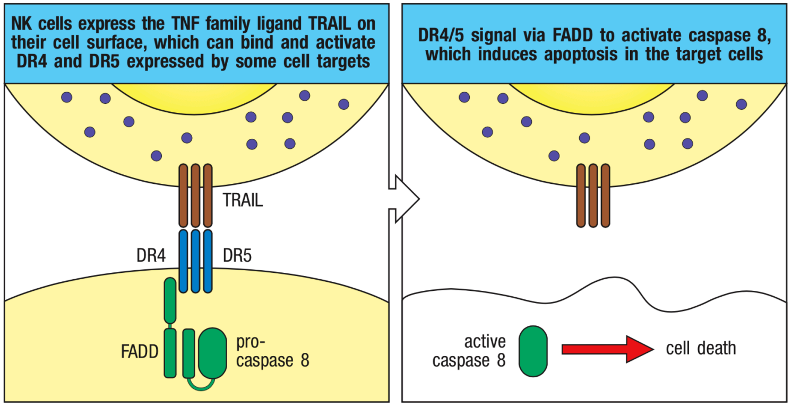

### Innate lymphoid cells (ILCs)

Innate lymphoid cells (ILCs)
- 天然淋巴细胞（innate lymphoid cells, ILCs）属于淋巴谱系，但没有重排的抗原特异性受体。因此它们不像 T/B 细胞那样依赖抗原特异性识别和克隆扩增，而是可以快速响应局部细胞因子和 alarmins。ILCs 是天然免疫细胞，但功能上与适应性免疫中的 T 细胞高度对应。NK 细胞类似 CD8+ T 细胞，ILC1 类似 Th1，ILC2 类似 Th2，ILC3 类似 Th17。
- ILC1、ILC2、ILC3 的命名与 Type 1、Type 2、Type 3 immunity 对应。ILCs 的关键价值在屏障组织。它们分布在皮肤、肺、肠道等屏障部位，可以在感染早期快速改变局部细胞因子环境，为后续适应性免疫提供方向。  

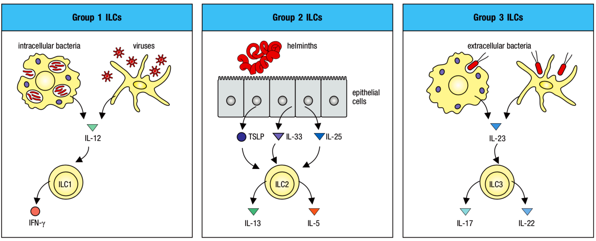

Type 1 innate lymphoid cells (ILC1s)
- LC1 主要参与抗病毒、抗胞内细菌和抗原虫反应。胞内细菌、病毒和原虫刺激组织后，树突状细胞等细胞产生 IL-12、IL-18，从而激活 NK/ILC1。ILC1/NK 被激活后主要产生 IFN-γ。IFN-γ 可以增强巨噬细胞的杀伤功能，使其产生 MMPs、NO、细胞因子等，帮助清除胞内病原体。  
- ILC1 还可以帮助适应性免疫向 Th1/Tc1 方向发展。NK/ILC1 产生 IFN-γ，并与树突状细胞、初始 CD4⁺/CD8⁺ T 细胞共同促进 Th1 和 Tc1 反应。
- ILC1 的核心逻辑是：胞内感染 -> IL-12/IL-18 -> ILC1/NK -> IFN-γ -> 激活巨噬细胞和细胞毒反应。  

Type 2 innate lymphoid cells (ILC2s)
- ILC2 主要参与抗寄生虫、抗真菌感染以及过敏反应，蠕虫刺激上皮和树突状细胞，使局部产生 IL-25、IL-33、TSLP，从而激活 ILC2。
- ILC2 激活后主要产生 IL-5 和 IL-13，也可与 IL-4 相关反应协同。IL-5 促进嗜酸性粒细胞分化和活化，IL-13 促进杯状细胞增生和黏液分泌。
- ILC2 可以促进肥大细胞、嗜碱性粒细胞和嗜酸性粒细胞参与反应。ILC2/Th2 产生的细胞因子可以促进这些细胞释放血管活性介质、细胞因子或毒性蛋白。  
- ILC2 与 Th2 反应功能对应：两者都围绕 IL-4、IL-5、IL-13 展开，最终形成 Type 2 immunity，用于驱虫、促进黏液分泌和屏障防御。  
- ILC2 的核心逻辑是：寄生虫/屏障刺激 → IL-25、IL-33、TSLP → ILC2 → IL-5、IL-13 → 嗜酸性粒细胞、黏液分泌和屏障修复。

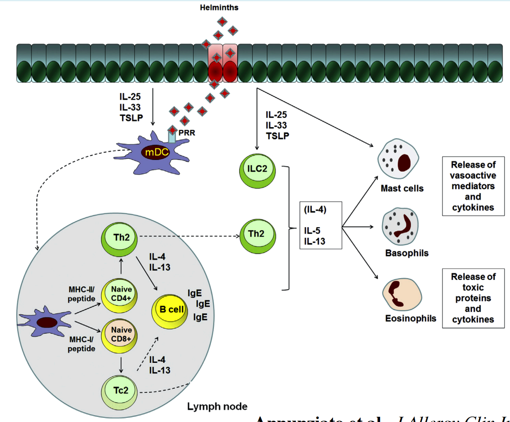

Type 3 innate lymphoid cells (ILC3s)
- ILC3 主要参与抵御胞外细菌和真菌，尤其重要于肠道黏膜等屏障组织。胞外细菌和真菌刺激后，树突状细胞产生 IL-1β 和 IL-23，进一步激活 ILC3。  
- ILC3 激活后主要产生 IL-17A、IL-17F 和 IL-22。这些细胞因子作用于上皮细胞、内皮细胞、成纤维细胞和巨噬细胞，增强局部抗菌防御。IL-22 促进上皮修复和再生。IL-17 可以促进中性粒细胞募集。
- ILC3 与 Th17 反应功能对应。两者都以 IL-17、IL-22 为核心效应因子，主要负责胞外细菌、真菌防御和上皮屏障稳态。  
- ILC3 的核心逻辑是：胞外细菌/真菌 -> IL-1β、IL-23 -> ILC3 -> IL-17、IL-22 -> 抗菌肽、屏障修复和中性粒细胞募集。 

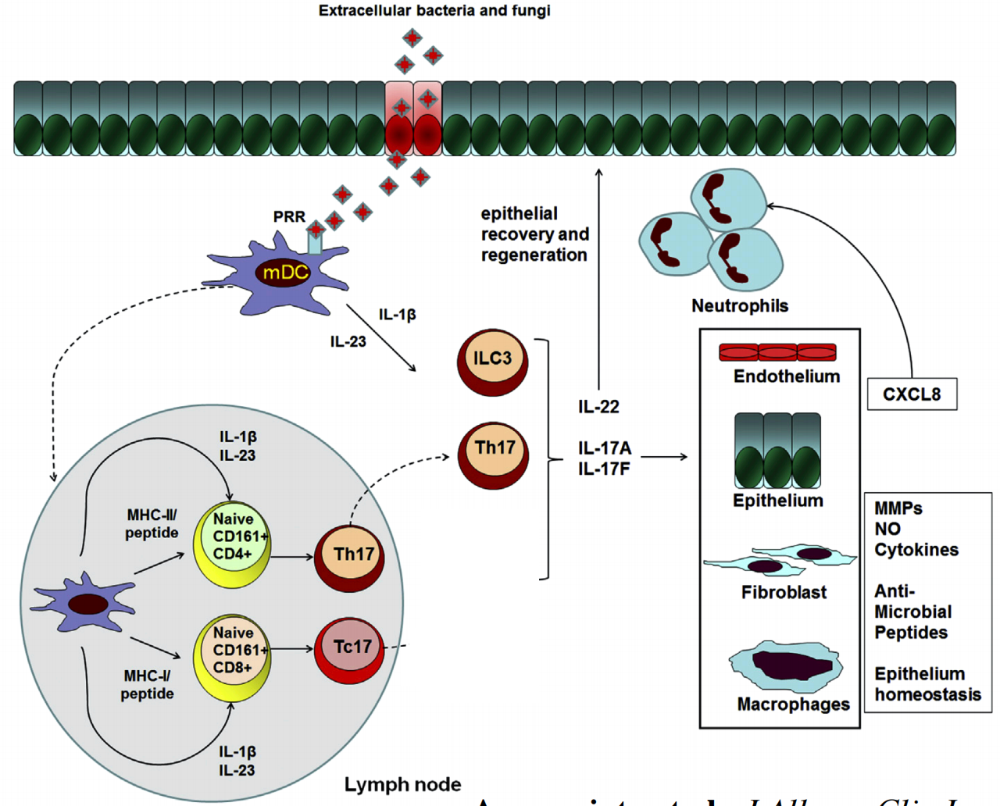

Innate and adaptive immunity

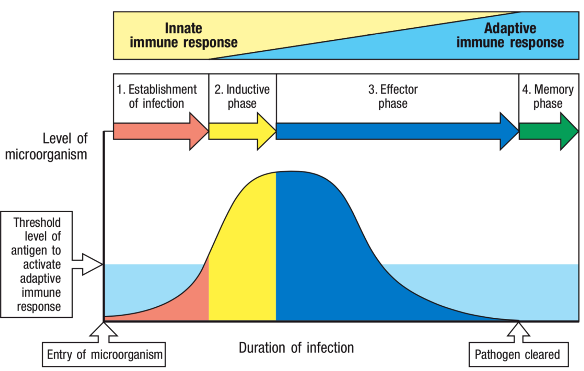

Adaptive immunity depends on innate immunity
- 适应性免疫依赖天然免疫提供早期控制和方向引导。如果缺少天然免疫成分，病原体会快速失控；如果只有天然免疫而缺少 T/B 细胞，病原体可以被部分控制但难以彻底清除。  
- 正常个体依靠天然免疫和适应性免疫的配合清除感染
- 屏障感染后，天然免疫先在局部发挥作用。
- 树突状细胞把局部感染信息带到淋巴结，启动适应性免疫。
- 适应性免疫最终通过抗体、T 细胞依赖的巨噬细胞活化和细胞毒 T 细胞清除感染。
- 整体逻辑是：屏障感染 -> 天然免疫快速控制 -> 树突状细胞迁移至淋巴结 -> 适应性免疫启动 -> 特异性清除病原体。


# Adaptive immunity: T cells

适应性免疫涉及大范围的细胞迁移
- 抗原呈递
- 激活的T、B细胞必须通过循环到心脏附近的胸管，进入血液循环，然后再回到感染位置

### Antigen presentation

#### Dendritic cells

机体最重要的抗原呈递细胞，链接了天然免疫反应和适应免疫反应

树突状细胞可以起源于髓系也可以起源于淋系

形态： 有明显的树突状分支，为了尽可能增大细胞表面积，捕获抗原、呈递抗原
- 感染位置会形成更多的分支分叉，捕获更多细胞
- 进入淋巴结之后会皱缩，细胞面积没有变化，变成近乎于球状，有利于在淋巴内运输
- 到Tcell Bcell区域之又变回分叉状态

- cDC(convenetional)
- pDC(plasmacytoid): 产生抗病毒免疫反应中的天然免疫反应

**MHC(major histocompatibility complex):**
- complex（复合物）：在基因组上由多个基因编码
- hitocompatibility：组织兼容，不排斥（from 皮肤移植实验）
- major：决定组织兼容分为主要因素和次要因素，major代表MHC为主要因素

MHC存在的真实意义为呈递抗原
呈递的必须是连续的线性的结构，which means如果是一段多肽需要先将蛋白质裂解

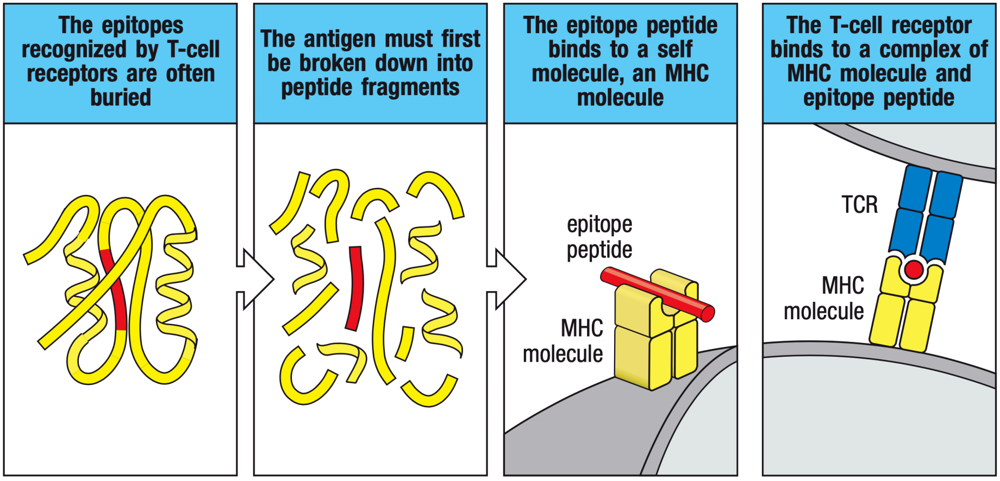

从antigen到epitope：
- epitope：能够被一个T/B cell所识别的表位（就是刚才说的多肽）

MHC1 & MHC2

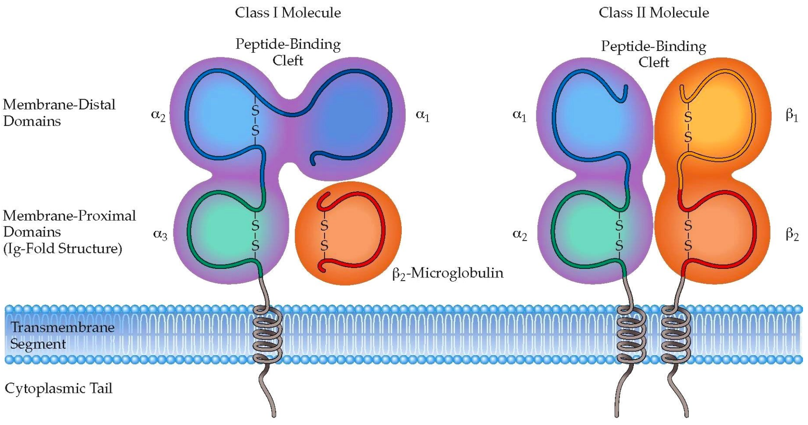

- 都是一元二聚体
- MHC1: 跨膜蛋白大亚基，和不跨膜的小亚基（大亚基决定了抗原呈递位置）
- MHC2: 几乎对等的两个跨膜亚基（共同组成抗原呈递表位）

MHC1 所呈递的是intracellular components：

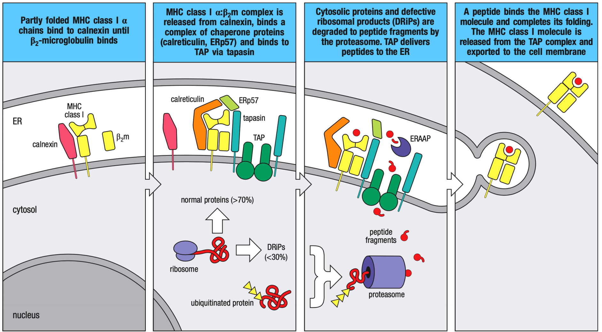

- 肽的结合是纯随机状态，有结合的hotpot和coldpot，N端和C端分别有梳水的结构，形成稳定存在的热点区域，与N/C端距离固定，呈递的peptide大概就是8个氨基酸
- CD8
- 呈递病毒，代表着细胞已经被感染，需要的就是直接杀死，所以呈递对象是CD8，CD8的一个亚基可以直接结合MHC1蛋白

MHC2 呈递extracellular components：细胞从外部环境捕获消化的产物

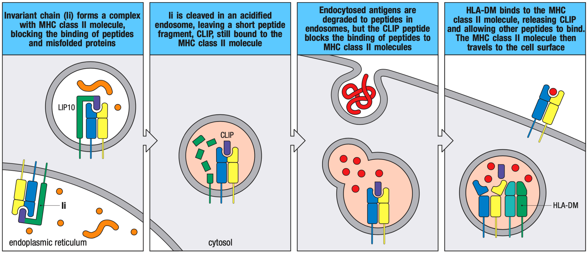

- 在ER形成后必须转移到能够消化蛋白的西方，并带有一个invariant chain（CLIP），一方面作为信号分子转移，另一方面卡住，保证MHC2不会被loading出自身的肽；在溶酶体中信号分子chain被降解，然后CLIP还在；等到胞外进入溶酶体之后CLIP再离开
- CD4
- 呈递的东西很多样，N/C端比较的flexible，长短不一，但即使N/C不稳定，依然能找到保守性的位点，只是往N/C具体不固定，是可以滑动的
- 代表环境中有病原体了，所以需要增强免疫系统和找到病原体，所以呈递对象是辅助性Tcell CD4，同理，CD4的一个亚基可以直接结合MHC2蛋白

> cross presentation:
> 如果病毒被细胞摄取之后逃过了溶酶体，就会被MHC1呈递出去

组织兼容性的定义：MHC也会被呈递

控制MHC分子的基因强烈连锁
- 每一个基因都具有强烈的核酸水平多态性，导致蛋白水平显著不行
- 多态性多在beta亚基
- 多态性在某些特殊的位点具有非常高的多态性，最高的微点都是能呈递抗原的位置

但是对一个确定序列的MHC分子，能呈递的肽段是保守的，稳定的
结合的病毒可能不同，但是都是保守的motif

TCR受体（T-cell receptor）
每个亚基有三个CDR（一共6个），可以非常清晰的感知MHC呈递的结构，有的是读肽段，有的是识别MHC分子

进化上：单基因到多基因，多基因呈现出多态性
Polygeny and polymorphism of MHC molecules ensure the efficiency of antigen presentation

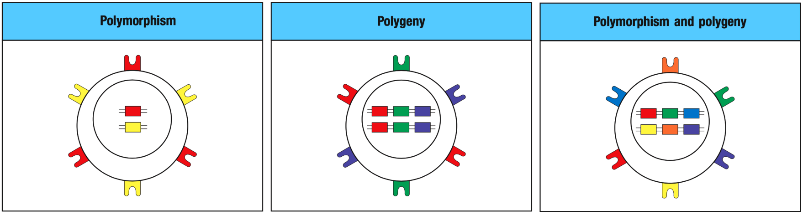

获得性免疫免疫没有区分自我和非我能力，这个部分是由天然免疫反应做到的

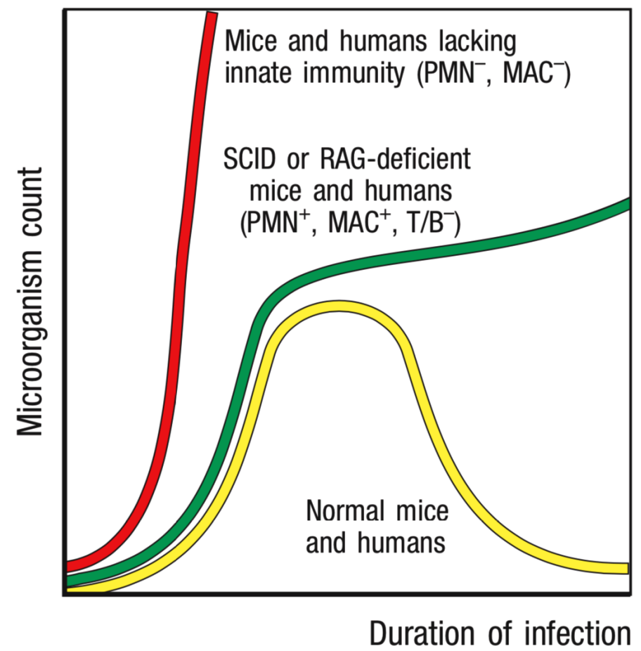

Innate immunity enhances antigen presentation
- 树突状细胞在静息状态下，被MARCH分子卡在了分泌过程中，当病毒侵染后，天然免疫反应激活了toll受体（eg），抑制了MARCH分子的表达，降解之后就开始呈递了

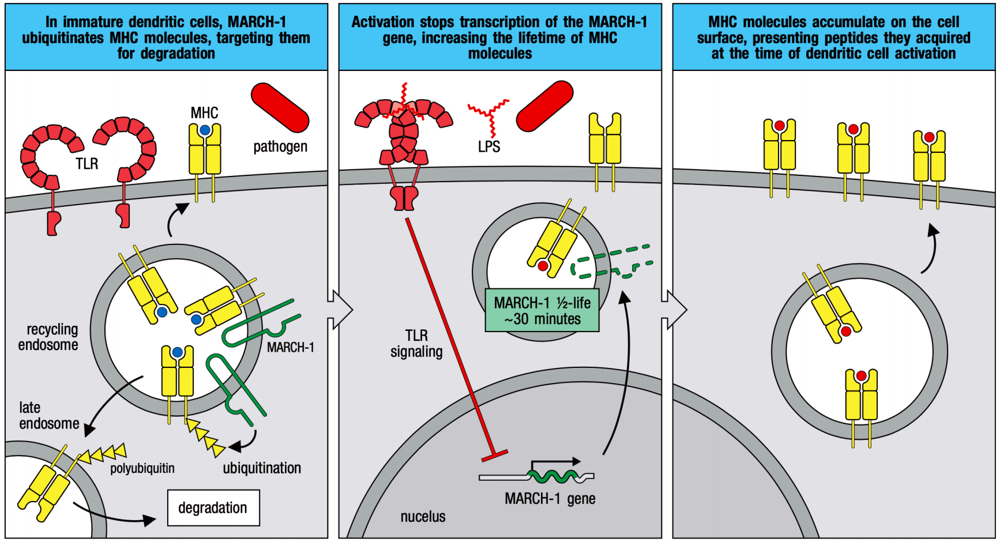

获得性免疫遗传的激活必须需要天然免疫反应 -> 共刺激信号

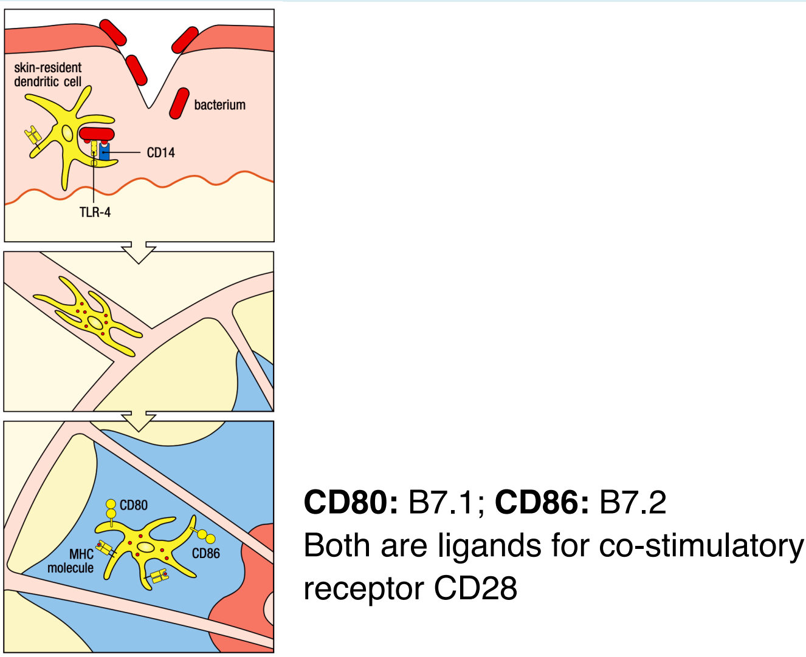

局部的非我信息转化为树突状细胞可以表达的信息（膜上高表达共刺激信号，传递到淋巴结）-> signal II

signal I和signal II的**co-stimulatory signal**，二者必须共激活才能产生反应

同时是co-stimulation和co-inhibition信号

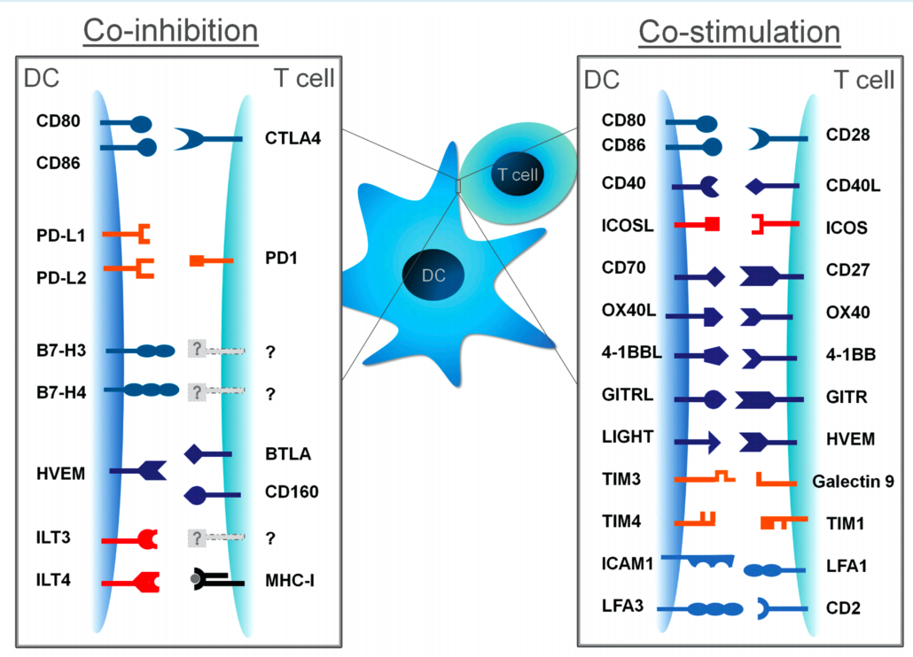

### T cell-mediated responses

T 细胞受体 TCR 通常指 αβ TCR，由 TCRα chain 和 TCRβ chain 组成，是一个异二聚体 heterodimer。
每条链都包括可变区和恒定区：
- TCRα chain:
  - Vα: variable region，可变区
  - Cα: constant region，恒定区
- TCRβ chain:
  - Vβ: variable region，可变区
  - Cβ: constant region，恒定区

其中 Vα 和 Vβ 位于 TCR 顶端，共同形成 antigen-binding site。

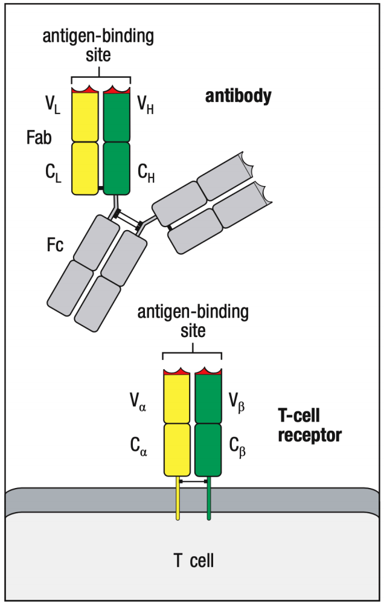

TCR 的结构可以类比抗体的 Fab 区。
抗体中：
- VL 和 VH 共同形成 antigen-binding site
- CL 和 CH 是 constant region
- Fab 负责抗原结合
- Fc 负责效应功能
因此，TCR 可以理解为一种膜结合的、类似 antibody Fab 区的抗原识别受体。

- 抗体/BCR 可以直接识别游离抗原，例如蛋白质、毒素或病毒表面结构。TCR 不能直接识别游离抗原，而是识别 peptide-MHC complex，即抗原肽-MHC 复合物。因此，TCR 的 antigen-binding site 更准确地说是 peptide-MHC recognition site。

TCR 可变区中含有 CDRs，即 complementarity-determining regions: 一个 αβ TCR 一共有六个 CDR：
- CDR1α、CDR2α、CDR3α
- CDR1β、CDR2β、CDR3β

- CDR1 和 CDR2:
  - 主要由 V region 编码, 多样性相对有限, 主要接触 MHC 分子, 对 MHC 具有固有亲和力

- CDR3:
  - 位于 V(D)J junctional region, 多样性最高, 主要接触抗原肽 peptide, 是 TCR 抗原特异性的关键区域

Gene organization of TCRα and TCRβ loci
- 红色方块：V gene segments, TCRα 中是 Vα, TCRβ 中是 Vβ
- 绿色方块：D gene segments, 只出现在 TCRβ locus 中, TCRα locus 中没有 D segment
- 黄色方块：J gene segments, TCRα 中是 Jα, TCRβ 中是 Jβ
- 蓝色方块：C region, TCRα 中是 Cα, TCRβ 中是 Cβ1 和 Cβ2
- 白色方块 L：leader sequence，编码 signal peptide，帮助新合成的 TCR 多肽链进入内质网分泌途径，最终使 TCR 能够作为膜蛋白表达在 T 细胞表面

- **α-chain locus** 

```text
多个 Vα gene segments → 多个 Jα gene segments → 一个 Cα region
```
- **β-chain locus**
```text
多个 Vβ gene segments → Dβ-Jβ-Cβ cluster → Dβ-Jβ-Cβ cluster
```

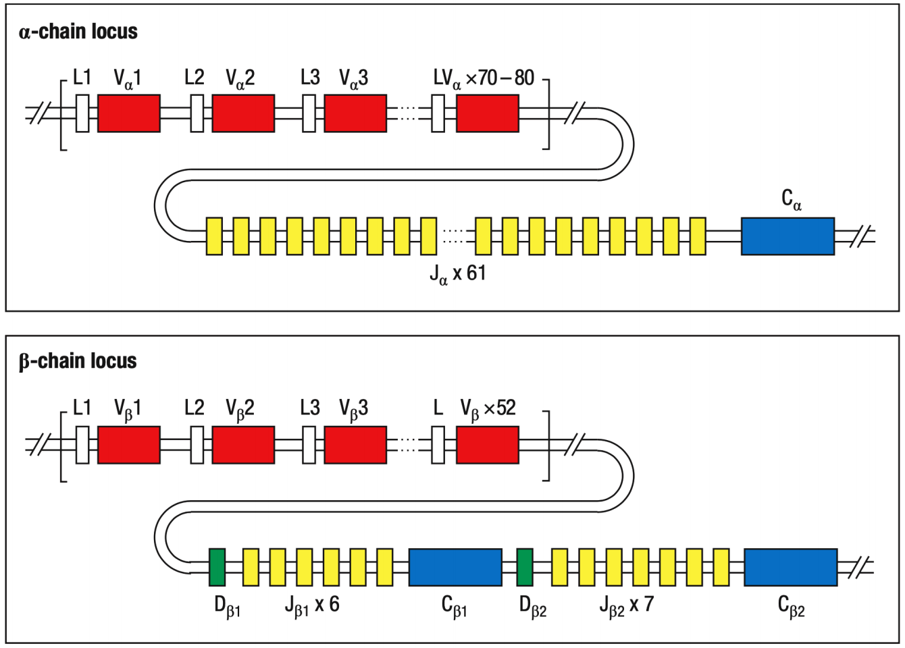

V(D)J recombination of TCRα and TCRβ loci

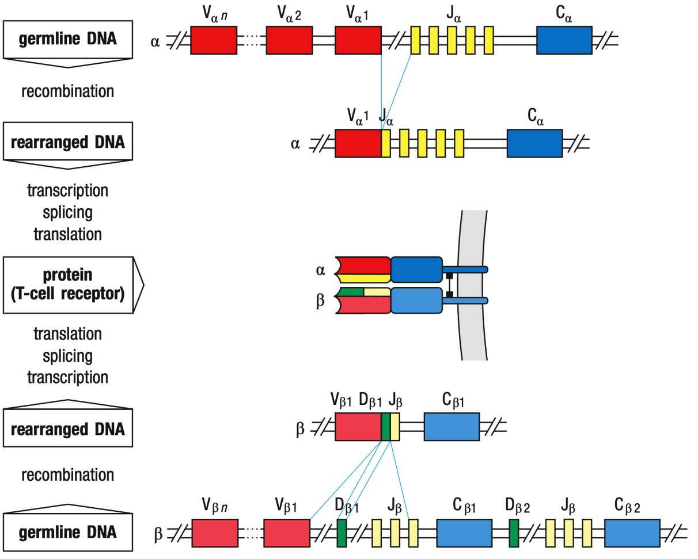

- **germline DNA** 指的是还没有发生重排之前的原始基因排列状态。
  - V gene segments、D gene segments、J gene segments 和 C region 是分开的；

- TCRα locus 的重排方式：VJ recombination，**Vα1**被选中并连接到一个 **Jα** 片段上，重排完成后，原来分散的 Vα 和 Jα 被拼接到一起，然后这个重排后的 α 链基因再经过：transcription, splicing, translation形成最终的蛋白质

- TCRβ locus 的重排方式：VDJ recombination，重排完成后，Vβ、Dβ、Jβ 被连接成一个连续的可变区编码序列，然后这个重排后的 β 链基因再经过：transcription，splicing，translation 最终产生TCRβ chain。
```text
Vβ + Dβ + Jβ → rearranged VDJβ
```

Recombination signal sequence (RSS) and the "12/23 rule"
- RSS 全称是：是 V(D)J recombination 中被重组酶识别的 DNA 信号序列，RSS 通常由三部分组成：heptamer + spacer + nonamer
  - heptamer：7 个核苷酸组成的保守序列，靠近 V、D、J coding segment；
  - spacer：间隔区，可以是 12 bp 或 23 bp（12-RSS和23-RSS）
  - nonamer：9 个核苷酸组成的保守序列。

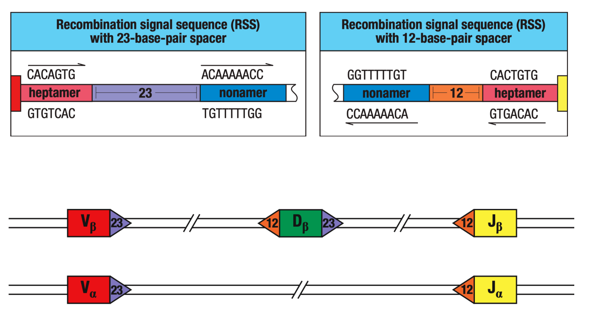

- 12/23 rule**：V(D)J recombination 中，只有一个 12-RSS 和一个 23-RSS 可以配对重排。这个规则保证了 V、D、J gene segments 按照正确顺序连接，而不会随便连接。避免同类 gene segment 之间错误连接。

- V gene segment 在基因组中可以有不同方向，因此重排后 DNA 的结果也不同。V gene segment 相对于下游 J gene segment，可以是forward orientation或者reverse orientation
  - forward-oriented V gene segment：删除型重排，当 V gene segment 和 J gene segment 方向相同的时候，中间 DNA 会形成一个环状结构。重排完成后，中间 loop 被从染色体上切除，形成一个带有 RSS 的环状 DNA。
    - coding joint 留在染色体上；
    - signal joint 位于被切除的环状 DNA 上；
    - intervening DNA 被删除。
  - reverse-oriented V gene segment：倒位型重排，a当 V gene segment 和 J gene segment 方向相反时，两个 RSS 对齐后，中间 DNA 不会简单形成可切除的环，而是形成一种盘绕结构。
    - intervening DNA 仍然保留在染色体中；
    - 但它的方向发生 inverted orientation；
    - 这与删除型重排不同。

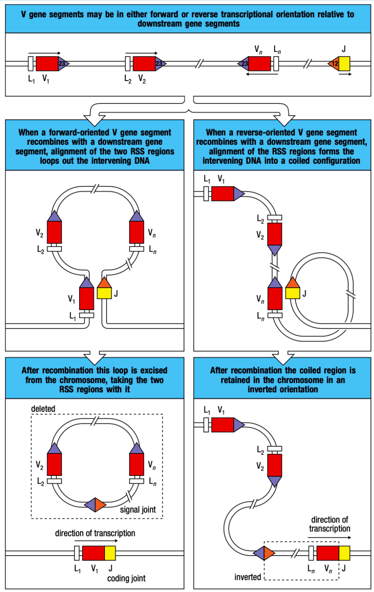

The "12/23 rule" is enforced by RAG1 proteins
- 两个 RAG1/RAG2 单元：RAG1 的 NBD 不是刚性固定的，而是通过柔性铰链连接到 RAG1 主体上，RAG1 的 NBD 通过 flexible hinge 具有一定空间可动性，使 RAG1 能够识别 RSS 中的 nonamer，并参与 RSS 配对。nRAG1 不是随便结合 DNA，而是通过 NBD 识别 RSS 中特定的 nonamer 区域。
- 当一个 12-bp RSS 已经结合到一个 RAG1 上时，会促进另一个 RAG1 去结合 23-bp RSS。这就是12/23 rule 的结构基础。
  - RAG1 的 NBD 主要靠近并识别 **nonamer**；
  - **heptamer** 靠近真正要发生重排的 V/J 编码片段，标记 coding segment 和 RSS 的边界，让 RAG1/RAG2 在正确位置切割 DNA
  - 12-bp spacer 和 23-bp spacer 的长度差异影响两个 RSS 能不能被 RAG 复合体正确装配。

V(D)J recombination generates a diversity of TCRα and TCRβ

Nucleotide additions at the V(D)J joints further diversify TCR
- RAG1/RAG2 复合体先识别并结合 V、D、J 片段旁边的 RSS。两个合适的 RSS 被 RAG1/RAG2 复合体拉到一起，形成 synaptic complex。在这个复合体中，两个准备重排的 gene segments 被放到合适位置，RAG1/RAG2 在 coding segment 与 RSS 的交界处切割 DNA。会形成coding ends（来自 V、D、J 编码片段的一端）和signal ends（来自 RSS 的一端）。
- RAG 切割后，coding ends 会形成：covalently closed DNA hairpin ends，这个 hairpin 不能直接连接，必须先被打开。Ku70/Ku80 是 DNA 修复相关蛋白，可以识别 DNA 断端，它们结合 coding ends 后，招募后续修复蛋白。DNA-PK 和 Artemis 复合体打开 coding ends 上的 DNA hairpin。**它不是一定在正中间对称打开，会产生短的回文序列** P-nucleotides
- TdT 处理 DNA ends，加入 N-nucleotides，可以在没有模板的情况下，随机向 DNA 末端加入核苷酸。这些由 TdT 随机加入的核苷酸称为N-nucleotides，N-nucleotides 是非模板编码的随机核苷酸，最多可以加入约 20 个左右。
- DNA ligase IV:XRCC4完成连接。
- signal ends 是 5'-phosphorylated blunt ends，signal joint 的结果是 Precise signal joint，也就是 **精确连接**。

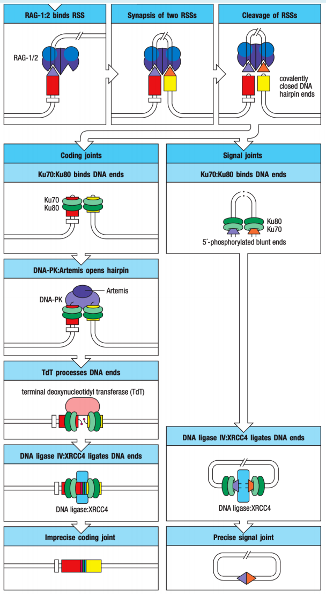

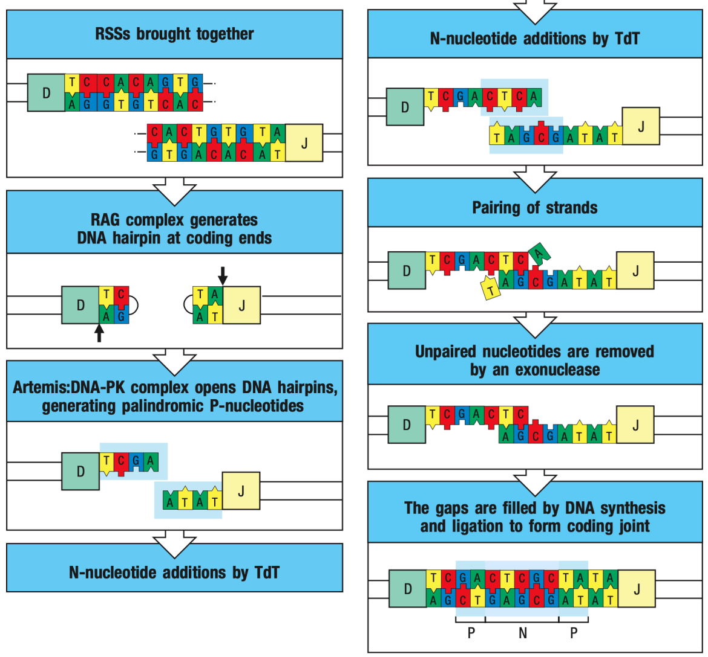

Repeated recombination can rescue nonproductive VαJα rearrangement
- 第一次 Vα-Jα 重排发生了，但是这个连接不是 functional 的，nonproductive rearrangement
  - V-J junction 处核苷酸随机增加或删除；
  - reading frame 被破坏；
  - 出现 frameshift；
  - 出现 premature stop codon；
  - 最终不能产生 functional TCRα chain。
- 后续的重排可以绕过之前失败的 VJ 连接，使用其他还没有被消耗的 Vα 和 Jα 片段。TCRα locus 中 Jα 片段数量很多，因此第一次失败后，细胞可以选择更靠后的 Jα 片段继续重排。TCRα locus 可以发生多轮重排，直到产生一个功能性 α 链。
- 为什么 TCRα 链可以这样补救
  1. TCRα locus 有很多 Jα gene segments：第一次失败后，后面仍然有其他 Jα 片段可用。
  2. TCRα 是 VJ recombination：不需要 D segment，因此可以通过新的 Vα-Jα 组合继续尝试。
  3. VJ 连接失败不一定立即终止所有可能性：只要还有可用的 Vα 和 Jα 片段，就可能继续重排。

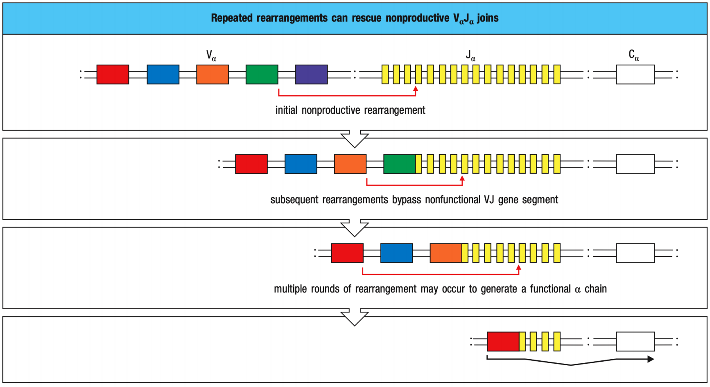

“Unconventional” TCR: TCRδ and TCRγ loci
- Human TCR α, δ chain locus: 人类 TCRα 和 TCRδ 相关基因座位于 **14 号染色体**，整个区域约 **1000 kb**。TCRδ locus 位于 TCRα locus 相关区域之中。TCRδ locus 嵌在 TCRα locus 内, TCRδ 的基本结构可以概括为：TCRδ locus = Vδ + Dδ + Jδ + Cδ, TCRδ 不是简单的 VJ 型结构，而是含有 Dδ 片段的结构。
- 有 5 个 Vδ gene segments 与 TCRα 共用；另外还有 1 个额外的 Vδ gene segment 只用于 TCRδ。
  - 一部分 **Vδ gene segments** 可以与 **TCRα** 共用；
  - 另外还有一个 **TCRδ 专属的 Vδ gene segment**。
- 人类 TCRγ chain locus 位于 **7 号染色体**，整个区域约 **200 kb**。TCRγ locus 的基本结构是：Vγ gene segments —— Jγ gene segments —— Cγ regions，TCRγ 和 TCRα 类似，没有 D segment，属于 VJ 型结构。

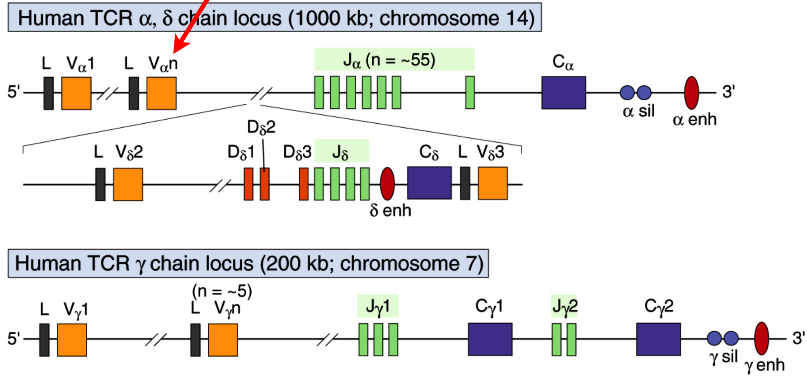

Unusual V(D)J recombination of TCRδ

> **蓝色方块**：Vδ gene segments  
> **红色方块**：Dδ gene segments  
> **黄色方块**：Jδ gene segments  
> **绿色方块**：C region  
- D-J rearrangement: TCRδ 的 D-J 重排中，可以保留两个 Dδ segments。
- V-D-J rearrangement: 一个 Vδ segment 再接到前面形成的 Dδ-Dδ-Jδ 结构上。
- splicing 形成 TCRδ transcript
- 因为多保留一个 Dδ segment，就意味着多了一个连接区 junction。这些连接区都可能发生核苷酸的随机加减，因此会进一步增加 TCRδ chain 的多样性。

VαJα rearrangement deletes TCRδ locus
- TCRα 链发生的是 **VJ recombination**：在这个过程中一部分DNA被切掉，其中包括：Vδ，Dδ × 3，Jδ × 4，Cδ，一旦这个 TCRα 重排发生，这个等位基因上的 TCRδ locus 就不能再用于产生 TCRδ chain，即TCRα 和 TCRδ 在同一个基因区域中存在结构性互斥。

V(D)J recombination and Complementarity-determining regions (CDRs)
- TCR 的抗原结合位点不是一个单独结构，而是由 α 链和 β 链上的多个 CDR loops 共同组成。**
  - CDR1α：位于 Vα region
  - CDR2α：位于 Vα region
  - CDR3α：位于 Vα-Jα junction
  - CDR3α：V-J junction 处会发生 P/N nucleotide additions，所以 CDR3α 多样性更高。
  - CDR1β：位于 Vβ region
  - CDR2β：位于 Vβ region
  - CDR3β：位于 Vβ-Dβ-Jβ junction
  - **CDR3β** 横跨 V-D-J junction：V-D 和 D-J junction 处会发生 P/N nucleotide additions，因此 CDR3β 多样性很高。

Complementarity-determining regions, CDRs, recognize the complex of MHC-peptide
- TCR 的 CDRs 不是单独识别 peptide，而是识别 MHC-peptide complex。
  - TCR 的 CDR loops 需要同时接触两类结构：**MHC 分子的表面** + **MHC groove 中呈递的 peptide**
  - CDR1/CDR2 主要负责接触 MHC 分子
  - CDR3α 和 CDR3β 更靠近 MHC groove 中央，也就是 peptide 所在的位置。CDR3 主要负责接触 peptide，是 TCR 抗原肽特异性的关键区域。

CDR1 and CDR2 of V-region genes have inherent affinity for MHC molecules
- CDR1 和 CDR2 主要由 TCR 的 V region 编码，CDR1/CDR2 的结构主要由选择了哪个V gene segment决定。这和 CDR3 不同。CDR3 主要位于 V(D)J junction，受到 P/N nucleotide addition 和 junctional diversity 的强烈影响，因此多样性更高。TCR 不是完全随机地“撞上”MHC，而是 V region 编码的 CDR1/CDR2 已经在结构上适合接触 MHC 分子。

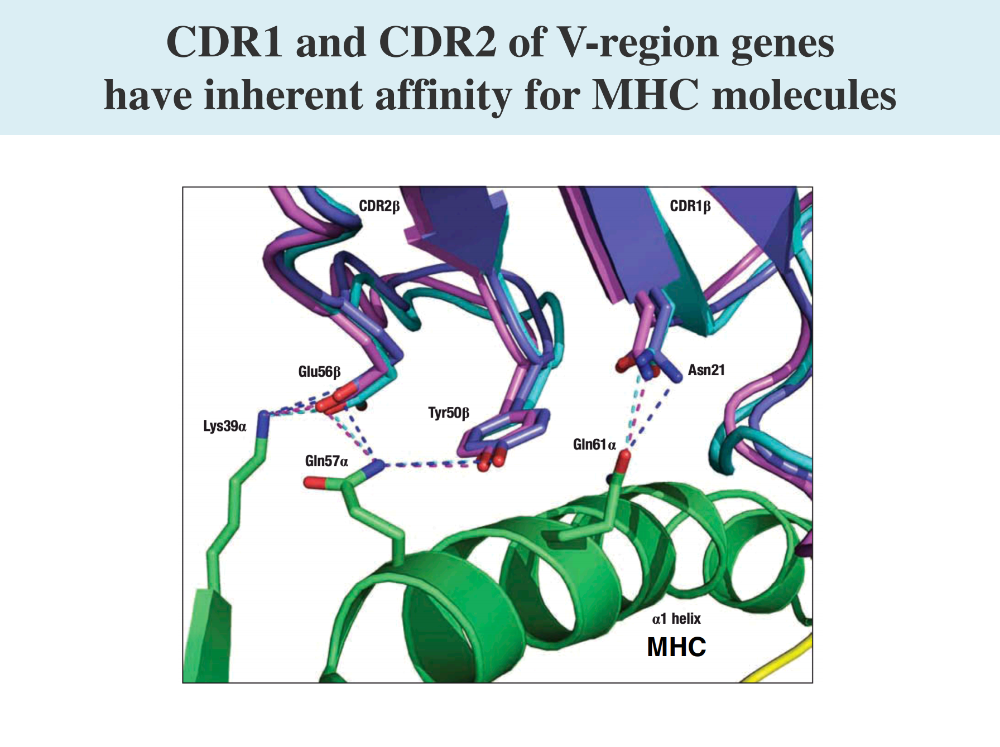

T-cell development
1. T-cell precursor 承诺进入 T-cell lineage: T 细胞前体在 Notch signaling 的作用下承诺进入 T-cell lineage，并开始 TCR 基因重排。
  - 一个T-cell precursor和一个thymic stromal cell，二者之间有Notch signaling；
  - T-cell precursor 内部已经开始出现 TCR gene rearrangement 的示意
  - T 细胞发育的第一步是 lineage commitment，也就是前体细胞决定走向 T cell fate
  - 同时，它开始进行：T-cell receptor gene rearrangements
2. 未成熟 T 细胞接受 self MHC / self antigen 检验
  - 能够识别 self MHC 的 immature T cells 会获得存活信号；但是如果它们与 self antigen 反应过强，就会被从 TCR repertoire 中清除。
    - 完全不能识别 self MHC：无法获得存活信号；
    - 能适度识别 self MHC：可以继续发育；
    - 过强识别 self antigen：会被删除，避免自身免疫。
3. 成熟 T 细胞进入外周淋巴器官并遇到 foreign antigen
  - 成熟 T 细胞离开胸腺后，并不是马上发挥效应功能，而是要到外周淋巴器官中寻找由抗原呈递细胞呈递的外来抗原。
4. 被激活的 T 细胞增殖并清除感染
  - 激活后的 T cell 可以：激活 macrophage & 杀伤 infected cell

Thymus structure and T-cell development environment
- T 细胞虽然来源于骨髓相关前体细胞，但其发育和选择主要发生在 thymus 中
  - cortex：皮质区（深紫色、细胞密集的区域对应 **cortex**）
    - 胸腺皮质区含有大量正在发育的 thymocytes，并且这些 thymocytes 与 cortical epithelial cells 密切接触。
  - medulla：髓质区（颜色较浅、细胞相对少一些的区域对应 **medulla**）
    - medullary epithelial cell，dendritic cell，macrophage，thymocyte
  - cortico-medullary junction：皮髓交界区
  - dendritic cell 和 macrophage 都是：bone marrow origin
  - Hassall's corpuscle：是胸腺髓质中的特征性结构。
- T 细胞发育早期在胸腺中完成，胸腺提供了 TCR gene rearrangement、self MHC 识别、self antigen 筛选所需的特殊环境；成熟后，T 细胞离开胸腺，在外周淋巴器官遇到 foreign antigen 并发挥效应功能。

T-cell development proceeds through different compartments of the thymus
- DN（Double-negative）阶段：double-negative thymocytes，这个时期还是CD4− CD8−，也就是细胞表面还没有表达 CD4 和 CD8。
- 会分成四个阶段，DN1 → DN2 → DN3 → DN4：这些阶段主要根据 CD44 和 CD25 的表达来区分。
  - DN1 是较早进入胸腺发育程序的 thymocyte 阶段，cortico-medullary junction，也就是皮髓交界区附近。
  - DN2 阶段：T cell precursor 进入更明确的 T-lineage 发育状态，并继续向胸腺皮质区域迁移。
  - DN3 阶段：DN3 的关键特征是图中出现了pre-TCR，pre-TCR 的出现表示 β chain 重排已经产生了可以测试的产物。  
  - DN4 阶段：CD44− CD25−，DN4 阶段细胞会发生增殖。DN4也位于皮质区域，靠近immature double-negative thymocytes的区域。
- DP 阶段：double-positive thymocytes：DP 阶段显示细胞表面同时表达CD4，CD8，细胞开始表达完整 TCR，并进入后续识别和选择相关阶段。DP thymocytes 位于 cortex 中，
- SP 阶段：single-positive thymocytes：两个 single-positive cell，一个保留 CD4，一个保留 CD8，细胞从双阳性状态分化成只表达 CD4 或只表达 CD8 的成熟 thymocyte。
- T cell developmental stage 与 thymus compartment 是对应的。不是所有阶段都在同一个位置完成，而是随着发育推进，细胞在皮髓交界、皮质、包膜下区域和髓质之间迁移。
- thymocyte 的发育发生在由多种 stromal / antigen-presenting cells 构成的胸腺微环境中

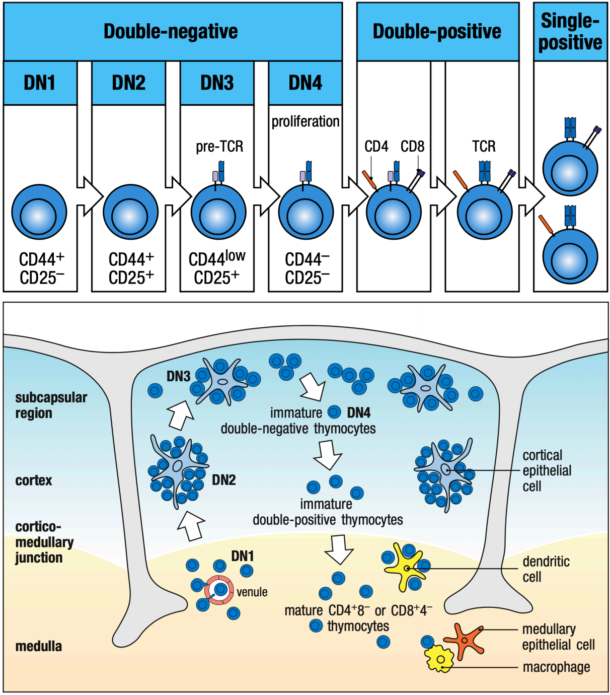

T-cell development correlates with V(D)J recombination of TCR
- T 细胞发育过程中，TCRβ 链先在 DN 阶段重排，TCRα 链后在 DP 阶段重排。早期 thymocyte 处于 double-negative（CD4⁻CD8⁻） 状态，并依次经历 DN1、DN2、DN3、DN4，其中 DN2/DN3 附近先发生 Dβ-Jβ 重排，随后发生 Vβ-DJβ 重排；如果 β 链成功表达，就在 DN3 阶段形成 pre-TCR，通过检查点后进入 DN4 并发生增殖。之后细胞进入 double-positive（CD4⁺CD8⁺） 阶段，在这一阶段进行 Vα-Jα 重排，形成完整的 αβ TCR。完成 TCR 表达并经过后续选择后，细胞最终分化为 single-positive（CD4⁺ 或 CD8⁺） T 细胞。

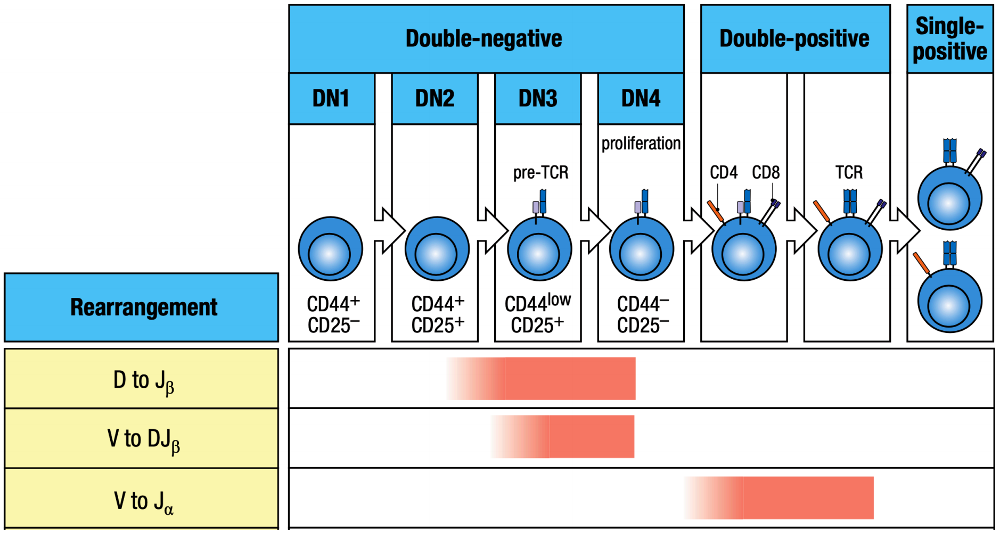

Positive selection of TCR: Weak affinity to self MHC-peptide enables survival
- Positive selection of TCR: MHC restriction
  - 识别 MHC class I 的 TCR 会产生 CD8⁺ T cells：这个 transgenic TCR 被设定为识别 **MHC class I**，CD4⁺CD8⁺ double-positive T cells, DP thymocytes，识别 MHC class I 的 TCR 会让细胞走向 CD8⁺ T cell lineage。
  - 识别 MHC class II 的 TCR 会产生 CD4⁺ T cells：这个 transgenic TCR 被设定为识别 **MHC class II**，识别 MHC class II 的 TCR 会让细胞走向 CD4⁺ T cell lineage。
  
  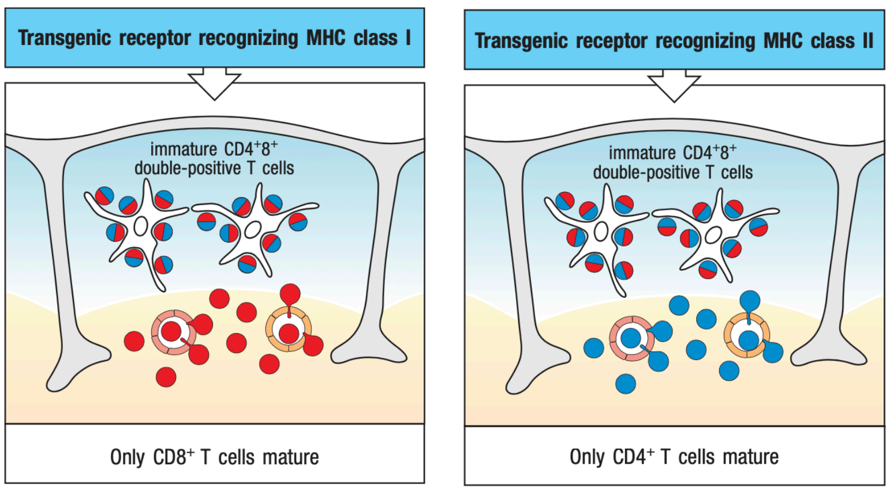

  - Transgenic receptor restricted to MHCᵃ：这个 transgenic TCR 只能识别特定的 MHC allele，即 MHCᵃ。即使都是同一类 MHC，不同 MHC allele 也会影响正选择。

  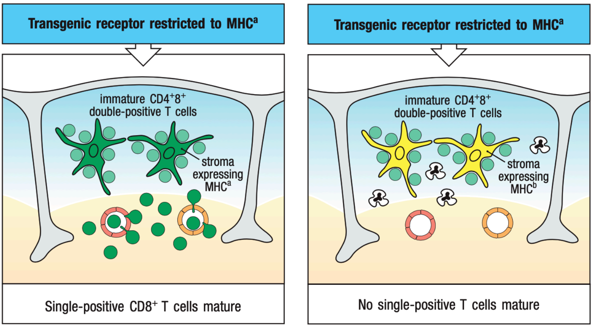 

> - stroma expressing MHCᵃ → 有 single-positive CD8⁺ T cells mature，也就是胸腺基质细胞表达的是 MHC。当胸腺 stroma 表达的 MHC allele 与 TCR 的 MHC restriction 匹配时，T 细胞可以通过正选择并成熟。
> - stroma expressing MHCᵇ → no single-positive T cells mature，也就是胸腺基质细胞表达的是 MHCᵇ。如果胸腺 stroma 表达的 MHC allele 与 TCR restriction 不匹配，DP thymocytes 不能通过正选择，最终没有 mature single-positive T cells 产生。

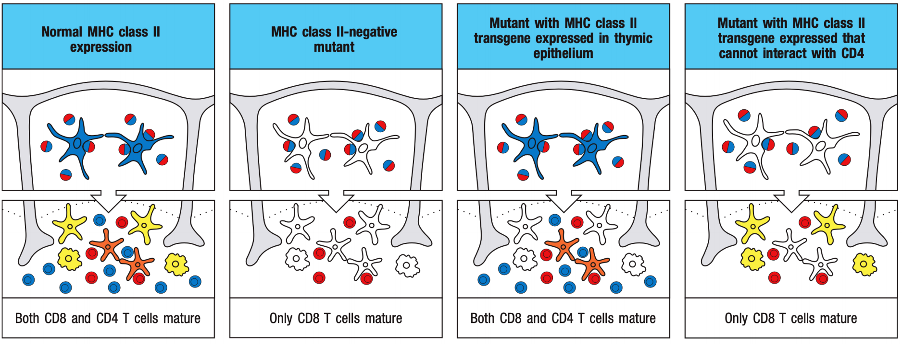

Negative selection of TCR: Strong affinity to self MHC-peptide causes death
- thymocyte 识别了 cortical epithelial cell 呈递的 self antigen：即使 self antigen 是由 cortical epithelial cell 呈递的，只要 TCR 信号过强，这个 thymocyte 也会死亡。
- thymocyte 识别了 medullary epithelial cell 呈递的 self antigen：medullary epithelial cell 也可以呈递 self antigen，并诱导强自身反应性 thymocyte 死亡。
- thymocyte 识别了胸腺中 bone marrow-derived cell 呈递的 self antigen：这些 bone marrow-derived cells 可以理解为胸腺中的骨髓来源抗原呈递细胞，例如 dendritic cell 或 macrophage。

Positive and negative selection of TCR: Central tolerance
- TCR 识别 self peptide:self MHC 太弱会死，适中会活，较强可能变 Treg，太强会被负选择删除

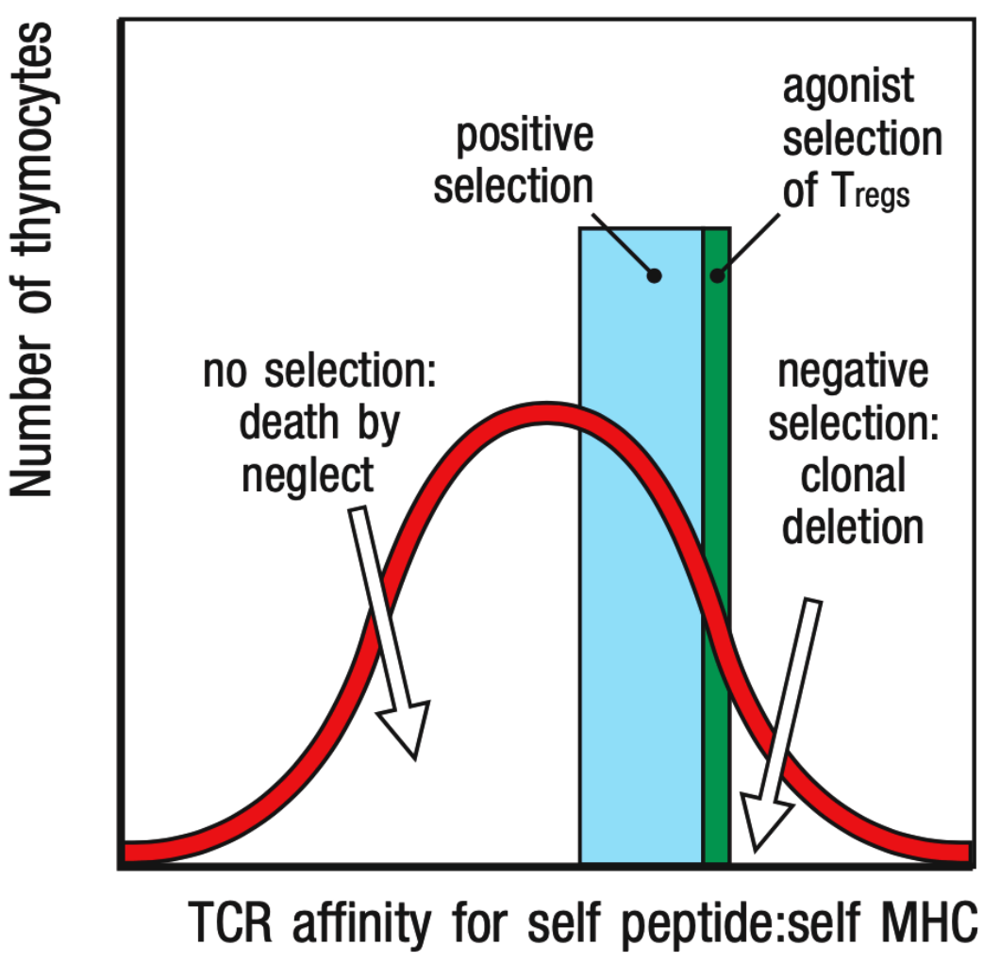

### T-cell activation and functions

T cell differentiation mainly occurs in secondary lymphoid organs
- 淋巴结同时连接血液循环和淋巴循环
- 血液循环：
  - 成熟 naive T cells 从胸腺进入血液。
  - 通过高内皮微静脉 high endothelial venules, HEVs 进入淋巴结。
  - B cells 也可以通过血液进入淋巴结。
- 淋巴循环：
  - 外周组织中的 dendritic cells 捕获抗原后，通过输入淋巴管 afferent lymphatics 进入淋巴结。
  - 淋巴液最后经输出淋巴管 efferent lymphatics 离开淋巴结。
- 淋巴结中不同免疫细胞并不是随机分布：
  - T cell zone：又称 paracortex。富集 T cells 和 dendritic cells。是 naive T cells 被 DC 激活的主要区域。
  - B cell zone：主要是 B cell follicles。B cell 相关反应在之后课程中讨论。
- 趋化因子引导 T cells 和 DCs 进入 T cell zone，淋巴结中的 stromal cells 会产生趋化因子，尤其是：CCL19、CCL21，这些趋化因子可以吸引表达相应受体的 T cells 和 activated DCs，使它们在 T cell zone 中富集。
- 外周感染部位的抗原、病原体碎片以及携带抗原的 dendritic cells 通过 afferent lymphatics 进入引流淋巴结。进入淋巴结的 pathogens 或 antigen 可以被 lymphoid tissue 中的 macrophages 和 dendritic cells 捕获、吞噬和处理；migrating dendritic cells 会把外周组织中捕获到的 antigen 带到淋巴结的 T cell zone，在那里与从血液进入淋巴结的 naive T cells 相遇

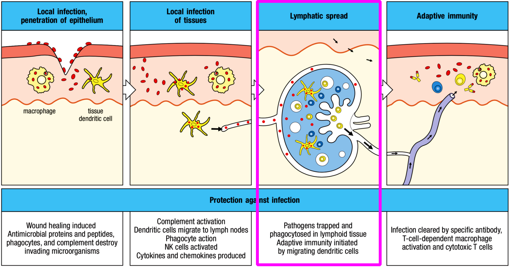

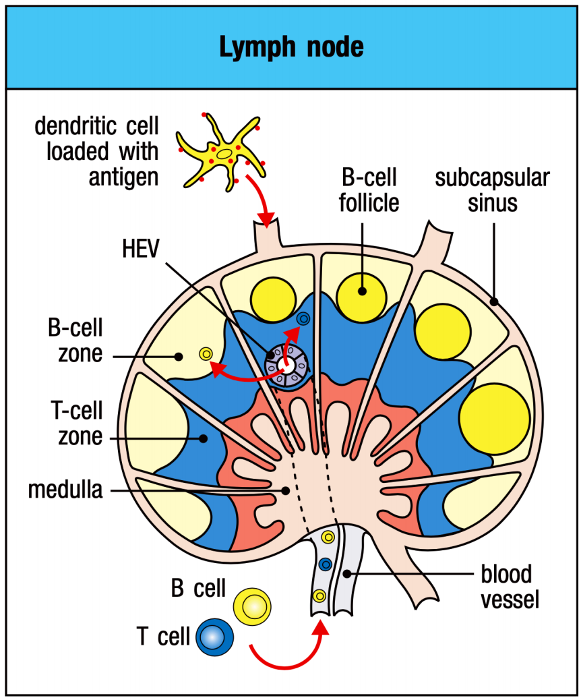

Dendritic cells and lymphocytes are recruited into lymph nodes by chemokines
- 淋巴结中的 stromal cells 和 high endothelial venules, HEVs（高内皮微静脉，是 naive lymphocytes 从血液进入 lymph node 的重要通道） 可以分泌 CCL21。
- Dendritic cells 表达能够识别 CCL21 的受体，因此可以沿着 CCL21 的趋化信号迁移进入 developing lymph node。
- Dendritic cells 进入 lymph node 后，可以分泌 CCL19，而 CCL19 会吸引 T cells 进入 developing lymph node。
- B cells 最初也可以被相同的 chemokines 吸引进入 developing lymph node，但是进入 lymph node 之后，B cells 不会一直和 T cells 混在一起，而是会逐渐聚集到 B-cell follicle 区域。
- CXCL13：帮助形成 B-cell follicle， B cells 可以诱导 follicular dendritic cells, FDCs 的分化；FDCs 随后分泌 CXCL13，进一步吸引更多 B cells。
CCL21 与 CXCL13 的分工

T cells are retained and activated in lymph nodes
- 成熟 naive T cells 从血液通过HEVs 进入淋巴结 cortex / T cell zone，在这里寻找是否有 dendritic cells 呈递其 TCR 能识别的特异性抗原；如果没有遇到对应抗原，T cells 会继续巡逻，并经 cortical sinuses离开淋巴结，回到循环中；如果 T cell 识别到 dendritic cell 呈递的 antigen，它会暂时被 retained / trapped 在淋巴结中，失去快速离开的能力，并在此完成 activation、proliferation 和 differentiation；等分化为 effector T cells 后，它们重新获得离开淋巴结的能力，进入淋巴和血液循环，最终到达外周感染组织发挥效应功能。

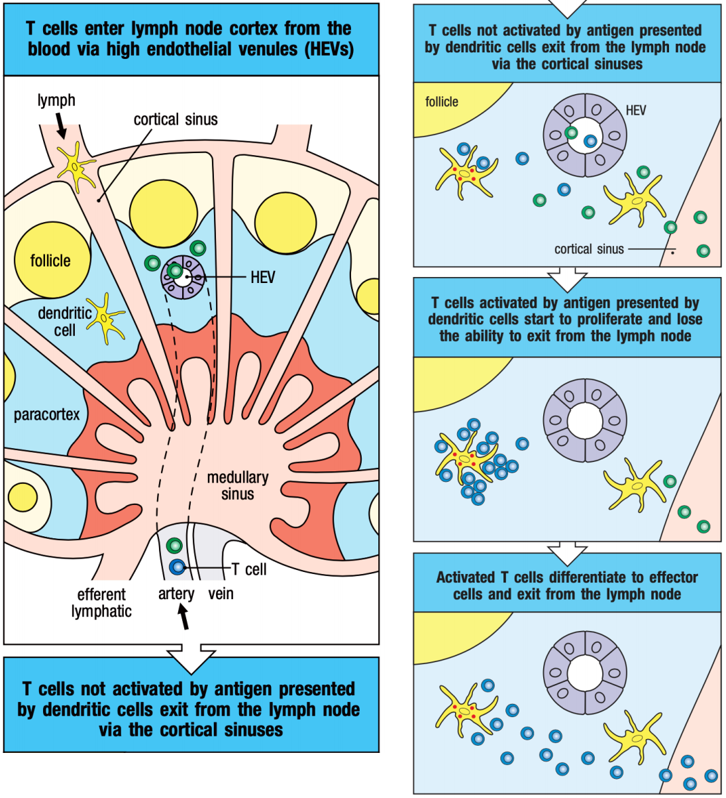

Activated T cells leave lymph nodes via a sphingosine 1-phosphate (S1P) gradient
- 成熟 naive T cell 会不断在血液和二级淋巴器官之间循环：血液 -> HEV -> 淋巴结 T cell zone -> 如果没有遇到特异性抗原，则通过输出淋巴管离开 -> 回到血液循环 -> 进入下一个淋巴结继续巡逻
- S1P, sphingosine-1-phosphate，是一种重要的小分子脂质趋化信号，血液和淋巴液中 S1P 浓度较高，淋巴结内部 S1P 浓度相对较低。因此，如果 T cell 能响应 S1P，它就倾向于离开淋巴结，进入淋巴/血液循环。
- 抗原识别早期，T cell 对 S1P 信号的响应下降，因此留在淋巴结中；完成终末分化后，T cell 对 S1P 信号的响应恢复或上升，从而离开淋巴结。

> - 当 T cell 被 dendritic cell 激活后，会上调 CD69，而 CD69 会抑制 S1PR1 的表面表达，使 T cell 暂时不能响应 S1P，因此被 retained 在淋巴结中完成 activation、proliferation 和 differentiation。等 T cell 分化为 effector T cell 后，CD69 下降、S1PR1 重新升高，细胞就再次获得响应 S1P gradient 的能力
> - FTY720 可以理解为一种干扰 S1PR1 功能的药物，它会使 lymphocytes 不能正常响应 S1P 信号，因此被困在淋巴结内，减少进入外周组织的 T cells。

Dendritic cells activate T cells via MHC-peptide–TCR signaling
- 外周组织中的 DC 通过 PRRs 识别 MAMPs，DC 可以通过多种 receptor 识别外周感染中的 pathogen 或 pathogen-derived molecules。其中，TLR signaling会推动 DC 进入 activated / mature state。
- TLR signaling 诱导 CCR7，并增强抗原处理
  - DC 上调 CCR7。CCR7 是一个趋化因子受体，它使 DC 能够响应 lymphoid tissue 中的趋化信号，从外周组织迁移进入 lymph node。
  - DC 增强对 pathogen-derived antigens 的处理能力。即开始抗原呈递
- CCR7 引导 DC 通过 lymphatics 迁移到 lymph node，DC 在外周被激活后，会通过 CCR7 介导的趋化迁移进入 lymphoid tissues，尤其是 draining lymph node
- Activated DC 上调 MHC molecules 和 co-stimulatory molecules，这个时候是同时提供了signal1和signal2
- Activated DC 在 T-cell zone 中 prime naive T cells，使其进入 activation、proliferation 和 differentiation。
> - Signal 1：抗原特异性信号
> - Signal 2：共刺激信号
> - Signal 3：分化指令信号

MHC-peptide - TCR signaling: Immunological synapses
- 从 peptide-MHC 识别到细胞内反应
  - 如果是 MHC class II：通常由 CD4+ T cell 识别 & CD4 co-receptor 与 MHC II 结合。
  - 如果是 MHC class I：通常由 CD8+ T cell 识别 & CD8 co-receptor 与 MHC I 结合。
- immunological synapse：一个 DC 在外周组织捕获的通常不是单一抗原表位，而是一个病原体或病原体碎片。一个病原体可能包含数百到数千个潜在抗原表位。因此，一个 DC 表面可能同时呈递许多不同 peptide-MHC complexes。问题是：它如何在与某一个 T cell 结合时，只向该 T cell 传递与其 TCR 匹配的特定抗原信息？答案是：形成 immunological synapse。
  - immunological synapse 是 T cell 与 antigen-presenting cell 之间形成的稳定细胞接触结构。
  - cSMAC, central supramolecular activation cluster：中央区。富集 TCR、peptide-MHC、co-receptor 和信号分子。主要负责抗原特异性信号传递。
  - pSMAC, peripheral supramolecular activation cluster：外周区。富集黏附分子，如 LFA-1/ICAM-1。主要负责稳定细胞接触，并形成边界屏障。

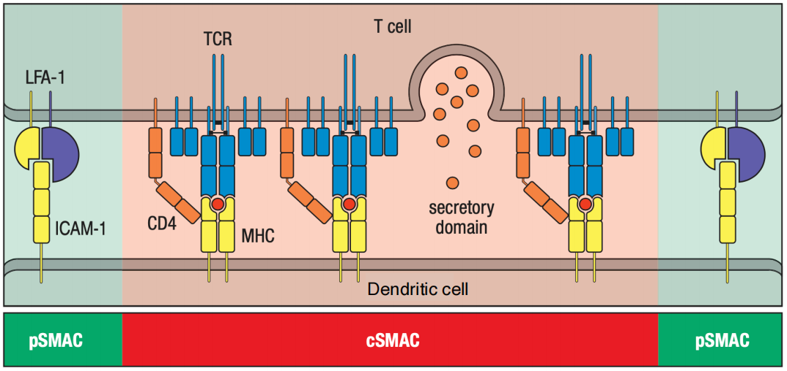

Co-stimulatory signals for T cell differentiation

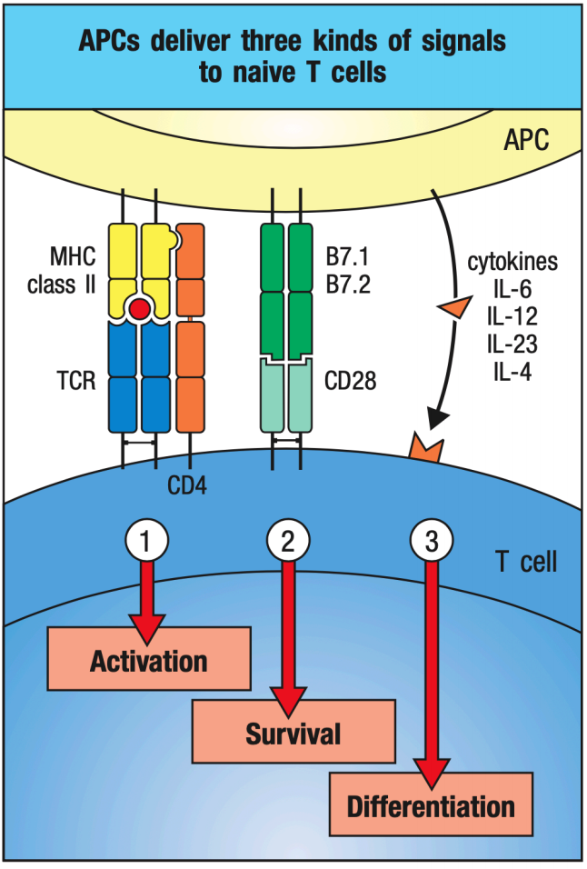

Different subsets of CD4+ T cells
- CD4⁺ T cells 在接受 peptide–MHC class II 刺激后，可以根据 APC / 炎症环境提供的 Signal 3 分化成不同 helper T cell subsets

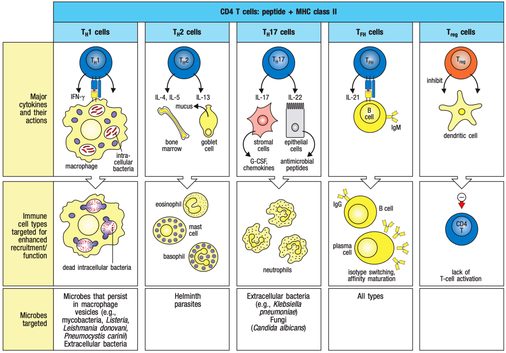

Cytokines control CD4+ T cell differentiation via specific transcription factors

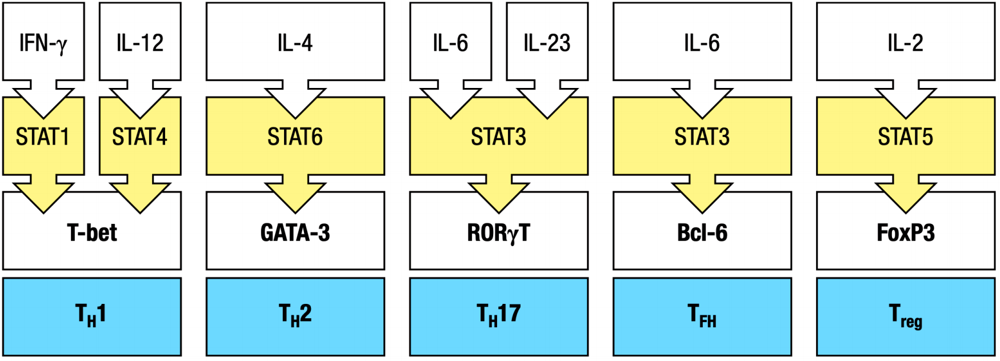

Innate immunity designates differentiation of CD4+ T cells
- macrophage、NK cell、epithelial cell、mast cell、immature DC 等细胞通过 PRRs 感知不同类型的 PAMPs 或组织来源信号，然后这些信息会改变 DC 的成熟状态、共刺激分子表达和 cytokine profile, DC用不同 cytokines 提供 Signal 3，从而决定 naive CD4+ T cell 的分化方向

Each subset of CD4+ T cells produces cytokine(s) to inhibit differentiation of other subsets

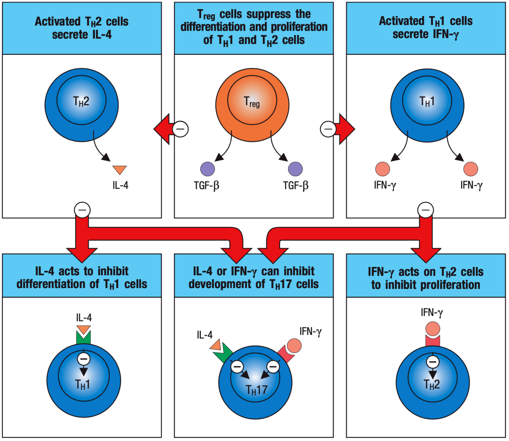

> Leishmania major真正有效的清除方式需要 Th1 response，但是 BALB/c 小鼠天然更容易偏向 Th2 response，感染后产生较强的 IL-4，IL-4 会推动 Th2 分化并抑制 Th1 反应，所以未处理的小鼠虽然产生了免疫反应，但反应类型错误，不能有效清除寄生虫，最终死亡。下方实验中，给另一组 BALB/c 小鼠注射 anti-IL-4 antibody 阻断 IL-4 后，Th2 偏向被解除，小鼠转而形成更有效的 Th1 response，因此能够清除 Leishmania major 并长期存活。
> 
> 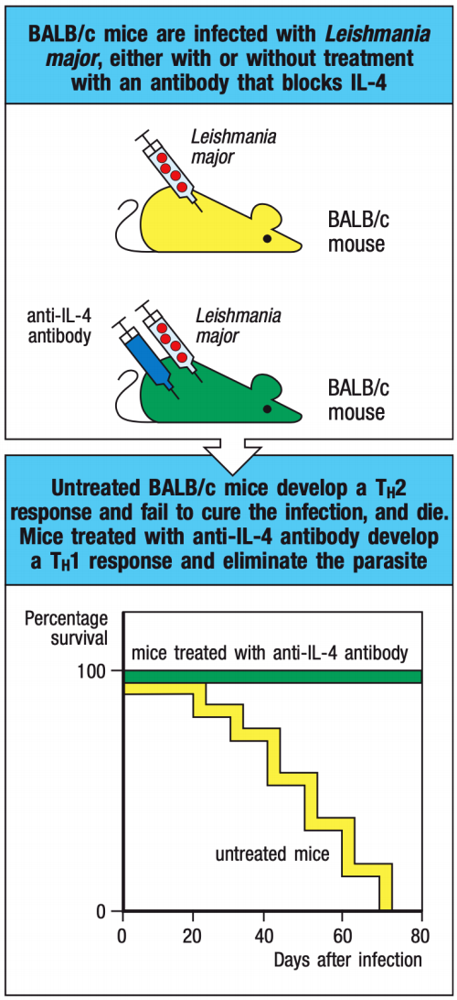
> 

CD4+-dependent activation of CD8+ T cells
- CD8+ T cells 的功能是杀死表达相应 MHC I-peptide 的靶细胞。树突状细胞也可以通过 MHC I 呈递抗原给 naive CD8+ T cell。如果仅凭 MHC I-peptide 与 CD8 TCR 结合就能触发杀伤，那么 DC 在激活 CD8 T cell 时理论上会被 CD8 T cell 反杀。这显然不合理。
- naive CD8+ T cell 在淋巴结中被激活时，也需要完整三信号：
  - Signal 1：TCR + MHC I-peptide。
  - Signal 2：co-stimulation。对 CD8 来说，充分的共刺激往往依赖 CD4+ T cell 对 DC 的 licensing。
  - Signal 3：cytokines，例如 IL-2 等
- cross-presentation 使同一 DC 同时激活 CD4 和 CD8
  1. MHC II pathway：外源性抗原被 DC 处理后由 MHC II 呈递给 CD4+ T cell。
  2. MHC I pathway via cross-presentation：同一抗原的一部分进入 MHC I pathway，由 MHC I 呈递给 CD8+ T cell。
  3. 因此，一个 DC 可以同时：用 MHC II 激活 CD4+ T cell；用 MHC I 激活 CD8+ T cell。
- CD4 help 的作用，CD4+ T cell 被同一 DC 激活后，可以：
  - 向 DC 提供帮助，使 DC 上调或增强 CD8 priming 所需的 co-stimulatory signals。
  - 分泌 cytokines，如 IL-2，支持 CD8+ T cell 的最终激活和扩增。
- naive CD8+ T cell 在淋巴结中只有 Signal 1 不会成为 fully cytotoxic effector cell。
  - 只有在 Signal 1、Signal 2、Signal 3 均满足后，CD8+ T cell 才完成 priming、增殖和终末分化。这个机制保证：DC 可以安全地呈递 MHC I-peptide 给 CD8+ T cell。CD8+ T cell 不会在初始 priming 阶段立即杀死 DC。只有离开淋巴结成为 effector CD8+ T cell 后，才在外周组织执行杀伤。

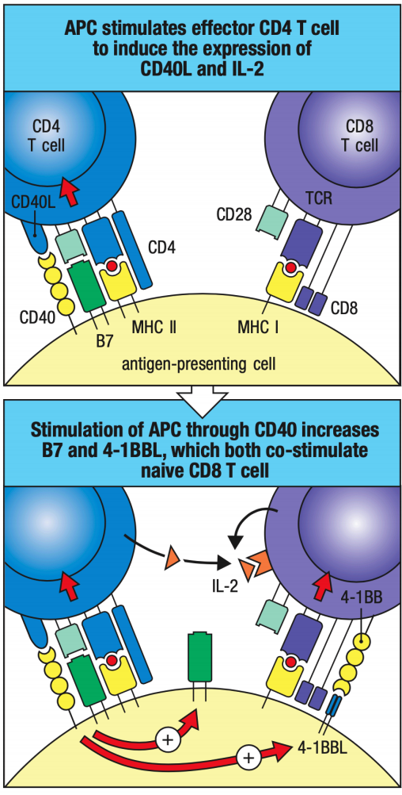

Activated effector T cells enter infection sites
- 如果 T cell 被激活后一直留在淋巴结，它无法清除外周感染。被激活的 T cells 必须离开淋巴结，进入外周组织。
- 路径可以概括为：淋巴结-> 输出淋巴管-> 胸导管-> 血液循环-> 外周感染组织
- T cells 在局部引流淋巴结中被激活，但离开淋巴结后进入血液循环，因此它们不是只精确回到最初感染部位，而是可以全身播散。
  - 有利于在全身范围内寻找感染灶。
  - 也解释了为什么 T cell-mediated immunity 具有系统性影响。

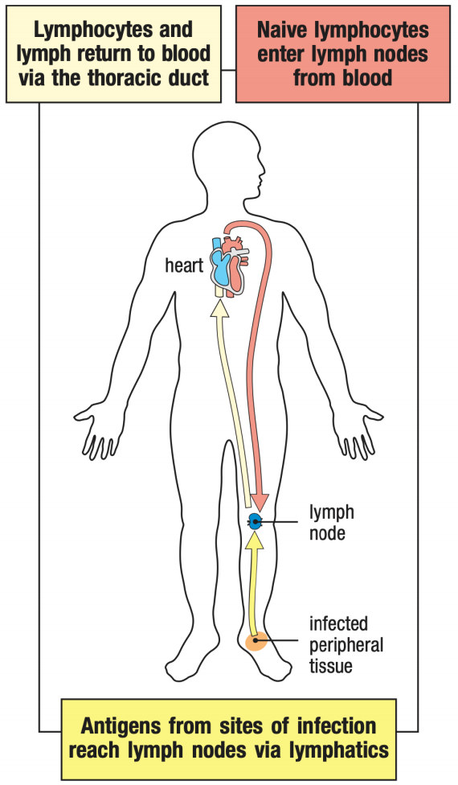

Effector T cells do not need co-stimulatory signals
- 外周 effector T cell 主要依赖Signal 1，即 TCR 识别相应 peptide-MHC。效应 T 细胞在外周执行功能时，只要遇到相应 MHC-peptide，就能迅速发挥效应作用。

Cellular polarization of effector T cells specifically target antigen-bearing target cells
- CD8+ effector T cell 的三要素：MHC class I + pathogen-derived peptide + TCR/CD8 complex
- CD8+ T cell 不能随意释放毒性颗粒，否则会误伤周围正常细胞。因此它的 cytotoxic granule release 必须高度定向。
  - CD8+ T cell 与 target cell 形成 immunological synapse；
  - TCR 和 MHC I-peptide 在 synapse 中富集；
  - cytotoxic granules 被极化运输到 synapse；
- CD8+ T cell 释放的主要效应分子：perforin（在靶细胞膜上形成孔洞）；granzymes（进入靶细胞后切割和激活 caspases，触发 apoptosis）
> 进入胞质后，granzyme B 一方面可以切割 BID，生成截短形式 tBID，tBID 会作用于线粒体外膜，使线粒体释放 cytochrome c，从而启动线粒体凋亡通路；另一方面，granzyme B 也可以直接作用于 pro-caspase 3，使其变成活化的 caspase 3。活化的 caspase 3 会切割 ICAD，ICAD 原本是抑制 CAD, caspase-activated DNase 的分子；ICAD 被切开后，CAD 被释放并进入细胞核切割 DNA，造成 DNA fragmentation。

Immunological memory of adaptive immunity
- 说明 adaptive immunity 的免疫记忆可以长期维持，但不同成分的维持时间不同。疫苗接种后，机体不仅产生短期效应免疫反应，还会留下长期免疫记忆；其中抗体水平可以长期保持，而 T cell memory 会随时间逐渐衰减，但仍可维持多年。

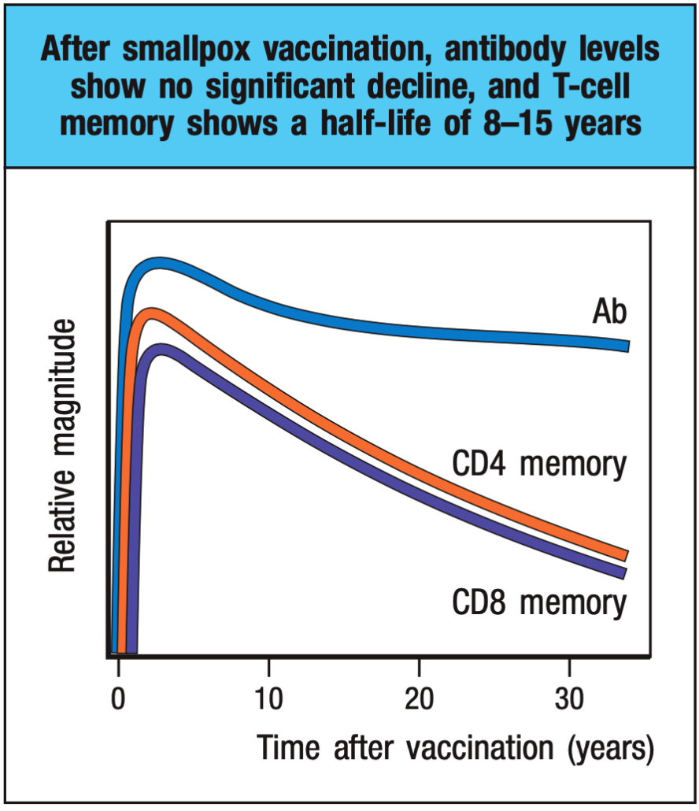

Memory T cells express high levels of IL-7R
- T cell 被激活后，不是所有细胞都长期存在。
- memory T cells 可以通过两条路径产生：
  - 部分 T cells 在淋巴结中被激活后，较早进入 memory fate，随后进入血液循环并全身播散。
  - 部分 effector T cells 到达外周感染部位后，清除病原体；其中少数细胞在局部留下，转化为组织局部的 memory-like cells。
- IL-7 receptor 是 memory T cell 的重要标记，IL-7R high 的 T cells 更倾向于具有 memory potential；IL-7R low 的 T cells 更倾向于短寿命 effector fate。

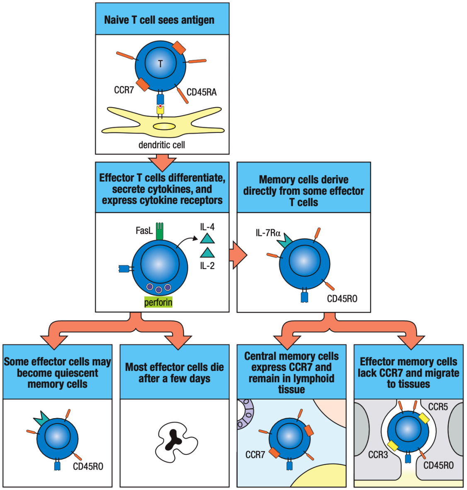

> 先用 LCMV 感染带有特异性 TCR 的小鼠，使其产生 primary CD8 response；感染后，一部分 CD8⁺ effector T cells 表达高水平 IL-7Rα，另一部分表达低水平 IL-7Rα。把这两群细胞分别分选出来，再分别转移到没有接触过抗原的 naive mice 中，并给这些受体小鼠再次进行 antigen challenge。只有接受 IL-7Rα^hi CD8 T cells 的小鼠，在二次抗原刺激后出现大量 antigen-specific CD8 T cells expansion；而接受 IL-7Rα^lo CD8 T cells 的小鼠几乎没有明显扩增。

> 先用 LCMV 感染小鼠，让小鼠产生 LCMV-specific CD8 memory T cells；然后把这些已经形成的 memory CD8⁺ T cells 分别转移到两类受体小鼠中：一类体内有 CD4⁺ T cells；另一类是 MHC class II 缺失小鼠，无法正常维持 CD4⁺ T cells，所以相当于缺乏 CD4 T cell help。最后观察转移后的 CD8 memory T cells 能不能长期维持。结果显示，在 wild-type mouse 中，CD8 memory T cells 的数量基本保持稳定；但在缺乏 CD4⁺ T cells 的 MHCII⁻/⁻ mouse 中，CD8 memory T cells 随时间明显下降。这个结果说明：CD8⁺ T cell memory 的形成可以在感染后出现，但它的长期存活和维持需要 CD4⁺ T cells 提供帮助。

# Adaptive immunity: B cells

### B-cell receptor (BCR)

BCR与TCR十分类似，BCR是异源四聚体其中两重两轻都会发生VDJ重排 
- TCR的结构都是稳定的都是异源二聚体
- 但是BCR比较多样的结构
  - IgG是异源四聚体
  - 羊驼完全由重链组成，整体蛋白非常小
  - 更低等生物比如软骨鱼也有只有重链的BCR

BCR can be separated into fragment ab (Fab) and fragment c (Fc)
- Fab区和Fc区域
- IgG可以被一些特殊的蛋白酶切割，切割完之后的上面的部分就是Fab，决定抗体与抗原结合的部位
- 同时存在Fc区
- Fab:Fc = 2:1

BCR directly binds an epitope without MHCs
- TCR本身不能结合抗原表位，但是BCR是可以的，不需要MHC分子，也正因为如此所以结合的是空间表位，在真实的二维序列上可能是不连续的

BCR can interact with epitopes in diverse conformations
- 抗原表位不仅仅是平坦的，他还有很多不同的形态

V(D)J recombination of BCR
- BCR的重链区由一个基因编码，轻链区由两个截然不同的序列编码
- lanmda light chain是只有V和J，J区和后面的constant区是连续的，所以重排到了哪个J区自然而然就会衔接对应的constant区
- kapa light chain是只有V和J：只有唯一一个kapa constant region
- 重链是标准的VDJ重排
- 因为Bcell是二倍体所以重链有两个基因位点轻链有四个基因位点，但是在此情况下重组会比较复杂，所以出现了等位排斥效应


Recombination signal sequence (RSS) and the "12/23 rule"
- 和TCR一样


Nucleotide additions at the V(D)J joints further diversify BCR
- 和TCR一样

V(D)J recombination produces a diversity of BCR
- BCR的diversity显著低于TCR


Complementarity determining regions (CDRs) of BCR
- 轻链和重链各有三个CDR
- CDR的变异度最高，序列上不连续但是空间上是连续的
- 轻链上的CDR1和CDR2是V区自己编码的，VJ结合和J区编码CDR3，重链轻链都差不多
- 但是对于CDR1，CDR2和CDR3都不稳定，而且这三个点都是要直接结合抗原的，不像是Tcell的CDR3是结合抗原的


BCR diversity in certain species primarily relies on gene conversion but not V(D)J recombination
- VDJ重排严格局限于哺乳动物，比如说鸡中就没有重排
- 但是鸡中有gene conversion，就是前面的pseudogene出现一些随机的断裂重排，一个一个的片段插入正确的VD中


Different isotypes of BCR
- BCR constant region是可变的
- 第一个读出来的是IgM，后面就是IgG....
- 正常VDJ重排完之后马上能读出来的constant region是IgM和IgD

IgM and IgD are expressed as cell surface-attached BCR
- IgM和IgG都有跨膜能力，产生的BCR都是锚定到细胞上
- IgM位点本身具有特殊性，序列中含有两个polyA site，PAm就是可以被锚定的，但如果PAs就是可以分泌的，对应的抗原特异性一模一样
- BCR本身特异性&抗体本身特异性，就是这个constant region的多样性与抗原结合特异性没有任何关系

### B-cell development

在骨髓中发育，pro B-cell还会留在骨髓中
顺序为：


- 先重排重链（DJ->VD），读通之后开始重排轻链（VJ），读通之后重组成一个lgM，然后触发细胞产生alternative splicing然后产生其他Ig，只有IgD和IgM完全发育结束，才是一个完整的B cell
- 重链读不通怎么办法？
  - 如果完全不行就直接死掉
  - DJ重排无法判断是否读通，VDJ读通结束之后会产生一条LgM的重链，但此时轻链还没有重排，这时候会有一个蛋白当作**假的轻链**连到重链上，目的是形成完整组装的BCR，然后呈递到细胞膜上面从而告诉细胞重链已经组装完成，向胞内传递信号然后开始重排轻链，此时那个蛋白的表达会停止，替换为真正的轻链
  
  

- 为什么一定在表面呈递？
  - positive selection：选择VDJ重排重链和轻链都成功的情况
    - 在细胞膜表面呈递触发的信号包括：1.重链成功应该活下去，2.改进行轻链重排了
    - 轻链重排结束后有同样的信号分子，也是告诉细胞活下去开始之后的steps
  - negative selection：为了选择掉能够与自身抗原产生反应的细胞
    - 非常粗糙
    - IgM如果没有任何反应，产生IgM和IgD双群体，然后migrates to periphery
    - 如果能识别骨髓中任何的多价表位，认为是自免疫B cell，死或者进入另外的通路
      - receptor editing：再次启动VJ重排重排轻链，看看能否变成没有自我免疫反应的，如果再不行就是杀死
    - 如果出现soluble self molecule，很难判断属于自我还是非我，如果这个蛋白能够让BCR cross link，被认为是自我的表位，从而B cell进行到休眠状态
    - 如果low-affinity non-cross-linking self molecule，B cell不会做出任何反应，产生了自免疫性疾病的隐患
    - peripheral tolerance：不在骨髓和胸腺中完成的负选择
      - 发生multivalent self melecule的时候B cell直接杀死
      - soluble self molecule：B cell也被直接杀死
      - 如果low-affinity non-cross-linking self molecule，B cell依然不会做出任何反应
  


### B-cell activation


B-cell activation often depends on CD4+ T cells: Thymus-dependent antigens（TD抗原）

- 绝大部分的B cell被激活是完全依赖于T cell的：B cell 存在signal1（有病原）和signal2（是非我），T cell代替了树突状细胞传达signal2（在t cell中依赖树突状细胞的共刺激信号）
- 锚定在细胞膜上的BCR直接和抗原接触，然后内吞进细胞，B cell中同样通过MHC2又呈递到了细胞表面，如果TCR和MHCII接触，然后还有一些共刺激信号（看图），会在胞内产生signal2
- 时间顺序： T cell首先被激活，然后B cell才能够被激活


B-cell activation often depends on CD4+ T cells: Linked recognition

- 如果一个病毒有包被的话，有可能BCR识别的病毒包被上的表位和MHCII呈递的内容蛋白可能完全脱节，而且对于T cell获得的共刺激信号其实也是蓝色包被蛋白，抗原表位不对应，丧失了T cell提供signal2的意义


Thymus-independent-1(TI-1) and TI-2 antigens(10%-20%)
- TI-1: B cell自己表达了模式识别受体（比如说表达TLR来识别LPS），从而自己提供signal2
  - TI-1 antigens can trigger nonspecific or antigen-specific B-cell activation
  - 在此情况下会产生多克隆激活
- TI-2: signal1和signal2合二为一，也就是BCR同时也是模式识别受体


- TI-1 anitgen十分依赖于浓度，如果抗原浓度比较高，就会产生**polyclonal** antibody，但如果浓度比较低的话就会产生monoclonal antibody因为存在竞争


- TI-2不会产生class switch而是直接产生IgM


B-cell activation mainly occurs in secondary lymphoid organs
淋巴结结构：两套完全独立的循环系统——淋巴循环&血液循环
- T cell 和 B cell会通过血液循环进入淋巴结，形成两个area
- 树突状细胞，抗原呈递细胞会从淋巴循环进入淋巴结与TB cells进行反应，产生获得性免疫反应
- B cell过程：B cell先进入HEV区（血液循环与淋巴结之间的特殊结构）
  1. primary focus: T cell和B cell的area交点区域，发生反应为B cells 捕获抗原之后被第一次激活，一部分B cell可以发生功能，而相当一部分则是迁移到B cell区进行进一步激活
  2. germinal center
  
  

- 树突状细胞带着呈递的抗原进入T细胞区激活T细胞，T细胞会在TBcell的交界处碰到B cell，从而来第一次激活Bcell ，进一步大量B细胞会在Bcell区内产生生发中心，完成进一步的改变，包括一些随机的突变，进一步还会进行一些class switch，选择不同种类的重链 
- FDC: 有免疫学功能但是完全不起源于造血干细胞的细胞

  

Somatic hypermutation of BCR
- hypermutation：在B细胞中的突变率比正常DNA复制的突变率高了几个数量级
- somatic: 这个突变不是生殖遗传的，而是只能发生在B cell里面
- 超突变所出现区域只出现在Fab与抗原所联系的区域，不会在重链上发生，另外针对的对象是已经完成VDJ重排的B cell，和VDJ重排也没有任何关系 
- 明显聚集在CDR区域，随着突变的增加，affinity在增加，进化与筛选，蛋是为什么有基因组的选择性至今无法回答
- 体细胞的超突变是由AID介导的（只在Bcell中出现），激活induced胞嘧啶脱氨酶（C->U）机体判断为DNA损伤，因此切掉并且产生DNA repair，而这个过程是会引入突变的，AID只在b cell receptor基因脱氨基（）
  
  

- 在somatic hypermutation之后会进行筛选，在germinal centers进行不断的筛选
  - dark zone: 细胞非常密集，有大量细胞增殖，不停的分裂并且引入突变，迁移到⬇️
  - light zone：细胞稍微稀疏，以FDC（follicular dendritic cells）为主，也是进行抗原选择
  - mantal zone：依然存在少量T cell，在与T cell的过程中再次完成抗原选择

Follicular dendritic cells provide antigens for affinity maturation in germinal centers
- 像是一个抗原富集的细胞
> 实验：人为向小鼠中注射一个同位素标记的蛋白，发现放射性聚集在唯一的一个细胞上，就是FDC

- 小小念珠状态，形成了抗原富集聚集物
- 通过细胞表面一些特殊的受体，没有MHC，抗原是完整呈递的
- 在light zone中，不同mutation进行竞争，看谁能够从FDC上拉一个抗原下来
- 拉一个后就可以内吞然后进行MHC呈递，从而有了T cell的第二次激活和支持，否则就无法被支持 

  

> 在 germinal center 中，B cell 先在暗区快速增殖并发生 somatic hypermutation，再到明区通过 FDC 上的抗原和 Tfh cell 的帮助被选择，亲和力高的 B cell 可以继续循环或分化为浆细胞/记忆 B cell。
> 
> T cell 主要是 Tfh cell：它由 naive CD4⁺ T cell 分化而来，进入生发中心后通过 CD40L、IL-21、IL-4 等信号帮助并筛选 B cell，从而促进抗体亲和力成熟和 B cell 分化。

Class switch of BCR
- 由一些特殊的细胞因子决定的
- 基因组本身结构发生了变化
  - VDJ重排完了会进行IgD和IgM，但是二者的功能是有限的
- IL-4 二型细胞因子，真菌和寄生虫，IgG1和IgE的促进
- IFN-gama 病毒，IgG3和IgG2a的中和效应
- 感染类型决定的重链

  

- 基因组水平产生了重排，并且不是VDJ重排，不是alternative splicing（IgM还是IgG是由这个决定的
- 细胞因子介入下可以直接删除掉不需要的序列

  

- 机制：在细胞因子作用下对应的switch region出现了结构变化，进一步IgG和IgM的switch region也会出现变化双链结构打开，AID会在数以百计的重复序列中把C变成U，切碎之后就直接断开了，剩下的地方通过DNA损伤修复重新连在一起，使得VDJ直接连在了其他重链的地方

  

  

- summary：值得注意的是就是从surface上的IgG更多改成了secretion
  
  

### BCR/antibody functions

Different properties and functions of BCR isotypes


- IgM要么就是单体然后锚定在细胞膜上，要么就是五聚体分泌（J chain）
- IgA也一样


- 母胎屏障和血脑屏障
- IgA黏膜（乳腺）、IgM心脏、IgE拓扑学角度分布在与外界相连的地方
- 不同功能还有不同亚型，他们的大小->扩散能力，血浆浓度、半衰期-> 功能和分布

- 生物学过程完全不同
  - 中和病毒和中和有毒物质，敏化反应，有一些有但有一些完全没有
  - 激发NK细胞，从而算是有一定的抗原特异性（间接的）
  - IgA黏膜免疫，必须从机体内进入机体外，跨粘膜分泌
  
  

Properties and functions of different Fc receptors
- 重链部分也有特异性的受体
- Fc受体并不保守，与不同抗体的affinity完全不同，表达这个receptor的细胞截然不同，从而生物学功能完全不同

(I) Neutralization:
- Antibodies block toxins from entering cells（蓖麻毒素）
  阻断与细胞受体的结合（大部分为蛋白毒素）

  

- Antibodies block viral infection
  介导与细胞产生相互作用或者进行内吞的蛋白进行中和

  

- Antibodies block bacterial infection
  和病毒类似

  

- 没有发现真菌的和寄生虫的

(II) Complement activation:
- Antibodies trigger classical pathway

  

(III) Opsonization(敏化效应): 使得病原体更容易被其他杀死
- Antibodies facilitate phagocytosis of bacteria
  抗体和细菌表面结合，然后通过结合到抗体的重链更容易进行一个内吞
- Antibodies facilitate phagocytosis of bacteria
  对于有被膜的细菌也有关系，对被膜上的抗体可以介导吞噬

(IV) Antibody-dependent cellular cytotoxicity
- 一个肿瘤细胞会表达不正常的蛋白，然后会激活一些抗体识别这个细胞，然后可以激活NK cell上的一些Fc receptor，激活这个NK cell的杀伤特异性

Memory of B cell responses

- 进行抗体类型测试：
  - IgM应该首先上升
  - 经过一些变化后IgG后来会赶上
  - 第二次感染后IgM不会增高了，IgG会增高
- 不仅能记住抗原种类（IgG浓度），而且能提高非常强的affinity
  - 第二次刺激可以有更多
  IgG
  - 可以再次发生somatic hypermutation
  
  

Established memory dominates latter responses: "Original antigenic sin"

  

  - 病毒出现变种之后其实之前的免疫就没有意义了，会无视后面的抗原的变异
  - 所以只有第一次接触的变异类型会伴随人类的一生

# Tissue immunity（以黏膜组织为例）

天然免疫和获得性免疫连接问题——树突状细胞


树突状细胞的特殊性：
1. 同时起源于髓系和淋系
2. 连接天然免疫和获得性免疫：在天然免疫中感知病原相关分子模式，从而获取到共刺激信号，同时捕获抗原完成抗原呈递功能
  
### Mucosal immunity

##### Anatomy

黏膜组织种类：呼吸道、消化道、眼睛、乳腺、泌尿道

Mucosa-associated lymphoid tissues (MALT)：黏膜相关淋巴器官
- 全部是次级淋巴器官
- NALT: nasal-associated lymphoid tissues
- BALT: bronchus-associated lymphoid tissues
- GALT: gut-associated lymphoid tissues


Nasal-associated lymphoid tissues (NALT)
- Waldeyer's ring(⽡尔代尔淋巴环): 当口腔完全张开时，口腔中的所有淋巴器官基本形成一个完整的环
  - Palatine tonsil: 腭扁桃体
  - Lingual tonsil: ⾆扁桃体
  - Adenoid: 增殖腺
  - 目的：对于食物和呼吸的摄入可以第一时间进行监测
  - 在解剖学上不依赖于显微镜就可以被看到

  

Bronchus-associated lymphoid tissues (BALT)
- 尺寸非常小，不借助显微镜很难看到，但是每个点都是非常完整的淋巴器官

Gut-associated lymphoid tissues (GALT)

  

- 小肠绒毛中本身具有淋巴器官，小肠绒毛中如果存在抗原，会通过淋巴引流的方式一直从小肠绒毛向下引流直到肠系膜淋巴结（Mesenteric lymph node），这个过程是单向的
  - 有比较特殊的抗原捕获方式，需要经典的树突状细胞
  - IgA可以在肠道上皮细胞处完成跨细胞转运，在从体外到体内的过程中很有可能会捕获抗原然后交给树突状细胞，再引流
  - 肠道出现损伤/感染，直接被树突状细胞捕获

  

- payer's patch派尔集合淋巴结，直接嵌入小肠绒毛，其中有非常明确的Tcell区、Bcell区和 germinal centre，然后也可以引流到肠系膜淋巴结
  
  

  - 有明显分区而且所有树突状细胞都在Tcell区
  - M cell: 在显微镜下观察冲向食物的一侧皱皱巴巴，作为上皮细胞但可以捕获抗原，树突状细胞不作为捕获抗原+迁移的工作，只用守株待兔
  - Transcytosis of antigens by microfold (M) cells in Peyer's patches, M cell像是一个门，从一侧打开然后将抗原送到另一侧去
  
    

- 肠道中树突状细胞的奇怪功能：
  - CD103 dendrite cell：通过CX3CR1（阳性吞噬细胞，阻滞驻留吞噬细胞，起源非常特殊），伸小管抓抗原，然后送给树突状干细胞
  - 杯状细胞不光可以分泌黏膜，跨细胞转运抗原
  - 树突状细胞可以迁移，捕获抗原后再转运回来

    

Innate immune respones trigger protective adaptive immunity

    

后续工作：以细菌为例

    

##### antigen presentation/T-cell and B-cell responses

- payer's patch局部就可以进行TB细胞激活，其他地方则是引流到肠系膜淋巴结发挥对应功能

Activated T and B cells are re-distributed to the lamina propria and epithelium
- 必须先到thoracic，然后进入血液循环才能到该地方
- 回到肠道这部分的TBcell功能与一般情况下类似

    

产生了一种特殊的T cell: Intraepithelial lymphocytes (IELs)上皮内淋巴细胞
- 精准嵌入上皮细胞间隙
- 存在的意义是第一次发现被病原体侵入的上皮细胞
- CD8

    

IELs can exert cytotoxicity via MHC-I/TCR-dependent or -independent pathways
- 在标准T cell中，CD8为二聚体分为alpha和beta异源二聚体

    

- 有时会出现alpha-alpha同源二聚体，这个时候完全获得了NK细胞的功能，完全不需要T cell receptor的方式进行杀伤（激活抗体/抑制抗体）

    

IgA is the predominant immunoglobulin in mucosal immunity
- IgA有单体结构和双体结构，双体是由J chain和secretory component实现
  
    

- 能特异性产生IgA的浆细胞回到肠道以后，会特异性产生二聚体IgA，一开始只有J chain，然后结合肠道上皮细胞的膜蛋白plgR，会带着IgA进行跨细胞转运，最后一步这个plgR蛋白被切断了，留下来的一段就是secretory protein

   

IgA has multiple functions in the gut
- 先发制人的把可能的有害物质运输走
- 把上皮细胞囊泡中的有害物质转运走
- 将已经在体内的毒素转运走
- 潜在的辅助了抗原在机体外的捕获，带进来给树突状细胞

summary

   

##### Immune tolerance 对于外源病原体无视

在人体中有很多的共生菌，那么我们的黏膜如何进行immune tolerance呢

这些最终产生的是调节性T cell（Treg），而调节性T cell产生两类重要的细胞因子：
- 白细胞介素10：唯一一个能够抑制炎症反应的因子
- TGF-beta：对常见T cell有比较强的抑制
⬆️免疫耐受有抗原特异性

> Rag2-/- 对于TBcell重排有重要作用
>
>  
>

Immune tolerance to food-derived antigens
机制是类似的
食物是比较难触发天然免疫反应的，所以即便被捕获但是没有共刺激信号，所以就会产生耐受

   

如何解决血液循环进入身体各处的问题：
- Mucosal immunity in the gut may designate systemic immune tolerance
- 全身都会跟着血液建立耐受，因此其实全身上下的菌群也是稳定的，因为免疫耐受是同步建立的

   

SUMMARY


# Immunological disorders

### Immunodeficiency

##### Primary (or inherited) immunodeficiency

基因编码导致的免疫缺陷

- IL2RG mutation blocks T-cell development: 目前已知的能存活的最严重的免疫缺陷
  - IL2RG辅因子：介导一系列干扰素
  - 白细胞介素的受体必须要IL2RG辅因子
  - 此基因缺失会广谱的阻断信号，从而产生免疫抑制
> X-linked severe combined immunodeficiency (X-SCID)
> - 相当一部分免疫相关基因都在X染色体上，男性也更容易得病
> - 核心表征：从出生开始就会感染非常罕见的免疫疾病（比如说真菌感染）
> - 血浆中完全缺失T cell，但是B cell大量存在（流式细胞分选结果），不过？

- Mutations of exocytosis affect CD8+ T cells: 识别MHC1抗原表位，胞吐穿孔素，然后分泌颗粒酶，激活apoptosis
  - 变异可能出现一系列的错误（胞吐作用中的一系列缺陷）
  
  

> Hemophagocytic lymphohistiocytosis (HLH)
> - 噬血细胞性：外周组织的巨噬细胞和嗜酸性粒细胞开始吞噬血细胞（失去判断识别自我和非我的能力）
> - 外周血中CD8中含量非常高
> - 淋系反而影响了髓系
> - 病毒始终潜伏在被感染细胞内，此时机体会不断出发免疫反应，比如不停产生CD8细胞，I型免疫反应，髓系的中性粒细胞和巨噬细胞也会被非常大的加强（代偿性功能），导致了很强烈的误伤
> - 完全致命，导致不可逆转的贫血

- BTK mutation interrupts B-cell development
> X-linked agammaglobulinemia (XLA)
> - 假的BCR会触发一种BTK的激酶，这种激酶是用来向胞内传播信号触发轻链重排
> - BTK缺陷会无法合成正常的BCell（无法正常成熟）
> - 丙种球蛋白=血浆中的抗体
> - 流式细胞分选：血液中完全没有CD19阳性Bcell，但是有Tcell

- CD40L mutation prevents B-cell maturation
  - Bcell吞噬抗原后呈递让Tcell产生signal2
  - 而CD40L是Tcell上提供signal2的重要东西
> X-linked hyper-IgM syndrome
> - 在病人的血液中只能测到IgM
> - 没有共刺激信号，无法完成class switch，所以只能表达IgM，也无法完成之后的作用
> - 无法找到生发中心

SCID: 重度联合免疫缺陷
- 由于B cell后续功能完全依赖于Tcell
- 所以Tcell的mutation最容易导致SCID

##### secondary (or acquired) immunodeficiency

HIV，放疗、化疗（造血干细胞产生的免疫细胞仍然是会在DNA复制的，所以不可避免的会杀伤）或者一些不良食物的摄入

不是由于基因决定也不会有生殖遗传

- Human immunodeficiency virus (HIV)
  - 在电镜下重染色区域
  - 膜结构，均匀排列受体gp120
  
  

  - HIV infects and destructs CD4+ T cells: 进化上非常古老，进化策略上很神奇，可以借助免疫系统进行传播
  - 吞噬病毒后开始往淋巴结转移，但是此时树突状细胞无法讲解                                                                                            
  - HIV病毒的corecepter是CCR5
  - RNA逆转录为DNA，DNA会插入基因组，与CD4细胞共存
  - 基因组中没有功能的都是逆转录病毒留下的哼痕迹
  
  

  - HIv一旦感染是不能够被清楚的，

page23page24

### Allergy

- IgE-mediated allergic reactions
  - Harmful immunologically mediated hypersensitivity reactions to harmless antigens, i.e., pollen, food, and drugs.
  - Der p1: 污尘螨的排泄物，很容易穿过呼吸道，进而触发树突状细胞激活，进而激活了IgE（黏膜中存在激活的因子）
  - 产生的大量IgE，如果再出现Der p1，会激活一种mast cell（脱颗粒效应，本身是一种自我反应），但是此时没有真正的寄生虫存在，这种强烈的免疫反应无处攻击
  - mast cell被激活后会产生一系列过敏性反应
  - 脱颗粒：在光学显微镜下有非常明显的颗粒（促炎物质），激活完了的肥大细胞在电镜下看颗粒消失了（颗粒里面的物质被释放出来）

  

  

  - 呼吸道：局部血管通透性增加（组织水肿），平滑肌增殖（呼吸道狭窄，哮喘发生）
  - 血液中：作用于血管内皮细胞，造成全身性水肿或者局部大规模水肿
  
  

  - 嗜碱性粒细胞：功能上和mast cell类似，可以通过IgE受体，过敏原出现后，进一步触发了过敏反应
    - 除了能脱颗粒促进免疫反应，同时可以表达CD40L，为Bcell提供signal2，进一步加强IgE的分泌，产生有害的正反馈，自加强过程，所以必须要介入治疗

- Early phase and late phase of allergic reactions：
  - Early phase：IgE介导的mastcell和basophil
  - late phase：可以产生更多IgE的自加强反应
  
  

> 以哮喘为例：
> - PEFR: peak expiratory flow rate, a common measurement of lung function，正常人在400L，哮喘出现后，潮气量在极限情况下可以到40L
> - 哮喘的early phase很容易死人
> - 哮喘的late phase：从分钟级到小时级，潮气量持续降低
>
> 
>
> - 机制：呼吸道上皮细胞下面的组织内产生的脱颗粒反应，黏液层增厚，整个空腔明显出现收缩（mast cell激活的平滑肌细胞）
> - 死于不可逆的呼吸衰竭

- Non-IgE-mediated allergic reactions
  - Antigen-IgG immune complex: 同样有mast cell的脱颗粒反应，IgG与mast cell表面的IgG抗体结合，血管通透性改变...介导的过敏反应很快
  
  

  - CD4+ TH1 cells: 反应时间比较慢，因为过敏反应不是简单的脱颗粒，抗原必须先被邻近组织的抗原呈递细胞消化，然后MHC2呈递，T cell分泌细胞因子，通过富集更多的免疫细胞，从而实现过敏反应
  
   

  - CD8+ T cells: 寻麻（分泌有毒物质），会出现迅速的组织溃烂，产生疱疹，烃类物质会穿过物理屏障进入到细胞层面，毁于蛋白产生不特异性的连接，获得了一个新的抗原表位，当作我们的细胞被病毒侵染，激活了抗病毒免疫反应，激活了CD8，再一次激活后就会把所有修饰了的细胞标记为病毒侵染，所有接触的细胞全部被杀死（超敏反应），同样反应速度比较慢
  
  

看似水、空气、阳光，其实是对神经递质过敏，因为这些刺激会导致局部产生神经递质（胆碱能过敏反应）

### Autoimmunity

##### Allograft rejection

Alloantigens(同种异体抗原): antigens that differ between members of the same species
- 同一物种成员之间存在差异的抗原。
- 从进化上不应该出现，因为会有Negative selection，但是因为人会进行“移植”，所以此时就会出现移植导致的排斥反应
  
Alloantigens产生最重要的来源————Major histocompatibility complex (MHC) are polygenic
- histocompatibility: 不会发生排斥反应
- 多基因本质上不会导致组织兼容与否，但是人的MHC分子在不同人之间有很强的多态性，是为了防止出现未知病毒，多态性可以保证整个种群层面能够存活
- MHCI、MHCII个体层面上总有差别（除了同卵双胞胎），交换完了之后MHCI本身可能会被当作抗原，所以产生免疫反应

  

Minor histocompatibility antigens: polymorphic cellular proteins
- 哺乳动物中除了MHC之外还有很强烈多态性的蛋白
- 这些蛋白被MHC呈递之后还是会呈递不一样的东西，会有对于抗原表位的轻微差别，然后产生比较强烈的排斥

  

  

Direct pathway of allorecognition
- 供体肾所有组织细胞内都自动带有树突状细胞，所以肾脏里面的树突状细胞会一起一直到受体中
- 带着供体本身的抗原进入受体的淋巴结，触发了受体的免疫反应
- 受体会攻击这个肾脏，肾脏会坏死

  

Indirect pathway of allorecognition
- 切除肾的时候难免会有组织损伤
- 就是供体肾会带一些坏的细胞，然后被受体的树突状细胞吞掉，但这个时候MHC分子本身是不match的，会被降解掉然后被受体的树突状细胞呈递，激发受体的免疫反应

  

以上讲到的绝大部分都是T cell介导的

Negative selection of BCR and alloantibodies

Alloantibodies(同种异体抗体): antibodies against nonself antigens of the same species
- 由于同一个物种两个个体对于同一个蛋白识别的抗体的抗原表位有所差别

Pre-existing alloantibodies against blood group antigens cause hyperacute rejection
- 经过血液循环引发的免疫反应，超快排斥反应。
- 机体与生俱来有对于血液不同血型的alloantibodies
- 移植来的肾脏里有血液也有血细胞，同时会产生迅速的对于血型的抗体，直接识别，然后产生凝血反应，然后24-48小时就产生排斥了

  

Alloantibodies contribute to chronic rejection
- MHC: 两个星期
- Minor: 几十天
- 即使供体和受体之间的 MHC 以及 ABO 血型完全匹配，仍然可能存在 minor histocompatibility antigens（次要组织相容性抗原） 的差异，例如某些细胞表面蛋白的氨基酸序列不同，或蛋白翻译后修饰存在差异。受体免疫系统会逐渐识别这些微小差异，并诱导产生针对供体抗原的 alloantibodies（同种异体抗体）。这些抗体持续结合于移植物血管内皮细胞表面的供体抗原，激活补体系统并介导抗体依赖性细胞毒作用（ADCC），从而导致血管壁及其周围组织长期处于慢性炎症状态。随着时间推移，炎症反应会促进血管内膜增生、纤维化和血管狭窄，最终造成移植物功能逐渐下降，形成 chronic rejection（慢性排斥反应），然后血管周围就会持续出现炎症反应，最后供氧不足，逐渐死亡，几个月记

Immunosuppressive drugs prevent graft rejection
- 通过药理学手段阻碍免疫排斥
- 抗 CD3 抗体通过阻断 TCR 信号或耗竭活化 T 细胞，直接抑制 T 细胞介导的移植排斥反应，从而提高移植成功率。（signal1）
- 对共刺激信号进行阻断（signal2）
- 阻断signal3，各种各样细胞因子、
- 阻断signal下游的一些细胞机制，阻断Tcell的激活（环磷酰胺）

  

Graft-versus-host disease
- 供体杀死受体
- 全部出现在造血系统中
- 核心原因是移植进来的造血干细胞不是纯净的（技术做不到），使得造血干细胞中会混入一些其他细胞比如淋系的细胞，比如供体的T cell
- 这些T cell本身会认为周围全都是病原体，然后迅速被激活，迅速大量增殖CD8，无差别进入到各个组织细胞中，然后产生这种disease
> 全身表皮的剥落

Fetomaternal tolerance: The fetus is an immunologically tolerated allograft
- 母胎屏障
- 事实上胚胎细胞会大量进入母体，1-10/10000
- 除此之外还有角膜移植，因为角膜上具有免疫豁免机制，使得也不需要进行配型

#####  Autoimmune diseases

Immunologically privileged sites: foreign tissue grafts do not elicit immune responses (i.e., rejection)

存在免疫豁免的四个位置
（page24）
- 眼前房
- 中枢神经系统
- 胚胎
- 男性的睾丸

物理性的损伤会破坏眼前房的免疫豁免，原本与免疫系统隔离的眼内抗原暴露出来，同时炎症细胞和免疫分子大量进入眼内。这不仅会削弱局部的免疫抑制环境，还会激活针对眼内抗原的免疫应答，从而打破免疫豁免状态，引发持续的炎症反应，严重时甚至可导致对自身眼组织的免疫攻击。

单侧眼睛抗原表位暴露出来之后会有extension直到两个眼睛都被攻击，产生自免疫疾病

Autoimmune response can amplify autoimmunity
- 正循环过程，无法被有效控制，然后暴露出新的抗原表位，进而反复迭代

  

- 组织内有Tcell筛选过程和一些免疫豁免，但是在损伤等其他原因下这些保护和筛选机制失效，产生了这种自加强过程，就是自免疫疾病

Autoimmunity can be primarily mediated by T cells
- T cell侵入到了免疫豁免位置
> Experimental autoimmune encephalomyelitis: ⾃⾝免疫性脑脊髓炎
> - T cell进入中枢神经位置
> - 外周产生针对抗原的免疫反应 + 破坏了中枢系统的免疫屏障
> - 促炎细胞因子，T cells 释放促炎细胞因子，招募巨噬细胞、单核细胞等炎症细胞进入 CNS
> - 可以通过 adoptive transfer（过继转移） 的方式诱导：将已经被髓鞘抗原激活的自身反应性 T cells 转移到健康动物体内，使其发生 CNS 炎症

Autoimmunity can be primarily mediated by B cells（95%左右的自免疫疾病）
> - 空肠杆菌的糖基化修饰和髓鞘上的糖基化修饰一模一样，所以机体正常的对于外来的抗体也是针对外周神经系统的
> Guillain-Barré syndrome吉兰-巴雷综合症

Autoimmunity can involve both T and B cells
> Myasthenia gravis 重症肌⽆⼒症
> - 产生了针对肌肉上乙酰胆碱受体的T cell和B cell
> - 通过流式分选找到Tcell Bcell，T cell可以直接识别骨骼肌上的乙酸胆碱受体（破坏肌肉细胞），也存在针对乙酰胆碱的抗体（阻断信号传播）

Epitope spreading in autoimmunity: Linked recognition
- Tcell的抗原捕获和抗原呈递会脱节，因为捕获捕获的是多种抗原
- B cell一开始识别的抗原表位是核小体H1，然后吞到细胞里面去（细胞死掉的信号），进一步通过MHCII呈递出H1的表位，T cell通过识别这个抗原表位激活了B cell
- 但是如果存在link recognition，如果B cell结合的是DNA，然后连着H1直接吞噬进去了，MHCII呈递的同样是H1表位，那么Tcell还是能够激活，只是激活以后这个就变成针对自身DNA的抗体了
- 同理有核糖体和mRNA

  

Examples of autoimmune diseases:
1) Type I diabetes: 原因是由于未知原因，可能产生非常强烈的针对胰岛素的抗体，CD8细胞会把beta细胞当作被病毒侵染的cell，从而beta细胞死掉，没有胰岛素分泌了
  - 免疫耐受普遍存在于机体的各个位置，在特殊的外界环境出发下会触发
  - 如果机体稳定产生了一种病毒蛋白，他是会有免疫耐受的
  - 但是这种免疫耐受不等于免疫豁免
> 研究者首先构建了一个 LCMV 核蛋白（NP）基因与胰岛素启动子融合的杂交基因，仅在小鼠胰腺 β 细胞中表达 NP，从而生成转基因小鼠。单独在 β 细胞中表达 NP 时，并未引发自身反应性 T 细胞活化，说明这些 T 细胞在正常情况下对 β 细胞保持耐受。随后，将转基因小鼠感染 LCMV 病毒，外周免疫系统产生 NP‑特异性 CD8⁺ T 细胞，并被激活。这些活化的 T 细胞穿越血管壁迁移至胰岛，识别并杀伤表达 NP 的 β 细胞，引发 β 细胞破坏和胰岛功能丧失，最终导致糖尿病发生。
> 该实验严格证明了：外周免疫激活可打破组织特异性耐受，使自身反应性 T 细胞攻击原本耐受的自体组织，从而诱发自体免疫性疾病，为理解 T 细胞介导的自体免疫机制提供了直接实验依据。
>
>   
>

2) Rheumatoid arthritis: 机体内首先产生了对于软骨组织的破坏，触发自身抗原的释放激活T cell，后续激活B cell，然后进一步对软骨损伤
  - 硫酸软骨素：最经典的抗原表位

3) Psoriasis: 针对自身RNA、DNA产生的疫病，暴露出的自我的核酸（signal1和signal2），激活了天然免疫反应，然后TBcell反应，然后抗原表位暴露
  - 在 psoriasis 中，自身 RNA/DNA 并不是“直接”同时作为两个完全相同的 signal，而是同一种自身核酸在不同层面发挥作用：一方面，暴露出来的自身核酸或核酸相关抗原可以被抗原递呈细胞处理并呈递，形成抗原特异性的 **signal 1**；另一方面，这些自身核酸还能被 TLR7、TLR9 等模式识别受体识别，激活天然免疫细胞，使其上调共刺激分子并分泌促炎细胞因子，从而提供 **signal 2** 和炎症环境。因此，自身核酸既可以作为被识别的自身抗原来源，又可以作为危险信号激活天然免疫反应，最终促进 T/B cell 反应和自身免疫性炎症。

# Cancer immunity

### Historical perspective

不正常的肿瘤细胞和正常细胞，实际上和识别自我与非我是十分类似的

Predawn of cancer immunology: 
1) Coley's anti-tumor vaccines
- 在骨肉瘤感染的疾病由于有创口溃烂，所以会有很严重的病发细菌感染，但如果出现非常严重的感染，反而可能会杀死肿瘤
- william coley：人为激活了化脓链球菌，减轻了症状-> 激活免疫反应，就可以治疗肿瘤
- 后来改成了灭活的菌的接种
- Coley's Toxin：革兰氏阳性菌+革兰氏阴性菌灭活混合物

2) Anti-tumor serum
- 一战结束之后，对于免疫反应有了进一步的了解
- 提出了Tumor immunity（1931年）
- 左右后肢上接种一模一样的骨肉瘤，但是如果向其中一个后肢接种了抗血清打到左侧肿瘤，肿瘤被有力杀伤，右侧也同样（抗体引起的肿瘤死亡进一步激活了免疫反应）

二战结束后21世纪肿瘤免疫才重新被人关注

### Anti-tumor immunity and immune evasion

Anti-tumor immunity exhibits antigen specificity
- 肿瘤免疫具有抗原特异性

Anti-tumor immunity is primarily mediated by CD8+ T cells
- 新发抗原：新的因为突变产生的正常细胞里没有的蛋白质
- 呈递的时候自我和新发抗原都会呈递，但如果MHC觉得是自己的蛋白就会不攻击，但是当他意识到为新发蛋白，就会直接杀死细胞，和细胞内存在的病毒的防御很像
- 必须MHC呈递，必须有neoantigen，必须被CD8细胞识别
- 全基因组测序、AI预测蛋白质，对于新的抗原表位的筛选和预测有了很大的帮助

Anti-tumor immunity can also be enacted by NK cells
- NKcell进行兜底，读取激活配体和抑制受体然后进行杀伤，其中MHC是典型的抑制受体
- 当肿瘤为了避免CD8的杀伤从而将MHCI突变没，那么此时NK cell会发挥作用
- 产生不同的突变鼠（裸鼠）
  - 胸腺发育极度异常，CD8完全没有，但是NK细胞是正常的
  
  

Immune evasion of tumor cells
- 肿瘤细胞有非常强烈的免疫逃逸的能力
- 肿瘤细胞刚刚分裂的时候是一样的，但是有可能在分裂过程中产生新的突变，新产生的细胞产生新的抗原特异性，反复分裂过程中产生了严重的抑制性
- 但是CD8的产生速度会偏低，所以就无法识别所有肿瘤，肿瘤就会生长扩散
- 以上是典型方法之不断引入突变，但实际上还有很多其他的方法：
  - 物理性方法：肿瘤生发在存在免疫豁免的位置，比如中枢神经系统，胰腺癌募集成纤维细胞，从而形成物理屏障，挡住了Tcell
  - 假装自己是一个正常的细胞，比如和调节性Tcell发送信号证明自己是正常细胞，Trag就会释放免疫抑制因子，从而抑制Tcell的杀伤功能


- 肿瘤细胞可以主动的改变免疫系统来保护自己
- 肿瘤相关髓系细胞：
  - 促进血管生长，促进肿瘤的更好生长迁移
- 有以下三种因素
  
  

### Cancer immunotherapy

Examples of cancer immunotherapy:
1) Immune checkpoints of T cells
- 共刺激信号作为signal2，不仅仅有激活信号还有抑制信号，Co-inhibitory and co-stimulatory signals
- 免疫检查点
- CTLA4 and PDL1/PD1：正常情况下CTLA4接受抑制性信号，即使有抗原也不激活免疫反应
- CTLA4的作用位点是在CD4上，所以逻辑是先抑制CD4（树突状细胞高表达激活CTLA4），然后CD4无法被激活，进一步无法激活CD8
- 但是PDL1/PD1本身就作用于CD8


> 黑色素瘤被完全治愈

2) Chimeric antigen receptor (CAR) T-cell therapy
- 抛弃了MHC1抗原表位和TCR识别通路
- 血液瘤细胞

> Acute lymphoblastic leukemia 急性淋巴细胞⽩⾎病
> - 当Bcell突变CD19和CD20对于肿瘤细胞存活必须，而且又没有突变

- 直接通过抗体识别CD19，抗体下面连着T cell receptor的种种功能区，向胞内传播一个TCR活化的信号
- 从病人体内外周血收取Tcell，然后从富集的CD8 Tcell用病毒转染到细胞中，表达一个嵌合受体，再重新传导到病人体内

3) More strategies
- 是否连CD8细胞都不需要了
- 把针对肿瘤的抗体连毒素直接打到体内，特异性进入肿瘤，杀死肿瘤细胞


> 乳腺癌，HER2高表达
> - Antibody-drug conjugates (ADC)
> - 在抗体后面连上了抗体上，在细胞实验中摄入五到十个分子就死了，但如果连在抗体上，因为有位阻所以无法正常发挥作用
> - 肿瘤细胞内吞之后蛋白酶切断linker，然后直接就好了