成绩组成：
期中（开卷，中文）：40%，卷子发回去自己答完再交回来
期末（闭卷，中文）：60%，三张a4纸
教材：
Janeway's Immunobiology
Case Studies in Immunology

Logic: self vs. non-self
Concepts: inflammation, antigen, cytokine, etc.
Principles: innate immunity, adaptive immunity......

# Overview

*《The history of the Peloponnesian War》*
Prelude: Smallpox(Variola virus), cowpox and vaccination

Modern immunology: study of the body's defense agaist infection, 巴斯德鹅颈瓶
柯氏四原则
Different scale of pathogen->different mathods

### Multiple levels of the body's defense

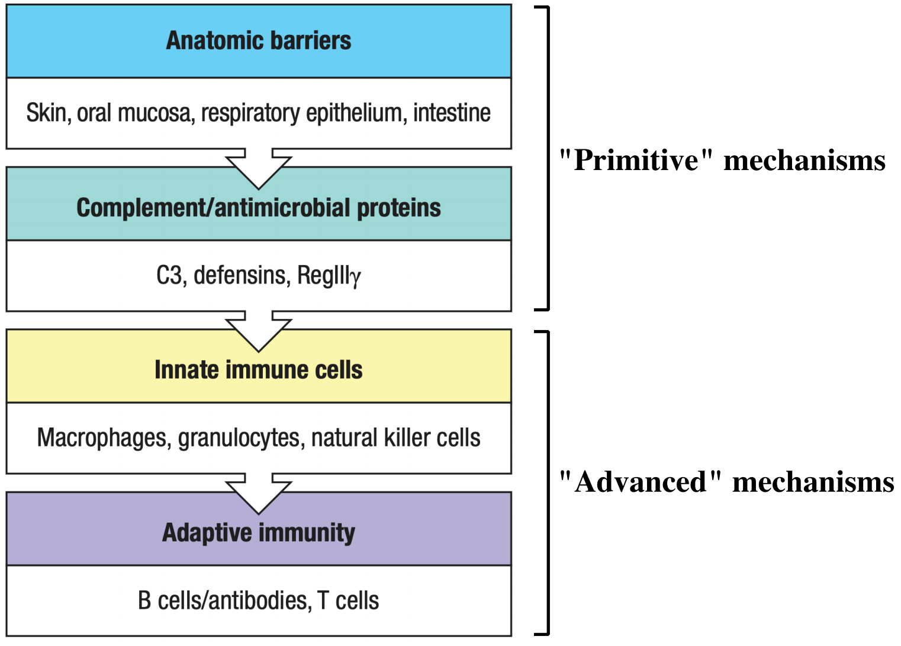{width=60%}

Primitive mechanism
Advanced mechanism

Innate immunity: 
- genes directly inherited
- no antigen-specificity

Adaptive immunity: 
- involving gene rearrangements
- antigen-specificity


#### Primitive mechanism: Anatomic barriers

- Epidermis of skin：皮肤对于空气和水是完全隔绝的
- Bronchial ciliated epithelium呼吸道：黏液层，隔绝病原体进入同时使空气和水进入，纤毛会单方向的摆动，将粘液从肺部到支气管到口腔排出去。
- Gut epithelium消化道：与呼吸道的机制类似

#### Primitive mechanism: Complement补体系统/antimicrobial抗菌肽 proteins

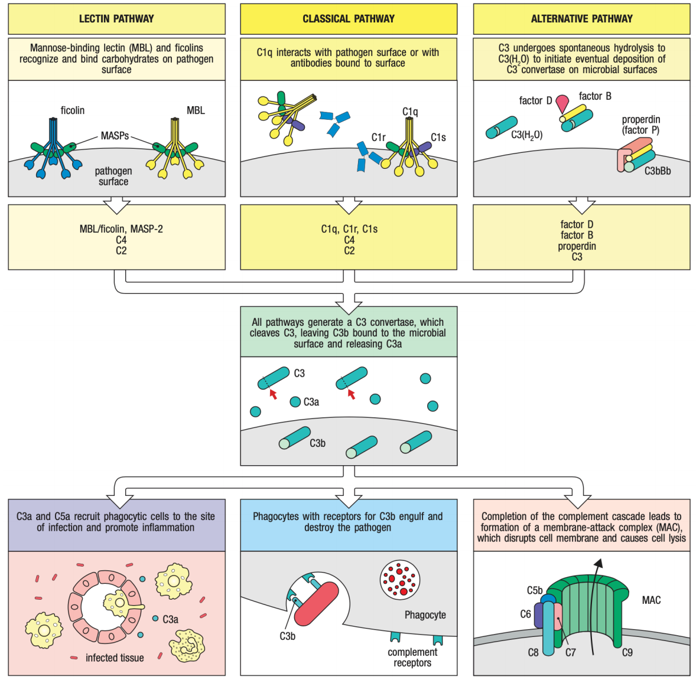{width=60%}

- 补体系统：一系列蛋白通过级联反应出发
  - 经典途径；凝集素途径（凝集素：能够结合多糖）；旁支途径
  - 在细菌或者病原体直接打洞
- 抗菌肽/抗菌蛋白：
  - 直接通过各种方式攻击病原体
  - Lysozyme(溶菌酶)：消化掉革兰氏阴性菌和革兰氏阳性菌表面的多糖结构，使得细菌无法自己维持渗透压，从而自然破裂
  - 溶菌蛋白起作用方式：接触到磷脂双分子层后改变构象直接打洞
  > 如何识别自我和非我？区分磷脂双分子层中脂类的具体组成（like人类中有胆固醇的存在，让这些蛋白无法在人体细胞的细胞膜上打洞。有一些其他真菌的磷脂连接方式和人类差异较大，也可以辅助区分）

#### Advanced mechanism: Innate immune cells

温血动物鸟类开始真正意义上出现Advanced mechanism

获得性免疫反应的细胞和天然免疫反应的细胞类型差异很大，天然免疫反应的细胞类型很难定义

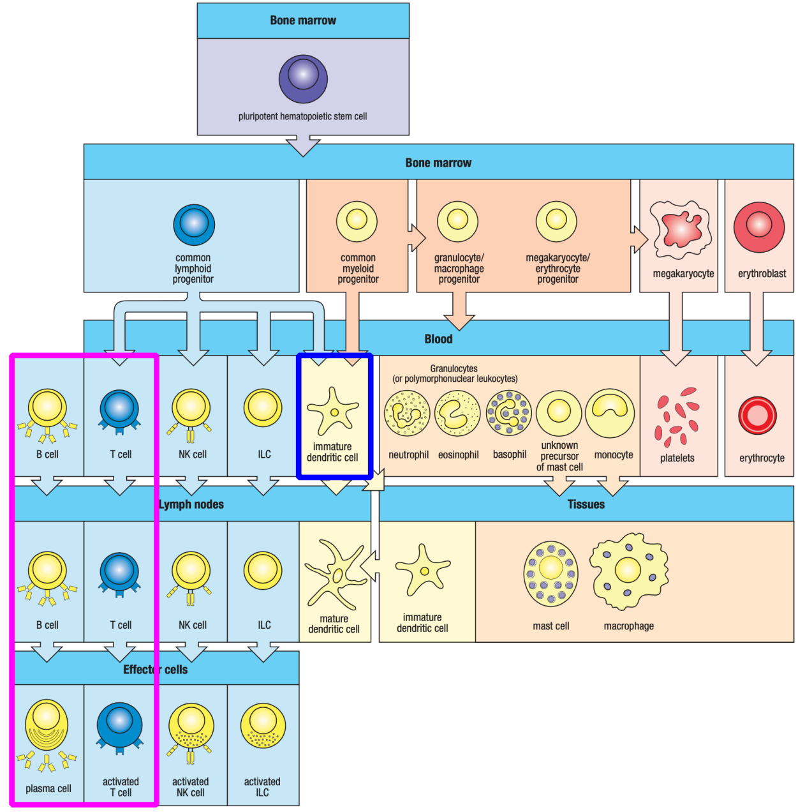{width=60%}

造血干细胞通过分化——>造血系细胞，髓系细胞，淋系细胞->获得性免疫反应细胞为B细胞和T细胞，都是淋系细胞
> 树突状细胞：连接获得性免疫和天然免疫，可以同时起源于髓系和淋系，同时可以发挥获得性免疫和天然免疫的功能

- 天然免疫反应细胞：巨噬细胞（髓系），粒细胞（髓系），树突状细胞（多样），NK细胞（淋系）
  - 可以区分自我和非我
  - 不光吞噬，还可以通过自爆反应杀死（嗜酸性粒细胞）

- **天然免疫反应的自我和非我**:
    *Janeway: immune system has evolved specificalty to recognize and respond to infectious microorganisms, and that this involves recognition not only of specific proteins, but also of certain **characteristics or patterns common** on infectious agents but absent from the host*
  - Pathogen-associated molecular patterns: 比如脊椎动物中糖链最末含有唾液酸残基

# Innate immunity

Innate immunity: 
- genes directly inherited
- no antigen-specificity

Adaptive immunity:
- involving gene rearrangements
- antigen-specificity

### complement system

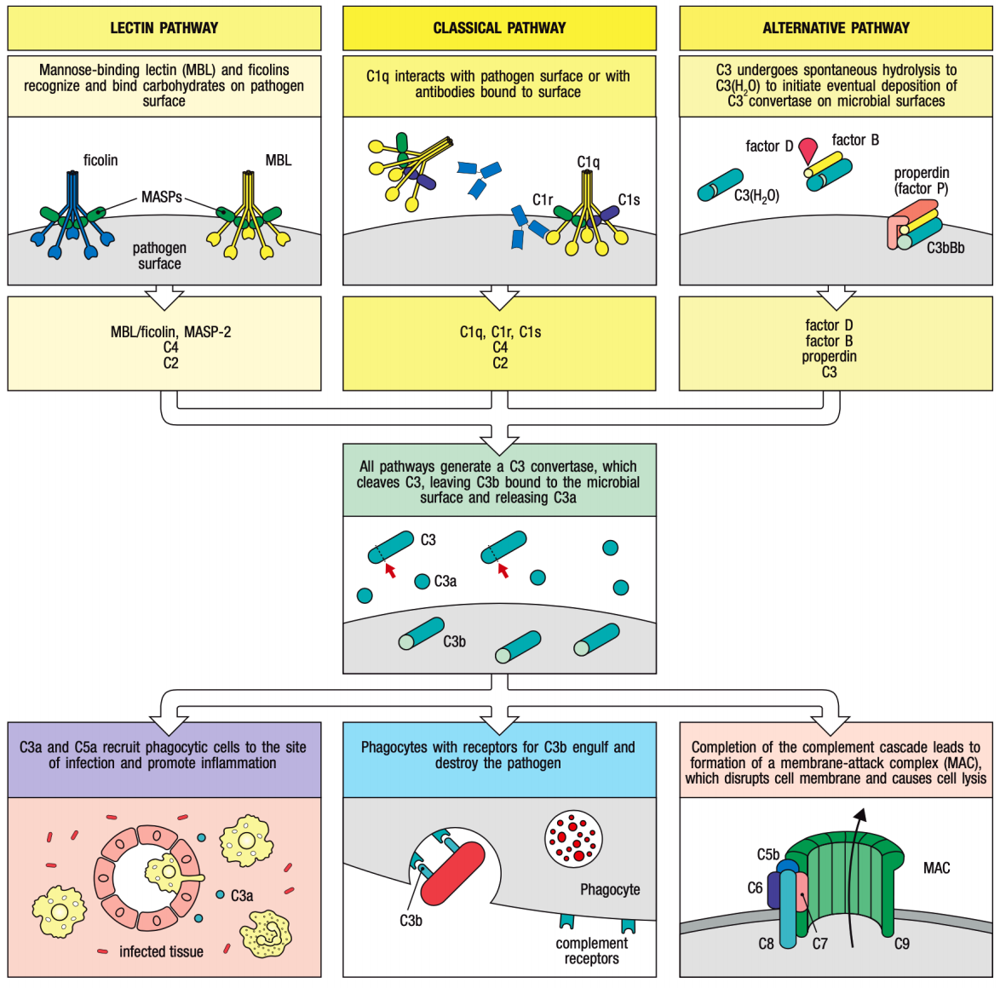{width=60%}

1. lectin pathway 凝集素途径
2. classical pathway 经典途径
3. alternative pathway 替代途径

补体系统组分完全由基因编码、可生殖系遗传、通常无抗原特异性。但经典途径是一个特殊例外——它由抗原-抗体复合物激活，因此具有抗原特异性，这是整个天然免疫概念中唯一的例外。

The central component: C3 protein
- 成熟 C3 由 𝛼 链和 𝛽 链组成，但二者由单一基因编码，翻译后通过二硫键共价连接。
- C3 含有一个特殊的 TED 结构域，其中存在硫酯键（thioester bond）。
- C3 被 C3 转化酶切割后产生 C3a 和 C3b；切割使得 TED 结构域中的硫酯键被活化。
- 活化的硫酯键要么被水水解而失活，要么与周围物质（如病原体表面的氨基或巯基）发生共价连接，使 C3b 锚定在病原体表面。

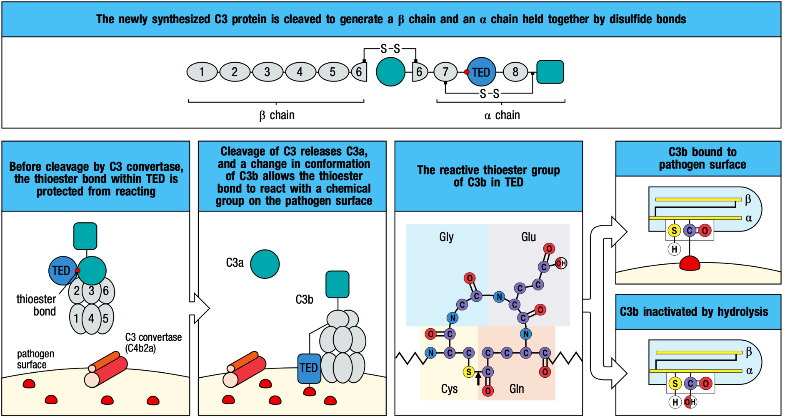{width=60%}

### Pattern recognition receptors

##### Toll-like receptors (TLRs)

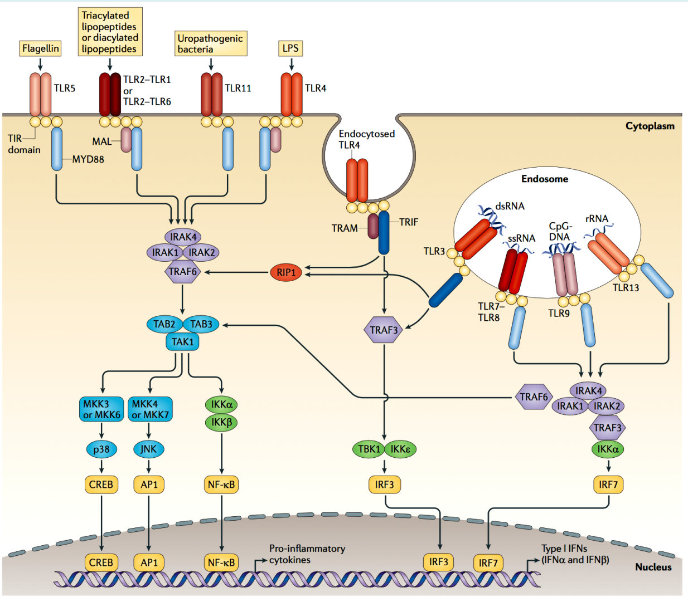{width=60%}

- 通过适配蛋白向下游传递信号。两大核心适配蛋白为 MyD88 和 TRIF
  - MyD88：几乎所有 TLR（除 TLR3 外）都依赖 MyD88 传递信号，是主导性适配蛋白。
  - TRIF：仅 TLR3 单独依赖 TRIF；TLR4 特殊，可同时激活 MyD88 和 TRIF。
  - MyD88 下游激活 NF-𝜅B 和 AP-1，主要驱动促炎细胞因子（TNF-𝛼、IL-1、IL-6）。
  - TRIF 下游通过 K63 连接泛素化链激活 IRF3/IRF7，主要驱动 I 型干扰素（抗病毒反应）。

Different subcellular localization of TLRs
- **TLR定位**: 细胞膜(TLR2/1、TLR2/6、TLR4、TLR5、TLR11), 内体：TLR3、TLR7/8、TLR9、TLR13

- **适配蛋白募集**
  - TLR通过胞内的 **TIR结构域** 招募适配蛋白。
  - 主要包括：
    - **MyD88依赖通路**：多数TLR使用
    - **TRIF依赖通路**：主要由TLR3和内吞后的TLR4使用

- **早期信号事件**
  - MyD88或TRIF招募IRAKs、TRAFs、TAK1等信号蛋白。
  - **K63-linked ubiquitination** 主要作为信号平台，帮助招募和激活下游激酶。
  - 与此不同，**K48-linked ubiquitination** 通常介导蛋白降解，在负反馈调控中具有重要意义。

Pro-inflammatory cytokines induced by TLRs

- TLR信号激活后，NF-κB、AP-1、IRF等转录因子促进炎症因子产生。
- 其中 **IL-1β、IL-6、TNF-α** 是典型的促炎细胞因子，可以作用于多个组织。
- **肝脏**
  - 诱导急性期蛋白产生，例如C-reactive protein和mannose-binding lectin。
  - 促进补体激活和调理作用，帮助病原体被吞噬细胞清除。
- **骨髓和血管内皮**
  - 促进中性粒细胞动员。
  - 增强吞噬反应。
- **下丘脑**
  - 引起体温升高，即发热反应。
  - 发热可以抑制部分病毒和细菌复制，并增强抗原处理和特异性免疫反应。
- **脂肪和肌肉**
  - 动员蛋白质和能量，为升高体温和炎症反应提供代谢支持。
- **树突状细胞**
  - TNF-α促进树突状细胞迁移至淋巴结并成熟。
  - 成熟树突状细胞可以启动适应性免疫反应。

IL-1 signaling
- **IL-1R通路与TLR通路相似**
  - IL-1R家族受体也含有TIR结构域。
  - 因此IL-1R可以复用类似TLR的MyD88依赖信号机制。
- **受体和配体**
  - IL-1α或IL-1β结合IL-1R1。
  - IL-1R1与IL-1RAcP形成受体复合物。
  - IL-1RA可以竞争性抑制IL-1信号。
- **下游信号**
  - IL-1R复合物 → MyD88 → IRAKs → TRAF6 → TAK1/TAB1
  - TAK1进一步激活NF-κB和MAPK通路。
- **转录因子激活**
  - IκBα被磷酸化后，NF-κB释放并进入细胞核。
  - p38等MAPK通路激活AP-1。
- **结果**
  - 诱导IL-6、TNF-α、IFNα、IFNβ、TGFβ等基因表达。
  - 因此IL-1R信号可以进一步放大炎症反应。

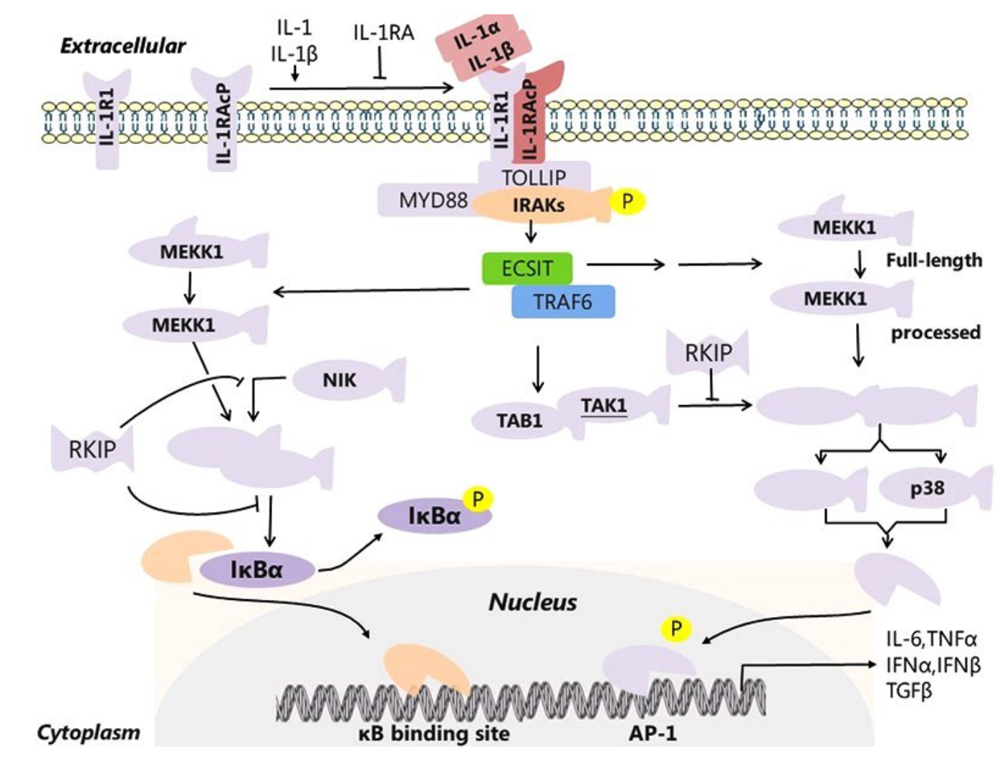{width=60%}

Pathogens' inhibition of TLRs signaling pathways

- 病原体可以通过自身蛋白干扰TLR信号，从而逃避免疫识别和炎症反应。
- **抑制受体或适配蛋白层面**
  - 某些病毒蛋白可以阻断TLR与MyD88、MAL、TRIF、TRAM等适配蛋白的连接。
  - 例如HCV NS5A、HCV NS3-4A、VACV A46R等可干扰TLR信号复合物形成。
- **抑制IRAK/TRAF/TAK1层面**
  - VACV A52R等蛋白可以干扰IRAK、TRAF6或TAK1相关信号。
  - 这样会阻断K63泛素化信号平台和激酶级联。
- **抑制转录因子激活**
  - 如果NF-κB、IRF3、IRF7不能被有效激活，促炎细胞因子和I型干扰素表达就会下降。


Viral infection
- 病毒进入宿主细胞后，会释放病毒基因组。
- RNA病毒复制时，会在细胞质中产生病毒RNA，例如未加帽RNA、5'-triphosphate RNA或dsRNA。
- DNA病毒或逆转录病毒感染时，可能导致病毒DNA或逆转录DNA出现在细胞质中。
- 这些异常核酸就是RLRs和cGAS-STING通路要识别的“危险信号”。


CD8+ T cells and NK cells can kill virus-infected cells
- 病毒感染细胞后，病毒蛋白可以被加工成肽段，并通过MHC class I展示在细胞表面。
- CD8+ cytotoxic T cells识别“病毒肽-MHC I”复合物后，可以直接杀死感染细胞。
- 病毒感染细胞可被细胞毒性T细胞识别并杀伤；杀伤过程中会激活caspase，最终导致感染细胞DNA断裂和死亡
- NK细胞也可以杀伤病毒感染细胞，尤其是在感染导致MHC I表达下降或应激配体上调时。

##### RIG-I-like receptors (RLRs)

Viral RNAs in cytosol trigger RIG-I pathway
- TLR3、TLR7、TLR9主要检测内体中的病毒核酸；而细胞内产生的病毒RNA则由RLRs识别。
- RLRs主要包括：
  - RIG-I
  - MDA5
  - LGP2

- RIG-I和MDA5都有RNA helicase-like domain和CARD domains。
- RIG-I主要识别带有未修饰5'-triphosphate的病毒RNA。
- MDA5更偏向识别病毒dsRNA。
- 病毒RNA结合RIG-I/MDA5后，RIG-I/MDA5构象改变，CARD结构域暴露。
- CARD结构域进一步与线粒体外膜上的MAVS结合。
- MAVS聚集后招募TRAFs，并促进K63-linked polyubiquitin scaffold形成。
- 下游激活：
  - TBK1 / IKKε → IRF3 / IRF7 → I型干扰素
  - IKKα / IKKβ / NEMO → NF-κB → 促炎细胞因子

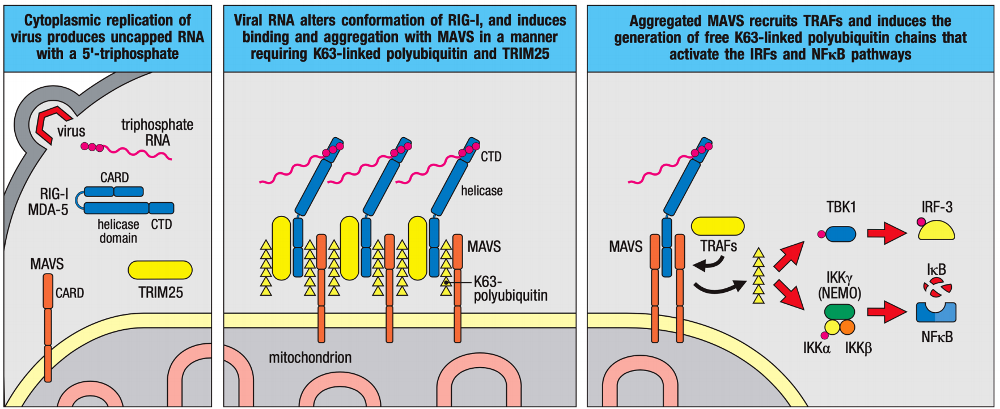{width=60%}

Viral RNAs in cytosol trigger RIG-I pathway: Self vs. non-self。
- Janeway强调：RIG-I主要通过RNA 5'端结构区分宿主RNA和病毒RNA。
- 宿主细胞中的不同RNA虽然也可能具有复杂二级结构，甚至在刚转录出来时带有 5'-triphosphate，但它们大多在细胞核内经过成熟加工后才进入细胞质。例如 mRNA 会获得 5' cap 和 poly(A) tail，并结合 PABP；snRNA会被加帽；rRNA会与核糖体蛋白结合；tRNA和miRNA也会经过剪切、修饰和蛋白复合物包装。因此，这些宿主RNA不会以“裸露、未修饰、病毒样”的形式暴露在细胞质中，所以通常不会被RIG-I识别。
- 相反，病毒RNA常常在细胞质中复制，容易暴露出宿主RNA中少见的特征，比如未加帽的 **5'-triphosphate RNA**、病毒复制产生的 **dsRNA**，或者缺乏正常宿主RNA修饰的异常结构。RIG-I正是通过识别这些“非自身RNA特征”来判断病毒感染，并进一步激活MAVS通路，诱导I型干扰素和抗病毒反应。

Viral inhibition of RIG-I pathway
- Janeway举例：Influenza A virus的NS1蛋白可以抑制TRIM25。
- TRIM25本来参与RIG-I激活所需的K63-linked ubiquitination。
- 如果TRIM25被抑制，RIG-I无法有效通过MAVS激活下游信号。
- 结果：
  - IRF3/IRF7激活下降
  - NF-κB激活下降
  - I型干扰素和炎症因子产生减少
- 这说明病毒不仅会被RLRs识别，也会进化出机制阻断RLRs信号。
> 一些病毒蛋白可以遮蔽dsRNA或抑制RIG-I/MDA5识别，脊髓灰质炎病毒可促进MDA5降解，HAV 3ABC和HCV NS3-4A可切割IPS-1/MAVS，VACV N1L、Rabies virus P、VACV K7R等可抑制TBK1/IKKε-IRF3/7分支，VACV N1L和B14R还可抑制IKK-NF-κB分支。

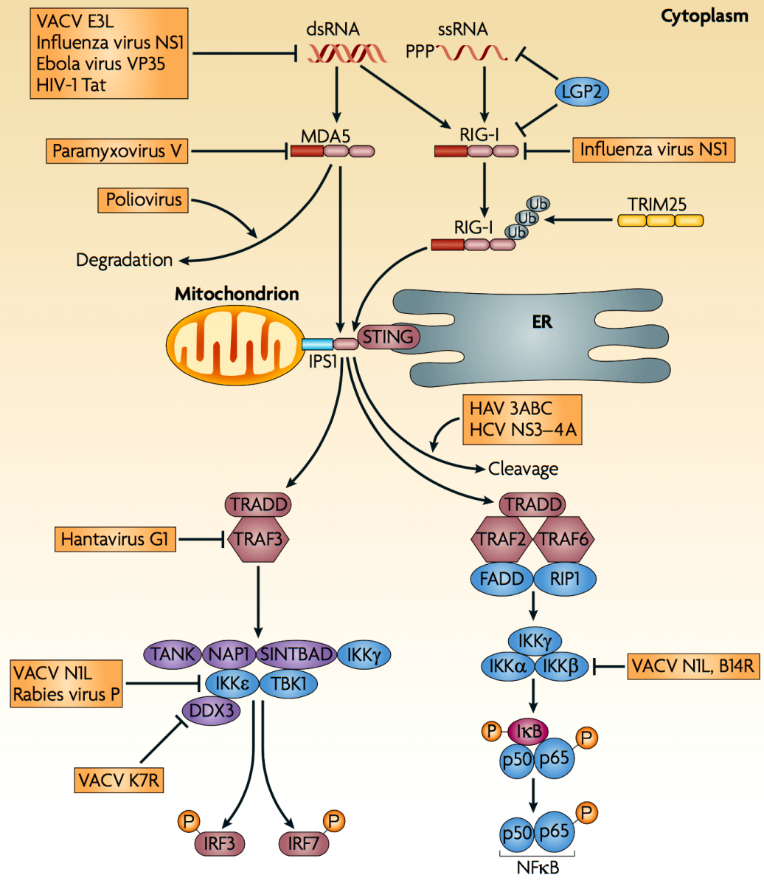

##### cGAS-STING

- cGAS是细胞质DNA sensor。
- 当病毒dsDNA进入细胞质后，cGAS直接结合dsDNA。
- cGAS被激活后，以ATP和GTP为底物合成第二信使cGAMP。
- cGAMP结合ER膜上的STING二聚体。
- STING激活TBK1。
- TBK1磷酸化IRF3。
- IRF3进入细胞核，诱导type I interferon genes表达

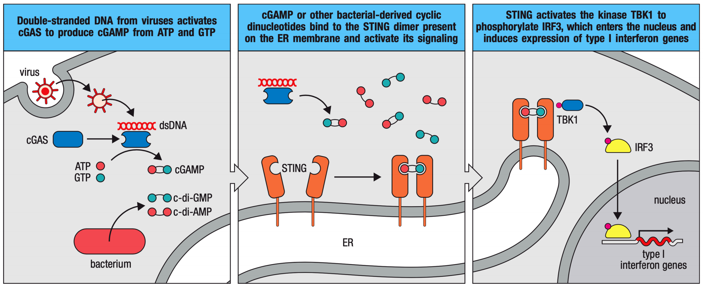

Viral DNAs in cytosol trigger cGAS pathway: Self vs. non-self
- 宿主DNA正常情况下主要被限制在细胞核和线粒体中。
- 如果DNA异常出现在细胞质中，就可能代表：
  - DNA病毒感染
  - 细菌DNA进入细胞质
  - 逆转录病毒产生DNA中间体
  - 线粒体损伤释放自身DNA
  - 死细胞或基因组不稳定导致DNA暴露
- 因此cGAS识别“非自身”的方式，不是靠DNA序列，而是靠DNA出现的位置异常。
- 换句话说：**细胞质DNA本身就是危险信号**。
> - cGAS 是细胞质DNA感受器。它结合DNA后，用 ATP和GTP 合成 cGAMP；cGAMP再激活内质网上的 STING，使其转运到ERGIC/Golgi并招募 TBK1 和 IKK。TBK1磷酸化 IRF3，使其进入细胞核诱导 IFN-β；IKK则激活 NF-κB p65/p50，促进炎症基因表达。最终结果是产生I型干扰素和炎症因子。
> - CDN，如c-di-GMP、c-di-AMP，也可以直接激活STING，不一定需要cGAS。图中的 ENPP1 可以降解cGAMP，限制STING信号过强。总体来说，这页PPT说明：细胞质中的病毒DNA、细菌DNA、逆转录DNA或异常自身DNA，都可通过 cGAS-cGAMP-STING-TBK1/IKK 通路激活IRF3和NF-κB。

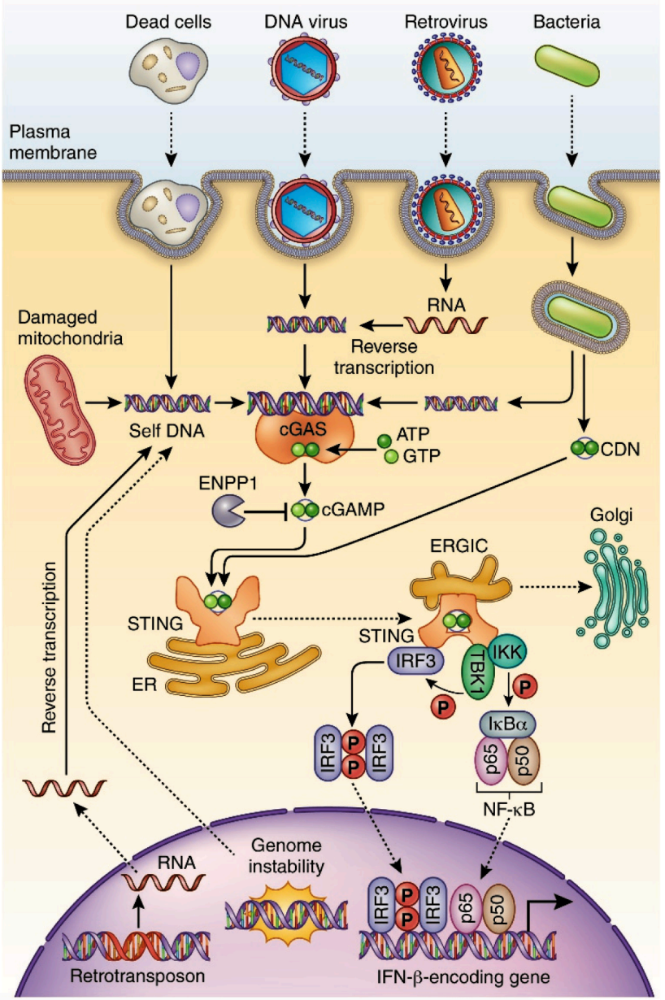

Anti-viral innate immune pathways
- RIG-I和MDA5识别病毒RNA，激活MAVS通路。
- cGAS等DNA sensors识别细胞质DNA，激活STING通路。
- 这些通路最终都诱导I型干扰素。
- 三类抗病毒核酸识别通路可以这样对比：

| 通路 | 识别位置 | 识别对象 | 接头蛋白 | 主要转录因子 |
|---|---|---|---|---|
| TLR3/7/9 | 内体 | dsRNA / ssRNA / CpG DNA | TRIF或MyD88 | IRF3/7, NF-κB |
| RLRs | 细胞质 | 病毒RNA | MAVS | IRF3/7, NF-κB |
| cGAS-STING | 细胞质 | 病毒DNA / 异常DNA | STING | IRF3, NF-κB |

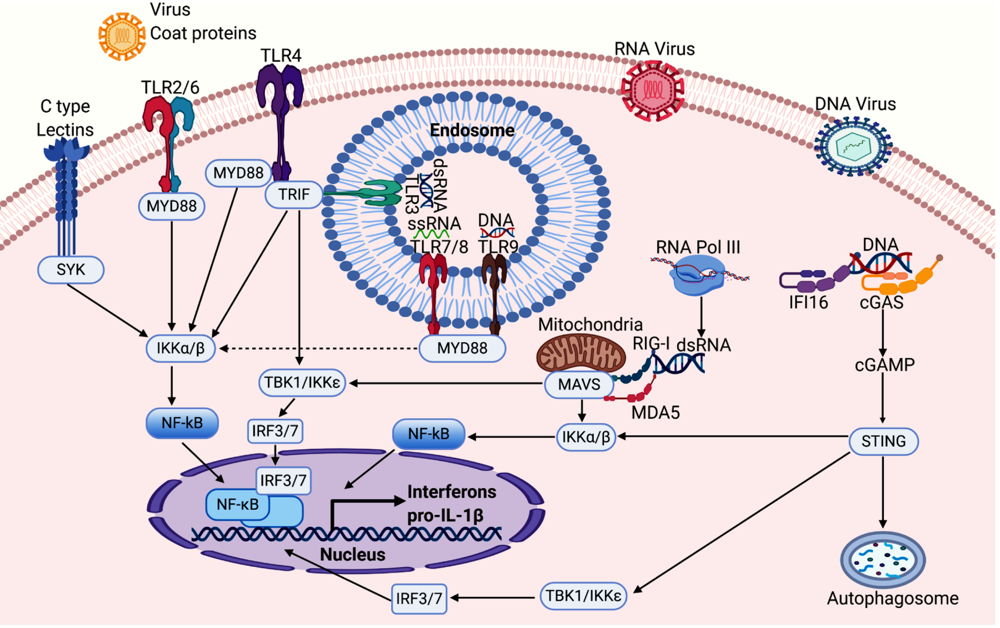

Interferons
- RLRs和cGAS-STING通路激活后，重要结果之一是产生I型干扰素，干扰素可以阻断病毒向未感染细胞扩散。
- IFN-α/β结合IFNAR后，通过JAK-STAT通路激活STAT1和STAT2。
- STAT1/STAT2与IRF9形成ISGF3复合物。
- ISGF3进入细胞核，诱导ISGs表达。
- ISGs包括OAS、PKR、Mx、IFIT、IFITM等抗病毒分子。

Interferon-Stimulated Genes (ISGs): OASs
- OAS是interferon-stimulated gene产物之一。OAS可以把ATP聚合成2'-5'连接的寡腺苷酸，这些2'-5'寡腺苷酸可以激活一种内切核糖核酸酶。被激活的核酸酶降解病毒RNA。
- 结果：
  - 病毒RNA减少
  - 病毒复制受阻
  - 细胞进入抗病毒状态

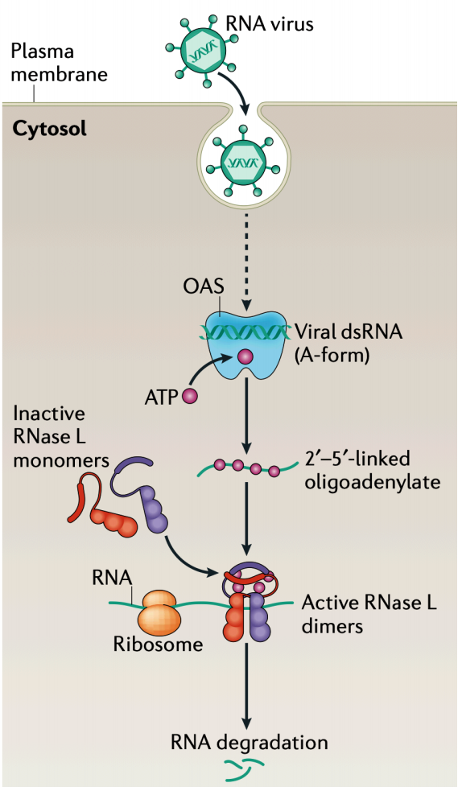

Interferon-Stimulated Genes (ISGs): PKR
- PKR也是I型干扰素诱导的抗病毒蛋白。PKR是一种dsRNA-dependent protein kinase。PKR可以磷酸化eIF2α。eIF2α被磷酸化后，蛋白翻译起始受阻。
- 结果：
  - 病毒蛋白合成下降
  - 病毒复制被抑制
  - 但宿主细胞自身蛋白翻译也会受到影响

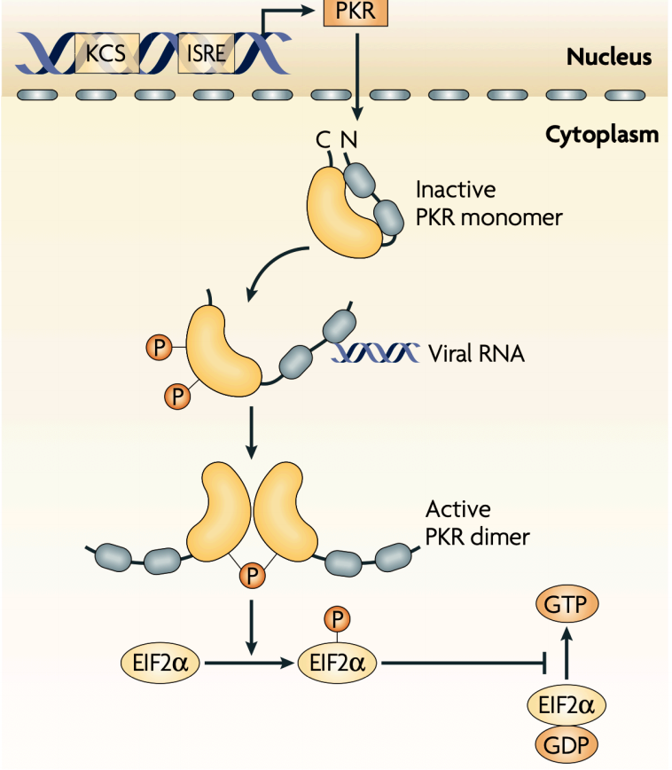

Interferon-Stimulated Genes (ISGs): IFITs
- 正常翻译起始需要：
  - methionine tRNA
  - 40S ribosomal subunit
  - eIF2
  - eIF3
  - eIF4
- 这些分子形成43S pre-initiation complex。
- IFIT1和IFIT2可以结合eIF3的亚基，阻止43S pre-initiation complex形成。
- IFITs还可以结合未加帽或异常加帽的病毒mRNA，阻止其翻译。
- 结果：病毒RNA不能有效翻译成病毒蛋白。

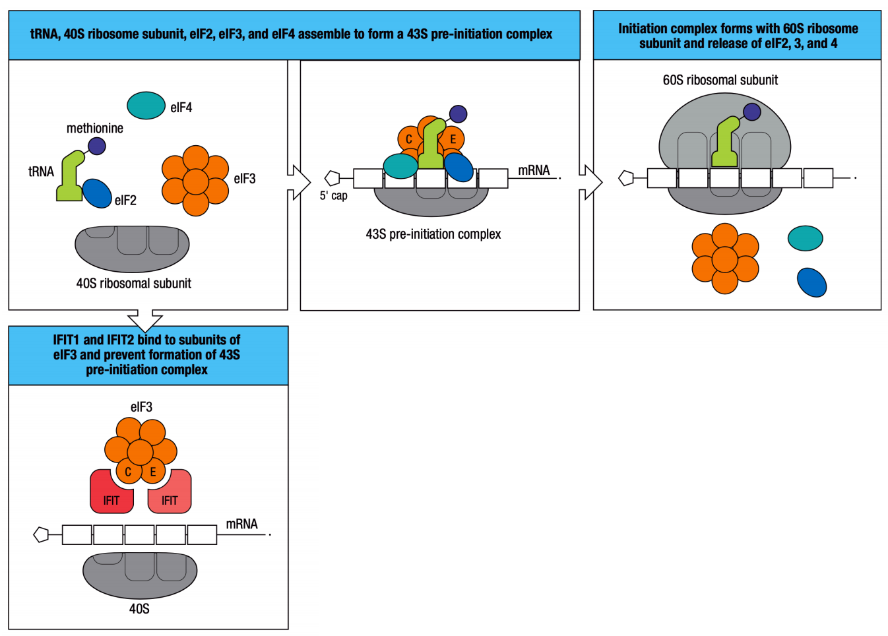

Interferon-Stimulated Genes (ISGs): ISG15
- ISG15类似泛素，可以共价连接到靶蛋白上。
- 过程包括：
  - UBE1L：激活ISG15
  - UBCH8：转运ISG15
  - HERC5：连接ISG15到底物蛋白
  - USP18：去除ISG15修饰
- 生物学意义：
  - 改变宿主或病毒蛋白功能
  - 抑制病毒复制
  - 调节干扰素信号强度

Interferon-Stimulated Genes (ISGs): MxA
- Mx proteins是I型干扰素诱导的抗病毒蛋白。人和野生小鼠有Mx1和Mx2，这些蛋白属于dynamin family GTPases。MxA可以寡聚化，并捕获病毒组分。
- 结果：
  - 病毒复制复合体或病毒衣壳相关结构被限制
  - 病毒复制和装配受阻

Anti-viral innate immunity
- IFN-α和IFN-β的三类主要功能：
  - 诱导未感染细胞进入抗病毒状态
  - 增加MHC class I表达，提高病毒感染细胞被CD8 T细胞识别的概率
  - 激活NK细胞，使其杀伤病毒感染细胞。

- 感染细胞释放干扰素
- 邻近未感染细胞降低RNA和蛋白合成，减少病毒扩增机会
- 感染细胞更容易进入凋亡
- 免疫细胞被激活，帮助清除感染细胞

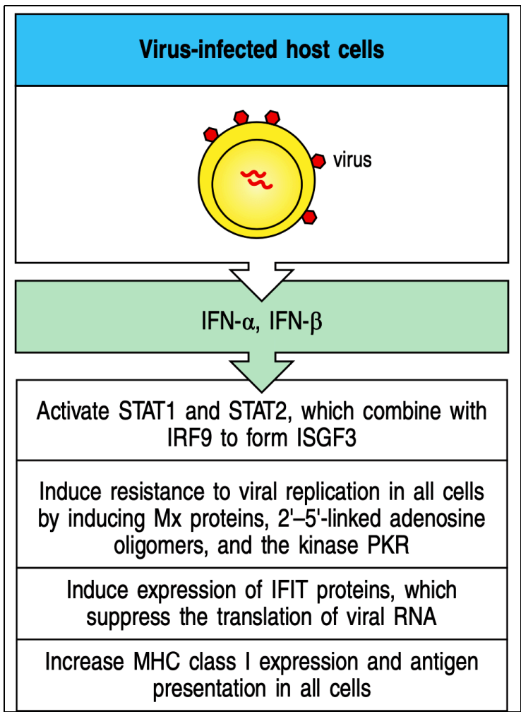

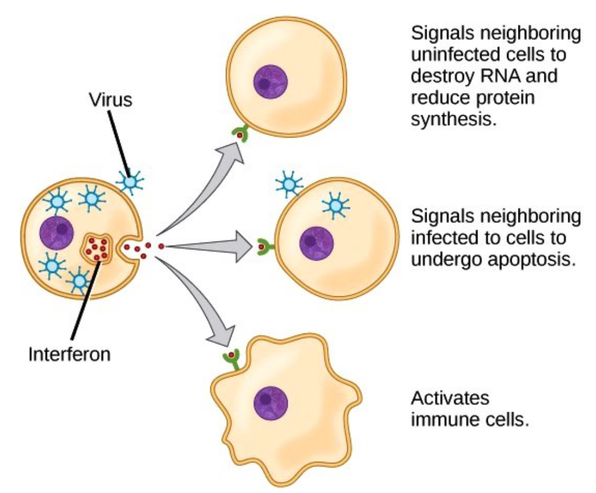

##### 真菌感染的常见病原类型

- **Aspergillus genus**
  - 常见种类包括 *Aspergillus flavus*、*Aspergillus fumigatus*、*Aspergillus niger*、*Aspergillus terreus* 等。
  - *Aspergillus fumigatus* 是重要的机会性真菌病原体，尤其容易在免疫功能低下者中引起侵袭性感染。
  - 曲霉通常以 **conidia** 或 **hyphae** 的形式参与感染。

- **Mucorales order**
  - Mucorales 是另一类重要丝状真菌。
  - 其特点是形成大量菌丝和孢子囊结构。
  - 在免疫缺陷、糖尿病酮症酸中毒等背景下，可引起严重的毛霉菌病。

> Fungal infection
> 常见真菌病原
> - Aspergillus
> - Mucorales
> - Candida
> - Cryptococcus
> 真菌形态
> - yeast
> - hyphae
> - pseudohyphae
> - conidia
> - capsule

##### 真菌形态与免疫识别

- 真菌不是单一形态的病原体，可以表现为多种 **morphotypes**：
  - **yeast**
  - **hyphae**
  - **pseudohyphae**
  - **conidia**
  - **capsule**

- 不同真菌形态会影响宿主免疫识别和吞噬。
  - *Candida albicans* 可在 yeast、pseudohypha、hypha 等形态之间转换。
  - *Aspergillus fumigatus* 可形成 conidia 和 hyphae。
  - 树突状细胞、巨噬细胞和中性粒细胞可以吞噬不同 fungal morphotypes。

- 病理图中可以看到真菌在组织中形成侵袭性病灶。
  - 在免疫功能正常时，吞噬细胞可限制真菌扩散。
  - 在吞噬细胞功能缺陷或免疫抑制状态下，真菌更容易侵入组织并造成严重损伤。

##### C-type lectin receptors

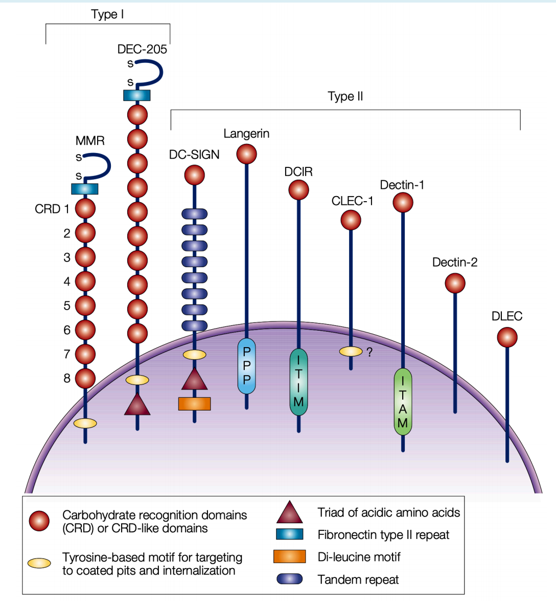

- **C-type lectin receptors, CLRs** 是一类主要识别糖类结构的模式识别受体。
- 它们常表达于巨噬细胞、树突状细胞和中性粒细胞表面。
- 常见 CLR 包括：
  - **Dectin-1**
  - **Dectin-2**
  - **Mincle**
  - **DC-SIGN**
  - **mannose receptor**
  - **Langerin**
- CLRs 的共同特点是具有糖类识别结构域，例如：
  - **CRD, carbohydrate recognition domain**
  - **CTLD, C-type lectin-like domain**

- 这些受体可以识别真菌细胞壁上的糖类结构，并诱导吞噬和炎症信号。

C-type lectin receptors recognize polysaccharides
- β-glucans:
  
  

- Mannan:

  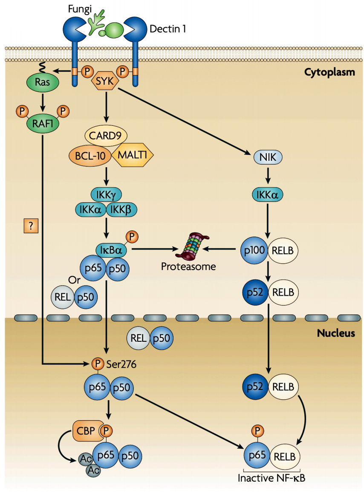

Innate immune cells against fungal infection
  
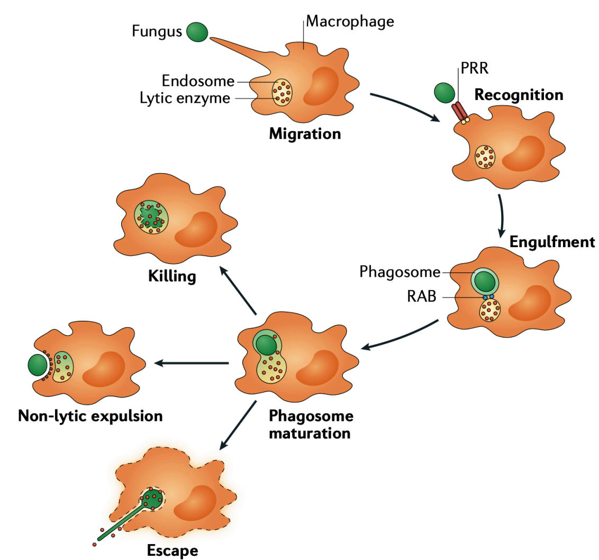

- 巨噬细胞和中性粒细胞可以通过 PRRs 识别真菌。
- 识别后发生以下过程：

```text
migration
↓
recognition
↓
engulfment
↓
phagosome formation
↓
phagosome maturation
↓
killing
```

- 吞噬后的真菌进入 **phagosome**。
- phagosome 与 lysosome 融合形成 **phagolysosome**。
- 在 phagolysosome 中，真菌可被以下机制杀伤：
  - 酸性环境
  - 溶酶体酶
  - 抗菌肽
  - ROS
- 有些真菌可能逃逸或被非裂解性排出，说明真菌与吞噬细胞之间存在动态相互作用。

NETosis: A unique process of innate immune response
- **NETosis** 是中性粒细胞释放 **neutrophil extracellular traps, NETs** 的过程。
- NETs 主要由以下成分组成：
  - DNA / chromatin
  - histones
  - antimicrobial proteins
  - neutrophil granule proteins

- NETs 的作用：
  - 捕获真菌或其他胞外病原体
  - 限制病原体扩散
  - 促进后续吞噬和清除

- NETosis 可分为两类：

  - **lytic NETosis / suicidal NETosis**
    - 细胞膜破裂
    - 中性粒细胞死亡
    - NETs 较慢释放

  - **vital NETosis**
    - 细胞不立即裂解
    - NETs 快速释放
    - 中性粒细胞可能保留部分功能

- NETs 形成与 ROS 有关。
- 因此，吞噬细胞 ROS 生成缺陷会影响抗真菌防御。

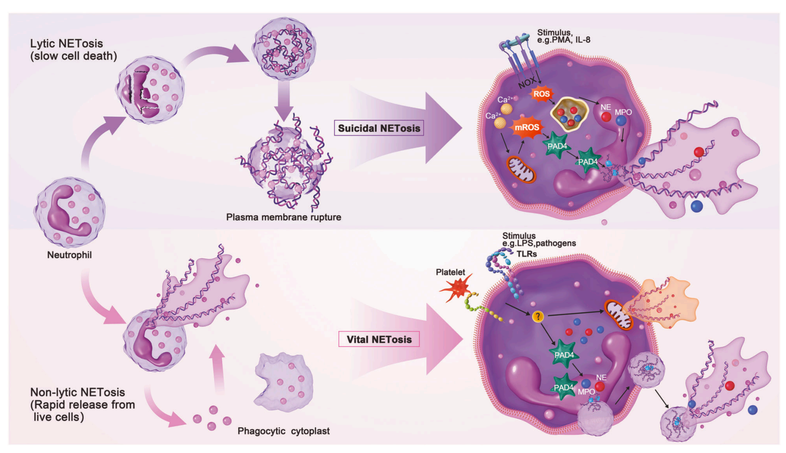

# Adaptive immunity: T cells

适应性免疫涉及大范围的细胞迁移
- 抗原呈递
- 激活的T、B细胞必须通过循环到心脏附近的胸管，进入血液循环，然后再回到感染位置

### Antigen presentation

#### Dendritic cells

机体最重要的抗原呈递细胞，链接了天然免疫反应和适应免疫反应

树突状细胞可以起源于髓系也可以起源于淋系

形态： 有明显的树突状分支，为了尽可能增大细胞表面积，捕获抗原、呈递抗原
- 感染位置会形成更多的分支分叉，捕获更多细胞
- 进入淋巴结之后会皱缩，细胞面积没有变化，变成近乎于球状，有利于在淋巴内运输
- 到Tcell Bcell区域之又变回分叉状态

- cDC(convenetional)
- pDC(plasmacytoid): 产生抗病毒免疫反应中的天然免疫反应

**MHC(major histocompatibility complex):**
- complex（复合物）：在基因组上由多个基因编码
- hitocompatibility：组织兼容，不排斥（from 皮肤移植实验）
- major：决定组织兼容分为主要因素和次要因素，major代表MHC为主要因素

MHC存在的真实意义为呈递抗原
呈递的必须是连续的线性的结构，which means如果是一段多肽需要先将蛋白质裂解
（一张图片）

从antigen到epitope：
- epitope：能够被一个T/B cell所识别的表位（就是刚才说的多肽）

MHC1 & MHC2
（一张很重要的图）
- 都是一元二聚体
- MHC1: 跨膜蛋白大亚基，和不跨膜的小亚基（大亚基决定了抗原呈递位置）
- MHC2: 几乎对等的两个跨膜亚基（共同组成抗原呈递表位）

MHC1 所呈递的是intracellular components：
（组装方式是一张图）
- 肽的结合是纯随机状态，有结合的hotpot和coldpot，N端和C端分别有梳水的结构，形成稳定存在的热点区域，与N/C端距离固定，呈递的peptide大概就是8个氨基酸
- CD8
- 呈递病毒，代表着细胞已经被感染，需要的就是直接杀死，所以呈递对象是CD8，CD8的一个亚基可以直接结合MHC1蛋白

MHC2 呈递extracellular components：细胞从外部环境捕获消化的产物
（组合方式是一张图）
- 在ER形成后必须转移到能够消化蛋白的西方，并带有一个invariant chain（CLIP），一方面作为信号分子转移，另一方面卡住，保证MHC2不会被loading出自身的肽；在溶酶体中信号分子chain被降解，然后CLIP还在；等到胞外进入溶酶体之后CLIP再离开
- CD4
- 呈递的东西很多样，N/C端比较的flexible，长短不一，但即使N/C不稳定，依然能找到保守性的位点，只是往N/C具体不固定，是可以滑动的
- 代表环境中有病原体了，所以需要增强免疫系统和找到病原体，所以呈递对象是辅助性Tcell CD4，同理，CD4的一个亚基可以直接结合MHC2蛋白

> cross presentation:
> 如果病毒被细胞摄取之后逃过了溶酶体，就会被MHC1呈递出去

组织兼容性的定义：MHC也会被呈递

控制MHC分子的基因强烈连锁
- 每一个基因都具有强烈的核酸水平多态性，导致蛋白水平显著不行
- 多态性多在beta亚基
- 多态性在某些特殊的位点具有非常高的多态性，最高的微点都是能呈递抗原的位置

但是对一个确定序列的MHC分子，能呈递的肽段是保守的，稳定的
结合的病毒可能不同，但是都是保守的motif
（一张图）

TCR受体（T-cell receptor）
每个亚基有三个CDR（一共6个），可以非常清晰的感知MHC呈递的结构，有的是读肽段，有的是识别MHC分子

进化上：单基因到多基因，多基因呈现出多态性

获得性免疫免疫没有区分自我和非我能力，这个部分是由天然免疫反应做到的
（一张图）

树突状细胞在静息状态下，被MARCH分子卡在了分泌过程中，当病毒侵染后，天然免疫反应激活了toll受体（eg），抑制了MARCH分子的表达，降解之后就开始呈递了

获得性免疫遗传的激活必须需要天然免疫反应 -> 共刺激信号
（一张图）
局部的非我信息转化为树突状细胞可以表达的信息（膜上高表达共刺激信号，传递到淋巴结）-> signal II
signal I和signal II的**co-stimulatory signal**，二者必须共激活才能产生反应

同时是co-stimulation和co-inhibition信号

# Adaptive immunity: B cells

### B-cell receptor (BCR)

BCR与TCR十分类似，BCR是异源四聚体其中两重两轻都会发生VDJ重排 
- TCR的结构都是稳定的都是异源二聚体
- 但是BCR比较多样的结构
  - IgG是异源四聚体
  - 羊驼完全由重链组成，整体蛋白非常小
  - 更低等生物比如软骨鱼也有只有重链的BCR

BCR can be separated into fragment ab (Fab) and fragment c (Fc)
- Fab区和Fc区域
- IgG可以被一些特殊的蛋白酶切割，切割完之后的上面的部分就是Fab，决定抗体与抗原结合的部位
- 同时存在Fc区
- Fab:Fc = 2:1

BCR directly binds an epitope without MHCs
- TCR本身不能结合抗原表位，但是BCR是可以的，不需要MHC分子，也正因为如此所以结合的是空间表位，在真实的二维序列上可能是不连续的

BCR can interact with epitopes in diverse conformations
- 抗原表位不仅仅是平坦的，他还有很多不同的形态

V(D)J recombination of BCR
- BCR的重链区由一个基因编码，轻链区由两个截然不同的序列编码
- lanmda light chain是只有V和J，J区和后面的constant区是连续的，所以重排到了哪个J区自然而然就会衔接对应的constant区
- kapa light chain是只有V和J：只有唯一一个kapa constant region
- 重链是标准的VDJ重排
- 因为Bcell是二倍体所以重链有两个基因位点轻链有四个基因位点，但是在此情况下重组会比较复杂，所以出现了等位排斥效应

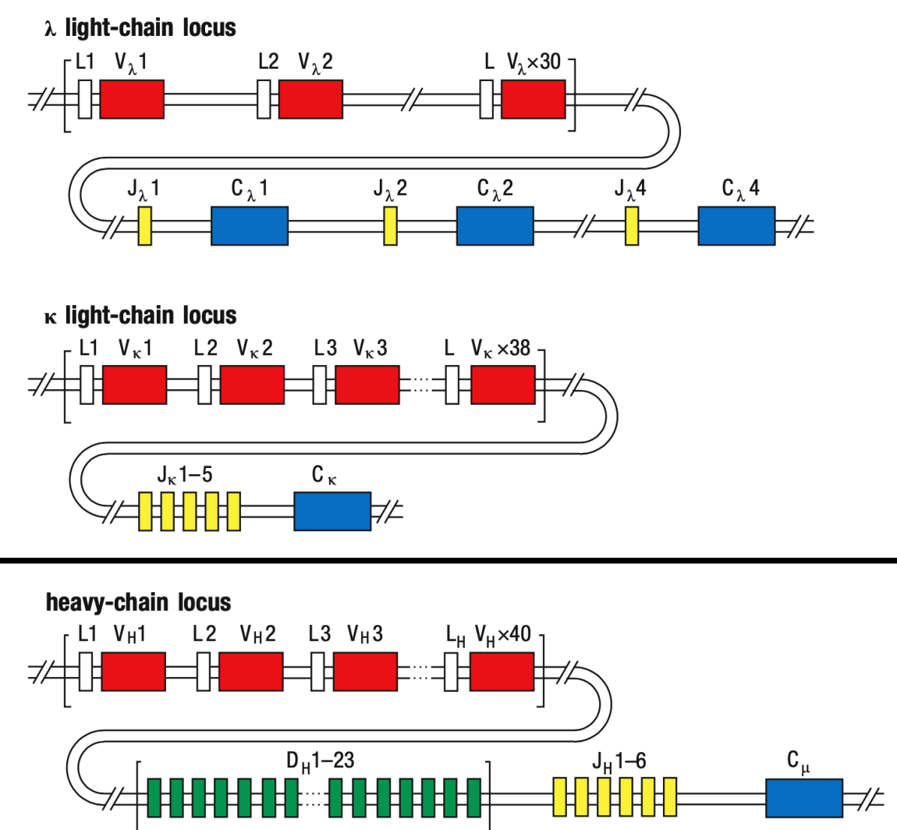

Recombination signal sequence (RSS) and the "12/23 rule"
- 和TCR一样

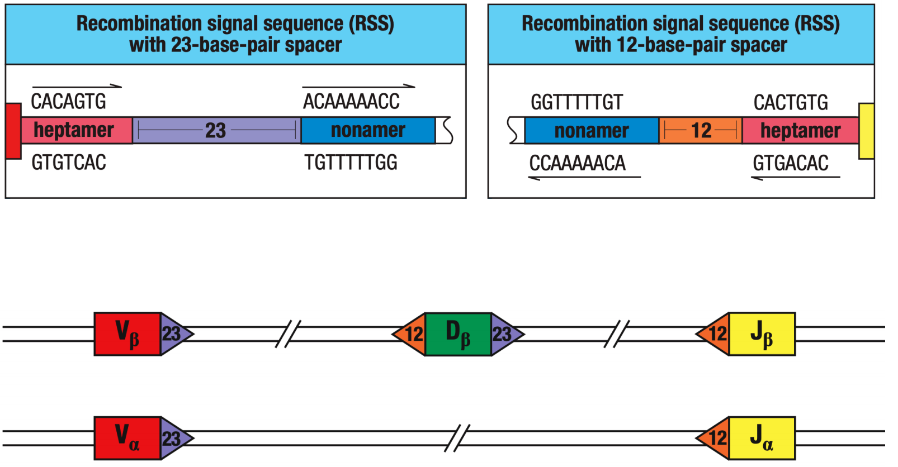

Nucleotide additions at the V(D)J joints further diversify BCR
- 和TCR一样

V(D)J recombination produces a diversity of BCR
- BCR的diversity显著低于TCR

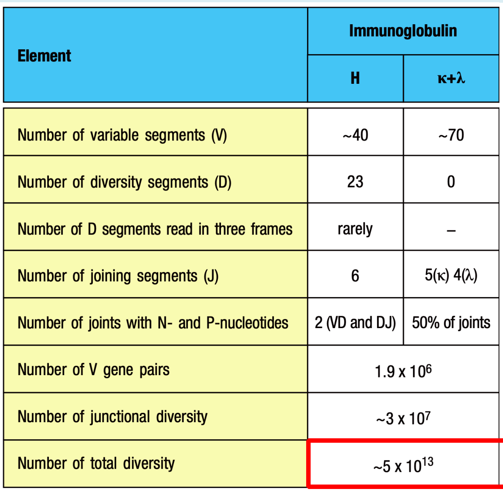

Complementarity determining regions (CDRs) of BCR
- 轻链和重链各有三个CDR
- CDR的变异度最高，序列上不连续但是空间上是连续的
- 轻链上的CDR1和CDR2是V区自己编码的，VJ结合和J区编码CDR3，重链轻链都差不多
- 但是对于CDR1，CDR2和CDR3都不稳定，而且这三个点都是要直接结合抗原的，不像是Tcell的CDR3是结合抗原的

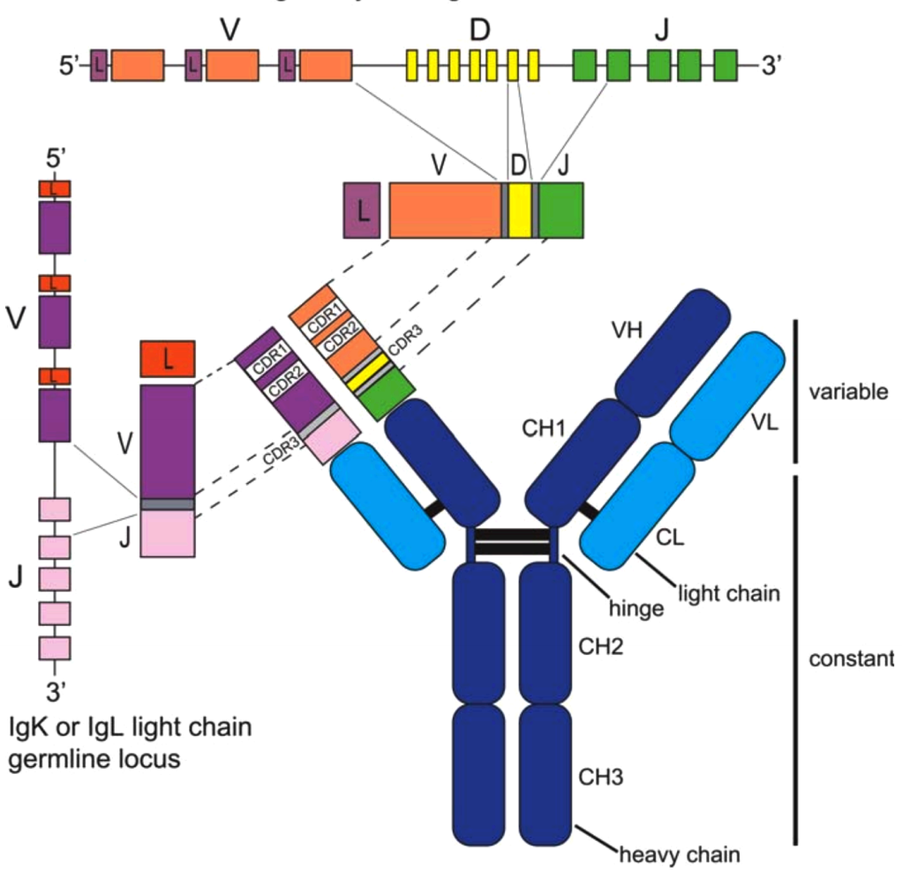

BCR diversity in certain species primarily relies on gene conversion but not V(D)J recombination
- VDJ重排严格局限于哺乳动物，比如说鸡中就没有重排
- 但是鸡中有gene conversion，就是前面的pseudogene出现一些随机的断裂重排，一个一个的片段插入正确的VD中

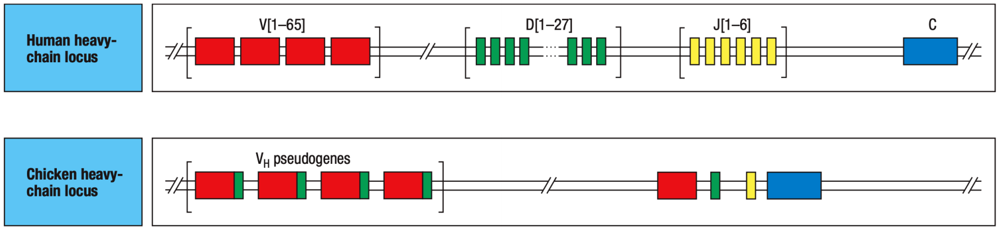

Different isotypes of BCR
- BCR constant region是可变的
- 第一个读出来的是IgM，后面就是IgG....
- 正常VDJ重排完之后马上能读出来的constant region是IgM和IgD

IgM and IgD are expressed as cell surface-attached BCR
- IgM和IgG都有跨膜能力，产生的BCR都是锚定到细胞上
- IgM位点本身具有特殊性，序列中含有两个polyA site，PAm就是可以被锚定的，但如果PAs就是可以分泌的，对应的抗原特异性一模一样
- BCR本身特异性&抗体本身特异性，就是这个constant region的多样性与抗原结合特异性没有任何关系

### B-cell development

在骨髓中发育，pro B-cell还会留在骨髓中
顺序为：

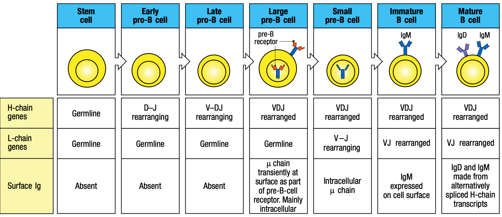

- 先重排重链（DJ->VD），读通之后开始重排轻链（VJ），读通之后重组成一个lgM，然后触发细胞产生alternative splicing然后产生其他Ig，只有IgD和IgM完全发育结束，才是一个完整的B cell
- 重链读不通怎么办法？
  - 如果完全不行就直接死掉
  - DJ重排无法判断是否读通，VDJ读通结束之后会产生一条LgM的重链，但此时轻链还没有重排，这时候会有一个蛋白当作**假的轻链**连到重链上，目的是形成完整组装的BCR，然后呈递到细胞膜上面从而告诉细胞重链已经组装完成，向胞内传递信号然后开始重排轻链，此时那个蛋白的表达会停止，替换为真正的轻链
  
  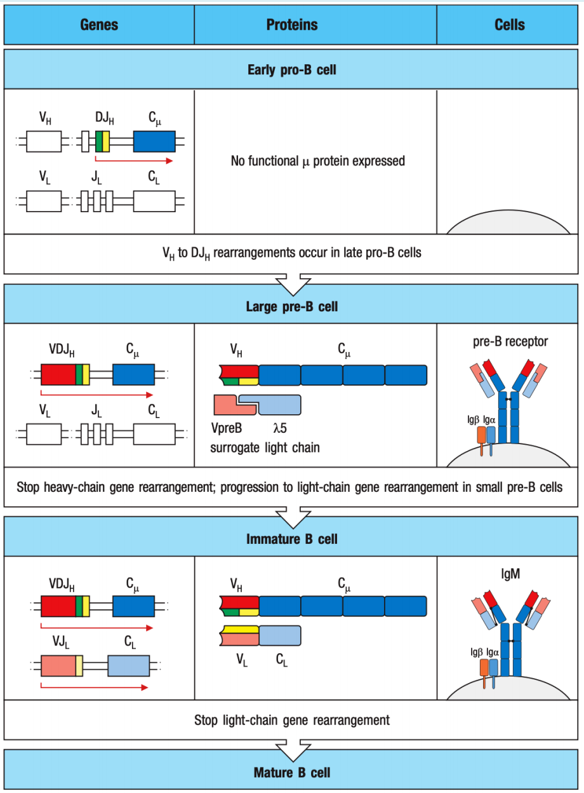

- 为什么一定在表面呈递？
  - positive selection：选择VDJ重排重链和轻链都成功的情况
    - 在细胞膜表面呈递触发的信号包括：1.重链成功应该活下去，2.改进行轻链重排了
    - 轻链重排结束后有同样的信号分子，也是告诉细胞活下去开始之后的steps
  - negative selection：为了选择掉能够与自身抗原产生反应的细胞
    - 非常粗糙
    - IgM如果没有任何反应，产生IgM和IgD双群体，然后migrates to periphery
    - 如果能识别骨髓中任何的多价表位，认为是自免疫B cell，死或者进入另外的通路
      - receptor editing：再次启动VJ重排重排轻链，看看能否变成没有自我免疫反应的，如果再不行就是杀死
    - 如果出现soluble self molecule，很难判断属于自我还是非我，如果这个蛋白能够让BCR cross link，被认为是自我的表位，从而B cell进行到休眠状态
    - 如果low-affinity non-cross-linking self molecule，B cell不会做出任何反应，产生了自免疫性疾病的隐患
    - peripheral tolerance：不在骨髓和胸腺中完成的负选择
      - 发生multivalent self melecule的时候B cell直接杀死
      - soluble self molecule：B cell也被直接杀死
      - 如果low-affinity non-cross-linking self molecule，B cell依然不会做出任何反应
  
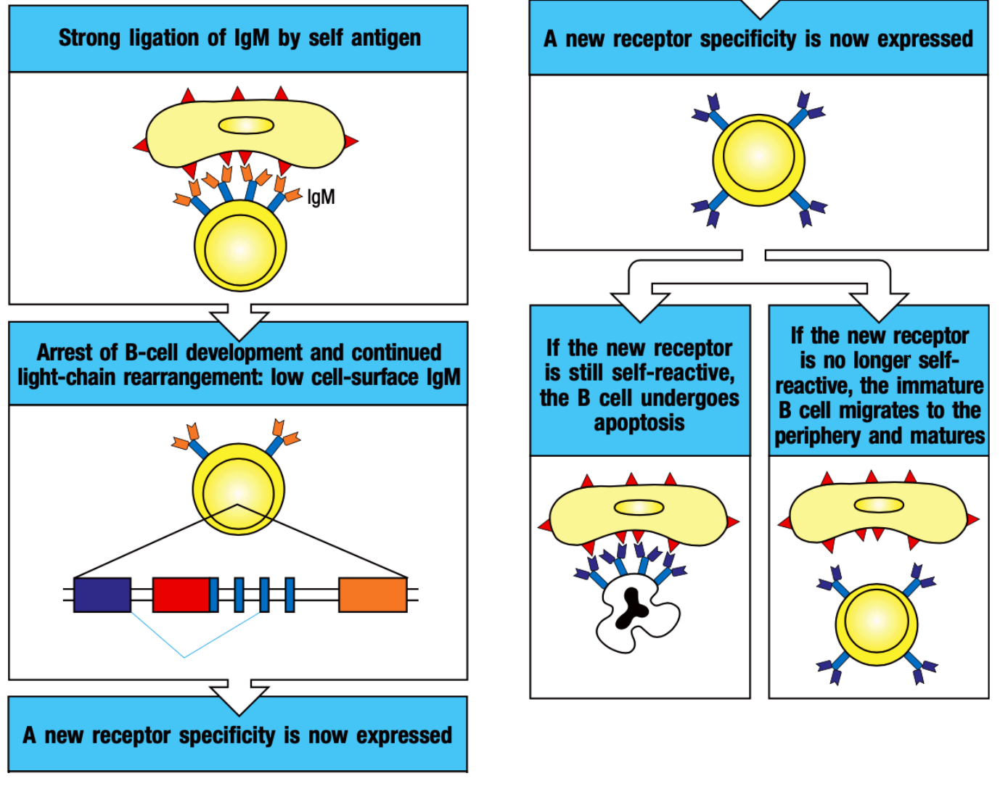

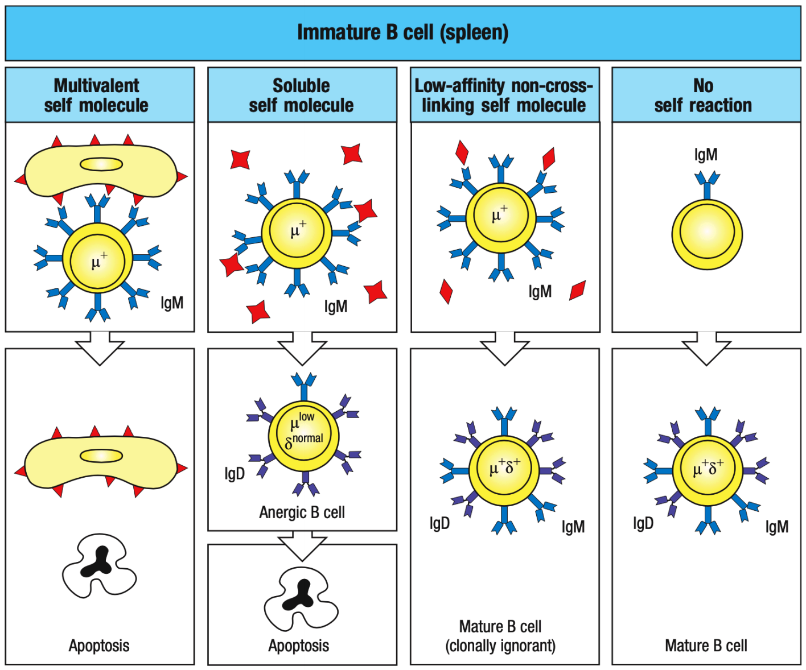

### B-cell activation

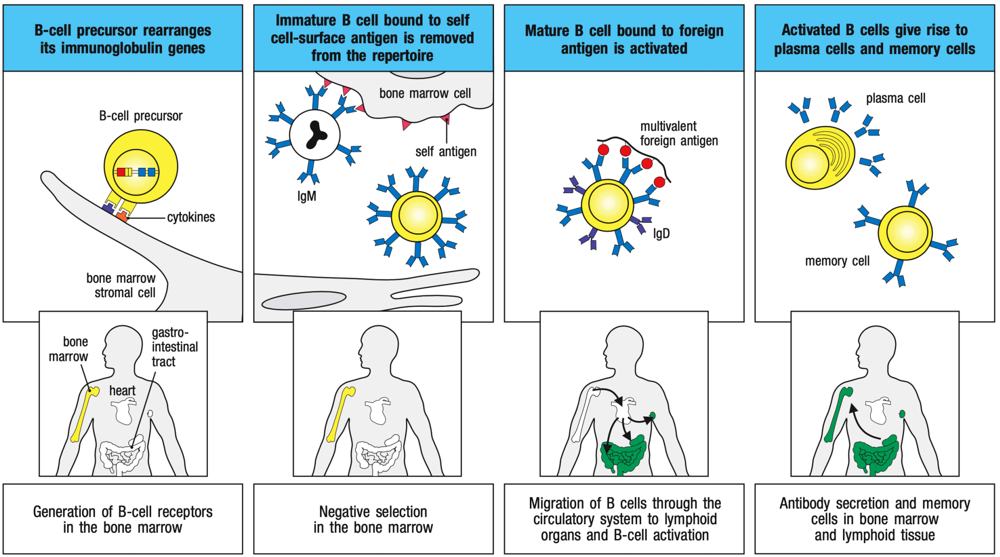

B-cell activation often depends on CD4+ T cells: Thymus-dependent antigens（TD抗原）

- 绝大部分的B cell被激活是完全依赖于T cell的：B cell 存在signal1（有病原）和signal2（是非我），T cell代替了树突状细胞传达signal2（在t cell中依赖树突状细胞的共刺激信号）
- 锚定在细胞膜上的BCR直接和抗原接触，然后内吞进细胞，B cell中同样通过MHC2又呈递到了细胞表面，如果TCR和MHCII接触，然后还有一些共刺激信号（看图），会在胞内产生signal2
- 时间顺序： T cell首先被激活，然后B cell才能够被激活

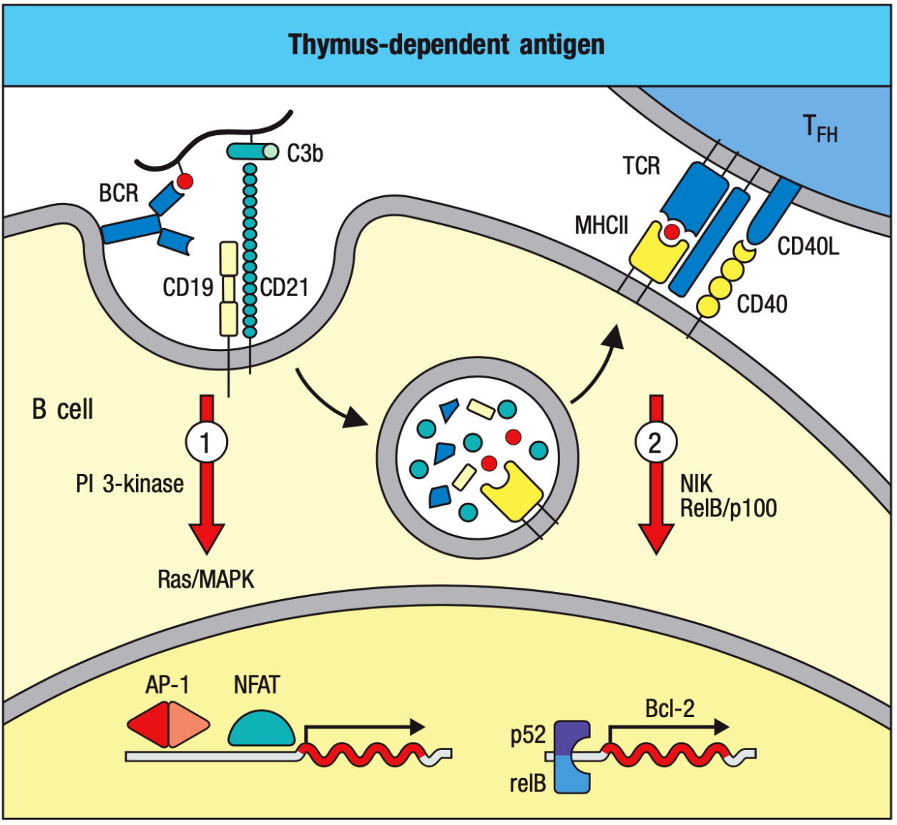

B-cell activation often depends on CD4+ T cells: Linked recognition

- 如果一个病毒有包被的话，有可能BCR识别的病毒包被上的表位和MHCII呈递的内容蛋白可能完全脱节，而且对于T cell获得的共刺激信号其实也是蓝色包被蛋白，抗原表位不对应，丧失了T cell提供signal2的意义

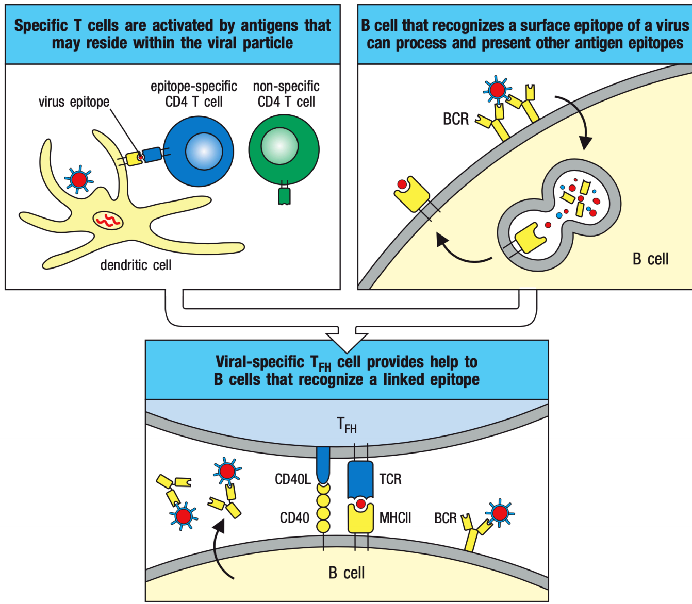

Thymus-independent-1(TI-1) and TI-2 antigens(10%-20%)
- TI-1: B cell自己表达了模式识别受体（比如说表达TLR来识别LPS），从而自己提供signal2
  - TI-1 antigens can trigger nonspecific or antigen-specific B-cell activation
  - 在此情况下会产生多克隆激活
- TI-2: signal1和signal2合二为一，也就是BCR同时也是模式识别受体


- TI-1 anitgen十分依赖于浓度，如果抗原浓度比较高，就会产生**polyclonal** antibody，但如果浓度比较低的话就会产生monoclonal antibody因为存在竞争


- TI-2不会产生class switch而是直接产生IgM

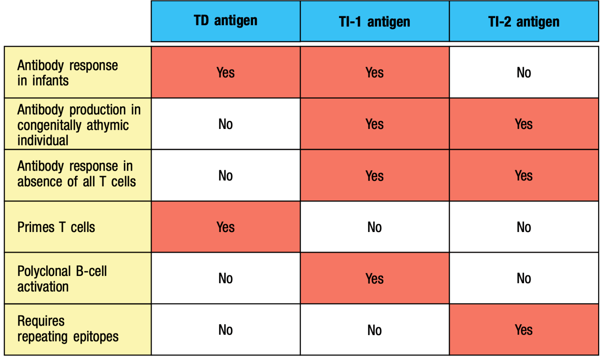

B-cell activation mainly occurs in secondary lymphoid organs
淋巴结结构：两套完全独立的循环系统——淋巴循环&血液循环
- T cell 和 B cell会通过血液循环进入淋巴结，形成两个area
- 树突状细胞，抗原呈递细胞会从淋巴循环进入淋巴结与TB cells进行反应，产生获得性免疫反应
- B cell过程：B cell先进入HEV区（血液循环与淋巴结之间的特殊结构）
  1. primary focus: T cell和B cell的area交点区域，发生反应为B cells 捕获抗原之后被第一次激活，一部分B cell可以发生功能，而相当一部分则是迁移到B cell区进行进一步激活
  2. germinal center
  
  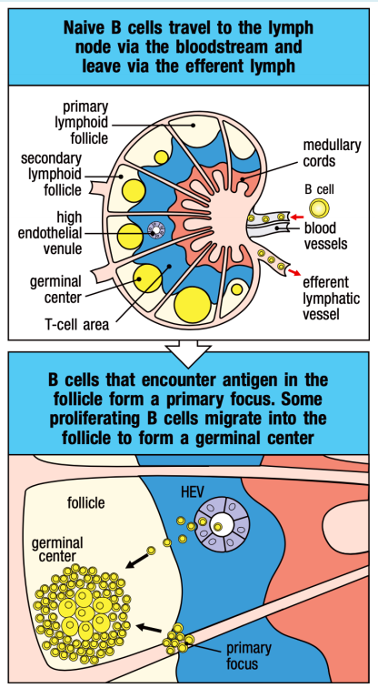

- 树突状细胞带着呈递的抗原进入T细胞区激活T细胞，T细胞会在TBcell的交界处碰到B cell，从而来第一次激活Bcell ，进一步大量B细胞会在Bcell区内产生生发中心，完成进一步的改变，包括一些随机的突变，进一步还会进行一些class switch，选择不同种类的重链 
- FDC: 有免疫学功能但是完全不起源于造血干细胞的细胞

  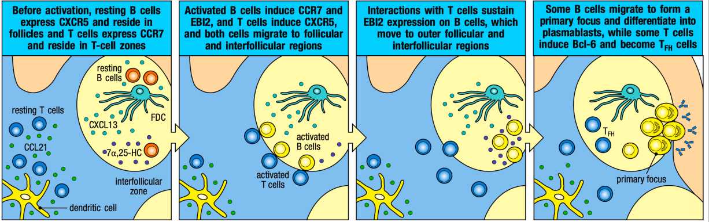

Somatic hypermutation of BCR
- hypermutation：在B细胞中的突变率比正常DNA复制的突变率高了几个数量级
- somatic: 这个突变不是生殖遗传的，而是只能发生在B cell里面
- 超突变所出现区域只出现在Fab与抗原所联系的区域，不会在重链上发生，另外针对的对象是已经完成VDJ重排的B cell，和VDJ重排也没有任何关系 
- 明显聚集在CDR区域，随着突变的增加，affinity在增加，进化与筛选，蛋是为什么有基因组的选择性至今无法回答
- 体细胞的超突变是由AID介导的（只在Bcell中出现），激活induced胞嘧啶脱氨酶（C->U）机体判断为DNA损伤，因此切掉并且产生DNA repair，而这个过程是会引入突变的，AID只在b cell receptor基因脱氨基（）
  
  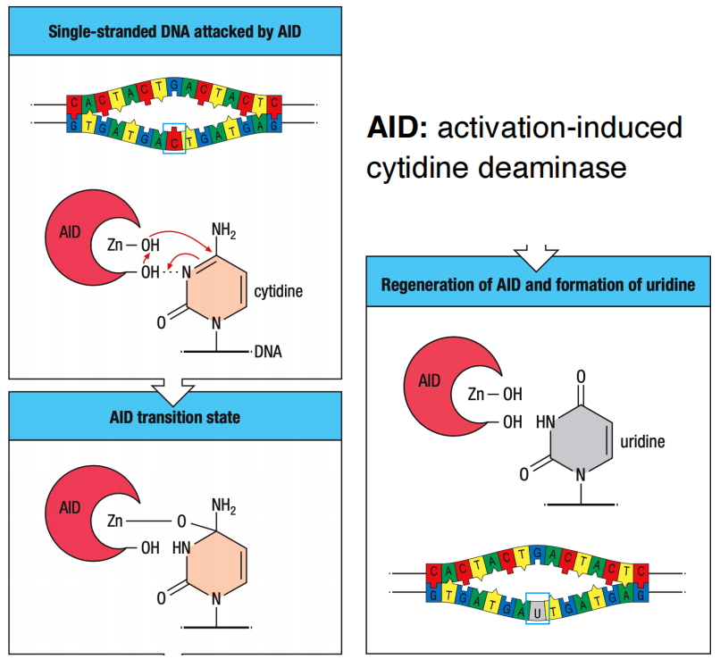

- 在somatic hypermutation之后会进行筛选，在germinal centers进行不断的筛选
  - dark zone: 细胞非常密集，有大量细胞增殖，不停的分裂并且引入突变，迁移到⬇️
  - light zone：细胞稍微稀疏，以FDC（follicular dendritic cells）为主，也是进行抗原选择
  - mantal zone：依然存在少量T cell，在与T cell的过程中再次完成抗原选择

Follicular dendritic cells provide antigens for affinity maturation in germinal centers
- 像是一个抗原富集的细胞
> 实验：人为向小鼠中注射一个同位素标记的蛋白，发现放射性聚集在唯一的一个细胞上，就是FDC

- 小小念珠状态，形成了抗原富集聚集物
- 通过细胞表面一些特殊的受体，没有MHC，抗原是完整呈递的
- 在light zone中，不同mutation进行竞争，看谁能够从FDC上拉一个抗原下来
- 拉一个后就可以内吞然后进行MHC呈递，从而有了T cell的第二次激活和支持，否则就无法被支持 

  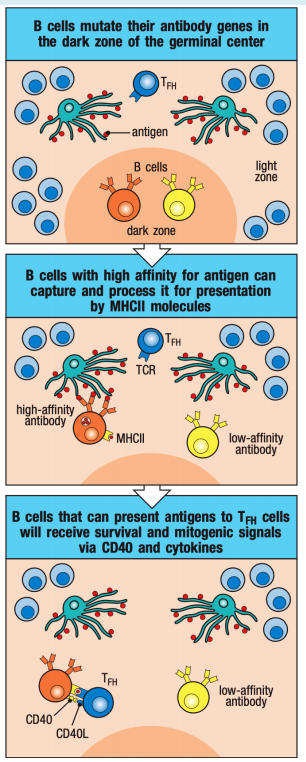

> 在 germinal center 中，B cell 先在暗区快速增殖并发生 somatic hypermutation，再到明区通过 FDC 上的抗原和 Tfh cell 的帮助被选择，亲和力高的 B cell 可以继续循环或分化为浆细胞/记忆 B cell。
> 
> T cell 主要是 Tfh cell：它由 naive CD4⁺ T cell 分化而来，进入生发中心后通过 CD40L、IL-21、IL-4 等信号帮助并筛选 B cell，从而促进抗体亲和力成熟和 B cell 分化。

Class switch of BCR
- 由一些特殊的细胞因子决定的
- 基因组本身结构发生了变化
  - VDJ重排完了会进行IgD和IgM，但是二者的功能是有限的
- IL-4 二型细胞因子，真菌和寄生虫，IgG1和IgE的促进
- IFN-gama 病毒，IgG3和IgG2a的中和效应
- 感染类型决定的重链

  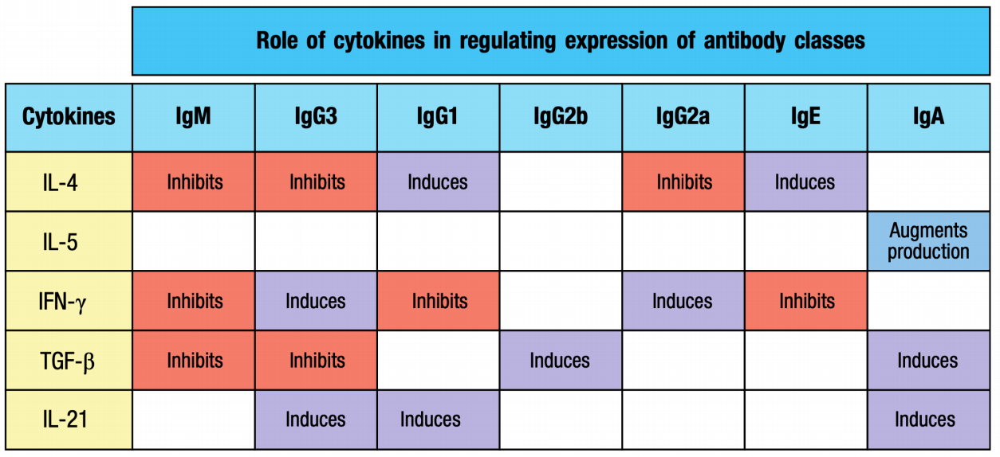

- 基因组水平产生了重排，并且不是VDJ重排，不是alternative splicing（IgM还是IgG是由这个决定的
- 细胞因子介入下可以直接删除掉不需要的序列

  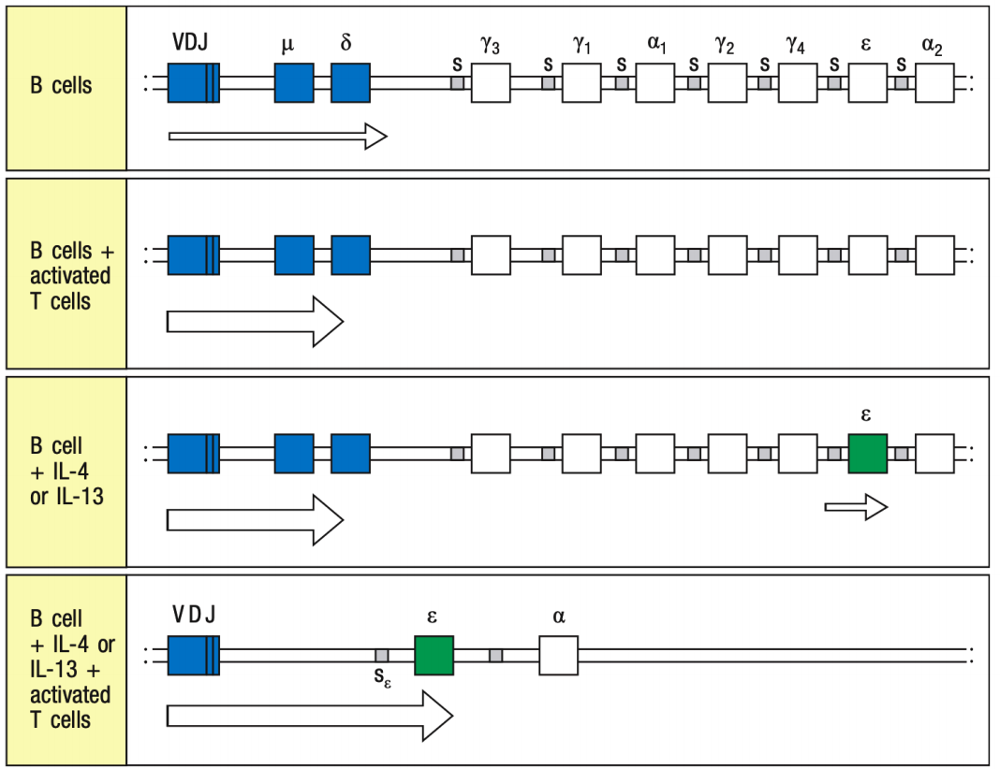

- 机制：在细胞因子作用下对应的switch region出现了结构变化，进一步IgG和IgM的switch region也会出现变化双链结构打开，AID会在数以百计的重复序列中把C变成U，切碎之后就直接断开了，剩下的地方通过DNA损伤修复重新连在一起，使得VDJ直接连在了其他重链的地方

  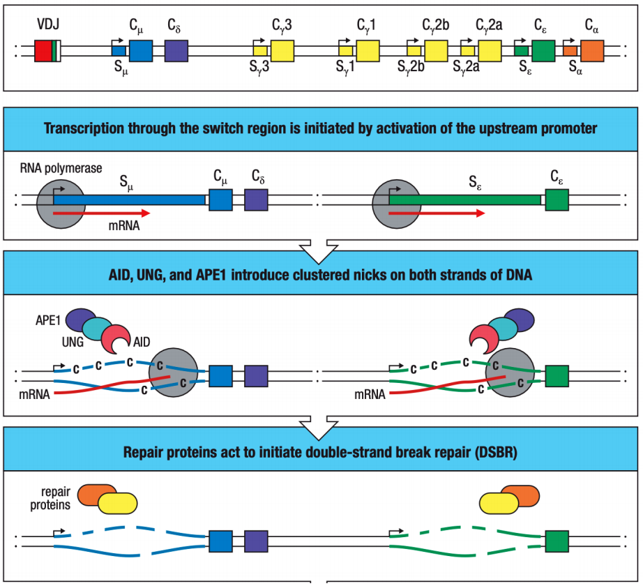

  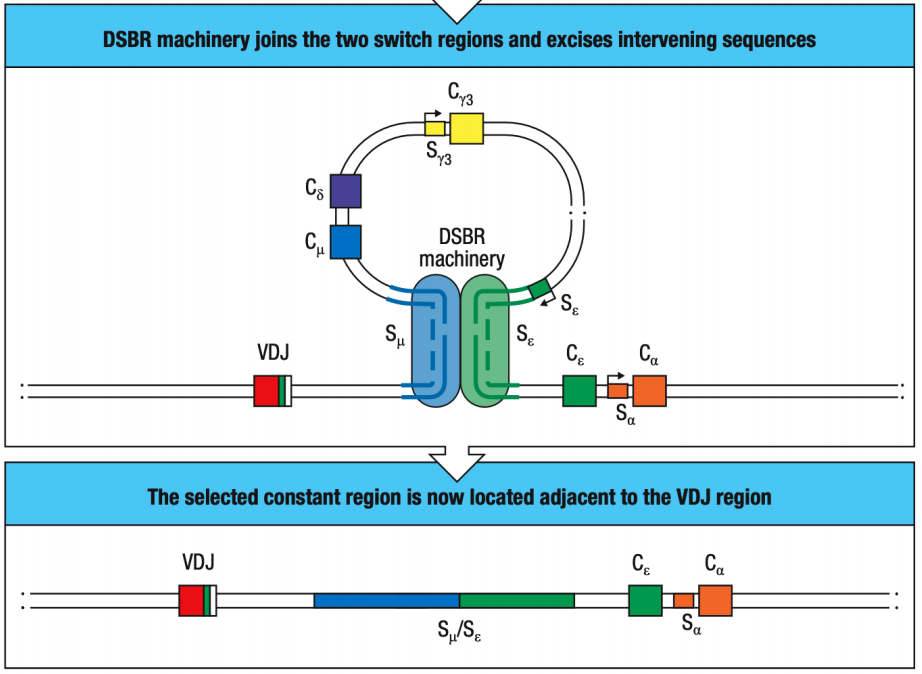

- summary：值得注意的是就是从surface上的IgG更多改成了secretion
  
  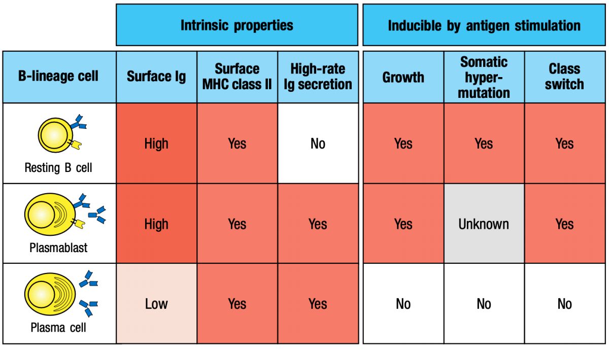

### BCR/antibody functions

Different properties and functions of BCR isotypes

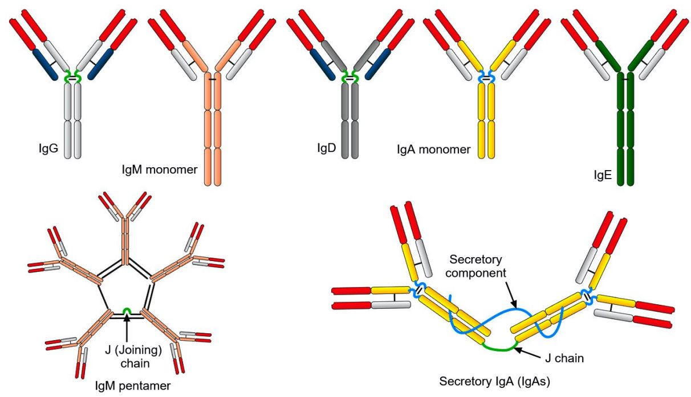

- IgM要么就是单体然后锚定在细胞膜上，要么就是五聚体分泌（J chain）
- IgA也一样

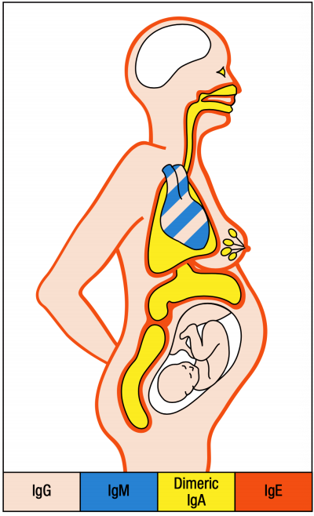

- 母胎屏障和血脑屏障
- IgA黏膜（乳腺）、IgM心脏、IgE拓扑学角度分布在与外界相连的地方
- 不同功能还有不同亚型，他们的大小->扩散能力，血浆浓度、半衰期-> 功能和分布

- 生物学过程完全不同
  - 中和病毒和中和有毒物质，敏化反应，有一些有但有一些完全没有
  - 激发NK细胞，从而算是有一定的抗原特异性（间接的）
  - IgA黏膜免疫，必须从机体内进入机体外，跨粘膜分泌
  
  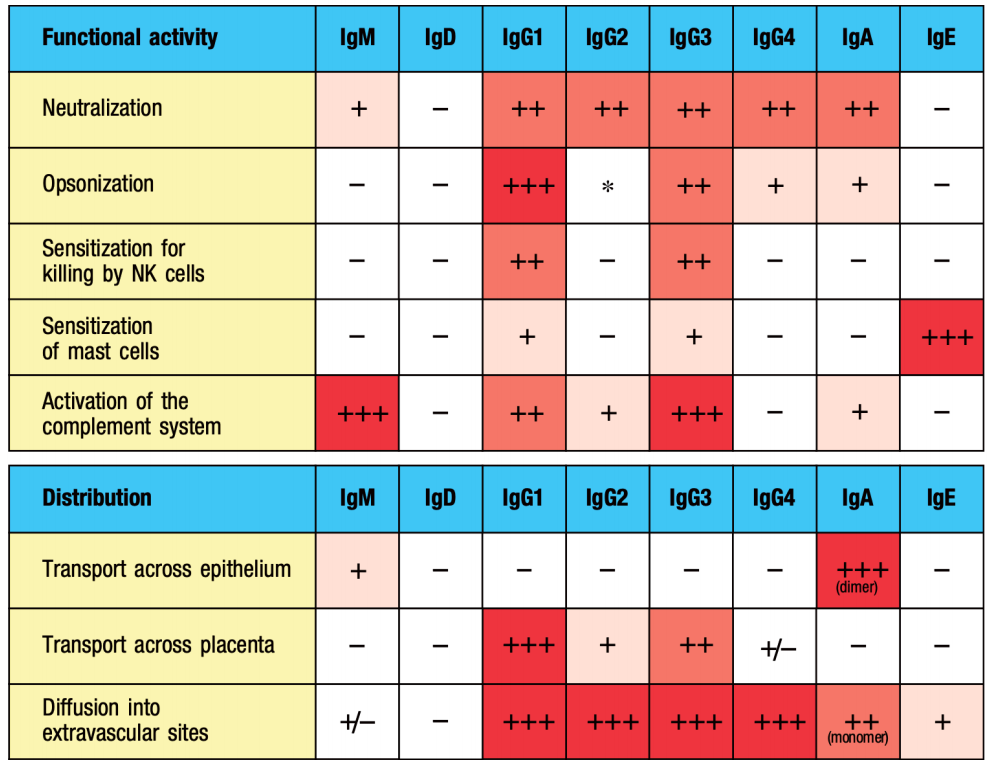

Properties and functions of different Fc receptors
- 重链部分也有特异性的受体
- Fc受体并不保守，与不同抗体的affinity完全不同，表达这个receptor的细胞截然不同，从而生物学功能完全不同

(I) Neutralization:
- Antibodies block toxins from entering cells（蓖麻毒素）
  阻断与细胞受体的结合（大部分为蛋白毒素）

  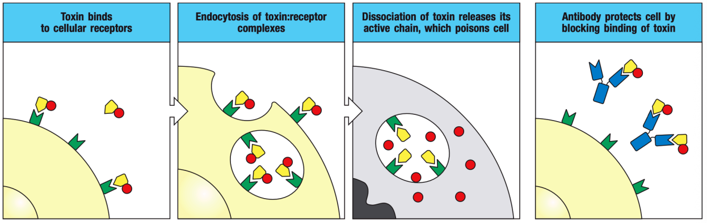

- Antibodies block viral infection
  介导与细胞产生相互作用或者进行内吞的蛋白进行中和

  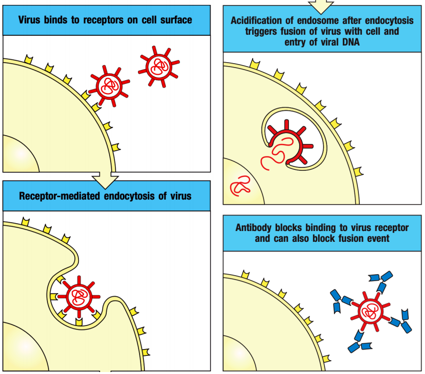

- Antibodies block bacterial infection
  和病毒类似

  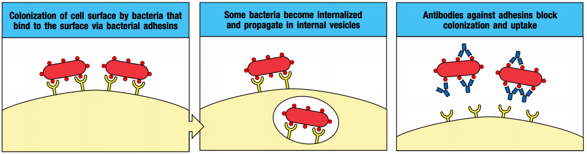

- 没有发现真菌的和寄生虫的

(II) Complement activation:
- Antibodies trigger classical pathway

  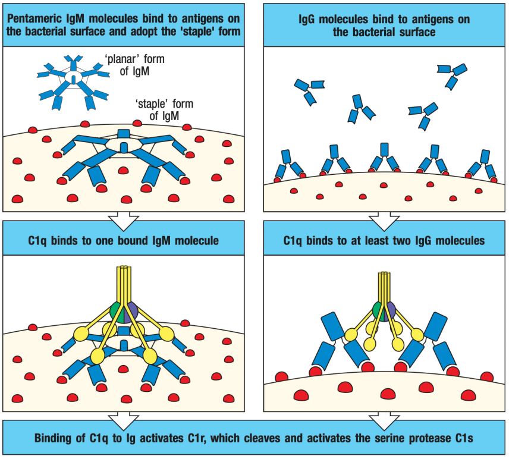

(III) Opsonization(敏化效应): 使得病原体更容易被其他杀死
- Antibodies facilitate phagocytosis of bacteria
  抗体和细菌表面结合，然后通过结合到抗体的重链更容易进行一个内吞
- Antibodies facilitate phagocytosis of bacteria
  对于有被膜的细菌也有关系，对被膜上的抗体可以介导吞噬

(IV) Antibody-dependent cellular cytotoxicity
- 一个肿瘤细胞会表达不正常的蛋白，然后会激活一些抗体识别这个细胞，然后可以激活NK cell上的一些Fc receptor，激活这个NK cell的杀伤特异性

Memory of B cell responses

- 进行抗体类型测试：
  - IgM应该首先上升
  - 经过一些变化后IgG后来会赶上
  - 第二次感染后IgM不会增高了，IgG会增高
- 不仅能记住抗原种类（IgG浓度），而且能提高非常强的affinity
  - 第二次刺激可以有更多
  IgG
  - 可以再次发生somatic hypermutation
  
  

Established memory dominates latter responses: "Original antigenic sin"

  

  - 病毒出现变种之后其实之前的免疫就没有意义了，会无视后面的抗原的变异
  - 所以只有第一次接触的变异类型会伴随人类的一生

# Tissue immunity（以黏膜组织为例）

天然免疫和获得性免疫连接问题——树突状细胞


树突状细胞的特殊性：
1. 同时起源于髓系和淋系
2. 连接天然免疫和获得性免疫：在天然免疫中感知病原相关分子模式，从而获取到共刺激信号，同时捕获抗原完成抗原呈递功能
  
### Mucosal immunity

##### Anatomy

黏膜组织种类：呼吸道、消化道、眼睛、乳腺、泌尿道

Mucosa-associated lymphoid tissues (MALT)：黏膜相关淋巴器官
- 全部是次级淋巴器官
- NALT: nasal-associated lymphoid tissues
- BALT: bronchus-associated lymphoid tissues
- GALT: gut-associated lymphoid tissues


Nasal-associated lymphoid tissues (NALT)
- Waldeyer's ring(⽡尔代尔淋巴环): 当口腔完全张开时，口腔中的所有淋巴器官基本形成一个完整的环
  - Palatine tonsil: 腭扁桃体
  - Lingual tonsil: ⾆扁桃体
  - Adenoid: 增殖腺
  - 目的：对于食物和呼吸的摄入可以第一时间进行监测
  - 在解剖学上不依赖于显微镜就可以被看到

  

Bronchus-associated lymphoid tissues (BALT)
- 尺寸非常小，不借助显微镜很难看到，但是每个点都是非常完整的淋巴器官

Gut-associated lymphoid tissues (GALT)

  

- 小肠绒毛中本身具有淋巴器官，小肠绒毛中如果存在抗原，会通过淋巴引流的方式一直从小肠绒毛向下引流直到肠系膜淋巴结（Mesenteric lymph node），这个过程是单向的
  - 有比较特殊的抗原捕获方式，需要经典的树突状细胞
  - IgA可以在肠道上皮细胞处完成跨细胞转运，在从体外到体内的过程中很有可能会捕获抗原然后交给树突状细胞，再引流
  - 肠道出现损伤/感染，直接被树突状细胞捕获

  

- payer's patch派尔集合淋巴结，直接嵌入小肠绒毛，其中有非常明确的Tcell区、Bcell区和 germinal centre，然后也可以引流到肠系膜淋巴结
  
  

  - 有明显分区而且所有树突状细胞都在Tcell区
  - M cell: 在显微镜下观察冲向食物的一侧皱皱巴巴，作为上皮细胞但可以捕获抗原，树突状细胞不作为捕获抗原+迁移的工作，只用守株待兔
  - Transcytosis of antigens by microfold (M) cells in Peyer's patches, M cell像是一个门，从一侧打开然后将抗原送到另一侧去
  
    

- 肠道中树突状细胞的奇怪功能：
  - CD103 dendrite cell：通过CX3CR1（阳性吞噬细胞，阻滞驻留吞噬细胞，起源非常特殊），伸小管抓抗原，然后送给树突状干细胞
  - 杯状细胞不光可以分泌黏膜，跨细胞转运抗原
  - 树突状细胞可以迁移，捕获抗原后再转运回来

    

Innate immune respones trigger protective adaptive immunity

    

后续工作：以细菌为例

    

##### antigen presentation/T-cell and B-cell responses

- payer's patch局部就可以进行TB细胞激活，其他地方则是引流到肠系膜淋巴结发挥对应功能

Activated T and B cells are re-distributed to the lamina propria and epithelium
- 必须先到thoracic，然后进入血液循环才能到该地方
- 回到肠道这部分的TBcell功能与一般情况下类似

    

产生了一种特殊的T cell: Intraepithelial lymphocytes (IELs)上皮内淋巴细胞
- 精准嵌入上皮细胞间隙
- 存在的意义是第一次发现被病原体侵入的上皮细胞
- CD8

    

IELs can exert cytotoxicity via MHC-I/TCR-dependent or -independent pathways
- 在标准T cell中，CD8为二聚体分为alpha和beta异源二聚体

    

- 有时会出现alpha-alpha同源二聚体，这个时候完全获得了NK细胞的功能，完全不需要T cell receptor的方式进行杀伤（激活抗体/抑制抗体）

    

IgA is the predominant immunoglobulin in mucosal immunity
- IgA有单体结构和双体结构，双体是由J chain和secretory component实现
  
    

- 能特异性产生IgA的浆细胞回到肠道以后，会特异性产生二聚体IgA，一开始只有J chain，然后结合肠道上皮细胞的膜蛋白plgR，会带着IgA进行跨细胞转运，最后一步这个plgR蛋白被切断了，留下来的一段就是secretory protein

   

IgA has multiple functions in the gut
- 先发制人的把可能的有害物质运输走
- 把上皮细胞囊泡中的有害物质转运走
- 将已经在体内的毒素转运走
- 潜在的辅助了抗原在机体外的捕获，带进来给树突状细胞

summary

   

##### Immune tolerance 对于外源病原体无视

在人体中有很多的共生菌，那么我们的黏膜如何进行immune tolerance呢

这些最终产生的是调节性T cell（Treg），而调节性T cell产生两类重要的细胞因子：
- 白细胞介素10：唯一一个能够抑制炎症反应的因子
- TGF-beta：对常见T cell有比较强的抑制
⬆️免疫耐受有抗原特异性

> Rag2-/- 对于TBcell重排有重要作用
>
>  
>

Immune tolerance to food-derived antigens
机制是类似的
食物是比较难触发天然免疫反应的，所以即便被捕获但是没有共刺激信号，所以就会产生耐受

   

如何解决血液循环进入身体各处的问题：
- Mucosal immunity in the gut may designate systemic immune tolerance
- 全身都会跟着血液建立耐受，因此其实全身上下的菌群也是稳定的，因为免疫耐受是同步建立的

   

SUMMARY


# Immunological disorders

### Immunodeficiency

##### Primary (or inherited) immunodeficiency

基因编码导致的免疫缺陷

- IL2RG mutation blocks T-cell development: 目前已知的能存活的最严重的免疫缺陷
  - IL2RG辅因子：介导一系列干扰素
  - 白细胞介素的受体必须要IL2RG辅因子
  - 此基因缺失会广谱的阻断信号，从而产生免疫抑制
> X-linked severe combined immunodeficiency (X-SCID)
> - 相当一部分免疫相关基因都在X染色体上，男性也更容易得病
> - 核心表征：从出生开始就会感染非常罕见的免疫疾病（比如说真菌感染）
> - 血浆中完全缺失T cell，但是B cell大量存在（流式细胞分选结果），不过？

- Mutations of exocytosis affect CD8+ T cells: 识别MHC1抗原表位，胞吐穿孔素，然后分泌颗粒酶，激活apoptosis
  - 变异可能出现一系列的错误（胞吐作用中的一系列缺陷）
  
  

> Hemophagocytic lymphohistiocytosis (HLH)
> - 噬血细胞性：外周组织的巨噬细胞和嗜酸性粒细胞开始吞噬血细胞（失去判断识别自我和非我的能力）
> - 外周血中CD8中含量非常高
> - 淋系反而影响了髓系
> - 病毒始终潜伏在被感染细胞内，此时机体会不断出发免疫反应，比如不停产生CD8细胞，I型免疫反应，髓系的中性粒细胞和巨噬细胞也会被非常大的加强（代偿性功能），导致了很强烈的误伤
> - 完全致命，导致不可逆转的贫血

- BTK mutation interrupts B-cell development
> X-linked agammaglobulinemia (XLA)
> - 假的BCR会触发一种BTK的激酶，这种激酶是用来向胞内传播信号触发轻链重排
> - BTK缺陷会无法合成正常的BCell（无法正常成熟）
> - 丙种球蛋白=血浆中的抗体
> - 流式细胞分选：血液中完全没有CD19阳性Bcell，但是有Tcell

- CD40L mutation prevents B-cell maturation
  - Bcell吞噬抗原后呈递让Tcell产生signal2
  - 而CD40L是Tcell上提供signal2的重要东西
> X-linked hyper-IgM syndrome
> - 在病人的血液中只能测到IgM
> - 没有共刺激信号，无法完成class switch，所以只能表达IgM，也无法完成之后的作用
> - 无法找到生发中心

SCID: 重度联合免疫缺陷
- 由于B cell后续功能完全依赖于Tcell
- 所以Tcell的mutation最容易导致SCID

##### secondary (or acquired) immunodeficiency

HIV，放疗、化疗（造血干细胞产生的免疫细胞仍然是会在DNA复制的，所以不可避免的会杀伤）或者一些不良食物的摄入

不是由于基因决定也不会有生殖遗传

- Human immunodeficiency virus (HIV)
  - 在电镜下重染色区域
  - 膜结构，均匀排列受体gp120
  
  

  - HIV infects and destructs CD4+ T cells: 进化上非常古老，进化策略上很神奇，可以借助免疫系统进行传播
  - 吞噬病毒后开始往淋巴结转移，但是此时树突状细胞无法讲解                                                                                            
  - HIV病毒的corecepter是CCR5
  - RNA逆转录为DNA，DNA会插入基因组，与CD4细胞共存
  - 基因组中没有功能的都是逆转录病毒留下的哼痕迹
  
  

  - HIv一旦感染是不能够被清楚的，

page23page24

### Allergy

- IgE-mediated allergic reactions
  - Harmful immunologically mediated hypersensitivity reactions to harmless antigens, i.e., pollen, food, and drugs.
  - Der p1: 污尘螨的排泄物，很容易穿过呼吸道，进而触发树突状细胞激活，进而激活了IgE（黏膜中存在激活的因子）
  - 产生的大量IgE，如果再出现Der p1，会激活一种mast cell（脱颗粒效应，本身是一种自我反应），但是此时没有真正的寄生虫存在，这种强烈的免疫反应无处攻击
  - mast cell被激活后会产生一系列过敏性反应
  - 脱颗粒：在光学显微镜下有非常明显的颗粒（促炎物质），激活完了的肥大细胞在电镜下看颗粒消失了（颗粒里面的物质被释放出来）

  

  

  - 呼吸道：局部血管通透性增加（组织水肿），平滑肌增殖（呼吸道狭窄，哮喘发生）
  - 血液中：作用于血管内皮细胞，造成全身性水肿或者局部大规模水肿
  
  

  - 嗜碱性粒细胞：功能上和mast cell类似，可以通过IgE受体，过敏原出现后，进一步触发了过敏反应
    - 除了能脱颗粒促进免疫反应，同时可以表达CD40L，为Bcell提供signal2，进一步加强IgE的分泌，产生有害的正反馈，自加强过程，所以必须要介入治疗

- Early phase and late phase of allergic reactions：
  - Early phase：IgE介导的mastcell和basophil
  - late phase：可以产生更多IgE的自加强反应
  
  

> 以哮喘为例：
> - PEFR: peak expiratory flow rate, a common measurement of lung function，正常人在400L，哮喘出现后，潮气量在极限情况下可以到40L
> - 哮喘的early phase很容易死人
> - 哮喘的late phase：从分钟级到小时级，潮气量持续降低
>
> 
>
> - 机制：呼吸道上皮细胞下面的组织内产生的脱颗粒反应，黏液层增厚，整个空腔明显出现收缩（mast cell激活的平滑肌细胞）
> - 死于不可逆的呼吸衰竭

- Non-IgE-mediated allergic reactions
  - Antigen-IgG immune complex: 同样有mast cell的脱颗粒反应，IgG与mast cell表面的IgG抗体结合，血管通透性改变...介导的过敏反应很快
  
  

  - CD4+ TH1 cells: 反应时间比较慢，因为过敏反应不是简单的脱颗粒，抗原必须先被邻近组织的抗原呈递细胞消化，然后MHC2呈递，T cell分泌细胞因子，通过富集更多的免疫细胞，从而实现过敏反应
  
   

  - CD8+ T cells: 寻麻（分泌有毒物质），会出现迅速的组织溃烂，产生疱疹，烃类物质会穿过物理屏障进入到细胞层面，毁于蛋白产生不特异性的连接，获得了一个新的抗原表位，当作我们的细胞被病毒侵染，激活了抗病毒免疫反应，激活了CD8，再一次激活后就会把所有修饰了的细胞标记为病毒侵染，所有接触的细胞全部被杀死（超敏反应），同样反应速度比较慢
  
  

看似水、空气、阳光，其实是对神经递质过敏，因为这些刺激会导致局部产生神经递质（胆碱能过敏反应）

### Autoimmunity

##### Allograft rejection

Alloantigens(同种异体抗原): antigens that differ between members of the same species
- 同一物种成员之间存在差异的抗原。
- 从进化上不应该出现，因为会有Negative selection，但是因为人会进行“移植”，所以此时就会出现移植导致的排斥反应
  
Alloantigens产生最重要的来源————Major histocompatibility complex (MHC) are polygenic
- histocompatibility: 不会发生排斥反应
- 多基因本质上不会导致组织兼容与否，但是人的MHC分子在不同人之间有很强的多态性，是为了防止出现未知病毒，多态性可以保证整个种群层面能够存活
- MHCI、MHCII个体层面上总有差别（除了同卵双胞胎），交换完了之后MHCI本身可能会被当作抗原，所以产生免疫反应

  

Minor histocompatibility antigens: polymorphic cellular proteins
- 哺乳动物中除了MHC之外还有很强烈多态性的蛋白
- 这些蛋白被MHC呈递之后还是会呈递不一样的东西，会有对于抗原表位的轻微差别，然后产生比较强烈的排斥

  

  

Direct pathway of allorecognition
- 供体肾所有组织细胞内都自动带有树突状细胞，所以肾脏里面的树突状细胞会一起一直到受体中
- 带着供体本身的抗原进入受体的淋巴结，触发了受体的免疫反应
- 受体会攻击这个肾脏，肾脏会坏死

  

Indirect pathway of allorecognition
- 切除肾的时候难免会有组织损伤
- 就是供体肾会带一些坏的细胞，然后被受体的树突状细胞吞掉，但这个时候MHC分子本身是不match的，会被降解掉然后被受体的树突状细胞呈递，激发受体的免疫反应

  

以上讲到的绝大部分都是T cell介导的

Negative selection of BCR and alloantibodies

Alloantibodies(同种异体抗体): antibodies against nonself antigens of the same species
- 由于同一个物种两个个体对于同一个蛋白识别的抗体的抗原表位有所差别

Pre-existing alloantibodies against blood group antigens cause hyperacute rejection
- 经过血液循环引发的免疫反应，超快排斥反应。
- 机体与生俱来有对于血液不同血型的alloantibodies
- 移植来的肾脏里有血液也有血细胞，同时会产生迅速的对于血型的抗体，直接识别，然后产生凝血反应，然后24-48小时就产生排斥了

  

Alloantibodies contribute to chronic rejection
- MHC: 两个星期
- Minor: 几十天
- 即使供体和受体之间的 MHC 以及 ABO 血型完全匹配，仍然可能存在 minor histocompatibility antigens（次要组织相容性抗原） 的差异，例如某些细胞表面蛋白的氨基酸序列不同，或蛋白翻译后修饰存在差异。受体免疫系统会逐渐识别这些微小差异，并诱导产生针对供体抗原的 alloantibodies（同种异体抗体）。这些抗体持续结合于移植物血管内皮细胞表面的供体抗原，激活补体系统并介导抗体依赖性细胞毒作用（ADCC），从而导致血管壁及其周围组织长期处于慢性炎症状态。随着时间推移，炎症反应会促进血管内膜增生、纤维化和血管狭窄，最终造成移植物功能逐渐下降，形成 chronic rejection（慢性排斥反应），然后血管周围就会持续出现炎症反应，最后供氧不足，逐渐死亡，几个月记

Immunosuppressive drugs prevent graft rejection
- 通过药理学手段阻碍免疫排斥
- 抗 CD3 抗体通过阻断 TCR 信号或耗竭活化 T 细胞，直接抑制 T 细胞介导的移植排斥反应，从而提高移植成功率。（signal1）
- 对共刺激信号进行阻断（signal2）
- 阻断signal3，各种各样细胞因子、
- 阻断signal下游的一些细胞机制，阻断Tcell的激活（环磷酰胺）

  

Graft-versus-host disease
- 供体杀死受体
- 全部出现在造血系统中
- 核心原因是移植进来的造血干细胞不是纯净的（技术做不到），使得造血干细胞中会混入一些其他细胞比如淋系的细胞，比如供体的T cell
- 这些T cell本身会认为周围全都是病原体，然后迅速被激活，迅速大量增殖CD8，无差别进入到各个组织细胞中，然后产生这种disease
> 全身表皮的剥落

Fetomaternal tolerance: The fetus is an immunologically tolerated allograft
- 母胎屏障
- 事实上胚胎细胞会大量进入母体，1-10/10000
- 除此之外还有角膜移植，因为角膜上具有免疫豁免机制，使得也不需要进行配型

#####  Autoimmune diseases

Immunologically privileged sites: foreign tissue grafts do not elicit immune responses (i.e., rejection)

存在免疫豁免的四个位置
（page24）
- 眼前房
- 中枢神经系统
- 胚胎
- 男性的睾丸

物理性的损伤会破坏眼前房的免疫豁免，原本与免疫系统隔离的眼内抗原暴露出来，同时炎症细胞和免疫分子大量进入眼内。这不仅会削弱局部的免疫抑制环境，还会激活针对眼内抗原的免疫应答，从而打破免疫豁免状态，引发持续的炎症反应，严重时甚至可导致对自身眼组织的免疫攻击。

单侧眼睛抗原表位暴露出来之后会有extension直到两个眼睛都被攻击，产生自免疫疾病

Autoimmune response can amplify autoimmunity
- 正循环过程，无法被有效控制，然后暴露出新的抗原表位，进而反复迭代

  

- 组织内有Tcell筛选过程和一些免疫豁免，但是在损伤等其他原因下这些保护和筛选机制失效，产生了这种自加强过程，就是自免疫疾病

Autoimmunity can be primarily mediated by T cells
- T cell侵入到了免疫豁免位置
> Experimental autoimmune encephalomyelitis: ⾃⾝免疫性脑脊髓炎
> - T cell进入中枢神经位置
> - 外周产生针对抗原的免疫反应 + 破坏了中枢系统的免疫屏障
> - 促炎细胞因子，T cells 释放促炎细胞因子，招募巨噬细胞、单核细胞等炎症细胞进入 CNS
> - 可以通过 adoptive transfer（过继转移） 的方式诱导：将已经被髓鞘抗原激活的自身反应性 T cells 转移到健康动物体内，使其发生 CNS 炎症

Autoimmunity can be primarily mediated by B cells（95%左右的自免疫疾病）
> - 空肠杆菌的糖基化修饰和髓鞘上的糖基化修饰一模一样，所以机体正常的对于外来的抗体也是针对外周神经系统的
> Guillain-Barré syndrome吉兰-巴雷综合症

Autoimmunity can involve both T and B cells
> Myasthenia gravis 重症肌⽆⼒症
> - 产生了针对肌肉上乙酰胆碱受体的T cell和B cell
> - 通过流式分选找到Tcell Bcell，T cell可以直接识别骨骼肌上的乙酸胆碱受体（破坏肌肉细胞），也存在针对乙酰胆碱的抗体（阻断信号传播）

Epitope spreading in autoimmunity: Linked recognition
- Tcell的抗原捕获和抗原呈递会脱节，因为捕获捕获的是多种抗原
- B cell一开始识别的抗原表位是核小体H1，然后吞到细胞里面去（细胞死掉的信号），进一步通过MHCII呈递出H1的表位，T cell通过识别这个抗原表位激活了B cell
- 但是如果存在link recognition，如果B cell结合的是DNA，然后连着H1直接吞噬进去了，MHCII呈递的同样是H1表位，那么Tcell还是能够激活，只是激活以后这个就变成针对自身DNA的抗体了
- 同理有核糖体和mRNA

  

Examples of autoimmune diseases:
1) Type I diabetes: 原因是由于未知原因，可能产生非常强烈的针对胰岛素的抗体，CD8细胞会把beta细胞当作被病毒侵染的cell，从而beta细胞死掉，没有胰岛素分泌了
  - 免疫耐受普遍存在于机体的各个位置，在特殊的外界环境出发下会触发
  - 如果机体稳定产生了一种病毒蛋白，他是会有免疫耐受的
  - 但是这种免疫耐受不等于免疫豁免
> 研究者首先构建了一个 LCMV 核蛋白（NP）基因与胰岛素启动子融合的杂交基因，仅在小鼠胰腺 β 细胞中表达 NP，从而生成转基因小鼠。单独在 β 细胞中表达 NP 时，并未引发自身反应性 T 细胞活化，说明这些 T 细胞在正常情况下对 β 细胞保持耐受。随后，将转基因小鼠感染 LCMV 病毒，外周免疫系统产生 NP‑特异性 CD8⁺ T 细胞，并被激活。这些活化的 T 细胞穿越血管壁迁移至胰岛，识别并杀伤表达 NP 的 β 细胞，引发 β 细胞破坏和胰岛功能丧失，最终导致糖尿病发生。
> 该实验严格证明了：外周免疫激活可打破组织特异性耐受，使自身反应性 T 细胞攻击原本耐受的自体组织，从而诱发自体免疫性疾病，为理解 T 细胞介导的自体免疫机制提供了直接实验依据。
>
>   
>

2) Rheumatoid arthritis: 机体内首先产生了对于软骨组织的破坏，触发自身抗原的释放激活T cell，后续激活B cell，然后进一步对软骨损伤
  - 硫酸软骨素：最经典的抗原表位

3) Psoriasis: 针对自身RNA、DNA产生的疫病，暴露出的自我的核酸（signal1和signal2），激活了天然免疫反应，然后TBcell反应，然后抗原表位暴露
  - 在 psoriasis 中，自身 RNA/DNA 并不是“直接”同时作为两个完全相同的 signal，而是同一种自身核酸在不同层面发挥作用：一方面，暴露出来的自身核酸或核酸相关抗原可以被抗原递呈细胞处理并呈递，形成抗原特异性的 **signal 1**；另一方面，这些自身核酸还能被 TLR7、TLR9 等模式识别受体识别，激活天然免疫细胞，使其上调共刺激分子并分泌促炎细胞因子，从而提供 **signal 2** 和炎症环境。因此，自身核酸既可以作为被识别的自身抗原来源，又可以作为危险信号激活天然免疫反应，最终促进 T/B cell 反应和自身免疫性炎症。

# Cancer immunity

### Historical perspective

不正常的肿瘤细胞和正常细胞，实际上和识别自我与非我是十分类似的

Predawn of cancer immunology: 
1) Coley's anti-tumor vaccines
- 在骨肉瘤感染的疾病由于有创口溃烂，所以会有很严重的病发细菌感染，但如果出现非常严重的感染，反而可能会杀死肿瘤
- william coley：人为激活了化脓链球菌，减轻了症状-> 激活免疫反应，就可以治疗肿瘤
- 后来改成了灭活的菌的接种
- Coley's Toxin：革兰氏阳性菌+革兰氏阴性菌灭活混合物

2) Anti-tumor serum
- 一战结束之后，对于免疫反应有了进一步的了解
- 提出了Tumor immunity（1931年）
- 左右后肢上接种一模一样的骨肉瘤，但是如果向其中一个后肢接种了抗血清打到左侧肿瘤，肿瘤被有力杀伤，右侧也同样（抗体引起的肿瘤死亡进一步激活了免疫反应）

二战结束后21世纪肿瘤免疫才重新被人关注

### Anti-tumor immunity and immune evasion

Anti-tumor immunity exhibits antigen specificity
- 肿瘤免疫具有抗原特异性

Anti-tumor immunity is primarily mediated by CD8+ T cells
- 新发抗原：新的因为突变产生的正常细胞里没有的蛋白质
- 呈递的时候自我和新发抗原都会呈递，但如果MHC觉得是自己的蛋白就会不攻击，但是当他意识到为新发蛋白，就会直接杀死细胞，和细胞内存在的病毒的防御很像
- 必须MHC呈递，必须有neoantigen，必须被CD8细胞识别
- 全基因组测序、AI预测蛋白质，对于新的抗原表位的筛选和预测有了很大的帮助

Anti-tumor immunity can also be enacted by NK cells
- NKcell进行兜底，读取激活配体和抑制受体然后进行杀伤，其中MHC是典型的抑制受体
- 当肿瘤为了避免CD8的杀伤从而将MHCI突变没，那么此时NK cell会发挥作用
- 产生不同的突变鼠（裸鼠）
  - 胸腺发育极度异常，CD8完全没有，但是NK细胞是正常的
  
  

Immune evasion of tumor cells
- 肿瘤细胞有非常强烈的免疫逃逸的能力
- 肿瘤细胞刚刚分裂的时候是一样的，但是有可能在分裂过程中产生新的突变，新产生的细胞产生新的抗原特异性，反复分裂过程中产生了严重的抑制性
- 但是CD8的产生速度会偏低，所以就无法识别所有肿瘤，肿瘤就会生长扩散
- 以上是典型方法之不断引入突变，但实际上还有很多其他的方法：
  - 物理性方法：肿瘤生发在存在免疫豁免的位置，比如中枢神经系统，胰腺癌募集成纤维细胞，从而形成物理屏障，挡住了Tcell
  - 假装自己是一个正常的细胞，比如和调节性Tcell发送信号证明自己是正常细胞，Trag就会释放免疫抑制因子，从而抑制Tcell的杀伤功能


- 肿瘤细胞可以主动的改变免疫系统来保护自己
- 肿瘤相关髓系细胞：
  - 促进血管生长，促进肿瘤的更好生长迁移
- 有以下三种因素
  
  

### Cancer immunotherapy

Examples of cancer immunotherapy:
1) Immune checkpoints of T cells
- 共刺激信号作为signal2，不仅仅有激活信号还有抑制信号，Co-inhibitory and co-stimulatory signals
- 免疫检查点
- CTLA4 and PDL1/PD1：正常情况下CTLA4接受抑制性信号，即使有抗原也不激活免疫反应
- CTLA4的作用位点是在CD4上，所以逻辑是先抑制CD4（树突状细胞高表达激活CTLA4），然后CD4无法被激活，进一步无法激活CD8
- 但是PDL1/PD1本身就作用于CD8


> 黑色素瘤被完全治愈

2) Chimeric antigen receptor (CAR) T-cell therapy
- 抛弃了MHC1抗原表位和TCR识别通路
- 血液瘤细胞

> Acute lymphoblastic leukemia 急性淋巴细胞⽩⾎病
> - 当Bcell突变CD19和CD20对于肿瘤细胞存活必须，而且又没有突变

- 直接通过抗体识别CD19，抗体下面连着T cell receptor的种种功能区，向胞内传播一个TCR活化的信号
- 从病人体内外周血收取Tcell，然后从富集的CD8 Tcell用病毒转染到细胞中，表达一个嵌合受体，再重新传导到病人体内

3) More strategies
- 是否连CD8细胞都不需要了
- 把针对肿瘤的抗体连毒素直接打到体内，特异性进入肿瘤，杀死肿瘤细胞


> 乳腺癌，HER2高表达
> - Antibody-drug conjugates (ADC)
> - 在抗体后面连上了抗体上，在细胞实验中摄入五到十个分子就死了，但如果连在抗体上，因为有位阻所以无法正常发挥作用
> - 肿瘤细胞内吞之后蛋白酶切断linker，然后直接就好了