# Chapter 14:Glycolysis(糖酵解), Gluconeogenesis(糖异生) and the Pentose Phosphate Pathway  

## Glycolysis 

- PROCESS: It enzymatically converts **one molecule of glucose** into **two molecules of pyruvate**.
- NOTE:As a highly conserved process across species, glycolysis likely represents an ancient mechanism for energy extraction from organic molecules.
      
#### PROCESS SUMMARY     
- Preparatory Phase: 
  In glycolysis, an initial investment of two ATP molecules activates glucose, leading to its cleavage into two trioses (glyceraldehyde 3-phosphate).       
  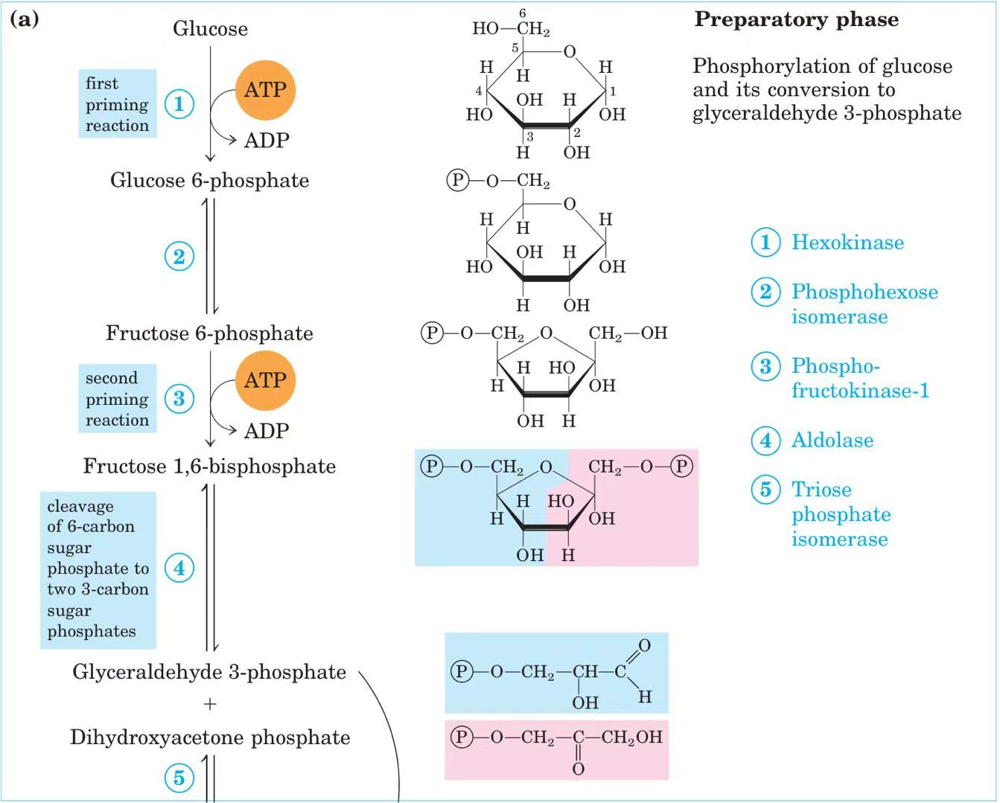      
- Payoff Phase: 
  recoups this investment and produces a net gain of ATP. All intermediates are phosphorylated, and their phosphoryl groups are ultimately transferred to form ATP via substrate level phosphorylation      
  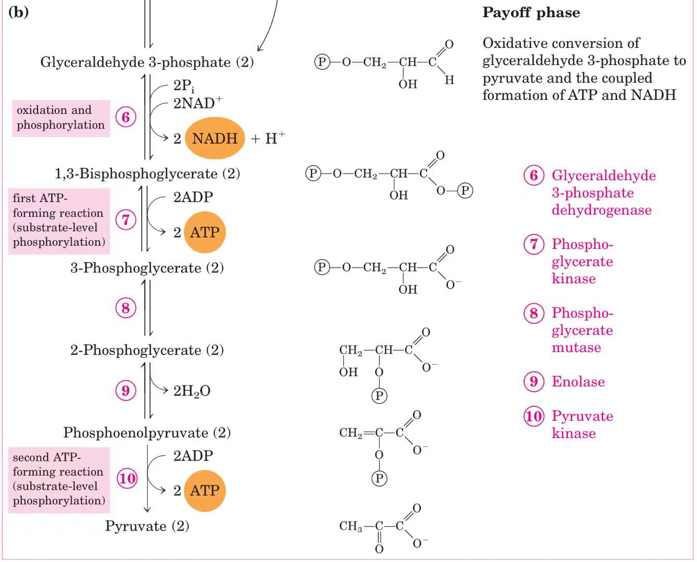      
- The activity of key enzymes in this process is Mg2+ -dependent.
- Three types of chemical tansformations:
  1. degration of the carbon skeleton of glucose to yield pyruvate;
  2. phoporylation of ADP to ATP by compounds with high phosphoryl group transfer potential;
  3. transfer of a hydride ion to NAD+, forming NADH;
  4. isomerizations.
- Energy:      
  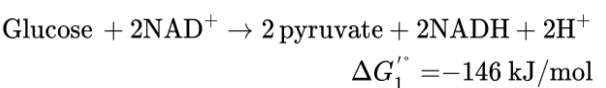      
  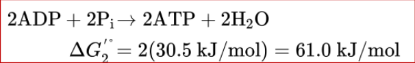      
  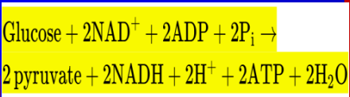      
        
- Main function:
  1. Meet the cell's immediate **energy demands**;
  2. provide the essential **carbon skeletons** for building macromolecules.   
  
#### STEP4:Aldolase(醛缩酶) catalyzes the critical carbon-carbon bond cleavage of fructose 1,6-bisphosphate   

- **Class I enzymes** (animals, plants):
accomplish this without a metal cofactor, but utilizing a covalent Schiff base mechanism.    
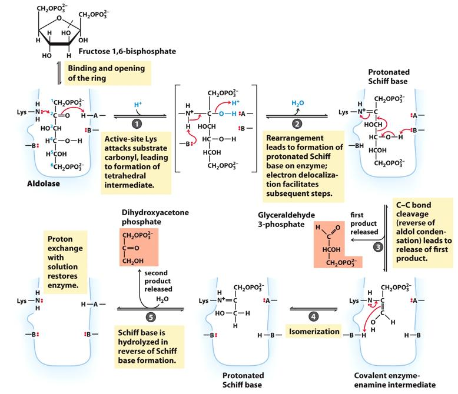    
- **Class II enzymes** (fungi, bacteria) :
  employ a Zn2+ cofactor to polarize the 
  substrate's carbonyl group.     

#### STEP6: The reaction catalyzed by GAPDH proceeds through a covalent thioester intermediate     

- GAPDH catalysis is initiated by the nucleophilic attack of an active-site Cys residue on glyceraldehyde 3-P(甘油醛-3-磷酸), forming a covalent thiohemiacetal intermediate;
- This intermediate is oxidized by NAD+, yielding a high-energy thioester.
- The thioester then undergoes phosphorolysis by Pi to produce 1,3-bisphosphoglycerate.
- Given the low intracellular [NAD+], NAD+ must be continuously regenerated through reoxidation of NADH for glycolysis to proceed.     
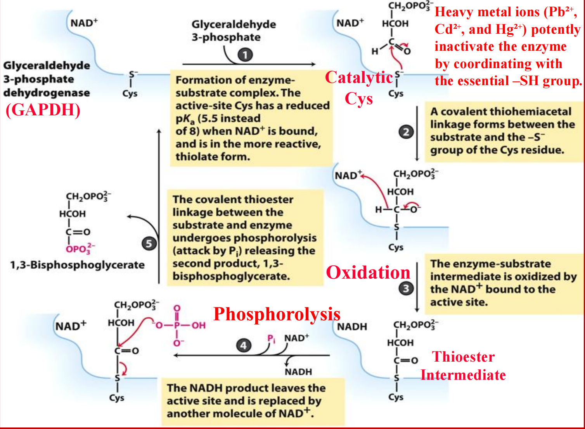     

#### STEP7: Substrate-level phosphorylation catalyzed by phosphoglycerate kinase produces ATP from 1,3-bisphosphoglycerate

- Phosphoglycerate kinase catalyzes the **nucleophilic attack** of ADP on the acyl phosphate of 1,3-bisphosphoglycerate, resulting in a phosphoryl transfer that yields ATP and 3-phosphoglycerate.
- The large, negative free energy change of this substrate-level phosphorylation provides the **driving force** to pull the endergonic GAPDH catalyzed reaction.    
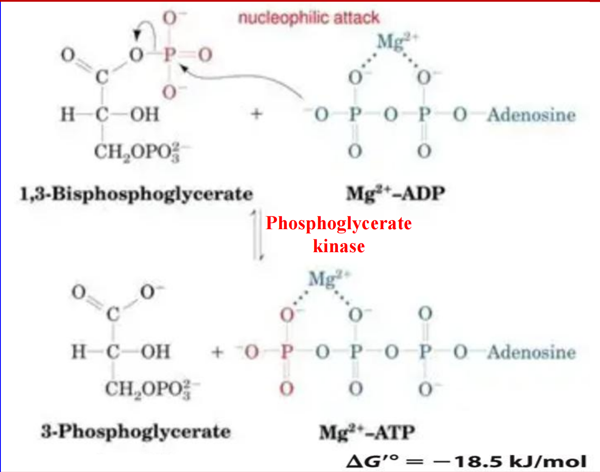

#### STEP8: Phosphoglycerate mutase employs a ping-pong mechanism involving a phosphorylated histidine residue   

- The catalytic cycle is initiated by the catalytic activation of the enzyme through phosphorylation by 2,3-bisphosphoglycerate(2,3-BPG).
- The phosphoryl group added to the C-2 hydroxyl of the substrate is **distinct** from the one concurrently removed from the C-3 position, with active-site **phospho-histidine** serving as immediate donor.
- Same strategy: **phosphoglucomutase**.    
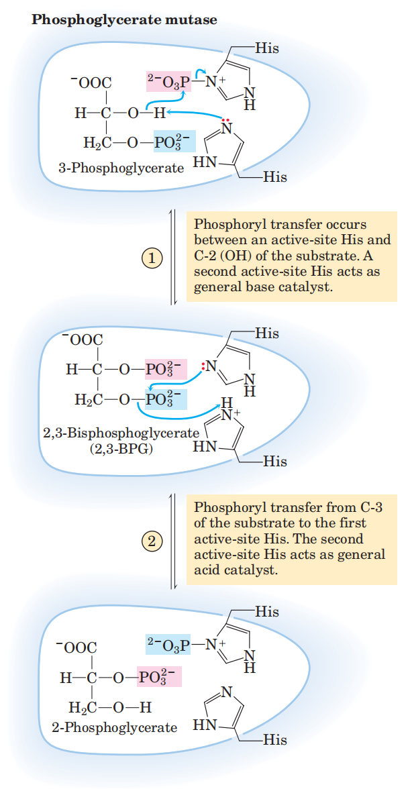{ width=60% }

#### STEP9-10: Phosphoenolpyruvate is utilized to generate ATP via substrate level phosphorylation

- Enolase(烯醇化酶) employs two Mg2+ ions as cofactors to catalyze the dehydration of 2-phosphoglycerate, facilitating the formation of a **high-energy** enol intermediate, phosphoenolpyruvate (PEP).
  

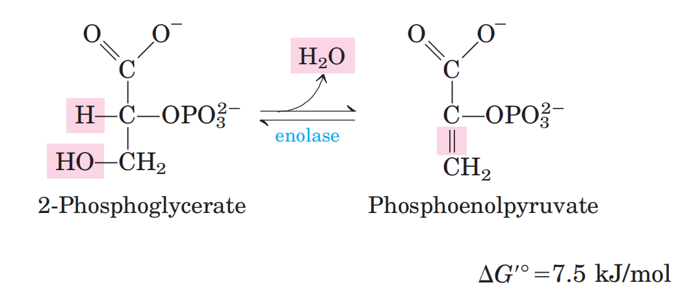{width=60%}

- Pyruvate kinase then catalyzes the transfer of the phosphoryl group from **PEP to ADP**.
  

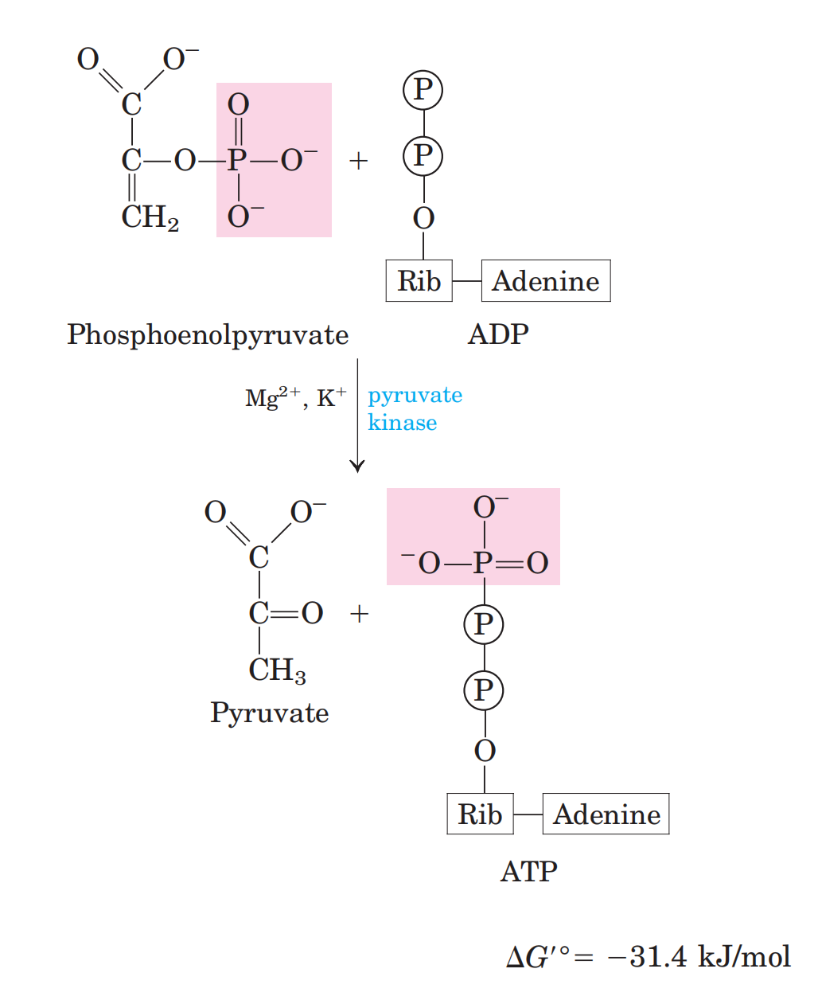{width=60%}

- Enol form of pyruvate rapidly tautomerizes to the **keto form**.

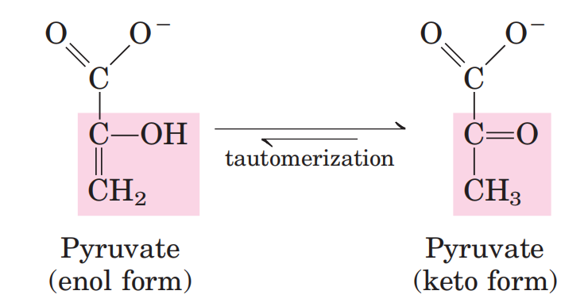{width=60%}

#### Fru(果糖), Gal(半乳糖), and Man(甘露糖) enter the glycolytic pathway for catabolism

- In **liver**, Fru is phosphorylated to **Fru-1-
P** by fructokinase before being cleaved 
by **aldolase B(醛缩酶B)** to produce **dihydroxyacetone phosphate(二羟丙酮磷酸酯)** and **glyceraldehyde(甘油醛)**; Glyceraldehyde is then phosphorylated by **triose kinase(三碳糖激酶)** to form **glyceraldehyde-3-P**.

- In **muscle and renal (kidney)** cells, 
fructose is phosphorylated directly by the 
enzyme **hexokinase(己糖激酶)** to form **fructose-6-P**.
- Gal is converted through the **Leloir pathway**, via UDP-Gal and UDP-Glc, into glucose-6-P.
- Man is phosphorylated to **mannose-6-P**
before isomerized directly to **fructose-6-
P**.

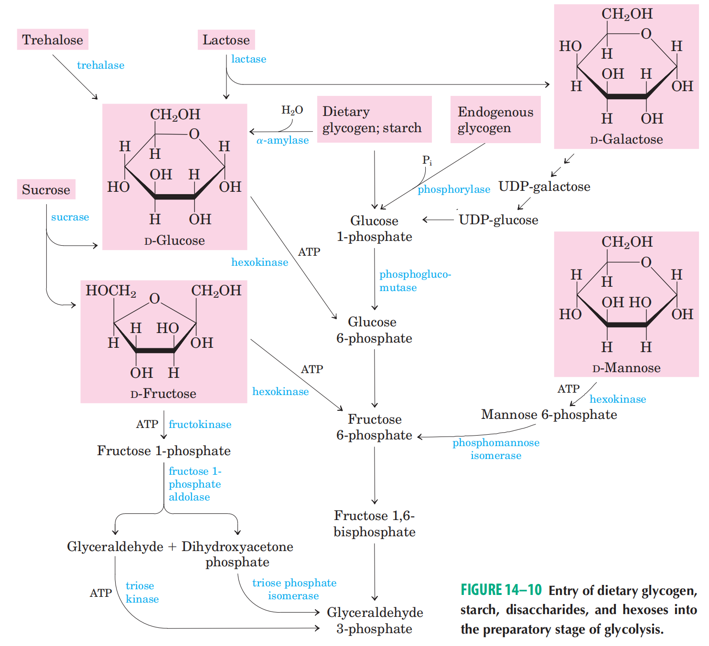

#### Pyruvate fate is contingent on physiological conditions and species specific pathways

- It is completely oxidized to CO2 via the citric acid cycle under aerobic conditions.
- It is reduced to end-products like lactate or ethanol in anaerobic fermentation to **regenerate NAD+**.
- It serves as a crucial precursor for the synthesis of fatty acids and amino acids.

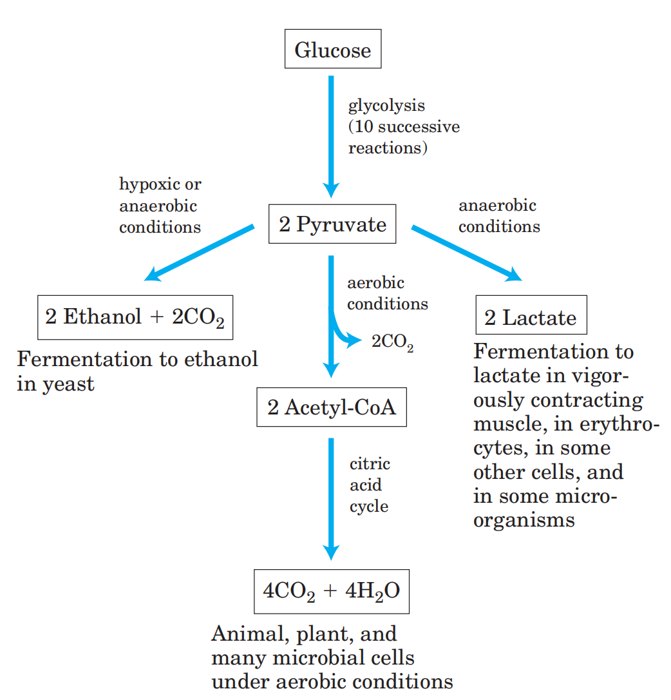{width=80%}

#### Fermentation pathways regenerate NAD+ to maintain glycolysis in absence of O2

- In certain **animal tissues** (skeletal muscles, erythrocytes) and certain microbes, pyruvate is reduced to lactate by **accepting electrons from NADH**.

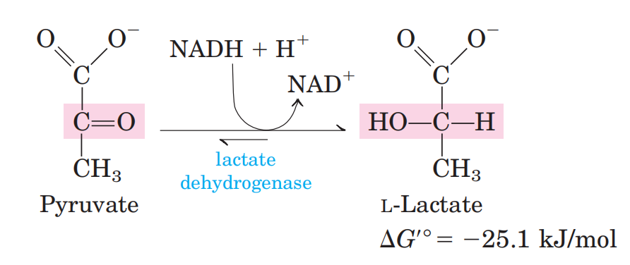{width=60%}

- In yeasts, pyruvate is first decarboxylated to acetaldehyde, which is subsequently **reduced to ethanol by NADH** under alcohol dehydrogenase catalysis.

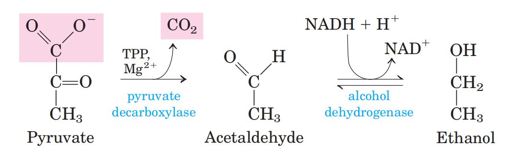{width=60%}

- The overall reaction is **redox-neutral**, as there is no net change in the oxidation state of carbon from glucose to lactate or ethanol.

> Fermentation is harnessed both for food processing and preservation, and for industrial production of chemicals through bioconversion.
> Beyond food processing, fermentation is 
harnessed industrially to synthesize chemicals 
like ethanol, acetone, and butanol.

> Two physiological phenomena:
> 
>  **The Pasteur Effect** : In yeast, the rate of glucose consumption is significantly greater under anaerobic conditions than aerobic conditions. This occurs because cells must compensate for the low ATP yield of fermentation **(2 ATP/glucose)** by vastly increasing glycolytic flux, whereas aerobic respiration yields far more ATP **(~30 ATP/glucose)**.
> 
> **The Warburg Effect**: Aerobic glycolysis is a strategic metabolic adaptation of many cancer cells, characterized by the preferential conversion of glucose to lactate for energy production, even in the presence of O2.Advantages include **rapid ATP generation**, biosynthetic precursor supply, among others.

#### Thiamine pyrophosphate facilitates cleavage of C-C bond adjacent to a carbonyl group by stabilizing a key carbanion intermediate

- Thiamine pyrophosphate (TPP, derived from **vitamin B1**) catalyzes reactions via a reactive C2 carbanion, which facilitates C-C cleavage **adjacent to a carbonyl** by acting as a transient carrier of the resulting activated aldehyde group.

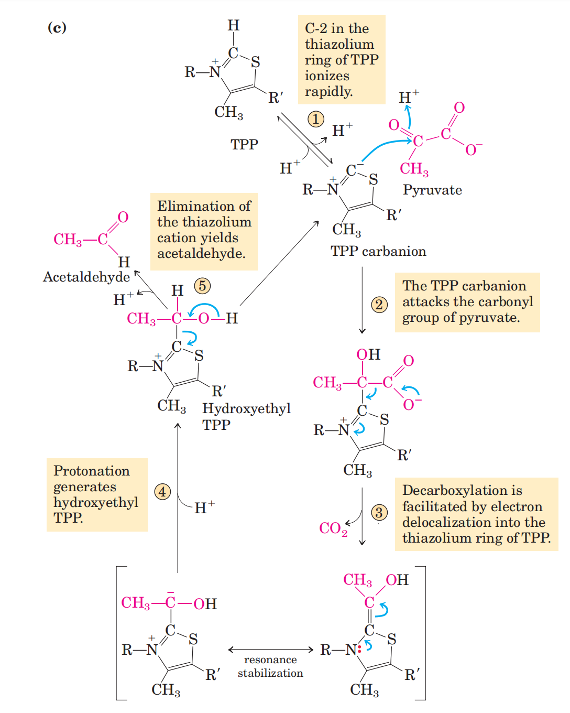

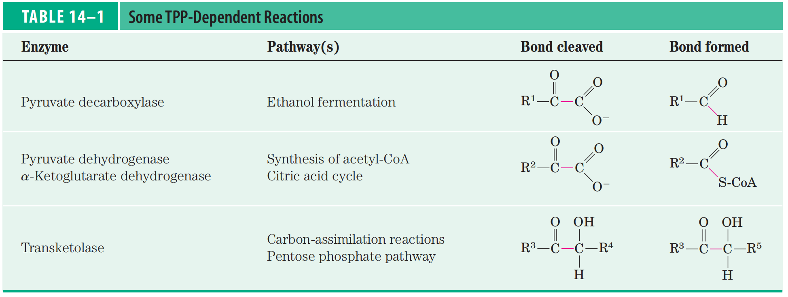

#### Three of the ten enzymatic steps in glycolysis are essentially irreversible under physiological conditions

- These three steps—catalyzed by **hexokinase(己糖激酶)**, **phosphofructokinase-1(磷酸果糖激酶-1)**, and **pyruvate kinase(丙酮酸激酶)**—are characterized by a highly negative, which defines them as the pathway's key regulatory points.
- STEP1, STEP3, STEP10

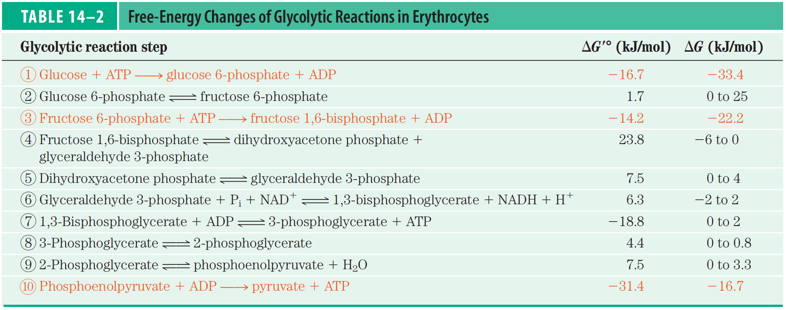

- **Hexokinase isozymes in liver and muscle are differentially regulated to fulfill their distinct physiological functions**

  - Liver **maintains blood glucose homeostasis** at ~ 5 mM by releasing glucose when its concentration is low and taking it up when high. In contrast, muscle consumes glucose primarily for **energy production**.
  - Hepatic isozyme, hexokinase IV (glucokinase), has a **high Km** (~10 mM), whereas the muscle isozymes (hexokinase I/II) have a **low Km** (~ 0.2 mM).
  - Muscle isozyme is allosterically **inhibite**d by its product, **glucose-6-phosphate**, a regulation absent in liver isozyme.
  - Liver isozyme is **sequestered in the nucleus** by a regulatory protein in the presence of fructose-6-phosphate, this inhibition is **reversed by glucose**.

  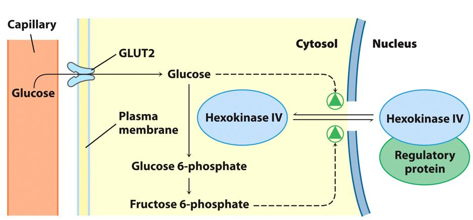{width=60%}

- **Phosphofructokinase-1 activity is modulated by both negative and positive allosteric effectors**
  - PFK-1 is inhibited by **ATP and citrate**, which signal **abundant energy supply**.
  - PFK-1 is activated by AMP, ADP, and fructose 2,6-bisphosphate (F26BP), indicators of **low energy status** or glycolytic demand.

  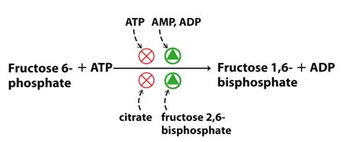{width=60%}

- **Liver pyruvate kinase isozyme L is subject to complex multilevel regulation**
  - It is inhibited by ATP, acetyl-CoA, alanine, and long-chain fatty acids but is feed-forward activated by **fructose-1,6-bisphosphate** (F1,6BP), ensuring coordinated glycolytic flux.
  - This activation is overridden by **glucagon(胰高血糖素)**, which promotes its phosphorylation and inactivation to shift metabolism toward gluconeogenesis. 

  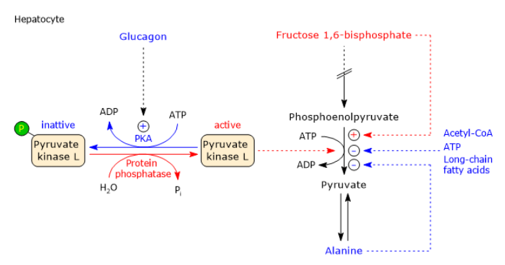

## Gluconeogenesis

- FUNCTION: When glycogen stores are depleted—during fasting, vigorous exercise, or between meals—gluconeogenesis becomes essential for maintaining glucose homeostasis.
- CONSERVED: 

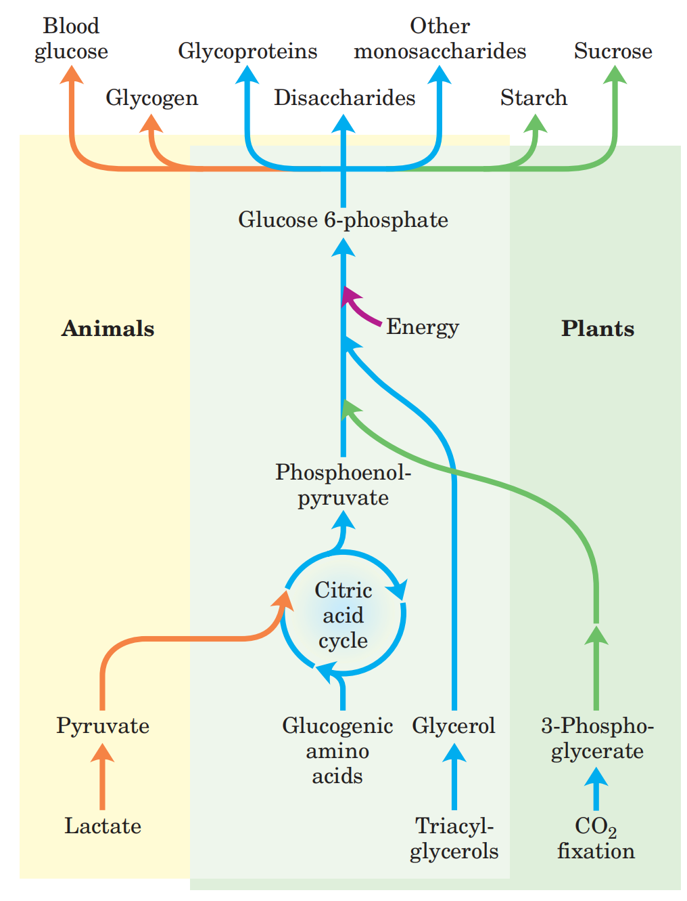{width=60%}

> In animals, the liver is the primary site of gluconeogenesis, producing glucose for export to other tissues—including the brain, skeletal muscle, and erythrocytes—that are dependent on blood glucose for energy.
> Unlike plants and microorganisms, animals cannot achieve a net synthesis of glucose from acetyl-CoA derived from fatty acid catabolism.

#### PROCESS SUMMARY

- Gluconeogenesis bypasses the 3 irreversible steps of glycolysis (with large negative ΔG).
- These bypasses are catalyzed by 
different, pathway-specific enzymes. 
- The two pathways are reciprocally regulated to prevent a futile cycle.

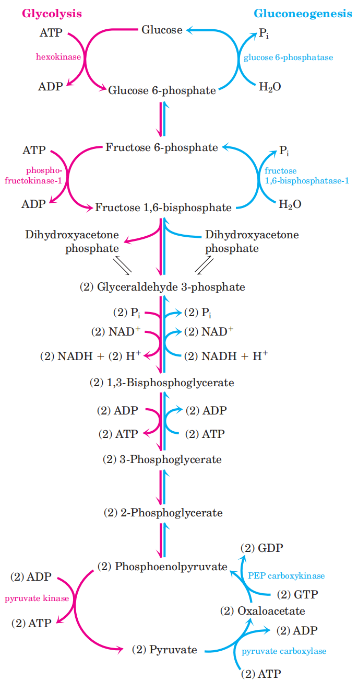{ width=60% }

#### STEP1: Conversion of pyruvate to PEP involves a mitochondrial carboxylation and a cytosolic decarboxylation

- The process begins with the carboxylation of pyruvate to **oxaloacetate(草酰乙酸)** within the mitochondria, catalyzed by pyruvate carboxylase.
- This enzyme is allosterically activated by acetyl-CoA and utilizes covalently bound biotin as a 'swinging arm' cofactor, which enables CO2 carrier function by forming a stable bond with CO2 via its ureido ring (that is fused to a **tetrahydrothiophene(四氢噻吩)** ring).

  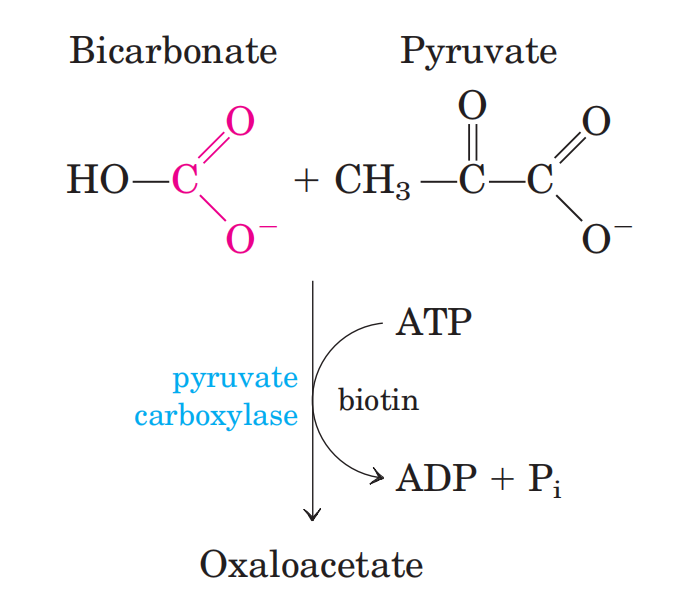{ width=45% }
  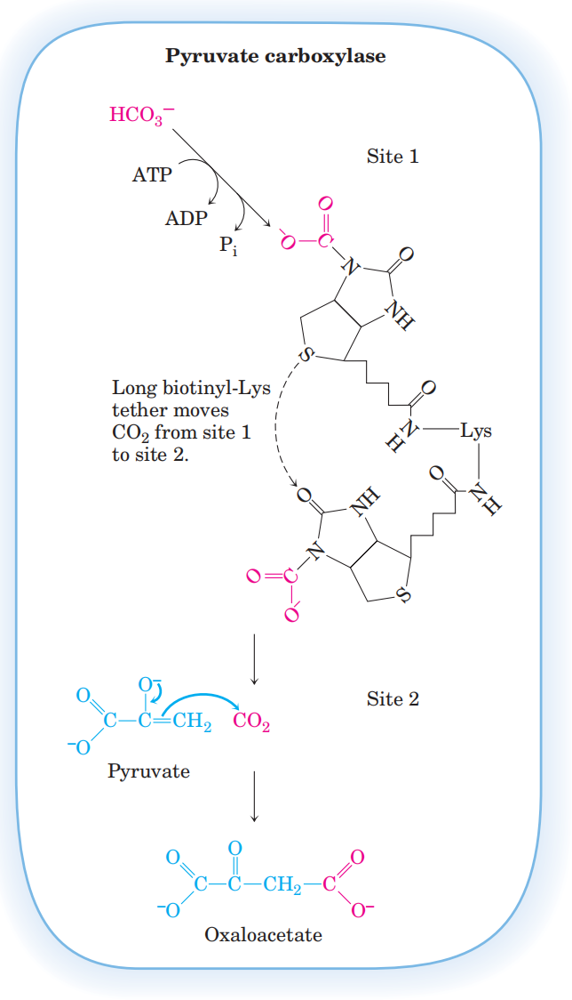{ width=45% }

- The resulting oxaloacetate is then reduced to **malate** for transport to the **cytosol**, a step that also transfers reducing equivalents.
- There, malate is re-oxidized to , and phosphoenolpyruvate carboxykinase catalyzes its decarboxylation to **PEP**, consuming GTP/ATP.
  
  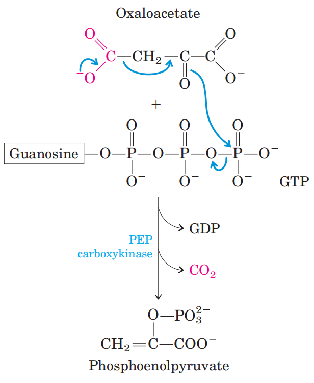{ width=60% }

#### STEP7: Aldolase catalyzes the condensation of glyceraldehyde-3-phosphate and dihydroxyacetone phosphate to form fructose-1,6-bisphosphate

> Aldolase is a versatile, often tetrameric enzyme that catalyzes reversible aldol reactions, enabling it to form and cleave carbon-carbon bonds in critical sugars like fructose-1,6-bisphosphate in glycolysis/gluconeogenesis and sedoheptulose-1,7-bisphosphate in the pentose phosphate pathway.

#### STEP9&10: Glucose-6-phosphate is hydrolyzed to glucose in the lumen of the endoplasmic reticulum of liver cells

- Glucose-6-phosphatase is located on the endoplasmic reticulum membrane of liver cells, with its active site facing the lumen
- This spatially separates its activity from glycolysis, which occurs in the cytosol; 
- Brain and muscle cells lack glucose-6-phosphatase.
- The glucose produced by either gluconeogenesis or glycogen breakdown in the liver is released into the bloodstream to maintain stable blood sugar levels.

  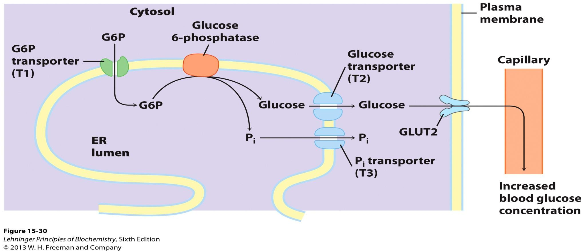{width=60%}

#### An abundance of fatty acids promotes the conversion of pyruvate to phosphoenolpyruvate by increasing acetyl-CoA levels, which fuels gluconeogenesis

- By allosterically activating pyruvate  carboxylase and inhibiting the pyruvate dehydrogenase complex, acetyl-CoA directs pyruvate **away from the citric acid cycle** and into the gluconeogenic pathway. 
- This ensures that excess pyruvate can be converted to glucose for glycogen storage when energy levels are high.

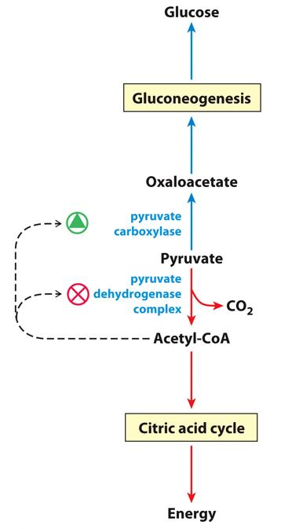{ width=40% }

## Glycolysis and Gluconeogenesis

- Avoid a **wasteful process** that consumes ATP without net glucose production or meaningful thermodynamic work.
- Glycolysis serves as a **universal energy-yielding** pathway, whereas gluconeogenesis is a specialized, fasting-induced process in the liver for maintaining blood glucose.

#### Phosphofructokinase-1 (PFK-1) and fructose-1,6-bisphosphatase-1 (FBPase-1) are prototypical examples of reciprocally regulated enzymes

- AMP and fructose-2,6-bisphosphate(F2,6BP) act as potent activators of PFK-1 while serving as inhibitors of FBPase-1, thus ensuring the pathways do not operate simultaneously.
  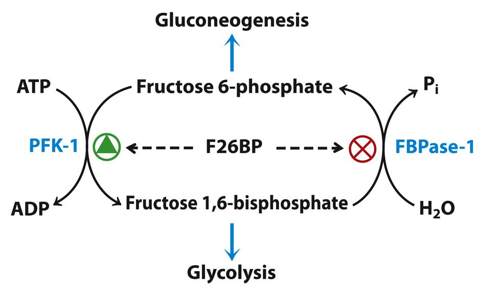{width=60%}

#### Dynamic hormonal regulation of hepatic F2,6BP by insulin and glucagon

- Hepatic PFK-1 is critically dependent on 
F2,6BP and is virtually inactive in its absence, even in the presence of other activators like AMP or citrate.
- F2,6BP is synthesized and degraded by a 
single bifunctional enzyme, **PFK-2/FBPase-2**, which is regulated via reversible phosphorylation in response to **insulin**(dephosphorylation) and **glucagon**(phosphorylation).

## Pentose phosphate pathway(PPP) of glucose oxidation

- PROCESS: NADPH is generated in the irreversible oxidative phase of the PPP via two oxidation steps, producing **two molecules of NADPH and one ribulose 5-P per Glc 6-P oxidized**.
- When ribose 5-phosphate is not needed, the non-oxidative phase reconverts it to Glc 6-P, allowing for further NADPH production. 
- In humans, PPP is most active in tissues with **high biosynthetic or detoxification demand**, such as liver, adrenal cortex, and lactating mammary gland.
  
  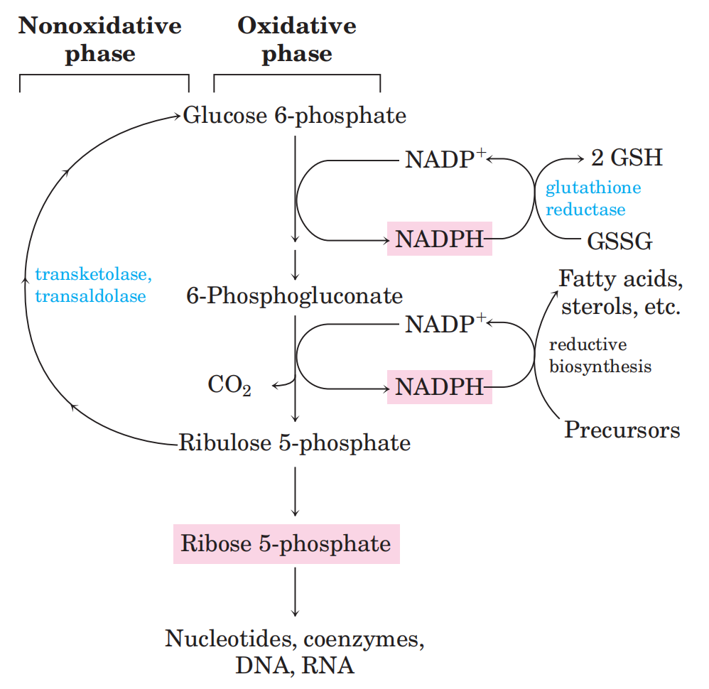{width=80%}

#### PROCESS SUMMARY:
  - Step 1: Glc-6-P is oxidized to 6- phosphoglucono-δ-lactone by glucose-6- phosphate dehydrogenase,producing one molecule of NADPH.
  - Step 2: The unstable 6-phosphoglucono-δ- lactone is hydrolyzed by lactonase to form the **linear** molecule 6-phosphogluconate.
  - Step 3:  6-Phosphogluconate undergoes an oxidative decarboxylation catalyzed by 6-phosphogluconate dehydrogenase, generating ribulose 5-P, one molecule of CO2, and a second NADPH.
  - Step 4:  Ribulose 5-P is isomerized to ribose 5-P by phosphopentose isomerase, providing precursor for nucleotide synthesis.

  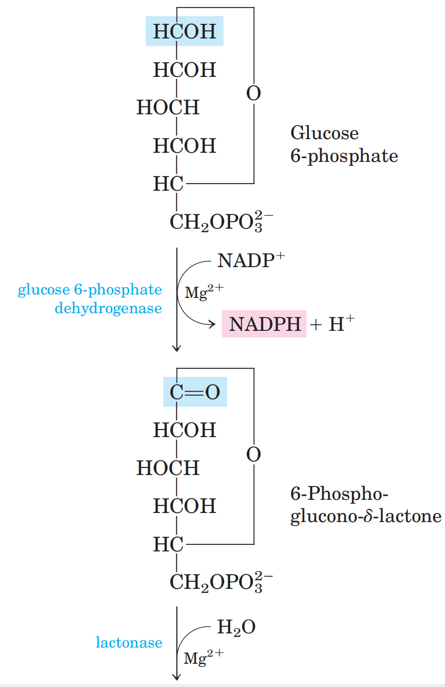{ width=45% }
  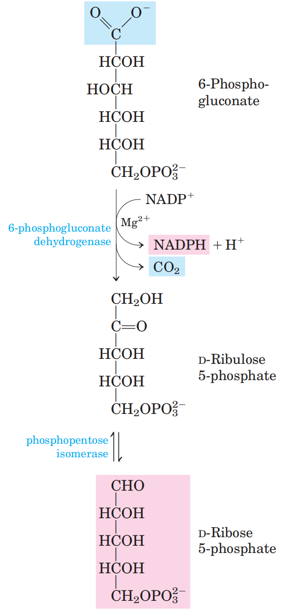{ width=45% }

#### The nonoxidative phase of PPP recycles pentose phosphates back to glucose 6-phosphate

- Through series of reactions involving 3-, 4-, 
5-, and 7-carbon sugar intermediates, **six pentose** phosphates are converted into **five hexose** phosphates (a total of 30 carbons).
- **Glyceraldehyde 3-phosphate** is a key 
intermediate shared by glycolysis, gluconeogenesis, and the PPP.
- This process is particularly active in tissues such as liver, adipose and lactating mammary gland.
  
  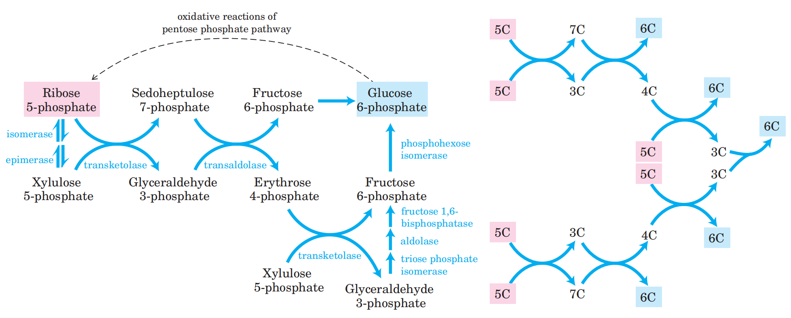

#### Transketolase & transaldolase catalyze key rearrangement of carbon skeletons during nonoxidative phase of PPP

- Transketolase transfers a two-carbon unit, 
carried by thiamine pyrophosphate, from 
a ketose donor to an aldose acceptor.
- Transaldolase transfers a three-carbon
unit from a ketose donor to an aldose 
acceptor, utilizing a Schiff base intermediate formed with a lysine residue in its active site.

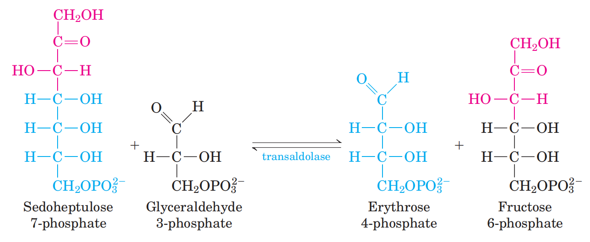

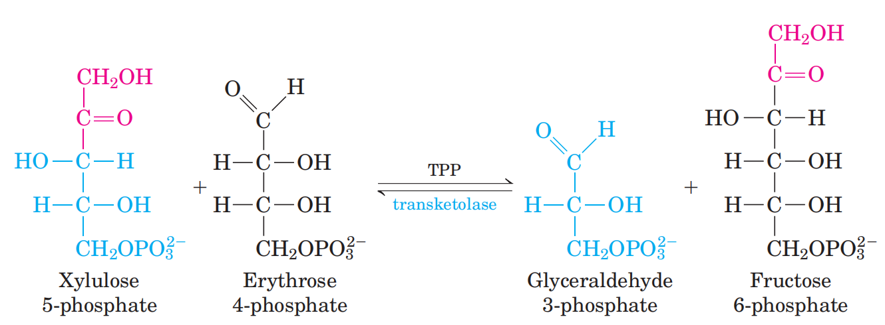

#### Partitioning of glucose 6- P between glycolysis and pentose phosphate pathway is determined by cellular NADPH/NADP+ ratio
- A high NADPH/NADP+ ratio allosterically 
inhibits glucose 6-P dehydrogenase 
(G6PD), diverting carbon flux toward 
glycolysis. 
- A low ratio relieves this inhibition, 
directing glucose 6-P into the pentose 
phosphate pathway to meet biosynthetic 
and oxidative defense needs.

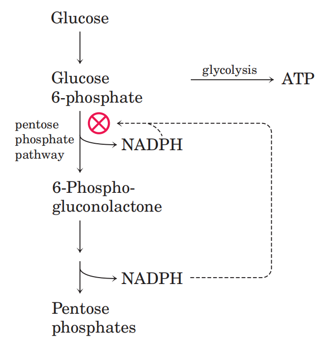{ width=60% }

# Chapter 15: Metabolism of glycogen in animals

Glucose can be rapidly sequestered(隔离) into or mobilized from glycogen granules.

- Each **β-particle**（a special form of glycogen in liver） of glycogen may contain tens of thousands of Glc units, organized into multiple tiers of branched chains.
- This highly branched structure presents thousands of free **non-reducing ends**, enabling simultaneous access by glycogen synthesis and degradation enzymes.
-  Ten to twenty β-particles assemble to form a single α-granule.
-  Processes of glucose storage and mobilization are effectively modulated by hormones such as insulin, glucagon, and epinephrine.

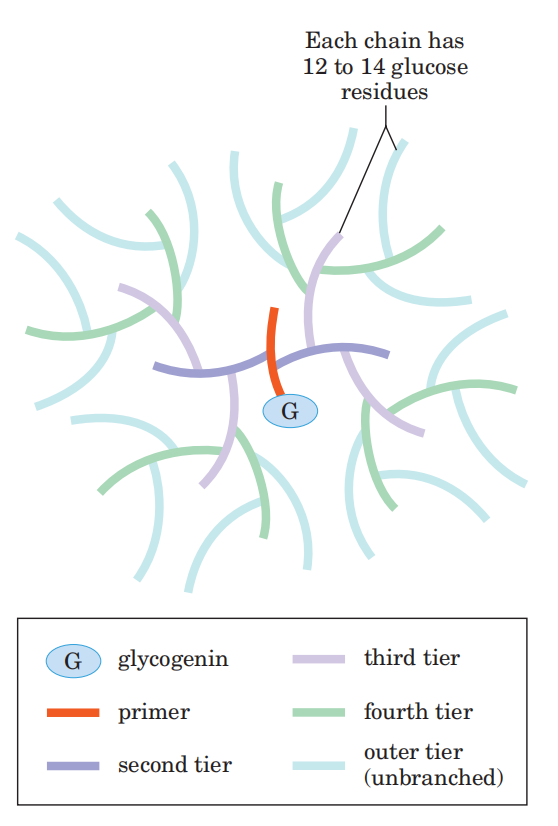{ width=60%}

##  Breakdown of glycogen to glucose 1-phosphate (glycogenolysis)

#### Glycogen Breakdown Is CatalyzA covalently bound pyridoxal phosphate 

- A covalently bound pyridoxal phosphate (PLP) cofactor acts as a general acid, This facilitates bond cleavage and leads to the formation of a resonant-stabilized **oxocarbenium ion intermediate**.
- Pi attacks this **electrophilic carbon**, resulting in the formation of glucose-1-phosphate.
- It first utilizes its glycosyltransferas activity to relocate a block of three glucose residues from a branch to a nearby non-reducing end via an (α1→4) linkage.
- Subsequently, its (α1→6)-glucosidase 
activity hydrolyzes the **remaining single Glc** residue at branch point. 
- This process clears the branch, **allowing glycogen phosphorylase to continue phosphorolysis**.

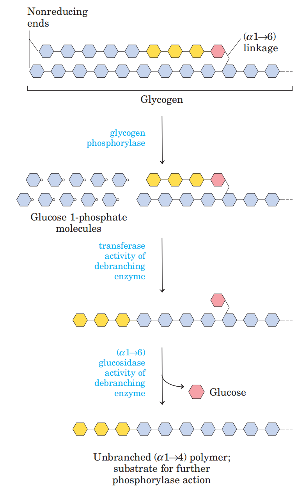{ width=60% }

#### Glucose 1-Phosphate Can Enter Glycolysis or, in Liver,Replenish Blood Glucose

**Phosphoglucomutase** isomerizes Glc 1-P to Glc 6-P in both muscle and liver cells

- In muscle, it directly enters glycolysis to 
support local energy production.
- In the liver (and kidney), Glc 6-P is hydrolyzed to free glucose by glucose-6-phosphatase, this enzyme's active site is situated within the endoplasmic reticulum lumen.
- The free glucose generated in the ER lumen is efficiently released into the blood because the cytosolic environment during **fasting states** simultaneously suppresses **glucokinase activity** and promotes glucose export.

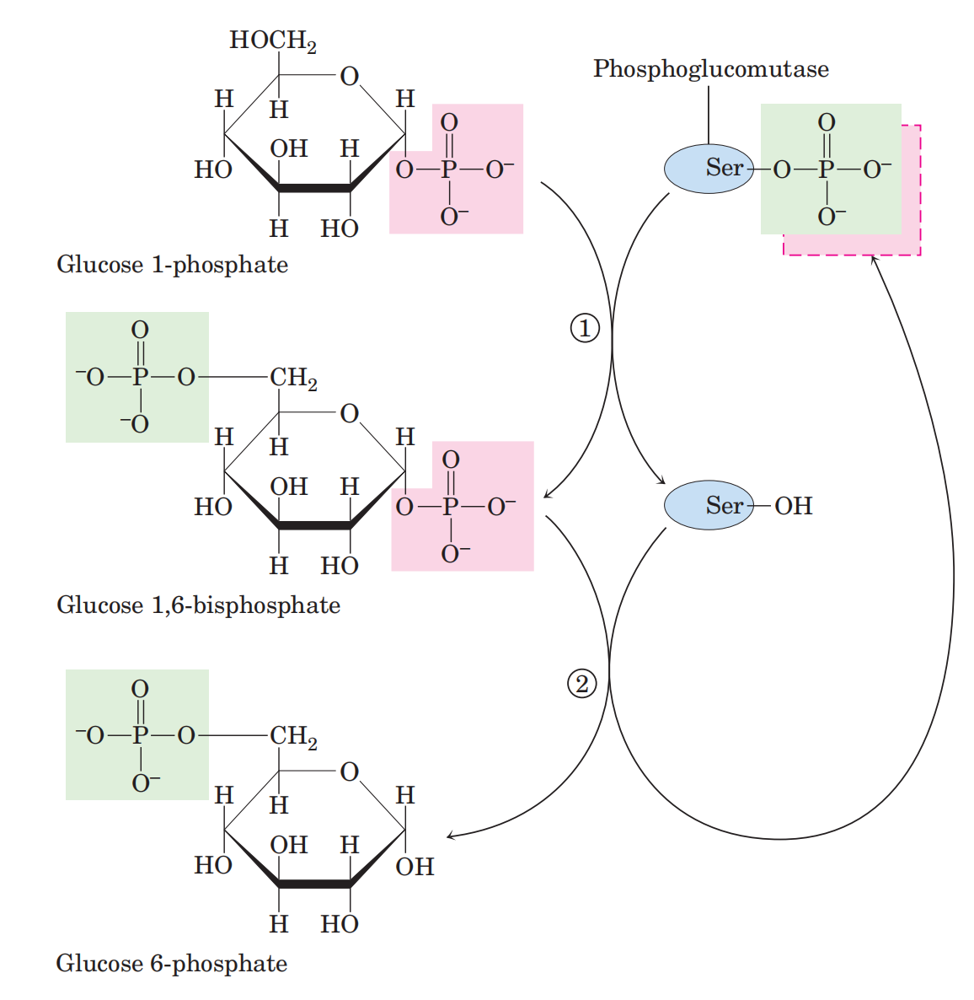{width=60%}

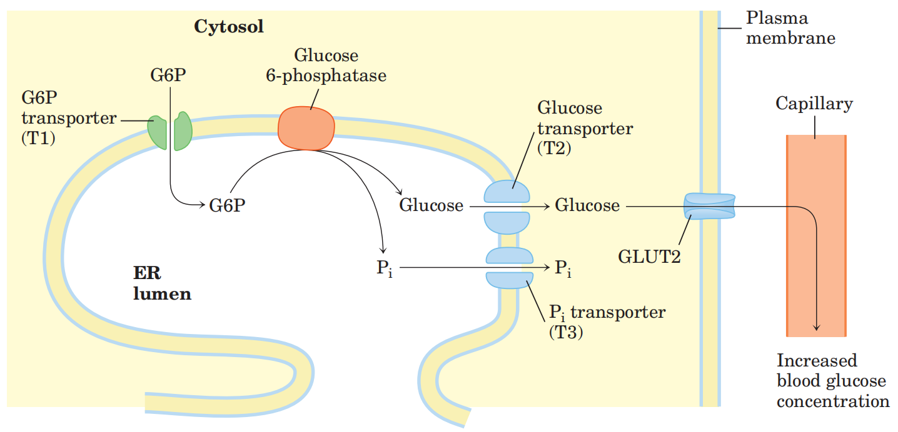{width=60%}

## Synthesis of glycogen

#### The Sugar Nucleotide UDP-Glucose Donates Glucose for Glycogen Synthesis (这一段太乱了，强烈建议再看一下书)

Monosaccharides are activated for metabolic 
reactions through conjugation to a nucleotide 
diphosphate (NDP)

- Activation begins with condensation of a sugar-1-phosphate with an NTP, catalyzed by NDP-sugar pyrophosphorylases.
- NDP-sugars then serve as universal donors for **biosynthesis** of di-, oligo-, and polysaccharides, and as central substrates for transformation into **various monosaccharide derivatives**, such as amino sugars, deoxy sugars, and ascorbic acid.
- The excellent **leaving group ability** of the NDP moiety facilitates nucleophilic attack by various acceptor molecules.
  

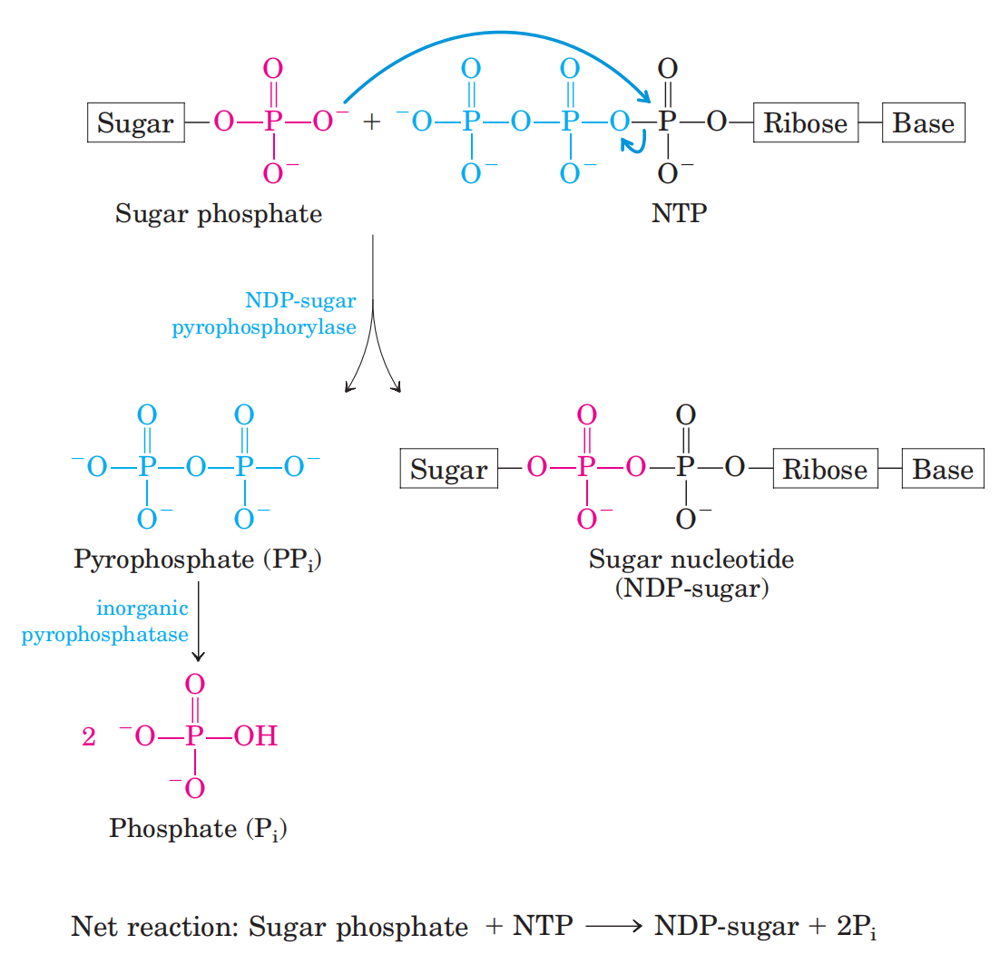

To initiate glycogen synthesis, the glucose 6-phosphate is converted to glucose 1-phosphate in the phosphoglucomutase reaction

- The product of this reaction is converted to UDP-glucose by the action of **UDP-glucose pyrophosphorylase**, in a key step of glycogen biosynthesis

- UDP-glucose is the immediate donor of glucose
residues in the reaction catalyzed by glycogen synthase, which promotes the transfer of the glucose residue from UDP-glucose to a nonreducing end of a branched glycogen molecule,  forming an α-1,4-glycosidic linkage.

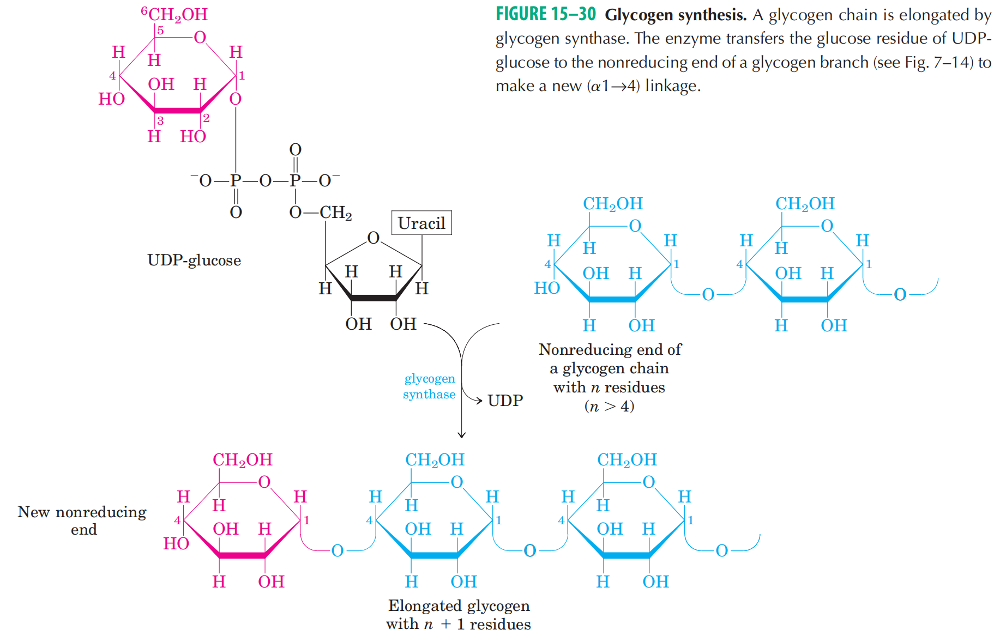

- **Glycogen branching enzyme(amylo (1->4) to (1->6) transglycosylase)** cleaves a terminal fragment of ~ 6-7 Glc residues from a chain of at least 11 residues long and transfers it to the C-6 hydroxyl group of a Glc residue at a more interior position, creating an α-1,6-linkage.
- This branching action significantly **increases the number of non-reducing ends**, thereby enhancing the substrate accessibility for both glycogen synthase and glycogen phosphorylase.
  

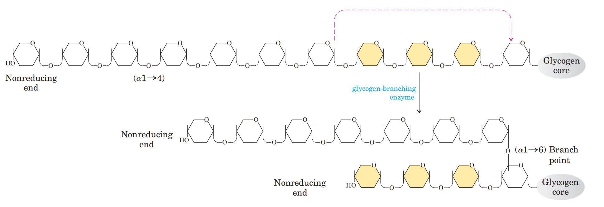

#### Glycogenin Primes the Initial Sugar Residues in Glycogen

- Glycogen synthase cannot initiate a new glycogen chain de novo. It requires a primer, usually a preformed (1→4) polyglucose chain or branch having at least eight glucose residues.
- **Glycogenin** autocatalytically attachs a Glc to the –OH of Tyr194 in one of its subunits, forming a **glycosidic bond**.
- It then proceeds to catalyze the addition of ~7 more Glc units to form a short, nascent chain.

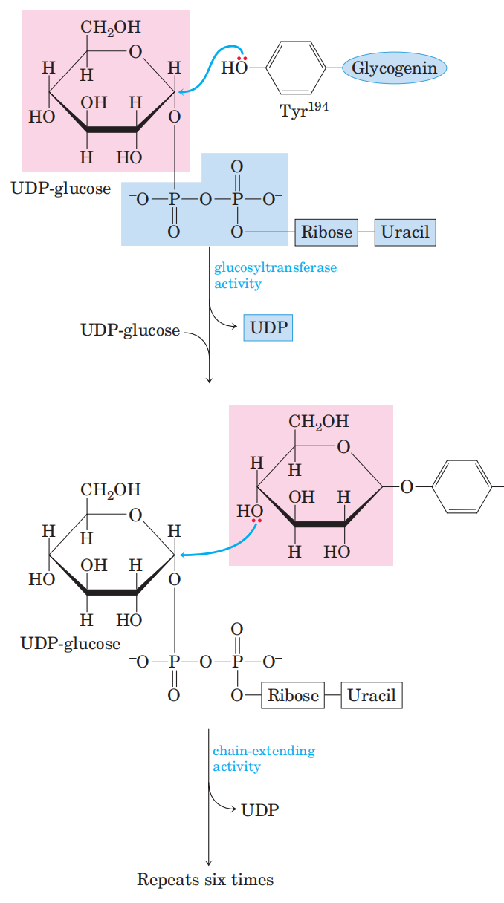{ width=60%}

##  Coordinated Regulation of Glycogen Synthesis and Breakdown

#### Glycogen phosphorylase is regulated by allosteric effectors as well as by hormone-triggered reversible phosphorylation

- Muscle isozyme is allosterically activated by AMP and inhibited by ATP and Glc-6-P. It is primarily activated by phosphorylation in response to **epinephrine**, which mediates the "fight-or-flight" response in muscle.
- Liver isozyme is allosterically inhibited by 
Glc, which promotes its dephosphorylation and inactivation—a process enhanced by insulin. It is primarily activated by phosphorylation in response to glucagon(during fasting) and, to a lesser extent, epinephrine.
- Insulin promotes the dephosphorylation and 
inactivation of glycogen phosphorylase in both tissues.

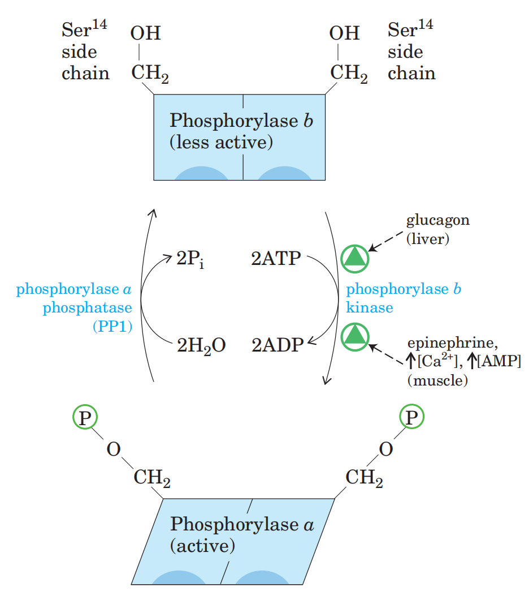{ width=60% }

#### Activation of glycogen phosphorylase by epinephrine and glucagon is mediated by an enzymatic cascade

This multi-step cascade allows for a substantial amplification of the original hormonal signal.

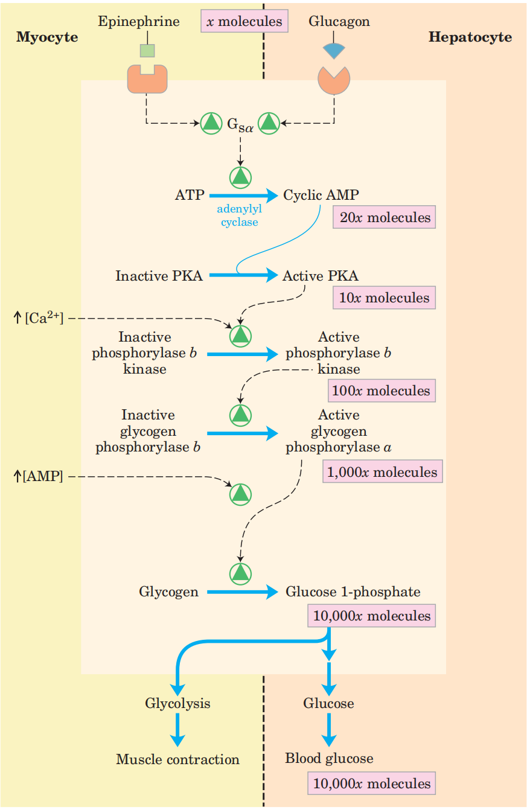{ width=80%}

#### Glycogen Synthase Is Also Regulated by Phosphorylation and Dephosphorylation

- its active form is dephosphorylated, while 
phosphorylation at multiple sites by kinases, including casein kinase II and glycogen synthase kinase-3 (GSK3), inactivates the enzyme.
- Dephosphorylation and reactivation are catalyzed by protein phosphatases such as PP1, which can be hormonally regulated.
- **Glc-6-P** acts as a key allosteric activator that promotes the dephosphorylation, making the enzyme a metabolic sensor for Glc-6-P
levels.

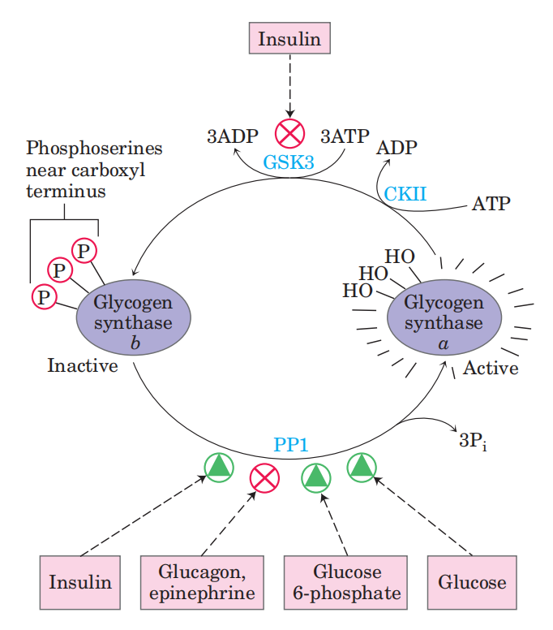{width=60%}

- The most important regulatory kinase is **glycogen synthase kinase 3 (GSK3)**,which adds phosphoryl groups to three Ser residues near the carboxyl terminus of glycogen synthase, strongly **inactivating** it.
- it cannot phosphorylate glycogen synthase until another protein kinase, **casein kinase II (CKII)**, has first phosphorylated the glycogen synthase on **a nearby residue**, an event called **priming**
- This enables GSK3 to sequentially phosphorylates Ser at position 0, -4 and -8 on glycogen synthase, leading to glycogen synthase inactivation.
- Insulin **counteracts** this inactivation cascade by activating Akt/PKB, which phosphorylates a specific Ser at **the N-terminal inhibitory site** of GSK3, inducing an **autoinhibitory pseudosubstrate conformation** in GSK3.
  

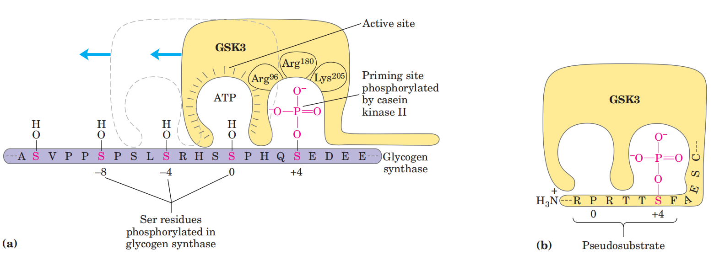

#### The regulatory subunit of Protein Phosphatase 1 (PP1), known as GM (in muscle) or GL (in liver), functions as a glycogen-targeting scaffold

- The PP1 regulatory subunits GM/GL serve as **scaffold proteins** that tether the phosphatase, localizing it to key glycogen metabolic enzymes
- **Insulin**-stimulated phosphorylation of Site 1 on GM/GL activates PP1, leading to **dephosphorylation** of glycogen synthase, phosphorylase kinase, and glycogen phosphorylase, thus promoting glycogen synthesis and inhibition of its breakdown.
- Conversely, **epinephrine/glucagon** promotes the dissociation of the PP1-GM/GL complex. This leads to the preferential **phosphorylation** of the target enzymes, shifting the balance toward glycogen breakdown and away from glycogen synthesis.

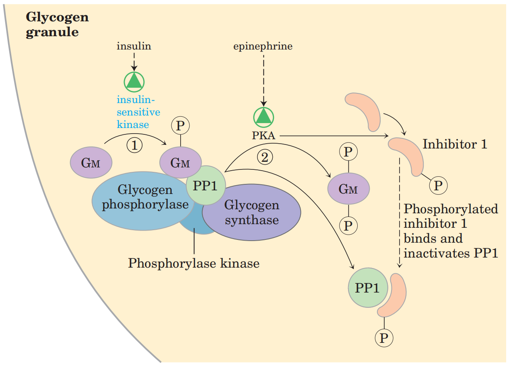{width=60%}

#### Liver switches its carbohydrate metabolism between fed and fasted states through hormonal regulation

> **Fed state:**
> Glycogen metabolism: Activates glycogen synthase and inactivates glycogen phosphorylase via their dephosphorylation (through PP1 activation & GSK3 inhibition).
> Glycolysis: Elevates Fru-2,6-BP, which allosterically activates PFK-1, driving glycolytic flux.

> **Fasted state:**
> Glycogen Metabolism: Activates glycogen 
phosphorylase and inactivates glycogen synthase via a PKA-mediated phosphorylation cascade.
> Pathway Switching: Phosphorylates PFK-2/FBPase-2, lowering Fru-2,6-BP levels. This simultaneously inhibits PFK-1 (slowing glycolysis) and activates FBPase-1 (promoting gluconeogenesis).
> Substrate Conservation: Inhibits pyruvate kinase via phosphorylation, preserving gluconeogenic precursors.

# Chapter 16: The Citric Acid Cycle

Aerobic cellular respiration comprises three main stages

- Stage 1: **Acetyl-CoA(乙酰辅酶A)** production from fuels like glucose, fatty acids, and amino acids.
- Stage 2: The citric acid cycle, which completely oxidizes the two carried carbons in acetyl-CoA to CO2, generating high-energy electron carriers like NADH.
- Stage 3: Oxidative phosphorylation, where 
electrons pass through the electron transfer chain to create a **transmembrane proton gradient** that drives **ATP synthesis**, with oxygen as the final electron acceptor.

{ width=60%}

##  Production of Acetyl-CoA (Activated Acetate)
#### Pyruvate Is Oxidized to Acetyl-CoA and CO2

- The overall reaction catalyzed by the pyruvate dehydrogenase complex is an **oxidative decarboxylation(氧化脱羧)**, an irreversible oxidation process.
- After pyruvate is transported into the mitochondrial matrix via a proton gradient-dependent carrier, it enters the **PDH(丙酮酸脱氢酶复合体)** multi-enzyme complex.
- Within this structure, comprising three enzymes and five essential cofactors, reaction intermediates are bound and channeled efficiently.
- CoA itself is synthesized from pantothenic acid (vitamin B5), which is linked to an adenosine-3',5'-bisphosphate moiety and to β-mercaptoethylamine.
  
  {width=60%}

  {width=60%}

#### Pyruvate dehydrogenase complex is a large, multi-enzyme assembly conserved across all organisms

- The PDH complex contains three enzymes—**pyruvate dehydrogenase**(E1), **dihydrolipoyl transacetylase**(E2), and **dihydrolipoyl dehydrogenase**(E3)—each present in multiple copies.
- E2 core interacts with surrounding E1 and E3
subunits. Each E2 subunit has a flexible arm where 1-3 **lipoate(硫辛酸)** molecules are covalently linked to a specific Lys residue.
- Regulatory protein kinase and phosphatase are also associated with the complex in eukaryotes.
  
  { width=60% }

  { width=60% }

#### The PDH complex catalyzes five sequential reactions

-Reaction intermediates are channeled between active sites via flexible lipoyllysyl arms of E2.
- Step 1 (E1): Decarboxylation of pyruvate, a reaction analogous to that catalyzed by pyruvate decarboxylase, yields hydroxyethyl-TPP(羟乙基-硫胺素焦磷酸酯,一种中间产物).
- Step 2 (E1): Oxidation of hydroxyethyl group to acetyl group; the disulfide ring of the lipoyl moiety on E2 is reduced, and the acetyl group is subsequently transferred to the **lipoyl group**, forming an acetyl-lipoamide thioester.
- Step 3 (E2): A **transesterification(酯交换反应)** transfers the acetyl group from dihydrolipoyl arm to CoA, generating acetyl-CoA.
- Steps 4 and 5 (E3): The oxidized state of **lipoyl group** is regenerated; electrons from the reduced lipoamide are transferred first to FAD of E3 and then to NAD+, producing NADH.


> **Flexible biological tethers act as "swinging arms" that function as intrinsic substrate channels in multi-enzyme complexes such as the pyruvate dehydrogenase complex**
> - These tethers are covalently bound to specific enzyme residues (e.g., a Lys or Ser side chain).
> - By shuttling reaction intermediates between distinct active sites, they enhance catalytic efficiency and prevent the diffusion of unstable intermediates.
> 
> {width=60%}
>

##  Reactions of the Citric Acid Cycle

- PROCESS: It can be divided into two stages: 
"carbon skeleton reorganization and oxidation" and "regeneration of oxaloacetate".
- The cycle involves four oxidation steps; the released electrons are carried by NADH and FADH2 into the respiratory chain.


- Among these, the reaction catalyzed by **α-ketoglutarate dehydrogenase complex** is a critical and irreversible oxidative decarboxylation step.
- It contains three irreversible reactions that serve as key regulatory points.
  
#### Step 1: Citrate(柠檬酸盐) synthase catalyzes a condensation reaction with in a cofactor independent manner

- Binding of two substrates follows a strictly **ordered sequence** (oxaloacetate first, then acetyl-CoA).
- Two catalytic His facilitate **deprotonation** of the terminal methyl carbon of acetyl-CoA, forming an **enol** intermediate.
- This enol then initiates a **nucleophilic attack** on the carbonyl carbon of oxaloacetate, resulting in the formation of a C–C bond.

{width=60%}

#### Step 2: Aconitase catalyzes the isomerization of citrate to isocitrate via a cis-aconitate intermediate, utilizing a [4Fe-4S] cluster as its cofactor

- This iron-sulfur cluster does not function in electron transfer but plays a direct role in both substrate binding and the catalytic conversion.
- Cytosolic aconitase isozyme exhibits a **moonlighting function(双重功能)**. Under iron-deficient conditions, the apoenzyme (lacking [4Fe-4S]) acts as an iron responsive element-binding protein (IRP1). It binds to specific mRNAs, enhancing the translation of the transferrin receptor (**promoting cellular iron uptake**) while simultaneously repressing the translation of ferritin (**reducing iron storage**).

{width=45%}
{width=45%}

#### Step 3:Isocitrate dehydrogenase catalyzes oxidative decarboxylation of isocitrate to form a-ketoglutarate and CO2

- The enzyme uses a divalent(二价) metal cation (Mg2+ or Mn2+) in its active site to stabilize the reaction intermediates, oxalosuccinate(草酰琥珀酸) and the enol form of α-ketoglutarate.
- There are two major classes of isozymes: an NAD+-dependent isozyme, which is located in the **mitochondrial matrix** and serves a central role in the citric acid cycle; and an NADP+-dependent isozyme, found in both the **mitochondria and the cytosol**, which primarily contributes to the **production of NADPH** for reductive biosynthesis and antioxidant defense.


#### Step 4: α-ketoglutarate goes through another oxidative decarboxylation reaction to form succinyl-CoA and CO2

- This reaction is **virtually identical** to that catalyzed by pyruvate dehydrogenase and branched chain a-keto acid dehydrogenase complexes
- The E1 and E2 subunits are structurally and mechanistically similar, while the E3 subunit is identical or highly conserved among all three large enzyme complexes present in the mitochondrial matrix or bacterial cytosol.

{width=60%}

{width=60%}

#### Step 5: Succinyl-CoA synthetase catalyzes a substrate-level phosphorylation through a mechanism that involves a phosphorylated enzyme intermediate

- In the initial step, a phosphoryl group replaces the CoA moiety of succinyl-CoA, forming a high-energy succinyl-phosphate intermediate.
- This phosphoryl group is then transferred to a conserved His residue on the enzyme, forming a high-energy phospho-histidine intermediate. 
- Finally, the phosphoryl group is transferred to GDP (or ADP), forming GTP (or ATP).

{width=60%}

{width=80%}

#### Step 6-8: Succinate dehydrogenase (complex II), fumarase and malate dehydrogenase act to regenerate oxaloacetate

- Succinate dehydrogenase is an [Fe-S] cluster- and FAD-containing flavoprotein. It is integrally embedded in the inner **mitochondrial or cytoplasmic membrane**. The enzyme catalyzes the oxidation of succinate to fumarate, transferring the derived electrons via FAD and the Fe-S clusters to ubiquinone(泛醌) within the respiratory chain.
  

{width=60%}

- Fumarase is highly stereospecific, only acts only on trans- (not cis-)and L- (not D-) configuration compounds (i.e., not on maleate and D-malate)

{width=60%}

- The cellular concentration of oxaloacetate is maintained at an extremely low level (< 10-6 M) because it is rapidly consumed by the highly exergonic citrate synthase reaction. This highly negative ∆G for citrate synthesis effectively pulls the otherwise endergonic equilibrium of the malate.


#### SUMMARY

A complete oxidation of a glucose molecule produces approximately 30-32 ATP molecules
- The transfer of electrons from NADH through the respiratory chain has a theoretical yield of **~ 2.5 ATP**, while electrons from FADH2 (via ubiquinone) yield **~ 1.5 ATP**.
- The overall efficiency of aerobic cellular respiration, comparing the energy conserved in ATP to the total potential energy in glucose, has a theoretical maximum of around 34-40%, with the remainder released as heat.
- Cytosolic NADH is shuttled into the mitochondrion by alternative mechanisms, resulting in the production of **either ~2.5 or ~1.5 ATP per NADH**.(?)


The citric acid cycle functions as a central hub in intermediary metabolism due to its amphibolic(两性) nature

- While its primary role is catabolic, its intermediates also serve as carbon skeletons for the biosynthesis of diverse biomolecules, including glucose (via gluconeogenesis), amino acids, nucleotides, fatty acids, sterols, and heme.
  

As intermediates of the citric acid cycle are removed to serve as biosynthetic precursors, they are replenished by anaplerotic reactions.

- A key anaplerotic pathway is the **conversion of pyruvate to oxaloacetate**, catalyzed by pyruvate carboxylase.
- This reaction, which also plays a critical role in gluconeogenesis, is primarily activated by acetyl-CoA, whose elevated cellular level signals an **imbalance** between its generation and consumption, thus creating the need for **anaplerosis**.(?)


##  Regulation of the Citric Acid Cycle

The flow of carbon atoms from pyruvate into and through the citric acid cycle is tightly regulated.

- Production of acetyl-CoA by PDH complex is turned off when ample fuel is available in form of fatty acids and acetyl-CoA, and when ATP and NADH levels are high;
- Phosphorylation and thus inactivation of E1 by PDH kinase is promoted by products of PDH, but inhibited by substrates of PDH.
- It is regulated at the three exergonic steps, by substrate availability, inhibition by accumulating products, and by allosteric feedback inhibition.
- Ca2+ signals muscle contraction.

#### Certain intermediates are believed to be directly channeled via formation of metabolons in living cells

- Certain enzymes of the citric acid cycle have been isolated as supramolecular complexes, or associated with the inner membrane of mitochondria.
- Temporary complexes, or metabolons are thought to be formed between sequential enzymes of this or other metabolic pathways.

{width=60%}

## The Glyoxylate Cycle

Glyoxylate cycle converts acetyl-CoA to succinate as precursors of gluconeogenesis

- It occurs in the **glyoxysomes** of germinating seeds.
- Isocitrate lyase and malate synthase catalysis allow glyoxylate bypass to occur, with a net production of succinate from acetate.
- Succinate can be converted to phosphoenolpyruvate via oxaloacetate, via gluconeogenesis pathway.

{width=50%}
{width=60%}

# Chapter 17: Fatty Acid Catabolism
##  Digestion, mobilization and transport of fats

#### Dietary Fats Are Absorbed in the Small Intestine


> Gallbladder(胆囊)
> Bile(胆汁)
> Chylomicron(乳糜微粒)
> Myocyte(心肌细胞)
> adipocyte(脂肪细胞)

- Step 1: Bile is released, and form micelles.
- Step 2: Intestinal lipases digest triglycerides (triacylglycerols) into monoglycerides, fatty acids and free glycerol.
- Step 3-4: Fatty acids reassemble into triglycerides within the ER of intestinal cell, then incorporated into chylomicrons.
- *Defects in the function of bile acids, digestive enzymes, and absorptive villi will lead to steatorrhea (脂肪泻)*
- Step 5: Chylomicrons travel first into lymph vessels, which then deliver them to the bloodstream.
- Cells metabolize stored fats via lipolysis (脂解) and lipophagy (脂自噬)

{width=60%}

Chylomicron    
- Chylomicron is a lipoprotein, which carries triacylglycerols (exogenous) to the liver.
- Apolipoproteins (lipid-free): lipid-binding proteins in the blood, responsible for the transport of triacylglycerols,phospholipids, cholesterol, and cholesteryl esters between organs.
- Apo B-48, a specific marker for intestine chylomicrons.
  

{width=50%}

Lipid droplet
- intracellular storage depots for neutral lipids (triacylglycerols, sterols, and steroyl esters).

#### Hormones Trigger Mobilization of Stored Triacylglycerols

Neutral lipids are stored in adipocytes in the form of lipid droplets, with a core of sterol esters and triacylglycerols surrounded by a monolayer of phospholipids. 
- The surface of these droplets is coated with **perilipins**,  a family of proteins that restrict access to lipid droplets, preventing untimely lipid mobilization.
-  The **hormones epinephrine** and **glucagon**, secreted in response to low blood glucose levels, activate the enzyme adenylyl cyclase in the adipocyte plasma membrane.
-  the phosphorylated perilipin causes hormone-sensitive lipase in the cytosol to move to the lipid droplet surface, where it can begin hydrolyzing triacylglycerols to free fatty acids and glycerol.
-  As hormone-sensitive lipase hydrolyzes triacylglycerol in adipocytes, the fatty acids thus released (**free fatty acids, FFA**) pass from the adipocyte into the blood,where they bind to the blood protein **serum albumin**.
> HSA noncovalently binds with several fatty acid molecules.
> The fatty acid molecules bind in long, hydrophobic pockets.

{width=60%}

- Hydrolysis of TAG by ATGL, HSL and MGL into three molecules of FFAs and one molecule of glycerol.
- Glycerol is converted to glyceraldehyde-3-P and enters glycolysis/gluconeogenesis
- *95% of energy of fat from fatty acids, 5% from glycerol*

{width=60%}

##  Oxidation of Fatty Acids

3 stages of fatty acid oxidation

{width=60%}

- Stage 1: A long-chain fatty acid is oxidized to yield acetyl residues in the form of acetyl-CoA. This process is called **β-oxidation**.
- Stage 2: The acetyl groups are oxidized to CO2 via the **citric acid cycle**.
- Stage 3: Electrons derived from the oxidations of stages 1 and 2 **pass to O2 via the mitochondrial respiratory chain**, providing the energy for ATP synthesis by oxidative phosphorylation.

#### Fatty Acids Are Activated and Transported into Mitochondria

{width=60%}

- Fats are degraded into fatty acids and glycerol in the cytoplasm of adipocytes.
- Fatty acids are transported to other tissues for fuel through the blood.
- β oxidation of fatty acids occurs in mitochondria.
- Small (< 12 carbons) fatty acids diffuse freely across mitochondrial membranes.
- Larger fatty acids (most free fatty acids) are transported via acyl-carnitine/carnitine transporter.


- Links of two separate pools of coenzyme A:
  - CoA in cytosol：biosynthesis of fatty acids.
  - CoA in mitochondrial matrix：oxidation of fatty acids and amino acids.

#### The β Oxidation of Saturated Fatty Acids Has Four Basic Steps

{width=45%}

{width=45%}

Step1: Dehydrogenation
- Catalyzed by isoforms of acyl-CoA dehydrogenase (AD) on the **inner-mitochondrial membrane**
  *long-chain acyl-CoA dehydrogenase **(VLCAD)**, acting on fatty acids of 12 to 18 carbons*
  *medium-chain **(MCAD)**, acting on fatty acids of 4 to 14 carbons*
  *short-chain **(SCAD)**, acting on fatty acids of 4 to 8 carbons.*

  {width=80%}

- Results in **trans double bond**, different from naturally occurring unsaturated fatty acids
- Analogous to succinate dehydrogenase reaction in the citric acid cycle
- electrons from bound FAD transferred directly to the electron-transport chain via electron-transferring flavoprotein (ETF)

> Medium-chain acyl-coenzyme A dehydrogenase deficiency (MCADD)
> MCADD is an **inherited metabolic disorder** that prevents the body from converting certain fats to energy, particularly during fasting. People with MCADD cannot consume medium chain fatty acids.
> MCADD is caused by mutations in the **ACADM gene** and inheritance is autosomal recessive.
> Treatment includes avoidance of medium chain triglycerides in the diet.

> FAD Cofactor
> FMN forms the core structure of FAD. Both flavin nucleotides accept two hydrogens, reducing the flavin ring. If only one hydrogen is accepted, a stable semiquinone radical forms.
> 
> {width=60%}

Step 2: Hydration

- Catalyzed by two isoforms of **enoyl-CoA hydratase**:
  *soluble short-chain hydratase (crotonase)*
  *membrane-bound long-chain hydratase, part of trifunctional protein (TFP)*
- Water adds across the double bond yielding alcohol on β carbon.
- Analogous to fumarase reaction in the citric acid cycle

Step 3: Dehydrogenation

- Catalyzed by **β-hydroxyacyl-CoA dehydrogenase**
- The enzyme uses **NAD cofactor** as the hydride acceptor
- Only **L-isomers** of hydroxyacyl CoA act as substrates.
- Analogous to malate dehydrogenase reaction in the citric acid cycle.

Step 4: Release of acetyl-CoA

- Catalyzed by acyl-CoA acetyltransferase (thiolase) via covalent mechanism:
  The carbonyl carbon in β-ketoacyl-CoA is **electrophilic**.
  Terminal sulfur in CoA-SH acts as a **nucleophile** and picks up the fatty acid chain from the enzyme.

> A conversed reaction sequence to introduce a carbonyl group on the carbon β
> 
> {width=60%}

#### The Four β-Oxidation Steps Are Repeated to Yield Acetyl-CoA and ATP

- Repeating the previous four-step process 7 times, resulting in 8 molecules of acetyl-CoA.
  FADH2 is formed in each cycle (total 7).
  NADH is formed in each cycle (total 7).


- Acetyl-CoA enters citric acid cycle and further oxidizes into CO2. this makes more GTP, NADH, and FADH2
- Each molecule of FADH2 formed during oxidation of the fatty acid donates a pair of electrons to **ETF** of the respiratory chain, and about **1.5** molecules of ATP are generated during the ensuing transfer of each electron pair to O2. 
- Similarly, each molecule of NADH formed delivers a pair of electrons to the **mitochondrial NADH dehydrogenase**, and the subsequent transfer of each pair of electrons to O2 results in formation of about **2.5** molecules of ATP.
  


#### Oxidation of Unsaturated Fatty Acids Requires Two Additional Reactions

- Naturally occurring unsaturated fatty acids contain cis double bonds.（are NOT a substrate for enoyl-CoA hydratase）
- Two additional enzymes are required:
  **isomerase**: converts cis double bonds starting at carbon 3 to trans double bonds
  **reductase**: reduces cis double bonds not at carbon 3
- Monounsaturated fatty acids require the isomerase.
- Polyunsaturated fatty acids require both enzymes.

- Oxidation of monounsaturated FAs:
    During first of five remaining cycles, **acyl-CoA dehydrogenase step is skipped**, resulting in one fewer FADH2

{width=60%}

- Oxidation of Polyunsaturated FA

{width=60%}

  step 3: Results in one fewer FADH2 after isomerization     
  step 4: NADPH reduces the remaining unsaturated bond, resulting in no further loss of one FADH2

#### Complete Oxidation of Odd-Number Fatty Acids Requires Three Extra Reactions

- Most dietary fatty acids are even-numbered.
- Many plants and some marine organisms also synthesize odd-numbered fatty acids.
- **Propionyl-CoA**(丙酰辅酶A) (3-carbon compound)forms during final cycle of β oxidation of odd-numbered fatty acids. 
- Bacterial metabolism in the rumen(瘤胃) of ruminants(反刍动物) also produces propionyl-CoA.

{width=60%}

> **Cobalamin （钴胺素）：Vitamin B12 core structure**
> 
> {width=60%}
> 
> **Vitamin B12:**
>
> {width=60%}
> 
> 3 types of reactions 
catalyzed:
> - intramolecular rearrangements;
> - methylation;
> - reduction of ribonucleotide to deoxyribonucleotides
>
> {width=80%}
> 

The Role of Coenzyme B12 in the intra-molecular rearrangement catalyzed by **Methylmalonyl-CoA Mutase**

- The covalent bond between cobalt and C5’ of the deoxyadenosyl group is relatively weak
- Exchange of substituted alkyl group with a H on an adjacent carbon, and H never get into solution (temporarily stored on 5’-deoxyadenosine)

#### Peroxisomes(过氧化物酶体) Also Carry Out β Oxidation
- Preferred VLCFA (C20-26) and branched FA.
- FADH2 is reoxidized by passing its electrons directly to O2 forming H2O2.
- H2O2 is broken down by catalase. 
- The NADH formed cannot be reoxidized and has to be exported to the cytosol. 
- Acetyl-CoA formed by peroxisomal β-oxidation is **transported to the cytosol**, some of it may enter the mitochondria and join the Kreb’s Cycle.

{width=60%}

> **Peroxisome biogenesis Disorders:**
> **Zellweger syndrome** is due to absence of functional peroxisomes and results in early death.
> **X-linked adrenoleukodystrophy** (XALD, 肾上腺脑白质营养不良) is caused by mutations in the ABCD1 gene encoding an ATP-binding cassette transporter protein, ALDP. The gene is on X-chromosome. Accumulation of very-long chain fatty acid (C26:0) in brain and adrenal cortex.
> **Refsum disease**: a genetic defect in phytanoyl-CoA hydroxylase, leading to very high blood levels of phytanic acid and severe neurological problems including blindness and deafness.

#### EUKARYOTES: mitochondrial matrix + peroxisome

- Mitochondrial matrix: short-chain fatty acid oxidation
- Mitochondrial inner membrane: long-chain fatty acid oxidation
- Peroxisomes: very-long-chain fatty acid oxidation

{width=60%}

#### The β Oxidation of Fatty Acids Occurs in the Endoplasmic Reticulum

{width=60%}

#### Phytanic Acid Undergoes "Oxidation in Peroxisomes

- The presence of a methyl group on the β carbon of a fatty acid makes β oxidation impossible, and these branched fatty acids are catabolized in peroxisomes of animal cells by α oxidation.
  

{width=60%}

## Ketone Bodies

- Formation of Ketone bodies from acetyl-CoA（in mitochondrial matrix）

{width=60%}

- In extrahepatic tissues, D-β-hydroxybutyrate is oxidized to acetoacetate by D-β-hydroxybutyrate dehydrogenase

{width=60%}

#### Ketone Bodies Are Overproduced in Diabetes 
and during Starvation

- Level of malonyl-CoA fall
- Oxaloacetate has been drawn 
off for use as substrate in 
gluconeogenesis

{width=60%}

- Ketone body production is especially important during fasting or diabetes, when ketone bodies are the predominant fuel.
  

{width=60%}

> Diabetic ketosis （糖尿病酮症）results when insulin is absent
> The concentrations of ketone bodies in the blood and urine are extraordinary high, which causes acidosis, leading to coma occurring and death probably would be followed.
> {width=50%}

> Keto Diet (KD, ~75% fat)
> - KD’s efficacy is well-established for epilepsy (癫痫) or other diseases. 
> - severely limits carbohydrates; 
> - KD has gained immense popularity, primarily because of its successful short-term effect on weight loss.

> Coordinated regulation of FA synthesis and breakdown
> {width=50%}

## Regulation of FA β-oxidation

- FA metabolism is under hormonal regulation. When fuel levels are low, Epinephrine and Glucagon stimulate mobilization of fat and glycogen reserves. Insulin, which is secreted during the fed-state, is anti-lipolytic (it inhibits β-oxidation).
- The transport of FA into mitochondria is allosterically regulated. This is the rate-limiting step in β-oxidation. Carnitine Palmitoyl Transferases I and II are inhibited by malonyl-CoA.
- The two final steps in the β-oxidation cycle are also regulated. 3-hydroxyacyl-CoA dehydrogenase is inhibited by NADH. Thiolase is regulated by feed-back inhibition by acetyl CoA.

# Chapter 18: Amino acid oxidation and the production of urea

Overview of amino acid metabolism     
every amino acid contains an amino group,and the pathways for amino acid degradation therefore include a key step in which **the "-amino group is separated from the carbon skeleton** and shunted into the pathways of amino group metabolism.
- Removal of the amino groups by transamination
- The left carbon skeletons are converted to common intermediates of energy producing pathways.
- AAs are converted to urea for excretion (the urea cycle)
- Excess AAs cannot be stored ! Surplus AAs are used as fuel.
- AAs may also be converted to FAs and stored as TAGs in adipose tissue;
- The liver is the major site for AA oxidation (but most tissues can oxidize branched chain amino acids, including Leu, Ile, Val)
  
## Fates of nitrogen in organisms

{width=60%}

- Plants conserve almost all the nitrogen.
- Many aquatic vertebrates release ammonia to their environment.
  - passive diffusion from epithelial cells
  - active transport via gills
- Many terrestrial vertebrates and sharks excrete 
  nitrogen in the form of urea.
  - Urea is far less toxic than ammonia, and soluble.
- Some animals such as birds and reptiles excrete 
  nitrogen as uric acid(尿酸).
  - Uric acid is rather insoluble.
  - Excretion as paste allows the animals to conserve water.
- Humans and great apes excrete both urea (from amino acids) and uric acid (from purines).

## Metabolic Fates of Amino Groups

Removal of the amino group
- Release of free ammonia
- Ammonia is captured by a series of **transaminations**(转氨作用)
- Transaminations allow transfer of an amine to a common metabolite (e.g., α-ketoglutarate) and generate a traffickabl(可运输的) amino acid (e.g., glutamate)
- **Glutamine** is the most abundant amino acid in blood

{width=60%}

#### Dietary Protein Is Enzymatically Degraded to Amino Acids

- AAs from digestion of dietary proteins are absorbed through **intestinal epithelium** into the blood;
- As the acidic stomach contents pass into the small intestine, the low pH triggers secretion of the hormone secretin into the blood.
- Secretin stimulates the pancreas to secrete bicarbonate into the small intestine to neutralize the gastric HCl, abruptly increasing the pH to about 7.
  

{width=60%}

- The amino acids and di- and tripeptides are absorbed into the intestinal cells by specific transporters.
- Proteolytic enzymes (proteases) break down dietary proteins into their constituent AAs (in the stomach and intestine);
- Many proteases are synthesized as inactive zymogens,which are secreted and cleaved to their active protease form;
- In the stomach, pepsin begins the process by breaking down proteins to smaller polypeptides
- Enzymes (e.g. trypsin, chymotrypsin, elastase,carboxypeptidases) produced by the exocrine pancreas(外分泌胰腺) act in the small intestine to continue the process, generating oligopeptides and AAs.

#### Pyridoxal Phosphate Participates in the Transfer of α-Amino Groups to α-Ketoglutarate

- The first step in the catabolism of most L-amino acids,once they have reached the liver, is removal of the α-amino groups, promoted by enzymes called **aminotransferases** or transaminases.
- All aminotransferases have the same prosthetic group and the same reaction mechanism. The prosthetic group is **pyridoxal phosphate** (PLP), the coenzyme form of pyridoxine, or vitamin B6.
- Typically, α-ketoglutarate accepts amino groups
  - Transfer of one amine to α-ketoglutarate results in synthesis of glutamate (e.g., transamination)
  - Transfer of a second amine results in synthesis of glutamine (e.g., glutamine synthetase)
- L-Glutamine acts as a temporary storage of nitrogen
- L-Glutamine can donate the amino group when needed for amino acid biosynthesis.
  

{width=60%}

> **PLP**
> PLP acts as a temporary carrier of amino groups at the active sites of all aminotransferases.
> PLP undergoes reversible transformation between its aldehyde form and its aminated form.
>
> {width=30%}
> 
> PLP facilitates several different types of transformation around the α-carbon of amino acids.
> PLP is covalently linked to a specific Lys residue in the active sites of aminotransferases
>
> {width=30%}
>
> The PLP–amino acid Schiff base is in conjugation with the pyridine ring, **an electron sink** that permits delocalization of an electron pair.
> The bond that is most nearly perpendicular to the pi orbitals of PLP electron sink is most easily cleaved.


- Deprotonation at Cα leads to a quinonoid intermediate.
- Reprotonation at C4 position of PLP leads to a ketimine intermediate.
- Hydrolysis of the Schiff base to form α-keto acid and PMP.

- A Schiff base is formed by the amino acid substrate (the amine component) and PLP (the carbonyl component).
- The protonated form of PLP acts as an electron sink to stabilize catalytic intermediates that are negatively charged. Electrons from these intermediates can be transferred into the pyridine ring to **neutralize the positive charge on the pyridinium nitrogen**. In other words, PLP is an electrophilic catalyst.
- The product Schiff base is cleaved at the completion of the reaction.

> **Ping Pong mechanism**
> The incoming AA binds (I substrate) to the active site, donates its amino group to PLP, and departs in the form of α-keto acid (I product); The incoming α-keto acid (II substrate) then binds, accepts the amino group from PMP, and departs in the form of an amino acid (II product).

#### Glutamate Releases Its Amino Group As Ammonia in the Liver

- In hepatocytes, glutamate is transported from the cytosol into mitochondria, where it undergoes oxidative deamination catalyzed by **L-glutamate dehydrogenase**
- It is the only enzyme that can use either NAD+  or NADP+ as the acceptor of reducing equivalents
- Pathway for ammonia excretion: transdeamination = transamination + oxidative deamination

{width=60%}

> Allosteric regulation of mammalian glutamate 
dehydrogenase (GDH) by GTP and ADP
> - GDH is activated by ADP and inhibited by GTP and ATP. 
> - GDH increases the production of α-ketoglutarate, thereby raising the ATP/ADP ratio.

#### Glutamine Transports Ammonia in the Bloodstream

- Glutamine is the most abundant free AA in the circulation.
- Free ammonia (which is toxic) produced in extrahepatic tissues is added to Glu to form Gln which is then transported to liver.

{width=60%}

#### Alanine Transports Ammonia from Skeletal Muscles to the Liver

- Alanine brings both carbon and nitrogen from muscle to liver

{width=60%}

> **Assays for tissue damage** (example: aminotransferases )
> - Damaged heart or liver cells leak aminotransferases into bloodstream
> - Alanine aminotransferase (ALT; also called glutamate-pyruvate transaminase, GPT) and aspartate aminotransferase (AST; also called glutamate-oxaloacetate transaminase, GOT) are important in the diagnosis of heart and liver damage caused by heart attack, drug toxicity, or infection.
> - Liver injury: elevation of the levels of serum AST & ALT (AST is a less specific marker for liver injury than ALT, due to expression from other tissues, such as brain, myocardial cells and skeletal muscle cells.)
> - Creatine kinase (CK): best diagnostic marker for acute myocardial infarction

#### Ammonia is toxic to animals

- Sources of ammonia
  - From amino acids: aminotransferases and glutamate dehydrogenase;
  - From glutamine: glutminase (kidney, intestine)
  - From bacterial action in the intestine: urease
  - From amines: amine oxidase
  - From purines and pyrimidines: amino groups attached to the rings of purines and pyrimidines
- Transport of ammonia
  - Urea: liver -> kidney -> excretion
  - Glutamine: muscle, liver and CNS
  - Alanine: Glucose-alanine cycle

- Ridding the cytosol of excess ammonia requires reductive amination of α-ketoglutarate to glutamate by glutamate dehydrogenase and conversion of glutamate to glutamine by glutamine synthetase.
> **Hyperammonemia (高氨血症)**
> glutamine acts as an osmotically active solute (osmolyte) in brain astrocytes, star-shaped cells of the nervous system. This triggers an uptake of water into the astrocytes to maintain osmotic balance, leading to swelling of the cells and the brain, leading to coma.
>  Glutamate and its derivative γ-aminobutyrate (GABA) are important neurotransmitters; the sensitivity of the brain to ammonia may reflect a depletion of neurotransmitters as well as changes in cellular osmotic balance.

## Nitrogen Excretion and the Urea Cycle

- The majority of reactions within the urea cycle occur within the **cytosol**. 
- In order to move to the cytosol, carbamoyl phosphate(氨甲酰磷酸) must condense with ornithine(鸟氨酸) to create citrulline(瓜氨酸). This reaction releases the phosphate of carbamoyl phosphate into the mitochondrial matrix. Citrulline can then be transported to the cytosol.

{width=60%}

- Overall reaction of urea cycle:
  CO2 + NH4+ + 3ATP + Asp + 2H2O -> urea + 2ADP + 2Pi + AMP + PPi + fumarate
- Energy expensive disposal: 
  - 2ATP per NH3 or 4ATP per urea (AMP equivalent to 2ATP) 
  - regeneration of oxaloacetate produces NADH (2.5ATP)

#### Urea Is Produced from Ammonia in Five Enzymatic Steps

- step 0: The synthesis of carbamoyl phosphate
  
  

  - **carbamoyl phosphate synthetase I** 
  - consuming two ATP molecules
- step 1: carbamoyl phosphate donates its carbamoyl group to ornithine to form citrulline
  - **ornithine transcarbamoylase**
- step 2: Entry of aspartate into the urea cycle

  

  - This is the second nitrogen-acquiring reaction.
  - In the cytosol, citrulline reacts with ATP to produce citrullyl-AMP.
  - AMP acts as a good leaving group, as aspartate attracts the imide carbon to produce argininosuccinate.
  - **argininosuccinate synthetase**
- step 3&4: Release of urea and regeneration of ornithine
  - **Argininosuccinase** cleaves fumarate from argininosuccinate, resulting in arginine.
  - Arginine can also enter the urea cycle at this point.
  - **Arginase** cleaves both nitrogens added in the urea cycle from arginine, resulting in free urea.
  - Ornithine is able to serve as a substrate for the next round of the cycle.

#### The Citric Acid and Urea Cycles Can Be Linked

- After aspartate enters urea cycle and is deaminated, fumarate is produced.
- Fumarate enters TCA -> oxaloacetate (fumarate links the two cycles !)
- Oxaloacetate can have several fates:
  - Condensation with acetyl CoA -> citrate
  - Oxaloacetate -> PEP gluconeogenesis/pyruvate
- Transamination to aspartate -> back to urea cycle

{width=60%}

- Citrin (aspartate glutamate carrier 2, AGC2) is a mitochondrial transporter which transports Asp from mitochondria to cytosol in exchange with Glu
- Citrin is critically involved in multiple metabolic processes such as glycolysis, gluconeogenesis, amino acid metabolism

#### The Activity of the Urea Cycle Is Regulated at Two Levels

- Allosteric regulation (short-term):
  N- acetyl glutamate positively regulates carbamoyl phosphate synthetase I activity:
  - synthesized as glutamate builds up
  - urea cycle accelerated with fast AAs break down
> Carbamoyl phosphate synthetase I is allosterically activated by N-acetylglutamate, which is synthesized from acetyl-CoA and glutamate by N-acetylglutamate synthase
>
> {width=50%}
> 

- Gene regulation (long-term):
  Syntheses of the urea cycle enzymes are all increased during starvation (when energy has to be obtained from muscle proteins) or after high protein uptake. The rates of transcription of the five genes encoding the enzymes are increased

#### Genetic Defects in the Urea Cycle Can Be Life-Threatening

（我看不懂随便吧）

## Pathways of Amino Acid Degradation

{width=60%}

#### Some Amino Acids Are Converted to Glucose, Others to Ketone Bodies

- Glucogenic amino acids:
  - Their carbon skeletons are degraded to pyruvate, or to one of the 4-or 5-carbon intermediates of TCA Cycle that are precursors for gluconeogenesis. 
  - Glucogenic amino acids are the major carbon source for gluconeogenesis when glucose levels are low. 
  - They can also be catabolized for energy or converted to glycogen or fatty acids for energy storage.
- Ketogenic amino acids:
  - Their carbon skeletons are degraded to acetyl-CoA or acetoacetate. 
  - Acetyl CoA, and its precursor acetoacetate, cannot yield net production of oxaloacetate, the precursor for the gluconeogenesis pathway. - Carbon skeletons of ketogenic amino acids can be catabolized for energy in TCA Cycle, or converted to ketone bodies or fatty acids. They cannot be converted to glucose. 
- End products of amino acid degradation
  - Ketogenic amino acids can be converted to ketone bodies
  
  

  - Glucogenic amino acids can be converted to glucose
  
  

#### Several Enzyme Cofactors Play Important Roles in Amino Acid Catabolism

- Three types of one-carbon unit carriers

{width=60%}

- **Tetrahydrofolate** (THF) is produced from the vitamin folate (Vit B9)
  - The one-carbon group undergoing transfer, in any of three oxidation states, is bonded to N-5 or N-10 or both. 
    - The most reduced formof the cofactor carries a methyl group
    - a more oxidized form carries a methylene group, 
    - the most oxidized forms carry a methenyl, formyl, or formimino group
  

{width=60%}

- **S-Adenosylmethionine** (adoMet) is the preferred cofactor for biological methyl group transfers. It is synthesized from ATP and methionine by the action of methionine adenosyl transferase
  
  {width=60%}

  - Examples of the role of S-adenosylmethionine (SAM) as methyl group donor:
    - Methylation of bases in tRNA ;
    - Methylation of cytosine residues in DNA ;
    - Methylation of norepinephrine to form epinephrine ;
    - Conversion of the glycerophospholipid phosphatidylethanolamine to phosphatidylcholine.

> **B12 deficiency: pernicious anemia**
> Confirmed VitB12 deficiency
> |
> Inhibition of methionine synthase 
> |
> CH3-THF accumulation
> |
> Folate gets "trapped" as methylTHF, because it cannot be converted back to the active THF form without B12

> **Megaloblastic Anemia(巨幼红细胞性贫血)**
> deficiency in one or both of folate and VitB12
> characterized by the presence of megaloblasts
> impaired DNA synthesis (stuck in G2 phase of mitosis), due to depletion of the N5,N10-methylene THF (for synthesis of thymidine nucleotide)

#### Six Amino Acids Are Degraded to Pyruvate(Alalnine, Cysteine, Glycine, Serine, Threonine,Tryptophan)

{width=60%}

- **Serine and glycine metabolism**
- Pathway #1: Serine -> Pyruvate(serine dehydratase)
- Pathway #2: Glycine -> Serine(serine hydroxymethyltransferase)
- Pathway #3: glycine cleavage enzyme
  - apparently major pathway in mammals
  - separation of three central atoms
  - releases CO2 and NH3
  - methylene group is transferred to THF

{width=60%}

- Pathway #3:the achiral glycine molecule is a substrate for the enzyme D-amino acid oxidase. The glycine is converted to glyoxylate, an alternative substrate for hepatic lactate dehydrogenase (p. 547). Glyoxylate is oxidized in an NAD+ -dependent reaction to oxalate

{width=60%}

- *Crystals of calcium oxalate account for up to 75% of all kidney stones*
(逻辑衔接是什么呢)
- **Alanine**: to pyruvate directly by transamination;
- **Tryptophan**: cleaved to alanine as one part;
- **Threonine**: cleaved to acetyl-CoA + glycine
- **Glycine**: (1) to serine; (2) to CO2 + NH4+; (3) to glyoxylate → oxylate
- **Serine**: serine dehydratase (remove α-amino group and β-hydroxy group in a single PLP-dependent reaction )
- **Cysteine**: via two steps (remove sulfur atom and transamination) 

#### Seven Amino Acids Are Degraded to Acetyl-CoA(tryptophan, lysine, phenylalanine, tyrosine, leucine,isoleucine, and threonine)

{width=60%}

{width=60%}

- **Tryptophan breakdown**
  -  Some of the intermediates in tryptophan catabolism are precursors for the synthesis of other biomolecules
  
  {width=50%}

- **phenylalanine and tyrosine breakdown**
  -  genetic defects in the enzymes of this pathway lead to several inheritable human diseases
  
  {width=80%}

  > Alkaptonuria(黑尿酸综合症)
  > large amount of homogentisate are excreted and its oxidation turns the urine black.

  > Phenylketonuria(苯丙酮尿症)
  > It can also be caused by a defect in the enzyme that catalyzes the regeneration of tetrahydrobiopterin.

  - tyrosine breakdown
  
  

#### Phenylalanine Catabolism Is Genetically Defective in Some People

- **Phenylalanine hydroxylase**
  - Phenylalanine hydroxylase (also called phenylalanine-4-monooxygenase) is one of a general class of enzymes called **mixed-function oxidases**
  -  all of which catalyze simultaneous **hydroxylation** of a substrate by an oxygen atom of O2 and **reduction** of the other oxygen atom to H2O.
  -  Phenylalanine hydroxylase requires the cofactor **tetrahydrobiopterin**, which carries electrons from NADPH to O2 and becomes oxidized to dihydrobiopterin in the process. It is subsequently reduced by the enzyme **dihydrobiopterin reductase** in a reaction that requires NADPH.
- Role of tetrahydrobiopterin in the phenylalanine hydroxylase reaction
  
  

- **Phenylketonuria(苯丙酮尿症)**
- In individuals with PKU, a secondary, normally little used pathway of phenylalanine metabolism comes into play.
- A buildup of phenylalanine and phenylpyruvate impairs neurological development leading to intellectual deficits
  
  {width=60%}

- PKU is inherited as an autosomal recessive disorder, with more than 500 disease-causing mutations.
- PKU appears largely as a PAH misfolding disease where loss of enzymatic function is caused mainly by folding defects leading to decreased stability.
- The accumulation of L-Phe and the subsequent disturbance in brain neurotransmiters, lead to neurological symptoms including mental retardation, purposeless movements, and depression.
- **Treatment**: L-Phe must be strictly controlled; supplementation with natural tetrahydropterin cofactors

#### Five Amino Acids Are Converted to α-Ketoglutarate

{width=60%}

#### Four Amino Acids Are Converted to Succinyl-CoA

{width=60%}

#### Asparagine and Aspartate are converted to oxaloacetate

{width=60%}

#### Branched-Chain Amino Acids Are Not Degraded in the Liver

**Leu, Ile, and Val** are transaminated and decarboxylated by two common enzymes: branched-chain aminotransferase and branched-chain α-keto acid dehydrogenase complex (being similar to pyruvate and α-ketoglutarate dehydrogenase complexes)

{width=60%}

- Maple syrup urine disease(枫糖浆尿症)
  -  all three α-keto acids and amino acids are accumulated (the urine of the patients smell like maple syrup)

- Skeletal muscle is the main site for BCAA catabolism
  
  {width=60%}

> Methylmalonic Acidemia(MMA, 甲基丙二酸血症)
> - Autosomal recessive inheritance (1967)
> - Defect of methylmalonyl-CoA mutanse
> - MMA affects about 1 in 48,000 newborns and presents the symptoms including seizures, vomiting and lethargy

# Chapter 19&20: Photosynthesis and carbohydrate biosynthesis in plants

Chloroplast:
- A chloroplast is a specialized type of plastid, and its structure comprises three major functional membrane systems: the **outer** , **inner**, and **thylakoid membranes**.
- These membrane systems also define the three key compartments of the chloroplast: the **intermembrane space** (between outer and inner membranes), the **stroma**, and the **thylakoid lumen**.
- **Light-dependent reactions** take place on thylakoid membranes. This process involves photolysis of water, electron transport, synthesis of ATP, and reduction of NADP+
- **Carbon assimilation phase** (the Calvin cycle) occurs in the stroma, employing the ATP and NADPH generated by the light reactions to fix CO2 and convert it into organic compounds.

## PHOTOSYNTHESIS: HARVESTING LIGHT ENERGY

{width=40%}
{width=40%}

#### Chlorophyll is the primary light-capturing substance

- Chlorophyll is characterized by a porphyrin ring with a central Mg2+. It is non-covalently bound to proteins within thylakoid membrane, a association facilitated by its hydrophobic phytol tail.
  
  {width=80%}

  - An extensive **conjugated double-bond system** within the ring is responsible for its strong absorption of light. While the structures of chlorophyll a and b are very similar, their minor structural difference results in subtle but complementary differences in their absorption spectra.
  - Chlorophyll is always associated with specific binding proteins, forming **light-harvesting complexes(LHCs)**
  
  {width=60%}

- Cyanobacteria and red algae employ phycobilins such as phycoerythrobilin and phycocyanobilin as their light-harvesting pigments. 
- Phycobilins are open-chain tetrapyrroles that lack a central metal ion and are covalently bound to proteins, which assemble into large phycobilisomes.
  
  {width=80%}

- Carotenoids (β-carotene and lutein) function as essential accessory pigments, transferring absorbed energy to chlorophyll. They also play a critical role in photoprotection by dissipating excess light energy and quenching reactive oxygen species.

- **Absorption spectra of photosynthetic light-harvesting pigments are highly complementary to the solar spectrum**
  
  {width=80%}

- Experimental determination of the effectiveness of light of different colors in promoting photosynthesis yields an action spectrum

{width=60%}

{width=60%}

- Engelmann's experiment provided the first intuitive demonstration that the action spectrum of photosynthesis closely corresponds to the absorption spectrum of photosynthetic pigments.

#### Chlorophyll Funnels the Absorbed Energy to Reaction Centers by Exciton Transfer

- A photosynthetic unit is defined as a reaction center coupled with a large array of antenna pigments
- Antenna energy is transferred to the reaction center via resonance(picoseconds), driving charge separation. 
  
  {width=60%}

- **The primary reactions of photosynthesis**
  - Light harvesting & energy funneling:
    - Antenna pigments absorb photons, creating exciton.
    - Energy transfers via resonance to the Reaction Center (RC)
  - Charge separation at RC:
    - A special chlorophyll pair (e.g., P680) donates a high-energy electron to an acceptor.
    - This creates a stable charge pair (P+-Acceptor-)
  - In vivo: Ultra-fast process (>1000x faster than fluorescence) ensures high efficiency.
  - In vitro: Isolated chlorophylls lose energy as fluorescence/heat.

#### Bacteria Have One of Two Types of Single Photochemical Reaction Center

- Purple bacteria (RC P870):
  - Predominantly cyclic electron flow.
  - Electrons cycle back (via Pheo，ubiquinone, Cyt bc1, Cyt c2) to the reaction center.
  - Establishes proton gradient dedicated to ATP synthesis.
- Green sulfur bacteria (RC P840):
  - Linear path: Electrons flow from reaction center (via Fe-S centers) to ferredoxin (Fd), driving NADH production. 
  - Cyclic path: Electrons can cycle back to generate additional ATP.
  - Directly produces reducing power while flexibly supporting energy needs, thus capable of CO2 fixation.

  {width=80%} 

- **Purple bacterial photosynthetic system:**
  - structure: 
    - Transmembrane core composed of L, M, and H subunits.
    - Cofactors on L and M subunits show near two-fold symmetry.
    - Electron transport occurs down the L-branch

  {width=60%}

  - Light-driven charge separation: 
    - P870* (special pair, excited)->BPh (L-branch, in picoseconds)->QA(bound)->QB(mobile)
    - Sequential formation of charge separated states: P870+ • BPh- →P870+ • QA - →P870+• QB-

  > Key evidence for two photosystems
  > The “red drop" phenomenon:
  > - When wavelength exceeds ~680 nm,  chlorophyll still absorbs strongly.
  > - Quantum yield of photosynthesis (O2 per photon) drops dramatically.
  > - A major component of the photosynthetic machinery becomes inactive under far-red light alone, indicating a bottleneck.
  > The Emerson enhancement effect:
  > - Adding a beam of shorter-wavelength red light (e.g., 650 nm) to a background of far red light (680+ nm) causes a dramatic surge in the photosynthetic rate.
  > - Rate with both beams is greater than the sum of rates with each beam alone.
  > Photosynthesis is driven by two distinct photochemical systems (PS I and II), which operate most efficiently when activated simultaneously by different wavelengths of light.

#### In Plants, Two Reaction Centers Act in Tandem

{width=60%}

- Path: H2O (E≈+0.82 V) -> PSII -> Cyt b6f -> PSI → NADP+ (E'≈ -0.32 V)
- ATP synthesis: Energy released at Cyt b6f drives **H+ pumping**. **Proton gradient** fuels ATP synthesis.

*The mechanistic details of the photochemical reactions in PSII and PSI are essentially similar to those of the two bacterial photosystems, with several important additions.*

###### The mechanism of photosystem II

  {width=80%}

- Structure: Thylakoid-embedded complex (D1/D2 proteins). Contains P680 (reaction center) & Mn4CaO5 cluster (OEC).
- Photo-driven process: Light excites P680, releasing a high energy electron.
- Electron path: P680* → Pheo → PQA → PQB → Plastoquinone (PQBH2) pool.


- H2O splitting: P680+ extracts electrons from H2O via the Mn4CaO5 cluster.
- Reaction: 2H2O -> O2 + 4H+ + 4e-
- Electrons for ETC; O2 released as byproduct; H+ released into lumen, fueling ATP synthesis.

###### The mechanism of photosystem I
Linear electron flow around PSI
- Location & structure:
  - A large pigment-protein supercomplex embedded in thylakoid membrane.
  - Core is formed by PsaA/PsaB heterodimer, which binds the special chlorophyll a pair P700 and a large number of light-harvesting pigments.
- Linear electron flow in PSI: Light excites P700, losing an e-, which is transferred to NADP+
P700*->A0->(chlorophyll a)-> A1(phylloquinone or vitamin K1)-> Fe-S clusters(Fx-> FA -> FB)-> Fd->NADP+
- P700+ receives electron from PC: P700+ is reduced by plastocyanin(质体蓝素).

{width=60%}

Cyclic electron flow around PSI
- Function & regulation: Fine-tunes the ATP/NADPH output ratio of the light reactions; Activated under a high NADPH/NADP+ ratio.
- The cyclic pathway:
  - Electrons are excited in PSI.
  - Reduced Fd shuttles e- back to PQ pool instead of to NADP+.
  - This rerouting is facilitated by the PGR5/PGRL1 protein complex.
  - e- re-enter via Cyt b6f complex, driving Q cycle to pump H+ into the lumen.
- Outcomes & physiological role:
  - Does not produce O2 or NADPH; Generates a H+ gradient solely for additional ATP synthesis.
  - To achieve the optimal ~3:2 ATP: NADPH ratio required for carbon fixation.

#### The Cytochrome b6f Complex Links Photosystems II and I

- Function: A pivotal(中枢的) link between PSII and PSI, coupling electron transport to proton pumping via a Q cycle.
- Structure & mechanism：Highly homologous to Cyt bc1.Operates via Q cycle to couple e transfer with transmembrane H+ translocation.
- The Q cycle in action:
  - A PQH2 molecule binds on the lumenal side and is oxidized.
  - Its two electrons take different paths: via Rieske Fe-S and Cyt f to PC; via Cyt b6 back to a PQ in the membrane pool.
- Proton motive force outcome:
  - Oxidation of PQH2 releases H+ into thylakoid lumen.
  - Reduction of PQ in membrane draws H+ from the stroma.
  - Every 2 e transferred to PC, a net of 4 H+ is pumped into lumen.
  
  {width=60%}

  {width=60%}

#### ATP Synthesis by Photophosphorylation

{width=60%}

{width=60%}

- The overall equation for noncyclic photophosphorylation (a term explained below) is:
  
  

- The classical textbook model:
  - ATP Synthase H+/ATP = 4
  - Linear e- Transport H+/O2 = 12
  - 12 H+ / 4 H+/ATP = 3 ATP/O2
- Modern structural & energetic reality:
  - Chloroplast enzyme has a C14-ring.
  - 3 ATP per 360° rotation of the c-ring.
  - H+/ATP = 14 / 3 ≈ ~4.67 H+/ATP
  - For 1 O2 (from 2 H2O, 4 e-, 8 photons), ~10 H+ are translocated into the lumen (via Q-cycle & water oxidation).
  - ATP Yield = ~10 H+ / ~4.67 H+/ATP ≈ ~2.14 ATP/O2

## Carbohydrate Biosynthesis in Plants and Bacteria

*Plants and photosynthetic microorganisms can synthesize carbohydrates from CO2 and water, reducing CO2 at the expense of the energy and reducing power furnished by the ATP and NADPH that are generated by the light-dependent reactions of photosynthesis*


#### Carbon Dioxide Assimilation Occurs in Three Stages

{width=60%}

- Stage 1, Carbon fixation:
  - CO2 + RuBP -> 2 × 3-PGA; catalyzed by **Rubisco**.
  - Process: CO2 is covalently attached to the 5-carbon acceptor RuBP, forming a transient 6-carbon intermediate that immediately splits into two molecules of 3-PGA.
- Stage 2, Reduction:
  - 3-PGA -> G3P
  - Consumes ATP (for phosphorylation) and NADPH (for reduction).
  - 3-PGA is reduced to G3P, the first stable, high-energy carbohydrate product of the cycle.
- Stage 3, Regeneration & Output:
  - RuBP Regeneration: 5/6 of the G3P molecules are recycled through a complex pathway to regenerate the RuBP acceptor, allowing the cycle to continue.
  - After 3 cycles, 3 CO2 are fixed, yielding 1 net G3P for biosynthesis.
  - The net G3P can enter glycolysis or serve as the carbon skeleton for synthesizing sucrose, starch, and other biomolecules.

- There are two distinct forms of **rubisco**.
  - Type I enzyme (plant): L8S8
    - Large subunits (8): chloroplast genome – catalytic.
    - Small Subunits (8): nuclear genome – stabilize structure and optimize catalytic specificity.
  - Type II enzyme (bacteria)
  - Key characteristics: Extremely low catalytic efficiency,High abundance in chloroplast (Stroma: ~250 mg/mL).
  - Activated active site:
    - Contains one Mg2+ ion.
    - Features one carbamylated(氨基甲酰化的) Lys.
  
  {width=60%}

  {width=60%}

  {width=60%}

- **step1: Carbon fixation-Rubisco's catalytic cycle**
  
  {width=60%}

  - Initial activation:RuBP binds to active site and forms a critical **enediolate(内酯酸) intermediate**.
  - C-C bond formation: Enediolate performs a **nucleophilic attack** on CO2 (polarized by Mg2+).This results in a highly **unstable 6-carbon β-keto acid intermediate**.
  - Hydration & cleavage: Unstable intermediate is rapidly hydrated and cleaves instantly, releasing the first 3-PGA.
  - Second 3-PGA release: Protonation occurs at C2 carbanion. Releases the second 3-PGA
  - **This process does not consume ATP.**

- **step 2: 3-Phosphoglycerate is reduced to glyceraldehyde-3-phosphate**
  - Reverse glycolysis reactions: It is catalyzed by chloroplast-specific isozymes of **phosphoglycerate kinase** and **glyceraldehyde-3-phosphate dehydrogenase**, driven thermodynamically by high levels of ATP and NADPH generated by photophosphorylation.
  - Metabolic strategy in chloroplast stroma: 
    - Contains most glycolytic isoenzymes; Strategically lacks phosphoglycerate mutase and pyruvate kinase; This prevents internal oxidation of intermediates.
    - Channels metabolic flux toward net triose phosphate synthesis and export.
    - Establishes the chloroplast as the cellular biosynthetic center.
  
  {width=60%}

> G3P: the central hub for carbon allocation
> - Over 90% of it is recycled to regenerate RuBP and sustain the cycle.
> - The remainder is either stored as transient starch in the chloroplast or exported to the cytosol. There, it is used to fuel glycolysis or to synthesize sucrose for distribution.
> - This process is supported by a clear division of labor: the chloroplast generates ATP for its own photosynthetic processes, while the mitochondrion acts as the cell's primary power station, supplying the vast majority of ATP for all cellular activities through oxidative phosphorylation.

- step 3: During regeneration phase, 5 molecules of G3P are converted back into 3 molecules of RuBP
  - This process relies on enzymes such as **transketolase** and **aldolase** to catalyze the rearrangement of carbon skeletons, generating phosphate-sugar intermediates with 4, 5, 6, and 7 carbons, thereby regenerating the CO2 acceptor. 
  - The regeneration of **three RuBP molecules from five G3P requires 3 ATP** and involves multiple, tightly regulated irreversible steps.
  
  {width=60%}

- The Calvin cycle fixes 3 molecules of CO2 as the fundamental unit for achieving net carbon output.
  - This process consumes a total of **6 molecules of NADPH and 9 molecules of ATP**. Through a series of carbon fixation and rearrangement reactions, it ultimately produces **6 molecules of glyceraldehyde 3-phosphate**.
  - Among these, 5 molecules of G3P are used to regenerate 3 molecules of RuBP to sustain the cycle itself, while the remaining 1 molecule of G3P serves as the net output for synthesizing carbohydrates such as glucose.
  
  {width=60%}

#### Four Enzymes of the Calvin Cycle Are Indirectly Activated by Light

- The reductive assimilation of CO2 requires a lot of ATP and NADPH, and their stromal concentrations increase when chloroplasts are illuminated
  
  {width=60%}

  {width=60%}

- The light reactions drive transmembrane proton transport, raising the stromal pH from approximately 7 to around 8. 
- Concurrently, Mg2+ is released from the thylakoid lumen into the stroma, increasing its concentration from 1–3 mM to about 6 mM.
- This alkaline, Mg2+ -enriched microenvironment markedly activates several key enzymes in the Calvin cycle. 
- **Rubisco** achieves optimal carboxylase activity at pH ≈ 8 and elevated Mg2+ levels
- **fructose-1,6-bisphosphatase** activity is also positively regulated by pH and Mg2+ concentration and becomes fully activated under these conditions.
- Through the dual mechanisms of “energy supply” and “environmental signaling,” the light reactions coordinately initiate the carbon-fixation process, ensuring the efficient operation of photosynthesis under illumination(光照).

> **ATP powers Rubisco activase to clear the active site for Rubisco activation.**
>
> {width=50%}
>
> - The enzyme hydrolyzes ATP to remove inhibitory substrates bound at the active site, 
exposing a **critical Lys residue**. 
> - This Lys residue subsequently undergoes non-enzymatic carboxylation in the presence 
of CO2 under alkaline conditions and binds Mg2+
> - ATP provides the mechanical energy for Rubisco activase to remove inhibitory molecules 
from Rubisco's active site.

> **？？？Rubisco activity is further regulated by a reversible, light-dependent inhibitor in dome plants**
> At night, certain plants produce 2'-carboxyarabinitol-1-phosphate (CA1P), a potent transition-state analog. It binds tightly to the activated(carbamylated, Mg2+-bound) active site of Rubisco, completely inhibiting its CO2-fixation activity.
> During the day, light-generated reduced thioredoxin(硫氧还蛋白) activates CA1P phosphatase. This enzyme hydrolyzes the phosphate group from CA1P, converting it into 2'-carboxyarabinitol (CA) and Pi. This cleavage causes CA to lose its high-affinity binding, thereby releasing Rubisco and restoring its full catalytic capacity.

> **Rubisco catalyzes both carboxylation and competitive oxygenation of RuBP**
> - Under normal air (~21% O2, ~0.04% CO2), roughly one oxygenation occurs per 2–3 carboxylations, producing 3-PGA and 2-phosphoglycolate.
> - 2-Phosphoglycolate is recycled via photorespiration—a costly process that consumes ATP/NADPH and releases CO2, lowering carbon fixation efficiency.
> - C4 plants suppress oxygenation by concentrating CO2 around Rubisco, thereby increasing the CO2/O2 ratio at the active site.
>
> {width=50%}
>

> **Light Activates Calvin Enzymes via Thioredoxin Reduction**
>
> {width=50%}
> - Daylight reduces thioredoxin via photosystem I electrons. 
> - Reduced thioredoxin activates Calvin cycle enzymes by breaking disulfide bonds, enhancing their activity. 
> - At night, bonds reform, inactivating the enzymes to prevent wasteful ATP use. This 
control synchronizes carbon fixation with light availability.

#### Biosynthesis of Starch and Sucrose

- Starch biosynthesis:
  - Starch synthesis begins in the chloroplast stroma, using ADP-glucose (from Glc-1-P + ATP) as the sugar donor.
  - Starch synthase extends chains via α-1,4-glycosidic bonds from a protein-linked oligosaccharide primer. 
  - Branching enzyme introduces α-1,6-linkages to form amylopectin.
  - In leaves, this pathway produces transient starch for night-time metabolism. In storage organs (seeds, tubers, roots), amyloplasts use the same machinery to synthesize long-term storage starch.

- Sucrose biosynthesis
  - Sucrose-phosphate synthase condenses UDP-glucose and fructose-6-phosphate to form sucrose-6-phosphate and UDP.
  - The phosphorylated intermediate sucrose-6-phosphate is key because it enables sucrose synthesis to proceed as two energetically favorable steps, making the overall process efficient and irreversible.
  - The sucrose-6-phosphate intermediate improves reaction thermodynamics. The final glycosidic bond involves both anomeric carbons, making sucrose a non-reducing sugar—a key property that ensures stability during long-distance phloem transport.
  
  {width=60%}
  
# Chapter 21: Lipid biosynthesis

- Subcellular localization of lipid metabolism
  
  {width=80%}

- Fatty acid synthesis is not simply a reversal
  of the degradation pathway.

  {width=80%}

##  Biosynthesis of Fatty Acids and Eicosanoids

#### Malonyl-CoA Is Formed from Acetyl-CoA and Bicarbonate

- The formation of malonyl-CoA from acetyl-CoA is an irreversible process, catalyzed by **acetyl-CoA carboxylase(ACC)**.
- The enzyme has three subunits (biotin carboxylase, biotin carrier protein, and transcarboxylase):
 - One carbon unit carrier biotin covalently linked to Lys.
 - Biotin carries CO2.
 - HCO3− (bicarbonate) is the soluble source of CO2
- In bacteria：Acetyl-CoA carboxylase has three separate polypeptide subunits
- In animal cells：All three activities of acetyl-CoA carboxylase are part of a single multifunctional polypeptide;

- The acetyl-CoA carboxylase reaction:
  - CO2 binds to biotin: CO2 is activated by attachment to N in ring of biotin. Reaction with ATP produces carbamoyl.
  - Enzyme undergoes conformational change to carry carbamoyl to transcarboxylase site.
  - CO2 attaches to acetyl-CoA and leaves active site
  
  {width=50%}

> **human ACC:**
> Mammals carry a second isoform of ACC, ACC2, which is highly conserved with ACC1. 
> ACC2 is associated with the outer mitochondrial membrane through a 140-residue segment at the N-terminus that is absent in ACC1. 
> ACC2 functions as regulator of FA β–oxidation via malonyl-CoA.
> ACC2 is primarily expressed in heart and muscle tissues. 
> ACC1 is mainly expressed in lipogenic tissues, such as liver and adipose.

#### Synthesis of FAs is catalyzed by fatty acid synthase (FAS)

- Catalyzes a repeating four-step sequence that elongates the fatty acyl chain by two carbons at each step
  - uses NADPH as as the electron donor
  - two enzyme-bound -SH groups as activating group

- There are two major variants of **fatty acid synthase**: fatty acid synthase I (FAS I), found in vertebrates and fungi, and fatty acid synthase II (FAS II), found in plants and bacteria.
  - Fatty Acid Synthase I
    - The FAS I found in vertebrates consists of a single multifunctional polypeptide chain(Mr 240,000). The mammalian FAS I is the prototype.Seven active sites for different reactions lie in separate domains, functions as a homodimer (Mr 480,000). 
    - A somewhat different FAS I is found in yeast and other fungi, and is made up of two multifunctional polypeptides that form a complex with an architecture distinct from the vertebrate systems. 
    {width=45%}
    {width=45%}

{width=60%}

#### Acyl carrier protein (ACP) is the shuttle that holds the system together

- Contains a covalently attached prosthetic group 4’-phosphopantetheine
  - flexible arm to tether acyl chain while carrying intermediates from one enzyme subunit to the next
- FUNCTION: Delivers acetate (in the first step) or malonate (in all the next steps) to the fatty acid synthase
- Shuttles the growing chain from one active site to another during the **four step** reaction

{width=40%}

#### Fatty Acid Synthesis Proceeds in a Repeating Reaction Sequence

- Overall goal: attach acetate unit (2-carbon) from malonyl-CoA to a growing chain and then reduce it
- four' enzyme steps:
  - condensation of the growing chain with activated acetate
  - reduction of carbonyl to hydroxyl
  - dehydration of alcohol to trans-alkene
  - reduction of alkene to alkane
  
  {width=30%}

- **loading step(Charging ACP and FAS I with acyl groups activates them)**
  - Two thiol groups must be charged with the correct acyl groups before the condensation reaction can begin.
    - thiol from 4-phosphopantethine in **ACP**
    - thiol from Cys in **fatty acid synthase**
  - The acetyl group of acetyl-CoA is transferred to ACP.
    - catalyzed by **malonyl/aceyl-CoA transferase (MAT)**
    - ACP passes this acetate to the Cys of the β-ketoacyl-ACP synthase (KS) domain of FASI.
    - ACP –SH group is **recharged** with malonyl from malonyl-CoA.

- **Step 1 Condensation**
  - reaction attaches two C from acetyl group (or longer fatty acyl chain) to two C from malonyl group
  - release of CO2 activates malonyl group for attachment
  - creates **β-keto intermediate**
  - **Acetyl-ACP + malonyl-ACP -> acetoacetyl-ACP + ACP + CO2**
  
  > Why is the four-carbon unit not formed from 2 two-carbon units(Acetyl-ACP*2) ?
  > Rather, ATP is used to carboxylate acetyl-CoA to malonyl-CoA. The free energy stored in malonyl-CoA is released in the decarboxylation accompanying the formation of acetoacetyl ACP.(脱羧反应供能)

- **Step 2 Reduction of the Carbonyl Group**
  - NADPH reduces the β-keto intermediate to an alcohol.
  - carbonyl at C-3 reduced to form D-β-hydroxybutyryl-ACP(D-β-羟丁酰-ACP)
  - NADPH is e− donor
  - catalyzed by **β-ketoacyl-ACP reductase** (KR)
  
- **Step 3 Dehydration**
  - OH group from C-2 and H from neighboring CH2 are eliminated, creating double bond (trans-alkene).
    - OH and H removed from C-2 and C-3 of β-hydroxybutyryl-ACP to form trans-∆2-butenoyl-ACP
    - catalyzed by **D-β-hydroxyacyl-ACP dehydratase**(DH)
- **Step 4 Reduction of the Double Bond**
  - NADPH reduces double bond to yield saturated alkane.
  - NADPH is the electron donor to reduce double bond of trans-∆2-butenoyl-ACP to form butyryl-ACP.
  - catalyzed by **enoyl-ACP reductase** (ER)
- With FAS I systems, fatty acid synthesis leads to a single product, and no intermediates are released. When the chain length reaches 16 carbons, that product leaves the cycle.
  
  {width=60%}

- **step 5: Translocation**
- **step 6: Recharging**

{width=80%}

- Comparison of FA degradation and synthesis
  - chemically similar
  - mechanism distinct
  
  {width=60%}

- SUMMARY: Enzymes in Fatty Acid Synthase
  - Condensation with acetate: β-ketoacyl-ACP synthase (KS)
  - Reduction of carbonyl to hydroxyl: β-ketoacyl-ACP reductase (KR)
  - Dehydration of alcohol to alkene: β-hydroxyacyl-ACP dehydratase (DH)
  - Reduction of alkene to alkane: enoyl-ACP reductase (ER)
  - Chain transfer/charging: malonyl/acetyl-CoA ACP transferase
- Stoichiometry of synthesis of palmitate(16:0)
  - First, the formation of seven malonyl-CoA molecules: 7 acetyl-CoA + 7 CO2 + 7 ATP -> 7 malonyl-CoA + 7 ADP + 7Pi
  - then seven cycles of condensation and reduction: acetyl-CoA + 7 malonyl-CoA + 14 NADPH + 14 H+ -> palmitate + 7 CO2+ 8 CoA + 14 NADP+ + 6 H2O
  - SUM: 8 acetyl-CoA + 7ATP + 14 NADPH + 14 H+ ->palmitate + 8 CoA + 7 ADP+ 7 Pi+ 14 NADP+ + 6 H2O

#### Regulation of fatty acid synthesis

**short-term regulation:**      
(substrate availability; allosteric effectors and/or enzyme modification)     
e.g. Acetyl-CoA carboxylase (ACC)     
**long-term regulation**     
(regulation of the rate of enzyme synthesis and turn-over)     
e.g. regulated by hormones (insulin, glucagon)

{width=80%}

- Fatty acid synthesis is tightly regulated via ACC
  - ACC is feedback-inhibited by palmitoyl-CoA
  - ACC is activated by **citrate(柠檬酸盐)**
  - Citrate is made from acetyl-CoA in mitochondria (acetyl-CoAmt).
  - Citrate signals excess energy to be converted to fat.
  - When [acetyl-CoA] is converted to citrate. citrate is exported to cytosol.
  -  In its active(dephosphorylated) form, acetyl-CoA carboxylase polymerizes into long filaments; phosphorylation is accompanied by dissociation into monomeric subunits and loss of activity.
  
  {width=60%}

- Additional modes of regulation in FA synthesis
  - Changes in gene expression
    - example: Fatty acids (and eicosanoids) bind to transcription factors called peroxisome proliferator-activated receptors (PPARs).
  - Reciprocal regulation
    - Malonyl-CoA inhibits carnitine acyl transferase I(one of many ways to ensure that fat synthesis and oxidation don’t occur simultaneously)

#### Fatty acid elongation and desaturation(脱饱和)

{width=60%}

- elongation of fatty acid(Two systems)
  - In smooth ER membranes ：similar to the last cycle of FA synthesis(CoA replaces ACP as acyl carrier);
  - In mitochondria: reverse reaction of FA β-oxidation;
    - Enoyl-CoA reductase: use NADPH；
    - Acyl-CoA dehydrogenase: use FAD.
  
- Desaturation of fatty acids
  - The double bonds of palmitoleate and oleate are introduced in vertebrates by **fatty acyl-CoA desaturase**, together with **cytochrome b5** and **cytochrome b5 reductase**;
  - Two substrates, fatty acyl-CoA and NADPH, are oxidized simultaneously by O2 . The desaturase is thus a mixed-function oxidase.
  (in smooth ER)
  
  

  *In plants, the desaturases located in chloroplasts (or plastids) use ferredoxin; Microsomal (ER) desaturases use Cyt b5.*

  

  - LIMITATION: Mammalian hepatocytes **cannot** introduce double bonds beyond ∆9. Linoleate, 18:2(∆9,12)and α-linolenate 18:3 (∆9,12,15),**cannot** be synthesized by mammals, but plants can synthesize both.
  - Animal SCD is involved in the development of **obesity** and **insulin resistance**, and induced by dietary saturated FAs (SREBP & LXR activating transcription of SCD1 gene).

> **Production of polyunsaturated fatty acids (PUFAs) in plants**
> - Further desaturation of oleate (to form linoleate and linolenate) occur on phosphatidylcholine(卵磷脂);
> - This is catalyzed by another desaturase, which is present only in plant cells, not in vertebrates;
> - Therefore, linoleate and linolenate are essential fatty acids for mammals.

{width=50%}

#### Eicosanoids

- Eicosanoids are a class of lipids that include prostaglandins，thromboxanes and leucotrienes ;
- Eicosanoids derive their name from their common origin, that is, from C20 polyunsaturated fatty acids, the eicosanoic acids, particularly arachidonate, 20:4 (∆ 5,8,11,14), 5,8,11,14-eicosatetraenoic acid.
- Eicosanoids exert specific physiological effects on target cells, like hormones. However, eicosanoids are distinct from most hormones in that they act locally, near their sites of synthesis, and they are catabolized extremely rapidly. Thus, eicosanoids are considered to be **locally acting hormones**.

{width=50%}

- In response to hormonal or other stimuli, **phospholipase A2**, present in most types of mammalian cells, attacks membrane phospholipids, releasing **arachidonate** from the middle carbon of glycerol. Enzymes of the smooth ER then convert arachidonate to **prostaglandins**,  beginning with the formation of **prostaglandin H2** (PGH2), the immediate precursor of many other prostaglandins and of thromboxanes

  - Cyclooxygenase (COX), also called **prostaglandin H2 synthase**(bifunctional enzyme): cyclooxygenase activity&peroxidase activity
  - Prostaglandins stimulate inflammation,regulate blood flow, control ion transport and modulate synaptic transmission.

> Aspirin inhibits the cyclooxgenase activity of COX by acetylating an essential Ser residue on the enzyme
> Ibuprofen and Naproxen inhibit the same step, probably by mimicking the structure of the substrate or an intermediate in the reaction.
> NSAID: nonsteroidal anti-inflammatory drugs
>
> {width=50%}
>
> Side effect of Aspirin:
> Aspirin inhibits both isozymes (COX1 and COX2)equally, so a dose sufficient to reduce inflammation also risks stomach irritation. New developing NSAIDS should inhibit COX-2 specifically.
>
> {width=50%}
>

> Specialized pro-resolving mediators (SPMs)
> All SPMs are derived from essential fatty acids, and affect different target cells. The sum of their action is to promote removal of debris, microbes, and dead cells. They also reduce pain and fever.

{width=60%}

## Biosynthesis of Triacylglycerols

Fat (TAG) and phospholipids in animals, plants, and bacteria:
- Animals and plants store fat for fuel.
- plants: in seeds, nuts
- typical 70-kg human has ~15 kg fat

Animals, plants and bacteria make phospholipids for cell membranes

#### Triacylglycerols and Glycerophospholipids Are Synthesized from the Same Precursors

##### Step 1: synthesis of glycerol 3-phosphate

- Most glycerol 3-phosphate comes from siphoning off **dihydroxyacetone phosphate**(二羟丙酮磷酸) (DHAP) from glycolysis(via **glycerol 3-phosphate dehydrogenase**).
- Some glycerol 3-phosphate is made from **glycerol**(via glycerol kinase, minor pathway in liver and kidney)

{width=40%}

##### Step 2: Synthesis of phosphophatidic acid (PA,磷脂酸)

- the acylation of the two free hydroxyl groups of L-glycerol 3-phosphate by two molecules of fatty acyl–CoA to yield phosphatidic acid.
- via **acyl transferases**, releases CoA
- PA can then be made into triacylglycerol or phospholipid.

{width=40%}

##### step 3: PAs are modified to form phospholipids or TAGs

- PA phosphatase (lipin) removes the 3-phosphate from the phosphatidic acid.
  - hydrolyzed by **phosphatidic acid phosphatase** to form a **1,2-diacylglycerol**
- The third carbon is then acylated with a third fatty acid.
  - yields triacylglycerol

{width=60%}

#### Regulation of TAG synthesis by insulin

- Insulin results in **stimulation** of triacylglycerol synthesis.
- Lack of insulin results in:
  - increased lipolysis
  - increased fatty acid oxidation
    - sometimes to ketones if citric acid cycle intermediates (oxaloacetate) that react with acetyl CoA are depleted
  - failure to synthesize fatty acids

{width=60%}

> Multiple factors implicated in thepathogenesis of NAFLD to NASH
> NAFLD: non-alcoholic fatty liver disease
> NASH : non-alcoholic steatohepatitis

- 75% of all fatty acids released by lipolysis are reesterified to form triacylglycerols rather than used for fuel
  - Some recycling occurs in adipose tissue.
  - Some FFAs from adipose cells are transported to the liver, remade into TAG, and redeposited in adipose cells.

{width=80%}

- The released FA is taken up by a number of tissues (eg. muscle) where it is oxidized to provide energy.
- Much of the FA taken by liver is not oxidized and is recycled to TAGs and returned to adipose tissue.
- This phenomena could represent **an energy reserve in blood stream during fasting**.
- STARVATION still: where is the source of the glycerol -> glycolysis is suppressed under starvation

#### Adipose Tissue Generates Glycerol 3-phosphate by Glyceroneogenesis

- During lipolysis (stimulated by glucagon or epinephrine), glycolysis is inhibited.
  -> So DHAP is not readily available to make glycerol 3-phosphate.       
  -> And adipose cells don’t have **glycerol kinase** to make glycerol 3-phosphate on site.
  -> Adipose tissue generates G3P by glyceroneogenesis

- Glyceroneogenesis contains some of the same steps of gluconeogenesis.
  - converts pyruvate to DHAP

{width=50%}

- glucose is not synthesized in adipose tissue.

- Flux through the triacylglycerol cycle between liver and adipose tissue is controlled to a large degree by the activity of PEP carboxykinase(PEPCK), which limits the rat of both gluconeogenesis and glyceroneogenesis.

{width=50%}

- Glucocorticoid hormones stimulate glyceroneogenesis and gluconeogenesis in liver, but suppressing glyceroneogenesis in adipose tissue (reciprocally regulated). As a result, more **free FAs are released in to the blood**.
- Thiazolidinediones (噻唑烷二酮类) are used to treat type **2 diabetes** (insulin resistance).  Therapeutically, the drug increases the rate of glyceroneogenesis in adipose tissue and **reducing the amount of free FAs in the blood**.

{width=80%}

## Biosynthesis of Membrane Phospholipids

Begin with phosphatidic acid or diacylglycerol
- Attach head group to C-3 OH group
- new phospho-head group created when phosphoric acid condenses with these two alcohols
- eliminates two H2O

{width=60%}

- In the biosynthetic process, one of the hydroxyls is first activated by attachment of a nucleotide, cytidine diphosphate (CDP). Cytidine monophosphate(CMP) is then displaced in a nucleophilic attack by the other hydroxyl. 
- The CDP is attached either to the diacylglycerol, forming the activated phosphatidic acid CDP-diacylglycerol (strategy 1), or to the hydroxyl of the head group (strategy 2).

{width=60%}

> **Glycerophospholipids in E.coli:**
> phosphatidylethanolamine(磷脂酰乙醇胺)，phosphatidylglycerol(磷脂酰甘油)，cardiolipin (diphosphatidylglycerol，心磷脂)
> **Glycerophospholipids in eukaryotes:**（biosynthesis：ER and Golgi complex） phosphatidylethanolamine （脑磷脂），phosphatidylcholine（lecithin, 卵磷脂）， phosphatidylinositol；

#### Phospholipid Synthesis in E. coli

{width=80%}

- Two main pathways: 
  - Phosphatidylserine -> phosphatidylethanolamine.
  - Phosphatidylglycerol is synthesized by addition of a CDP-glycerol-3-phosphate.
- *Further modification to cardiolipin can be achieved by replacement of the glycerol head group with another phospholipid.*

#### Eukaryotes Synthesize Anionic Phospholipids from CDP-Diacylglycerol

{width=80%}

-  Phosphatidylglycerol is made exactly as in bacteria. 
-  Cardiolipin synthesis in eukaryotes differs slightly: phosphatidylglycerol condenseswith CDP-diacylglycerol, not another molecule of phosphatidylglycerol as in E. coli

#### Eukaryotic Pathways to Phosphatidylserine,Phosphatidylethanolamine, and Phosphatidylcholine Are Interrelated

##### synthesize PC from PE

{width=40%}

- PS is decarboxylated to PE.
  - as in bacteria, and the enzyme is phosphatidylserine decarboxylase
- PE acted on by Sadenosylmethione adds three 
methyl groups to amino group PC (lecithin) catalyzed by **methyltransferase**

##### Synthesis of PS in mammals

- PS is made “backwards” from PE or PC via head-group exchange reactions.
  - catalyzed by specific synthases

{width=60%}

- pathway “reuses” the choline

{width=60%}

**Summary of phospholipid biosynthesis pathways in eukaryote (yeast)**

{width=60%}

#### Sphingolipid biosynthesis

- Found in the plasma membranes of all eukaryotic cells
- Its concentration is highest in the cells of 
the **central nervous system**;
- The backbone of a sphingolipid(鞘脂) is **sphingosine(鞘氨醇)**;
- The sphingosine backbone of spingolipids is
derived from **palmitoyl(棕榈酰)-CoA and serine**
- The enzyme catalyzing this reaction requires 
**pyridoxal phosphate(磷酸吡哆醛)**

{width=40%}

{width=80%}

## Biosynthesis of Cholesterol,Steroids, and Isoprenoids

Compounds are chemically related and distinct from TAGs, phospholipids, sphingolipids, and plasmalogens.
Chemical relationship is built on biosynthesis using 5-carbon isoprene unit.

#### Cholesterol Is Made from Acetyl-CoA in Four Stages

- All 27 carbons in cholesterol can be traced to a two-carbon precursor - acetate

{width=60%}

- MAIN FOUR STEPS

{width=50%}

- **Stage 1: Synthesis of Mevalonate from Acetate**

  - Three acetyl-CoA are condensed to form HMG-CoA.
  - HMG-CoA is reduced to form mevalonate.
  > HMG-CoA reductase is a common target of cholesterol lowering drugs.

  {width=60%}

- **Stage 2: Conversion of Mevalonate to Two Activated Isoprenes**
  - Three phosphates are transferred stepwise from ATP to mevalonate.
  - Decarboxylation and hydrolysis creates a diphosphorylated 5-C product (**isoprene**) with a double bond.
  - Isomerization to a second isoprene
    ∆3-isopentyl pyrophosphate (IPP)
    dimethylallylpyrophosphate (DMAPP)
  
  {width=50%}

- **Stage 3: Condensation of Six Activated Isoprene Units to Form Squalene**
  - The two isoprenes join head to tail, displacing one set of diphosphates.      
  -> **forms geranyl pyrophopshate**
  - Geranyl pyrophosphate joins to another isopentenyl pyrophosphate.        
  -> **forms 15-C farnesyl pyrophosphate**
  - Two farnesyl pyrophosphates join head to head to form phosphate-free **squalene**

  {width=80%}

- **Stage 4: Conversion of Squalene to the Four-Ring Steroid Nucleus**
  - Squalene monooxygenase adds one oxygen to the end of the squalene chain.
  -> forms squalene 2,3-epoxide
- Here, pathways diverge in animal cells versus plant cells:
  - The cyclization product in animals is lanosterol, which converts to cholesterol.
  - In plants, the epoxide cyclizes to other sterols, such as ergosterol.
  
  {width=80%}

#### Cholesterol Has Several Fates

- In vertebrates, most cholesterol is synthesized in the liver, then exported (enterohepatic pathway).
  - They are exported as bile acids, biliary cholesterol, or cholesteryl esters.
  - Bile is stored in the gall bladder and secreted into the small intestine after fatty meal.
  - Bile acids such as taurocholic acid emulsify fats.
  - They surround droplets of fat, increasing surface area for attack by lipases.
- Other tissues convert cholesterol into steroid hormones.

{width=60%}

#### Cholesterol and Other Lipids Are Carried on Plasma Lipoproteins

- Apolipoproteins combine with lipids to form several classes of lipoprotein particles, spherical complexes with hydrophobic lipids in the core and hydrophilic amino acid side chains at the surface.

{width=60%}

- Different combinations of lipids and proteins produce particles of **different densities**. These particles can be separated by ultracentrifugation and visualized by electron microscopy

{width=50%}

{width=60%}

- **Chylomicrons**
  - are the largest of the lipoproteins and the least dense, containing a high proportion of triacylglycerols.
  - include apoB-48, apoE, and apoC-II.
  
  {width=60%}

- **VLDL**
  - When the diet contains more fatty acids than are needed immediately as fuel, they are converted to triacylglycerols in the liver and packaged with specific apolipoproteins into VLDL
  - Contains TAG and cholesteryl esters in high concentrations.
  - Contain apoB-100, apoC-I, apoC-II, apoC-III, and apoE
- **LDL**
  - Produced by removal of TAG from VLDL
  - Very rich in cholesterol and cholesteryl esters
  - ApoB-100 is the major apolipoprotein
- **HDL**
  - Produced from enzymatic conversion of LDL and VLDL cholesterol to cholesteryl esters
  - HDLs contain apoA-I, apoC-I, apoC-II, as well as the enzyme **lecithin-cholesterol acyl transferase(LCAT)**, which catalyzes the formation of cholesteryl esters from lecithin (phosphatidylcholine) and cholesterol
  
  {width=60%}

#### Cholesteryl Esters Enter Cells by Receptor-Mediated Endocytosis

{width=60%}

- **Apolipoprotein B-100** on the surface of an LDL particle binds to LDL receptor on the plasma membrane of nonhepatic cells. The LDL receptor are localized in **coated pits(有被小窝)**, which contain a specialized protein called **clathrin(网格蛋白)**.
- The receptor-LDL complex is internalized by endocytosis which brings the complex into endosome. Endosomes fuse with **lysosome**, releasing cholesterol and fatty acid. The protein component of the LDL particle is **hydrolyzed** to free amino acids, but the LDL receptor is **recycled back** to the plasma membrane.
- The released unesterified cholesterol can then be used for membrane biosynthesis. Alternatively, it can be reesterified (acyl CoA:cholesterol acyltransferase) for storage inside the cell.

> **Negative feedback between endogenous-exogenous source of cholesterol**
> Liver synthesis goes down when intestine absorption goes up, or vise versa

#### Cholesterol Biosynthesis Is Regulated at Several Levels

{width=50%}

- **AMPK**: HMG-CoA reductase is phosphorylatedand inactivated by AMPK, which also phosphorylates and inactivates ACCase.

- Sterol-accelerated ubiquitination and degradation of HMG CoA reductase
- HMG-CoA reductase along with other genes encoding enzymes involved in cholesterol synthesis is controlled by a family of **SREBPs (sterol regulatory element-binding proteins)**
  - SCAP: SREBP cleavage-activating protein
  - Insigs: insulin induced gene protein
  - When high [sterol] in ER: Insigs interact with SREBP/SACP;
  - When low [sterol] in ER: Ubiquitin targets Insigs for degradation

{width=60%}

- RXR-LXR acts on expression of genes for lipid and glucose metabolism

{width=60%}

> Statin drugs (他汀类药物) inhibit HMG-CoA reductase to lower cholesterol synthesis-> Treat **hypercholesterolemia**
> Statins resemble mevalonate (of HMG-CoA reductase competitive inhibitors)
> Also reported to improve circulation, stabilize plaques by removing cholesterol from them, and reduce vascular inflammation
>
> {width=50%}

> **Cardiovascular disease (CVD)**
> - Very high LDL-cholesterol levels tend to correlate with atherosclerosis.
> - Low HDL-cholesterol levels are negatively associated with heart disease.

> **Familial hypercholesterolemia**
> The excess blood cholesterol accumulates and contributes to formation ofatherosclerotic plaques. Heart failure from **atherosclerosis** (动脉粥样硬化) is the leading cause of death in industrialized countries.
> Due to genetic mutation in LDL receptor -> Impairs receptor-mediated uptake of cholesterol from LDL
> Regulation mechanisms based on cholesterol sensing inside the cell don’t work.
> Homozygous individuals(纯合子个体) can experience severe CVD as youths.
>
> {width=50%}
>
> {width=50%}
>

- Reverse cholesterol transport by HDL explains why HDL is cardioprotective
  - HDL picks up cholesterol from nonliver tissues, including foam cells at growing plaques.
  - HDL carries cholesterol back to the liver

{width=60%}

- CETP: promotes the transfer of cholesteryl esters from HDLs to apoB–containing lipoproteins, including VLDLs, VLDL remnants, IDLs, and LDLs.
- ABCG1: promotes cholesterol efflux from, macrophage foam cells onto HDL particles.
- ApoA-1 and HDLs pick up excess cholesterol from peripheral cells via ABCA1 and ABCG1 transporters, and return it to the liver.

#### Cholesterol research and medicine

- ATP-citrate lyase (ACLY) inhibitor: **Bempedoic acid**
  - a prodrug activated in the liver by ACSVL1. It works by inhibiting ACLY, which reduces hepatic cholesterol synthesis and activates the SREBP-2 Pathway to upregulate LDL receptors. 
  - It also mildly lowers triglycerides by inhibiting fatty acid synthesis. 
  - Clinically, it is used additively with statins or as a monotherapy for statin-intolerant patients to enhance LDL-C lowerin
- Angiopoietin-Like Protein 3(ANGPTL3) inhibitor: **Evinacumab**
  - ANGPTL3 normally inhibits the lipid-hydrolyzing enzymes LPL and EL. 
  - Evinacumab is an antibody that neutralizes ANGPTL3, thereby restoring LPL and EL activity to reduce circulating lipids. 
  - Crucially, this mechanism is independent of LDL receptor function, making Evinacumab highly effective for patients with severe LDLR defects, such as those with homozygous FH.

#### Several classes of cholesterol derived steroids

- Adrenal gland-synthesized steroids:
  - mineralcorticoids: control electrolyte balance, reabsorption of Na+, Cl−, HCO3,from kidney
  - glucocorticoids: regulate gluconeogenesis, reduce inflammation
- Gonad-synthesized steroids:
  - progesterone, androgens, estrogems

{width=50%}

- Side-chain cleavage in steroid synthesis
  - Takes place in mitochondria
  - The “side chain” on C-17 of the D ring is modified or cleaved.
  - Two adjacent carbons are hydroxylated.
  - Uses mixed-function oxidases, NADPH and cytochrome P450

{width=60%}

#### Intermediates in Cholesterol Biosynthesis Have Many Alternative Fates

{width=60%}

# Chapter 22: Biosynthesis of amino acids, nucleotides, and related molecules

## Biosynthesis and Degradation of Nucleotides

not degraded for energy production

#### De Novo Purine Nucleotide Synthesis Begins with PRPP

{width=60%}

{width=60%}

- Step 1: The first committed step of the pathway catalyzed by GPATase
  - The concentration of PRPP in cell is 10–100 times lower than the Km of GPATase, therefore, changes in PRPP levels can rapidly affect its activity.
- In eukaryotes, the steps (1, 3, 5) are catalyzed by one multifunctional protein.
- Step 6: In higher eukaryotes(No ATP), In bacteria andFungi, without biotin needed
- Steps 10 and 11 are catalyzed by one bifunctional protein.
  

{width=80%}

- **Biosynthesis of AMP & GMP from IMP**
  
  {width=80%}

#### Purine Nucleotide Biosynthesis Is Regulated by Feedback Inhibition


#### The de novo biosynthesis of pyrimidine nucleotides UTP and CTP

{width=40%}

{Width=30%}

- synthesis of Carbamoyl phosphate
  
  {width=50%}

- Carbamoyl phosphate is synthesized by **carbamoyl phosphate synthetase II** in cytosol of eukaryotic cells, *belonging to* one single polypeptide, trifunctional enzyme **CAD**(carbamoyl phosphate synthetase II + aspartate transcarbamoylase + dihydroorotase)

{width=45%}

- The base ring (as orotate) is first assembled before being attached to the phosphoribosyl group to form orotidylate.
- Enzymes in Step1 & Step2 are CAD(E2) and CAD(E3)
- Bacterial carbamoyl phosphate synthetase (three active sites, and two channels)
  - hydrolysis of glutamine ;
  - forming carbamate;
  - forming carbamoyl phosphate;

{width=45%}
{width=45%}

#### Pyrimidine Nucleotide Biosynthesis Is Regulated by Feedback Inhibition

- In bacteria, it is regulated at the aspartate transcarbamoylase (ATCase)
- Bacterial ATCase consists of six catalytic subunits and six regulatory subunits, forming two trimers.
- When CTP accumulates and binds to the regulatory subunit, it triggers conformational change of ATCase (from active to inactive conformation).
- ATP prevents the changes induced by CTP


{width=60%}

- In animals, it is regulated at the **carbamoyl phosphate synthase II** instead of ATCase.
  
#### Differences between synthesis of purines and pyrimidines

Purine biosynthesis
- Salvage is a major pathway
- Base synthesized while attached to ribose
- IMP is common intermediate for AMP and GMP

Pyrimidine biosynthesis
- De novo is a major pathway
- Base is synthesized, then attached to ribose
- UMP is converted into other pyrimidines

#### Nucleoside Monophosphates Are Converted to Nucleoside Triphosphates

- Phosphorylation of AMP to ADP by **adenylate kinase**
- Base-specific nucleoside **monophosphate kinases** converts NMP/dNMPs to NDP/dNDPs.
- A single non-specific **nucleoside diphosphate kinase** converts all NDP/dNDPs to NTP/dNTPs, mainly using ATP as the donor of phosphoryl group.

{width=40%}

#### Ribonucleotides Are the Precursors of Deoxyribonucleotides

- **Ribonucleotide reductase (RR)**
- Catalyze conversion of NDP to dNDP;
- Highly regulated;
- Regulate the level of cellular dNTPs;
- Activated prior to DNA synthesis, indicating that RNA preceded DNA in the course of evolution.
- Controlled by feedback inhibition

{width=60%}

- Structure of RR (α2β2)
  - Each catalytic subunit contains two regulatory sites;
  - Two active sites are at the interface between α2 (-SH of Cys439) and β2 (Tyr122 radical, binuclear iron cofactor);
  - A path of radical formation from Tyr122 to Cys439

{width=45%}
{width=45%}

- **Class I RR: a free radical mechanism**
  
  {width=70%}

- Three classes of ribonucleotide reductase
  - Class I enzymes require **oxygen** to regenerate the Tyr radical, so the enzyme functions only in an **aerobic environment**
  - Class II enzymes have **5’-deoxyadenosylcobalamin** rather than a binuclear iron center
  - Class III enzymes function **anaerobically**
  - E.coli has Class I, Class II and Class III enzymes. Its Class III enzyme contains an iron-sulfur cluster and requires NADPH and SMet for their activity (use substrates NTPs instead of NDPs).
  
- Allosteric regulation of RR by dNTPs (providing a balance pool of dNDPs for DNA synthesis)
  
  {width=80%}

  - Primary regulatory site (A-site): bound ATP/dATP to activate or inactivate the enzyme (affect overall activity);
  - Substrate-specificity site (S-site): bound effectors and determined substrate preferences;
  - Either ATP binding at A-site or low-level dATP binding at the S-site facilitates both CDP and UDP binding at the C-site; 
  - dTTP binding at the S-site selects for GDP binding at the C-site, and dGTP binding at the S-site promotes ADP binding at the C-site.
  - Product feedback inhibition

#### dTMP(thymidylate) is derived from dCDP and dUMP

{width=80%}

- **dUTPase (or dUTP pyrophosphatase)**: essential for limiting the intracellular pools of dUTP, and thus preventing the incorporation of uridylate into DNA

- **Thymidylate synthase** and **dihydrofolate reductase** (regeneration of THF) arerequired for dTMP formation from dUMP
  - Provide the sole intracellular de novo source of dTMP: good anticancer drug target

{width=60%}

> Folic acid(N5,N10-Methylenetetrahydrofolate) deficiency during pregnancy can produce neural tube (partially unclosed) defects（神经管闭合缺陷）in infants

- The reactions catalyzed by ribonucleotide reductase and thymidylate synthase may suggest that U-DNA was an intermediate in the RNA/DNA transition (“RNA world”)

#### Degradation of Purines and Pyrimidines Produces Uric Acid and Urea, Respectively

{width=60%}

> The deficiency of adenosine deaminase (ADA) causes severe combined immunodeficiency disease (SCID)
> Gout(痛风):
> - the most common symptom of gout is pain in the affected joint
> - due to excess uric acids deposit in kidney tubules, later in the joints
> - linked to purine metabolism:
> xanthine oxidase (inhibitor target ) ; HGPRT deficiency (decreased purine salvage); increased activity of PRPP synthetase

> **Allopurinol**(别嘌呤醇):  is a suicide inhibitor of xanthine oxidase to treat gout
> - Suicide inhibitor: the inhibitor is the modified substrate, which let the enzyme participates in the reaction that irreversibly inhibits itself.

- Uric acid is further degraded in most mammals and other organisms

{width=60%}

- Degradation of pyrimidine
  

{width=60%}

the methylmalonyl-semialdehyde will further become succinyl-coA

- MMSA is converted to propionyl –CoA by MMSA dehydrogenase(oxidative decarboxylation)

{width=80%}

#### Many Chemotherapeutic Agents Target Enzymes in the Nucleotide Biosynthetic Pathways

for example: amidotransferases, thymidylate synthase & dihydrofolate reductase

{width=50%}

{width=45%}
{width=45%}

> Inhibitors of thymidylate synthase & dihydrofolate reductase
> - During thymidylate synthesis,N5,N10-methylenetetrahydrofolate is converted to 7,8-dihydrofolate;the N5,N10-methylenetetrahydrofolate is regenerated in two steps(see Fig. 22–44). This cycle is a major target of several chemotherapeutic agents.
> - Fluorouracil and methotrexate are important chemotherapeutic agents. In cells, fluorouracil is converted to FdUMP, which inhibits thymidylate synthase. Methotrexate, a structural analog of tetrahydrofolate, inhibits dihydrofolate reductase; the shaded amino and methyl groups replace a carbonyl oxygen and a proton, respectively, in folate.

- FdUMP: mechanism-based enzyme inactivation

{width=50%}

# Chapter 23: Hormonal regulation and integration of mammalian metabolism

##  Hormones: Diverse Structures forDiverse Functions

Metabolic reactions in cells are regulated mainly by regulatory enzymes

- Metabolism consists of hundreds of enzymatic reactions
- Regulation of enzyme activity:
  - Control of quantity of enzyme
    - altering the rate of enzyme synthesis and degradation;
    - Induction
    - Repression
  - Modulation of catalytic efficiency of enzyme:
    - Substrate availability
    - Allosteric regulation 
    - Covalent modification
    - Compartmentalization 
    - proenzyme (zymogen)
    - protein-protein interaction

####  Hormones: Diverse Structures for Diverse Functions

Coordination of metabolism is achieved by neuroendocrine system

{width=60%}

- Chemical messengers may relay information over very short or very long distances
- Neurotransmitters (acetylcholine, for example) travel only a fraction of a micrometer.
- Hormones (insulin) travel a meter or more to relay the information.
- Epinephrine and norepinephrine 
serve as both neurotransmitters 
and hormones.

{width=80%}

- Insulin (5.8 kDa) is formed from preproinsulin
  - Insulin is secreted by the β cells in the Islets of Langerhans.
  - The mature insulin is the posttranslational product of a singlechain precursor, preproinsulin.
  - Its two chains (A and B) are connected by disulfide bonds.
  
  {width=45%}

- Pro-opiomelanocortin (POMC) : an example of multiple hormones encoded by a single gene
  
  {width=60%}

- Detection of hormones: quantified via the sensitive radioimmunoassay (RIA)
  - Radioimmunoassay for ACTH: using very highly radioactive hormone
  
  {width=45%}
  {width=45%}

{width=70%}

{width=60%}

- Two general mechanisms of hormone action

{width=60%}

#### Hormone Release Is Regulated by a Hierarchy of Neuronal and Hormonal Signals

- The endocrine hormones are released from endocrine system.
- The endocrine system includs the adrenals (肾上腺), gonads (性腺), and thyroid (甲状腺).
- The endocrine hormones help controlour mood, growth and development.

{width=50%}

- Neuroendocrine System (hypothalamus-pituitary system)
  

{width=45%}
{width=45%}

- Major endocrine hormones and their targets

{width=80%}

- The hypothalamus-pituitary system controls many of the glands (endocrine system) that produce hormones(“Top –Down” hierachy).
- Cascade of hormone release (amplification of initial signal);
- Under regulation (feedback inhibition)

{width=50%}

{width=60%}

- Glucose-dependent insulinotropic polypeptide (GIP) and Glucagon-like peptide-1 (GLP-1): similarities and differences
  
##  Tissue-Specific Metabolism: The Division of Labor

Human metabolism in the liver and the “extrahepatic” organs

{width=80%}

#### The Liver Processes and Distributes Nutrients

- Metabolic pathways for Glc 6-P in the liver——Glc 6-P can be converted:
  - Free Glc for export (1);
  - Glycogen for shor-term 
  storage (2);
  - Acetyl-CoA oxidized for ATP production (3);
  - Lipids (fatty acids, cholesterol) for long-term storage (4); 
  - Ribose 5-P and NADPH for anabolism (5).

{width=60%}

- Metabolism of amino acids in the liver
- They can be used as precursors 
  for biosynthesis of:
  - Liver or plasma proteins (1); 
  - Nucleotides, hormones and 
  porphyrins (3).
  - Glucose (5, 10).
  - Fatty acids via acetyl-CoA 
  (6,9), which can be oxidized 
  for ATP production (7,8).
- Fate of the amino group:
 - deaminated (4a) or tranamination (alanine, 11)
 - formation of urea (4b)

{width=60%}

- Metabolism of fatty acids in the liver
- Fatty acids be converted:
  - Phospholipids and triacylglyerols (for other tissues, 1).
  - Acetyl-CoA and ketone bodies (matrix of Mit., 2). 
  - CO2 and H20 (major source of ATP, 3,4&5).
  - Cholesterol and bile salts (6).
  - Blood fatty acids (for 
  other tissues, 7&8)

{width=60%}

#### Adipose Tissues Store and Supply Fatty Acids

{width=80%}

#### Brown Adipose Tissue Is Thermogenic

- Activation of brown adipocytes by cold
  - Brown adipocytes express susbtantial amount of uncoupling protein 1 (UCP1);
  - UCP1 is an inner-membrane mitochondrial protein, uncoupling oxidative phosphorylation from ATP synthesis (resulting in dissipation of energy into heat).
  
  {width=60%}

#### Muscles Use ATP for Mechanical Work

- In resting muscle, free FAs from adipose tissues and ketone bodies are used;
- In moderately muscle, in addition to FAs and ketong bodies, Glc is used;
- Maximally active muscle uses phosphocreatine and glycogen (lactate fermentation);
- Heart muscle mainly uses fatty acids as fuel (aerobically).

{width=50%}

- Phosphocreatine: another source of ATP
  - Phosphocreatine buffers ATP level during exercise;
  - Myocardial phosphocreatine-to ATP ratio: a predictor of mortality in patients with cardiomyopathy
  
  {width=50%}
  {width=40%}

#### The Brain Uses Energy for Transmission of Electrical Impulses

- Brain: constantly consumes energy to maintain the transmembrane potential for transmitting electrical impulses
  - It normally uses only Glc as the 
  fuel (to produce ATP via oxidative 
  phosphorylation). A constant 
  supply of Glc and O2
  is required.
  - It can switch to ketone bodies when Glc is lacking (during prolonged fasting or starvation). 
  - It cannot use FAs for energy because FAs cannot cross blood brain barrier.
  
  {width=60%}

#### Blood Carries Oxygen, Metabolites, and Hormones

- Blood: transfer nutrients, waste products and hormones among tissues and organs

{width=60%}

  - A person having 5 to 6 L of blood; 
  - Three types of blood cells (erythrocytes, leukocytes and platelets)
  - Main plasmal proteins: serum albumin, VLDL, LDL, HDL and immunoglobulins.

#### The concentration of Glc in plasma is tightly regulated

- Diagnosis of Diabetes mellitus: a 
normal fasting plasma Glc level is less than 110 mg per dL (6.1 mM)

{width=60%}

## Hormonal regulation of fuel metabolism

Insulin, glucagon, and epinepherine are the primary determinants of the metabolic activities of muscle, liver, and adipose tissues

- Insulin signals high blood glucose (acts mainly on liver, muscle and adipose tissues).
- Glucagon signals low blood glucose (acts mainly on liver and adipose tissues).
- Epinepherine (associated with fight-or-flight response) prepares for a burst of activity (acts on muscle, liver and adipose tissues).

#### Insulin counters high blood glucose

Glucokinase:
- has a high Km value 
- liver effectively removes large amount of dietary glucose from the blood

{width=80%}

{width=80%}

#### Pancreatic Cells Secrete Insulin in Response to Changes in Blood Glucose

{width=60%}

#### Glucagon Counters Low Blood Glucose

{width=60%}

{width=80%}

#### During Fasting and Starvation, Metabolism Shifts to Provide Fuel for the Brain

- Acetyl-CoA；
 - regulator of the fat or pyruvate, via inhibition of pyruvate dehydrogenaseand stimulation of pyruvate carboxylation
- Liver in fasting state: glucogenic and ketogeneic

{width=80%}

- Changes of plasma concentrations of fatty acids, glucose, and ketone bodies during six weeks of starvation

{width=60%}

#### Epinephrine Signals Impending Activity

- mediates the body’s response 
to stress (fight or flight) when all 
tissues have an increased need 
for glucose and fatty acids.

{width=60%}

#### Cortisol Signals Stress, Including Low Blood Glucose

{width=80%}

Cortisol: “stress hormone”
- The pituitary and hypothalamus sense whether the blood has the right amount of cortisol.
- Cortisol helps the body convert fats, proteins, and carbohydrates into usable energy:
  - In adipose tissue, it leads to an increased release of FAs from stored TAGs;
  - In muscle, it stimulates the breakdown of nonessential muscle proteins;
  - In liver, it promotes gluconeogenesis by stimulating synthesis of PEP carboxykinase.
  - Cushing disease: overproduction of cortisol caused by pituitary tumor.

#### Diabetes Mellitus Arises from Defects in Insulin Production or Action

*(Glucose is overproduced by the liver but under-utilized by other tissues)*

Muscle and fat cells cannot take up blood glucose via GLUT4.

Insulin is either not produced (Type I, autoimmune destruction of pancreatic beta-cells) or not recognized (unresponsive) by the tissues (Type II), and uptake of 
blood glucose compromised.

##  Obesity and the Regulation of Body Mass

#### Adipose Tissue Has Important Endocrine Functions

- Obesity and regulation of body mass
  - Upon the fullness of the adipose tissue, leptin (an adipokine 脂肪因子) is released, inhibiting feeding and fat synthesis and stimulate oxidation of fatty acids.
  - Upon an depletion of the adipose tissue, adiponectin(脂联素) will be released and exhibit an opposite effect.
  
  {width=50%}

- Leptin: a pepetide hormone (167 amino acid residues) predominantly made by adipose cells, to regulate the feeding behavior and energy expenditure (maintaining a constant body mass).
  
  {width=50%}

  - Parabiosis experiments (连体实验) performed by Douglas Coleman using ob and db mice
  
  {width=60%}

- The interplay between hypothalamus and adipose tissue attempts to balance food intake and energy expenditure
  - Leptin acts on leptin receptors in the arcuate nucleus of hypothalamus;
  - Leptin increases in sympathetic nerve outflow to various tissues including adipose tissue and kidney
  
  {width=50%}

- The signal (norepinephrine) acitivates protein kinase A, which triggers mobilization of FAs from TAG and FA uncoupled oxiation (production of heat)
  
  {width=50%}

#### Leptin Stimulates Production of Anorexigenic Peptide Hormones

{width=50%}

#### Leptin Triggers a Signaling Cascade That Regulates Gene Expression(JAK-STAT mechanism)

{width=60%}

#### Adiponectin Acts through AMPK to Increase Insulin Sensitivity

- Adiponectin Acts through AMPK to Increase Insulin Sensitivity

{width=60%}

- AMPK coordinates catabolism and anabolism in response to metabolic stress

{width=80%}

#### mTORC1 Activity Coordinates Cell Growth with the Supply of Nutrients and Energy

{width=70%}

- Persistent activation of mTORC1 links increased plasma branched-chain amino acid (BCAA) levels to insulin resistance

#### Diet Regulates the Expression of Genes Central to Maintaining Body Mass

#### Short-Term Eating Behavior Is Influenced by Ghrelin and PYY3–36

- Peroxisome Proliferator-activated receptors (PPARs)
  - responding to changes in dietary lipid by changing gene expression levels in fat and carbohydrate metabolism;
  
  {width=60%}

  - PPARα: expressed in liver, kidney,heart, skeletal muscle;
  - PPARalpha/beta: key regulators of fatoxidation; 
  - PPARgama: primarily in liver and adipose tissue;
  
  {width=60%}

- PPAR heterdimerized with retinoid X receptor (RXR)
- Endogenous ligands: free fatty acids and eicosanoids.

#### Type 2 Diabetes Is Managed with Diet, Exercise, and Medication

- Molecular Mechanism of Action of Glucogen-like Peptide-1(GLP-1)
  - GLP-1 (30-amino acid peptide, incretin hormone, 肠促胰岛素) is secreted from the intestinal L cells;
  - GLP-1 exerts its actions through the GLP-1 receptor；
  - GLP-1 promotes satiety and potentiates insulin release
  - GLP-1 suppresses glucagon release

- Dipeptidyl peptidase-4 (DPP-4) is known for rapidly degrading the incretin hormones: GLP-1 and GIP;
- Oral drugs (e.g., sitagliptin, saxagliptin, linagliptin) competitively inhibit DPP-4, increasing endogenous active GLP-1 and GIP levels.64
- GLP1 receptor agonist (GLP1RA)
  
  {width=60%}

- The future of GLP-1 medicines encompasses a multiagonist approach:
  
  {width=60%}

- ACVR2:activin receptor type 2A;
- APLNR :apelin receptor;
- AMLNR: amylin receptor;
- GCGR: glucagon receptor;
- GIRP: glucose-dependent insulinotropic 
- polypeptide receptor;
- GLP2R: glucagon-like peptide2 receptor;
- NPY2R: neuropeptide Y2 receptor

#### Gut microbiota: its role in human diseases

- The gut microbiota is a community of microogranisms that live in the gut and intestinal tract. 
- The microbial community acts in concert with the body to provide important functions:
  - It is a key component of the immune system.
  - Protection against pathogens.
  - Regulation of intestinal hormone secretion.
  - Modulation of gastrointestinal nerve function.
  - Synthesis of vitamin K, folate and B12.
  - Generation of short-chain fatty acids through fermentation of non-digestible carbohydrates.
  - The breakdown of toxins and medications.
  
  {width=60%}

  

# Chpater 19 **Oxidative Phosphorylation**

Electron transfer and oxidative phosphorylation constitute the final stage of fuel oxidation       

### **Oxidative phosphorylation and photophosphorylation both occur via a chemiosmotic mechanism**

- Electron carriers: UQ, hemes, Fe-S centers.

- ATP synthase uses H+flow back to power ATP synthesis.
- 