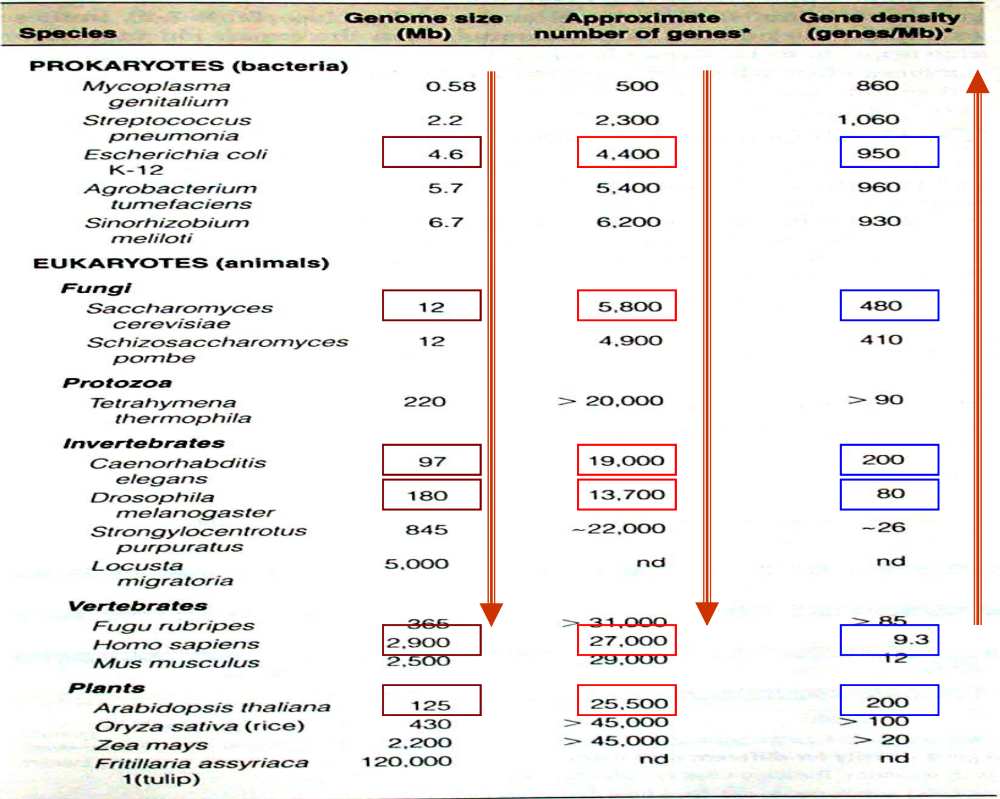
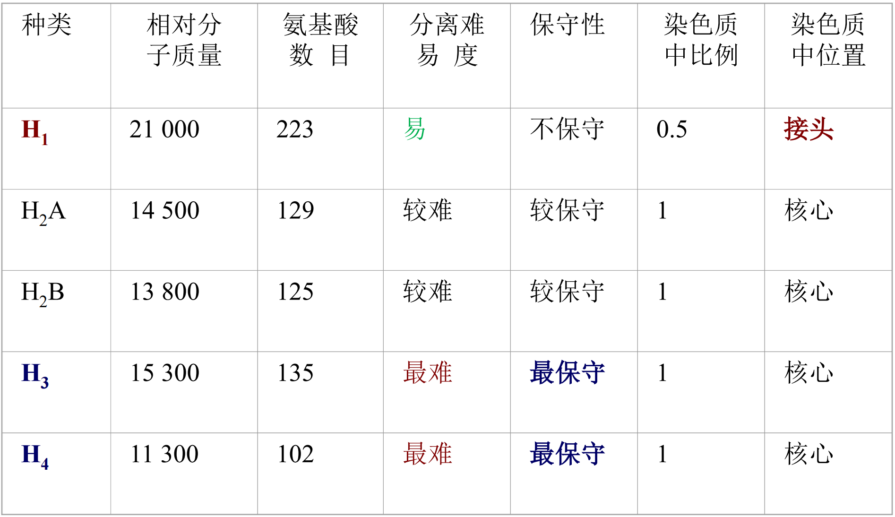
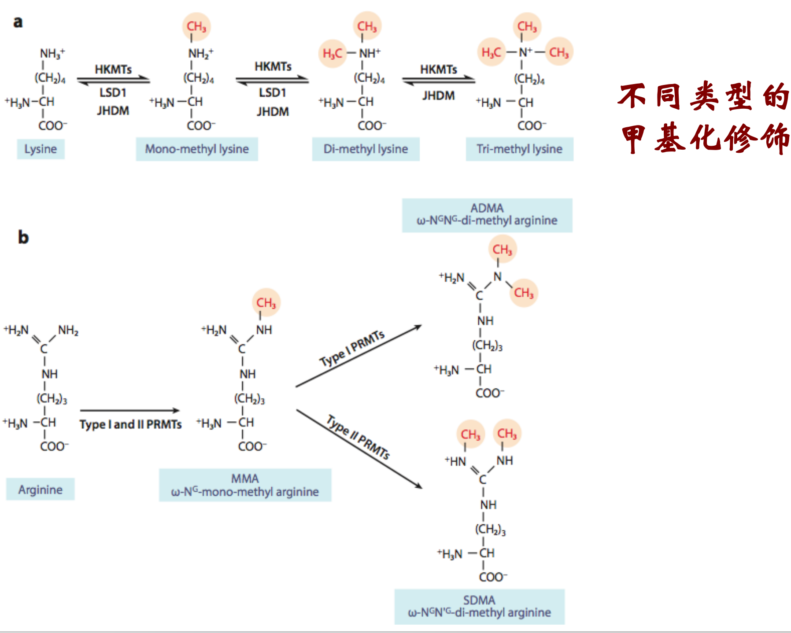
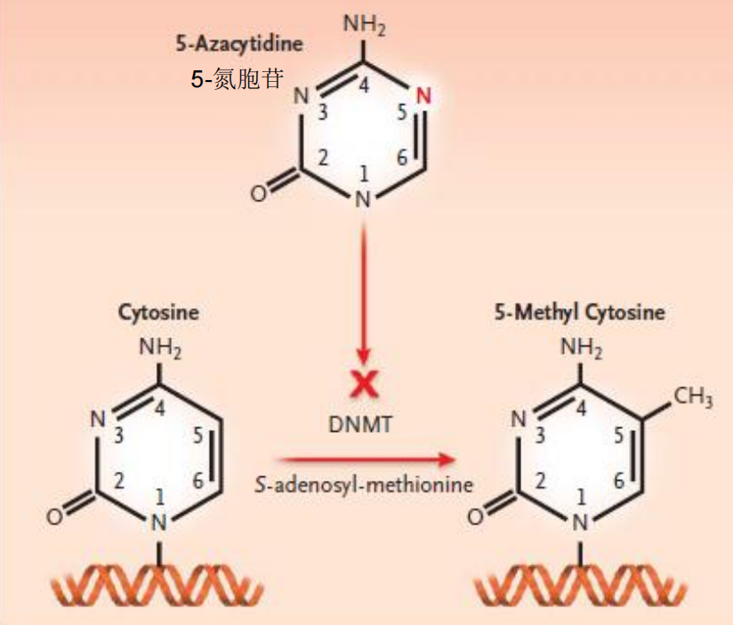
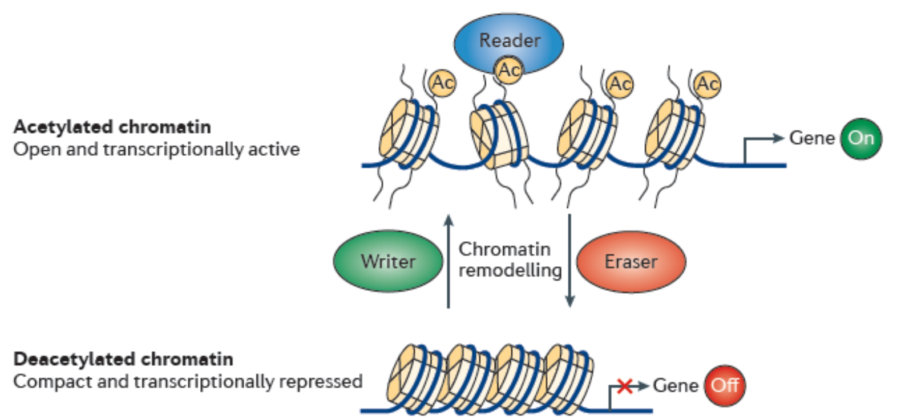
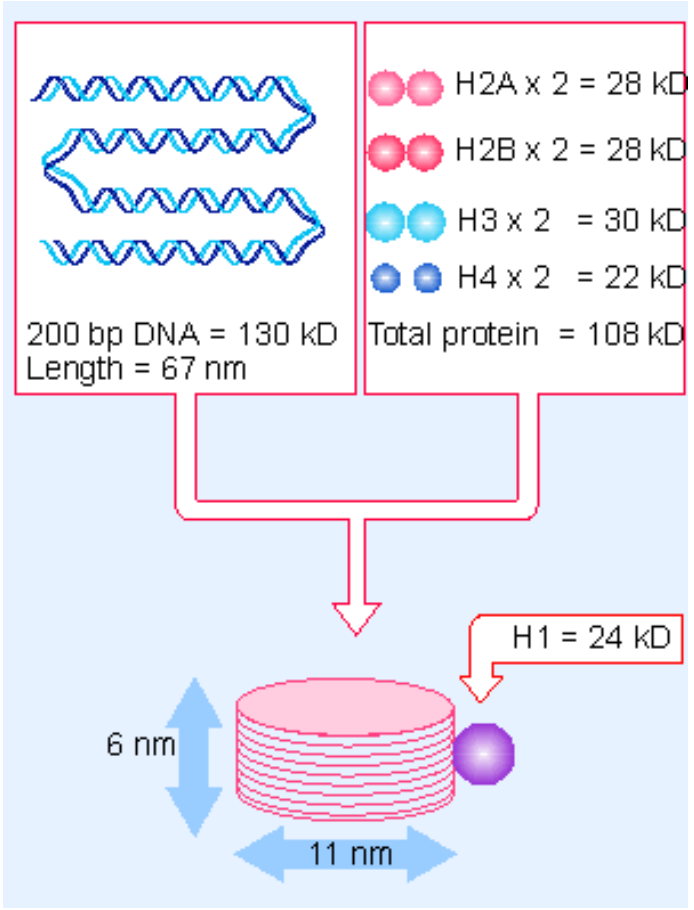
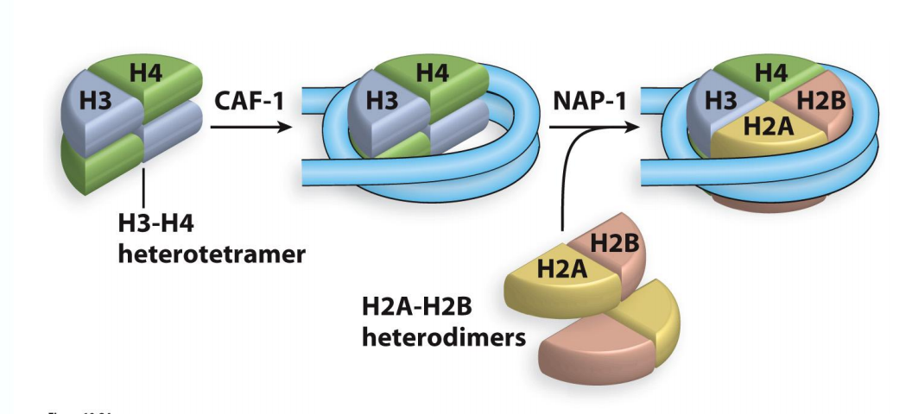
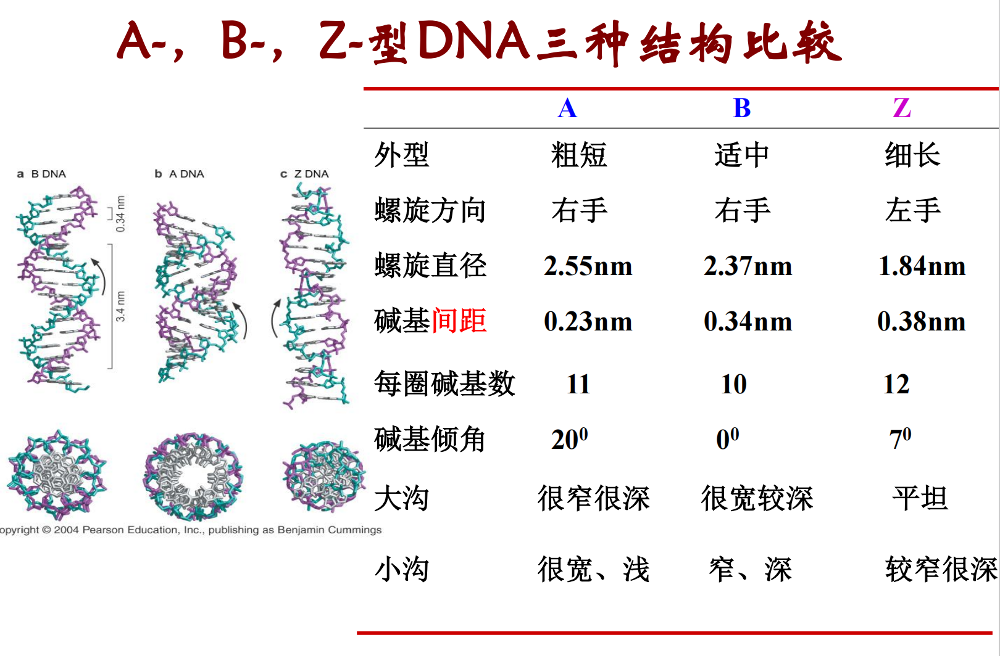
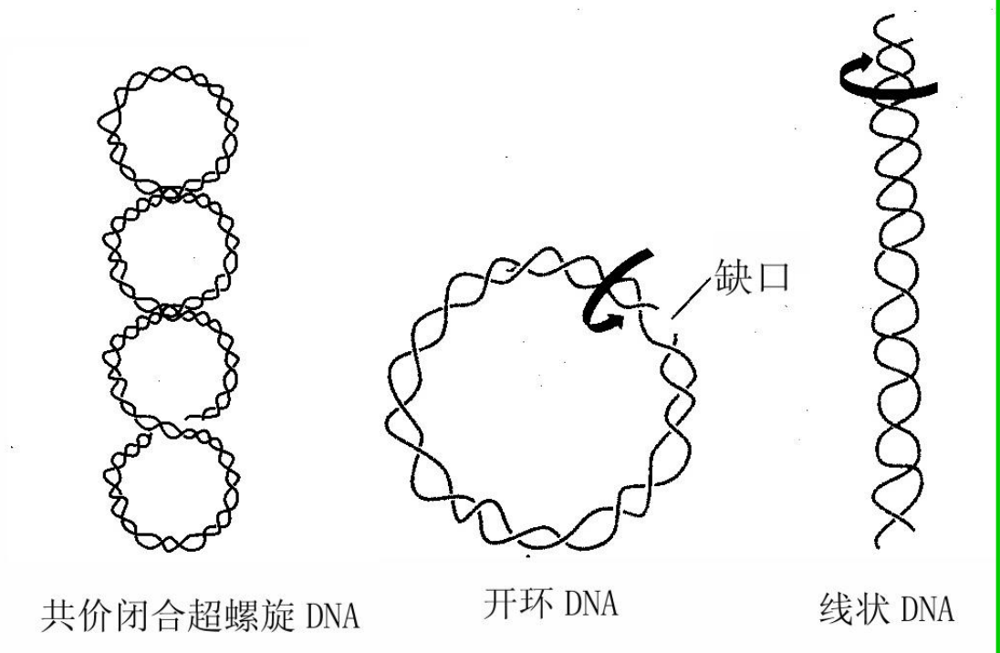

# 染色体与DNA

### 染色体

嘌呤和嘧啶的分子结构

核苷酸共价连接在一起形成多聚核苷酸链

染色体是遗传物质的主要载体，遗传物质以染色体的形式实现从亲代到子代的稳定传递

原核细胞和真核细胞的染色质比较
- 原核生物：拟核，每个原核细胞一般只有一个染色体，每个染色体含一个双链**环状**DNA
- 真核生物：集中在细胞核中，线粒体和叶绿体中均有各自的DNA。染色体只在细胞分裂过程中可在**光镜**下观察到，在较长的分裂间期以较细且松散的**染色质**形式存在于细胞核。

> 基因的关键概念：
> - *Genome: 由生物体内所有的染色体组成的*
> - *Genome size: the length of DNA associated with one **haploid** complement of chromosomes*
> - *Gene number: the number of genes included in a genome*
> - *Gene density: the average number of genes per **Mb** of genomic DNA*

各类生物的**最小基因数**随其复杂度而增加，但这个规律并不绝对

染色体的特征
1. 分子结构相对稳定
2. 能够自我复制，使亲子代之间保持连续性
3. 能够指导蛋白质的合成，从而控制整个生命过程
4. 能够发生可遗传的变异

染色体的组成：核酸和蛋白质

真核细胞染色体的组成：DNA，蛋白质，RNA(没有完成转录仍然和模板DNA相连接的，含量不到DNA的10%)
- 蛋白质：
  - *组蛋白(histone)：are conserved DNA-binding proteins of eukaryotes that form the nucleosome, the basic subunit of chromatin.*
    - 可以通过酸提取出来
    - 是染色体的结构蛋白，由H1(分子量最大)，H2A, H2b, H3, H4(分子量最少)，lys和arg的比例非常高 -> **修饰！**
    - 越难分离代表被组蛋白整体包裹，而好分离代表处在外侧
    
    

    - 特性：进化上极端保守，无组织特异性，肽链上氨基酸分布不对称(碱性氨基酸分布在N端，疏水基团分布在C端)，存在较普遍的修饰作用(甲基化、乙酰化、磷酸化、泛素化等)
    - 核心组蛋白共享一种共同的结构折叠模式：N端比较flexible(N terminal tail)，折叠之后会裸露在外面，这也是方便修饰的重点，*The histone tails emerge from the core of the nucleosome at specific positions, serving as the grooves of a screw to direct the DNA wrapping around the histone core in a **left-handed manner**.*
  - *非组蛋白：细胞核中组蛋白以外的酸性蛋白质*，含天门冬氨酸，谷氨酸等酸性蛋白，带负电，特点是既有多样性又有专一性，且含有组蛋白没有的色氨酸，是DNA复制RNA转录活动的调控因子
    - 酶：RNA合成酶、蛋白质磷酸化酶、组蛋白甲基化酶
    - 遗传信息的保持和表达调节：DNA结合蛋白、组蛋白结合蛋白和调节蛋白，HMG14，HMG17及许多酸性染色体蛋白质
      - HMG蛋白：能够和DNA结合但不牢固，能和H1作用，可能与DNA的超螺旋结构有关
      - DNA结合蛋白：是解链酶(unwinding enzyme)类中的一种类型，发现于原核生物的大肠杆菌细胞内，由相同亚基组成的四聚体，与单键DNA亲和力极大，与双链DNA结合力较差。相对分子量较低，占非组蛋白的20％，染色质的8％
    - 染色体的结构支持体：matrix protein，scaffold protein

##### 组蛋白修饰

  (P24)
- 甲基化（Methylation）
  - 是由组蛋白甲基化转移酶(histonemethyl transferase，HMT)完成的
  - 甲基化可发生在组蛋白的**赖氨酸(还包括三甲基化)**和**精氨酸(只有二甲基化和单甲基化)**残基上
  - 组蛋白的甲基化与基因激活和与基因沉默相关
  - 组蛋白的甲基化修饰方式是最稳定的(碳氮单键) -> 作为长期的表观遗传记忆
  - activation: H3K4,H3K36,H3K79 inactivation: H3k9,H3K27,H4K20

    

  - 对于DNA的甲基化修饰，一般发生在CpG island上面，植物可能会另有例外
    P30
  - 由DNA methyltransferases (DNMTs)实现

    

  - 甲基化的应用：启动子区的高甲基化导致抑癌基因失活是人类肿瘤所具有的共同特征之一

- 乙酰化
   - *Acetylation (ethanoylation in IUPAC nomenclature ) describes a reaction that introduces an acetyl functional group into a chemical compound (resulting in an acetoxy group乙酰氧基)*
  - *Deacetylation is the removal of the acetyl group*
  - 核心是发生在lysine上面，HAT/HDAC催化H3,H4特定赖氨酸残基的乙酰化／去乙酰化修饰，实现乙酰化水平的动态平衡；
  - 高乙酰化会导致转录活化：染色质上的紧密的部分打开
  - 低乙酰化会抑制转录活性

 

  - *Histone Acetyltransferases, also known as HATs, are a family of enzymes that acetylate the histone tails of the nucleosome.* 核内和核外的底物不同
    (P39)
  - 组蛋白去乙酰化酶 (HDACs)：There are a total of four classes of Histone Deacetylases (HDACs).

- 其他修饰方式：磷酸化、泛素化、腺苷酸化、ADP核糖基化等，通过多种修饰方式的组合,更为灵活的影响染色质的结构与功能。所以有人称这些能被专识别的修饰信息为组蛋白密码，各种修饰间也存在着相互的关联

> 组蛋白乙酰基转移酶的发现——活性胶内分析
> - 先把细胞中的蛋白通过 SDS-PAGE 按分子量分开，但胶里预先加入组蛋白作为底物。电泳结束后，让胶中的蛋白尽可能复性，再加入带标记的乙酰辅酶 A（acetyl-CoA）。如果某个位置上的蛋白具有 HAT 活性，它就会把乙酰基转移给附近的组蛋白

### DNA的结构

真核细胞基因组的最大特点是它含有大量的重复序列，而且功能DNA序列大多被不编码蛋白质的非功能DNA所隔开。

染色质和核小体：由DNA和组蛋白组成的染色质纤维细丝是许多核小体连成的念珠状结构。

*Tm值：DNA在260 nm吸光度增加到最大值一半时的温度成为DNA的解链温度或熔点。*
- G+C的含量：越多Tm值越高
- 溶液中的离子强度：阳离子浓度越高，Tm值越高
- DNA的均一性：宽泛或者确定
- 染色质由DNA和蛋白质组成的实验证据
  - 染色质DNA的**Tm值**比自由DNA高，说明在染色质中DNA极可能与蛋白质分子相互作用
  - 在染色质状态下，由DNA聚合酶和RNA聚合酶催化的DNA复制和转录活性大大低于在自由DNA中的反应
  - DNA酶I（DNaseI）对染色质DNA的消化远远慢于对纯DNA的作用
  - 实验证据：用小球菌核酸酶处理染色质以后进行电泳，便可以得到一系列片段，这些被保留的DNA片段均为200bp基本单位的倍数。

*Nucleosome (核小体) 是染色质的基本结构单位，由~200 bp DNA和组蛋白八聚体组成*
- 146bp DNA + Histone octamer (组蛋白八聚体) -> Nucleosome core (核小体核心) + H1 -> Chromatosome (染色小体166bp) + linker DNA -> Nucleosome (核小体) (~200 bp of DNA)
- DNA以左手超螺旋方式绕核心约 1.65圈（147 bp）
  
  

- 核小体更喜欢结合弯曲的DNA（bent DNA）
- 核小体的组装
  1. 亲代核小体解聚与H3-H4的回收：复制叉经过后，组蛋白亚基释放
  2. H3-H4四聚体优先沉积在新合成的DNA上：伴侣蛋白递送H3-H4四聚体优先递送到刚复制出来的DNA子链上，与DNA复制几乎同时发生
  3. H2B-H2A二聚体随后沉积：NAP1伴侣蛋白递送H2A-H2B，略微落后第二步
  
  

- 高级染色质结构的形成
  1. 组蛋白H1与核小体之间的连接DNA结合，促使DNA更紧密地缠绕在核小体上
    - H1的加入会抑制转录
  2. 核小体阵列可以形成更复杂的结构
    - 30 nm fibers(宽度) have 6 nucleosomes/turn, organized into a solenoid.
    - Histone H1 and histone N-terminal tails are required for formation of the 30 nm fiber.
    - This fiber is the basic constituent of both interphase chromatin and mitotic chromosomes
  3. DNA的进一步压缩涉及核小体DNA形成的大环结构

DNA包装成染色体的重要性
- Chromosome is a compact form of the DNA that readily fits inside the cell.
- To protect DNA from damage
- DNA in a chromosome can be transmitted efficiently to both daughter cells during cell division.
- Chromosome confers an overall organization to each molecule of DNA, which facilitates gene expression,DNA replication, DNA repair, as well as recombination.
  
真核生物基因组的结构特点：
1. 真核基因组庞大
2. 存在大量的重复序列
3. 大部分为非编码序列
4. 转录产物为单顺反子
5. 真核基因是断裂基因，有内含子
6. 存在大量的顺式作用元件
7. 存在大量的DNA多态性
8. 具有端粒(telomere)结构。保护线性DNA的完整复制、保护染色体末端和决定细胞的寿命等功能。

原核生物基因组
1. 原核生物基因主要是单拷贝基因，只有很少数基因〔如rRNA基因〕以多拷贝形式存在
2. 整个染色体DNA几乎全部都由功能基因与调控序列所组成
3. 几乎每个基因序列都与他所编码的蛋白序列呈线性对应状态

原核生物DNA
- 结构简炼
- 存在转录单元：功能相关的RNA和蛋白质基因，往往丛集在基因组的一个或几个特定部位，形成转录单元, 并转录产生含多个 mRNA的分子，称为多顺反子mRNA。
- 有重叠基因：同一段DNA能携带两种不同蛋白质的信息

- DNA的一级结构：4种核苷酸的连接及其排列顺序，表示了该DNA分子的化学构成
- DNA的二级结构：双螺旋模型
  - DNA是由两条互相平行的脱氧核苷酸长链盘绕而成的。
  - DNA分子中的脱氧核糖和磷酸交替连接，排在外侧，构成基本骨架，碱基排列在内侧。
> Chargaff’s Rules A=T G=C

  - 右手螺旋DNA:
    - B-DNA（最常见的DNA构象）: A-T丰富的DNA片段
    - A-DNA（对基因表达有重要意义）：DNA-RNA(处于转录状态的DNA)，RNA-RNA (dsRNA)
- DNA的高级结构：super-coiled，正超螺旋和负超螺旋，在特殊情况下可以互相转变
  - DNA在细胞当中往往以负超螺旋形式，正超螺旋出现在复制叉前端
  - Topoisomerases can relax supercoiled DNA

质粒的不同构象
- 研究细菌质粒DNA时发现，天然状态下该DNA以负超螺旋为主，稍被破坏即出现开环结构，两条链均断开则呈线性结构。

  

- 不同构象的质粒具有不同的迁移率；超螺旋DNA迁移率>线性DNA迁移率>开环的DNA迁移率

DNA的特殊结构
- 三链结构
- 四链结构
    
### DNA的复制

### 原核和真核生物DNA的复制特点

### DNA的损伤修复