# 染色体与DNA

### 染色体

嘌呤和嘧啶的分子结构(要能够认出四种碱基)

核苷酸共价连接在一起形成多聚核苷酸链

染色体是遗传物质的主要载体，遗传物质以染色体的形式实现从亲代到子代的稳定传递

原核细胞和真核细胞的染色质比较
- 原核生物：拟核，每个原核细胞一般只有一个染色体，每个染色体含一个双链**环状**DNA
- 真核生物：集中在细胞核中，线粒体和叶绿体中均有各自的DNA。染色体只在细胞分裂过程中可在**光镜**下观察到，在较长的分裂间期以较细且松散的**染色质**形式存在于细胞核。

> 基因的关键概念：
> - *Genome: 由生物体内所有的染色体组成的*
> - *Genome size: the length of DNA associated with one **haploid** complement of chromosomes，与单倍体染色体组相关的DNA长度*
> - *Gene number: the number of genes included in a genome，基因组中包含的基因数量*
> - *Gene density: the average number of genes per **Mb** of genomic DNA，每兆碱基（Mb）基因组DNA的平均基因数*

各类生物的**最小基因数**随其复杂度而增加，但这个规律并不绝对

染色体的特征
1. 分子结构相对稳定
2. 能够自我复制，使亲子代之间保持连续性
3. 能够指导蛋白质的合成，从而控制整个生命过程
4. 能够发生可遗传的变异

染色体的组成：核酸和蛋白质

真核细胞染色体的组成：DNA，蛋白质，RNA(没有完成转录仍然和模板DNA相连接的，含量不到DNA的10%)
- 蛋白质：
  - *组蛋白(histone)：are conserved DNA-binding proteins of eukaryotes that form the nucleosome, the basic subunit of chromatin.是真核生物中保守的DNA结合蛋白，构成染色质的基本亚单位*
    - 可以通过酸提取出来
    - 是染色体的结构蛋白，由H1(分子量最大)，H2A, H2b, H3, H4(分子量最少)，lys和arg的比例非常高 -> **修饰！**
    - 越难分离代表被组蛋白整体包裹，而好分离代表处在外侧
    
    

    - 特性：进化上极端保守，无组织特异性，肽链上氨基酸分布不对称(碱性氨基酸分布在N端，疏水基团分布在C端)，存在较普遍的修饰作用(甲基化、乙酰化、磷酸化、泛素化等)
    - 核心组蛋白共享一种共同的结构折叠模式：N端比较flexible(N terminal tail)，折叠之后会裸露在外面，这也是方便修饰的重点，*组蛋白尾巴从核小体核心的特定位置伸出，如同螺纹一般，引导 DNA 以**左手螺旋**的方式缠绕在组蛋白核心上.*
  - *非组蛋白：细胞核中组蛋白以外的酸性蛋白质*，含天门冬氨酸，谷氨酸等酸性蛋白，带负电，特点是既有多样性又有专一性，且含有组蛋白没有的色氨酸，是DNA复制RNA转录活动的调控因子
    - 酶：RNA合成酶、蛋白质磷酸化酶、组蛋白甲基化酶
    - 遗传信息的保持和表达调节：DNA结合蛋白、组蛋白结合蛋白和调节蛋白，HMG14，HMG17及许多酸性染色体蛋白质
      - HMG蛋白：能够和DNA结合但不牢固，能和H1作用，可能与DNA的超螺旋结构有关
      - DNA结合蛋白：是解链酶(unwinding enzyme)类中的一种类型，发现于原核生物的大肠杆菌细胞内，由相同亚基组成的四聚体，与单键DNA亲和力极大，与双链DNA结合力较差。相对分子量较低，占非组蛋白的20％，染色质的8％
    - 染色体的结构支持体：matrix protein，scaffold protein
- DNA:
  - 甲基化：DNA甲基化主要发生在富含GC的序列（CpG岛）上，非CpG位点（CpH，其中H代表A、T或C）的胞嘧啶甲基化在植物中普遍存在，在哺乳细胞中较为罕见，由DNA methyltransferases (DNMTs)实现

    

  - DNA甲基化的特点：GC富集的区域一般是在启动子上；DNA 甲基化通常导致基因转录受到抑制
  - 甲基化的应用：启动子区的高甲基化导致抑癌基因失活是人类肿瘤所具有的共同特征之一

##### 组蛋白修饰

就是所有组蛋白的N-terminal tail都会伸出去，然后方便被修饰

组蛋白的修饰改变染色质的功能
- 赖氨酸(Lysine)的乙酰化(形成50余种异构体)
- 丝氨酸(Serine)(H3，H4，H2B)的磷酸化
- 赖氨酸和精氨酸(H3 和 H4)的甲基化
- 赖氨酸的泛素化

- 甲基化（Methylation）
  - 是由组蛋白甲基化转移酶(histonemethyl transferase，HMT)完成的
  - 甲基化可发生在组蛋白的**赖氨酸(还包括三甲基化)**和**精氨酸(只有二甲基化和单甲基化)**残基上
  - 组蛋白的甲基化与基因激活和与基因沉默相关
  - 组蛋白的甲基化修饰方式是最稳定的(碳氮单键) -> 作为长期的表观遗传记忆
  - activation: H3K4,H3K36,H3K79 inactivation: H3k9,H3K27,H4K20
  - H3R2,H3R8,H3R17,H3R26,H4R3（这些应该都是精氨酸）

    

  - 两个核心酶
    - KMTs: lysine methyltransferases
    - KDMs: lysine demethyltransferases

- 乙酰化
   - *Acetylation (ethanoylation in IUPAC nomenclature ) describes a reaction that introduces an acetyl functional group into a chemical compound (resulting in an acetoxy group乙酰氧基)*
  - *Deacetylation is the removal of the acetyl group*
  - 核心是发生在lysine上面，HAT/HDAC催化H3,H4特定赖氨酸残基的乙酰化／去乙酰化修饰，实现乙酰化水平的动态平衡，他的乙酰化去乙酰化调控是可逆的而且是被精密调控的；
  - 组蛋白乙酰基转移酶(HAT)/组蛋白去乙酰化酶(HDAC)
  - 高乙酰化会导致转录活化：染色质上的紧密的部分打开(组蛋白尾部结构域的乙酰化会抑制核小体阵列折叠形成染色质的二级和三级结构)
  - 低乙酰化会抑制转录活性

 

  - *组蛋白乙酰转移酶（也称为 HATs）是一类能够对核小体组蛋白尾部进行乙酰化修饰的酶* 核内和核外的底物不同
    (P39)
  - 组蛋白去乙酰化酶 (HDACs)：There are a total of four classes of Histone Deacetylases (HDACs).
  - 组蛋白乙酰化／去乙酰化参与的功能:转录激活、转录延伸；DNA修复、拼接、复制；染色体的组装；基因沉默；某些疾病的形成；细胞的信号转导；基因组的整体乙酰化

- 其他修饰方式：磷酸化、泛素化、腺苷酸化、ADP核糖基化等，通过多种修饰方式的组合,更为灵活的影响染色质的结构与功能。所以有人称这些能被专识别的修饰信息为组蛋白密码，各种修饰间也存在着相互的关联

> 组蛋白乙酰基转移酶的发现——活性胶内分析
> - 先把细胞中的蛋白通过 SDS-PAGE 按分子量分开，但胶里预先加入组蛋白作为底物。电泳结束后，让胶中的蛋白尽可能复性，再加入带标记的乙酰辅酶 A（acetyl-CoA）。如果某个位置上的蛋白具有 HAT 活性，它就会把乙酰基转移给附近的组蛋白

> **专栏：提到的所有酶的名称功能总结**
> | 缩写 | 全称 | 中文 | 主要底物 | 做什么 |
> |---|---|---|---|---|
> | **KMT** | Lysine Methyltransferase | 赖氨酸甲基转移酶 | 蛋白质上的 **Lys/K**，常见于组蛋白 | **加甲基** |
> | **KDM** | Lysine Demethylase | 赖氨酸去甲基化酶 | 甲基化的 Lys | **去甲基** |
> | **DNMT** | DNA Methyltransferase | DNA 甲基转移酶 | **DNA**，主要是胞嘧啶 C | **给 DNA 加甲基** |
> | **HMT** | Histone Methyltransferase | 组蛋白甲基转移酶 | **组蛋白** | **给组蛋白加甲基** |
> | **HAT** | Histone Acetyltransferase | 组蛋白乙酰转移酶 | 组蛋白上的 **Lys** | **加乙酰基** |
> | **HDAC** | Histone Deacetylase | 组蛋白去乙酰化酶 | 乙酰化的组蛋白 Lys | **去乙酰基** |

### DNA的结构

##### 真核细胞DNA

真核细胞基因组的最大特点是它含有大量的重复序列，而且功能DNA序列大多被不编码蛋白质的非功能DNA所隔开。

染色质和核小体：由DNA和组蛋白组成的染色质纤维细丝是许多核小体连成的念珠状结构。

*Tm值：DNA在260 nm吸光度增加到最大值一半时的温度成为DNA的解链温度或熔点。*
- G+C的含量：越多Tm值越高
- 溶液中的离子强度：阳离子浓度越高，Tm值越高
- DNA的均一性：宽泛或者确定

染色质由DNA和蛋白质组成的实验证据
- 染色质DNA的**Tm值**比自由DNA高，说明在染色质中DNA极可能与蛋白质分子相互作用
- 在染色质状态下，由DNA聚合酶和RNA聚合酶催化的DNA复制和转录活性大大低于在自由DNA中的反应
- DNA酶I（DNaseI）对染色质DNA的消化远远慢于对纯DNA的作用
- 实验证据：用小球菌核酸酶处理染色质以后进行电泳，便可以得到一系列片段，这些被保留的DNA片段均为200bp基本单位的倍数。

*Nucleosome (核小体) 是染色质的基本结构单位，由~200 bp DNA和组蛋白八聚体组成*
- 146bp DNA + Histone octamer (组蛋白八聚体) -> Nucleosome core (核小体核心) + H1 -> Chromatosome (染色小体166bp) + linker DNA -> Nucleosome (核小体) (~200 bp of DNA)
- DNA以左手超螺旋方式绕核心约 1.65圈（147 bp）
  
  

核小体更喜欢结合弯曲的DNA（bent DNA）
- G-C rich的链可能往往在缠绕的外侧
核小体的组装
1. 亲代核小体解聚与H3-H4的回收：复制叉经过后，组蛋白亚基释放
2. H3-H4四聚体优先沉积在新合成的DNA上：伴侣蛋白递送H3-H4四聚体优先递送到刚复制出来的DNA子链上，与DNA复制几乎同时发生
3. H2B-H2A二聚体随后沉积：NAP1伴侣蛋白递送H2A-H2B，略微落后第二步
  
  

高级染色质结构的形成
1. 组蛋白H1与核小体之间的连接DNA结合，促使DNA更紧密地缠绕在核小体上
  - H1的加入会抑制转录
2. 核小体阵列可以形成更复杂的结构
  - 30 nm fibers(宽度) have 6 nucleosomes/turn, organized into a solenoid(螺线管).
  - Histone H1 and histone N-terminal tails are required for formation of the 30 nm fiber.
  - This fiber is the basic constituent of both interphase chromatin and mitotic chromosomes
3. DNA的进一步压缩涉及核小体DNA形成的大环结构

DNA包装成染色体的重要性
- Chromosome is a compact form of the DNA that readily fits inside the cell.
- To protect DNA from damage
- DNA in a chromosome can be transmitted efficiently to both daughter cells during cell division.
- Chromosome confers an overall organization to each molecule of DNA, which facilitates gene expression,DNA replication, DNA repair, as well as recombination.
  
真核生物基因组的结构特点：
1. 真核基因组庞大
2. 存在大量的重复序列
3. 大部分为非编码序列
4. 转录产物为单顺反子
5. 真核基因是断裂基因，有内含子
6. 存在大量的顺式作用元件
7. 存在大量的DNA多态性
8. 具有端粒(telomere)结构。保护线性DNA的完整复制、保护染色体末端和决定细胞的寿命等功能。

##### 原核细胞DNA

原核生物基因组
1. 原核生物基因主要是单拷贝基因，只有很少数基因〔如rRNA基因〕以多拷贝形式存在
2. 整个染色体DNA几乎全部都由功能基因与调控序列所组成
3. 几乎每个基因序列都与他所编码的蛋白序列呈线性对应状态

原核生物DNA
- 结构简炼
- 存在转录单元：功能相关的RNA和蛋白质基因，往往丛集在基因组的一个或几个特定部位，形成转录单元, 并转录产生含多个 mRNA的分子，称为多顺反子mRNA。
- 有重叠基因：同一段DNA能携带两种不同蛋白质的信息

##### DNA的结构

DNA的一级结构：4种核苷酸的连接及其排列顺序，表示了该DNA分子的化学构成
- 多聚核苷酸链中新生磷酸糖苷键的产生过程
  - 单核苷酸5’-磷酸基团向核酸链的3’-OH发起进攻
DNA的二级结构：双螺旋模型
- DNA是由两条互相平行的脱氧核苷酸长链盘绕而成的。
- DNA分子中的脱氧核糖和磷酸交替连接，排在外侧，构成基本骨架，碱基排列在内侧
- 两条链上的碱基通过氢键相结合，形成碱基对
> Chargaff’s Rules A=T G=C

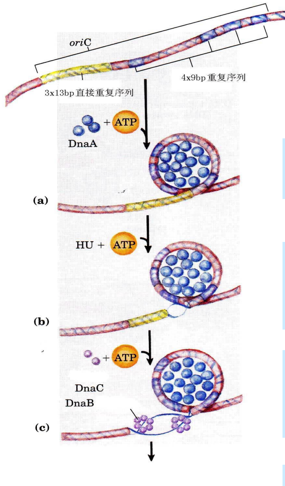

- 右手螺旋DNA:
  - B-DNA（最常见的DNA构象）: A-T丰富的DNA片段
  - A-DNA（对基因表达有重要意义）：DNA-RNA(处于转录状态的DNA)，RNA-RNA (dsRNA)
- *DNA的高级结构：指DNA双螺旋进一步扭曲盘绕所形成的特定空间结构*
  - super-coiled，正超螺旋和负超螺旋，在特殊情况下可以互相转变
  - DNA在细胞当中往往以负超螺旋形式，正超螺旋出现在复制叉前端
  - Topoisomerases can relax supercoiled DNA

质粒的不同构象
- 研究细菌质粒DNA时发现，质粒天然状态下该DNA以负超螺旋为主，稍被破坏即出现开环结构，两条链均断开则呈线性结构。

  

- 不同构象的质粒具有不同的迁移率；超螺旋DNA迁移率>线性DNA迁移率>开环的DNA迁移率

DNA的特殊结构
- 三链结构
- 四链结构
    
### DNA的复制

染色体结构的改变使蛋白质可以接触DNA
- 染色质重塑复合物改变DNA环绕核小体的位置（chromatin remodeler）：利用水解ATP的能量来改变DNA环绕核小体位置的蛋白质机器
  
  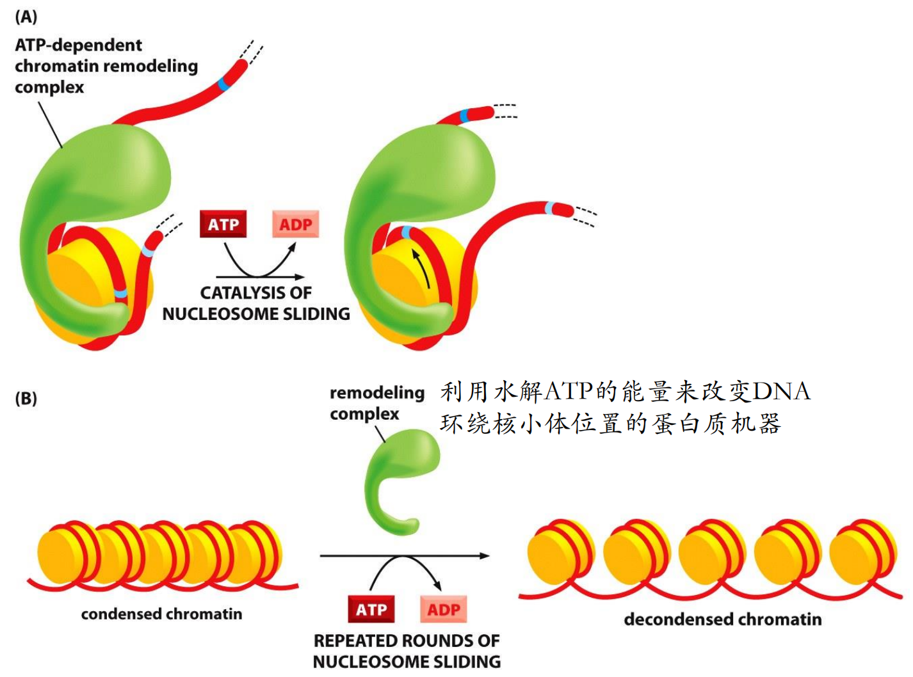

  - 由多个亚基组成，其中一个亚基有水解ATP的能力，所以整个过程是ATP dependent的
  
  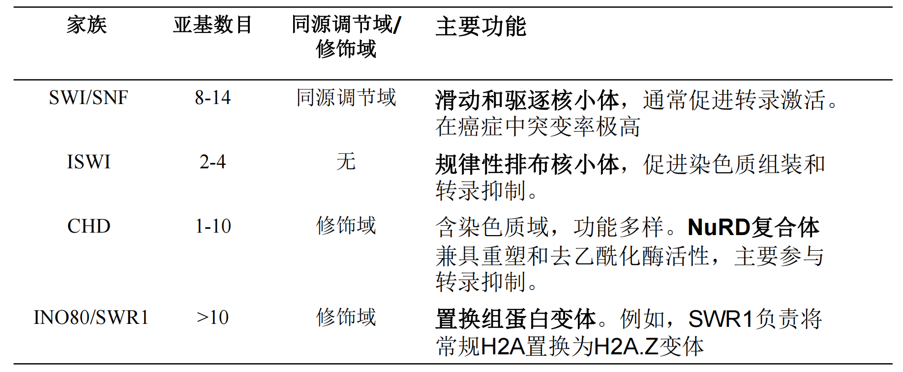

- 组蛋白可逆的化学修饰改变染色质结构，染色质重塑复合物中会包括reader domain，可以识别组蛋白修饰然后进行作用

> - 复制子(Replicon)
> - 复制叉(Replication fork)
> - DNA的半保留复制 (Semi-conservative replication)
> - DNA的半不连续复制(semi-discontinuous replication)
> - 冈崎片断(Okazaki fragment)
> - DNA聚合酶(DNA polymerase)
> - 基因突变(DNA mutation)

*DNA的复制：生命的遗传是染色体DNA自我复制的结果; 染色体DNA的自我复制主要是通过半保留复制(Semi-conservative)来实现的，是一个以亲代DNA分子为模板合成子代DNA链的过程。*

预测的DNA复制模型：1）半保留；2）色散；3）保留

证实DNA复制模型的实验：区分半保留和色散用的是高温解链

*DNA的半保留复制：DNA在复制过程中，每条链分别作为模板合成新链，产生互补的两条链。这样新形成的两个DNA分子与原来DNA分子的碱基顺序完全一样。因此，每个子代分子的一条链来自亲代DNA，另一条链则是新合成的*
- DNA的半保留复制保证了DNA在代谢上的稳定性，与DNA的遗传功能相符合。

*复制叉：复制时，双链DNA要解开成两股链分别进行，所以，复制起点呈叉子形式，被称为复制叉*

*复制子：DNA的复制是由固定的起始点开始的。一般把生物体的复制单位称为复制子*
- 一个复制子只含有一个复制起始点
- 原核生物的DNA分子都是由一个复制子完成复制，复制子的移动速度非常快
- 真核生物基因组可以同时在多个复制起点上进行复制，包含多个复制子，会形成复制泡，复制开始的越早复制泡越大

### 原核和真核生物DNA的复制特点

##### 原核生物DNA的复制

John Cairns’ experiment:
- E. coli has a circular chromosome
- E. coli has a single origin of replication
- In E. coli, replication and unwinding are simultaneous
- 形成了一个theta form

通过同位素标记进一步发现复制方向是双向复制：无论是原核生物还是真核生物，DNA的复制主要是从固定的起始点以双向等速复制方式进行的

DNA的合成
- DNA聚合酶的方向是5‘-> 3‘

*DNA的半不连续复制：前导链的连续复制和滞后链的不连续复制*

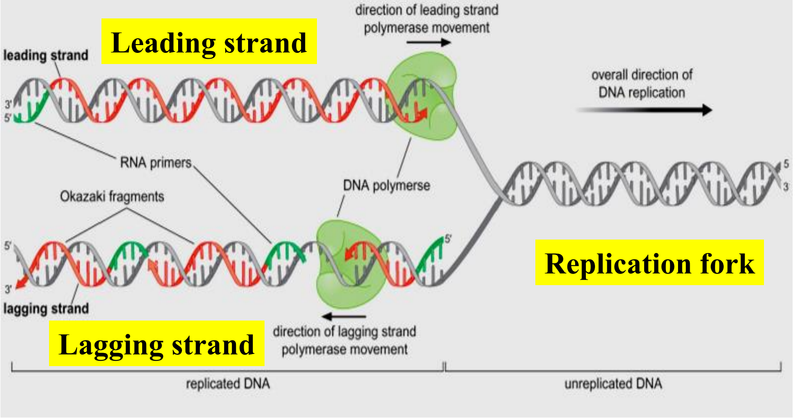

> 半不连续复制的实验
> - [3H] Thymidine pulse-chase labeling and alkaline sucrose gradient
> 1. 用3H脱氧胸苷短时间标记后提取DNA，得到不少平均长度为2-3 kb DNA片段
> 2. 用DNA连接酶温度敏感突变株进行实验，在连接酶不起作用的温度下，有大量小片段累积，说明复制过程中至少有一条链首先合成较短的片段，然后再生成大分子DNA
> - 碱性蔗糖梯度:一种常用于分子生物学中的离心技术，特别是在DNA片段分离和分析中。通过在碱性条件下使用蔗糖浓度梯度，可以有效分离不同大小或密度的核酸分子

原核生物大概是1000个，真核生物大概是200个

*The short discontinuous segments are called Okazaki Fragments.*

DNA复制的体系
- 亲代DNA分子为模板
- 四种脱氧三磷酸核苷(dNTP)为底物
- 提供3’-OH末端的引物
- 多种酶及蛋白质
- DNA拓扑异构酶(解开超螺旋)、DNA解链酶、单链结合蛋白、引物酶、 DNA聚合酶、RNA酶以及DNA连接酶等

**DNA复制的起始(initiation)**
- 复制起始原点
  - AT pair比较多，因为打开容易，比较容易解旋
  - 大肠杆菌基因组的复制原点位于天冬酰胺合酶和ATP合酶操纵子之间，全长245 bp, 称为oriC。
- DNA双螺旋的解旋
  - DNA解旋酶解开双链
  - 单链DNA结合蛋白保持单链的存在，防止在复制完成前和其他链配对
  - 解开复制叉运动过程中形成的正超螺旋，由拓扑异构酶打开
  - 引物酶：合成一小段RNA引物，为DNA新链的合成提供3’-OH末端，The primase is a type of RNA polymerase (α) that synthesizes short segments of RNA that will be used as primers for DNA replication
  - DNA合成所需的底物：1) 四种脱氧核苷三磷酸（dNTPs）：dATP、dGTP、dCTP、dTTP，是构成DNA链的基本单元。2) 模板链：单链DNA，指导新链的合成顺序。3) 引物：提供游离的3’-羟基末端，供DNA聚合酶起始合成。4) 镁离子（Mg²⁺）：DNA聚合酶活性所必需的辅因子。
  
  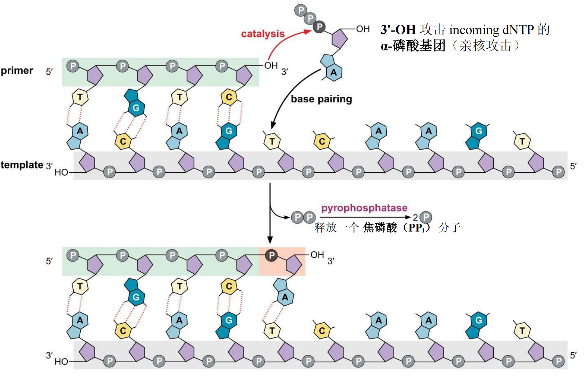

**DNA复制的引发**
1. 大约20个DnaA蛋白在ATP的作用下与oriC处的4个9 bp保守序列相结合
2. 在Hu蛋白和ATP的共同作用下，DnaA复制起始复合物使3x13 bp直接重复序列变形，形成开链。
3. DnaB（解链酶）六体分别与单链DNA相结合（需要DnaC的帮助）进一步解开DNA双链。
4. 与引物结合，起始DNA复制。
  
  

**DNA链的延伸**
- DNA聚合酶，DNA polymerase use a single active site to catalyze DNA synthesis，催化中心在手掌部分
  - palm domain
    1. 两个催化中心，一个用于添加 dNTP，另一个用于切除错配的 dNTP.
    2. 聚合位点结合两个金属离子，这些离子改变催化位点周围的化学环境并引发催化反应.
    3. 通过与新合成 DNA 的小沟形成广泛的氢键接触，监测最近添加的核苷酸的碱基配对准确性
  - Finger domain:
    1. 结合进入的 dNTP，并将正确配对的 dNTP 封闭于催化位点
    2. 弯曲模板，使模板上准备与进入的核苷酸形成碱基对的那个核苷酸暴露出来.
    3. DNA聚合酶会有一个构象上的转变，finger domain的o-helix从open domain到closed domain
  - Thumb domain
    1. 让新合成的DNA保持在一个正常的有活性的位置，从而可以提高DNA聚合酶的持续催化能力
    > Processivity: 持续合成能力是作用于聚合物底物的酶的一种特性。对于DNA聚合酶而言，持续合成能力的程度定义为：酶每次结合到引物-模板连接处时所添加的核苷酸的平均数量。
    - DNA聚合酶具有持续合成能力：1) DNA 聚合酶能够沿着 DNA 模板滑动，这种能力有助于提高其过程性；2) DNA 聚合酶还可以通过与“滑动夹（sliding clamp）”蛋白相互作用，进一步提高其过程性；这种滑动夹会完整地环绕 DNA
- 滑动夹（Sliding DNA clamp）
  1. 保证DNA聚合酶一直沿着DNA移动，然后保证他的持续合成能力和延伸能力
  2. The composition of the DNA Pol III holoenzyme
  3. Three enzymes: Two copies of the DNA Pol III core enzyme，One copy of the γ-complex
   
    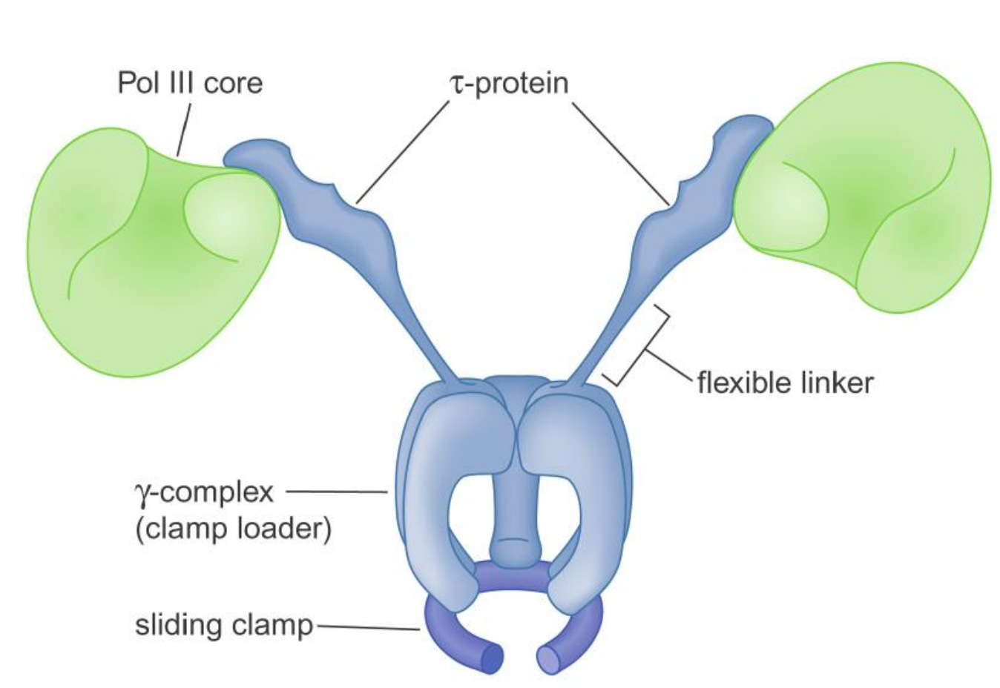

  4. 具体loading的过程还依赖一个loader蛋白：
   
    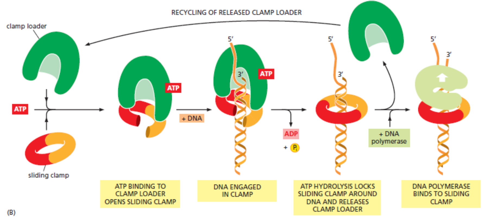

- RNase H(特异性地水解DNA-RNA杂合链中的RNA) + FEN1 (真核,在原核生物中是DNA聚合酶 I), 复制完成后切除RNA引物 
  - 从新合成的 DNA 上移除 RNA 引物
  - 切除后，核酸外切酶（exonuclease）移除最后一个核糖核苷酸
  - DNA 聚合酶填补空隙，但在 3'-OH 与 5'-磷酸基团之间的骨架上留下一处断裂
 - 小的nick用DNA连接酶连接上

    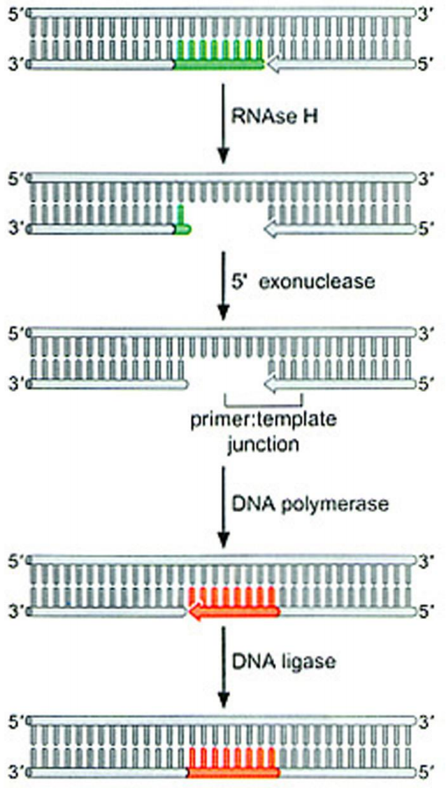

- 复制叉是不对称的
  
    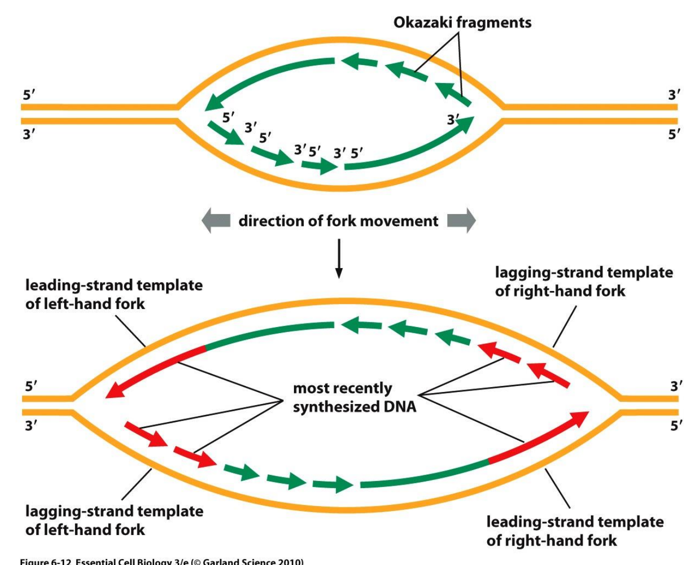

  - 大肠杆菌复制叉处由两个DNA聚合酶协调复制的“长号”模型

    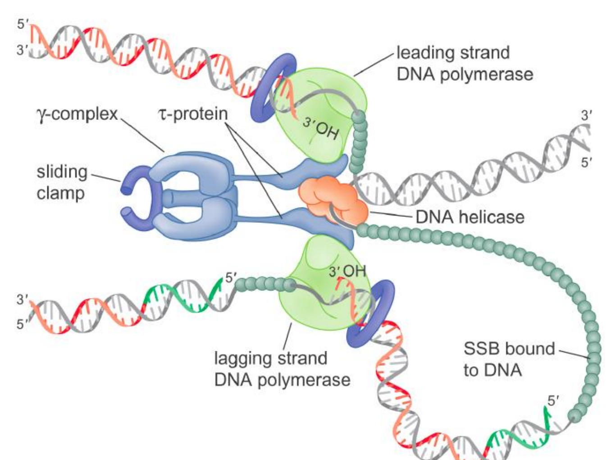

  - 两边的复制叉上的这个DNA聚合酶是independent的工作的

**DNA复制的终止**
- 当复制叉前移，遇到20 bp重复性终止子序列 (Ter) 时，Tus蛋白(Terminus utilization substance)与 Ter序列结合，形成 Tus-Ter 复合物
- Ter-Tus复合物 能抑制解旋酶（DnaB）的活性，阻挡复制叉的继续前移，等到相反方向的复制叉到达后，在DNA拓扑异构酶IV的作用下使复制叉解体，释放子链DNA
  
  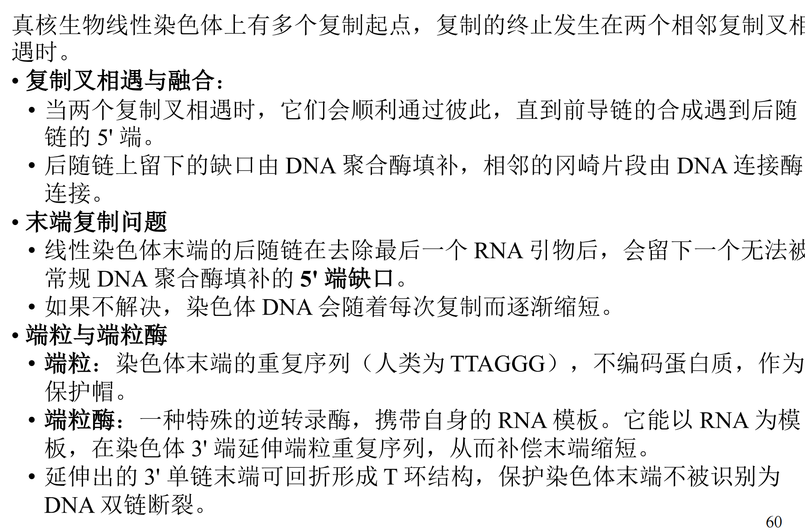

**原核生物DNA的复制特点**
- 细菌染色体的复制是作为一个单位从唯一的复制起点开始，双向进行的

**原核生物DNA聚合酶的种类**
- DNA聚合酶I (coded by polA)不是复制大肠杆菌染色体的主要聚合酶，它有 3’ →5’核酸外切酶活性,保证了DNA复制的准确性。它的5’ →3’核酸外切酶活性也可用来除去冈崎片段5'端RNA引物，使冈崎片段间缺口消失，保证连接酶将片段连接起来。
- DNA聚合酶II生理功能主要是起修复DNA的作用
- DNA聚合酶III (coded by polC)包含有7种不同的亚单位和9个亚基，其生物活性形式为二聚体，活性最强，主导聚合酶
  
  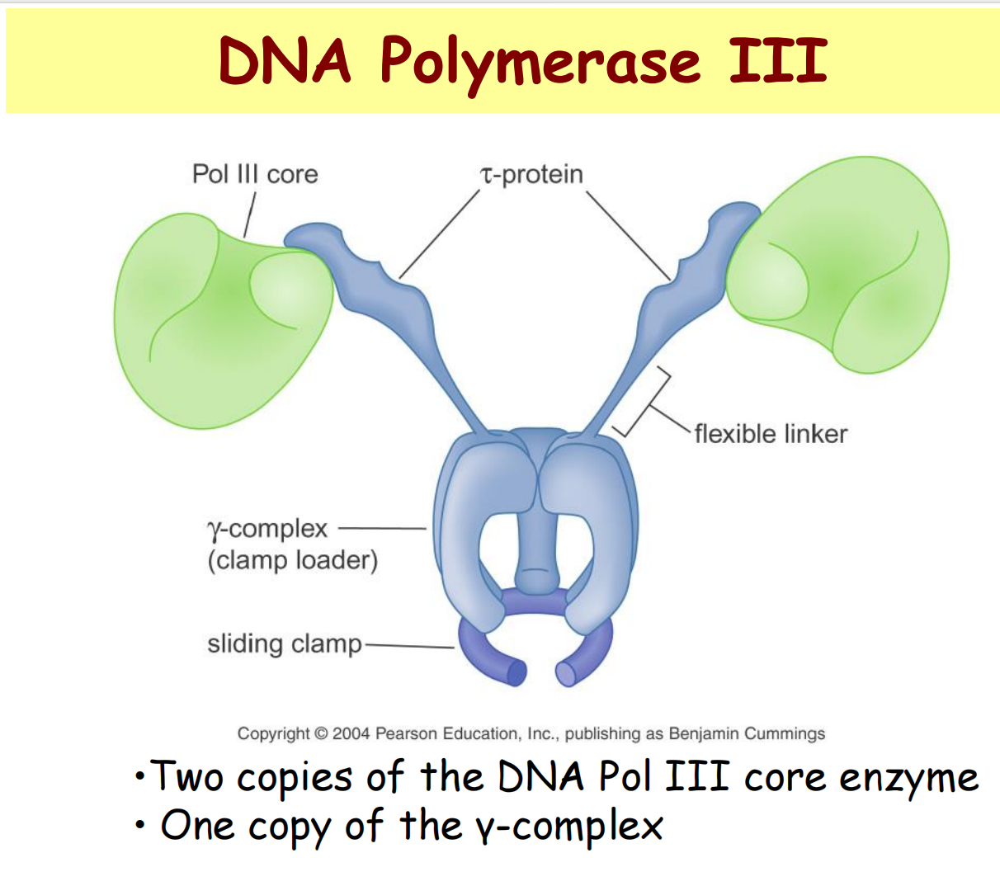

- DNA Polymerase IV& V: 主要在SOS修复过程中发挥功能
- 所有聚合酶的共同特点
  1. 都以dNTP为底物。
  2. 都需要Mg2+激活。
  3. 聚合时必须有模板链和具有-OH末端的引物链。
  4. 链的延伸都方向为5'→3'。

##### 真核生物DNA的复制

**真核生物DNA的复制特点** 
1. 有多处复制起始点；
2. 在全部完成复制之前，各个起始点上DNA的复制不能再开始; 
3. DNA复制只在S期进行; 
4. 复制子相对较小，为40-100千碱基对; 
5. 移动速度较慢，真核生物DNA复制叉的移动速度大约只有50bp/秒

**domino model（多米诺骨牌模型）**
- 一个复制子簇（红色）在 S 期早期启动复制，DNA 合成从复制起点向两个方向进行，因此形成复制泡
  - replicon cluster（复制子簇） 是多个相邻的 replicon 组成的一组复制单位
- 早期启动的复制子簇会促进邻近复制子簇（蓝色）的复制启动，而这些复制子簇又进一步促进更晚复制的复制子簇（绿色）启动，直到整条染色体完成复制，并进入 G2 期。
  
  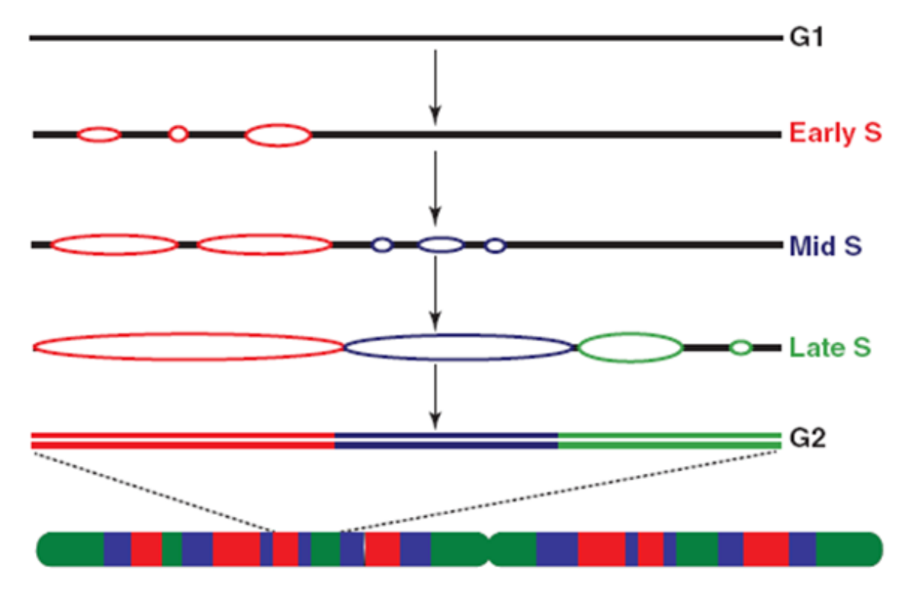

**真核生物DNA的复制子（ARS）**
- 真核生物DNA复制的起始需要起始点识别复合物（origin recognition complex，ORC）参与，ORC结合于ARS，它是由6种蛋白质组成的启动复合物

**真核生物DNA复制起始**
- 该机制确保了每个复制起点在每个细胞周期中仅被激活一次：一个复制起点只有在G1期形成了**前复制复合体**(prereplicative complex)后才能被使用，在S期开始时，特定的激酶（Cdk和DdK）会磷酸化Mcm和ORC，从而激活前者并使后者失活，新的**前复制复合体**无法在该起点形成，直到细胞进入下一个G1期，此时结合的ORC已被去磷酸化，随着复制叉开始移动，ORC被置换下来，新的ORC会迅速结合到新复制的起点上。
- G1期组装前复制复合体，ORC会招募至少两种额外的蛋白质——Cdc6和Cdt1，这三种蛋白质共同作用，招募DNA解旋酶（Mcm2-7复合体），从而完成前复制复合体的形成
- 而进入S期后被两种蛋白激酶（Cdk和DdK）激活以启动复制，
- 磷酸化调控进行细胞周期调控

  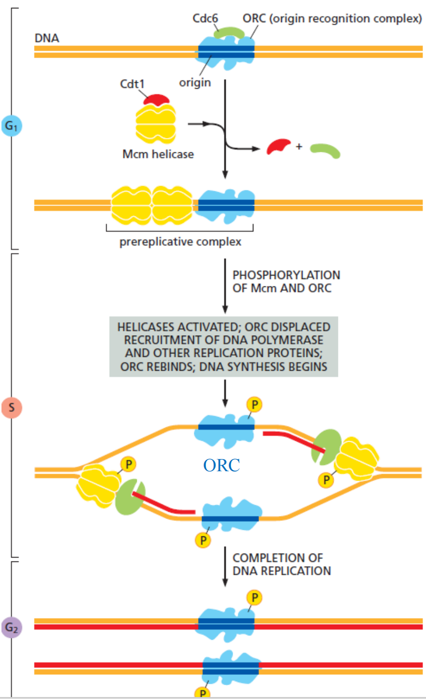

**真核生物DNA复制终止**
- 复制的终止发生在两个相邻复制叉相遇时
- 复制叉相遇与融合：当两个复制叉相遇时，它们会顺利通过彼此，直到前导链的合成遇到后随链的 5' 端。后随链上留下的缺口由 DNA 聚合酶填补，相邻的冈崎片段由 DNA 连接酶连接。
- 末端复制问题：线性染色体末端的后随链在去除最后一个 RNA 引物后，会留下一个无法被常规 DNA 聚合酶填补的 5' 端缺口。如果不解决，染色体 DNA 会随着每次复制而逐渐缩短。
- 端粒与端粒酶：
  - 端粒：染色体末端的重复序列（人类为 TTAGGG），不编码蛋白质，作为保护帽。
  - 端粒酶：一种特殊的逆转录酶，携带自身的 RNA 模板。它能以 RNA 为模板，在染色体 3' 端延伸端粒重复序列，从而补偿末端缩短。延伸出的 3' 单链末端可回折形成 T 环结构，保护染色体末端不被识别为DNA 双链断裂

**真核生物DNA聚合酶的种类**
- DNA聚合酶α主要参与引物合成
- DNA聚合酶β活性水平稳定，主要在DNA损伤的修复中起作用
- DNA聚合酶 ε（Pol ε）：主要负责前导链的连续合成
- DNA聚合酶 δ（Pol δ）：主要负责后随链的合成，包括冈崎片段的延伸和成熟。
- DNA聚合酶 gama 在线粒体DNA的复制中发挥作用
- 还存在其他的DNA聚合酶，但修复酶的忠实性很低，在损伤修复中发挥作用

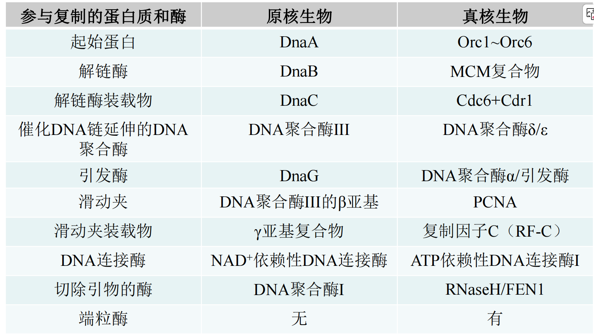

### DNA的损伤修复