# 染色体与DNA

### 染色体

嘌呤和嘧啶的分子结构(要能够认出四种碱基)

核苷酸共价连接在一起形成多聚核苷酸链

染色体是遗传物质的主要载体，遗传物质以染色体的形式实现从亲代到子代的稳定传递

原核细胞和真核细胞的染色质比较
- 原核生物：拟核，每个原核细胞一般只有一个染色体，每个染色体含一个双链**环状**DNA
- 真核生物：集中在细胞核中，线粒体和叶绿体中均有各自的DNA。染色体只在细胞分裂过程中可在**光镜**下观察到，在较长的分裂间期以较细且松散的**染色质**形式存在于细胞核。

> 基因的关键概念：
> - *Genome: 由生物体内所有的染色体组成的*
> - *Genome size: the length of DNA associated with one **haploid** complement of chromosomes，与单倍体染色体组相关的DNA长度*
> - *Gene number: the number of genes included in a genome，基因组中包含的基因数量*
> - *Gene density: the average number of genes per **Mb** of genomic DNA，每兆碱基（Mb）基因组DNA的平均基因数*

各类生物的**最小基因数**随其复杂度而增加，但这个规律并不绝对

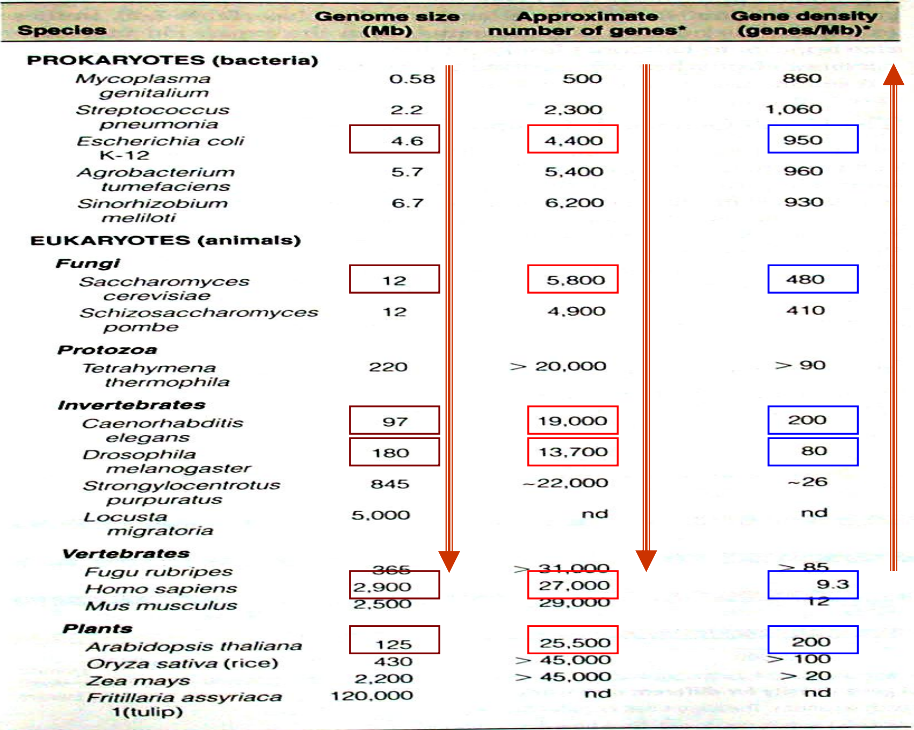

染色体的特征
1. 分子结构相对稳定
2. 能够自我复制，使亲子代之间保持连续性
3. 能够指导蛋白质的合成，从而控制整个生命过程
4. 能够发生可遗传的变异

染色体的组成：核酸和蛋白质

真核细胞染色体的组成：DNA，蛋白质，RNA(没有完成转录仍然和模板DNA相连接的，含量不到DNA的10%)
- 蛋白质：
  - *组蛋白(histone)：are conserved DNA-binding proteins of eukaryotes that form the nucleosome, the basic subunit of chromatin.是真核生物中保守的DNA结合蛋白，构成染色质的基本亚单位*
    - 可以通过酸提取出来
    - 是染色体的结构蛋白，由H1(分子量最大)，H2A, H2b, H3, H4(分子量最少)，lys和arg的比例非常高 -> **修饰！**
    - 越难分离代表被组蛋白整体包裹，而好分离代表处在外侧
    
    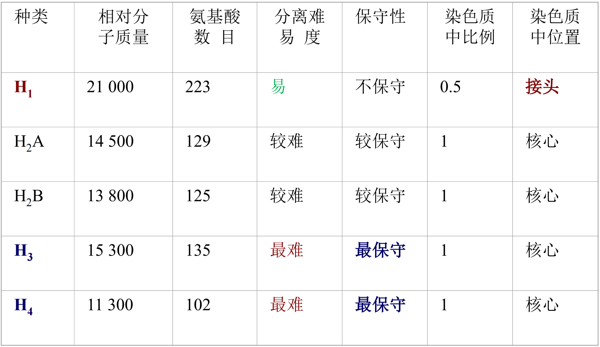

    - 特性：进化上极端保守，无组织特异性，肽链上氨基酸分布不对称(碱性氨基酸分布在N端，疏水基团分布在C端)，存在较普遍的修饰作用(甲基化、乙酰化、磷酸化、泛素化等)
    - 核心组蛋白共享一种共同的结构折叠模式：N端比较flexible(N terminal tail)，折叠之后会裸露在外面，这也是方便修饰的重点，*组蛋白尾巴从核小体核心的特定位置伸出，如同螺纹一般，引导 DNA 以**左手螺旋**的方式缠绕在组蛋白核心上.*
  - *非组蛋白：细胞核中组蛋白以外的酸性蛋白质*，含天门冬氨酸，谷氨酸等酸性蛋白，带负电，特点是既有多样性又有专一性，且含有组蛋白没有的色氨酸，是DNA复制RNA转录活动的调控因子
    - 酶：RNA合成酶、蛋白质磷酸化酶、组蛋白甲基化酶
    - 遗传信息的保持和表达调节：DNA结合蛋白、组蛋白结合蛋白和调节蛋白，HMG14，HMG17及许多酸性染色体蛋白质
      - HMG蛋白：能够和DNA结合但不牢固，能和H1作用，可能与DNA的超螺旋结构有关
      - DNA结合蛋白：是解链酶(unwinding enzyme)类中的一种类型，发现于原核生物的大肠杆菌细胞内，由相同亚基组成的四聚体，与单键DNA亲和力极大，与双链DNA结合力较差。相对分子量较低，占非组蛋白的20％，染色质的8％
    - 染色体的结构支持体：matrix protein，scaffold protein
- DNA:
  - 甲基化：DNA甲基化主要发生在富含GC的序列（CpG岛）上，非CpG位点（CpH，其中H代表A、T或C）的胞嘧啶甲基化在植物中普遍存在，在哺乳细胞中较为罕见，由DNA methyltransferases (DNMTs)实现

    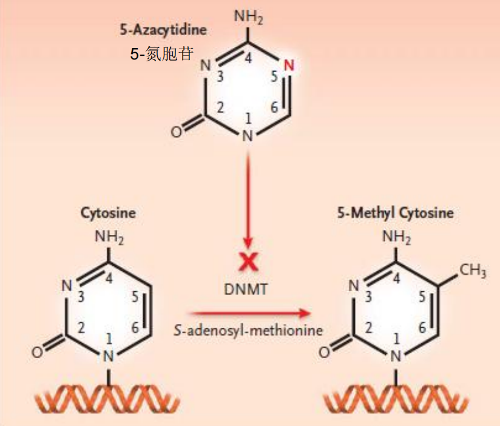

  - DNA甲基化的特点：GC富集的区域一般是在启动子上；DNA 甲基化通常导致基因转录受到抑制
  - 甲基化的应用：启动子区的高甲基化导致抑癌基因失活是人类肿瘤所具有的共同特征之一

##### 组蛋白修饰

就是所有组蛋白的N-terminal tail都会伸出去，然后方便被修饰

组蛋白的修饰改变染色质的功能
- 赖氨酸(Lysine)的乙酰化(形成50余种异构体)
- 丝氨酸(Serine)(H3，H4，H2B)的磷酸化
- 赖氨酸和精氨酸(H3 和 H4)的甲基化
- 赖氨酸的泛素化

- 甲基化（Methylation）
  - 是由组蛋白甲基化转移酶(histonemethyl transferase，HMT)完成的
  - 甲基化可发生在组蛋白的**赖氨酸(还包括三甲基化)**和**精氨酸(只有二甲基化和单甲基化)**残基上
  - 组蛋白的甲基化与基因激活和与基因沉默相关
  - 组蛋白的甲基化修饰方式是最稳定的(碳氮单键) -> 作为长期的表观遗传记忆
  - activation: H3K4,H3K36,H3K79 inactivation: H3k9,H3K27,H4K20
  - H3R2,H3R8,H3R17,H3R26,H4R3（这些应该都是精氨酸）

    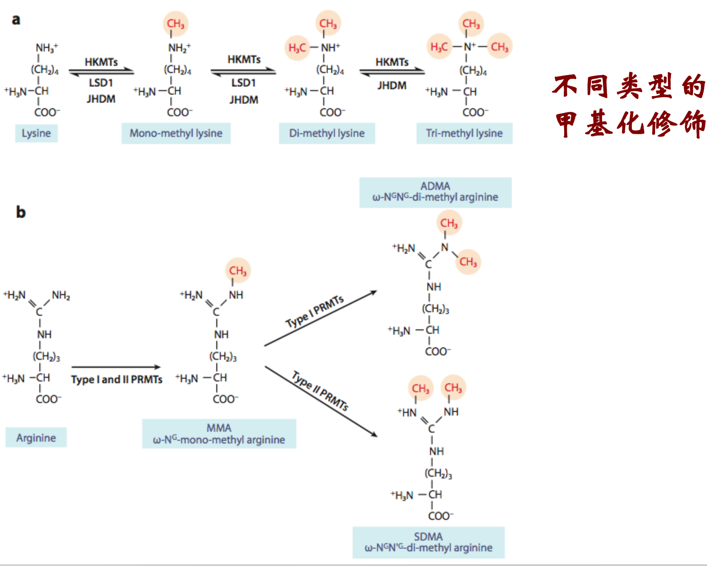

  - 两个核心酶
    - KMTs: lysine methyltransferases
    - KDMs: lysine demethyltransferases

- 乙酰化
   - *Acetylation (ethanoylation in IUPAC nomenclature ) describes a reaction that introduces an acetyl functional group into a chemical compound (resulting in an acetoxy group乙酰氧基)*
  - *Deacetylation is the removal of the acetyl group*
  - 核心是发生在lysine上面，HAT/HDAC催化H3,H4特定赖氨酸残基的乙酰化／去乙酰化修饰，实现乙酰化水平的动态平衡，他的乙酰化去乙酰化调控是可逆的而且是被精密调控的；
  - 组蛋白乙酰基转移酶(HAT)/组蛋白去乙酰化酶(HDAC)
  - 高乙酰化会导致转录活化：染色质上的紧密的部分打开(组蛋白尾部结构域的乙酰化会抑制核小体阵列折叠形成染色质的二级和三级结构)
  - 低乙酰化会抑制转录活性

 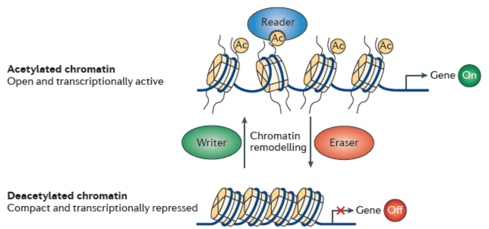

  - *组蛋白乙酰转移酶（也称为 HATs）是一类能够对核小体组蛋白尾部进行乙酰化修饰的酶* 核内和核外的底物不同
    (P39)
  - 组蛋白去乙酰化酶 (HDACs)：There are a total of four classes of Histone Deacetylases (HDACs).
  - 组蛋白乙酰化／去乙酰化参与的功能:转录激活、转录延伸；DNA修复、拼接、复制；染色体的组装；基因沉默；某些疾病的形成；细胞的信号转导；基因组的整体乙酰化

- 其他修饰方式：磷酸化、泛素化、腺苷酸化、ADP核糖基化等，通过多种修饰方式的组合,更为灵活的影响染色质的结构与功能。所以有人称这些能被专识别的修饰信息为组蛋白密码，各种修饰间也存在着相互的关联

> 组蛋白乙酰基转移酶的发现——活性胶内分析
> - 先把细胞中的蛋白通过 SDS-PAGE 按分子量分开，但胶里预先加入组蛋白作为底物。电泳结束后，让胶中的蛋白尽可能复性，再加入带标记的乙酰辅酶 A（acetyl-CoA）。如果某个位置上的蛋白具有 HAT 活性，它就会把乙酰基转移给附近的组蛋白

> **专栏：提到的所有酶的名称功能总结**
> | 缩写 | 全称 | 中文 | 主要底物 | 做什么 |
> |---|---|---|---|---|
> | **KMT** | Lysine Methyltransferase | 赖氨酸甲基转移酶 | 蛋白质上的 **Lys/K**，常见于组蛋白 | **加甲基** |
> | **KDM** | Lysine Demethylase | 赖氨酸去甲基化酶 | 甲基化的 Lys | **去甲基** |
> | **DNMT** | DNA Methyltransferase | DNA 甲基转移酶 | **DNA**，主要是胞嘧啶 C | **给 DNA 加甲基** |
> | **HMT** | Histone Methyltransferase | 组蛋白甲基转移酶 | **组蛋白** | **给组蛋白加甲基** |
> | **HAT** | Histone Acetyltransferase | 组蛋白乙酰转移酶 | 组蛋白上的 **Lys** | **加乙酰基** |
> | **HDAC** | Histone Deacetylase | 组蛋白去乙酰化酶 | 乙酰化的组蛋白 Lys | **去乙酰基** |

### DNA的结构

##### 真核细胞DNA

真核细胞基因组的最大特点是它含有大量的重复序列，而且功能DNA序列大多被不编码蛋白质的非功能DNA所隔开。

染色质和核小体：由DNA和组蛋白组成的染色质纤维细丝是许多核小体连成的念珠状结构。

*Tm值：DNA在260 nm吸光度增加到最大值一半时的温度成为DNA的解链温度或熔点。*
- G+C的含量：越多Tm值越高
- 溶液中的离子强度：阳离子浓度越高，Tm值越高
- DNA的均一性：宽泛或者确定

染色质由DNA和蛋白质组成的实验证据
- 染色质DNA的**Tm值**比自由DNA高，说明在染色质中DNA极可能与蛋白质分子相互作用
- 在染色质状态下，由DNA聚合酶和RNA聚合酶催化的DNA复制和转录活性大大低于在自由DNA中的反应
- DNA酶I（DNaseI）对染色质DNA的消化远远慢于对纯DNA的作用
- 实验证据：用小球菌核酸酶处理染色质以后进行电泳，便可以得到一系列片段，这些被保留的DNA片段均为200bp基本单位的倍数。

*Nucleosome (核小体) 是染色质的基本结构单位，由~200 bp DNA和组蛋白八聚体组成*
- 146bp DNA + Histone octamer (组蛋白八聚体) -> Nucleosome core (核小体核心) + H1 -> Chromatosome (染色小体166bp) + linker DNA -> Nucleosome (核小体) (~200 bp of DNA)
- DNA以左手超螺旋方式绕核心约 1.65圈（147 bp）
  
  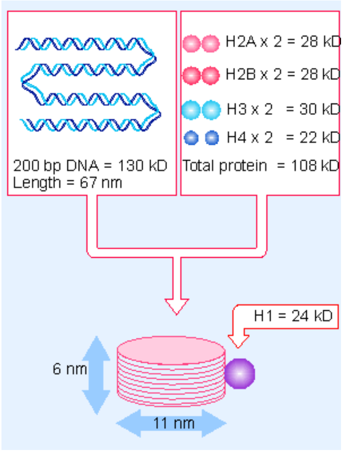

核小体更喜欢结合弯曲的DNA（bent DNA）
- G-C rich的链可能往往在缠绕的外侧

核小体的组装
1. 亲代核小体解聚与H3-H4的回收：复制叉经过后，组蛋白亚基释放
2. H3-H4四聚体优先沉积在新合成的DNA上：伴侣蛋白递送H3-H4四聚体优先递送到刚复制出来的DNA子链上，与DNA复制几乎同时发生
3. H2B-H2A二聚体随后沉积：NAP1伴侣蛋白递送H2A-H2B，略微落后第二步
  
  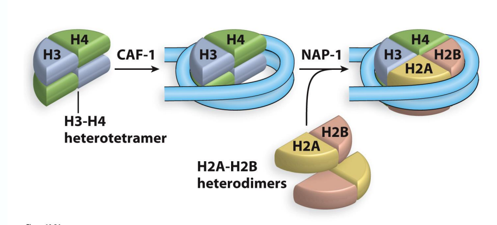

高级染色质结构的形成
1. 组蛋白H1与核小体之间的连接DNA结合，促使DNA更紧密地缠绕在核小体上
  - H1的加入会抑制转录
2. 核小体阵列可以形成更复杂的结构
  - 30 nm fibers(宽度) have 6 nucleosomes/turn, organized into a solenoid(螺线管).
  - Histone H1 and histone N-terminal tails are required for formation of the 30 nm fiber.
  - This fiber is the basic constituent of both interphase chromatin and mitotic chromosomes
3. DNA的进一步压缩涉及核小体DNA形成的大环结构

DNA包装成染色体的重要性
- Chromosome is a compact form of the DNA that readily fits inside the cell.
- To protect DNA from damage
- DNA in a chromosome can be transmitted efficiently to both daughter cells during cell division.
- Chromosome confers an overall organization to each molecule of DNA, which facilitates gene expression,DNA replication, DNA repair, as well as recombination.
  
真核生物基因组的结构特点：
1. 真核基因组庞大
2. 存在大量的重复序列
3. 大部分为非编码序列
4. 转录产物为单顺反子
5. 真核基因是断裂基因，有内含子
6. 存在大量的顺式作用元件
7. 存在大量的DNA多态性
8. 具有端粒(telomere)结构。保护线性DNA的完整复制、保护染色体末端和决定细胞的寿命等功能。

##### 原核细胞DNA

原核生物基因组
1. 原核生物基因主要是单拷贝基因，只有很少数基因〔如rRNA基因〕以多拷贝形式存在
2. 整个染色体DNA几乎全部都由功能基因与调控序列所组成
3. 几乎每个基因序列都与他所编码的蛋白序列呈线性对应状态

原核生物DNA
- 结构简炼
- 存在转录单元：功能相关的RNA和蛋白质基因，往往丛集在基因组的一个或几个特定部位，形成转录单元, 并转录产生含多个 mRNA的分子，称为多顺反子mRNA。
- 有重叠基因：同一段DNA能携带两种不同蛋白质的信息

##### DNA的结构

DNA的一级结构：4种核苷酸的连接及其排列顺序，表示了该DNA分子的化学构成
- 多聚核苷酸链中新生磷酸糖苷键的产生过程
  - 单核苷酸5’-磷酸基团向核酸链的3’-OH发起进攻

DNA的二级结构：双螺旋模型
- DNA是由两条互相平行的脱氧核苷酸长链盘绕而成的。
- DNA分子中的脱氧核糖和磷酸交替连接，排在外侧，构成基本骨架，碱基排列在内侧
- 两条链上的碱基通过氢键相结合，形成碱基对
> Chargaff’s Rules A=T G=C

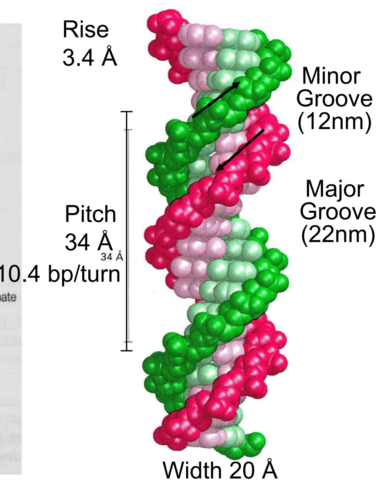

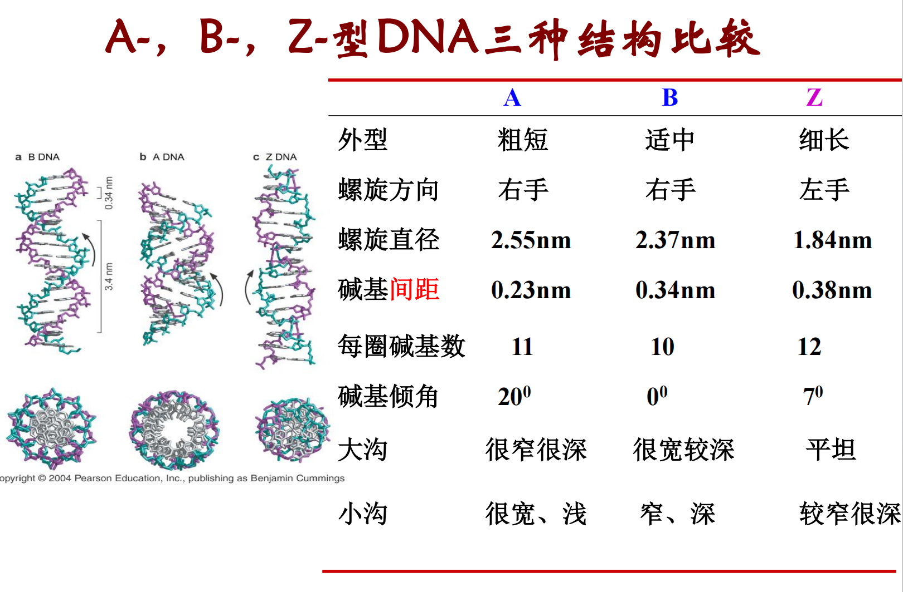

- 右手螺旋DNA:
  - B-DNA（最常见的DNA构象）: A-T丰富的DNA片段
  - A-DNA（对基因表达有重要意义）：DNA-RNA(处于转录状态的DNA)，RNA-RNA (dsRNA)
- *DNA的高级结构：指DNA双螺旋进一步扭曲盘绕所形成的特定空间结构*
  - super-coiled，正超螺旋和负超螺旋，在特殊情况下可以互相转变
  - DNA在细胞当中往往以负超螺旋形式，正超螺旋出现在复制叉前端
  - Topoisomerases can relax supercoiled DNA

质粒的不同构象
- 研究细菌质粒DNA时发现，质粒天然状态下该DNA以负超螺旋为主，稍被破坏即出现开环结构，两条链均断开则呈线性结构。

  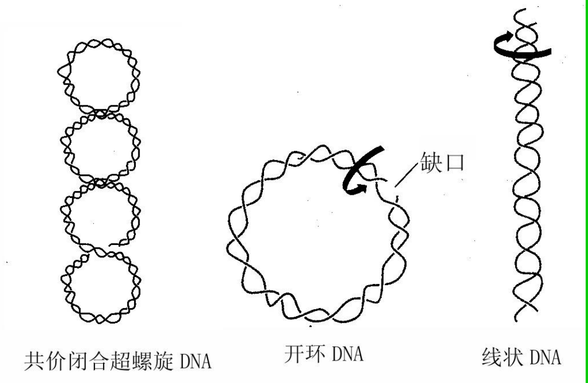

- 不同构象的质粒具有不同的迁移率；超螺旋DNA迁移率>线性DNA迁移率>开环的DNA迁移率

DNA的特殊结构
- 三链结构
- 四链结构
    
### DNA的复制

染色体结构的改变使蛋白质可以接触DNA
- 染色质重塑复合物改变DNA环绕核小体的位置（chromatin remodeler）：利用水解ATP的能量来改变DNA环绕核小体位置的蛋白质机器
  
  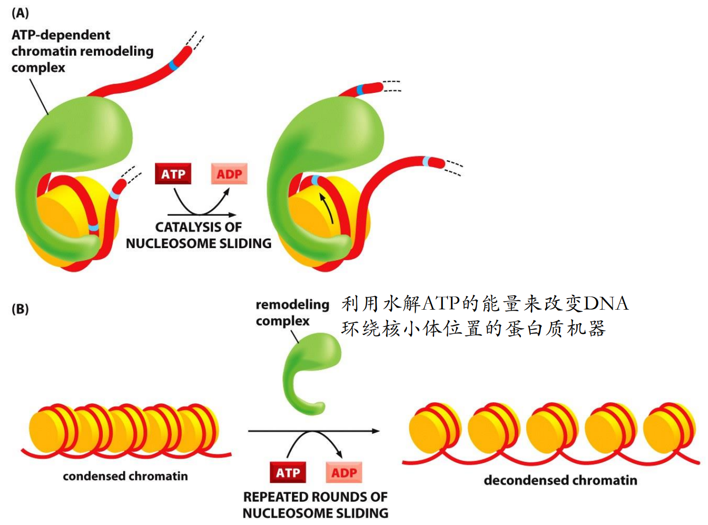

  - 由多个亚基组成，其中一个亚基有水解ATP的能力，所以整个过程是ATP dependent的
  
  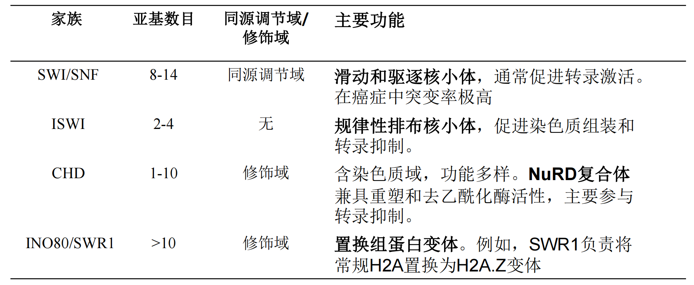

- 组蛋白可逆的化学修饰改变染色质结构，染色质重塑复合物中会包括reader domain，可以识别组蛋白修饰然后进行作用

> - 复制子(Replicon)
> - 复制叉(Replication fork)
> - DNA的半保留复制 (Semi-conservative replication)
> - DNA的半不连续复制(semi-discontinuous replication)
> - 冈崎片断(Okazaki fragment)
> - DNA聚合酶(DNA polymerase)
> - 基因突变(DNA mutation)

*DNA的复制：生命的遗传是染色体DNA自我复制的结果; 染色体DNA的自我复制主要是通过半保留复制(Semi-conservative)来实现的，是一个以亲代DNA分子为模板合成子代DNA链的过程。*

预测的DNA复制模型：1）半保留；2）色散；3）保留

证实DNA复制模型的实验：区分半保留和色散用的是高温解链

*DNA的半保留复制：DNA在复制过程中，每条链分别作为模板合成新链，产生互补的两条链。这样新形成的两个DNA分子与原来DNA分子的碱基顺序完全一样。因此，每个子代分子的一条链来自亲代DNA，另一条链则是新合成的*
- DNA的半保留复制保证了DNA在代谢上的稳定性，与DNA的遗传功能相符合。

*复制叉：复制时，双链DNA要解开成两股链分别进行，所以，复制起点呈叉子形式，被称为复制叉*

*复制子：DNA的复制是由固定的起始点开始的。一般把生物体的复制单位称为复制子*
- 一个复制子只含有一个复制起始点
- 原核生物的DNA分子都是由一个复制子完成复制，复制子的移动速度非常快
- 真核生物基因组可以同时在多个复制起点上进行复制，包含多个复制子，会形成复制泡，复制开始的越早复制泡越大

### 原核和真核生物DNA的复制特点

##### 原核生物DNA的复制

John Cairns’ experiment:
- E. coli has a circular chromosome
- E. coli has a single origin of replication
- In E. coli, replication and unwinding are simultaneous
- 形成了一个theta form

通过同位素标记进一步发现复制方向是双向复制：无论是原核生物还是真核生物，DNA的复制主要是从固定的起始点以双向等速复制方式进行的

DNA的合成
- DNA聚合酶的方向是5‘-> 3‘

*DNA的半不连续复制：前导链的连续复制和滞后链的不连续复制*

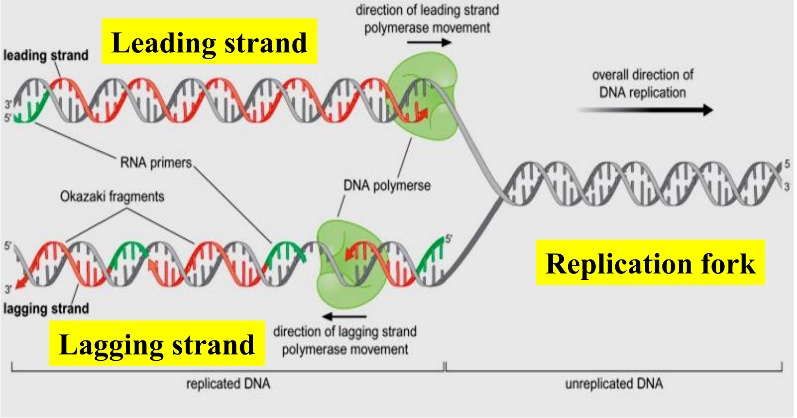

> 半不连续复制的实验
> - [3H] Thymidine pulse-chase labeling and alkaline sucrose gradient
> 1. 用3H脱氧胸苷短时间标记后提取DNA，得到不少平均长度为2-3 kb DNA片段
> 2. 用DNA连接酶温度敏感突变株进行实验，在连接酶不起作用的温度下，有大量小片段累积，说明复制过程中至少有一条链首先合成较短的片段，然后再生成大分子DNA
> - 碱性蔗糖梯度:一种常用于分子生物学中的离心技术，特别是在DNA片段分离和分析中。通过在碱性条件下使用蔗糖浓度梯度，可以有效分离不同大小或密度的核酸分子

原核生物大概是1000个，真核生物大概是200个

*The short discontinuous segments are called Okazaki Fragments.*

DNA复制的体系
- 亲代DNA分子为模板
- 四种脱氧三磷酸核苷(dNTP)为底物
- 提供3’-OH末端的引物
- 多种酶及蛋白质
- DNA拓扑异构酶(解开超螺旋)、DNA解链酶、单链结合蛋白、引物酶、 DNA聚合酶、RNA酶以及DNA连接酶等

**DNA复制的起始(initiation)**
- 复制起始原点
  - AT pair比较多，因为打开容易，比较容易解旋
  - 大肠杆菌基因组的复制原点位于天冬酰胺合酶和ATP合酶操纵子之间，全长245 bp, 称为oriC。
- DNA双螺旋的解旋
  - DNA解旋酶解开双链
  - 单链DNA结合蛋白保持单链的存在，防止在复制完成前和其他链配对
  - 解开复制叉运动过程中形成的正超螺旋，由拓扑异构酶打开
  - 引物酶：合成一小段RNA引物，为DNA新链的合成提供3’-OH末端，The primase is a type of RNA polymerase (α) that synthesizes short segments of RNA that will be used as primers for DNA replication
  - DNA合成所需的底物：1) 四种脱氧核苷三磷酸（dNTPs）：dATP、dGTP、dCTP、dTTP，是构成DNA链的基本单元。2) 模板链：单链DNA，指导新链的合成顺序。3) 引物：提供游离的3’-羟基末端，供DNA聚合酶起始合成。4) 镁离子（Mg²⁺）：DNA聚合酶活性所必需的辅因子。
  
  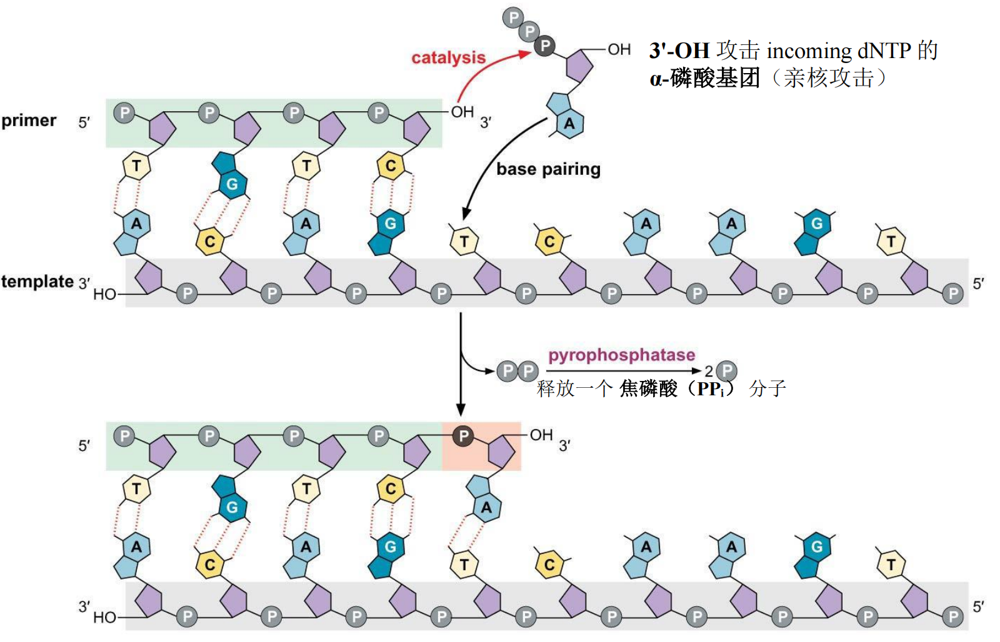

**DNA复制的引发**
1. 大约20个DnaA蛋白在ATP的作用下与oriC处的4个9 bp保守序列相结合
2. 在Hu蛋白和ATP的共同作用下，DnaA复制起始复合物使3x13 bp直接重复序列变形，形成开链。
3. DnaB（解链酶）六体分别与单链DNA相结合（需要DnaC的帮助）进一步解开DNA双链。
4. 与引物结合，起始DNA复制。
  
  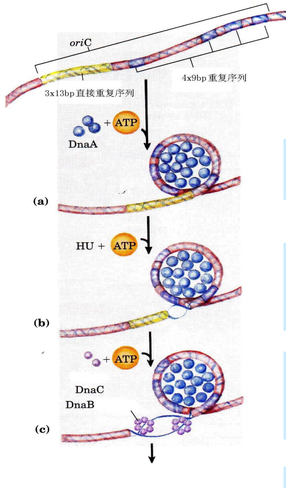

**DNA链的延伸**
- DNA聚合酶，DNA polymerase use a single active site to catalyze DNA synthesis，催化中心在手掌部分
  - palm domain
    1. 两个催化中心，一个用于添加 dNTP，另一个用于切除错配的 dNTP.
    2. 聚合位点结合两个金属离子，这些离子改变催化位点周围的化学环境并引发催化反应.
    3. 通过与新合成 DNA 的小沟形成广泛的氢键接触，监测最近添加的核苷酸的碱基配对准确性
  - Finger domain:
    1. 结合进入的 dNTP，并将正确配对的 dNTP 封闭于催化位点
    2. 弯曲模板，使模板上准备与进入的核苷酸形成碱基对的那个核苷酸暴露出来.
    3. DNA聚合酶会有一个构象上的转变，finger domain的o-helix从open domain到closed domain
  - Thumb domain
    1. 让新合成的DNA保持在一个正常的有活性的位置，从而可以提高DNA聚合酶的持续催化能力
    > Processivity: 持续合成能力是作用于聚合物底物的酶的一种特性。对于DNA聚合酶而言，持续合成能力的程度定义为：酶每次结合到引物-模板连接处时所添加的核苷酸的平均数量。
    - DNA聚合酶具有持续合成能力：1) DNA 聚合酶能够沿着 DNA 模板滑动，这种能力有助于提高其过程性；2) DNA 聚合酶还可以通过与“滑动夹（sliding clamp）”蛋白相互作用，进一步提高其过程性；这种滑动夹会完整地环绕 DNA
- 滑动夹（Sliding DNA clamp）
  1. 保证DNA聚合酶一直沿着DNA移动，然后保证他的持续合成能力和延伸能力
  2. The composition of the DNA Pol III holoenzyme
  3. Three enzymes: Two copies of the DNA Pol III core enzyme，One copy of the γ-complex
   
    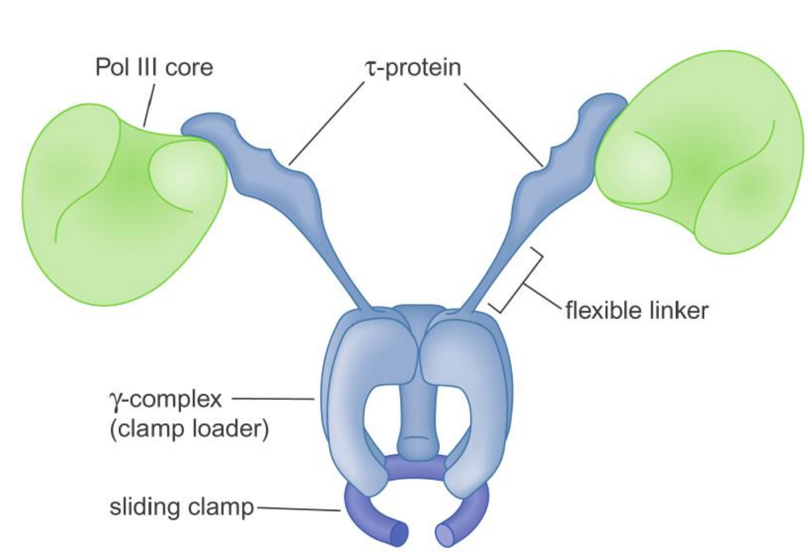

  4. 具体loading的过程还依赖一个loader蛋白：
   
    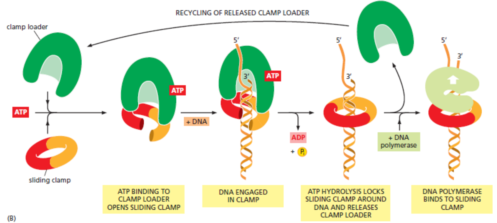

- RNase H(特异性地水解DNA-RNA杂合链中的RNA) + FEN1 (真核,在原核生物中是DNA聚合酶 I), 复制完成后切除RNA引物 
  - 从新合成的 DNA 上移除 RNA 引物
  - 切除后，核酸外切酶（exonuclease）移除最后一个核糖核苷酸
  - DNA 聚合酶填补空隙，但在 3'-OH 与 5'-磷酸基团之间的骨架上留下一处断裂
 - 小的nick用DNA连接酶连接上

    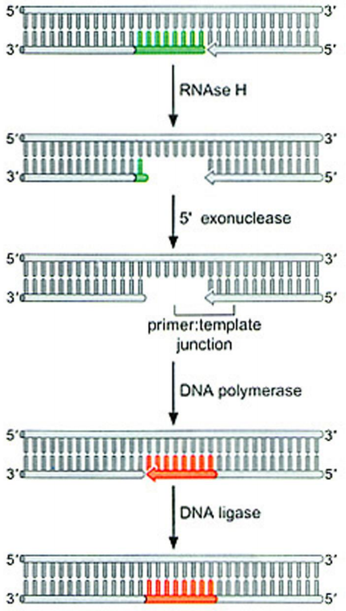

- 复制叉是不对称的
  
    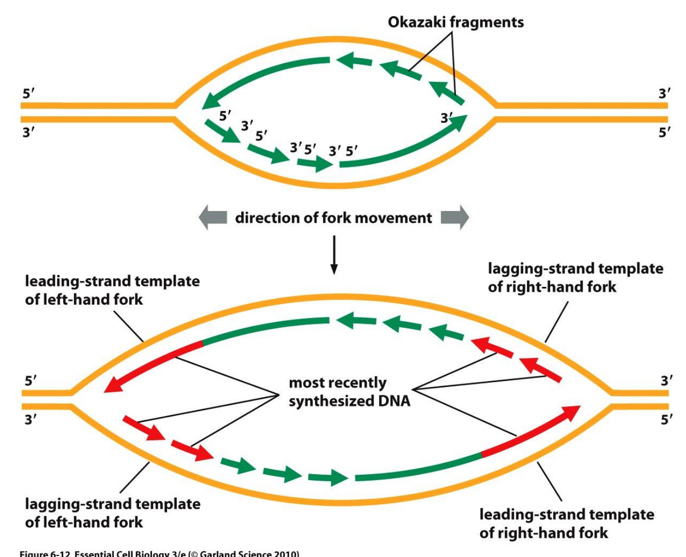

  - 大肠杆菌复制叉处由两个DNA聚合酶协调复制的“长号”模型

    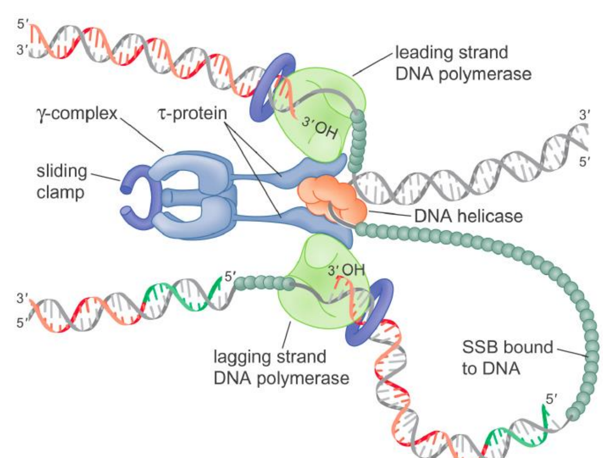

  - 两边的复制叉上的这个DNA聚合酶是independent的工作的

**DNA复制的终止**
- 当复制叉前移，遇到20 bp重复性终止子序列 (Ter) 时，Tus蛋白(Terminus utilization substance)与 Ter序列结合，形成 Tus-Ter 复合物
- Ter-Tus复合物 能抑制解旋酶（DnaB）的活性，阻挡复制叉的继续前移，等到相反方向的复制叉到达后，在DNA拓扑异构酶IV的作用下使复制叉解体，释放子链DNA

**原核生物DNA的复制特点**
- 细菌染色体的复制是作为一个单位从唯一的复制起点开始，双向进行的

**原核生物DNA聚合酶的种类**
- DNA聚合酶I (coded by polA)不是复制大肠杆菌染色体的主要聚合酶，它有 3’ →5’核酸外切酶活性,保证了DNA复制的准确性。它的5’ →3’核酸外切酶活性也可用来除去冈崎片段5'端RNA引物，使冈崎片段间缺口消失，保证连接酶将片段连接起来。
- DNA聚合酶II生理功能主要是起修复DNA的作用
- DNA聚合酶III (coded by polC)包含有7种不同的亚单位和9个亚基，其生物活性形式为二聚体，活性最强，主导聚合酶
  
  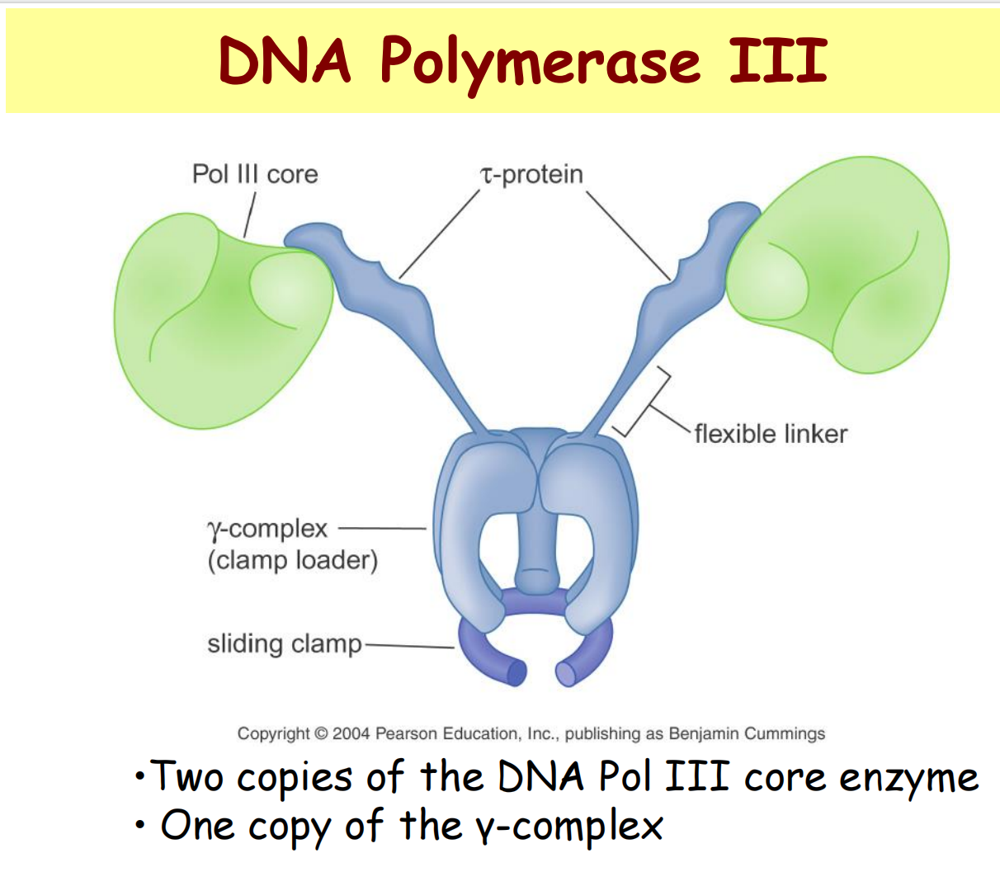

- DNA Polymerase IV& V: 主要在SOS修复过程中发挥功能
- 所有聚合酶的共同特点
  1. 都以dNTP为底物。
  2. 都需要Mg2+激活。
  3. 聚合时必须有模板链和具有-OH末端的引物链。
  4. 链的延伸都方向为5'→3'。

##### 真核生物DNA的复制

**真核生物DNA的复制特点** 
1. 有多处复制起始点；
2. 在全部完成复制之前，各个起始点上DNA的复制不能再开始; 
3. DNA复制只在S期进行; 
4. 复制子相对较小，为40-100千碱基对; 
5. 移动速度较慢，真核生物DNA复制叉的移动速度大约只有50bp/秒

**domino model（多米诺骨牌模型）**
- 一个复制子簇（红色）在 S 期早期启动复制，DNA 合成从复制起点向两个方向进行，因此形成复制泡
  - replicon cluster（复制子簇） 是多个相邻的 replicon 组成的一组复制单位
- 早期启动的复制子簇会促进邻近复制子簇（蓝色）的复制启动，而这些复制子簇又进一步促进更晚复制的复制子簇（绿色）启动，直到整条染色体完成复制，并进入 G2 期。
  
  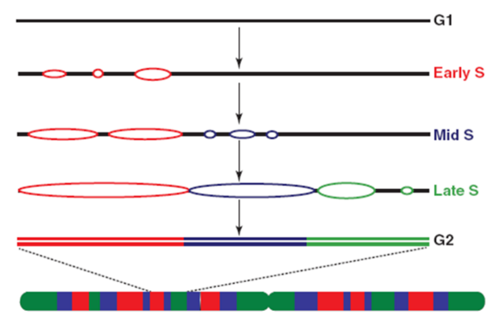

**真核生物DNA的复制子（ARS）**
- 真核生物DNA复制的起始需要起始点识别复合物（origin recognition complex，ORC）参与，ORC结合于ARS，它是由6种蛋白质组成的启动复合物

**真核生物DNA复制起始**
- 该机制确保了每个复制起点在每个细胞周期中仅被激活一次：一个复制起点只有在G1期形成了**前复制复合体**(prereplicative complex)后才能被使用，在S期开始时，特定的激酶（Cdk和DdK）会磷酸化Mcm和ORC，从而激活前者并使后者失活，新的**前复制复合体**无法在该起点形成，直到细胞进入下一个G1期，此时结合的ORC已被去磷酸化，随着复制叉开始移动，ORC被置换下来，新的ORC会迅速结合到新复制的起点上。
- G1期组装前复制复合体，ORC会招募至少两种额外的蛋白质——Cdc6和Cdt1，这三种蛋白质共同作用，招募DNA解旋酶（Mcm2-7复合体），从而完成前复制复合体的形成
- 而进入S期后被两种蛋白激酶（Cdk和DdK）激活以启动复制，
- 磷酸化调控进行细胞周期调控

  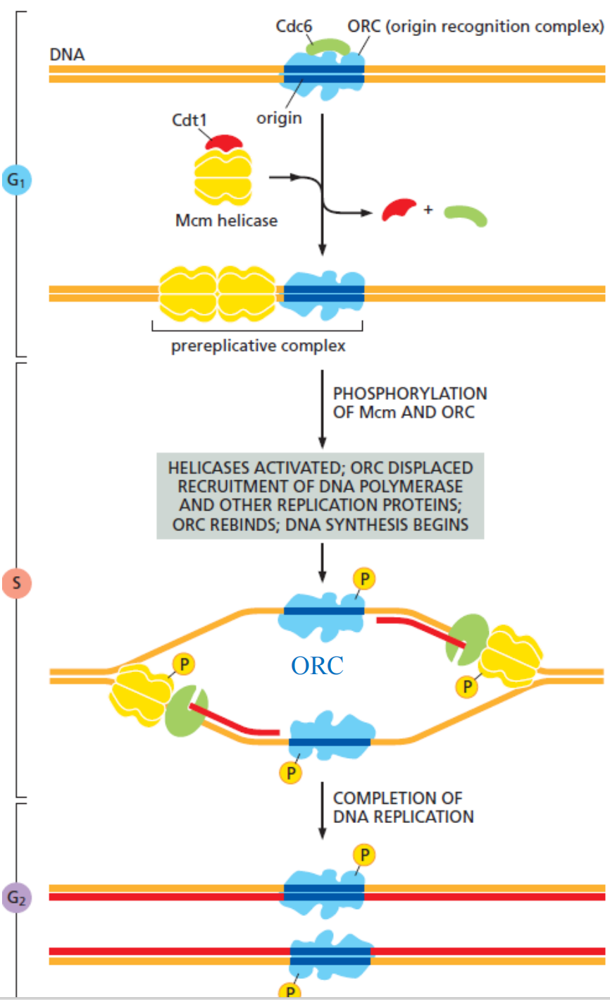

**真核生物DNA复制终止**
- 复制的终止发生在两个相邻复制叉相遇时
- 复制叉相遇与融合：当两个复制叉相遇时，它们会顺利通过彼此，直到前导链的合成遇到后随链的 5' 端。后随链上留下的缺口由 DNA 聚合酶填补，相邻的冈崎片段由 DNA 连接酶连接。
- 末端复制问题：线性染色体末端的后随链在去除最后一个 RNA 引物后，会留下一个无法被常规 DNA 聚合酶填补的 5' 端缺口。如果不解决，染色体 DNA 会随着每次复制而逐渐缩短。
- 端粒与端粒酶：
  - 端粒：染色体末端的重复序列（人类为 TTAGGG），不编码蛋白质，作为保护帽。
  - 端粒酶：一种特殊的逆转录酶，携带自身的 RNA 模板。它能以 RNA 为模板，在染色体 3' 端延伸端粒重复序列，从而补偿末端缩短。延伸出的 3' 单链末端可回折形成 T 环结构，保护染色体末端不被识别为DNA 双链断裂

**真核生物DNA聚合酶的种类**
- DNA聚合酶α主要参与引物合成
  - 四亚基复合物，其中催化亚基有DNA聚合酶活性，两个小亚基有RNA聚合酶活性，兼具RNA合成和DNA合成能力的双功能酶
  - 引物合成的两个阶段：先由小亚基合成一个小的RNA短链，然后过渡到DNA合成，所以整体引物是RNA和DNA mix的
- DNA聚合酶β活性水平稳定，主要在DNA损伤的修复中起作用
- DNA聚合酶 ε（Pol ε）：主要负责前导链的连续合成
- DNA聚合酶 δ（Pol δ）：主要负责后随链的合成，包括冈崎片段的延伸和成熟。
- DNA聚合酶 gama 在线粒体DNA的复制中发挥作用
- 还存在其他的DNA聚合酶，但修复酶的忠实性很低，在损伤修复中发挥作用

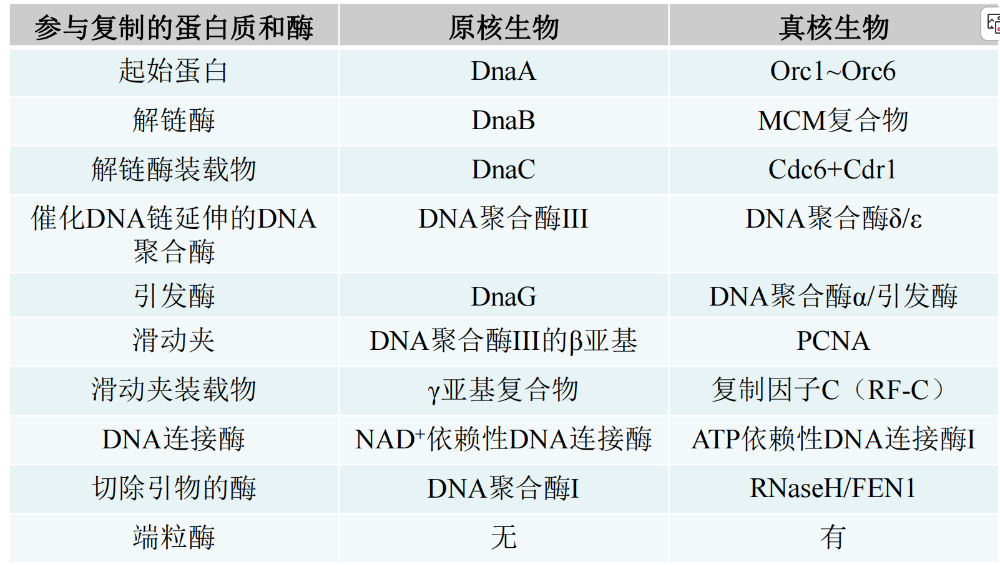

### DNA突变与修复

*突变：DNA碱基序列中永久性的、可遗传的改变。*

替换突变的不同类型
- *Transition(转换): 嘌呤或嘧啶被另一种碱基所取代。*
- *Transversion(颠换): 嘌呤被嘧啶取代，或反之。*
- 沉默突变，错义突变，无义突变

> 单个核苷酸改变
> - 镰刀状贫血
> - 瘦素及其受体基因突变

> 癌症是由多基因突变引起的
> - 癌基因的激活导致癌基因产物增多而致癌
> - 抑癌基因的失活、缺失导致抑癌基因的产物表达下降或缺失，则失去其抑制细胞生长的作用，可能使癌基因充分发挥作用而致癌。
> - 有时也受表观遗传调控影响

缺失或插入
- 会导致移码突变，产生一些无功能的蛋白质

复制的精确性
- DNA 复制过程中的自发错误极为罕见——在大肠杆菌中，每 10¹⁰ 个碱基仅发生一次错误——这一频率远低于 DNA 聚合酶 III 所引入的错误率。
- *校对（proofreading） 是指纠正在蛋白质或核酸合成过程中所出现错误的任何机制，这些机制涉及在单个亚基被添加到链上之后对其进行检查和审核。*
  - 校对的具体机理：palm亚基具有聚合活性中心和校对活性中心，当 DNA 合成过程中掺入了错误的碱基时，聚合酶会暂停，随后将正在延伸的链的 3' 端转移到外切酶活性位点（相距约 3 nm），在那里切除错配的碱基。然后 3' 端重新翻回到聚合酶活性位点，该区域随即被正确地重新复制。
  - 原核生物中依赖于DNA polymerase I和III
  - 真核生物中依赖于 δ and ε DNA polymerases

| DNA修复系统 | 功能 |
|---|---|
| 错配修复（Mismatch repair） | 修复错配 |
| 切除修复：碱基切除修复（Base-excision repair, BER）；核苷酸切除修复（Nucleotide-excision repair, NER） | 切除突变的碱基和核苷酸片段 |
| 同源重组修复（Homologous recombination repair, HR） | 复制后的修复，重新启动停滞的复制叉 |
| 非同源末端连接（Non-homologous end joining, NHEJ） | 不需要任何模板的帮助，修复蛋白可以直接将双股裂断的末端彼此拉近，再藉由 DNA ligase 将断裂的两股重新接合 |
| DNA直接修复（Direct repair） | 修复嘧啶二聚体或甲基化 DNA |
| SOS系统 | 细胞在 DNA 受到损伤时为求生存而产生的一种应急措施；诱导 DNA 损伤修复、诱变效应、细胞分裂的抑制以及溶原性细菌释放噬菌体等，导致变异 |

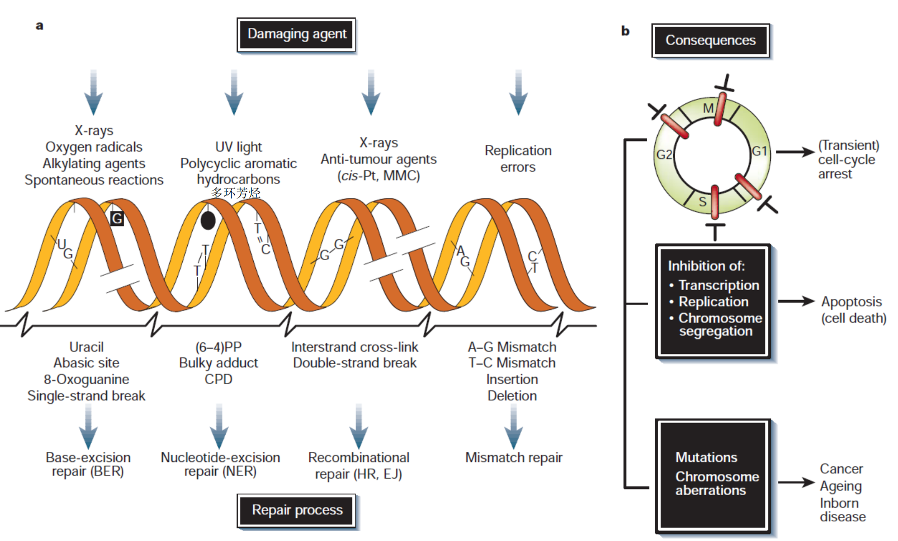

# 生物信息的传递

## 从DNA到RNA

DNA序列是遗传信息的贮存者，它通过自主复制得到永存，并通过转录生成信使RNA，翻译生成蛋白质的过程来控制生命现象。

### 转录的基本概念

*转录是指拷贝出一条与DNA链序列完全相同(除了T→U之外)的RNA单链的过程，是基因表达的核心步骤。*

*翻译是指以新生的mRNA为模板，把核苷酸三联遗传密码子翻译成氨基酸序列、合成多肽链的过程，是基因表达的最终目的。*

转录的从化学性质上看和复制是比较相似的，其中比较大的不同点在于
- RNA由核糖核苷酸组成
- 催化的酶是RNA polymerase，具有从头合成能力不需要引物
- RNA产物不会一直与模板链配对，而是脱离模板链
- less accurate

### RNA的结构

RNA的化学结构与DNA有略微差异，主要以单链的形式存在于生物体内

RNA能够形成分子内的碱基配对,进而折叠成特殊的结构
- hairpin
- bulge
- loop

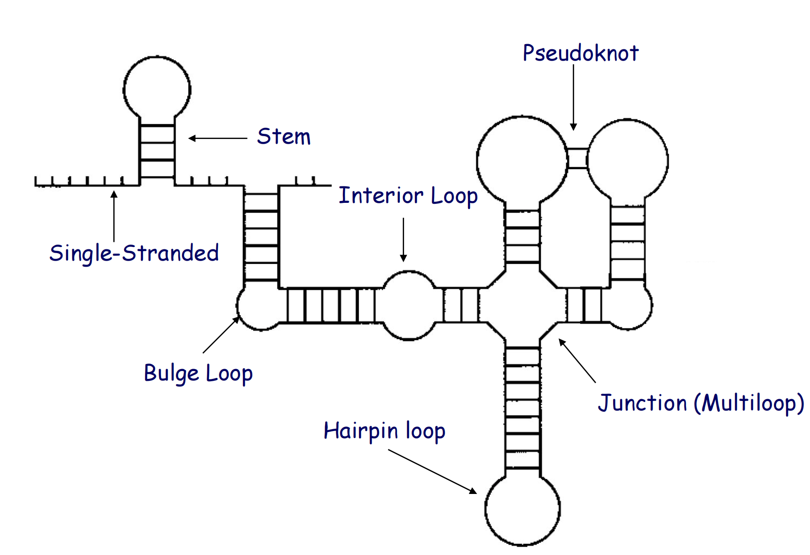

> Pseudoknot（假结）
> - 由环区的碱基与环外区域的碱基配对形成

> Non-Watson-Crick G:U base pairs represent additional regular base pairing in RNA, which enriched the capacity for self-complementarity

> Circular RNAs (circRNAs)-a special non-coding RNA
> - 不同区域间互补序列的竞争性配对，可以选择性地产生线形RNA或是环形RNA
> - 天然环状 RNA 可作为高效的 microRNA 海绵发挥作用，抑制microRNA

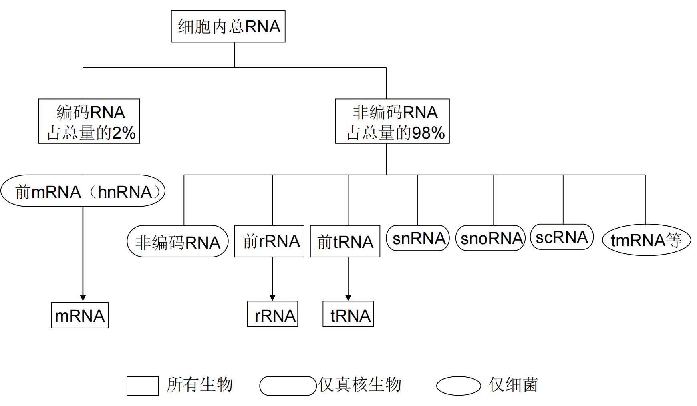

### 转录的基本过程

转录泡：大概12-14bp；部分RNA和DNA有hybrid，只有8-9bp

在转录泡前后DNA都会形成super coil

许多RNA聚合酶分子同时转录两个相邻的基因

不同基因的表达效率不同

- *编码链（coding strand）: 与mRNA序列相同的那条DNA链, 或称有意义链（sense strand）*
- *模板链（template strand）: 根据碱基互补原则指导mRNA合成的DNA链, 或称反义链（antisense strand）*

转录单元
- *转录单元是指一段被转录为单个RNA分子的DNA序列，其起点为启动子，终点为终止子。*
- 转录起点是指与新生RNA链第一个核苷酸相对应DNA链上的碱基，通常为嘌呤
  - 把起点5’末端的序列称为上游（upstream）
  - 把其3’末端的序列称为下游（downstream）
- 从转录起点到终止子之间的区域称为转录区域

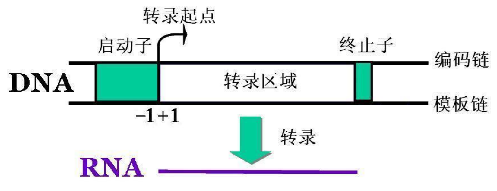

RNA合成的特点
1. RNA 是以5’3’方向合成的，它的序列是与DNA编码链（意义链）相同。
2. RNA 的合成是以反义链(模板链)为模板
3. 同在DNA中一样，形成磷酸二酯键
4. 必需的成分: RNA polymerase, rNTPs, transcription factors, promoter & terminator/template

##### step1: 模板识别 (Template Recognition)

*RNA聚合酶与启动子DNA双链相互作用并与之相结合的过程*

- 转录起始前，启动子附近的DNA双链分开形成转录泡以促使底物核糖核苷酸与模板DNA的碱基配对

##### step2: 转录起始 (Initiation)

*转录起始就是RNA链上第一个核苷酸键的产生。*

- 第一个核苷酸键的产生，该位点被称为position +1，上游就是叫-多少多少
- 转录起始后直到形成9个核苷酸短链是通过启动子阶段。
- 通过启动子的时间代表一个启动子的强弱:时间越短，转录起始的频率也越高（强启动子，弱启动子）

两种不同的反应途径
1. 合成并**释放**2-9个核苷酸的短RNA转录物，即所谓的流产式起始
2. 一旦RNA聚合酶成功地合成9个以上核苷酸,尽快释放σ亚基，RNA聚合酶离开启动子区，转录就进入正常的延伸阶段

三个明确的步骤
1. RNA polymerase刚刚结合，DNA双链还没有打开->封闭复合物
  - 启动子选择阶段
  - The holoenzyme is bound to **one face** of the helix
2. 双链解开，但还无任何RNA的形成->开放复合物
  - DNA 链在转录起始位点（+1 位点）附近约 14 bp（-11 至 +3）的范围内发生解链
3. 开始转录出RNA -> 三元复合物
  - 慢慢离开启动子，sigma因子下去

##### step3: 转录的延伸 (Elongation)

*RNA聚合酶离开启动子，沿DNA链移动并使新生RNA链不断伸长的过程就是转录的延伸。*

大肠杆菌RNA聚合酶的活性一般为每秒50-90个核苷酸

##### step4: 转录的终止 (Termination)

合成的终止:当RNA链延伸到转录终止位点时，RNA polymerase 和RNA链均从DNA模板上释放出来

Terminator: 通常含有自我互补区域 (self-complementary regions) ，在RNA产物中可以形成stem-loop或hairpin结构。

在大肠杆菌中有两种终止子：
- 不依赖于ρ因子的终止
  - 由两个序列原件组成：一段短的反向重复序列（大约20个核苷酸）;其后是一段大约8个A:T碱基对的序列，依靠茎环结构（全都是CGpair）来组织RNA前进
  - 整体比较稳定，终止效率比较高
  - 翻译出来的8个U和A的配对比较松，方便更好的释放出来

  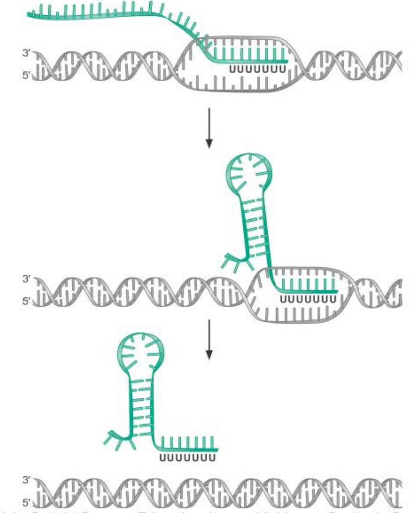

- 依赖于ρ因子的终止
  - 只含有自我互补区域，可形成茎环结构，但在茎中的G.C含量少，茎环易打开
  - ρ因子与ssRNA的特定位点结合，催化NTP的水解促使新生RNA链从三元转录复合物中解离
  - hot pursuit模型
    1. ρ结合到RNA链终止子上游的某一点
    2. ρ因子结合以后延着RNA向3′端移动，跟踪聚合酶
    3. ρ追上在终止位点暂停的RNA聚合酶
    4. 终止---三元复合物解体

> ρ因子同时具有DNA结合区域以及ATP酶的活性，是一个六聚体蛋白

> 常识数据：
> - 转录生成mRNA的速度大约是每分钟2500个，核苷酸(14个密码子/秒)，比复制的速度慢得多
> - 基因开始表达->mRNA的间隔约为2.5分钟，而再过半分钟就能在细胞内测到相应的蛋白质。

### RNA聚合酶

1. 主要以双链DNA为模板，以4种核苷三磷酸作为活性前体。
2. 需要Mg2+/Mn2+为辅助因子。
3. 它不需要任何引物。
4. 以5’ -> 3’ 方向合成RNA链。
5. 缺乏3’ -> 5’ 外切酶活性。
6. 是一个含有多个亚单位(multi-subunit)的酶。

执行的功能：
1) 识别DNA双链上的起始子；
2) 使DNA变性在启动子处解旋成单链；
3) 通过阅读启动子序列，RNA pol 确定它自己的转录方向和模板链。
4) 最后当它达到终止子时，通过识别停止转录。

##### 原核生物的RNA聚合酶

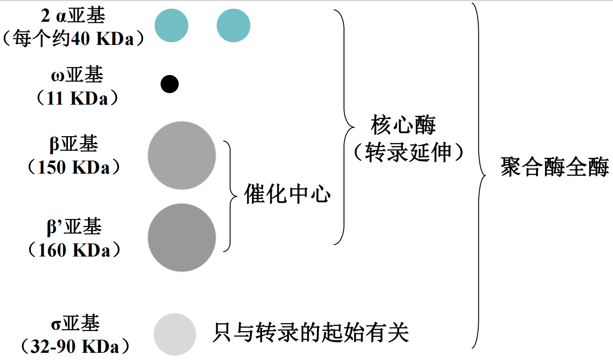

形状像一个圆筒状通道，可以直接与16 bp DNA结合。整个聚合酶可结合60 bp DNA

- α subunit：与核心酶的组装有关, 由rpoA 基因编码，参与RNA聚合酶和部分调节因子的相互作用
- β & β’ subunit：组成了聚合酶的催化中心，由rpoB 和 rpoC 基因编码
- σ factor：负责模板链的选择和转录的起始，启动子识别的关键的酶
  - 具有DNA binding domain来识别promoter
  - 当没有行使功能的时候，N-terminal region就会遮蔽DNA binding domain，行使功能的时候有一个构象的改变
  
##### 真核生物的RNA聚合酶

3类主要RNA聚合酶

| 酶 | 细胞内定位 | 转录产物 | 相对活性 | 对 α-鹅膏蕈碱的敏感程度 |
|---|---|---|---|---|
| RNA 聚合酶 I | 核仁 | rRNA 前体（除了 5S rRNA） | 50%–70% | 不敏感 |
| RNA 聚合酶 II | 核质 | hnRNA、绝大多数 microRNA、具有帽子结构的 snRNA 和 snoRNA 前体 | 20%–40% | 高度敏感 |
| RNA 聚合酶 III | 核质 | tRNA、5S rRNA 和 U6 snRNA 前体 | 约 10% | 中度敏感，具有物种特异性 |

- hnRNA: heterogeneous muclearRNA,核内不均一RNA, RNA的前体

转录抑制剂

| 抑制剂 | 靶点 | 抑制作用 |
|---|---|---|
| 碱基类似物（5-氟尿嘧啶等） | 核苷酸 | 抑制和干扰核苷酸合成 |
| 利福霉素 | 细菌 RNA 聚合酶全酶 | 与 β 亚基结合，抑制转录起始 |
| 链霉素 | 细菌 RNA 聚合酶核心酶 | 与 β 亚基结合，抑制转录起始 |
| α-鹅膏蕈碱 | 真核 RNA 聚合酶 II | 与 RNA 聚合酶 II 结合 |
| 放射线素 D | DNA 模板 | 与 DNA 结合，阻止延伸 |
| 烷化剂（氮芥、磺酸酯、氮丙啶等） | DNA 模板 | 使 DNA 甲基化的活性烷基，同时作用于 DNA 的两条链，使其发生交联，无法成为转录模板 |
| 纺锤菌素 | DNA 模板 | 结合 DNA 上富含 AT 碱基区域 |

真核生物RNA聚合酶的主要特征
- 聚合酶中有两个相对分子质量超过1×105的大亚基
- 同种生物3类聚合酶有“共享”小亚基的倾向，即有几个小亚基是其中3类或2类聚合酶所共有的

线粒体中RNA聚合酶
- 只有一条多肽链，相对分子量小于7 X 104，是已知最小的RNA聚合酶之一；
- 与T7噬菌体RNA聚合酶有同源性

叶绿体中RNA聚合酶
- 比较大；
- 结构上与细菌中的聚合酶相似，由多个亚基组成，部分亚基由叶绿体基因编码

Crab claw
- 原核生物里面由β & β’组成钳子
- 真核生物里RPB2和RPB1组成钳子

RNA聚合酶存在多种通道，允许 DNA、RNA 和核糖核苷酸（rNTPs）进出该酶的活性中心裂隙。

真核生物RNA聚合酶不能直接识别基因的启动子区，需要一些被称为转录调控因子的辅助蛋白质按特定顺序结合于启动子上
- 形成前起始复合物PIC

Assembly of the pre-initiation complex in presence of mediator, nucleosome modifiers and remodelers, and transcriptional activators

RNA聚合酶在维持转录忠实性中的作用
- 在核苷酸选择中的作用
  1. 碱基配对: 利用“**分子卡尺**”结构（Trigger loop，NTP选择器），通过识别碱基对的几何构象识别新来的NTP
  2. 诱导契合: 没有NTP结合时，RNAP处于开放构象，在正确底物结合的诱导下，RNAP转向封闭构象，防止NTP自发从酶上释放，并使活性位点的氨基酸残基正确定位，形成有效的催化
- 校对功能
  1. 焦磷酸解:
    1. NTP掺入后，会释放焦磷酸(PPi)
    2. 正确掺入时，反应容易向前进行, 错误掺入时，逆反应(焦磷酸攻击新形成的磷酸二酯键)更容易发生
    3. 这使错误核苷酸可能被“回退”移除，称为**动力学校对**
  2. RNA聚合酶内在的RNA剪切活性: 
    1. 暂停延伸
    2. 通过回退(backtracking)使RNA的3'端脱离活性中心
    3. RNA聚合酶的剪切活性（需要2个Mg 2+参与）可以剪切单个NTP，也可以剪切寡聚核苷酸片段
    4. 重新对齐并继续转录
- 整体而言忠实性没有DNA复制过程中那么精确，保证了转录过程中准确性和灵活性的平衡

|  | RNA pol | DNA pol |
|---|---|---|
| Template | dsDNA | dsDNA |
| Require primer | No | Yes |
| Initiation | promoter | origin |
| elongation | 40 nt/ sec | 900 bp/sec |
| Exonuclease activity | No | Yes |
| terminator | Synthesized RNA | Template DNA |

### 启动子的特征

Transcription start site的位置特征
- 第一位都是嘌呤：在原核中90%为嘌呤，A或G；真核生物的起始密码子均为AUG；原核生物的起始密码子有三种：AUG、GUG和UUG，绝大多数情况下是AUG
- 通常在起始核苷酸的两侧为C 和T (i.e. CGTor CAT)

*定义：启动子是一段位于结构基因5’端上游区的保守的DNA序列，能活化RNA聚合酶，使之与模板DNA 准确地相结合并具有转录起始的特异性*

在启动子中寻在一些确定的保守motif

对于原核生物（以大肠杆菌为例），与启动子的相互作用包括：
1. 启动子区的识别
2. 酶与启动子的结合
3. σ因子的结合与解离
  
> 一些基因利用一条DNA作为模板进行转录，而其他基因利用另一条DNA链
> - 启动子本身是非对称的

##### 原核生物的启动子

> 1975年，Pribnow和Schaller将RNA 聚合酶全酶与模板DNA结合后，用DNaseI降解DNA，得到41～44个核苷酸对的DNA片段
> - 和聚合酶结合的区域被保护无法被讲解

在被保护区内有一个由5个核苷酸组成的保守序列，是聚合酶结合位点，称为**Pribnow 区**，其中央大约位于起点上游10bp 处，所以又称为–10区

-10区
- 它和转录起始位点I一般相距5bp
- 其保守序列为TATAAT，A.T较丰富，易于解链
- 功能: 1) RNA pol紧密结合; 2) 形成开放启动复合体；3) 使RNA pol定向转录

> 下降突变(downmutation): 把Pribnow区从TATAAT变成AATAAT
> 上升突变(up mutation): 增加Pribnow区的共同序列，将乳糖操纵子的启动子中的TATGTT变成TATATT

> 提纯被保护的片段后却发现，RNA聚合酶并不能重新结合或并不能选择正确的起始点
> - 表明在保护区外可能还存在与RNA聚合酶对启动子的识别有关的序列

从噬菌体的左、右启动子PL及PR 和SV40启动子的–35bp附近找到了另一段共同序列：TTGACA

-35区
- 其保守序列为TTGACA
- 与-10序列相隔16-19bp
- 功能: 1) 为RNA pol的识别位点；2) RNA Pol的核心酶只能起到和模板结合和催化的功能，并不能识别-35序列，只有**σ亚基**才能识别-35序列，为转录选择模板链。

σ因子的不同部分回分别结合-10以及-35区的一些基序

最佳距离：
- 最佳距离大约是16～19 bp
- 是因为RNA Pol本身的大小和空间结构有关

Summary：
1) 结构典型，都含有识别(R, -35)，结合(B, -10)和起始(I, transcription start site)三个位点;
2) 序列保守，如-35序列，-10序列结构都十分保守,位置和距离都比较恒定;
3) 直接和多聚酶相结合;
4) 常和操纵子相邻;
5) 都在其控制基因的5′端;
6) 决定转录的启动和方向。

##### 真核生物的启动子

Pol II识别真核生物启动子

1. 核心元件:
   1. Hogness等发现类似Pribnow区的Hogness区，在转录起始点上游–25～–30bp处，保守序列为TATAAA，也称TATA区
   2. 启始子(initiator，Inr)：转录起始位点附近

2. 上游启动子元件（UPE）:
   1. 在起始位点上游–70～–78 bp处还有另一段共同序列CCAAT，称为CAAT区（CAAT box）
   2. GC box:–80～–110含有GCCACACCC或GGGCGGG序列。

*上游启动子元件: 将TATA区上游的保守序列称为上游启动子元件或称上游激活序列（upstream activating sequence，UAS）*

TATA区
- 使转录**精确地**起始

CAAT区和GC区
- 主要控制**转录起始频率**

> deletion而非mutation的实验

*增强子(enhancer): 称这种能强化转录起始的序列为增强子或强化子（enhancer）*
- 具有远距离效应：常在上游-200bp处, 但位置非常不确定
- 无方向性：有的甚至可能在start point的下游
- 可能通过影响染色质DNA－蛋白质结构或改变超螺旋的密度而改变模板的整体结构，从而使得RNA 聚合酶更容易与模板DNA相结合
- 顺式调节
- 无物种和基因的特异性
- 具有组织的特异性
- 有相位性: 其作用和DNA的构象有关
- 有的增强子可以对外部信号产生反应

Summary：
1) 有多种元件：TATA框，GC框，CATT框，OCT等；
2) 结构不恒定
3) 它们的位置、序列、距离和方向都不完全相同
4) 有的有远距离的调控元件存在，如增强子
5) 这些元件常常起到控制转录效率和选择起始位点的作用
6) 不直接和RNA pol结合。转录时先和其它转录激活因子结合，再和聚合酶结合

### 原核生物与真核生物mRNA的比较

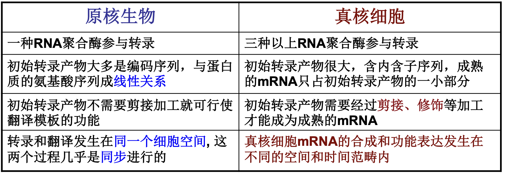

*单顺反子mRNA (monocistronic mRNA):只编码一个蛋白质的mRNA*

*多顺反子mRNA(polycistronic mRNA):编码多个蛋白质的mRNA。*

##### 原核生物mRNA的特征

半衰期短(3分钟)
- 0分钟，开始转录->0.5分钟，核糖体开始翻译->1.5分钟，5’端开始降解->2.0分钟，RNA聚合酶在3’端开始终止->3.0分钟，降解继续，核糖体完成翻译
- 主要原因是：转录和翻译是在同一个细胞空间里同步进行

许多原核生物mRNA以多顺反子的形式存在
- 原核细胞的mRNA(包括病毒)有时可以同时编码几个多肽

原核生物mRNA的5’端无帽子结构，3’端没有或只有较短的多聚（A）结构
- 原核生物起始密码子AUG上游有一被称为Ribosome Binding Site(RBS)或SD序列（Shine –Dalgarno sequence）的保守区，因为该序列与16S-rRNA 3’端反向互补，所以被认为在核糖体-mRNA的结合过程中起作用

原核生物常以AUG（有时GUG，甚至UUG）作为起始密码子

##### 真核生物mRNA的特征

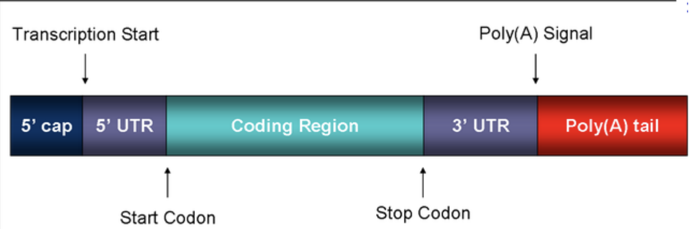

- 单顺反子形式存在
- 5’端存在“帽子”结构
- 绝大多数具有多聚(A)尾巴

***"基因”的分子生物学定义：产生一条功能性多肽或RNA分子所必需的全部核苷酸序列！***

半衰期：范围是4～24小时，在动物细胞中，mRNA的表达需转录、修饰、加工、核质转运和翻译

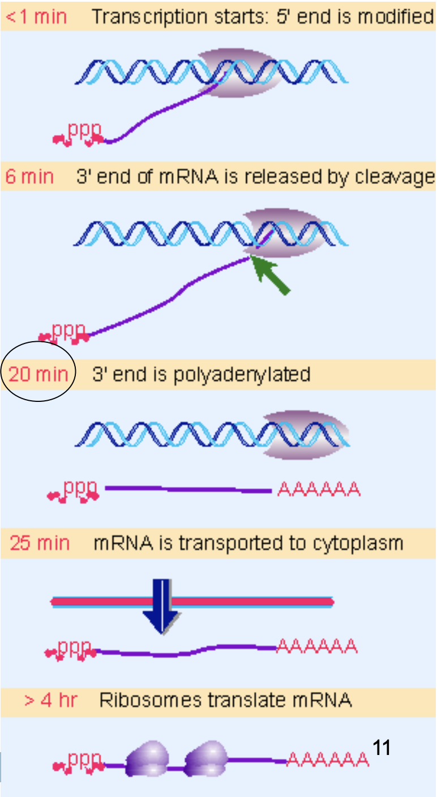

**真核生物**RNA聚合酶C末端尾部在RNA的加工中具有重要的调控作用
- RNA加工酶是由聚合酶的尾巴募集的（包括加帽，加polyA，splicing等）
- 尾部磷酸化的RNA聚合酶II允许RNA加工蛋白聚集到其尾部
  - RNA聚合酶C末端尾部是细菌的酶没有的
  - 真核细胞中启动子逃离是由CTD尾巴的磷酸化状态调节的

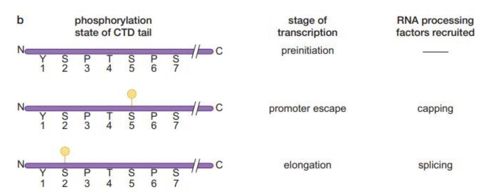

- 加帽蛋白首先结合到RNA聚合酶尾部，这一结合发生在转录起始过程后期、当七肽重复序列中的**Ser5**被磷酸化时
  - 当转录出25bp左右后，RNA序列会在空间上和C tail比较近，进而酶可以直接发挥作用
- 其尾部**Ser2**位点被广泛磷酸化，由此把剪接蛋白和3'端加工蛋白吸引到正在移动的聚合酶上，使它们处于合适位置，随时对新合成并刚从RNA聚合酶中伸出的RNA进行加工。
- 当RNA聚合酶II完成一个基因的转录后，即从DNA上释放
- 此时，可溶性磷酸酶会去除其尾部（CTD）上的磷酸基团，使其得以重新启动转录。只有处于完全去磷酸化状态的RNA聚合酶II，才具备在启动子处起始RNA合成的能力

5’ Capping
- 通过 5′→ 5′磷酸二酯键在原初mRNA的5’端倒扣一个“G”
- 三个连续的酶促反应
- 5′末端加上鸟苷是由鸟苷转移酶催化的
- mRNA的帽子结构常常被甲基化
- 分为很多不同种类的帽子

1) 有助于mRNA前体的剪接，帽子结合复合物（CBC）参与剪接体的形成，促进第一个内含子的剪接；
2) 有助于mRNA越过核膜，进入胞质
3) 保护5′不被核酶降解
4) 翻译时供IFⅢ（起始因子）和核糖体识别，是翻译所必需的
  
>
> 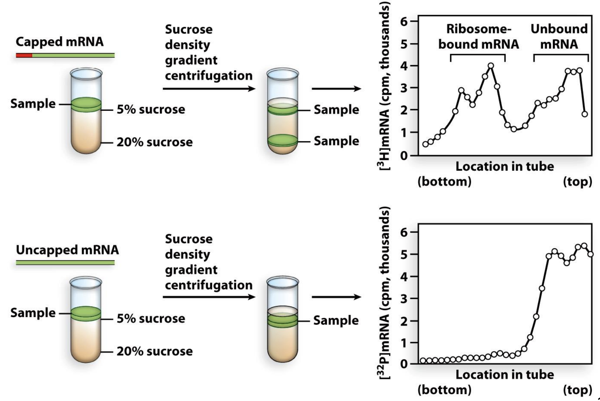
>

多聚(A)尾巴
- 除组蛋白基因外，真核生物mRNA的3’末端都有多聚(A)序列，其长度为40-200个左右
- 由多聚(A)聚合酶催化的
- 它是在转录后加上的
- Poly(A)被特异的蛋白质PABP结合
- 在高等生物中(酵母除外)在poly(A)上游11-30nt处有
- 特殊序列AAUAAA(上游)，GU rich(下游，先切掉再加尾)这一序列是高度保守的，对于初级转录产物的准确切割及加多聚(A)是必需的
> 1. CPSF (cleavage andpolyadenylation specificity factor切割和聚腺苷酸环化特异性因子) & CstF (cleavage stimulation factor切割刺激因子) bind to the poly-A signal, leading to the RNA cleavage.
> 2. Poly-A polymerase (PAP) adds ~ 200 As at the 3’ end ofthe RNA, using ATP as a substrate.

1) 是mRNA由细胞核进入细胞质所必需的形式
2) 它大大提高了mRNA在细胞质中的稳定性：mRNA刚从细胞核进入细胞质时，其多聚(A)尾巴一般比较长，随着mRNA在细胞质内逗留时间延长，多聚(A)逐渐变短消失，mRNA进入降解过程
3) 它可促进核糖体的有效循环
4) 在实验中方便分离mRNA，但对于没有polyA尾巴和环化RNA没有用

尽管大部分真核mRNA有poly (A)尾巴，细胞中仍有多大1/3没有poly (A)的mRNA，将其称为Poly (A) –约1/3的Poly (A)– mRNA编码了不同形式的组蛋白

内含子的剪接、编辑及化学修饰
- 真核基因大多是断裂的：由多个内含子和外显子间隔排列而成，内含子在真核基因中所占的比例很高
- *Exons (外显子): the coding sequences*
- *Introns (内含子) : the intervening sequences*
- 真核基因平均含有8-10个内含子，前体分子一般比成熟mRNA大4-10倍

剪接 (Splicing)
- *RNA splicing: removal of introns and joining of exons.*
- spliceosome: 由RNA和蛋白质组成
- 内含子剪接异常引起疾病

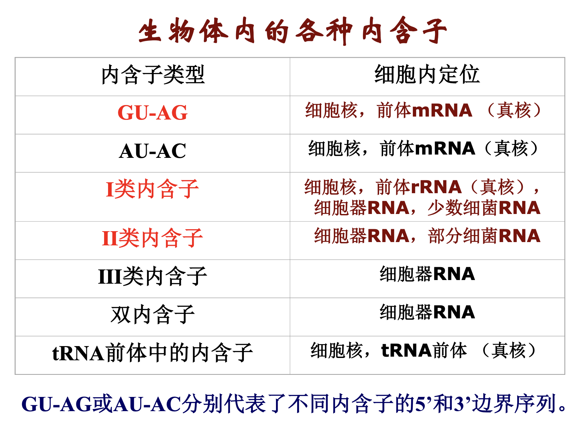

GU-AG法则
- 内含子的两个末端并不存在同源或互补(5'GU-3'AG)
- 连接点具有很短的保守序列,亦称边界序列，左边的剪接位点称供体(donor)位点，右边的剪接位点称受体(acceptor)位点
- 中间还有一个branch site A(具有分枝点序列，位于内含子3’端上游18-50nt处)，具有2’-OH
- 内含子5′端有一保守序列(5′GUAAGUA3’)可以和U1 snRNA的5’端的保守序列3’CAUUUCAU5’互补
- GU-AG法则（GU-AG rule）不适用于线粒体、叶绿体的内含子，也不适用于酵母的tRNA基因 

核mRNA的剪接
- 转录产生的核内mRNA前体分子与蛋白质结合，形成RNA和蛋白质组成的snRNP复合物
- 随着RNA链的延伸，每个内含子5’和3’两端的复合物成对联结，产生60S的颗粒—剪接体（spliceosome），进行RNA前体分子的剪接

> - 细胞核中的小分子RNA称为细胞核小RNA（smallnuclear RNA, snRNA）
> - 位于细胞质中的称为细胞质小RNA (small cytoplasmicRNA, scRNA)
> - 在自然状态下，它们以核糖核蛋白颗粒（SnRNP和scRNP）的形式存在，俗称snurps和scyrps
> - 在核仁中也存在着一类小的RNA，称为核仁小RNA(small nucleolar RNA, snoRNA),它们在rRNA的加工中起作用
> - snRNA参与剪接过程，并与其它蛋白一起构成一个大的颗粒复合体,称为剪接体(splicesome)

Spliceosome (剪接体)
- Recognizing the 5’ splice site and the branch site
- Bringing those sites together
- Catalyzing (or helping to catalyze) the RNA cleavage

- The lariat (套索) is an intermediate in RNA splicing in which a circular structure with a tail is created by a 5 ’ -2 ’ bond.
- The branch site (分支点) is a short sequence just before the end of an intron at which the lariat intermediate is formed in splicing by joining the 5’ nucleotide of the intron to the 2 ’ position of an Adenosine.
  
真核生物mRNA前体中内含子剪接过程
- 一共需要两个cut
- 由U1 snRNA以碱基互补的方式识别mRNA前体5’剪接点，由结合在3’剪接点上游富嘧啶区的U2AF（U2 auxiliary factor）识别3’剪接点并引导U2 snRNP与分支点相结合，形成**剪接前体（pre-spliceosome）**
- 剪接前体进一步与U4、U5、U6 snRNP三聚体相结合，形成剪接体。

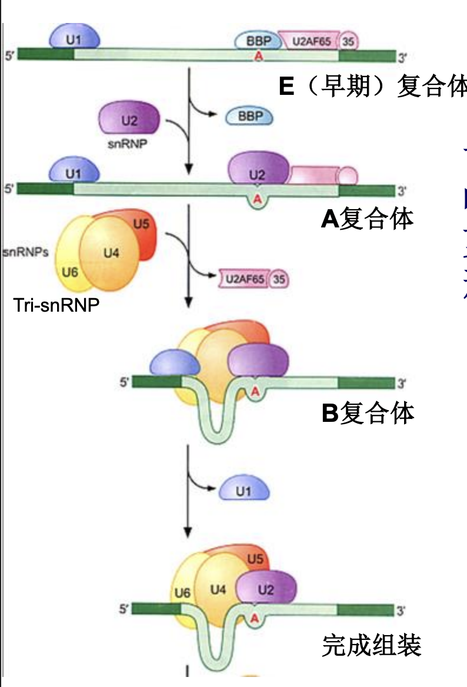

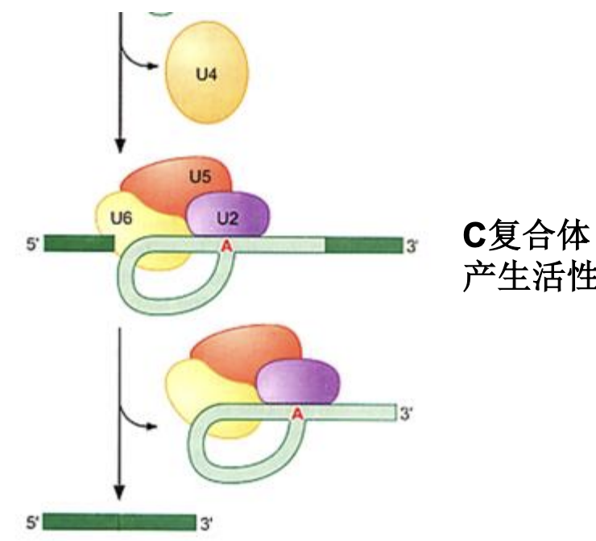

- 哺乳动物细胞中mRNA前体上的snRNP是从5’向下游“扫描”，选择在分支点**富嘧啶区3’下游的第一个AG**作为剪接的3’受点
- AG前一位核苷酸可以影响剪接效率，一般说来，CAG=UAG>AAG>GAG
- 如果mRNA前体上同时存在几个AG，可能发生剪接竞争

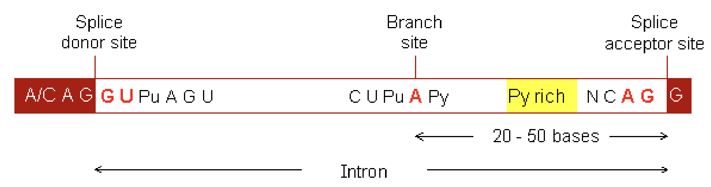

内含子的变位剪接（可变剪接）Alternative Splicing
- *Alternative splicing (可变剪接): some pre-mRNAs can be spliced in more than one way, generating alternative mRNAs.*

> α-原肌球蛋白基因可以以不同方式剪接
> - 产生不同肌蛋白类型

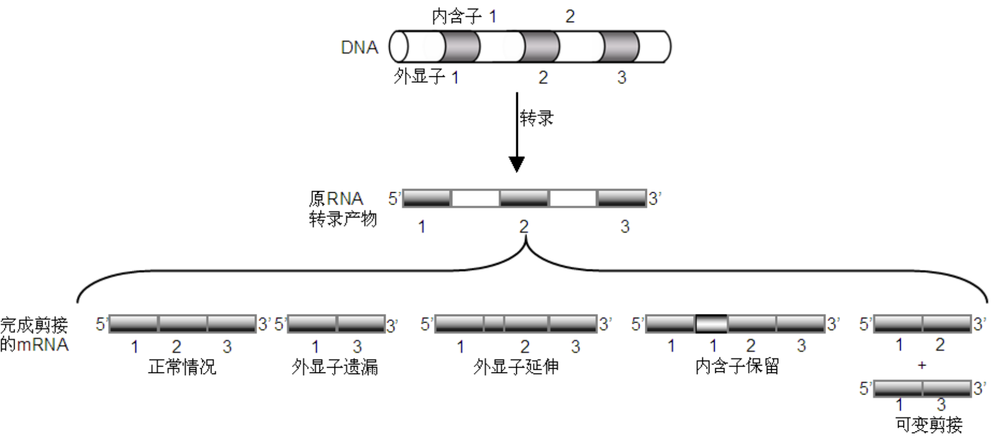

可变剪接受激活因子和抑制因子调控

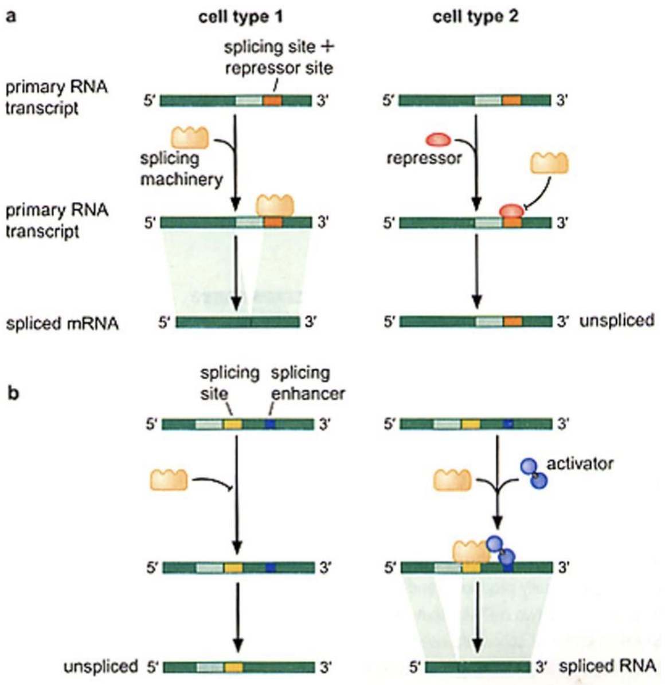

Self-splicing introns -I、II类内含子
- 带有这些内含子的RNA本身具有催化活性，能进行内含子的自我剪接。
- *Autosplicing (Self-splicing,自我剪接) describes the ability of an intron to excise itself from an RNA by a catalytic action that depends only on the sequence of RNA in the intron.*
- I 类内含子(group I intron)的结构特点
  1. 其边界序列为5’U-G 3’
  2. 中部核心结构，可以发挥酶的催化结构(Central core structure: contains a guanine binding pocket and internal guide sequence)
  3. 低等生物常见的细胞器，比如四膜虫
  4. 自我剪接过程，两次的自由3'-OH作为亲核基团攻击磷酸二酯键
   
    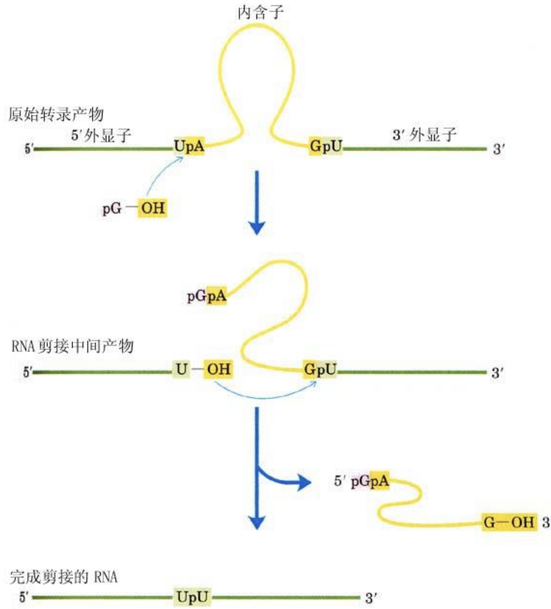

  5. 可以转变为真正的核酶: 1)具有保守的二级结构，可以容纳鸟苷或者鸟苷酸; 2)有内在指导序列，与5’剪接位点的序列配对，确定鸟苷的攻击位置
- Ⅱ类内含子(group II intron)
  1. 分布在较多的线粒体DNA中
  2. 剪接无需鸟苷的辅助，但需要镁离子的存在
  3. 自我剪接过程: 分枝点腺苷酸的2’-OH作为亲核基团攻击5‘磷酸二酯键，剪切下来的也是一个套索结构，和mRNA非常相似
   
    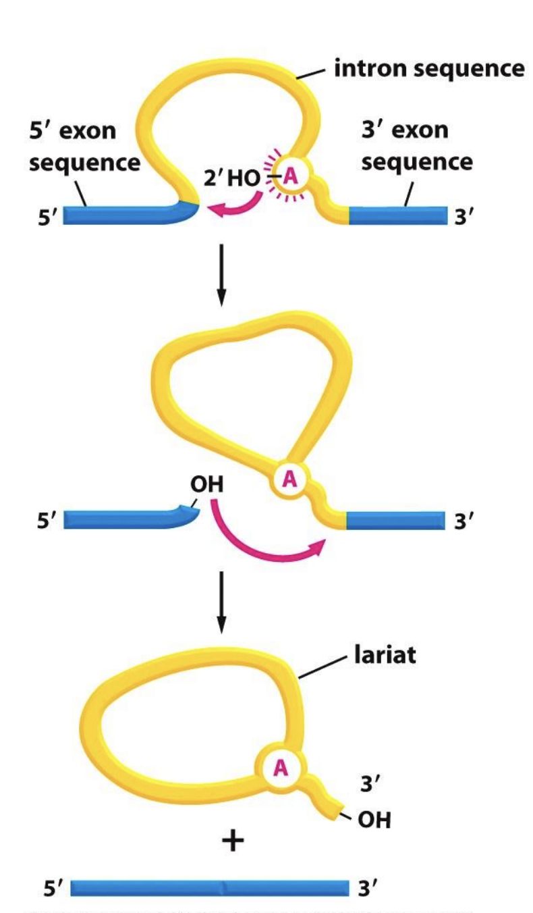

| 比较项目 | 酵母 tRNA | I 类内含子 | II 类内含子 | 核 mRNA 前体 |
| --- | --- | --- | --- | --- |
| 边界顺序 | 无 | 5′ U↓-G↓ 3′ | 5′ ↓GU-AG↓ 3′ | 5′ ↓GU-AG↓ 3′ |
| 特殊顺序 | C 茎上—G（环上） | 内部引导顺序 | 分支点序列 | 分支点序列 |
| 二级结构 | 茎环构象 | 核心结构 | 5、6 功能区 | 连接体 |
| 基因外的成分 | 内切酶，连接酶 | 自由鸟苷，镁离子 | 镁离子 | U1、U2、U4、U5、U6 |
| 能量要求 | ATP | 不 | 不 | ATP |
| 中间型分子 | 半分子 tRNA | 环状 L-19 IVS | 套索 | 套索 |
  
三类剪接反应都是通过两次连续的转酯反应进行的
- 第一次转酯反应中，由一个游离的2’-羟基提供，发动对5’外显子-内含子连接点的攻击
- 第二次转酯反应中，已经释放的外显子末端的游离3’-羟基接着攻击3’内含子-外显子的连接点。
  
tRNA由较长的前体加工而来
1. tRNA的切割和连接是独立的反应, 内含子的剪接由tRNA内切核酸酶和RNA连接酶完成
2. 3’端添加CCA是在tRNA核苷酸转移酶的催化下进行的
3. 有较多的核苷酸修饰

rRNA的产生需要切割反应
- 大小rRNA都通过从**共同的RNA前体**切割下来而释放的
- 5‘端核酶切割产生，而3’端切割后会再进行一些3’-5’修整反应

*编辑（editing）是指转录后的RNA在编码区发生碱基的加入，丢失或转换等现象。*
- RNA的编辑(RNA editing)是某些RNA，特别是mRNA的一种加工方式，可以在RNA转录后改变其序列，导致了DNA所编码的遗传信息的改变

RNA的编辑(RNA editing)
- 位点特异性脱氨基作用(酶促碱基修饰）
- 引导RNA指导的尿嘧啶插入或删除
- A-to-I; C-to-U; 插入/删除编辑; 碱基修饰编辑
- C-to-U: by the deaminase
- A-to-I: 由ADAR（Adenosine Deaminase Acting on RNA）酶家族催化
- 尿苷酸的缺失和添加: 
  - 在guide RNA的指导之下: 和mRNA分子被编辑的部分发生非常规的互补，G-U配对
  - gRNA: anchor区，引导到编辑区域；editing region区，决定U具体插入到哪里；poly-U stretch区

> 哺乳动物载脂蛋白基因转录产物的编辑
> - 在小肠中，通过C-to-U的突变产生终止密码子提前，得到更短的ApoB，参与运输饮食中的脂肪到各组织中
> - 长的载脂蛋白在肝脏中参与内源合成的胆固醇和甘油三酯的转运
>
> 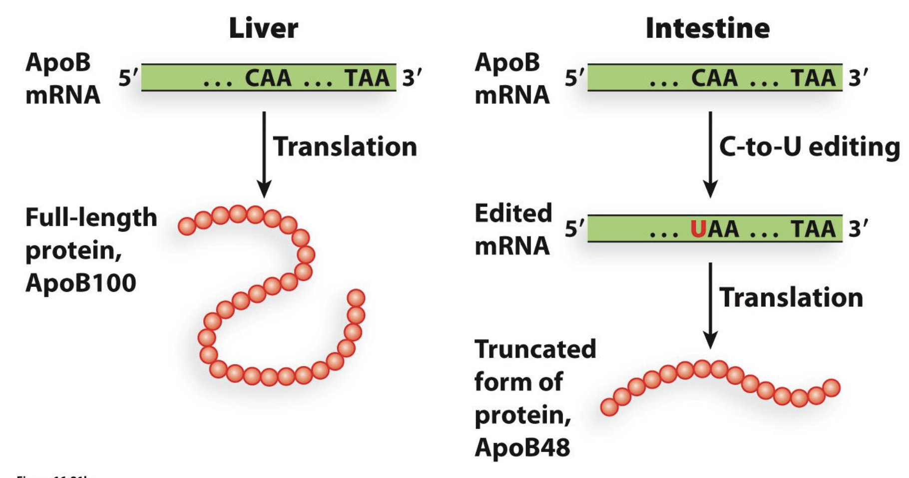
>

RNA编辑的生物学意义
- 校正作用
- 调控翻译: 通过编辑可以构建或去除起始密码子和终止密码子
- 扩充遗传信息

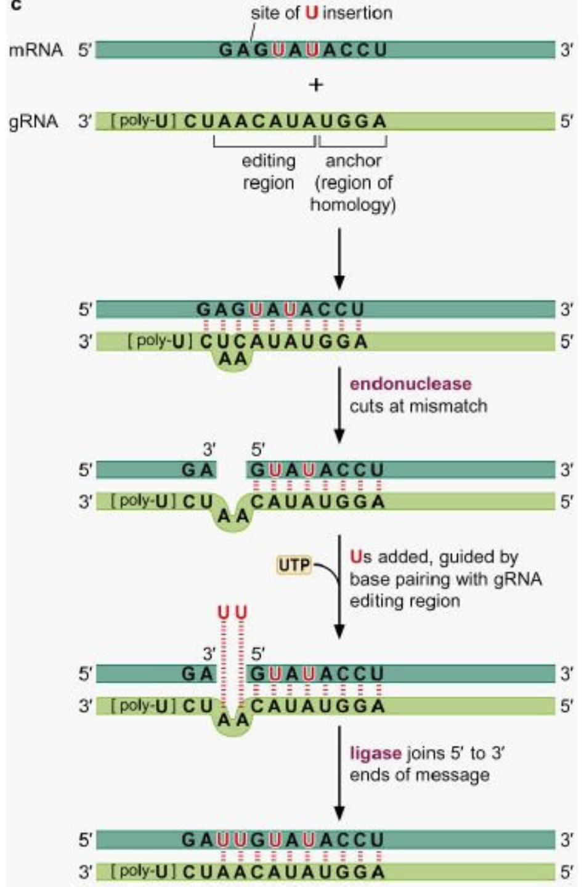

RNA由细胞核内的工厂生产
- RNA聚合酶与RNA加工蛋白形成松散的分子聚集体，称为细胞内凝聚物（intracellular cellular condensates），可作为合成RNA的“工厂”
- rRNA: 生产的RNA占细胞总RNA的80%以上，核仁是rRNA加工的巨大工厂
- mRNA、tRNA、snRNA的加工在核仁之外的地方，核仁外 2000–3000 个固定点，直径约 50–100 nm

一组特殊的RNA结合蛋白标示mRNA已成熟,可以运送到细胞质中--外显子连接复合物
- 出核之后所有的蛋白离开重新回到核内

mRNA Transport

mRNA分子最终被细胞降解
- mRNA分子的寿命有明显的差异---取决于mRNA的核苷酸序列（3’UTR）以及产生该种mRNA的细胞类型
- mRNA的不同寿命协助细胞决定每种蛋白质的合成水平
  - 合成水平较高的蛋白质是由较长寿命的mRNA翻译而来的
  - 低水平表达的蛋白质或其表达水平随信号而快速改变的蛋白质，往往是由寿命较短的mRNA合成的

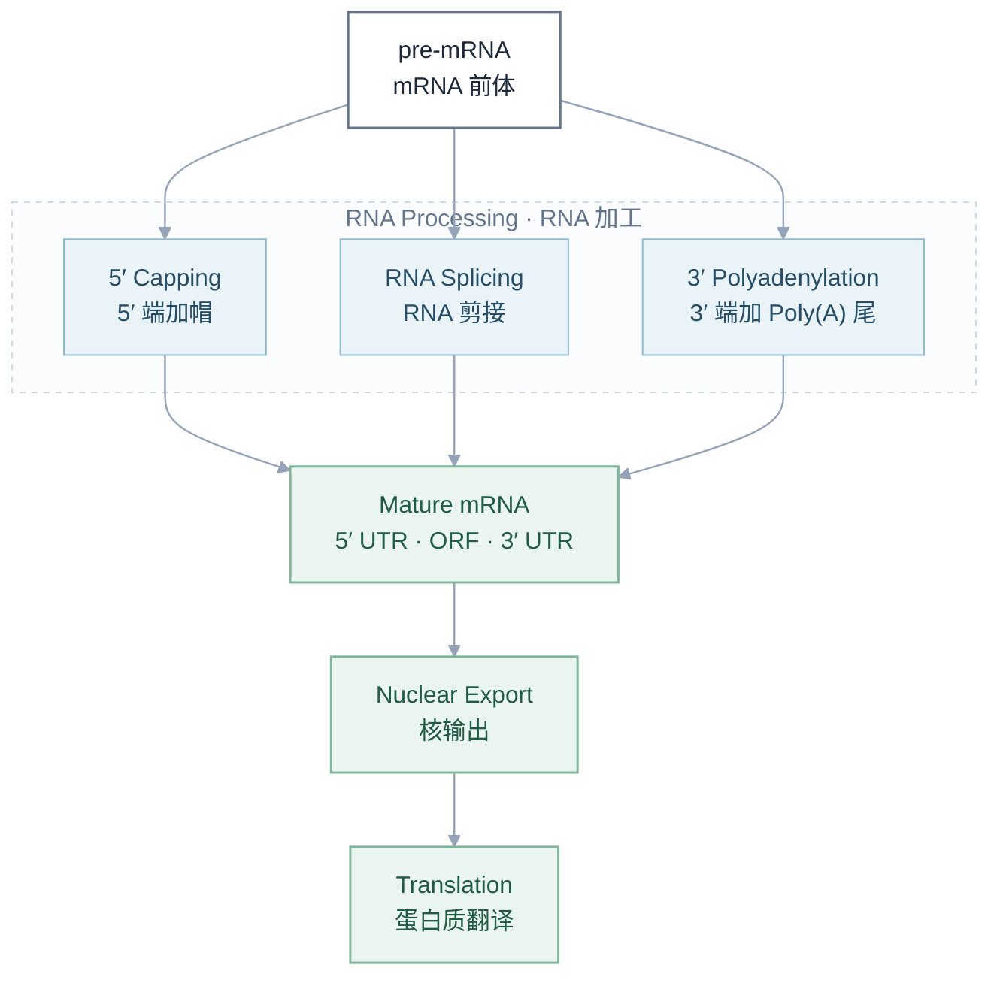
```mermaid
flowchart TB
    A["pre-mRNA<br/>mRNA 前体"]

    subgraph PROCESS["RNA Processing · RNA 加工"]
        direction LR
        B["5′ Capping<br/>5′ 端加帽"]
        C["RNA Splicing<br/>RNA 剪接"]
        D["3′ Polyadenylation<br/>3′ 端加 Poly(A) 尾"]
    end

    E["Mature mRNA<br/>5′ UTR · ORF · 3′ UTR"]
    F["Nuclear Export<br/>核输出"]
    G["Translation<br/>蛋白质翻译"]

    A --> B
    A --> C
    A --> D

    B --> E
    C --> E
    D --> E

    E --> F --> G

    classDef main fill:#FFFFFF,stroke:#64748B,color:#1E293B,stroke-width:1.5px
    classDef step fill:#EAF3F8,stroke:#90B9CE,color:#254D65,stroke-width:1px
    classDef result fill:#EAF5EF,stroke:#80B49B,color:#205C43,stroke-width:1.5px

    class A main
    class B,C,D step
    class E,F,G result

    style PROCESS fill:#FAFCFD,stroke:#CBD5E1,stroke-dasharray:4 4,color:#64748B

    linkStyle default stroke:#94A3B8,stroke-width:1.2px
```

核酶（ribozyme）
- 核酶是指一类具有催化功能的RNA分子，通过催化靶位点RNA链中磷酸二酯键的断裂，特异性地剪切底物RNA分子，从而阻断基因的表达。
- 其催化能力与其特定的一些结构紧密相关，比如核酶的锤头结构，三个茎环区，其间有一个11-13个保守核苷酸构成的催
化中心，同时也可以进行自我切割
- 核酶的分类
  1. 剪切型核酶，只剪但不接
  2. 剪接型核酶，又剪又接
- 核酶的生物学意义
  - 继逆转录现象之后对中心法则的又一个重要添加，说明RNA既是遗传物质又是酶
  - 核酶的发现为生命起源的研究提供了新思路，也许曾经存在以RNA为基础的原始生命。照这么说，蛋白质世界也可能（仅仅是可能）起源于RNA世界

## 从mRNA到蛋白质

蛋白质是生物信息通路上的终产物，一个活细胞的任何发育阶段都需要数千种不同的蛋白质，活细胞内时刻进行着各种蛋白质的合成、修饰以及降解反应。

*翻译：将mRNA链上的核苷酸从一个特定的起始位点开始，按每三个核苷酸代表一个氨基酸的原则，依次合成一条多肽链的过程*

蛋白质的生物合成
- 场所：核糖体
- 模板：mRNA
- tRNA是模版与氨基酸之间的接合体
- 蛋白质合成需要多种蛋白质，酶和其他生物大分子
- 非常耗能，能量消耗大概占80-90% of the cell’s energy

编码蛋白质的RNA的比例非常低

遗传密码——三联子
- 贮存在DNA上的遗传信息通过mRNA传递到蛋白质上，mRNA与蛋白质之间的联系是通过遗传密码的破译来实现的
- *遗传密码：mRNA上每3个核苷酸翻译成多肽链上的一个氨基酸，这3个核苷酸称为一个密码子（三联子密码）。*

**Codon** is a triplet of nucleotides that represents an amino acid or a termination signal.Genetic code is the correspondence between triplets in DNA (or RNA) and amino acids in protein.

**Initiation codon** is a special codon (usually AUG) used to start synthesis of a protein.

**ORF** is an open reading frame; presumed likely to code for a protein.

**Reading frame** is one of three possible ways of reading a nucleotide sequence as a series of triplets.

**Termination codon** is one of three (UAG, UAA, UGA) that causes protein synthesis to terminat

- start codon：AUG

一个RNA分子可以以三种可能的阅读框进行翻译，但是实际上只有一种阅读框编码实际信息

三联子密码及其破译
- 为什么是三联体？
  - 如果1个碱基编码1个氨基酸 → 只有4种可能，不够
  - 如果2个碱基编码1个氨基酸 → 4²=16种，仍不够
  - 如果3个碱基编码1个氨基酸 → 4³=64种，足够
- Gamow提出Diamond Code，认为密码子是重叠的，后续通过移码突变发现并非

> 用核苷酸的插入或删除实验证明mRNA模板上每三个核苷酸组成一个密码子。
> - 当插入1个或者2个氨基酸的时候，蛋白质的功能都发生改变/不能正常表达
> - 插入三个之后有时候就仍会出现有功能的蛋白质

- 制备E.coli无细胞合成体系

> - 细胞裂解，添加DNA酶防止新的DNA的生成
> - Add homopolymeric synthetic mRNAs [poly(U)] + 19 cold (non-labeled) and one labeled aminoacids
> - 多核苷酸磷酸化酶: 在没有模版的情况下将核苷酸连接起来
> - 无细胞体系中Mg2+的浓度很高: 不需要起始密码子就能指导多肽的生物合成

- 核糖体结合技术: 诱捕核苷酸

> - 以人工合成的三核苷酸如UUU、UCU、UGU等为模板，在含核糖体、同位素标记的AA-tRNA的适当离子强度的反应液中保温后通过硝酸纤维素滤膜。
> - 游离的AA-tRNA因相对分子质量小能自由过膜，与14C标记模板对应的AA-tRNA能与核糖体结合，体积超过膜上的微孔17 而被滞留。
>
> 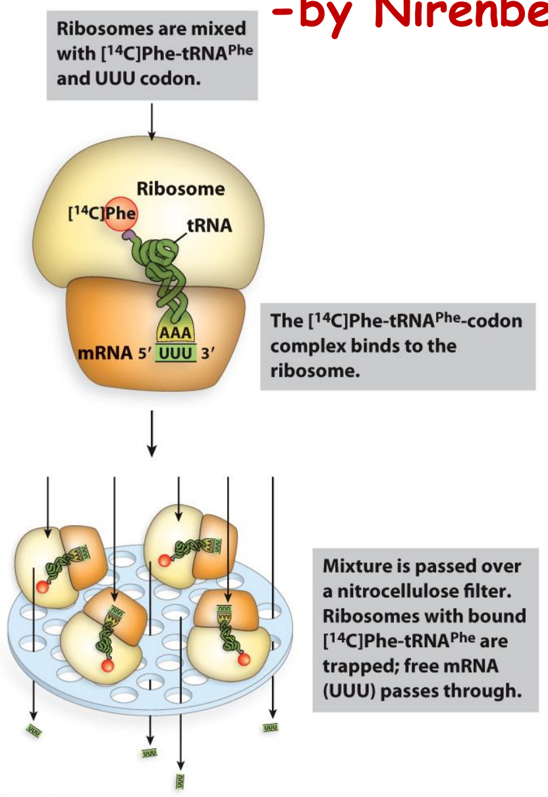
>

遗传密码的性质
1. 密码的连续性(commaless)
  - 三个核苷酸编码一个氨基酸
  - 三联体是不重叠的和连续的
2. 密码的简并性(degeneracy)
  - 4种核苷酸可组成64个密码子: 61个是编码氨基酸的密码子；3个即UAA、UGA和UAG是终止密码子
  - *由一种以上密码子编码同一个氨基酸的现象称为简并（degeneracy）*
  - *同义密码子(synonymous codon)：对应于同一氨基酸的密码子*
  - 第三个氨基酸的简并性，突变、颠换第三位氨基酸造成的不一样最少
  - 但第一位都会有明显的影响
  > - AUG→甲硫氨酸及起始密码子
  > - GUG→缬氨酸及起始密码子
  > - UAA→终止密码子(Ochre 赭石)
  > - UAG→终止密码子(Amber 琥珀)
  > - UGA→终止密码子(Opal 欧泊)
3. 密码的普遍性(universality)
  - 生物界基本共用同一套遗传密码。
4. 密码的特殊性(specificity)
  
  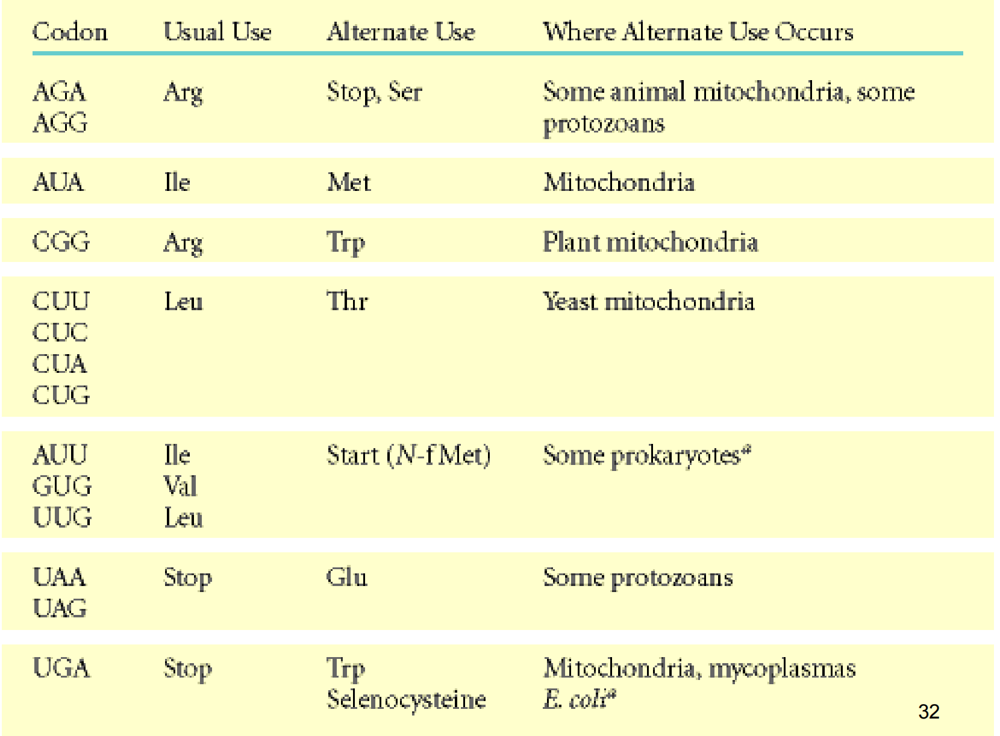

5. 密码子与反密码子的相互作用 
  - tRNA的反密码子在核糖体内是通过碱基的反向配对(3'&5')与mRNA上的密码子相互作用的。
  - Wobble hypothesis: 前两对严格遵守碱基配对原则，第三对碱基有一定的自由度，可以“摆动”，因而使某些tRNA可以识别1个以上的密码子
  - **一个tRNA究竟能识别多少个密码子是由反密码子的第一位碱基的性质决定的**

### tRNA
- 为每个三联密码子翻译成氨基酸提供了接合体
- 为准确无误地将所需氨基酸运送到核糖体上提供了运送载体->第二遗传密码

tRNA一级结构(primary structure)
- 长度: 60-95 nt (commonly 76)
- 残基: 15 个invariant (恒定) 和 8个 semi-invariant (半恒定). invariant 和 semi-variant 核苷的位置在二级结构和三级结构中起着重要的作用。
- 含有修饰碱基(Modified bases): 有时一个tRNA分子的 20% 的碱基是经过修饰的，四种碱基都可以被修饰

tRNA二级结构(secondary structure)
- 不同tRNA在结构上存在大量的共性，由小片段碱基互补配对形成三叶草形分子结构：4条手臂和三个环
- 受体臂（acceptor arm）由链两端序列配对形成的杆状结构和3’端未配对的3～4个碱基所组成。
  - 其3’ 端的最后3个碱基序列永远是CCA，最后一个碱基的3’或2’自由羟基(-OH)可以被氨酰化（携带氨基酸）
- D-arm and D-loop：D臂中存在多至3个可变核苷酸位点
- Anticodon loop：由5 bp的臂和7个核苷的环组成。在环中有与密码子互补的由3个核苷组成的反密码子
- Variable arm and T-arm：根据3个核苷酸命名的，其中ψ表示拟尿嘧啶；由5bp臂和含有GTΨC的环组成。
- Extra arm：是由3到21个核苷组成，可能会形成多达7bp的臂。

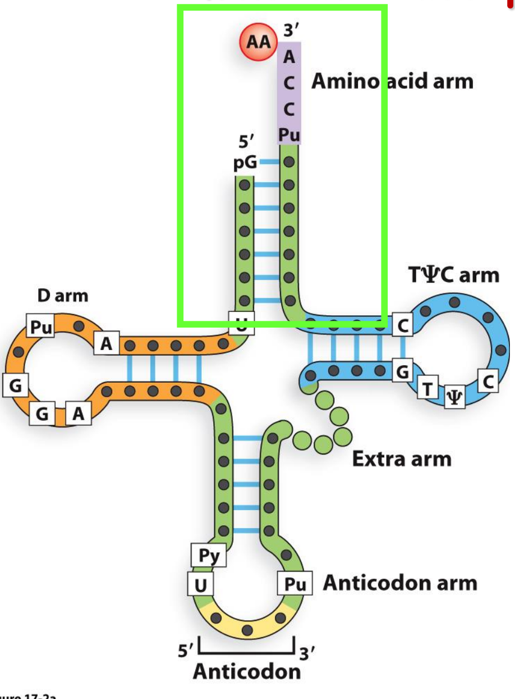

tRNA的L-形三级结构

- tRNA三级结构主要由在二级结构中未配对碱基间形成的9个氢键而引发的。
- 大部分恒定或半恒定核苷酸都参与氢键的形成。

tRNA的功能
- 只有tRNA上的反密码子能与mRNA上的密码子相互识别并配对
- 氨基酸本身不能识别密码子，只有结合到tRNA上生成AA-tRNA,才能被带到mRNA-核糖体复合物上,插入到正在合成的多肽链的适当位置上。

tRNA的种类
- 起始tRNA和延伸tRNA
  - *起始tRNA: 能特异性识别mRNA模板上起始密码子的tRNA*;
  - *延伸tRNA:其他tRNA统称为延伸tRNA*
  - 真核生物起始tRNA携带甲硫氨酸(Met)，
  - 原核生物起始tRNA携带甲酰甲硫氨酸(fMet)，所以要先被甲酰化
- 同工tRNA
  - 同工tRNA：代表相同氨基酸的不同tRNA
- 校正tRNA
  - 校正tRNA通过改变反密码子区校正无义突变和错义突变，即校正 tRNA 通过改变反密码子，识别原本错误的密码子（终止密码子、错义密码子或移码位点），并插入合适氨基酸，从而在翻译水平上部分纠正基因突变的影响